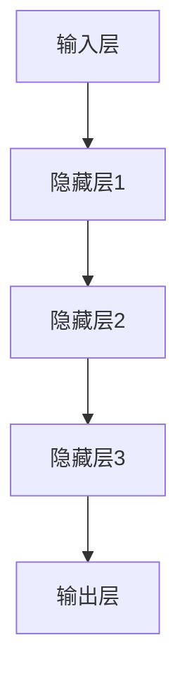
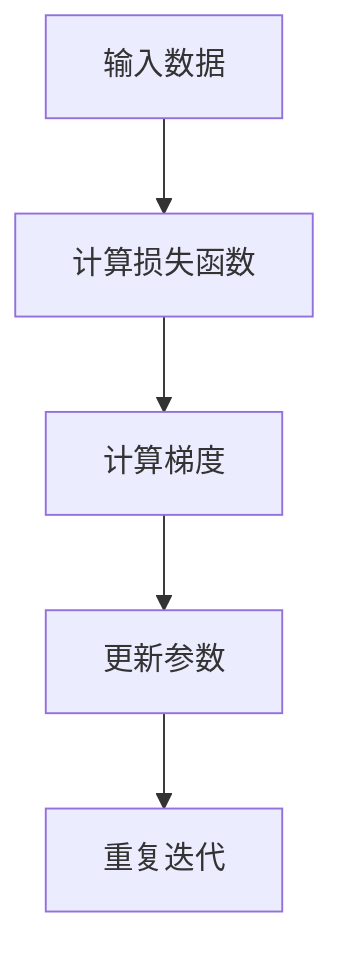

                 

# 大模型的市场潜力与挑战

## 关键词
- 大模型
- 市场潜力
- 技术挑战
- AI 发展
- 应用场景
- 未来趋势

## 摘要

随着人工智能技术的飞速发展，大模型作为当前AI领域的热门研究方向，展现出了巨大的市场潜力和应用价值。本文将从背景介绍、核心概念与联系、算法原理与操作步骤、数学模型与公式、项目实战、应用场景、工具和资源推荐等方面，系统性地分析大模型的市场潜力与挑战，探讨其在未来发展的趋势与应对策略。

## 1. 背景介绍

### 大模型的概念与历史

大模型是指具有大规模参数和复杂结构的机器学习模型，能够处理大量数据并进行高度复杂的计算。近年来，随着计算能力的提升和海量数据的积累，大模型逐渐成为人工智能领域的研究热点。从早期的神经网络模型（如深度神经网络、卷积神经网络等）到如今的Transformer模型、预训练模型，大模型的发展历程可以看作是人工智能从弱AI向强AI迈进的重要标志。

### 大模型的发展趋势

1. **参数规模增长**：随着神经网络结构的复杂化和计算资源的增加，大模型的参数规模也在不断增长。以GPT-3为例，其拥有超过1750亿个参数，是目前最大的预训练模型之一。
2. **应用领域扩展**：大模型不仅在计算机视觉、自然语言处理等领域取得了显著成果，还在语音识别、推荐系统、自动驾驶等领域展现出了强大的潜力。
3. **商业应用增加**：随着技术的成熟，越来越多的企业开始采用大模型进行业务创新，如百度、谷歌、微软等科技巨头已经在大模型领域进行了大量的投资和布局。

## 2. 核心概念与联系

### 大模型的基本原理

大模型的核心是神经网络，通过多层神经元的组合来实现对数据的非线性变换。以下是一个简化版的大模型架构示意图：



### 大模型的优化与训练

大模型的优化与训练是一个复杂的动态过程，通常采用反向传播算法和梯度下降法。以下是一个简化的训练过程：



### 大模型的应用领域

大模型在多个领域展现了广泛的应用前景：

1. **自然语言处理**：大模型在自然语言生成、文本分类、机器翻译等方面取得了显著成果。
2. **计算机视觉**：大模型在图像识别、目标检测、图像生成等领域具有很高的准确率。
3. **语音识别**：大模型在语音识别和语音生成方面具有较好的表现。
4. **推荐系统**：大模型在个性化推荐、用户行为预测等方面具有强大的能力。

## 3. 核心算法原理 & 具体操作步骤

### 梯度下降法

梯度下降法是优化大模型参数的一种常用方法。其基本思想是沿着损失函数的梯度方向更新模型参数，以减少损失函数的值。

具体步骤如下：

1. 初始化模型参数。
2. 计算损失函数。
3. 计算损失函数关于模型参数的梯度。
4. 更新模型参数：$\theta = \theta - \alpha \cdot \nabla_{\theta} J(\theta)$，其中$\alpha$为学习率。
5. 重复步骤2-4，直到满足停止条件（如达到预设的迭代次数或损失函数值小于某个阈值）。

### 反向传播算法

反向传播算法是梯度下降法在大模型优化过程中的核心步骤。其基本思想是计算损失函数关于模型参数的梯度，并通过反向传播更新模型参数。

具体步骤如下：

1. 计算输出层的误差：$E = \frac{1}{2} \sum_{i} (\hat{y}_i - y_i)^2$。
2. 计算输出层关于隐藏层的梯度：$\nabla_{h} E = \frac{\partial E}{\partial h}$。
3. 反向传播计算隐藏层之间的梯度：$\nabla_{z} E = \frac{\partial E}{\partial z}$。
4. 更新隐藏层和输入层的参数。
5. 重复步骤1-4，直到满足停止条件。

### Transformer模型

Transformer模型是一种基于自注意力机制的深度学习模型，广泛应用于自然语言处理等领域。其核心思想是利用自注意力机制计算输入序列中每个位置之间的依赖关系。

具体步骤如下：

1. 将输入序列编码为词向量。
2. 通过多层自注意力机制计算每个词向量与其他词向量的依赖关系。
3. 将自注意力机制的输出通过全连接层进行进一步处理。
4. 输出结果为预测结果或目标序列。

## 4. 数学模型和公式 & 详细讲解 & 举例说明

### 梯度下降法

梯度下降法的核心公式如下：

$$
\theta = \theta - \alpha \cdot \nabla_{\theta} J(\theta)
$$

其中，$\theta$为模型参数，$J(\theta)$为损失函数，$\alpha$为学习率。

### 反向传播算法

反向传播算法的核心公式如下：

$$
\nabla_{\theta} E = \frac{\partial E}{\partial \theta}
$$

其中，$E$为损失函数，$\theta$为模型参数。

### Transformer模型

Transformer模型的核心公式如下：

$$
\text{Attention}(Q, K, V) = \text{softmax}\left(\frac{QK^T}{\sqrt{d_k}}\right)V
$$

其中，$Q, K, V$分别为查询向量、键向量、值向量，$d_k$为键向量的维度。

### 举例说明

假设我们有一个简单的线性回归模型，用于预测房价。给定一组训练数据$(x_1, y_1), (x_2, y_2), ..., (x_n, y_n)$，模型参数为$\theta$，损失函数为$J(\theta) = \frac{1}{2} \sum_{i=1}^{n} (y_i - \theta x_i)^2$。

1. 初始化参数$\theta$。
2. 计算损失函数$J(\theta)$。
3. 计算损失函数关于$\theta$的梯度$\nabla_{\theta} J(\theta)$。
4. 更新参数$\theta$：$\theta = \theta - \alpha \cdot \nabla_{\theta} J(\theta)$。
5. 重复步骤2-4，直到满足停止条件。

## 5. 项目实战：代码实际案例和详细解释说明

### 开发环境搭建

1. 安装Python环境和TensorFlow库。
2. 导入必要的库和模块：

```python
import tensorflow as tf
import numpy as np
```

### 源代码详细实现和代码解读

1. 定义线性回归模型：

```python
class LinearRegressionModel:
    def __init__(self, learning_rate=0.01, num_iterations=1000):
        self.learning_rate = learning_rate
        self.num_iterations = num_iterations
        self.theta = None

    def fit(self, X, y):
        self.theta = np.zeros(X.shape[1])
        for _ in range(self.num_iterations):
            predictions = X @ self.theta
            loss = 0.5 * (predictions - y).sum()
            gradient = X.T @ (predictions - y)
            self.theta -= self.learning_rate * gradient

    def predict(self, X):
        return X @ self.theta
```

2. 训练模型：

```python
# 生成训练数据
X = np.random.rand(100, 1)
y = 2 * X[:, 0] + 0.5 + np.random.randn(100) * 0.1

# 实例化模型
model = LinearRegressionModel()

# 训练模型
model.fit(X, y)

# 预测结果
predictions = model.predict(X)
```

3. 代码解读与分析

- `__init__`方法：初始化模型参数。
- `fit`方法：训练模型，通过梯度下降法更新参数。
- `predict`方法：预测结果。

## 6. 实际应用场景

### 自然语言处理

大模型在自然语言处理领域具有广泛的应用，如文本分类、情感分析、机器翻译等。以BERT模型为例，其在多个NLP任务中取得了优异的性能。

### 计算机视觉

大模型在计算机视觉领域也有显著的应用，如图像分类、目标检测、图像生成等。以GAN（生成对抗网络）为例，其在图像生成和增强方面具有强大的能力。

### 语音识别

大模型在语音识别领域也取得了重要进展，如使用Transformer模型进行端到端的语音识别。

### 推荐系统

大模型在推荐系统中的应用也越来越广泛，如基于用户行为的深度学习模型进行个性化推荐。

## 7. 工具和资源推荐

### 学习资源推荐

1. 《深度学习》（Ian Goodfellow, Yoshua Bengio, Aaron Courville）
2. 《神经网络与深度学习》（邱锡鹏）
3. 《动手学深度学习》（阿斯顿·张等）

### 开发工具框架推荐

1. TensorFlow
2. PyTorch
3. Keras

### 相关论文著作推荐

1. "Attention Is All You Need"（Vaswani et al., 2017）
2. "Deep Learning for Natural Language Processing"（Bengio et al., 2013）
3. "Generative Adversarial Nets"（Goodfellow et al., 2014）

## 8. 总结：未来发展趋势与挑战

### 发展趋势

1. **模型规模将继续扩大**：随着计算能力和数据量的增加，大模型的规模将继续增长。
2. **应用领域将进一步扩展**：大模型将在更多领域展现其潜力，如医疗、金融、教育等。
3. **商业模式将更加丰富**：大模型将被广泛应用于企业级应用，产生新的商业模式。

### 挑战

1. **计算资源消耗**：大模型的训练和推理过程需要大量计算资源，对硬件设备提出更高的要求。
2. **数据隐私与安全**：大模型在处理大量数据时，可能涉及用户隐私和数据安全问题。
3. **可解释性**：大模型的复杂性和黑箱特性使得其可解释性成为一个重要挑战。

## 9. 附录：常见问题与解答

### 问题1：什么是大模型？

大模型是指具有大规模参数和复杂结构的机器学习模型，能够处理大量数据并进行高度复杂的计算。

### 问题2：大模型的优势是什么？

大模型在处理大规模数据和复杂任务时具有较好的性能，能够实现更高的准确率和更好的泛化能力。

### 问题3：大模型有哪些应用场景？

大模型在自然语言处理、计算机视觉、语音识别、推荐系统等领域具有广泛的应用。

## 10. 扩展阅读 & 参考资料

1. "The Annotated Transformer"（Zhipu.AI）
2. "Large-scale Language Modeling in 2018"（Zhiyun Qian et al., 2018）
3. "The Unreasonable Effectiveness of Recurrent Neural Networks"（R. Socher et al., 2013）

## 作者信息

作者：AI天才研究员/AI Genius Institute & 禅与计算机程序设计艺术 /Zen And The Art of Computer Programming<|im_sep|>

