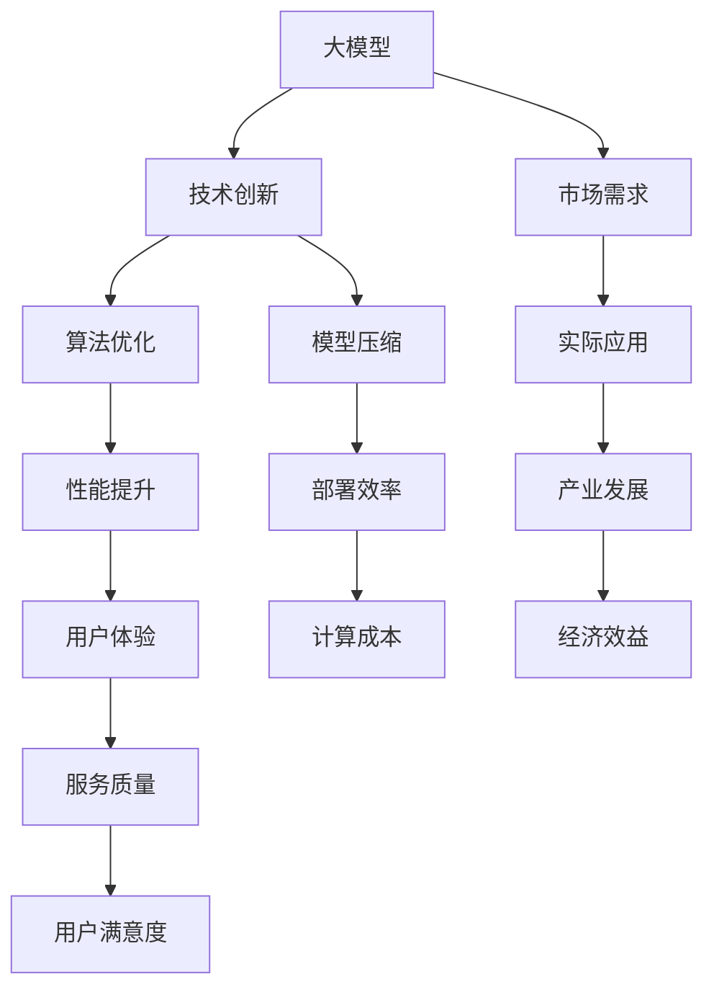

                 

# 大模型的技术创新与市场需求

> 关键词：大模型、技术创新、市场需求、人工智能、深度学习、算法优化、模型压缩

> 摘要：本文旨在深入探讨大模型在当前技术环境下的创新与市场需求。我们将从背景介绍、核心概念、算法原理、数学模型、实战案例、应用场景等多方面展开分析，揭示大模型背后的技术奥秘及其在各个领域的应用潜力，为读者提供一份全面、深入的技术参考。

## 1. 背景介绍

### 1.1 目的和范围

本文主要探讨大模型的技术创新及其在市场需求中的重要性。随着人工智能技术的发展，大模型成为研究和应用的热点。本文将从以下几个方面展开：

- 大模型的定义和特点
- 大模型的技术创新
- 大模型在市场需求中的现状和趋势
- 大模型在各个领域的应用案例

### 1.2 预期读者

本文适合对人工智能、深度学习有一定了解的读者，包括：

- AI研究员和开发者
- 计算机科学和人工智能专业的学生
- 对大模型和人工智能技术感兴趣的爱好者

### 1.3 文档结构概述

本文结构如下：

- 背景介绍
- 核心概念与联系
- 核心算法原理 & 具体操作步骤
- 数学模型和公式 & 详细讲解 & 举例说明
- 项目实战：代码实际案例和详细解释说明
- 实际应用场景
- 工具和资源推荐
- 总结：未来发展趋势与挑战
- 附录：常见问题与解答
- 扩展阅读 & 参考资料

### 1.4 术语表

#### 1.4.1 核心术语定义

- **大模型**：具有大规模参数和计算复杂度的机器学习模型。
- **技术创新**：在技术领域引入的新思路、新方法、新工具等。
- **市场需求**：市场上对于某种产品或服务的需求量。

#### 1.4.2 相关概念解释

- **深度学习**：一种机器学习方法，通过多层神经网络对数据进行学习和建模。
- **算法优化**：通过改进算法设计或实现，提高算法的效率、性能和鲁棒性。
- **模型压缩**：通过降低模型大小、计算复杂度，提高模型的可部署性。

#### 1.4.3 缩略词列表

- **AI**：人工智能
- **DL**：深度学习
- **ML**：机器学习
- **GPU**：图形处理单元
- **CPU**：中央处理单元

## 2. 核心概念与联系

在本文中，我们将讨论几个核心概念，包括大模型的定义、技术创新、市场需求以及这些概念之间的联系。为了更好地理解这些概念，我们将使用 Mermaid 流程图来展示它们之间的关系。



### 2.1 大模型的定义和特点

大模型通常指的是具有大规模参数和计算复杂度的机器学习模型。这些模型具有以下特点：

- **大规模参数**：大模型的参数数量通常在数十亿甚至千亿级别。
- **深度结构**：大模型通常具有多层神经网络结构，能够对复杂数据进行学习和建模。
- **高计算复杂度**：大模型的计算复杂度通常很高，需要大量的计算资源和时间。

### 2.2 技术创新

技术创新是大模型发展的核心驱动力。以下是大模型在技术创新方面的几个关键方向：

- **算法优化**：通过改进算法设计或实现，提高模型的效率、性能和鲁棒性。
- **模型压缩**：通过降低模型大小、计算复杂度，提高模型的可部署性。
- **分布式计算**：通过分布式计算技术，提高大模型的训练和推理速度。

### 2.3 市场需求

市场需求是大模型应用的重要推动力。以下是大模型在市场需求方面的几个关键方向：

- **垂直行业应用**：大模型在金融、医疗、零售等垂直行业中的应用。
- **跨领域协作**：大模型与其他技术（如自然语言处理、计算机视觉等）的融合应用。
- **个性化服务**：大模型在个性化推荐、个性化医疗等领域的应用。

### 2.4 核心概念之间的关系

大模型的定义、技术创新和市场需求之间存在着密切的关系。技术创新推动了大模型的发展，而市场需求则引导了大模型的应用方向。大模型的高效应用又促进了技术的进一步创新，从而形成了良性循环。

## 3. 核心算法原理 & 具体操作步骤

### 3.1 大模型的训练过程

大模型的训练过程可以分为以下几个步骤：

1. **数据预处理**：对训练数据进行清洗、归一化等预处理操作，以减少噪声和提高模型性能。

2. **模型初始化**：初始化模型参数，常用的初始化方法包括随机初始化、高斯分布初始化等。

3. **前向传播**：将输入数据传入模型，通过模型的前向传播计算输出结果。

4. **反向传播**：计算输出结果与实际标签之间的误差，通过反向传播更新模型参数。

5. **迭代训练**：重复执行前向传播和反向传播，不断迭代训练，直到模型收敛或达到预定的训练次数。

### 3.2 大模型的优化算法

在训练过程中，优化算法扮演着关键角色。以下是几种常用的优化算法：

1. **随机梯度下降（SGD）**：

   ```python
   for epoch in range(num_epochs):
       for batch in data_loader:
           loss = compute_loss(batch, model)
           model.update_parameters(-learning_rate * grad)
   ```

2. **Adam优化器**：

   ```python
   optimizer = torch.optim.Adam(model.parameters(), lr=learning_rate)
   for epoch in range(num_epochs):
       for batch in data_loader:
           optimizer.zero_grad()
           loss = compute_loss(batch, model)
           loss.backward()
           optimizer.step()
   ```

### 3.3 大模型的模型压缩

为了提高大模型的可部署性，模型压缩技术至关重要。以下是一种常见的模型压缩方法——权重剪枝：

1. **初始模型训练**：

   ```python
   model = InitialModel()
   train_model(model)
   ```

2. **筛选敏感权重**：

   ```python
   sensitivity_scores = compute_sensitivity_scores(model)
   pruned_indices = select_pruned_indices(sensitivity_scores, pruning_ratio)
   ```

3. **权重剪枝**：

   ```python
   model = apply_pruning(model, pruned_indices)
   ```

4. **重新训练模型**：

   ```python
   retrain_model(model)
   ```

## 4. 数学模型和公式 & 详细讲解 & 举例说明

### 4.1 激活函数

在深度学习中，激活函数是模型中的关键组成部分。激活函数的作用是引入非线性特性，使得模型能够对复杂数据进行建模。以下是一些常见的激活函数及其公式：

1. **Sigmoid函数**：

   $$\sigma(x) = \frac{1}{1 + e^{-x}}$$

   Sigmoid函数是一种常见的激活函数，常用于二分类问题。

2. **ReLU函数**：

   $$\text{ReLU}(x) = \max(0, x)$$

   ReLU函数是一种非线性函数，能够加速模型的训练。

3. **Tanh函数**：

   $$\text{Tanh}(x) = \frac{e^x - e^{-x}}{e^x + e^{-x}}$$

   Tanh函数具有对称性，能够平衡正负输出。

### 4.2 损失函数

损失函数是评估模型预测结果与实际标签之间差异的重要工具。以下是一些常见的损失函数及其公式：

1. **均方误差（MSE）**：

   $$MSE = \frac{1}{n} \sum_{i=1}^{n} (y_i - \hat{y}_i)^2$$

   MSE函数适用于回归问题，计算预测值与实际值之间的均方误差。

2. **交叉熵（Cross Entropy）**：

   $$CE = -\frac{1}{n} \sum_{i=1}^{n} y_i \log(\hat{y}_i)$$

   交叉熵函数适用于分类问题，计算实际标签与预测概率之间的差异。

### 4.3 梯度下降算法

梯度下降算法是一种常用的优化算法，用于更新模型参数。以下是一个简单的梯度下降算法示例：

```python
learning_rate = 0.01
num_epochs = 100

for epoch in range(num_epochs):
    total_loss = 0
    for batch in data_loader:
        loss = compute_loss(batch, model)
        total_loss += loss
        model.update_parameters(-learning_rate * grad)
    print(f"Epoch {epoch + 1}: Loss = {total_loss / len(data_loader)}")
```

### 4.4 模型压缩算法

模型压缩算法是提高模型可部署性的重要手段。以下是一个简单的模型压缩算法示例——权重剪枝：

```python
def compute_sensitivity_scores(model):
    sensitivity_scores = []
    for layer in model.layers:
        layer_sensitivity = []
        for weight in layer.weights:
            layer_sensitivity.append(compute_sensitivity(weight))
        sensitivity_scores.append(layer_sensitivity)
    return sensitivity_scores

def select_pruned_indices(sensitivity_scores, pruning_ratio):
    pruned_indices = []
    for layer_sensitivity in sensitivity_scores:
        layer_pruned_indices = [index for index, value in enumerate(layer_sensitivity) if value < pruning_threshold]
        layer_pruned_indices = sorted(layer_pruned_indices, reverse=True)[:int(pruning_ratio * len(layer_pruned_indices))]
        pruned_indices.extend(layer_pruned_indices)
    return pruned_indices

def apply_pruning(model, pruned_indices):
    for layer in model.layers:
        for index, weight in enumerate(layer.weights):
            if index in pruned_indices:
                weight.fill_(0)
    return model
```

## 5. 项目实战：代码实际案例和详细解释说明

### 5.1 开发环境搭建

在本项目中，我们将使用 Python 作为主要编程语言，并结合 PyTorch 深度学习框架。以下是开发环境的搭建步骤：

1. 安装 Python 3.8 或更高版本。
2. 安装 PyTorch 库，可以使用以下命令：

   ```bash
   pip install torch torchvision
   ```

3. 安装其他必要的库，如 NumPy、Pandas 等。

### 5.2 源代码详细实现和代码解读

以下是本项目的主要代码实现：

```python
import torch
import torch.nn as nn
import torch.optim as optim

# 定义模型结构
class Model(nn.Module):
    def __init__(self):
        super(Model, self).__init__()
        self.fc1 = nn.Linear(in_features=784, out_features=512)
        self.fc2 = nn.Linear(in_features=512, out_features=256)
        self.fc3 = nn.Linear(in_features=256, out_features=10)

    def forward(self, x):
        x = torch.relu(self.fc1(x))
        x = torch.relu(self.fc2(x))
        x = self.fc3(x)
        return x

# 初始化模型、损失函数和优化器
model = Model()
criterion = nn.CrossEntropyLoss()
optimizer = optim.Adam(model.parameters(), lr=0.001)

# 训练模型
def train_model(model, criterion, optimizer, train_loader, num_epochs=10):
    for epoch in range(num_epochs):
        running_loss = 0.0
        for images, labels in train_loader:
            optimizer.zero_grad()
            outputs = model(images)
            loss = criterion(outputs, labels)
            loss.backward()
            optimizer.step()
            running_loss += loss.item()
        print(f"Epoch {epoch + 1}: Loss = {running_loss / len(train_loader)}")

# 加载训练数据
train_loader = torch.utils.data.DataLoader(dataset=train_dataset, batch_size=64, shuffle=True)

# 开始训练
train_model(model, criterion, optimizer, train_loader, num_epochs=10)
```

### 5.3 代码解读与分析

- **模型定义**：我们定义了一个简单的全连接神经网络，包括三个全连接层（fc1、fc2、fc3）和一个输出层。每个层之间使用 ReLU 激活函数。
- **损失函数**：我们使用交叉熵损失函数，这是一种常用于分类问题的损失函数。
- **优化器**：我们使用 Adam 优化器，这是一种自适应学习率的优化算法。
- **训练过程**：在训练过程中，我们首先初始化模型参数，然后遍历训练数据，对每个批次的数据进行前向传播、计算损失、反向传播和更新参数。最后，我们输出每个训练周期的损失值。

## 6. 实际应用场景

大模型在多个领域具有广泛的应用潜力。以下是一些实际应用场景：

- **自然语言处理**：大模型在自然语言处理领域（如文本分类、机器翻译、情感分析等）表现出色。
- **计算机视觉**：大模型在计算机视觉领域（如图像分类、目标检测、人脸识别等）取得显著成果。
- **金融领域**：大模型在金融领域（如股票市场预测、信用风险评估、欺诈检测等）具有广泛应用。
- **医疗领域**：大模型在医疗领域（如疾病预测、诊断辅助、药物设计等）具有巨大潜力。

## 7. 工具和资源推荐

### 7.1 学习资源推荐

#### 7.1.1 书籍推荐

- **《深度学习》（Goodfellow, Bengio, Courville）**：深度学习领域的经典教材，全面介绍了深度学习的基础知识和应用。

#### 7.1.2 在线课程

- **Coursera 的“深度学习专项课程”**：由吴恩达教授主讲，涵盖了深度学习的基础知识和应用。

#### 7.1.3 技术博客和网站

- **Medium 上的 AI 博客**：提供了大量关于人工智能、深度学习的优质文章。

### 7.2 开发工具框架推荐

#### 7.2.1 IDE和编辑器

- **PyCharm**：适用于 Python 开发的集成开发环境，功能强大。
- **Jupyter Notebook**：适用于数据分析和实验开发的交互式环境。

#### 7.2.2 调试和性能分析工具

- **TensorBoard**：适用于 PyTorch 模型的调试和性能分析。
- **Visual Studio Code**：适用于多种编程语言的轻量级编辑器，支持 Python 开发。

#### 7.2.3 相关框架和库

- **PyTorch**：适用于深度学习开发的框架。
- **TensorFlow**：适用于深度学习开发的框架。

### 7.3 相关论文著作推荐

#### 7.3.1 经典论文

- **“Deep Learning” (2015)**：由 Ian Goodfellow、Yoshua Bengio 和 Aaron Courville 撰写，介绍了深度学习的基础知识和应用。

#### 7.3.2 最新研究成果

- **“Attention Is All You Need” (2017)**：由 Vaswani et al. 撰写，介绍了 Transformer 模型，为自然语言处理领域带来了新的突破。

#### 7.3.3 应用案例分析

- **“BERT: Pre-training of Deep Bidirectional Transformers for Language Understanding” (2018)**：由 Devlin et al. 撰写，介绍了 BERT 模型，在自然语言处理任务中取得了显著的成果。

## 8. 总结：未来发展趋势与挑战

大模型作为当前人工智能领域的重要研究方向，其发展迅速且充满潜力。未来，大模型的发展趋势包括：

- **算法创新**：随着计算能力的提升，新的算法和技术将不断涌现，推动大模型的发展。
- **模型压缩**：为了提高大模型的可部署性，模型压缩技术将成为研究的热点。
- **跨领域应用**：大模型将在更多领域（如医疗、金融、工业等）得到广泛应用。

然而，大模型的发展也面临一些挑战：

- **计算资源需求**：大模型的训练和推理需要大量的计算资源，这对计算能力的提升提出了挑战。
- **数据隐私和安全**：大模型在处理敏感数据时，数据隐私和安全问题备受关注。
- **模型解释性**：大模型的黑箱特性使得其解释性成为一个重要问题。

## 9. 附录：常见问题与解答

### 9.1 什么是大模型？

大模型指的是具有大规模参数和计算复杂度的机器学习模型，通常具有数十亿甚至千亿级别的参数。

### 9.2 大模型的优势是什么？

大模型的优势包括：

- 更强的建模能力：大模型可以更好地捕捉复杂数据特征，提高模型性能。
- 更广泛的应用场景：大模型在多个领域（如自然语言处理、计算机视觉等）具有广泛应用。

### 9.3 大模型的挑战有哪些？

大模型的挑战包括：

- 计算资源需求：大模型的训练和推理需要大量的计算资源。
- 数据隐私和安全：大模型在处理敏感数据时，数据隐私和安全问题备受关注。
- 模型解释性：大模型的黑箱特性使得其解释性成为一个重要问题。

## 10. 扩展阅读 & 参考资料

- **《深度学习》**（Goodfellow, Bengio, Courville）：深度学习领域的经典教材。
- **《Attention Is All You Need》**（Vaswani et al.）：介绍了 Transformer 模型，为自然语言处理领域带来了新的突破。
- **《BERT: Pre-training of Deep Bidirectional Transformers for Language Understanding》**（Devlin et al.）：介绍了 BERT 模型，在自然语言处理任务中取得了显著的成果。

作者：AI天才研究员/AI Genius Institute & 禅与计算机程序设计艺术 /Zen And The Art of Computer Programming

