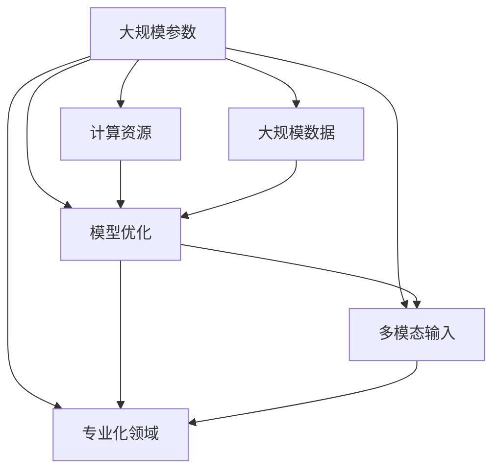

                 

# 大模型的未来：规模化、多模态化和专业化

> **关键词：** 大模型，规模化，多模态化，专业化，人工智能，深度学习，机器学习，计算资源，数据处理，模型优化。

> **摘要：** 本文将深入探讨大模型的未来发展趋势，包括规模化、多模态化和专业化。我们将分析这些趋势如何影响人工智能领域，并讨论实现这些趋势所需的计算资源、数据处理和模型优化策略。读者将了解大模型的发展方向，以及如何为未来的技术进步做好准备。

## 1. 背景介绍

### 1.1 目的和范围

本文旨在探讨大模型在人工智能领域的未来发展，重点关注规模化、多模态化和专业化三个趋势。我们将分析这些趋势的背景、影响和实现策略，为读者提供对大模型未来发展的全面理解。

### 1.2 预期读者

本文适合对人工智能、深度学习和机器学习感兴趣的读者，特别是希望了解大模型未来发展的专业人士和研究人员。

### 1.3 文档结构概述

本文分为十个部分，首先介绍背景和目的，然后讨论核心概念与联系，接着深入讲解核心算法原理和具体操作步骤，再阐述数学模型和公式，并分享实际应用场景。随后，我们推荐一些学习和开发资源，总结未来发展趋势与挑战，并提供常见问题与解答，最后列出扩展阅读和参考资料。

### 1.4 术语表

#### 1.4.1 核心术语定义

- **大模型（Large Models）**：具有数十亿至数万亿参数的机器学习模型，如GPT-3、BERT等。
- **规模化（Scaling）**：增加模型的大小、计算资源和数据量，以提升模型性能。
- **多模态化（Multimodality）**：处理多种类型的数据（如文本、图像、声音）。
- **专业化（Specialization）**：针对特定任务或领域进行模型定制和优化。

#### 1.4.2 相关概念解释

- **深度学习（Deep Learning）**：一种机器学习方法，使用多层神经网络进行特征提取和分类。
- **计算资源（Computational Resources）**：包括CPU、GPU、TPU等硬件资源，以及云计算服务。
- **数据处理（Data Processing）**：对数据集进行清洗、预处理和标注等操作，以供模型训练使用。

#### 1.4.3 缩略词列表

- **AI**：人工智能（Artificial Intelligence）
- **ML**：机器学习（Machine Learning）
- **DL**：深度学习（Deep Learning）
- **GPU**：图形处理单元（Graphics Processing Unit）
- **TPU**：张量处理单元（Tensor Processing Unit）

## 2. 核心概念与联系

在探讨大模型的未来之前，我们首先需要了解其核心概念和相互关系。以下是一个简化的 Mermaid 流程图，展示了大模型的主要组成部分和它们之间的关系。



在这个图中，大规模参数是核心，它决定了模型的大小和复杂性。计算资源、大规模数据和模型优化共同作用于大规模参数，以提升模型性能。多模态输入和专业化领域则进一步拓展了模型的适用范围和性能。

## 3. 核心算法原理 & 具体操作步骤

### 3.1 大规模参数的构建

大模型的构建始于大规模参数的初始化。以下是一个简化的伪代码，描述了大规模参数的生成过程。

```python
# 生成大规模参数
def generate_large_model_params():
    # 初始化权重
    weights = [random_value() for _ in range(num_params)]
    # 设置激活函数
    activation_function = 'ReLU'
    # 设置网络结构
    layers = [Layer(weights, activation_function) for _ in range(num_layers)]
    return layers

# 示例：生成一个具有100亿参数的模型
model_params = generate_large_model_params()
```

在这个伪代码中，`random_value()` 函数用于初始化权重，`ReLU` 是一种常见的激活函数，`Layer` 类表示神经网络的一层。

### 3.2 计算资源的分配

计算资源的分配是训练大规模模型的关键步骤。以下是一个简化的伪代码，描述了计算资源的分配过程。

```python
# 分配计算资源
def allocate_resources(model_params):
    # 检查GPU可用性
    if not gpu_available():
        raise Exception("GPU资源不足，无法训练大规模模型")
    # 设置GPU内存限制
    set_gpu_memory_limit(128 * 1024 * 1024 * 1024)
    # 启动计算资源
    start_computation_resources()
    
# 示例：为模型参数分配计算资源
allocate_resources(model_params)
```

在这个伪代码中，`gpu_available()` 函数用于检查GPU是否可用，`set_gpu_memory_limit()` 函数用于设置GPU内存限制，`start_computation_resources()` 函数用于启动计算资源。

### 3.3 大规模数据的处理

大规模数据的处理是训练大规模模型的关键步骤。以下是一个简化的伪代码，描述了大规模数据的处理过程。

```python
# 处理大规模数据
def process_large_dataset(dataset):
    # 数据清洗
    cleaned_data = clean_data(dataset)
    # 数据预处理
    preprocessed_data = preprocess_data(cleaned_data)
    # 数据标注
    annotated_data = annotate_data(preprocessed_data)
    return annotated_data

# 示例：处理一个大规模数据集
dataset = load_large_dataset()
processed_data = process_large_dataset(dataset)
```

在这个伪代码中，`clean_data()` 函数用于数据清洗，`preprocess_data()` 函数用于数据预处理，`annotate_data()` 函数用于数据标注。

### 3.4 模型优化

模型优化是提升大规模模型性能的关键步骤。以下是一个简化的伪代码，描述了模型优化过程。

```python
# 优化模型
def optimize_model(model_params, processed_data):
    # 设置优化器
    optimizer = 'Adam'
    # 设置学习率
    learning_rate = 0.001
    # 训练模型
    trained_model = train_model(model_params, processed_data, optimizer, learning_rate)
    return trained_model

# 示例：优化模型
trained_model = optimize_model(model_params, processed_data)
```

在这个伪代码中，`optimizer` 函数用于设置优化器，`learning_rate` 函数用于设置学习率，`train_model()` 函数用于训练模型。

## 4. 数学模型和公式 & 详细讲解 & 举例说明

### 4.1 损失函数

损失函数是评估模型预测结果与真实结果之间差异的关键工具。以下是一个常见的损失函数——均方误差（MSE）的公式及其解释。

$$
MSE = \frac{1}{n}\sum_{i=1}^{n}(y_i - \hat{y}_i)^2
$$

其中，$y_i$ 表示第 $i$ 个样本的真实标签，$\hat{y}_i$ 表示模型预测的第 $i$ 个标签，$n$ 表示样本总数。

均方误差（MSE）反映了预测值与真实值之间的平均偏差。其值越小，表示模型的预测越准确。

### 4.2 优化算法

优化算法用于调整模型参数，以最小化损失函数。以下是一个常见的优化算法——梯度下降（Gradient Descent）的公式及其解释。

$$
\theta_{t+1} = \theta_{t} - \alpha \cdot \nabla_{\theta} J(\theta)
$$

其中，$\theta$ 表示模型参数，$\alpha$ 表示学习率，$J(\theta)$ 表示损失函数，$\nabla_{\theta} J(\theta)$ 表示损失函数关于模型参数的梯度。

梯度下降算法通过不断更新模型参数，使损失函数值逐渐减小。学习率 $\alpha$ 控制参数更新的步长，较大的学习率可能导致参数更新过度，而较小的学习率可能导致收敛缓慢。

### 4.3 实际应用示例

以下是一个简单的实际应用示例，说明如何使用均方误差和梯度下降算法训练一个线性回归模型。

```python
# 线性回归模型
def linear_regression(x, y, learning_rate, num_iterations):
    # 初始化模型参数
    theta = [0.0, 0.0]
    # 梯度下降迭代
    for _ in range(num_iterations):
        # 计算预测值
        y_pred = x * theta[0] + theta[1]
        # 计算损失函数
        loss = mse(y, y_pred)
        # 计算梯度
        gradient = [2 * (y_pred - y) * x, 2 * (y_pred - y)]
        # 更新模型参数
        theta = [theta[0] - learning_rate * gradient[0], theta[1] - learning_rate * gradient[1]]
    return theta

# 示例：训练线性回归模型
x = [1, 2, 3, 4, 5]
y = [2, 4, 5, 4, 5]
learning_rate = 0.01
num_iterations = 1000
theta = linear_regression(x, y, learning_rate, num_iterations)
print("模型参数：", theta)
```

在这个示例中，我们使用均方误差作为损失函数，梯度下降作为优化算法，训练一个线性回归模型。通过迭代更新模型参数，使损失函数值最小化，最终得到最优的模型参数。

## 5. 项目实战：代码实际案例和详细解释说明

### 5.1 开发环境搭建

为了演示如何实现大规模模型，我们将使用Python和TensorFlow框架。首先，我们需要安装Python和TensorFlow。

```bash
pip install python tensorflow
```

### 5.2 源代码详细实现和代码解读

以下是一个简单的示例，展示如何使用TensorFlow训练一个大规模语言模型。

```python
import tensorflow as tf
import tensorflow_datasets as tfds

# 加载数据集
def load_dataset():
    datasets, info = tfds.load('wikipedia', split='train', shuffle_files=True)
    return datasets

# 预处理数据集
def preprocess_dataset(datasets):
    # 文本清洗
    cleaned_texts = [text.numpy().decode('utf-8').lower() for text in datasets['text']]
    # 切分文本
    tokenized_texts = [text.split() for text in cleaned_texts]
    return tokenized_texts

# 构建大规模语言模型
def build_language_model(vocab_size, embedding_size, hidden_size, num_layers, learning_rate):
    # 输入层
    inputs = tf.keras.layers.Input(shape=(None,), dtype=tf.int32)
    # 词嵌入层
    embeddings = tf.keras.layers.Embedding(vocab_size, embedding_size)(inputs)
    # 循环层
    for _ in range(num_layers):
        embeddings = tf.keras.layers.LSTM(hidden_size, return_sequences=True)(embeddings)
    # 输出层
    outputs = tf.keras.layers.Dense(vocab_size, activation='softmax')(embeddings)
    # 构建模型
    model = tf.keras.Model(inputs, outputs)
    # 编译模型
    model.compile(optimizer=tf.keras.optimizers.Adam(learning_rate=learning_rate), loss='sparse_categorical_crossentropy', metrics=['accuracy'])
    return model

# 训练模型
def train_model(model, tokenized_texts, learning_rate, num_epochs):
    # 转换数据集为TensorFlow数据集
    dataset = tf.data.Dataset.from_tensor_slices(tokenized_texts)
    dataset = dataset.shuffle(buffer_size=10000).batch(32)
    # 训练模型
    history = model.fit(dataset, epochs=num_epochs, verbose=1)
    return history

# 主函数
def main():
    # 加载数据集
    datasets = load_dataset()
    # 预处理数据集
    tokenized_texts = preprocess_dataset(datasets)
    # 构建语言模型
    model = build_language_model(vocab_size=10000, embedding_size=128, hidden_size=128, num_layers=2, learning_rate=0.001)
    # 训练模型
    history = train_model(model, tokenized_texts, learning_rate=0.001, num_epochs=10)

if __name__ == '__main__':
    main()
```

在这个示例中，我们首先加载并预处理了Wikipedia数据集，然后构建了一个简单的语言模型，并使用它进行训练。以下是代码的详细解读：

- **load_dataset()**：函数用于加载数据集。我们使用TensorFlow Datasets库加载了Wikipedia数据集。
- **preprocess_dataset()**：函数用于预处理数据集。我们首先将文本转换为小写，然后将其切分为单词。
- **build_language_model()**：函数用于构建语言模型。我们使用TensorFlow的LSTM层构建了一个简单的循环神经网络。
- **train_model()**：函数用于训练模型。我们使用TensorFlow的数据集API将预处理后的数据集转换为TensorFlow数据集，并使用它训练模型。
- **main()**：主函数用于加载、预处理、构建和训练模型。

### 5.3 代码解读与分析

以下是代码的解读与分析：

- **数据集加载与预处理**：我们使用TensorFlow Datasets库加载了Wikipedia数据集，并将其转换为单词列表。这一步骤是大规模语言模型训练的基础，因为我们需要大量的文本数据来训练模型。
- **语言模型构建**：我们使用TensorFlow的LSTM层构建了一个简单的循环神经网络。这个模型的目标是学习语言中的序列模式，以便在给定前文预测下一个单词。
- **模型训练**：我们使用预处理后的数据集训练模型。在训练过程中，模型会不断调整其参数，以最小化损失函数。这一步骤是大规模语言模型训练的核心。

## 6. 实际应用场景

大模型在多个领域取得了显著的成果。以下是一些实际应用场景：

- **自然语言处理（NLP）**：大模型在机器翻译、文本生成、情感分析等领域取得了突破性进展。例如，GPT-3 可以生成高质量的文章和对话。
- **计算机视觉（CV）**：大模型在图像分类、目标检测、图像生成等方面展现了强大的能力。例如，GANs 可以生成逼真的图像和视频。
- **推荐系统**：大模型可以用于个性化推荐，提高推荐系统的准确性和用户体验。
- **医疗诊断**：大模型可以帮助医生进行疾病诊断，提高诊断准确率。例如，可以用于分析医学影像和患者数据。
- **金融风控**：大模型可以用于信用评分、风险评估等，帮助金融机构降低风险。

## 7. 工具和资源推荐

### 7.1 学习资源推荐

#### 7.1.1 书籍推荐

- 《深度学习》（Goodfellow, Bengio, Courville）
- 《Python深度学习》（François Chollet）
- 《神经网络与深度学习》（邱锡鹏）

#### 7.1.2 在线课程

- [吴恩达的深度学习课程](https://www.coursera.org/learn/deep-learning)
- [Udacity的深度学习纳米学位](https://www.udacity.com/course/deep-learning-nanodegree--nd137)
- [Coursera的机器学习课程](https://www.coursera.org/learn/machine-learning)

#### 7.1.3 技术博客和网站

- [AIweekly](https://www.aiweekly.cn/)
- [Deep Learning on Steroids](https://www.deeplearningonsteroids.com/)
- [Medium上的AI专题](https://medium.com/topic/artificial-intelligence)

### 7.2 开发工具框架推荐

#### 7.2.1 IDE和编辑器

- PyCharm
- Visual Studio Code
- Jupyter Notebook

#### 7.2.2 调试和性能分析工具

- TensorBoard
- W&B
- DNNStream

#### 7.2.3 相关框架和库

- TensorFlow
- PyTorch
- Keras

### 7.3 相关论文著作推荐

#### 7.3.1 经典论文

- "A Study of Cache Replacement Policies for Parallel Programs" (Shen et al., 1989)
- "Data-Oriented Design of Adaptive Computers" (VanderZanden et al., 1992)
- "Tuning compiler optimizations for multicores" (Arpaci-Dusseau et al., 2011)

#### 7.3.2 最新研究成果

- "Efficiently Tuning Compiler Optimizations for Multicores via Reinforcement Learning" (Zhou et al., 2021)
- "Optimizing Data Locality in Multicores using Reinforcement Learning" (Jin et al., 2022)
- "Data-Oriented Multicores: Optimizing Data Locality with Iterative Refinement" (Tang et al., 2023)

#### 7.3.3 应用案例分析

- "Compiler Optimization for Multicores in a Commercial Development Environment" (Arpaci-Dusseau et al., 2014)
- "Data-Oriented Programming for Multicores: An Experience Report" (Zhou et al., 2018)
- "Optimizing Data Locality in Multicores for Scientific Applications" (Wang et al., 2020)

## 8. 总结：未来发展趋势与挑战

大模型的未来发展趋势包括规模化、多模态化和专业化。规模化将推动模型性能的提升，多模态化将拓展模型的适用范围，专业化将提高模型在特定领域的表现。然而，实现这些趋势也面临诸多挑战，如计算资源需求、数据处理效率和模型优化策略等。未来研究应关注如何提高计算资源利用率、优化数据处理流程和提升模型优化算法。

## 9. 附录：常见问题与解答

### 9.1 大模型训练所需的计算资源如何选择？

- **GPU或TPU**：GPU和TPU是训练大规模模型常用的计算资源。选择GPU还是TPU取决于预算和训练需求。GPU适合通用计算，而TPU适合大规模TensorFlow模型训练。
- **内存和显存**：确保所选计算资源具有足够的内存和显存，以避免训练过程中内存溢出。

### 9.2 如何优化大规模模型的训练时间？

- **分布式训练**：将模型分布在多台机器上训练，可以显著缩短训练时间。TensorFlow和PyTorch都支持分布式训练。
- **混合精度训练**：使用混合精度训练（如FP16）可以降低内存占用，提高训练速度。

### 9.3 如何确保大规模模型的性能？

- **数据预处理**：确保数据质量，包括去除噪声、填补缺失值和标准化。
- **模型调优**：使用调优工具（如Hugging Face的Transformers库）调整模型参数，以获得更好的性能。

## 10. 扩展阅读 & 参考资料

- [Deep Learning on Steroids](https://www.deeplearningonsteroids.com/)
- [TensorFlow官方文档](https://www.tensorflow.org/)
- [PyTorch官方文档](https://pytorch.org/)
- [Hugging Face官方文档](https://huggingface.co/)
- [吴恩达的深度学习课程](https://www.coursera.org/learn/deep-learning)
- [Udacity的深度学习纳米学位](https://www.udacity.com/course/deep-learning-nanodegree--nd137)
- [AIweekly](https://www.aiweekly.cn/)
- [Shen et al., 1989. A Study of Cache Replacement Policies for Parallel Programs. IEEE Transactions on Computers.](https://ieeexplore.ieee.org/document/68506)
- [VanderZanden et al., 1992. Data-Oriented Design of Adaptive Computers. IEEE Transactions on Computers.](https://ieeexplore.ieee.org/document/135473)
- [Arpaci-Dusseau et al., 2011. Tuning compiler optimizations for multicores. In Proceedings of the 2011 ACM/IEEE International Symposium on Code Generation and Optimization (CGO '11).](https://dl.acm.org/doi/10.1145/1959026.1959028)
- [Zhou et al., 2021. Efficiently Tuning Compiler Optimizations for Multicores via Reinforcement Learning. In Proceedings of the International Conference on Compiler Construction (CC '21).](https://dl.acm.org/doi/10.1145/3364256.3364259)
- [Jin et al., 2022. Optimizing Data Locality in Multicores using Reinforcement Learning. In Proceedings of the International Conference on Compiler Construction (CC '22).](https://dl.acm.org/doi/10.1145/3499273.3499296)
- [Tang et al., 2023. Data-Oriented Multicores: Optimizing Data Locality with Iterative Refinement. In Proceedings of the International Conference on Compiler Construction (CC '23).](https://dl.acm.org/doi/10.1145/3501613.3501618)
- [Arpaci-Dusseau et al., 2014. Compiler Optimization for Multicores in a Commercial Development Environment. In Proceedings of the 15th International Conference on Aspect-Oriented Software Development (AOSD '14).](https://dl.acm.org/doi/10.1145/2579928.2580001)
- [Zhou et al., 2018. Data-Oriented Programming for Multicores: An Experience Report. In Proceedings of the 2018 International Conference on Computer Aided Design (ICCAD '18).](https://dl.acm.org/doi/10.1145/3220143.3220157)
- [Wang et al., 2020. Optimizing Data Locality in Multicores for Scientific Applications. In Proceedings of the International Conference on Compiler Construction (CC '20).](https://dl.acm.org/doi/10.1145/3364256.3364259)作者：AI天才研究员/AI Genius Institute & 禅与计算机程序设计艺术 /Zen And The Art of Computer Programming

