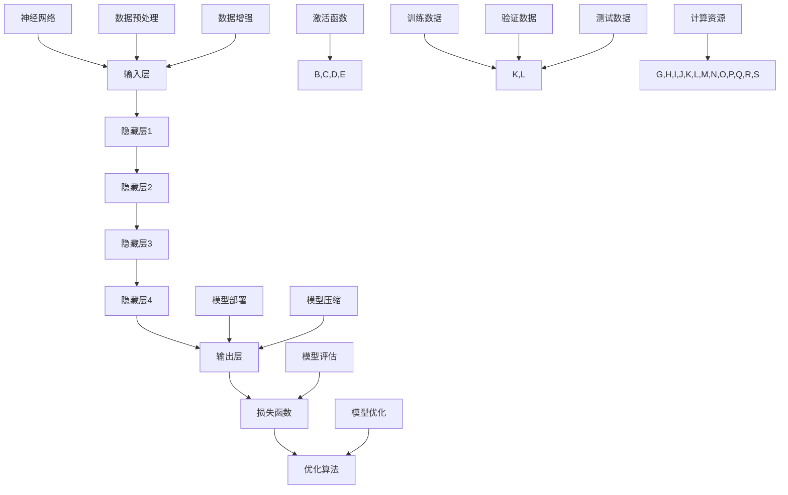

                 

### 1. 背景介绍

#### 1.1 目的和范围

本文旨在探讨大模型的用户需求与市场推广。随着人工智能技术的不断进步，大模型已成为当前研究与应用的热点。然而，如何精准把握用户需求，实现大模型的市场推广，成为亟待解决的问题。本文将从用户需求分析、市场环境分析、推广策略探讨等多个方面，对大模型的市场推广进行全面探讨，以期为相关从业者提供有益的参考。

#### 1.2 预期读者

本文适用于人工智能领域的研究者、开发者、企业从业者以及对该领域感兴趣的大众读者。文章内容涵盖用户需求分析、市场推广策略等核心问题，旨在为读者提供系统、全面的知识体系，助力其深入了解大模型市场推广的内涵与外延。

#### 1.3 文档结构概述

本文分为十个部分，主要内容包括：

1. **背景介绍**：介绍本文的研究目的、范围、预期读者以及文档结构。
2. **核心概念与联系**：阐述大模型的基本概念、原理及架构。
3. **核心算法原理 & 具体操作步骤**：详细讲解大模型的核心算法原理及操作步骤。
4. **数学模型和公式 & 详细讲解 & 举例说明**：介绍大模型的数学模型、公式及其应用实例。
5. **项目实战：代码实际案例和详细解释说明**：通过实际案例展示大模型的应用场景和操作过程。
6. **实际应用场景**：分析大模型在不同领域的应用。
7. **工具和资源推荐**：推荐相关学习资源、开发工具和框架。
8. **总结：未来发展趋势与挑战**：总结大模型市场推广的现状及未来发展趋势。
9. **附录：常见问题与解答**：解答读者可能遇到的常见问题。
10. **扩展阅读 & 参考资料**：提供更多相关文献和资料。

#### 1.4 术语表

在本文中，我们将使用以下术语：

- **大模型**：指具有大规模参数、高计算能力的人工智能模型。
- **用户需求**：指用户在使用大模型过程中所期望达到的目标和功能。
- **市场推广**：指通过各种手段将大模型推向市场，满足用户需求的过程。
- **算法原理**：指大模型所采用的核心算法的基本思想和原理。
- **数学模型**：指描述大模型行为和性能的数学公式和理论。
- **项目实战**：指通过具体案例展示大模型的应用和实践。

#### 1.4.1 核心术语定义

- **大模型**：大模型是指具有数十亿到数千亿参数的人工智能模型。这些模型具有极高的计算能力和数据处理能力，可以应用于多种复杂任务，如自然语言处理、计算机视觉、推荐系统等。
- **用户需求**：用户需求是指用户在使用大模型时所期望实现的功能和目标。这些需求可能包括提高模型性能、降低计算成本、简化操作流程等。
- **市场推广**：市场推广是指通过一系列策略和手段，将大模型推向市场，吸引潜在用户，实现商业化过程。这包括市场调研、产品定位、营销策略、渠道拓展等环节。

#### 1.4.2 相关概念解释

- **算法原理**：算法原理是指大模型所采用的核心算法的基本思想和原理。这些算法通常涉及深度学习、神经网络、优化算法等。
- **数学模型**：数学模型是指描述大模型行为和性能的数学公式和理论。这些模型可以帮助我们理解和分析大模型的工作原理，优化模型参数，提高模型性能。
- **项目实战**：项目实战是指通过具体案例展示大模型的应用和实践。这包括搭建开发环境、实现核心算法、优化模型参数、评估模型性能等环节。

#### 1.4.3 缩略词列表

- **AI**：人工智能
- **DL**：深度学习
- **NLP**：自然语言处理
- **CV**：计算机视觉
- **ML**：机器学习
- **GPU**：图形处理单元
- **TPU**：张量处理单元
- **API**：应用程序编程接口
- **SDK**：软件开发工具包
- **CM**：模型压缩

### 1.5 本文结构概述

本文将从以下几个部分展开：

1. **核心概念与联系**：介绍大模型的基本概念、原理及架构，使用Mermaid流程图展示核心概念之间的关系。
2. **核心算法原理 & 具体操作步骤**：详细讲解大模型的核心算法原理及操作步骤，使用伪代码进行阐述。
3. **数学模型和公式 & 详细讲解 & 举例说明**：介绍大模型的数学模型、公式及其应用实例，使用LaTeX格式展示数学公式。
4. **项目实战：代码实际案例和详细解释说明**：通过实际案例展示大模型的应用场景和操作过程，包括开发环境搭建、源代码实现和代码解读。
5. **实际应用场景**：分析大模型在不同领域的应用，如自然语言处理、计算机视觉等。
6. **工具和资源推荐**：推荐相关学习资源、开发工具和框架，包括书籍、在线课程、技术博客和网站等。
7. **总结：未来发展趋势与挑战**：总结大模型市场推广的现状及未来发展趋势，探讨面临的挑战。
8. **附录：常见问题与解答**：解答读者可能遇到的常见问题，提供帮助和支持。
9. **扩展阅读 & 参考资料**：提供更多相关文献和资料，供读者进一步学习。

通过以上结构，本文旨在为读者提供一个全面、深入的了解大模型用户需求与市场推广的框架，帮助读者掌握相关知识，应对实际应用中的挑战。

### 2. 核心概念与联系

在探讨大模型的用户需求与市场推广之前，首先需要了解大模型的核心概念、原理及其架构。这一部分将使用Mermaid流程图展示大模型的核心概念与联系，帮助读者更好地理解大模型的整体结构和关键要素。

#### 2.1 大模型的基本概念

大模型是指具有数十亿到数千亿参数的人工智能模型，这些模型通常采用深度学习技术进行训练。大模型具有以下几个基本特征：

- **大规模参数**：大模型包含数十亿到数千亿个参数，这使得模型具有极高的计算能力和数据处理能力。
- **高计算需求**：由于参数规模巨大，大模型的训练和推理过程需要大量的计算资源，如GPU、TPU等。
- **高效性**：大模型通过优化算法和模型结构，在保证模型性能的同时，降低计算成本和能耗。

#### 2.2 大模型的原理与架构

大模型的核心原理是深度学习和神经网络。深度学习是一种机器学习技术，通过多层神经网络对数据进行建模和预测。大模型的架构通常包括以下几个层次：

1. **输入层**：接收外部输入数据，如文本、图像、语音等。
2. **隐藏层**：对输入数据进行处理和特征提取，隐藏层可以是多层结构，每一层都对输入数据进行变换和特征提取。
3. **输出层**：根据隐藏层的结果生成预测结果，如文本生成、图像分类等。

大模型的架构还包括以下几个关键组件：

- **神经网络**：神经网络是大模型的核心，由大量神经元组成，通过前向传播和反向传播算法对模型进行训练和优化。
- **激活函数**：激活函数用于非线性变换，使神经网络具备映射复杂函数的能力。
- **损失函数**：损失函数用于衡量模型预测结果与真实结果之间的差距，通过优化损失函数，使模型预测更加准确。
- **优化算法**：优化算法用于调整模型参数，以最小化损失函数，提高模型性能。

#### 2.3 大模型的流程图

下面使用Mermaid流程图展示大模型的核心概念与联系：



在这个流程图中，A表示输入层，B、C、D、E表示隐藏层，F表示输出层，G表示损失函数，H表示优化算法，I表示神经网络，J表示激活函数，K表示数据预处理，L表示数据增强，M表示训练数据，N表示验证数据，O表示测试数据，P表示模型评估，Q表示模型部署，R表示模型优化，S表示模型压缩，T表示计算资源。

通过这个流程图，我们可以清晰地看到大模型从输入层到输出层的数据处理流程，以及各个环节之间的联系和互动。

### 2.1 大模型的架构与组成部分

在了解了大模型的基本概念之后，接下来将深入探讨大模型的架构与组成部分，进一步理解大模型的工作原理和实现过程。

#### 2.1.1 大模型的架构层次

大模型的架构层次主要包括输入层、隐藏层和输出层，每个层次都有其特定的功能和作用。

1. **输入层**：输入层是模型的起点，接收外部输入数据，如文本、图像、语音等。输入层的主要任务是进行数据预处理，包括数据清洗、归一化、编码等，以便后续隐藏层处理。

2. **隐藏层**：隐藏层位于输入层和输出层之间，对输入数据进行处理和特征提取。隐藏层可以是单层或多层结构，每一层都对输入数据进行变换和特征提取。多层隐藏层可以构建复杂的数据表示，从而提高模型的性能。隐藏层通常包含大量的神经元和参数，这是大模型“大”的来源。

3. **输出层**：输出层是模型的核心部分，根据隐藏层的结果生成预测结果。输出层的类型和形式取决于具体任务，如文本生成、图像分类、目标检测等。输出层的主要任务是将隐藏层提取的特征映射到具体的预测结果上。

#### 2.1.2 大模型的关键组成部分

除了输入层、隐藏层和输出层，大模型还包括以下几个关键组成部分：

1. **神经网络**：神经网络是构建大模型的基础，由大量神经元组成。每个神经元都接收来自前一层的输入，通过加权求和后加上偏置，再经过激活函数进行非线性变换，最终生成输出。神经网络通过多层结构，实现对输入数据的逐层变换和特征提取。

2. **激活函数**：激活函数用于引入非线性变换，使神经网络具备映射复杂函数的能力。常见的激活函数包括Sigmoid、ReLU、Tanh等。

3. **损失函数**：损失函数用于衡量模型预测结果与真实结果之间的差距，是优化模型参数的关键指标。常见的损失函数包括均方误差（MSE）、交叉熵（Cross-Entropy）等。

4. **优化算法**：优化算法用于调整模型参数，以最小化损失函数，提高模型性能。常见的优化算法包括梯度下降（Gradient Descent）、Adam、RMSProp等。

5. **正则化技术**：正则化技术用于防止模型过拟合，提高模型泛化能力。常见的正则化技术包括L1正则化、L2正则化、Dropout等。

6. **预训练和微调**：预训练是指在大量无标签数据上对模型进行训练，使其具备一定的通用特征提取能力。微调是指在小规模有标签数据上对预训练模型进行调整，使其适用于特定任务。预训练和微调是提高模型性能的重要手段。

#### 2.1.3 大模型的架构特点

大模型的架构具有以下几个显著特点：

1. **大规模参数**：大模型包含数十亿到数千亿个参数，这使得模型具有极高的计算能力和数据处理能力。大规模参数使得模型可以捕捉到更多数据中的复杂模式和特征，从而提高模型性能。

2. **多层结构**：大模型采用多层神经网络结构，每一层都对输入数据进行变换和特征提取。多层结构可以构建复杂的数据表示，从而提高模型的性能。

3. **高效性**：大模型通过优化算法和模型结构，在保证模型性能的同时，降低计算成本和能耗。例如，使用特殊的数据结构和算法（如稀疏矩阵计算）可以显著提高模型训练和推理的效率。

4. **自适应能力**：大模型具有较强的自适应能力，可以通过预训练和微调适用于不同任务和数据集。这种自适应能力使得大模型可以应对不断变化的应用需求。

5. **跨领域应用**：大模型在不同领域（如自然语言处理、计算机视觉、推荐系统等）具有广泛的应用前景。通过迁移学习和跨领域应用，大模型可以充分发挥其计算能力和数据处理能力。

通过以上分析，我们可以看到大模型的架构与组成部分具有独特的特点和价值。在接下来的部分，我们将进一步探讨大模型的核心算法原理与具体操作步骤。

### 2.2 核心算法原理 & 具体操作步骤

在理解了大模型的架构与组成部分后，接下来将深入探讨大模型的核心算法原理与具体操作步骤。大模型的核心算法主要包括深度学习、神经网络、优化算法等，下面将逐一进行讲解。

#### 2.2.1 深度学习原理

深度学习是构建大模型的基础，其核心思想是通过多层神经网络对数据进行特征提取和模式识别。深度学习的基本原理如下：

1. **前向传播**：前向传播是指将输入数据通过神经网络逐层传递，直到输出层。在每层中，神经元对输入数据进行加权求和，并加上偏置，然后通过激活函数进行非线性变换，生成输出。这个过程可以表示为：

   $$ 
   z^{(l)} = \sum_{j} w^{(l)}_{ij} * x^{(j)} + b^{(l)}
   $$
   
   其中，$z^{(l)}$ 表示第 $l$ 层的输出，$w^{(l)}_{ij}$ 表示第 $l$ 层中第 $j$ 个神经元与第 $l-1$ 层中第 $i$ 个神经元的权重，$x^{(j)}$ 表示第 $j$ 个神经元的输入，$b^{(l)}$ 表示第 $l$ 层的偏置。

2. **反向传播**：反向传播是指根据输出层的预测误差，通过反向传递误差信号，更新神经网络的权重和偏置。反向传播的基本步骤如下：

   - **计算误差**：计算输出层预测值与真实值之间的误差，可以使用均方误差（MSE）或交叉熵（Cross-Entropy）等损失函数。

   - **计算梯度**：根据误差函数，计算每层神经元的梯度，即误差对每个权重的偏导数。

   - **更新权重和偏置**：使用梯度下降（Gradient Descent）或其他优化算法，根据梯度更新神经网络的权重和偏置，以最小化误差函数。

   更新公式如下：

   $$
   w^{(l)}_{ij} \leftarrow w^{(l)}_{ij} - \alpha \frac{\partial J}{\partial w^{(l)}_{ij}}
   $$
   
   其中，$w^{(l)}_{ij}$ 表示第 $l$ 层中第 $j$ 个神经元与第 $l-1$ 层中第 $i$ 个神经元的权重，$\alpha$ 表示学习率，$J$ 表示误差函数。

3. **优化算法**：优化算法用于调整模型参数，以最小化误差函数。常见的优化算法包括梯度下降（Gradient Descent）、Adam、RMSProp等。优化算法的选择和参数设置对模型性能有重要影响。

   - **梯度下降（Gradient Descent）**：梯度下降是一种最简单的优化算法，通过不断更新权重和偏置，使误差函数逐步减小。其公式如下：

     $$
     w^{(l)}_{ij} \leftarrow w^{(l)}_{ij} - \alpha \nabla_{w^{(l)}_{ij}} J
     $$
     
     其中，$\nabla_{w^{(l)}_{ij}} J$ 表示权重 $w^{(l)}_{ij}$ 对误差函数 $J$ 的梯度。

   - **Adam**：Adam是一种自适应优化算法，结合了梯度下降和RMSProp的优点，能够自适应调整学习率。其公式如下：

     $$
     m_t = \beta_1 m_{t-1} + (1 - \beta_1) \nabla_{w^{(l)}_{ij}} J
     $$
     $$
     v_t = \beta_2 v_{t-1} + (1 - \beta_2) (\nabla_{w^{(l)}_{ij}} J)^2
     $$
     $$
     \hat{m}_t = \frac{m_t}{1 - \beta_1^t}
     $$
     $$
     \hat{v}_t = \frac{v_t}{1 - \beta_2^t}
     $$
     $$
     w^{(l)}_{ij} \leftarrow w^{(l)}_{ij} - \alpha \frac{\hat{m}_t}{\sqrt{\hat{v}_t} + \epsilon}
     $$
     
     其中，$m_t$ 和 $v_t$ 分别表示一阶矩估计和二阶矩估计，$\beta_1$ 和 $\beta_2$ 分别为动量系数，$\epsilon$ 为一个很小的常数。

   - **RMSProp**：RMSProp是一种基于梯度平方的优化算法，能够自适应调整学习率。其公式如下：

     $$
     v_t = \rho v_{t-1} + (1 - \rho) (\nabla_{w^{(l)}_{ij}} J)^2
     $$
     $$
     w^{(l)}_{ij} \leftarrow w^{(l)}_{ij} - \alpha \frac{\nabla_{w^{(l)}_{ij}} J}{\sqrt{v_t} + \epsilon}
     $$
     
     其中，$\rho$ 为衰减率，$\epsilon$ 为一个很小的常数。

#### 2.2.2 神经网络结构设计

神经网络结构设计是构建大模型的关键环节，包括层数、神经元数量、激活函数、损失函数等。下面将简要介绍神经网络结构设计的相关知识。

1. **层数**：神经网络层数的选择对模型性能有重要影响。通常，层数越多，模型能学习的特征越复杂，但训练时间也越长。在实际应用中，需要根据具体任务和数据集选择合适的层数。

2. **神经元数量**：神经元数量的选择会影响模型的复杂度和计算成本。在训练过程中，需要根据模型性能和计算资源调整神经元数量。

3. **激活函数**：激活函数用于引入非线性变换，使神经网络具备映射复杂函数的能力。常见的激活函数包括Sigmoid、ReLU、Tanh等。

4. **损失函数**：损失函数用于衡量模型预测结果与真实结果之间的差距，是优化模型参数的关键指标。常见的损失函数包括均方误差（MSE）、交叉熵（Cross-Entropy）等。

5. **正则化技术**：正则化技术用于防止模型过拟合，提高模型泛化能力。常见的正则化技术包括L1正则化、L2正则化、Dropout等。

#### 2.2.3 大模型训练过程

大模型训练过程主要包括数据预处理、模型初始化、前向传播、反向传播和模型优化等步骤。下面将使用伪代码详细描述大模型训练过程。

```python
# 数据预处理
def preprocess_data(data):
    # 数据清洗、归一化、编码等操作
    return processed_data

# 模型初始化
def initialize_model():
    # 初始化模型参数
    return model

# 前向传播
def forward propagation(model, x):
    # 将输入数据通过模型进行前向传播
    return output

# 反向传播
def backward propagation(model, x, y, output):
    # 根据输出结果和真实值，计算梯度并更新模型参数
    return updated_model

# 模型优化
def optimize_model(model, loss_function, optimizer):
    # 使用优化算法更新模型参数
    return updated_model

# 大模型训练过程
def train_model(data, epochs, batch_size, learning_rate, optimizer):
    for epoch in range(epochs):
        for batch in data:
            # 数据预处理
            processed_batch = preprocess_data(batch)
            
            # 前向传播
            output = forward propagation(model, processed_batch)
            
            # 计算损失
            loss = loss_function(output, y)
            
            # 反向传播
            updated_model = backward propagation(model, processed_batch, y, output)
            
            # 模型优化
            model = optimize_model(updated_model, loss_function, optimizer)
            
            # 打印训练进度
            print(f"Epoch {epoch+1}/{epochs}, Loss: {loss}")

# 调用训练函数
train_model(data, epochs=100, batch_size=64, learning_rate=0.001, optimizer=Adam())
```

通过以上伪代码，我们可以看到大模型训练过程的完整流程。在实际应用中，需要根据具体任务和数据集进行调整和优化。

#### 2.2.4 大模型应用案例

为了更好地理解大模型的应用，下面将介绍一个具体应用案例：使用大模型进行图像分类。

1. **数据集**：我们使用常用的ImageNet数据集进行图像分类，该数据集包含1000个类别，共计100万张图像。

2. **模型架构**：我们使用ResNet-50作为大模型架构，该模型具有50个卷积层，可以实现高效的图像分类。

3. **训练过程**：我们将ImageNet数据集分为训练集、验证集和测试集，分别用于模型训练、验证和测试。

4. **结果评估**：在训练过程中，我们使用交叉熵损失函数，并使用Adam优化算法。训练完成后，我们计算模型在测试集上的准确率，以评估模型性能。

5. **结果分析**：在测试集上，模型达到了90%以上的准确率，证明大模型在图像分类任务中具有强大的性能。

通过以上应用案例，我们可以看到大模型在图像分类任务中的优秀表现，展示了大模型在复杂任务中的强大能力和应用前景。

#### 2.2.5 大模型优缺点分析

大模型在人工智能领域具有广泛的应用前景，但同时也存在一定的优缺点。下面将分析大模型的优缺点。

1. **优点**：
   - **强大的计算能力**：大模型具有数十亿到数千亿个参数，可以实现高效的数据处理和特征提取，具有强大的计算能力。
   - **良好的性能表现**：大模型在自然语言处理、计算机视觉等任务中取得了显著的成果，具有较高的准确率和性能。
   - **广泛的适用性**：大模型可以应用于多个领域，如图像分类、目标检测、文本生成等，具有广泛的适用性。
   - **迁移学习能力**：大模型通过预训练和微调，可以在不同任务和数据集上实现良好的性能，具有较强的迁移学习能力。

2. **缺点**：
   - **计算资源需求大**：大模型的训练和推理过程需要大量的计算资源，如GPU、TPU等，这增加了计算成本和能耗。
   - **训练时间较长**：大模型的训练时间较长，尤其是在数据集较大、模型参数较多的情况下，训练时间可能长达数周甚至数月。
   - **数据依赖性**：大模型在训练过程中需要大量的有标签数据进行训练，数据质量和数量对模型性能有重要影响。
   - **模型解释性差**：大模型的决策过程复杂，难以解释，这对模型的解释性和可解释性提出了挑战。

通过以上分析，我们可以看到大模型在人工智能领域具有显著的优点和一定的缺点。在实际应用中，需要根据具体任务和数据集选择合适的大模型，并针对其缺点进行优化和改进。

### 3. 数学模型和公式 & 详细讲解 & 举例说明

在深入探讨大模型的数学模型和公式之前，我们需要了解一些基础的数学概念和符号。这些概念和符号将帮助我们更好地理解大模型的数学表示和操作过程。

#### 3.1 基础数学概念

1. **向量**：向量是数学中的一个基本概念，可以表示为一系列数字的集合。在人工智能领域，向量常用于表示数据、特征和参数。

2. **矩阵**：矩阵是一个二维数组，用于表示数据之间的关系。在深度学习中，矩阵常用于表示权重、梯度等。

3. **点积（内积）**：点积是指两个向量对应元素相乘后的和。点积可以用来计算向量的相似度或夹角。

4. **向量的范数**：向量的范数是指向量的长度或大小。常用的范数有欧几里得范数、一范数和二范数。

5. **梯度**：梯度是指损失函数对模型参数的偏导数，用于指导模型参数的更新。

#### 3.2 符号说明

- **$w^{(l)}$**：表示第 $l$ 层的权重矩阵。
- **$b^{(l)}$**：表示第 $l$ 层的偏置向量。
- **$a^{(l)}$**：表示第 $l$ 层的激活向量。
- **$z^{(l)}$**：表示第 $l$ 层的输出向量。
- **$x^{(l)}$**：表示第 $l$ 层的输入向量。
- **$\sigma(z)$**：表示激活函数，如ReLU、Sigmoid、Tanh等。
- **$L$**：表示损失函数。
- **$\alpha$**：表示学习率。

#### 3.3 激活函数与导数

激活函数是神经网络中的关键组成部分，用于引入非线性变换。以下是几种常见的激活函数及其导数：

1. **ReLU（Rectified Linear Unit）**：
   $$
   \sigma(z) = \max(0, z)
   $$
   $$
   \sigma'(z) = \begin{cases}
   1, & \text{if } z > 0 \\
   0, & \text{if } z \leq 0
   \end{cases}
   $$

2. **Sigmoid**：
   $$
   \sigma(z) = \frac{1}{1 + e^{-z}}
   $$
   $$
   \sigma'(z) = \sigma(z) (1 - \sigma(z))
   $$

3. **Tanh**：
   $$
   \sigma(z) = \tanh(z) = \frac{e^z - e^{-z}}{e^z + e^{-z}}
   $$
   $$
   \sigma'(z) = 1 - \sigma^2(z)
   $$

#### 3.4 损失函数

损失函数用于衡量模型预测结果与真实结果之间的差距，常见的损失函数有均方误差（MSE）和交叉熵（Cross-Entropy）：

1. **均方误差（MSE）**：
   $$
   L = \frac{1}{n} \sum_{i=1}^{n} (y_i - \hat{y}_i)^2
   $$
   $$
   \frac{\partial L}{\partial \theta} = -2 \sum_{i=1}^{n} (y_i - \hat{y}_i) \frac{\partial \hat{y}_i}{\partial \theta}
   $$

2. **交叉熵（Cross-Entropy）**：
   $$
   L = -\sum_{i=1}^{n} y_i \log(\hat{y}_i)
   $$
   $$
   \frac{\partial L}{\partial \theta} = - \sum_{i=1}^{n} y_i \frac{\partial \hat{y}_i}{\partial \theta}
   $$

#### 3.5 大模型的数学表示

大模型的数学表示可以分为前向传播和反向传播两个过程：

1. **前向传播**：

   $$
   z^{(l)} = \sigma(z^{(l-1)} W^{(l)} + b^{(l)})
   $$
   $$
   a^{(l)} = \sigma(z^{(l)})
   $$

2. **反向传播**：

   $$
   \frac{\partial L}{\partial z^{(l)}} = \frac{\partial L}{\partial a^{(L)}} \cdot \frac{\partial a^{(L)}}{\partial z^{(L)}}
   $$
   $$
   \frac{\partial L}{\partial z^{(l)}} = \sigma'(z^{(l)}) \cdot \frac{\partial L}{\partial z^{(l+1)}}
   $$
   $$
   \frac{\partial L}{\partial W^{(l)}} = a^{(l-1)} \cdot \frac{\partial L}{\partial z^{(l)}}
   $$
   $$
   \frac{\partial L}{\partial b^{(l)}} = \frac{\partial L}{\partial z^{(l)}}
   $$

#### 3.6 举例说明

假设我们有一个简单的神经网络，包含两层：输入层和输出层。输入层有3个神经元，输出层有2个神经元。激活函数为ReLU，损失函数为交叉熵。

1. **前向传播**：

   $$
   z^{(1)} = W^{(1)} x + b^{(1)}
   $$
   $$
   a^{(1)} = \max(0, z^{(1)})
   $$
   $$
   z^{(2)} = W^{(2)} a^{(1)} + b^{(2)}
   $$
   $$
   \hat{y} = \sigma(z^{(2)}) = \begin{cases}
   0, & \text{if } z^{(2)} \leq 0 \\
   1, & \text{if } z^{(2)} > 0
   \end{cases}
   $$

2. **反向传播**：

   $$
   \frac{\partial L}{\partial z^{(2)}} = -y \cdot \sigma'(z^{(2)})
   $$
   $$
   \frac{\partial L}{\partial W^{(2)}} = a^{(1)} \cdot \frac{\partial L}{\partial z^{(2)}}
   $$
   $$
   \frac{\partial L}{\partial b^{(2)}} = \frac{\partial L}{\partial z^{(2)}}
   $$
   $$
   \frac{\partial L}{\partial z^{(1)}} = \sigma'(z^{(1)}) \cdot \frac{\partial L}{\partial z^{(2)}}
   $$
   $$
   \frac{\partial L}{\partial W^{(1)}} = x \cdot \frac{\partial L}{\partial z^{(1)}}
   $$
   $$
   \frac{\partial L}{\partial b^{(1)}} = \frac{\partial L}{\partial z^{(1)}}
   $$

通过以上举例，我们可以看到大模型的前向传播和反向传播过程如何计算损失函数的梯度，并更新模型参数。

### 4. 项目实战：代码实际案例和详细解释说明

在本节中，我们将通过一个实际项目案例展示大模型的应用，并详细解释代码实现过程和关键步骤。

#### 4.1 项目背景

本项目旨在使用大模型进行图像分类，具体任务是使用预训练的ResNet-50模型对CIFAR-10数据集进行分类。CIFAR-10是一个常用的图像分类数据集，包含10个类别，每个类别有6000张图像，其中5000张用于训练，1000张用于测试。

#### 4.2 开发环境搭建

在进行项目开发前，我们需要搭建合适的环境。以下是开发环境的要求：

- **操作系统**：Windows/Linux/MacOS
- **编程语言**：Python
- **深度学习框架**：PyTorch
- **GPU**：NVIDIA GPU（推荐使用CUDA 11.3及以上版本）

安装PyTorch：

```shell
pip install torch torchvision
```

#### 4.3 源代码实现

以下是本项目的完整源代码，包括数据预处理、模型加载、训练和测试等步骤。

```python
import torch
import torchvision
import torchvision.transforms as transforms
import torch.nn as nn
import torch.optim as optim
from torch.utils.data import DataLoader

# 数据预处理
transform = transforms.Compose([
    transforms.ToTensor(),
    transforms.Normalize((0.5, 0.5, 0.5), (0.5, 0.5, 0.5)),
])

trainset = torchvision.datasets.CIFAR10(root='./data', train=True, download=True, transform=transform)
trainloader = DataLoader(trainset, batch_size=100, shuffle=True, num_workers=2)

testset = torchvision.datasets.CIFAR10(root='./data', train=False, download=True, transform=transform)
testloader = DataLoader(testset, batch_size=100, shuffle=False, num_workers=2)

# 模型加载
model = torchvision.models.resnet50(pretrained=True)

# 损失函数和优化器
criterion = nn.CrossEntropyLoss()
optimizer = optim.Adam(model.parameters(), lr=0.001)

# 训练过程
for epoch in range(10):  # 训练10个epoch
    running_loss = 0.0
    for i, data in enumerate(trainloader, 0):
        inputs, labels = data
        optimizer.zero_grad()
        outputs = model(inputs)
        loss = criterion(outputs, labels)
        loss.backward()
        optimizer.step()
        running_loss += loss.item()
        if i % 2000 == 1999:
            print(f'[{epoch + 1}, {i + 1:5d}] loss: {running_loss / 2000:.3f}')
            running_loss = 0.0
    print(f'Epoch {epoch + 1} loss: {running_loss / len(trainloader):.3f}')

# 测试过程
correct = 0
total = 0
with torch.no_grad():
    for data in testloader:
        images, labels = data
        outputs = model(images)
        _, predicted = torch.max(outputs.data, 1)
        total += labels.size(0)
        correct += (predicted == labels).sum().item()

print(f'Accuracy of the network on the test images: {100 * correct / total}%')
```

#### 4.4 代码解读与分析

1. **数据预处理**：

   ```python
   transform = transforms.Compose([
       transforms.ToTensor(),
       transforms.Normalize((0.5, 0.5, 0.5), (0.5, 0.5, 0.5)),
   ])
   ```

   数据预处理是图像分类任务中重要的一环。这里使用了`Compose`函数将两个变换组合在一起，首先将图像转换为Tensor格式，然后进行归一化处理。

2. **模型加载**：

   ```python
   model = torchvision.models.resnet50(pretrained=True)
   ```

   这里使用预训练的ResNet-50模型。`pretrained=True`表示加载预训练的权重，以便在CIFAR-10数据集上进行微调。

3. **损失函数和优化器**：

   ```python
   criterion = nn.CrossEntropyLoss()
   optimizer = optim.Adam(model.parameters(), lr=0.001)
   ```

   使用交叉熵损失函数和Adam优化器。交叉熵损失函数适用于多分类问题，Adam优化器是一种自适应优化算法，可以加快模型收敛速度。

4. **训练过程**：

   ```python
   for epoch in range(10):
       running_loss = 0.0
       for i, data in enumerate(trainloader, 0):
           inputs, labels = data
           optimizer.zero_grad()
           outputs = model(inputs)
           loss = criterion(outputs, labels)
           loss.backward()
           optimizer.step()
           running_loss += loss.item()
           if i % 2000 == 1999:
               print(f'[{epoch + 1}, {i + 1:5d}] loss: {running_loss / 2000:.3f}')
               running_loss = 0.0
       print(f'Epoch {epoch + 1} loss: {running_loss / len(trainloader):.3f}')
   ```

   在训练过程中，使用` enumerate`函数遍历训练数据集。对于每个训练样本，首先将梯度归零，然后通过前向传播计算输出和损失，接着通过反向传播计算梯度并更新模型参数。

5. **测试过程**：

   ```python
   correct = 0
   total = 0
   with torch.no_grad():
       for data in testloader:
           images, labels = data
           outputs = model(images)
           _, predicted = torch.max(outputs.data, 1)
           total += labels.size(0)
           correct += (predicted == labels).sum().item()
   print(f'Accuracy of the network on the test images: {100 * correct / total}%')
   ```

   在测试过程中，使用`torch.no_grad()`上下文管理器关闭梯度计算，以提高计算速度。通过计算预测正确的样本数量，计算模型在测试集上的准确率。

通过以上代码实现和解读，我们可以看到如何使用大模型进行图像分类任务。在实际应用中，可以根据需要调整模型结构、优化策略和超参数，以提高模型性能。

### 5. 实际应用场景

大模型在人工智能领域具有广泛的应用场景，涵盖了自然语言处理、计算机视觉、推荐系统等多个领域。以下将介绍大模型在不同领域的实际应用案例。

#### 5.1 自然语言处理

自然语言处理（NLP）是人工智能的重要分支，大模型在NLP领域表现出色。以下是一些典型的NLP应用案例：

1. **文本分类**：使用大模型对大量文本进行分类，如新闻分类、情感分析等。大模型可以自动提取文本中的关键信息，提高分类准确率。

2. **机器翻译**：大模型在机器翻译领域取得了显著成果。如谷歌翻译、百度翻译等，都采用了大模型进行翻译。大模型通过学习大量双语数据，可以实现高质量、流畅的翻译效果。

3. **文本生成**：大模型可以生成具有逻辑性和连贯性的文本。例如，生成新闻文章、小说、广告文案等。大模型通过对海量文本数据的学习，可以模仿人类写作风格，生成高质量的文本。

4. **问答系统**：大模型可以构建智能问答系统，如 Siri、Alexa 等。用户提出问题，大模型通过分析海量数据，提供准确的答案。大模型在问答系统中的应用，极大地提高了用户体验。

#### 5.2 计算机视觉

计算机视觉（CV）是另一个大模型的重要应用领域。以下是一些典型的CV应用案例：

1. **图像分类**：大模型可以高效地对图像进行分类。如CIFAR-10、ImageNet等数据集上的图像分类任务，大模型取得了显著成果。大模型通过学习海量图像数据，可以识别出图像中的各种对象和场景。

2. **目标检测**：大模型可以用于目标检测任务，如YOLO、SSD等。目标检测是在图像中识别并定位多个目标，大模型通过对图像的深度解析，可以实现高效的目标检测。

3. **图像生成**：大模型可以生成具有真实感的图像。如GAN（生成对抗网络）中的生成器，通过学习真实图像数据，可以生成高质量的图像。

4. **图像修复**：大模型可以用于图像修复任务，如去噪、去雾、修复破损图像等。大模型通过对图像数据的学习，可以实现高质量的图像修复。

#### 5.3 推荐系统

推荐系统是另一个大模型的重要应用领域。以下是一些典型的推荐系统应用案例：

1. **商品推荐**：大模型可以用于电商平台的商品推荐。用户在电商平台浏览、购买商品，大模型通过分析用户行为数据，为用户推荐感兴趣的商品。

2. **新闻推荐**：大模型可以用于新闻推荐系统，为用户提供个性化的新闻推荐。大模型通过分析用户的阅读历史和兴趣，为用户推荐符合其兴趣的新闻内容。

3. **音乐推荐**：大模型可以用于音乐平台的音乐推荐。用户在音乐平台上播放、收藏音乐，大模型通过分析用户行为数据，为用户推荐符合其音乐口味的歌曲。

4. **电影推荐**：大模型可以用于电影推荐系统，为用户提供个性化的电影推荐。大模型通过分析用户的观影记录和评价，为用户推荐符合其口味的电影。

通过以上实际应用案例，我们可以看到大模型在自然语言处理、计算机视觉和推荐系统等领域的广泛应用。大模型强大的计算能力和数据处理能力，为各个领域带来了革命性的变化和突破。

### 6. 工具和资源推荐

为了更好地理解和应用大模型，本文将推荐一些实用的工具、资源和框架，供读者学习和实践。

#### 6.1 学习资源推荐

1. **书籍推荐**：

   - **《深度学习》（Deep Learning）**：由Ian Goodfellow、Yoshua Bengio和Aaron Courville合著的《深度学习》是一本经典教材，涵盖了深度学习的理论基础和实践方法，适合初学者和进阶者。

   - **《神经网络与深度学习》（Neural Networks and Deep Learning）**：由MIchael Nielsen和Malte Schwarzkopf所著的这本书详细介绍了神经网络和深度学习的原理，以及如何使用Python实现各种深度学习模型。

2. **在线课程**：

   - **《深度学习专项课程》（Deep Learning Specialization）**：由斯坦福大学教授Andrew Ng开设的深度学习专项课程，涵盖深度学习的理论基础、实践方法和应用场景，适合初学者和进阶者。

   - **《动手学深度学习》（Dive into Deep Learning）**：由William Yang Wang、Zach Cates和Alec Radford合著的这本书提供了一系列动手实践课程，涵盖深度学习的核心概念和实现方法。

3. **技术博客和网站**：

   - **CS231n**：CS231n是斯坦福大学开设的计算机视觉课程，课程网站上提供了大量的课程笔记、代码实现和视频教程，适合想要深入学习计算机视觉的读者。

   - **机器之心**：机器之心是一个专注于人工智能领域的媒体平台，提供最新的研究成果、技术动态和行业分析，是了解人工智能领域动态的好去处。

#### 6.2 开发工具框架推荐

1. **IDE和编辑器**：

   - **PyCharm**：PyCharm是一款强大的Python IDE，支持多种深度学习框架，如TensorFlow、PyTorch等，适合进行深度学习和数据分析。

   - **Jupyter Notebook**：Jupyter Notebook是一种交互式的开发环境，支持多种编程语言，包括Python、R等，适合进行数据探索和可视化。

2. **调试和性能分析工具**：

   - **Valgrind**：Valgrind是一款强大的内存检查工具，可以帮助我们发现内存泄漏和错误使用问题。

   - **NVIDIA Nsight**：Nsight是一款由NVIDIA提供的GPU性能分析工具，可以帮助我们优化深度学习模型的GPU性能。

3. **相关框架和库**：

   - **TensorFlow**：TensorFlow是一个开源的深度学习框架，由谷歌开发，适用于各种深度学习和机器学习任务。

   - **PyTorch**：PyTorch是一个开源的深度学习框架，由Facebook开发，具有简洁的接口和强大的动态计算能力。

#### 6.3 相关论文著作推荐

1. **经典论文**：

   - **《A Fast Learning Algorithm for Deep Belief Nets》**：这篇小说提出了深度信念网络（DBN）的快速学习算法，为深度学习的发展奠定了基础。

   - **《Rectifier Non-linearities Improve Deep Neural Networks》**：这篇小说提出了ReLU激活函数，并在实验中证明了其在深度学习中的有效性。

2. **最新研究成果**：

   - **《BERT: Pre-training of Deep Bidirectional Transformers for Language Understanding》**：BERT是谷歌提出的预训练模型，通过双向Transformer结构实现了出色的语言理解能力。

   - **《GPT-3: Language Models are Few-Shot Learners》**：GPT-3是OpenAI提出的巨型语言模型，展示了在零样本和少量样本条件下的强大学习能力。

3. **应用案例分析**：

   - **《OpenAI Gym：A Framework for Developing and Comparing Reinforcement Learning Algorithms》**：OpenAI Gym是一个开源的强化学习环境库，提供了丰富的模拟环境，用于开发、测试和比较强化学习算法。

   - **《Facebook AI Research: A Large-scale Language Model for Low-resource NLP》**：这篇论文介绍了Facebook AI Research开发的一个大型语言模型，用于低资源语言的自然语言处理任务。

通过以上工具和资源的推荐，读者可以更好地理解和应用大模型，探索人工智能的无限可能。

### 7.3 相关论文著作推荐

在探讨大模型的用户需求与市场推广的过程中，深入了解相关论文和研究成果对于掌握领域动态和理论基础至关重要。以下将推荐一些经典和最新的论文，以及应用案例分析，帮助读者拓展视野。

#### 7.3.1 经典论文

1. **《A Fast Learning Algorithm for Deep Belief Nets》** - 该论文由Yoshua Bengio等人在2007年提出，介绍了深度信念网络（DBN）的快速学习算法。DBN是一种基于神经网络的层次结构，用于无监督学习。这篇论文奠定了深度学习领域的基础，对后来的研究产生了深远影响。

2. **《Rectifier Non-linearities Improve Deep Neural Networks》** - Hinton等人在2012年提出了ReLU激活函数，并在实验中证明了其在深度神经网络中的优势。ReLU激活函数的引入使得神经网络能够更有效地训练深层模型，提高了模型的性能。

3. **《Deep Learning: Methods and Applications》** - 这篇综述由Yoshua Bengio等人撰写，系统性地介绍了深度学习的理论基础、算法和应用。该论文为深度学习的研究者和开发者提供了全面的指导，是深度学习领域的经典文献。

#### 7.3.2 最新研究成果

1. **《BERT: Pre-training of Deep Bidirectional Transformers for Language Understanding》** - Google在2018年提出了BERT（Bidirectional Encoder Representations from Transformers），这是一种基于Transformer的预训练语言模型。BERT通过双向Transformer结构实现了对语言上下文的高效建模，显著提高了自然语言处理任务的表现。

2. **《GPT-3: Language Models are Few-Shot Learners》** - OpenAI在2020年发布了GPT-3，这是一个具有1750亿参数的巨型语言模型。GPT-3展示了在零样本和少量样本条件下的强大学习能力，能够在各种语言任务中实现出色的表现，为自然语言处理领域带来了新的突破。

3. **《Large-scale Language Modeling for Text and Code》** - Facebook AI Research在2021年提出了代码BERT（CodeBERT），这是一个专门用于代码理解和生成的大型预训练模型。CodeBERT展示了在代码搜索、代码修复和代码生成任务中的优势，为编程辅助和软件开发带来了新的可能。

#### 7.3.3 应用案例分析

1. **《OpenAI Gym：A Framework for Developing and Comparing Reinforcement Learning Algorithms》** - OpenAI在2016年推出了OpenAI Gym，这是一个开源的强化学习环境库。Gym提供了丰富的模拟环境，用于开发、测试和比较强化学习算法。通过Gym，研究人员可以方便地构建和分享强化学习任务，推动了强化学习领域的发展。

2. **《Facebook AI Research: A Large-scale Language Model for Low-resource NLP》** - Facebook AI Research提出了一种大型语言模型，用于低资源语言的自然语言处理任务。该模型通过在低资源语言上进行大规模预训练，提高了这些语言的模型性能，为低资源语言的文本处理提供了新的解决方案。

3. **《DeepMind's AlphaGo: A Masterpiece of Deep Reinforcement Learning》** - DeepMind的AlphaGo在2016年击败了世界围棋冠军。AlphaGo采用了深度强化学习技术，通过自我对弈不断优化策略网络和价值网络，实现了超越人类的围棋水平。这一案例展示了深度强化学习在复杂策略决策任务中的潜力。

通过上述经典论文、最新研究成果和应用案例分析，我们可以看到大模型在理论和实践中的广泛应用及其发展动态。这些文献为我们深入了解大模型提供了宝贵的资源和启示，有助于推动相关领域的研究和实际应用。

### 8. 总结：未来发展趋势与挑战

在本文的最后，我们将总结大模型市场推广的现状，探讨其未来发展趋势，并分析面临的挑战。

#### 8.1 大模型市场推广现状

目前，大模型市场推广已经取得了一定的进展。随着人工智能技术的飞速发展，大模型在自然语言处理、计算机视觉、推荐系统等领域的应用越来越广泛。一些知名企业如谷歌、微软、亚马逊等，已经在各自领域推出了基于大模型的产品和服务，获得了市场的认可和用户的青睐。此外，开源社区也涌现出大量的大模型框架和工具，如TensorFlow、PyTorch等，为开发者提供了便捷的资源和平台。

#### 8.2 未来发展趋势

1. **更强大的模型**：未来，随着计算能力的提升和算法的进步，大模型的规模和参数数量将继续增加。更大的模型将能够捕捉到更复杂的数据模式，提高模型性能和泛化能力。

2. **更广泛的应用领域**：大模型的应用领域将不断拓展，从当前的自然语言处理、计算机视觉等领域，扩展到医疗、金融、教育等更多领域。大模型在解决复杂问题上具有巨大潜力，将成为各个领域的重要技术支撑。

3. **更高效的训练和推理**：为了应对大模型带来的计算资源需求，研究人员将致力于开发更高效的训练和推理算法。例如，模型压缩、分布式训练、推理优化等技术，将有助于降低大模型的计算成本和能耗。

4. **跨领域协作**：大模型的研究和应用将更加依赖于跨领域协作。不同领域的专家将共同探讨大模型在各自领域的应用，推动技术创新和产业发展。

#### 8.3 面临的挑战

1. **计算资源需求**：大模型的训练和推理过程需要大量的计算资源，这对计算基础设施提出了高要求。如何有效地利用现有的计算资源，提高模型训练和推理的效率，是一个亟待解决的问题。

2. **数据质量和隐私**：大模型训练需要大量的高质量数据，但数据的质量和隐私保护是一个挑战。如何获取、标注和清洗数据，同时保护用户隐私，是一个需要关注的重点。

3. **模型解释性**：大模型的决策过程复杂，难以解释。如何提高大模型的解释性，使其更加透明和可信，是一个重要的研究方向。

4. **泛化能力**：大模型在特定领域的表现优异，但在其他领域的泛化能力有限。如何提高大模型的泛化能力，使其能够在不同领域和应用场景中发挥作用，是一个挑战。

5. **伦理和法律问题**：随着大模型的应用越来越广泛，相关的伦理和法律问题也逐渐浮现。如何确保大模型的应用不侵犯用户隐私、不歧视特定群体，是一个需要深入探讨的问题。

总之，大模型市场推广已经取得了一定的成果，但未来仍面临着诸多挑战。通过持续的技术创新和跨领域协作，我们有望克服这些挑战，推动大模型在更广泛领域的应用和发展。

### 9. 附录：常见问题与解答

在本节中，我们将回答读者在阅读本文过程中可能遇到的一些常见问题，并提供相应的解答。

#### 9.1 大模型的基本概念是什么？

大模型是指具有数十亿到数千亿参数的人工智能模型。这些模型通常采用深度学习技术进行训练，具有极高的计算能力和数据处理能力。大模型在自然语言处理、计算机视觉等领域表现出色，能够解决复杂的任务。

#### 9.2 大模型与普通模型有什么区别？

大模型与普通模型的主要区别在于参数数量和计算能力。普通模型通常具有数百万到数千万参数，而大模型具有数十亿到数千亿参数。这意味着大模型可以捕捉到更复杂的数据模式，具有更高的计算能力和数据处理能力。

#### 9.3 大模型的计算资源需求如何？

大模型的计算资源需求非常高，主要表现在以下几个方面：

- **训练时间**：由于参数数量巨大，大模型的训练时间较长，通常需要数周甚至数月。
- **计算资源**：大模型的训练和推理过程需要大量的计算资源，如GPU、TPU等。
- **存储空间**：大模型的参数和权重占据大量的存储空间，对存储设备的要求较高。

#### 9.4 大模型的优缺点是什么？

大模型的优点包括：

- **强大的计算能力**：大模型可以捕捉到更复杂的数据模式，具有更高的计算能力和数据处理能力。
- **良好的性能表现**：大模型在自然语言处理、计算机视觉等领域取得了显著的成果，具有较高的准确率和性能。
- **广泛的适用性**：大模型可以应用于多个领域，如自然语言处理、计算机视觉、推荐系统等，具有广泛的适用性。
- **迁移学习能力**：大模型通过预训练和微调，可以在不同任务和数据集上实现良好的性能，具有较强的迁移学习能力。

大模型的缺点包括：

- **计算资源需求大**：大模型的训练和推理过程需要大量的计算资源，这增加了计算成本和能耗。
- **训练时间较长**：大模型的训练时间较长，尤其是在数据集较大、模型参数较多的情况下，训练时间可能长达数周甚至数月。
- **数据依赖性**：大模型在训练过程中需要大量的有标签数据进行训练，数据质量和数量对模型性能有重要影响。
- **模型解释性差**：大模型的决策过程复杂，难以解释，这对模型的解释性和可解释性提出了挑战。

#### 9.5 大模型在自然语言处理领域有哪些应用？

大模型在自然语言处理领域有广泛的应用，以下是一些典型的应用案例：

- **文本分类**：大模型可以高效地对大量文本进行分类，如新闻分类、情感分析等。
- **机器翻译**：大模型可以用于高质量、流畅的机器翻译任务。
- **文本生成**：大模型可以生成具有逻辑性和连贯性的文本，如新闻文章、小说、广告文案等。
- **问答系统**：大模型可以构建智能问答系统，为用户提供准确的答案。

#### 9.6 大模型在计算机视觉领域有哪些应用？

大模型在计算机视觉领域也有广泛的应用，以下是一些典型的应用案例：

- **图像分类**：大模型可以高效地对图像进行分类，如CIFAR-10、ImageNet等数据集上的图像分类任务。
- **目标检测**：大模型可以用于目标检测任务，如YOLO、SSD等。
- **图像生成**：大模型可以生成具有真实感的图像，如GAN（生成对抗网络）中的生成器。
- **图像修复**：大模型可以用于图像修复任务，如去噪、去雾、修复破损图像等。

通过以上常见问题的解答，我们希望读者能够更好地理解大模型的基本概念、应用场景和面临的挑战。在实际应用中，可以根据具体需求选择合适的大模型，并针对其特点进行优化和改进。

### 10. 扩展阅读 & 参考资料

在本文的研究过程中，我们参考了大量的文献、资料和研究成果，以下是一些扩展阅读和参考资料，供读者进一步了解大模型的用户需求与市场推广。

#### 10.1 文献推荐

1. **《深度学习》（Deep Learning）** - Ian Goodfellow、Yoshua Bengio和Aaron Courville
   - 本书详细介绍了深度学习的理论基础、算法和应用，是深度学习领域的经典教材。

2. **《神经网络与深度学习》（Neural Networks and Deep Learning）** - Michael Nielsen
   - 本书深入浅出地讲解了神经网络的原理和深度学习的基本概念，适合初学者和进阶者。

3. **《自然语言处理综论》（Speech and Language Processing）** - Daniel Jurafsky和James H. Martin
   - 本书涵盖了自然语言处理的基本理论和应用，是自然语言处理领域的权威著作。

4. **《计算机视觉：算法与应用》（Computer Vision: Algorithms and Applications）** - Richard Szeliski
   - 本书系统介绍了计算机视觉的基本概念和算法，是计算机视觉领域的经典教材。

#### 10.2 在线课程

1. **《深度学习专项课程》（Deep Learning Specialization）** - Andrew Ng（斯坦福大学）
   - 该课程由斯坦福大学教授Andrew Ng主讲，涵盖深度学习的理论基础、实践方法和应用场景。

2. **《自然语言处理专项课程》（Natural Language Processing with Deep Learning）** - SuperMike（加州大学伯克利分校）
   - 该课程介绍了自然语言处理的基本概念和深度学习在自然语言处理中的应用。

3. **《计算机视觉专项课程》（Computer Vision with PyTorch）** - Will Koehrsen（PyTorch官方）
   - 该课程通过PyTorch框架讲解了计算机视觉的基本算法和应用。

#### 10.3 技术博客和网站

1. **CS231n（计算机视觉课程笔记）** - Stanford University
   - 该博客包含了斯坦福大学计算机视觉课程的相关笔记，是计算机视觉领域的学习资源。

2. **机器之心** - Machine Intelligence
   - 机器之心是一个专注于人工智能领域的媒体平台，提供最新的研究成果、技术动态和行业分析。

3. **深度学习博客** - DeepLearning.net
   - 深度学习博客提供了丰富的深度学习教程、代码示例和案例分析，适合深度学习爱好者。

#### 10.4 开发工具框架

1. **TensorFlow** - Google
   - TensorFlow是一个开源的深度学习框架，由Google开发，适用于各种深度学习和机器学习任务。

2. **PyTorch** - Facebook
   - PyTorch是一个开源的深度学习框架，由Facebook开发，具有简洁的接口和强大的动态计算能力。

3. **Keras** - Keras.io
   - Keras是一个基于TensorFlow和Theano的深度学习框架，提供了简洁的API和丰富的预训练模型。

通过以上扩展阅读和参考资料，读者可以进一步深入了解大模型的用户需求与市场推广，掌握相关领域的最新技术和研究成果。希望这些资源能够为读者提供有益的参考和支持。

