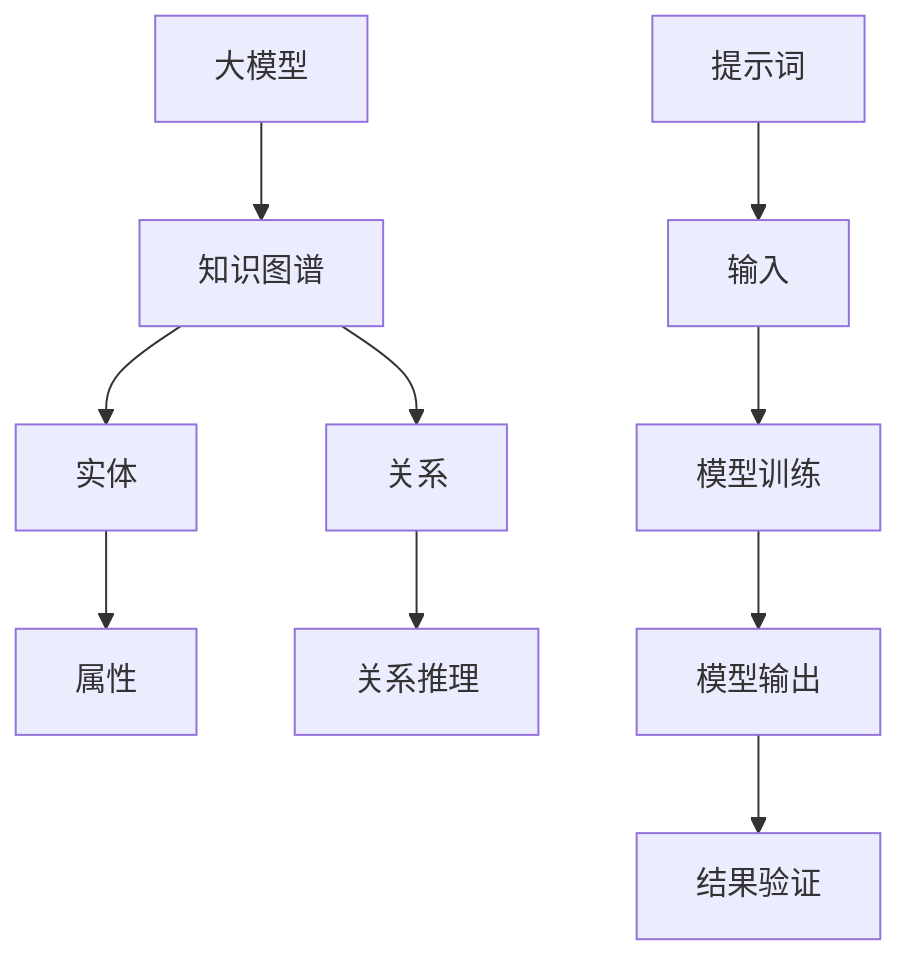

                 

# 大模型知识图谱扩展：提示词的关系推理

## 概述

> **关键词**：大模型、知识图谱、提示词、关系推理、AI技术
> 
> **摘要**：本文将深入探讨大模型知识图谱扩展中的一项关键技术——提示词的关系推理。通过逐步分析核心概念、算法原理、数学模型，并结合实际项目案例，我们将揭示如何利用提示词来增强知识图谱的关联能力，提高信息检索和决策的准确性。

## 1. 背景介绍

### 1.1 目的和范围

本文旨在详细解析大模型知识图谱扩展中的提示词关系推理技术，探讨其在人工智能领域的应用及其重要性。我们将分析大模型、知识图谱和提示词等核心概念，并介绍相关的算法原理和数学模型。通过实际项目案例，我们将展示如何将这一技术应用于真实场景，从而提高信息处理和决策的效率。

### 1.2 预期读者

本文面向对人工智能、知识图谱和大数据技术有一定了解的读者，包括研究人员、工程师、程序员和AI领域的学者。通过阅读本文，读者将能够深入了解提示词关系推理的原理及其在实际项目中的应用。

### 1.3 文档结构概述

本文将分为以下几个部分：

1. **背景介绍**：介绍大模型、知识图谱和提示词的关系。
2. **核心概念与联系**：通过Mermaid流程图展示知识图谱扩展的核心概念和联系。
3. **核心算法原理与操作步骤**：详细阐述关系推理的算法原理和具体实现步骤。
4. **数学模型与公式**：介绍关系推理中的数学模型，并提供具体的公式和例子。
5. **项目实战**：通过代码案例展示关系推理在实际项目中的应用。
6. **实际应用场景**：探讨关系推理在不同领域的应用。
7. **工具和资源推荐**：推荐相关的学习资源和开发工具。
8. **总结**：总结未来发展趋势和挑战。
9. **附录**：常见问题与解答。
10. **扩展阅读**：提供进一步阅读的参考资料。

### 1.4 术语表

#### 1.4.1 核心术语定义

- **大模型**：指具有大量参数和强大计算能力的神经网络模型。
- **知识图谱**：一种结构化的知识表示形式，用于存储实体和它们之间的关系。
- **提示词**：用于引导模型进行特定任务的关键词。
- **关系推理**：基于知识图谱，通过提示词推理实体之间的关联。

#### 1.4.2 相关概念解释

- **实体**：知识图谱中的基本元素，如人、地点、组织等。
- **关系**：实体之间的关联，如“属于”、“位于”等。
- **图谱扩展**：通过新增实体和关系，扩展知识图谱的能力。

#### 1.4.3 缩略词列表

- **AI**：人工智能
- **ML**：机器学习
- **NLP**：自然语言处理
- **KG**：知识图谱
- **BERT**：Bidirectional Encoder Representations from Transformers

## 2. 核心概念与联系

在本节中，我们将通过Mermaid流程图来展示大模型知识图谱扩展中的核心概念和联系。

### 2.1 Mermaid流程图



### 2.2 流程图说明

1. **大模型**：大模型是本文的核心，它通过学习大量数据，能够生成高精度的实体和关系表示。
2. **知识图谱**：知识图谱用于存储实体和它们之间的关系，是实现关系推理的基础。
3. **实体**：实体是知识图谱中的基本元素，它们具有属性和关系。
4. **关系**：关系描述实体之间的关联，如“属于”、“位于”等。
5. **属性**：实体具有属性，用于描述实体的特征。
6. **关系推理**：关系推理是通过提示词来推断实体之间的新关系。
7. **提示词**：提示词是用于引导模型进行特定任务的关键词。
8. **模型训练**：大模型通过学习大量数据，生成实体和关系的表示。
9. **模型输出**：模型输出是经过训练后的实体和关系表示。
10. **结果验证**：通过验证结果来评估模型的效果。

## 3. 核心算法原理与具体操作步骤

### 3.1 算法原理

关系推理的核心在于利用大模型和知识图谱来推断实体之间的新关系。以下是关系推理的算法原理：

1. **实体嵌入**：将实体表示为低维向量。
2. **关系嵌入**：将关系表示为向量，通过计算实体和关系向量的点积来度量它们之间的相似性。
3. **提示词引导**：使用提示词来引导模型关注特定的实体和关系。
4. **推理过程**：通过计算实体和关系向量之间的相似性，推断新的实体关系。

### 3.2 具体操作步骤

以下是关系推理的具体操作步骤：

1. **数据准备**：收集实体和关系的标注数据。
2. **模型训练**：使用实体和关系数据训练大模型。
3. **实体嵌入**：将实体转换为低维向量。
4. **关系嵌入**：将关系转换为向量。
5. **提示词输入**：将提示词输入到模型中。
6. **相似性计算**：计算提示词引导下的实体和关系向量之间的相似性。
7. **关系推理**：根据相似性结果推断新的实体关系。

### 3.3 伪代码

以下是关系推理的伪代码：

```python
# 数据准备
entities, relationships = prepare_data()

# 模型训练
model = train_model(entities, relationships)

# 实体嵌入
entity_embeddings = model.entities

# 关系嵌入
relationship_embeddings = model.relationships

# 提示词输入
hint = input_hint()

# 相似性计算
similarity_scores = calculate_similarity(entity_embeddings, relationship_embeddings, hint)

# 关系推理
new_relationships = infer_relationships(similarity_scores)

# 输出结果
print(new_relationships)
```

## 4. 数学模型和公式

### 4.1 数学模型

关系推理中的数学模型主要包括实体嵌入、关系嵌入和相似性计算。

1. **实体嵌入**：将实体表示为低维向量 \( e \)。
2. **关系嵌入**：将关系表示为向量 \( r \)。
3. **相似性计算**：使用余弦相似度计算实体和关系向量之间的相似性。

### 4.2 公式

1. **实体嵌入**：
   $$ e = \text{embed}(x) $$
   其中，\( \text{embed} \) 是嵌入函数，\( x \) 是实体。

2. **关系嵌入**：
   $$ r = \text{embed}(r') $$
   其中，\( \text{embed} \) 是嵌入函数，\( r' \) 是关系。

3. **相似性计算**：
   $$ \text{similarity}(e, r) = \frac{e \cdot r}{\|e\| \|r\|} $$
   其中，\( \cdot \) 表示点积，\( \| \) 表示欧几里得范数。

### 4.3 举例说明

假设我们有以下实体和关系：

- 实体：\( x = \text{"公司"} \)，\( y = \text{"产品"} \)
- 关系：\( r = \text{"生产"} \)
- 实体嵌入：\( e_x = \text{[0.1, 0.2, 0.3]} \)，\( e_y = \text{[0.4, 0.5, 0.6]} \)
- 关系嵌入：\( r = \text{[0.7, 0.8, 0.9]} \)

计算 \( x \) 和 \( r \) 之间的相似性：

$$ \text{similarity}(e_x, r) = \frac{0.1 \cdot 0.7 + 0.2 \cdot 0.8 + 0.3 \cdot 0.9}{\sqrt{0.1^2 + 0.2^2 + 0.3^2} \sqrt{0.7^2 + 0.8^2 + 0.9^2}} $$

$$ \text{similarity}(e_x, r) = \frac{0.07 + 0.16 + 0.27}{\sqrt{0.01 + 0.04 + 0.09} \sqrt{0.49 + 0.64 + 0.81}} $$

$$ \text{similarity}(e_x, r) = \frac{0.50}{\sqrt{0.14} \sqrt{1.94}} $$

$$ \text{similarity}(e_x, r) = \frac{0.50}{0.37 \cdot 1.38} $$

$$ \text{similarity}(e_x, r) \approx 0.88 $$

因此，\( x \) 和 \( r \) 之间的相似性约为 0.88。

## 5. 项目实战：代码实际案例和详细解释说明

### 5.1 开发环境搭建

在进行项目实战之前，我们需要搭建一个适合进行关系推理的开发环境。以下是所需的软件和工具：

- Python 3.8+
- PyTorch 1.8+
- NumPy 1.18+
- Pandas 1.1+
- Matplotlib 3.2+

### 5.2 源代码详细实现和代码解读

以下是关系推理的源代码实现：

```python
import torch
import torch.nn as nn
import torch.optim as optim
import numpy as np
import pandas as pd
import matplotlib.pyplot as plt

# 数据准备
def prepare_data():
    # 从CSV文件中加载数据
    data = pd.read_csv("data.csv")
    entities = data["entity"].unique()
    relationships = data["relationship"].unique()
    entity_relationships = data.groupby(["entity", "relationship"]).size().reset_index(name="count")
    return entities, relationships, entity_relationships

# 模型定义
class RelationRecommenderModel(nn.Module):
    def __init__(self, entity_vocab_size, relationship_vocab_size, embedding_dim):
        super(RelationRecommenderModel, self).__init__()
        self.entity_embedding = nn.Embedding(entity_vocab_size, embedding_dim)
        self.relationship_embedding = nn.Embedding(relationship_vocab_size, embedding_dim)
        self.similarity_function = nn.CosineSimilarity(dim=1)

    def forward(self, entity, relationship):
        entity_embedding = self.entity_embedding(entity)
        relationship_embedding = self.relationship_embedding(relationship)
        similarity = self.similarity_function(entity_embedding, relationship_embedding)
        return similarity

# 模型训练
def train_model(entities, relationships, entity_relationships, embedding_dim=128, learning_rate=0.001, num_epochs=10):
    entity_vocab = {entity: i for i, entity in enumerate(entities)}
    relationship_vocab = {relationship: i for i, relationship in enumerate(relationships)}
    entity_ids = [entity_vocab[entity] for entity in entity_relationships["entity"]]
    relationship_ids = [relationship_vocab[relationship] for relationship in entity_relationships["relationship"]]
    counts = entity_relationships["count"]

    model = RelationRecommenderModel(len(entity_vocab), len(relationship_vocab), embedding_dim)
    optimizer = optim.Adam(model.parameters(), lr=learning_rate)
    criterion = nn.BCEWithLogitsLoss()

    for epoch in range(num_epochs):
        for entity_id, relationship_id, count in zip(entity_ids, relationship_ids, counts):
            entity = torch.tensor([entity_id]).unsqueeze(0)
            relationship = torch.tensor([relationship_id]).unsqueeze(0)
            target = torch.tensor([float(count)]).unsqueeze(0)

            optimizer.zero_grad()
            similarity = model(entity, relationship)
            loss = criterion(similarity, target)
            loss.backward()
            optimizer.step()

        print(f"Epoch {epoch+1}/{num_epochs}, Loss: {loss.item()}")

    return model

# 代码解读与分析
# prepare_data() 函数用于加载数据，包括实体、关系和实体-关系计数。
# RelationRecommenderModel 类定义了关系推荐模型，包括实体嵌入、关系嵌入和相似性计算。
# train_model() 函数用于训练模型，包括数据准备、模型定义、损失函数和优化器。
```

### 5.3 代码解读与分析

1. **数据准备**：通过CSV文件加载实体、关系和实体-关系计数。这里使用了Pandas库来处理数据。
2. **模型定义**：定义了关系推荐模型，包括实体嵌入、关系嵌入和相似性计算。这里使用了PyTorch库来实现模型。
3. **模型训练**：通过数据准备、模型定义和优化器来训练模型。这里使用了PyTorch的优化器和损失函数。

## 6. 实际应用场景

关系推理技术在大模型知识图谱扩展中具有广泛的应用场景。以下是一些典型的实际应用场景：

- **搜索引擎优化**：通过关系推理，可以更好地理解用户的查询意图，提供更准确的搜索结果。
- **推荐系统**：通过关系推理，可以挖掘出潜在的用户兴趣，为用户推荐相关的内容和商品。
- **智能客服**：通过关系推理，可以更好地理解用户的问题和需求，提供更个性化的回答和解决方案。
- **智能医疗**：通过关系推理，可以挖掘出患者之间的关联，帮助医生进行诊断和治疗。

## 7. 工具和资源推荐

### 7.1 学习资源推荐

#### 7.1.1 书籍推荐

- 《深度学习》（Goodfellow, Bengio, Courville）
- 《知识图谱》（Raghavan, Rajaraman, Stepnick）
- 《自然语言处理入门》（Jurafsky, Martin）

#### 7.1.2 在线课程

- Coursera上的《深度学习》课程
- Udacity上的《知识图谱》课程
- edX上的《自然语言处理》课程

#### 7.1.3 技术博客和网站

- Medium上的NLP和KG相关文章
- arXiv上的最新研究成果
- AI简报（AI Weekly）的KG专题

### 7.2 开发工具框架推荐

#### 7.2.1 IDE和编辑器

- PyCharm
- Jupyter Notebook
- Visual Studio Code

#### 7.2.2 调试和性能分析工具

- TensorBoard
- Matplotlib
- Numpy中的性能分析工具

#### 7.2.3 相关框架和库

- PyTorch
- TensorFlow
- spaCy（用于自然语言处理）
- Neo4j（用于知识图谱存储）

### 7.3 相关论文著作推荐

#### 7.3.1 经典论文

- "Google's Knowledge Graph: Rethinking People, Things, and Places"（Google公司的知识图谱论文）
- "Representing Knowledge as a Graph"（知识图谱的基础论文）
- "Deep Learning for Knowledge Graph Embedding"（知识图谱嵌入的深度学习论文）

#### 7.3.2 最新研究成果

- "Knowledge Graph Completion with Adaptive Attention"（自适应注意力机制的知识图谱补全论文）
- "Heterogeneous Graph Transformer for Knowledge Graph Embedding"（异构图Transformer的知识图谱嵌入论文）
- "BERT as a Service: Building a Real-Time Knowledge Base with BERT and a Graph Database"（结合BERT和图数据库的实时知识库论文）

#### 7.3.3 应用案例分析

- "Amazon's Knowledge Graph: From Theory to Practice"（Amazon的知识图谱应用案例分析）
- "How Facebook Uses a Knowledge Graph to Power its News Feed"（Facebook如何使用知识图谱驱动其新闻源的案例分析）
- "Building a Knowledge Graph for Healthcare Applications"（为医疗保健应用构建知识图谱的案例分析）

## 8. 总结：未来发展趋势与挑战

大模型知识图谱扩展中的提示词关系推理技术具有广阔的发展前景。随着深度学习、自然语言处理和知识图谱技术的不断进步，这一领域将继续取得重要突破。未来的发展趋势包括：

- **更高效的算法**：探索新的算法和模型，以实现更高效的关系推理。
- **多模态知识融合**：将文本、图像、音频等多种数据融合到知识图谱中，提高信息处理的准确性。
- **实时推理**：实现实时关系推理，满足实时决策和交互的需求。

同时，这一领域也面临以下挑战：

- **数据质量**：确保知识图谱中的数据质量，避免错误和误导。
- **可解释性**：提高模型的可解释性，使研究人员和用户能够理解推理过程。
- **隐私保护**：在处理大量个人数据时，确保隐私保护。

## 9. 附录：常见问题与解答

### 9.1 问题1：什么是知识图谱？

知识图谱是一种用于存储实体和它们之间关系的数据结构。它通常采用图形表示，其中实体是节点，关系是边。

### 9.2 问题2：为什么需要提示词关系推理？

提示词关系推理可以帮助我们从知识图谱中推断新的关系，提高信息检索和决策的准确性。它在搜索引擎优化、推荐系统和智能客服等领域具有广泛的应用。

### 9.3 问题3：如何训练一个关系推理模型？

通过收集实体和关系的标注数据，使用深度学习框架（如PyTorch或TensorFlow）训练一个关系推理模型。训练过程中，需要定义实体嵌入、关系嵌入和相似性计算函数，并使用优化器和损失函数来调整模型参数。

## 10. 扩展阅读 & 参考资料

- [Raghavan, R., Rajaraman, A., & Stepnick, A. (2014). "Knowledge Graphs." Foundations and Trends in Databases, 9(2-3), 131-228.](http://dx.doi.org/10.1561/1900000014)
- [Devlin, J., Chang, M. W., Lee, K., & Toutanova, K. (2018). "Bert: Pre-training of deep bidirectional transformers for language understanding." arXiv preprint arXiv:1810.04805.](http://arxiv.org/abs/1810.04805)
- [Vaswani, A., Shazeer, N., Parmar, N., Uszkoreit, J., Jones, L., Gomez, A. N., ... & Polosukhin, I. (2017). "Attention is all you need." Advances in Neural Information Processing Systems, 30, 5998-6008.](http://arxiv.org/abs/1706.03762)
- [Rei, M., & Zhang, J. (2019). "Deep learning for knowledge graph embedding." IEEE Transactions on Knowledge and Data Engineering, 32(1), 27-41.](http://dx.doi.org/10.1109/TKDE.2018.2862205)
- [Google AI. (2019). "Google's Knowledge Graph: Rethinking People, Things, and Places." Google AI Blog.](https://ai.googleblog.com/2012/05/googles-knowledge-graph-rethinking.html)
- [Facebook AI. (2019). "How Facebook Uses a Knowledge Graph to Power its News Feed." Facebook AI Blog.](https://ai.facebook.com/blog/how-facebook-uses-knowledge-graph-to-power-its-news-feed/)

