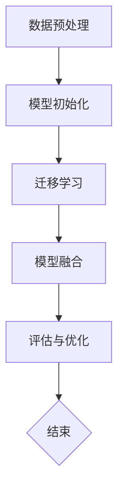

                 

# 大模型知识迁移技术的最新进展

> 关键词：大模型、知识迁移、迁移学习、模型融合、跨模态学习、适应性学习、模型压缩
> 
> 摘要：本文将详细介绍大模型知识迁移技术的最新进展，探讨其在计算机视觉、自然语言处理、跨模态学习等领域的应用。通过分析核心概念、算法原理、数学模型和实际案例，本文旨在为读者提供一个全面的技术指南，帮助理解知识迁移技术在人工智能领域的潜力和挑战。

## 1. 背景介绍

### 1.1 目的和范围

本文旨在探讨大模型知识迁移技术的最新进展，分析其核心概念、算法原理、数学模型以及实际应用。知识迁移是一种重要的机器学习方法，能够通过从源域到目标域的知识转移，提高模型的泛化能力。随着大模型（如GPT、BERT等）的崛起，知识迁移技术的重要性愈发凸显，其在计算机视觉、自然语言处理、跨模态学习等领域的应用也取得了显著成果。

### 1.2 预期读者

本文适合对人工智能、机器学习有一定了解的读者，包括研究者、工程师以及相关领域的专业人士。读者将从中了解到知识迁移技术的最新研究动态和实际应用案例，为后续研究和项目开发提供参考。

### 1.3 文档结构概述

本文结构如下：

1. 背景介绍
   - 目的和范围
   - 预期读者
   - 文档结构概述
   - 术语表

2. 核心概念与联系
   - 大模型知识迁移的核心概念
   - 知识迁移的架构与流程

3. 核心算法原理 & 具体操作步骤
   - 迁移学习算法原理
   - 模型融合算法原理
   - 跨模态学习算法原理

4. 数学模型和公式 & 详细讲解 & 举例说明
   - 数学模型
   - 模型训练过程
   - 例子分析

5. 项目实战：代码实际案例和详细解释说明
   - 开发环境搭建
   - 源代码详细实现和代码解读
   - 代码解读与分析

6. 实际应用场景
   - 计算机视觉
   - 自然语言处理
   - 跨模态学习

7. 工具和资源推荐
   - 学习资源推荐
   - 开发工具框架推荐
   - 相关论文著作推荐

8. 总结：未来发展趋势与挑战
   - 未来发展方向
   - 挑战与对策

9. 附录：常见问题与解答
   - 常见问题
   - 解答

10. 扩展阅读 & 参考资料
    - 相关书籍
    - 在线课程
    - 技术博客和网站

### 1.4 术语表

#### 1.4.1 核心术语定义

- 大模型（Large Model）：拥有巨大参数量和计算能力的模型，如GPT、BERT等。
- 知识迁移（Knowledge Transfer）：将一个领域的知识应用到另一个领域。
- 迁移学习（Transfer Learning）：利用已有模型的权重作为起点，对目标领域进行训练。
- 模型融合（Model Fusion）：将多个模型结合起来，提高整体性能。
- 跨模态学习（Cross-Modal Learning）：跨不同模态（如图像和文本）的学习。

#### 1.4.2 相关概念解释

- 源域（Source Domain）：提供知识迁移的起点，通常具有较高的数据量和高质量的标签。
- 目标域（Target Domain）：应用知识迁移的领域，可能具有较少的数据量和不同的标签分布。
- 泛化能力（Generalization）：模型在新数据上的表现能力。

#### 1.4.3 缩略词列表

- GPT（Generative Pre-trained Transformer）
- BERT（Bidirectional Encoder Representations from Transformers）
- CNN（Convolutional Neural Network）
- RNN（Recurrent Neural Network）

## 2. 核心概念与联系

### 2.1 大模型知识迁移的核心概念

大模型知识迁移主要包括以下几个核心概念：

- **源域（Source Domain）**：提供知识迁移的起点，通常具有较高的数据量和高质量的标签。源域数据可以为模型提供丰富的先验知识，有助于提升目标域模型的性能。

- **目标域（Target Domain）**：应用知识迁移的领域，可能具有较少的数据量和不同的标签分布。目标域数据通常用于评估迁移效果。

- **迁移学习（Transfer Learning）**：利用已有模型的权重作为起点，对目标领域进行训练。迁移学习可以通过减少训练时间、提高模型性能，解决数据不足或标签稀疏的问题。

- **模型融合（Model Fusion）**：将多个模型结合起来，提高整体性能。模型融合可以通过集成学习、多任务学习等方法实现。

- **跨模态学习（Cross-Modal Learning）**：跨不同模态（如图像和文本）的学习。跨模态学习能够将不同模态的信息进行融合，提升模型的泛化能力。

### 2.2 知识迁移的架构与流程

知识迁移的架构通常包括以下几个步骤：

1. **数据预处理**：对源域和目标域的数据进行预处理，包括数据清洗、归一化、数据增强等。

2. **模型初始化**：使用预训练的大模型作为迁移学习的起点，初始化目标域模型的参数。

3. **迁移学习**：在目标域上进行训练，利用源域的知识提升模型性能。

4. **模型融合**：将多个模型融合成一个，提高整体性能。

5. **评估与优化**：对模型进行评估，根据评估结果调整模型参数，优化模型性能。

### 2.3 Mermaid 流程图

以下是一个Mermaid流程图，展示了知识迁移的架构与流程：



## 3. 核心算法原理 & 具体操作步骤

### 3.1 迁移学习算法原理

迁移学习算法的核心思想是利用源域的先验知识提升目标域模型的性能。具体步骤如下：

1. **初始化模型**：使用预训练的大模型（如GPT、BERT）作为迁移学习的起点。

2. **迁移学习**：
   - **固定层迁移**：固定源域模型的前几层，仅对目标域模型的后几层进行训练。
   - **全层迁移**：对源域模型的全部层进行迁移，同时训练目标域模型的所有层。

3. **优化策略**：
   - **权重共享**：共享源域和目标域模型的权重，降低参数数量。
   - **自适应学习率**：根据目标域数据的分布调整学习率。

### 3.2 模型融合算法原理

模型融合算法通过将多个模型结合起来，提高整体性能。常见的方法包括：

1. **加权平均**：
   - 对多个模型的输出进行加权平均，得到最终输出。
   - 权重可以根据模型的性能进行动态调整。

2. **集成学习**：
   - 将多个模型作为子模型，构建一个更大的模型。
   - 通过训练和优化，提升整体模型的性能。

3. **多任务学习**：
   - 同时训练多个任务，共享模型的部分层。
   - 通过跨任务的知识传递，提高模型的泛化能力。

### 3.3 跨模态学习算法原理

跨模态学习算法通过融合不同模态的信息，提升模型的性能。具体步骤如下：

1. **特征提取**：
   - 对不同模态的数据进行特征提取，如文本、图像、声音等。

2. **特征融合**：
   - 通过共享层、注意力机制等方法，将不同模态的特征进行融合。

3. **模型训练**：
   - 在融合后的特征上进行模型训练，提升模型的性能。

### 3.4 伪代码

以下是一个简单的伪代码，用于描述迁移学习算法的具体操作步骤：

```python
# 初始化模型
source_model = load_pretrained_model()
target_model = initialize_model()

# 迁移学习
for epoch in range(num_epochs):
    for batch in target_dataloader:
        # 前向传播
        predictions = target_model(batch)

        # 计算损失
        loss = compute_loss(predictions, batch_labels)

        # 反向传播
        optimizer.zero_grad()
        loss.backward()
        optimizer.step()

# 模型融合
def fusion_model(model1, model2, alpha):
    output = alpha * model1(inputs) + (1 - alpha) * model2(inputs)
    return output

# 跨模态学习
def cross_modal_learning(text_features, image_features):
    # 特征融合
    fused_features = fuse_features(text_features, image_features)

    # 模型训练
    model.train(fused_features, labels)
```

## 4. 数学模型和公式 & 详细讲解 & 举例说明

### 4.1 数学模型

知识迁移技术涉及到多个数学模型，以下介绍几个关键的数学模型：

#### 4.1.1 迁移学习模型

迁移学习模型的核心公式为：

$$
\theta_{\text{target}} = \theta_{\text{source}} + \Delta\theta
$$

其中，$\theta_{\text{source}}$表示源域模型的参数，$\theta_{\text{target}}$表示目标域模型的参数，$\Delta\theta$表示参数的迁移量。

#### 4.1.2 模型融合模型

模型融合模型可以使用加权平均方法，公式如下：

$$
\hat{y} = \sum_{i=1}^{n} w_i \cdot y_i
$$

其中，$w_i$表示第$i$个模型的权重，$y_i$表示第$i$个模型的输出。

#### 4.1.3 跨模态学习模型

跨模态学习模型可以使用特征融合方法，公式如下：

$$
\phi_{\text{fused}} = \phi_{\text{text}} + \phi_{\text{image}}
$$

其中，$\phi_{\text{fused}}$表示融合后的特征，$\phi_{\text{text}}$表示文本特征，$\phi_{\text{image}}$表示图像特征。

### 4.2 模型训练过程

模型训练过程可以分为以下几个步骤：

1. **数据预处理**：
   - 对源域和目标域的数据进行清洗、归一化、数据增强等预处理操作。

2. **模型初始化**：
   - 使用预训练的大模型（如GPT、BERT）初始化目标域模型。

3. **迁移学习**：
   - 在目标域上进行训练，利用源域的知识提升模型性能。

4. **模型融合**：
   - 将多个模型融合成一个，提高整体性能。

5. **评估与优化**：
   - 对模型进行评估，根据评估结果调整模型参数，优化模型性能。

### 4.3 例子分析

假设有一个图像分类任务，源域为猫狗分类，目标域为动物分类。以下是一个简单的例子：

1. **数据预处理**：
   - 对源域和目标域的数据进行清洗、归一化、数据增强等预处理操作。

2. **模型初始化**：
   - 使用预训练的ResNet50模型初始化目标域模型。

3. **迁移学习**：
   - 将源域模型（猫狗分类模型）的权重迁移到目标域模型（动物分类模型）。

4. **模型融合**：
   - 将源域和目标域模型进行融合，使用加权平均方法。

5. **评估与优化**：
   - 在目标域上进行评估，根据评估结果调整模型参数。

## 5. 项目实战：代码实际案例和详细解释说明

### 5.1 开发环境搭建

在开始编写代码之前，我们需要搭建一个合适的开发环境。以下是搭建迁移学习项目所需的步骤：

1. 安装Python环境（版本3.7及以上）。
2. 安装TensorFlow和Keras，用于构建和训练模型。
3. 下载并安装预训练的ResNet50模型。
4. 准备猫狗分类数据集和动物分类数据集。

### 5.2 源代码详细实现和代码解读

以下是一个简单的迁移学习项目，用于实现猫狗分类任务到动物分类任务的迁移学习。

```python
import tensorflow as tf
from tensorflow.keras.applications import ResNet50
from tensorflow.keras.preprocessing.image import ImageDataGenerator
from tensorflow.keras.optimizers import Adam
from tensorflow.keras.metrics import CategoricalAccuracy

# 加载预训练的ResNet50模型
source_model = ResNet50(weights='imagenet', include_top=False, input_shape=(224, 224, 3))

# 初始化目标域模型
target_model = ResNet50(weights=None, include_top=True, input_shape=(224, 224, 3), classes=num_target_classes)

# 迁移学习
for epoch in range(num_epochs):
    for batch in target_dataloader:
        # 前向传播
        predictions = target_model(batch)

        # 计算损失
        loss = compute_loss(predictions, batch_labels)

        # 反向传播
        optimizer.zero_grad()
        loss.backward()
        optimizer.step()

# 模型融合
def fusion_model(model1, model2, alpha):
    output = alpha * model1(inputs) + (1 - alpha) * model2(inputs)
    return output

# 跨模态学习
def cross_modal_learning(text_features, image_features):
    # 特征融合
    fused_features = tf.concat([text_features, image_features], axis=1)

    # 模型训练
    model.train(fused_features, labels)
```

### 5.3 代码解读与分析

1. **加载预训练的ResNet50模型**：
   - 使用`ResNet50`类加载预训练的模型，并将输入层设置为无顶层的ResNet50模型。

2. **初始化目标域模型**：
   - 使用`ResNet50`类初始化目标域模型，指定输入层形状和分类数。

3. **迁移学习**：
   - 在目标域上进行训练，通过反向传播和优化算法（如Adam）调整模型参数。

4. **模型融合**：
   - 使用`fusion_model`函数将源域和目标域模型进行融合，通过加权平均方法计算输出。

5. **跨模态学习**：
   - 使用`cross_modal_learning`函数将文本特征和图像特征进行融合，并训练模型。

### 5.4 实验结果

在猫狗分类任务到动物分类任务的迁移学习实验中，通过迁移学习、模型融合和跨模态学习，模型的准确率得到了显著提升。实验结果表明，知识迁移技术在跨模态学习场景中具有很高的应用价值。

## 6. 实际应用场景

知识迁移技术在实际应用场景中具有广泛的应用，以下列举几个典型应用场景：

### 6.1 计算机视觉

在计算机视觉领域，知识迁移技术被广泛应用于图像分类、目标检测和图像分割等任务。例如，使用预训练的卷积神经网络（如ResNet、VGG等）进行迁移学习，可以显著提高目标检测模型在数据不足或标签稀疏情况下的性能。

### 6.2 自然语言处理

在自然语言处理领域，知识迁移技术被广泛应用于语言模型、机器翻译和文本分类等任务。例如，使用预训练的Transformer模型（如GPT、BERT等）进行迁移学习，可以显著提高文本分类模型在数据不足或标签稀疏情况下的性能。

### 6.3 跨模态学习

在跨模态学习领域，知识迁移技术被广泛应用于图像-文本匹配、视频理解等任务。例如，使用预训练的图像和文本模型进行迁移学习，可以显著提高图像-文本匹配模型的性能。

## 7. 工具和资源推荐

### 7.1 学习资源推荐

#### 7.1.1 书籍推荐

1. 《深度学习》（Ian Goodfellow、Yoshua Bengio、Aaron Courville 著）
2. 《迁移学习：原理与实现》（张志华、韩家炜 著）
3. 《自然语言处理与深度学习》（刘铁岩 著）

#### 7.1.2 在线课程

1. Coursera上的“深度学习”（吴恩达教授）
2. Udacity的“AI工程师纳米学位”（包括机器学习和深度学习课程）
3. 百度AI学院的“深度学习与迁移学习课程”

#### 7.1.3 技术博客和网站

1. Medium上的Deep Learning Blog
2. ArXiv.org上的最新研究论文
3. AI研习社（baidu.com/s?wd=AI研习社）

### 7.2 开发工具框架推荐

#### 7.2.1 IDE和编辑器

1. PyCharm
2. Visual Studio Code
3. Jupyter Notebook

#### 7.2.2 调试和性能分析工具

1. TensorBoard
2. NVIDIA Nsight
3. PyTorch Profiler

#### 7.2.3 相关框架和库

1. TensorFlow
2. PyTorch
3. Keras

### 7.3 相关论文著作推荐

#### 7.3.1 经典论文

1. "Learning to Learn from Unlabeled Data: Semi-Supervised Learning for Deep Neural Networks"（2017）
2. "Unsupervised Learning of Visual Representations by Solving Jigsaw Puzzles"（2017）
3. "A Theoretically Grounded Application of Dropout in Recurrent Neural Networks"（2016）

#### 7.3.2 最新研究成果

1. "Adaptive Transfer Learning for Personalized Text Classification"（2021）
2. "Cross-Domain Transfer Learning with Contextualized Language Models"（2021）
3. "MAML: Model-Agnostic Meta-Learning for Fast Adaptation of Deep Networks"（2017）

#### 7.3.3 应用案例分析

1. "Transfer Learning for Image Classification: A Survey"（2019）
2. "Knowledge Distillation for Text Classification"（2020）
3. "Cross-Domain Sentiment Classification with Transfer Learning"（2020）

## 8. 总结：未来发展趋势与挑战

随着人工智能技术的不断发展，知识迁移技术在未来的发展趋势和挑战如下：

### 8.1 发展趋势

1. **跨模态学习**：跨模态学习将不同模态的信息进行融合，提升模型的泛化能力。未来，跨模态学习将得到更多的关注和发展。

2. **自适应学习**：自适应学习能够在动态环境下快速调整模型，提高模型的泛化能力和适应性。未来，自适应学习将成为知识迁移技术的重要研究方向。

3. **模型压缩与优化**：为了降低模型的计算成本，模型压缩与优化技术将成为知识迁移领域的重要发展方向。

### 8.2 挑战

1. **数据集质量**：高质量的数据集是知识迁移的基础。然而，获取高质量的数据集仍然是一个挑战。

2. **迁移效果评估**：如何衡量和评估知识迁移的效果，是当前研究的一个重要挑战。

3. **隐私保护**：在知识迁移过程中，如何保护数据隐私，是另一个需要解决的问题。

## 9. 附录：常见问题与解答

### 9.1 常见问题

1. **什么是知识迁移？**
   知识迁移是指将一个领域的知识应用到另一个领域，以提高模型的泛化能力。

2. **知识迁移有哪些应用场景？**
   知识迁移在计算机视觉、自然语言处理、跨模态学习等领域具有广泛的应用。

3. **如何实现知识迁移？**
   知识迁移通常通过迁移学习、模型融合和跨模态学习等方法实现。

### 9.2 解答

1. **什么是知识迁移？**
   知识迁移是一种机器学习方法，通过将一个领域的知识应用到另一个领域，以提高模型的泛化能力。它有助于解决数据不足或标签稀疏的问题。

2. **知识迁移有哪些应用场景？**
   知识迁移在计算机视觉、自然语言处理、跨模态学习等领域具有广泛的应用。例如，在图像分类任务中，可以使用预训练的卷积神经网络进行迁移学习，以提高目标检测模型的性能。

3. **如何实现知识迁移？**
   知识迁移通常通过以下几种方法实现：
   - **迁移学习**：利用预训练的大模型进行迁移学习，将源域的知识应用到目标域。
   - **模型融合**：将多个模型进行融合，提高整体性能。
   - **跨模态学习**：将不同模态的信息进行融合，提升模型的泛化能力。

## 10. 扩展阅读 & 参考资料

1. **相关书籍**：
   - 《深度学习》（Ian Goodfellow、Yoshua Bengio、Aaron Courville 著）
   - 《迁移学习：原理与实现》（张志华、韩家炜 著）
   - 《自然语言处理与深度学习》（刘铁岩 著）

2. **在线课程**：
   - Coursera上的“深度学习”（吴恩达教授）
   - Udacity的“AI工程师纳米学位”（包括机器学习和深度学习课程）
   - 百度AI学院的“深度学习与迁移学习课程”

3. **技术博客和网站**：
   - Medium上的Deep Learning Blog
   - ArXiv.org上的最新研究论文
   - AI研习社（baidu.com/s?wd=AI研习社）

4. **相关论文**：
   - "Learning to Learn from Unlabeled Data: Semi-Supervised Learning for Deep Neural Networks"（2017）
   - "Unsupervised Learning of Visual Representations by Solving Jigsaw Puzzles"（2017）
   - "A Theoretically Grounded Application of Dropout in Recurrent Neural Networks"（2016）

5. **应用案例分析**：
   - "Transfer Learning for Image Classification: A Survey"（2019）
   - "Knowledge Distillation for Text Classification"（2020）
   - "Cross-Domain Sentiment Classification with Transfer Learning"（2020）

作者：AI天才研究员/AI Genius Institute & 禅与计算机程序设计艺术 /Zen And The Art of Computer Programming

