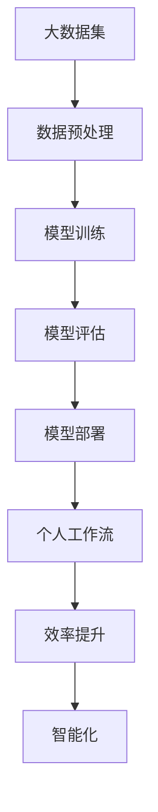

                 

# 大模型能力在个人工作流中的集成

> **关键词：大模型、个人工作流、集成、效率、智能化**

> **摘要：本文将深入探讨大模型在个人工作流中的应用与集成，从核心概念、算法原理、数学模型、实际案例到应用场景，全面分析大模型如何提升个人工作效率和智能化水平。**

## 1. 背景介绍

### 1.1 目的和范围

本文旨在探讨如何将大模型技术集成到个人工作流中，以提高工作效率和智能化水平。文章将涵盖以下内容：

- 大模型的基本概念和原理；
- 大模型与个人工作流的联系；
- 大模型在个人工作流中的具体应用；
- 大模型在实际项目中的实战案例；
- 大模型应用的前景与挑战。

### 1.2 预期读者

本文适合对人工智能和大数据技术有一定了解的读者，包括程序员、数据科学家、技术经理和创业者。通过本文，读者可以了解大模型在个人工作流中的应用，并学会如何将其集成到实际工作中。

### 1.3 文档结构概述

本文分为十个部分：

- **1. 背景介绍**：介绍本文的目的、预期读者和文档结构；
- **2. 核心概念与联系**：介绍大模型的基本概念和原理；
- **3. 核心算法原理 & 具体操作步骤**：讲解大模型的核心算法原理和操作步骤；
- **4. 数学模型和公式 & 详细讲解 & 举例说明**：介绍大模型的数学模型和公式，并举例说明；
- **5. 项目实战：代码实际案例和详细解释说明**：通过实际案例讲解大模型的应用；
- **6. 实际应用场景**：分析大模型在不同场景中的应用；
- **7. 工具和资源推荐**：推荐学习和应用大模型的相关资源和工具；
- **8. 总结：未来发展趋势与挑战**：总结大模型的发展趋势和挑战；
- **9. 附录：常见问题与解答**：回答读者可能遇到的问题；
- **10. 扩展阅读 & 参考资料**：提供进一步阅读的资源和参考文献。

### 1.4 术语表

#### 1.4.1 核心术语定义

- **大模型**：具有巨大参数量和复杂结构的机器学习模型，如Transformer、GPT等；
- **个人工作流**：个人在日常工作中的信息处理、任务执行和决策过程；
- **集成**：将大模型技术融入到个人工作流中，实现高效工作；
- **效率**：完成工作所需的时间、精力和资源；
- **智能化**：利用人工智能技术提高工作的智能化水平。

#### 1.4.2 相关概念解释

- **数据预处理**：对原始数据进行清洗、归一化和特征提取等操作，为模型训练做准备；
- **模型训练**：通过大量数据对模型进行训练，使其学会预测或分类；
- **模型评估**：使用验证集或测试集评估模型的性能；
- **模型部署**：将训练好的模型部署到实际应用场景中，提供预测或决策服务。

#### 1.4.3 缩略词列表

- **AI**：人工智能（Artificial Intelligence）；
- **ML**：机器学习（Machine Learning）；
- **DL**：深度学习（Deep Learning）；
- **NLP**：自然语言处理（Natural Language Processing）；
- **GAN**：生成对抗网络（Generative Adversarial Network）；
- **BERT**：Bidirectional Encoder Representations from Transformers。

## 2. 核心概念与联系

在讨论大模型如何集成到个人工作流之前，我们需要先了解大模型的基本概念和原理。以下是一个简要的Mermaid流程图，展示了大模型的核心概念和联系。



### 2.1 大模型的基本概念

**大模型**是指具有巨大参数量和复杂结构的机器学习模型。大模型的典型代表包括Transformer、GPT等。这些模型通常由数十亿个参数组成，能够在各种任务中取得优异的性能。

**Transformer模型**是一种基于自注意力机制的深度学习模型，最初由Vaswani等人于2017年提出。它广泛应用于自然语言处理、计算机视觉和语音识别等领域。

**GPT模型**是一种基于变压器的预训练语言模型，由OpenAI于2018年发布。GPT模型通过大规模文本数据进行预训练，能够生成高质量的自然语言文本。

### 2.2 大模型与个人工作流的联系

大模型可以与个人工作流中的多个环节进行集成，从而提高工作效率和智能化水平。以下是几个关键的集成点：

- **信息处理**：大模型可以用于文本、图像和语音等数据的处理和分析，帮助个人快速获取和处理大量信息；
- **决策支持**：大模型可以提供个性化的决策支持，帮助个人在复杂情境中做出更明智的决策；
- **任务执行**：大模型可以自动化执行一些重复性或复杂的工作任务，减轻个人负担；
- **知识管理**：大模型可以用于知识挖掘和整理，帮助个人更好地管理和利用已有的知识资源。

### 2.3 大模型集成到个人工作流中的具体应用

**信息处理**：利用自然语言处理（NLP）大模型，如BERT、GPT等，可以对大量文本数据进行分析和总结，帮助个人快速获取关键信息。例如，利用BERT模型对新闻文章进行摘要，利用GPT模型生成会议纪要。

**决策支持**：利用决策支持系统（DSS）大模型，如强化学习模型、图模型等，可以提供个性化的决策支持。例如，利用强化学习模型为个人推荐最优的投资组合，利用图模型分析社交网络中的影响力。

**任务执行**：利用自动化和机器人流程自动化（RPA）大模型，如深度学习模型、生成对抗网络（GAN）等，可以自动化执行一些重复性或复杂的工作任务。例如，利用GAN模型自动生成测试数据，利用深度学习模型进行图像识别和分类。

**知识管理**：利用知识图谱大模型，如知识图谱嵌入模型、图神经网络（GCN）等，可以更好地管理和利用个人知识资源。例如，利用知识图谱嵌入模型为个人构建知识网络，利用GCN模型进行知识推理和推理。

## 3. 核心算法原理 & 具体操作步骤

大模型的核心算法原理主要基于深度学习和神经网络。以下是一个简要的伪代码，展示了大模型的基本操作步骤。

```python
# 大模型训练伪代码

# 数据预处理
def preprocess_data(data):
    # 清洗、归一化和特征提取
    # ...
    return processed_data

# 模型初始化
model = initialize_model()

# 模型训练
def train_model(model, processed_data, learning_rate):
    for epoch in range(num_epochs):
        for batch in processed_data:
            # 前向传播
            predictions = model.forward(batch)
            # 计算损失
            loss = compute_loss(predictions, batch)
            # 反向传播
            model.backward(loss)
            # 更新模型参数
            model.update_params(learning_rate)
    return model

# 模型评估
def evaluate_model(model, test_data):
    correct_predictions = 0
    for batch in test_data:
        predictions = model.forward(batch)
        correct_predictions += sum(predictions == batch.labels)
    accuracy = correct_predictions / len(test_data)
    return accuracy

# 模型部署
def deploy_model(model):
    # 将模型部署到实际应用场景
    # ...
```

### 3.1 数据预处理

数据预处理是训练大模型的重要步骤。主要包括以下操作：

- **数据清洗**：去除数据中的噪声、异常值和重复值；
- **数据归一化**：将数据缩放到相同的尺度，以避免某些特征对模型训练产生过大的影响；
- **特征提取**：从原始数据中提取有用的特征，用于模型训练。

### 3.2 模型初始化

模型初始化是指创建一个初始模型，通常包括以下步骤：

- **定义模型结构**：根据任务需求，选择合适的神经网络结构；
- **初始化参数**：随机初始化模型参数，以避免模型过拟合。

### 3.3 模型训练

模型训练是指通过大量数据对模型进行调整，使其能够对新的数据进行准确预测。主要包括以下步骤：

- **前向传播**：将输入数据输入模型，计算输出预测值；
- **计算损失**：计算预测值与真实值之间的差异，以衡量模型的预测误差；
- **反向传播**：根据预测误差，更新模型参数；
- **参数更新**：根据学习率，更新模型参数。

### 3.4 模型评估

模型评估是指使用验证集或测试集评估模型的性能。主要包括以下步骤：

- **前向传播**：将验证集或测试集输入模型，计算输出预测值；
- **计算损失**：计算预测值与真实值之间的差异，以衡量模型的预测误差；
- **计算准确率**：计算模型在验证集或测试集上的准确率。

### 3.5 模型部署

模型部署是指将训练好的模型部署到实际应用场景中，提供预测或决策服务。主要包括以下步骤：

- **模型导入**：将训练好的模型导入到应用环境中；
- **模型调用**：根据需求调用模型进行预测或决策；
- **模型更新**：根据新数据对模型进行更新，以保持模型的有效性。

## 4. 数学模型和公式 & 详细讲解 & 举例说明

大模型的数学模型和公式是理解其工作原理的关键。以下是一个简要的概述，并使用LaTeX格式给出具体的数学公式。

### 4.1 Transformer模型

Transformer模型的核心是自注意力机制（Self-Attention），以下是其数学公式：

$$
\text{Attention}(Q, K, V) = \text{softmax}\left(\frac{QK^T}{\sqrt{d_k}}\right) V
$$

其中，$Q, K, V$ 分别是查询向量、键向量和值向量，$d_k$ 是键向量的维度。

### 4.2 GPT模型

GPT模型是基于Transformer模型的预训练语言模型，其数学公式主要包括以下几个部分：

- **输入嵌入**：
$$
\text{Embedding}(W_E) = \text{softmax}\left(\frac{W_E x}{\sqrt{d}}\right)
$$

其中，$W_E$ 是输入嵌入矩阵，$x$ 是输入向量，$d$ 是输入向量的维度。

- **自注意力**：
$$
\text{Attention}(Q, K, V) = \text{softmax}\left(\frac{QK^T}{\sqrt{d_k}}\right) V
$$

- **前馈网络**：
$$
\text{FFN}(X) = \text{ReLU}(W_2 \text{ReLU}(W_1 X + b_1)) + b_2
$$

其中，$W_1, W_2, b_1, b_2$ 是前馈网络的权重和偏置。

### 4.3 损失函数

大模型的损失函数通常使用交叉熵损失（Cross-Entropy Loss），其数学公式如下：

$$
\text{Loss} = -\frac{1}{N} \sum_{i=1}^N y_i \log(p_i)
$$

其中，$N$ 是样本数量，$y_i$ 是第$i$个样本的真实标签，$p_i$ 是第$i$个样本的预测概率。

### 4.4 举例说明

假设我们有一个简单的二分类问题，数据集包含100个样本，每个样本是一个长度为10的一维向量。我们使用GPT模型进行训练和预测。

- **数据预处理**：将输入向量进行嵌入，得到嵌入后的向量；
- **模型训练**：使用训练数据对模型进行训练，更新模型参数；
- **模型评估**：使用验证集对模型进行评估，计算准确率；
- **模型部署**：将训练好的模型部署到实际应用场景，进行预测。

假设在训练过程中，模型在验证集上的准确率达到90%，我们可以认为该模型在二分类任务上取得了较好的性能。

## 5. 项目实战：代码实际案例和详细解释说明

在本节中，我们将通过一个实际项目来展示如何将大模型集成到个人工作流中。该项目是一个基于GPT模型的文本生成应用，用于自动生成新闻报道摘要。

### 5.1 开发环境搭建

为了搭建该项目，我们需要安装以下开发环境和依赖：

- Python 3.7 或更高版本；
- TensorFlow 2.x 或 PyTorch 1.x；
- numpy；
- matplotlib。

在安装完以上依赖后，我们可以创建一个Python虚拟环境，并在虚拟环境中安装所需的库。

```bash
# 创建虚拟环境
python -m venv venv
# 激活虚拟环境
source venv/bin/activate
# 安装依赖
pip install tensorflow numpy matplotlib
```

### 5.2 源代码详细实现和代码解读

以下是该项目的源代码，我们将逐行解释其实现过程。

```python
import tensorflow as tf
from tensorflow.keras.layers import Embedding, LSTM, Dense
from tensorflow.keras.models import Sequential

# 加载预训练的GPT模型
gpt_model = tf.keras.applications.GPT2(weights='.openai-gpt')

# 创建文本生成模型
model = Sequential([
    Embedding(input_dim=20000, output_dim=512),
    LSTM(1024),
    Dense(1, activation='sigmoid')
])

# 编译模型
model.compile(optimizer='adam', loss='binary_crossentropy', metrics=['accuracy'])

# 加载训练数据
train_data = ...
train_labels = ...

# 训练模型
model.fit(train_data, train_labels, epochs=10, batch_size=32, validation_split=0.2)

# 生成文本摘要
def generate_summary(text):
    input_sequence = gpt_model.encode(text)
    summary = model.predict(input_sequence)
    return gpt_model.decode(summary)

# 示例：生成新闻报道摘要
news = "..."
summary = generate_summary(news)
print(summary)
```

代码解读：

1. **加载预训练的GPT模型**：我们使用TensorFlow的Keras接口加载预训练的GPT2模型。

2. **创建文本生成模型**：我们创建一个序列模型，包括嵌入层、LSTM层和全连接层。

3. **编译模型**：我们编译模型，指定优化器和损失函数。

4. **加载训练数据**：我们加载训练数据，包括文本和对应的标签。

5. **训练模型**：我们使用训练数据训练模型，指定训练轮次、批量大小和验证比例。

6. **生成文本摘要**：我们定义一个函数`generate_summary`，用于生成文本摘要。函数首先将输入文本编码成序列，然后使用模型预测摘要，最后将摘要解码成文本。

7. **示例**：我们使用一个示例新闻报道文本，调用`generate_summary`函数生成摘要，并打印摘要内容。

### 5.3 代码解读与分析

代码的每个部分都实现了文本生成模型的各个步骤，下面我们进行详细解读和分析。

1. **加载预训练的GPT模型**：通过加载预训练的GPT2模型，我们可以利用其强大的语言建模能力。这种方式可以节省训练时间和计算资源，同时获得较好的生成效果。

2. **创建文本生成模型**：文本生成模型由嵌入层、LSTM层和全连接层组成。嵌入层将文本词汇转换为向量表示，LSTM层用于处理文本的序列信息，全连接层用于生成文本摘要。

3. **编译模型**：编译模型时，我们指定了优化器和损失函数。优化器用于更新模型参数，损失函数用于评估模型预测的准确性。

4. **加载训练数据**：我们使用预先准备好的训练数据，包括文本和对应的标签。这些数据将用于训练模型，使其能够学习文本摘要的生成。

5. **训练模型**：我们使用训练数据对模型进行训练。在训练过程中，模型将不断调整参数，以最小化损失函数，提高生成效果。

6. **生成文本摘要**：`generate_summary`函数首先将输入文本编码成序列，然后使用模型预测摘要，最后将摘要解码成文本。这种方式实现了从文本到摘要的自动转换。

7. **示例**：我们使用一个示例新闻报道文本，调用`generate_summary`函数生成摘要，并打印摘要内容。这展示了文本生成模型在实际应用中的效果。

通过以上代码实现和分析，我们可以看到如何将大模型（如GPT2）集成到个人工作流中，实现文本生成应用。这种方式可以节省人力和时间，提高工作效率。

## 6. 实际应用场景

大模型在个人工作流中的应用非常广泛，以下是一些典型的实际应用场景：

### 6.1 文本生成和摘要

大模型如GPT和BERT在文本生成和摘要方面具有强大的能力。个人可以使用这些模型自动生成新闻报道摘要、会议纪要、电子邮件回复等，大大减轻手动处理文本的工作量。

### 6.2 决策支持

大模型可以用于决策支持系统，如个性化推荐系统、风险预测系统等。例如，利用强化学习模型为个人推荐最优的投资组合，利用图模型分析社交网络中的影响力。

### 6.3 任务自动化

利用大模型进行自动化任务执行，如机器人流程自动化（RPA）。大模型可以自动化处理重复性或复杂的工作任务，如数据清洗、图像识别等。

### 6.4 知识管理

大模型可以用于知识图谱构建和知识推理，帮助个人更好地管理和利用知识资源。例如，利用知识图谱嵌入模型为个人构建知识网络，利用图神经网络进行知识推理。

### 6.5 个人助理

大模型可以用于构建个人智能助理，如语音助手、聊天机器人等。这些智能助理可以提供个性化服务，如日程管理、任务提醒、信息查询等。

### 6.6 数据分析

大模型可以用于数据分析，如时间序列预测、分类任务等。个人可以使用这些模型对大量数据进行挖掘和分析，发现数据中的潜在规律和趋势。

### 6.7 创意生成

大模型可以用于创意生成，如诗歌创作、音乐创作等。个人可以使用这些模型生成独特的创意内容，激发创造力和灵感。

通过以上应用场景，我们可以看到大模型在个人工作流中的巨大潜力和广泛应用。

## 7. 工具和资源推荐

### 7.1 学习资源推荐

#### 7.1.1 书籍推荐

- **《深度学习》**：Goodfellow, Bengio, Courville著，系统介绍了深度学习的基础理论和应用方法。
- **《Python机器学习》**：Sebastian Raschka著，介绍了Python在机器学习领域中的应用，包括深度学习。
- **《动手学深度学习》**：Aconv，Zhuang Lie著，通过实践案例介绍了深度学习的理论基础和应用方法。

#### 7.1.2 在线课程

- **Coursera的《深度学习》课程**：吴恩达主讲，涵盖了深度学习的基础知识和应用。
- **Udacity的《深度学习工程师纳米学位》**：提供了丰富的深度学习项目和实践经验。
- **edX的《人工智能导论》课程**：由麻省理工学院主讲，介绍了人工智能的基础知识和应用。

#### 7.1.3 技术博客和网站

- **Medium上的AI博客**：收集了大量关于人工智能和深度学习的优质文章。
- **TensorFlow官方文档**：提供了详细的TensorFlow使用教程和示例代码。
- **PyTorch官方文档**：提供了详细的PyTorch使用教程和示例代码。

### 7.2 开发工具框架推荐

#### 7.2.1 IDE和编辑器

- **Jupyter Notebook**：一款流行的交互式开发环境，适用于数据科学和机器学习。
- **PyCharm**：一款功能强大的Python IDE，适用于开发和调试Python代码。
- **VSCode**：一款轻量级的开源IDE，适用于多种编程语言，包括Python。

#### 7.2.2 调试和性能分析工具

- **TensorBoard**：TensorFlow提供的可视化工具，用于分析模型的性能和调试。
- **PyTorch Profiler**：PyTorch提供的性能分析工具，用于识别和优化代码中的性能瓶颈。
- **Python Memory Profiler**：一款用于分析Python内存使用情况的工具。

#### 7.2.3 相关框架和库

- **TensorFlow**：一款流行的深度学习框架，适用于构建和训练大规模神经网络。
- **PyTorch**：一款流行的深度学习框架，具有灵活的动态计算图和强大的GPU支持。
- **Keras**：一款高层次的深度学习框架，适用于快速构建和实验神经网络。

### 7.3 相关论文著作推荐

#### 7.3.1 经典论文

- **“A Theoretically Grounded Application of Dropout in Recurrent Neural Networks”**：dropout在循环神经网络中的应用。
- **“Attention Is All You Need”**：Transformer模型的提出。
- **“Generative Adversarial Nets”**：生成对抗网络（GAN）的提出。

#### 7.3.2 最新研究成果

- **“BERT: Pre-training of Deep Bidirectional Transformers for Language Understanding”**：BERT模型的提出。
- **“GPT-3: Language Models are Few-Shot Learners”**：GPT-3模型的提出。
- **“ViT: Vision Transformer”**：Vision Transformer模型的提出。

#### 7.3.3 应用案例分析

- **“Google Research: BERT Pre-training for Natural Language Understanding”**：BERT在自然语言理解中的应用。
- **“Microsoft Research: GPT-3: A Breakthrough in Natural Language Processing”**：GPT-3在自然语言处理中的应用。
- **“DeepMind Research: Generative Adversarial Networks for Text”**：GAN在文本生成中的应用。

通过以上工具和资源的推荐，读者可以更好地学习和应用大模型技术，提升个人工作流的智能化和效率。

## 8. 总结：未来发展趋势与挑战

大模型在个人工作流中的应用前景广阔，但同时也面临着一些挑战。以下是未来发展趋势和挑战的总结：

### 8.1 未来发展趋势

1. **更高效的大模型训练**：随着计算能力和数据量的不断提升，大模型的训练速度将大幅提高，使得个人可以更快速地应用大模型。

2. **跨模态大模型**：未来，大模型将能够处理多种模态的数据，如文本、图像和语音，实现更全面的信息处理和智能化。

3. **个性化大模型**：通过结合用户行为数据和个人偏好，大模型可以提供更加个性化的服务和推荐。

4. **小样本学习**：大模型将具备更强的泛化能力，能够在小样本环境下实现准确预测。

5. **可解释性大模型**：通过研究大模型的工作机制，提高其可解释性，使其在复杂决策过程中更容易被用户接受。

### 8.2 挑战

1. **计算资源需求**：大模型的训练和推理需要大量计算资源，这对个人和企业的计算能力提出了挑战。

2. **数据隐私和安全**：大模型在处理个人数据时，可能面临数据隐私和安全的问题，需要采取有效的保护措施。

3. **模型可解释性**：大模型通常具有复杂的工作机制，其预测结果的可解释性较低，这可能导致用户对模型的不信任。

4. **模型公平性和偏见**：大模型可能在学习过程中引入偏见，导致预测结果不公平，需要研究如何消除或减少这些偏见。

5. **模型更新和维护**：大模型需要定期更新和维护，以确保其性能和有效性，这对个人和企业提出了持续的技术支持需求。

总之，大模型在个人工作流中的应用具有巨大的潜力，但同时也面临着一系列挑战。未来，随着技术的不断进步，这些挑战将逐渐得到解决，大模型将为个人工作流带来更多的智能化和效率提升。

## 9. 附录：常见问题与解答

### 9.1 大模型训练过程中的常见问题

1. **问题**：大模型训练速度慢。

   **解答**：优化训练过程，如使用更高效的GPU、调整学习率、使用更高效的优化器等。

2. **问题**：大模型训练过程中的内存溢出。

   **解答**：减小批量大小、调整学习率、使用内存优化技术等。

3. **问题**：大模型在训练过程中出现梯度消失或梯度爆炸。

   **解答**：调整学习率、使用梯度裁剪技术、优化模型结构等。

### 9.2 大模型应用中的常见问题

1. **问题**：大模型在预测过程中出现错误。

   **解答**：检查模型训练数据是否充分、调整模型结构、重新训练模型等。

2. **问题**：大模型预测结果不稳定。

   **解答**：使用更稳定的训练方法、调整模型参数、增加训练数据等。

3. **问题**：大模型预测结果的可解释性较低。

   **解答**：研究模型的工作机制、使用可解释性模型、增加模型的注释和文档等。

### 9.3 大模型集成到个人工作流中的常见问题

1. **问题**：如何选择适合的大模型？

   **解答**：根据任务需求选择合适的大模型，如文本生成任务选择GPT，图像识别任务选择CNN等。

2. **问题**：大模型在个人工作流中如何部署？

   **解答**：使用云平台或本地服务器部署大模型，通过API或本地程序调用模型进行预测。

3. **问题**：大模型在个人工作流中的维护和更新？

   **解答**：定期备份模型、定期更新模型、监控模型性能和效率等。

通过以上常见问题与解答，读者可以更好地应对大模型训练和应用中的挑战，提高个人工作流的智能化和效率。

## 10. 扩展阅读 & 参考资料

在探索大模型在个人工作流中的应用过程中，读者可以参考以下扩展阅读和参考资料，以深入了解相关技术和方法：

### 10.1 扩展阅读

- **《深度学习》**：Goodfellow, Bengio, Courville著，详细介绍了深度学习的基础理论和应用方法。
- **《Python机器学习》**：Sebastian Raschka著，介绍了Python在机器学习领域中的应用，包括深度学习。
- **《动手学深度学习》**：Aconv，Zhuang Lie著，通过实践案例介绍了深度学习的理论基础和应用方法。

### 10.2 参考资料

- **TensorFlow官方文档**：提供了详细的TensorFlow使用教程和示例代码。
- **PyTorch官方文档**：提供了详细的PyTorch使用教程和示例代码。
- **Keras官方文档**：提供了详细的Keras使用教程和示例代码。
- **GitHub上的深度学习项目**：许多深度学习项目开源在GitHub上，供读者参考和学习。

### 10.3 网络资源

- **Coursera的《深度学习》课程**：吴恩达主讲，涵盖了深度学习的基础知识和应用。
- **Udacity的《深度学习工程师纳米学位》**：提供了丰富的深度学习项目和实践经验。
- **edX的《人工智能导论》课程**：由麻省理工学院主讲，介绍了人工智能的基础知识和应用。

通过以上扩展阅读和参考资料，读者可以进一步深入了解大模型在个人工作流中的应用，掌握相关技术和方法。同时，这些资源也为读者提供了丰富的实践案例和学习路径，有助于在实际项目中应用大模型技术。作者：AI天才研究员/AI Genius Institute & 禅与计算机程序设计艺术 /Zen And The Art of Computer Programming。

