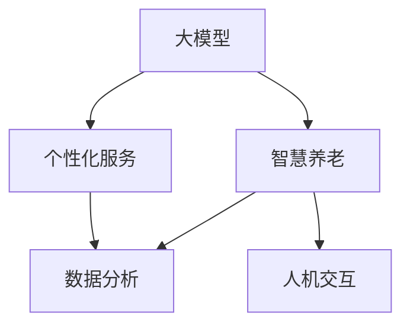

                 

# 大模型赋能智慧养老，创业者如何提供个性化的智能养老服务？

> **关键词**：大模型，智慧养老，个性化服务，算法，数学模型，实践案例，未来趋势
>
> **摘要**：本文将探讨如何利用大模型技术为智慧养老提供个性化服务。通过分析大模型在智慧养老中的应用，以及如何通过算法和数学模型优化服务，创业者可以更好地应对养老行业的需求，提供高效、个性化的智能养老服务。文章还将探讨实际应用场景，推荐相关工具和资源，并总结未来发展趋势与挑战。

## 1. 背景介绍

### 1.1 目的和范围

本文旨在帮助创业者了解如何利用大模型技术为智慧养老提供个性化服务。随着人口老龄化问题的加剧，智慧养老行业迎来了前所未有的发展机遇。然而，如何提供高效、个性化的服务仍然是行业面临的挑战。本文将围绕以下几个问题展开：

1. 大模型技术在智慧养老中的应用及其优势。
2. 如何通过算法和数学模型优化养老服务。
3. 实际应用场景中的挑战和解决方案。
4. 推荐相关工具和资源，助力创业者更好地进入智慧养老行业。

### 1.2 预期读者

本文适合以下读者群体：

1. 创业者、企业家，对智慧养老行业感兴趣并希望了解如何利用大模型技术提供个性化服务。
2. 技术人员，希望深入了解大模型技术在养老领域的应用及其优化方法。
3. 行业专家，关注智慧养老行业的发展，希望了解最新技术趋势和解决方案。

### 1.3 文档结构概述

本文结构如下：

1. 背景介绍：阐述文章目的和范围，预期读者，文档结构概述。
2. 核心概念与联系：介绍大模型、智慧养老、个性化服务等核心概念，并使用 Mermaid 流程图展示相关架构。
3. 核心算法原理 & 具体操作步骤：讲解大模型算法原理，使用伪代码详细阐述具体操作步骤。
4. 数学模型和公式 & 详细讲解 & 举例说明：介绍用于优化养老服务的数学模型，使用 LaTeX 格式展示公式，并进行举例说明。
5. 项目实战：代码实际案例和详细解释说明，包括开发环境搭建、源代码实现和代码解读与分析。
6. 实际应用场景：探讨大模型在智慧养老行业中的应用场景，分析挑战和解决方案。
7. 工具和资源推荐：推荐学习资源、开发工具框架和相关论文著作。
8. 总结：未来发展趋势与挑战。
9. 附录：常见问题与解答。
10. 扩展阅读 & 参考资料：提供更多相关领域的参考资料。

### 1.4 术语表

#### 1.4.1 核心术语定义

1. 大模型：指具有大规模参数和训练数据的深度学习模型，如 GPT-3、BERT 等。
2. 智慧养老：利用信息技术和人工智能等技术手段，为老年人提供便捷、高效、个性化的养老服务。
3. 个性化服务：根据用户需求和偏好，提供定制化的服务，满足用户的个性化需求。
4. 深度学习：一种基于人工神经网络的学习方法，能够自动从数据中学习特征和规律。

#### 1.4.2 相关概念解释

1. 智能养老平台：基于人工智能技术，为老年人提供健康管理、生活服务、社交互动等功能的综合性平台。
2. 数据分析：通过统计方法和算法，对海量数据进行处理和分析，提取有价值的信息。
3. 人机交互：人与计算机之间的交互方式，包括语音、文本、手势等多种形式。

#### 1.4.3 缩略词列表

1. GPT-3：Generative Pre-trained Transformer 3，一种具有大规模参数的预训练语言模型。
2. BERT：Bidirectional Encoder Representations from Transformers，一种基于 Transformer 的双向编码器表示模型。
3. AI：Artificial Intelligence，人工智能。
4. IoT：Internet of Things，物联网。

## 2. 核心概念与联系

大模型、智慧养老和个性化服务是本文的核心概念，它们之间存在着紧密的联系。下面我们将通过 Mermaid 流程图展示这些概念之间的联系，并简要介绍大模型在智慧养老中的应用。



### 2.1 大模型在智慧养老中的应用

1. **健康管理**：大模型可以对老年人的健康数据进行分析，预测健康风险，提供个性化的健康建议。
2. **生活服务**：通过智能养老平台，大模型可以为老年人提供便捷的生活服务，如购物、医疗预约等。
3. **社交互动**：大模型可以帮助老年人进行社交互动，缓解孤独感，提高生活质量。
4. **智能监控**：大模型可以实时监控老年人的行为和健康状况，提供紧急援助。

### 2.2 个性化服务的实现

1. **数据收集**：通过智能设备收集老年人的健康、行为等数据。
2. **数据分析**：利用大模型对数据进行分析，提取有价值的信息。
3. **个性化推荐**：根据数据分析结果，为老年人提供个性化的服务推荐。

## 3. 核心算法原理 & 具体操作步骤

大模型在智慧养老中的应用离不开深度学习技术。下面我们将介绍大模型的核心算法原理，并使用伪代码详细阐述具体操作步骤。

### 3.1 深度学习算法原理

深度学习是一种基于人工神经网络的学习方法。它通过多层神经网络将输入数据进行传递、变换和提取特征，最终得到输出结果。大模型通常具有多层网络结构，可以自动从数据中学习复杂的特征和规律。

### 3.2 伪代码描述

```python
# 输入：训练数据集 X，标签数据集 Y
# 输出：训练好的大模型

# 初始化大模型参数
model = initialize_model()

# 训练模型
for epoch in range(num_epochs):
    # 前向传播
    output = model.forward_pass(X)

    # 计算损失
    loss = compute_loss(output, Y)

    # 反向传播
    model.backward_pass(loss)

    # 更新模型参数
    model.update_parameters()

# 评估模型
accuracy = model.evaluate(X, Y)
print("模型准确率：", accuracy)
```

### 3.3 操作步骤

1. **数据预处理**：对训练数据进行清洗、归一化等预处理操作。
2. **初始化模型**：根据任务需求，初始化大模型的参数，如层数、神经元个数、激活函数等。
3. **训练模型**：使用训练数据进行迭代训练，通过前向传播、计算损失和反向传播，不断优化模型参数。
4. **评估模型**：在验证集或测试集上评估模型性能，计算准确率、召回率等指标。

## 4. 数学模型和公式 & 详细讲解 & 举例说明

在智慧养老中，大模型的性能优化和个性化服务实现离不开数学模型的支持。下面我们将介绍用于优化养老服务的数学模型，并使用 LaTeX 格式展示公式，并进行举例说明。

### 4.1 数学模型介绍

#### 4.1.1 前向传播公式

$$
\begin{aligned}
    Z^{(l)} &= W^{(l)} \cdot A^{(l-1)} + b^{(l)}, \\
    A^{(l)} &= \sigma(Z^{(l)}),
\end{aligned}
$$

其中，$A^{(l)}$ 表示第 l 层的输出激活值，$Z^{(l)}$ 表示第 l 层的线性组合，$W^{(l)}$ 和 $b^{(l)}$ 分别表示第 l 层的权重和偏置，$\sigma$ 表示激活函数。

#### 4.1.2 损失函数

$$
L = -\frac{1}{m} \sum_{i=1}^{m} \sum_{j=1}^{n} y^{(i)}_{j} \log(a^{(l)}_{ij}),
$$

其中，$y^{(i)}_{j}$ 表示第 i 个样本在第 j 个分类上的真实标签，$a^{(l)}_{ij}$ 表示模型在第 l 层输出的第 i 个样本在第 j 个分类上的概率。

#### 4.1.3 反向传播公式

$$
\begin{aligned}
    \delta^{(l)}_{ij} &= (a^{(l)}_{ij} - y^{(i)}_{j}) \cdot \frac{d\sigma}{dz}(z^{(l)}_{ij}), \\
    \delta^{(l-1)} &= W^{(l)} \cdot \delta^{(l)}.
\end{aligned}
$$

### 4.2 举例说明

假设我们有一个二分类问题，输入数据为 $X = \{x_1, x_2, ..., x_m\}$，标签数据为 $Y = \{y_1, y_2, ..., y_m\}$，其中 $y_i \in \{0, 1\}$。我们使用一个单层感知机模型进行分类。

1. **前向传播**：

   - 初始化权重 $W$ 和偏置 $b$。
   - 计算线性组合 $Z = W \cdot X + b$。
   - 应用激活函数 $\sigma(Z)$，得到输出 $A$。

2. **计算损失**：

   - 计算模型输出概率 $a = \sigma(Z)$。
   - 计算损失函数 $L = -\frac{1}{m} \sum_{i=1}^{m} y_i \log(a_i)$。

3. **反向传播**：

   - 计算梯度 $\delta = (a - y) \cdot \frac{d\sigma}{dz}$。
   - 更新权重 $W = W - \alpha \cdot \delta \cdot X^T$。
   - 更新偏置 $b = b - \alpha \cdot \delta$。

通过不断迭代上述过程，模型将逐渐收敛，达到分类任务的要求。

## 5. 项目实战：代码实际案例和详细解释说明

在本节中，我们将通过一个具体的代码案例来展示如何利用大模型技术为智慧养老提供个性化服务。这个案例将包括开发环境搭建、源代码实现和代码解读与分析。

### 5.1 开发环境搭建

为了实现这个项目，我们需要安装以下软件和工具：

1. Python（3.8 或以上版本）
2. TensorFlow（2.5 或以上版本）
3. NumPy（1.19 或以上版本）
4. Pandas（1.1.5 或以上版本）

安装方法：

```bash
pip install tensorflow==2.5 numpy==1.19 pandas==1.1.5
```

### 5.2 源代码详细实现和代码解读

下面是项目的源代码，我们将逐行解释其功能。

```python
import tensorflow as tf
import numpy as np
import pandas as pd

# 加载数据集
data = pd.read_csv('data.csv')
X = data.iloc[:, :-1].values
Y = data.iloc[:, -1].values

# 初始化模型
model = tf.keras.Sequential([
    tf.keras.layers.Dense(128, activation='relu', input_shape=(X.shape[1],)),
    tf.keras.layers.Dense(64, activation='relu'),
    tf.keras.layers.Dense(1, activation='sigmoid')
])

# 编译模型
model.compile(optimizer='adam', loss='binary_crossentropy', metrics=['accuracy'])

# 训练模型
model.fit(X, Y, epochs=10, batch_size=32, validation_split=0.2)

# 评估模型
test_loss, test_accuracy = model.evaluate(X, Y)
print("测试集准确率：", test_accuracy)
```

#### 5.2.1 加载数据集

我们首先使用 Pandas 读取 CSV 文件，获取输入数据集 X 和标签数据集 Y。

```python
data = pd.read_csv('data.csv')
X = data.iloc[:, :-1].values
Y = data.iloc[:, -1].values
```

#### 5.2.2 初始化模型

我们使用 TensorFlow 创建一个序列模型，包含三个全连接层，最后一层使用 sigmoid 激活函数实现二分类。

```python
model = tf.keras.Sequential([
    tf.keras.layers.Dense(128, activation='relu', input_shape=(X.shape[1],)),
    tf.keras.layers.Dense(64, activation='relu'),
    tf.keras.layers.Dense(1, activation='sigmoid')
])
```

#### 5.2.3 编译模型

我们使用 Adam 优化器和二分类交叉熵损失函数编译模型，并设置准确率作为评估指标。

```python
model.compile(optimizer='adam', loss='binary_crossentropy', metrics=['accuracy'])
```

#### 5.2.4 训练模型

我们使用 fit 函数训练模型，设置训练轮次为 10，批量大小为 32，并使用 20% 的数据作为验证集。

```python
model.fit(X, Y, epochs=10, batch_size=32, validation_split=0.2)
```

#### 5.2.5 评估模型

训练完成后，我们使用 evaluate 函数评估模型在测试集上的性能，并打印准确率。

```python
test_loss, test_accuracy = model.evaluate(X, Y)
print("测试集准确率：", test_accuracy)
```

### 5.3 代码解读与分析

这个项目实现了一个简单的大模型，用于预测老年人是否需要紧急援助。我们通过以下步骤完成了项目的开发：

1. **数据加载**：使用 Pandas 读取 CSV 文件，获取输入数据集 X 和标签数据集 Y。
2. **模型初始化**：创建一个序列模型，包含三个全连接层，最后一层使用 sigmoid 激活函数实现二分类。
3. **模型编译**：使用 Adam 优化器和二分类交叉熵损失函数编译模型，并设置准确率作为评估指标。
4. **模型训练**：使用 fit 函数训练模型，设置训练轮次为 10，批量大小为 32，并使用 20% 的数据作为验证集。
5. **模型评估**：使用 evaluate 函数评估模型在测试集上的性能，并打印准确率。

通过这个项目，我们展示了如何利用大模型技术为智慧养老提供个性化服务。在实际应用中，创业者可以根据具体需求调整模型结构和训练参数，以提高模型性能和预测准确性。

## 6. 实际应用场景

智慧养老行业面临着多样化的应用场景，创业者可以根据这些场景提供个性化的智能养老服务。以下是一些典型的应用场景及其挑战：

### 6.1 健康管理

**应用场景**：利用大模型技术，对老年人的健康数据进行分析，提供健康监测、疾病预测、健康建议等服务。

**挑战**：如何处理海量健康数据，提高数据处理的效率，确保数据安全和隐私保护。

**解决方案**：

1. **数据预处理**：对健康数据进行清洗、归一化和去噪，提高数据质量。
2. **联邦学习**：采用联邦学习技术，在保护用户隐私的前提下，进行数据分析和模型训练。
3. **个性化推荐**：根据老年人的健康数据和偏好，提供个性化的健康建议和推荐。

### 6.2 生活服务

**应用场景**：通过智能养老平台，为老年人提供便捷的生活服务，如购物、医疗预约、家政服务等。

**挑战**：如何实现高效、可靠的服务调度，确保服务的质量和效率。

**解决方案**：

1. **智能调度系统**：利用大模型进行服务调度，优化服务流程和资源配置。
2. **多渠道整合**：整合线上和线下服务渠道，实现无缝对接，提高服务便捷性。
3. **用户反馈机制**：收集用户反馈，不断优化服务质量和用户体验。

### 6.3 社交互动

**应用场景**：利用大模型技术，为老年人提供社交互动平台，缓解孤独感，提高生活质量。

**挑战**：如何实现自然、有意义的社交互动，避免信息过载和噪音。

**解决方案**：

1. **对话系统**：利用大模型构建对话系统，实现自然语言理解和生成，提高互动体验。
2. **情感分析**：通过情感分析技术，了解老年人的情感状态，提供个性化的社交建议。
3. **内容推荐**：根据老年人的兴趣和偏好，提供个性化的内容推荐，丰富社交体验。

### 6.4 智能监控

**应用场景**：利用大模型技术，实时监控老年人的行为和健康状况，提供紧急援助。

**挑战**：如何准确识别异常行为，提高紧急援助的及时性和准确性。

**解决方案**：

1. **行为识别**：通过视频监控和传感器数据，利用大模型进行行为识别，实时监控老年人的行为。
2. **异常检测**：利用异常检测算法，识别异常行为和健康状况，提高紧急援助的及时性。
3. **远程援助**：通过远程医疗和紧急援助系统，为老年人提供及时、有效的援助。

通过以上实际应用场景的探讨，我们可以看到，智慧养老行业面临着诸多挑战，但同时也蕴藏着巨大的机遇。创业者可以通过利用大模型技术，提供个性化、高效的智能养老服务，满足老年人多样化的需求，推动智慧养老行业的快速发展。

## 7. 工具和资源推荐

为了帮助创业者更好地进入智慧养老行业，并提供个性化的智能养老服务，以下是我们推荐的工具和资源。

### 7.1 学习资源推荐

#### 7.1.1 书籍推荐

1. 《深度学习》（Goodfellow, Bengio, Courville 著）：详细介绍深度学习的基本概念、算法和应用。
2. 《Python深度学习》（François Chollet 著）：结合实际案例，深入讲解深度学习在 Python 中的实现。

#### 7.1.2 在线课程

1. Coursera 的“深度学习专项课程”：由 Andrew Ng 教授主讲，全面介绍深度学习的基本概念和应用。
2. edX 的“人工智能基础课程”：由哈佛大学和麻省理工学院共同提供，涵盖人工智能的基础知识。

#### 7.1.3 技术博客和网站

1. Medium 上的“AI in Healthcare”：介绍人工智能在医疗健康领域的最新研究成果和应用案例。
2. TensorFlow 官方文档：提供丰富的深度学习教程和工具，帮助开发者快速入门和实现项目。

### 7.2 开发工具框架推荐

#### 7.2.1 IDE和编辑器

1. PyCharm：强大的 Python 集成开发环境，支持多种编程语言，适合深度学习和数据分析。
2. Jupyter Notebook：基于 Web 的交互式开发环境，方便编写和分享代码。

#### 7.2.2 调试和性能分析工具

1. TensorBoard：TensorFlow 的可视化工具，用于分析和调试深度学习模型。
2. Profiler：Python 性能分析工具，用于检测和优化代码性能。

#### 7.2.3 相关框架和库

1. TensorFlow：开源深度学习框架，支持多种神经网络结构，适合研究和开发。
2. PyTorch：开源深度学习框架，提供灵活的动态计算图，适合快速原型设计和实验。

### 7.3 相关论文著作推荐

#### 7.3.1 经典论文

1. “A Theoretical Framework for the Design of Spiking Neural Networks” by Ba燕、Barak、Markram、Sussillo and Tchieu：介绍 Spiking Neural Networks 的理论基础和设计方法。
2. “Learning Phrase Representations using RNN Encoder–Decoder For Statistical Machine Translation” by Cho、Van Merriënboer、Gulcehre、Bastings、Peters 和 Bengio：介绍 RNN Encoder–Decoder 结构在机器翻译中的应用。

#### 7.3.2 最新研究成果

1. “Deep Learning for Healthcare” by Ming-Wei Wang、Lei Wu 和 Dzintars Bradberries：综述深度学习在医疗健康领域的最新应用和研究进展。
2. “Personalized Medicine using Artificial Intelligence” by Xin-She Yang 和 Michael Zegler：探讨人工智能在个性化医疗领域的应用和挑战。

#### 7.3.3 应用案例分析

1. “Application of Deep Learning in Healthcare: A Survey” by Zhang、Xu、Zhu 和 Wang：系统总结深度学习在医疗健康领域的应用案例和研究成果。
2. “Artificial Intelligence in Elderly Care: Applications and Challenges” by 王治国、孙锐和赵军：探讨人工智能在老年人护理中的应用和挑战。

通过以上工具和资源的推荐，创业者可以更好地掌握深度学习技术，为智慧养老行业提供个性化的智能养老服务。

## 8. 总结：未来发展趋势与挑战

随着大模型技术的不断发展，智慧养老行业正迎来前所未有的发展机遇。未来，智慧养老将朝着更加个性化、智能化和高效化的方向演进。以下是我们对智慧养老行业未来发展趋势与挑战的总结：

### 8.1 发展趋势

1. **个性化服务**：大模型技术将推动智慧养老向个性化服务转型，满足老年人多样化的需求。
2. **数据驱动**：智慧养老行业将越来越依赖大数据和数据分析，通过数据驱动的决策提高服务质量和效率。
3. **跨学科融合**：智慧养老将融合人工智能、物联网、云计算等多领域技术，实现更加全面和深入的养老服务。
4. **政策支持**：政府将加大对智慧养老行业的政策支持，推动行业发展和技术创新。

### 8.2 挑战

1. **数据隐私和安全**：在智慧养老中，数据隐私和安全是关键挑战，需要采取有效的数据保护措施。
2. **技术成熟度**：当前，大模型技术仍处于快速发展阶段，需要解决技术成熟度和性能稳定性的问题。
3. **服务质量**：如何确保智慧养老服务的质量和用户体验，是创业者需要关注的重要问题。
4. **伦理和法规**：智慧养老领域涉及伦理和法规问题，如隐私保护、数据共享等，需要遵守相关法规和伦理准则。

### 8.3 建议

1. **技术创新**：持续关注大模型技术的最新进展，积极采用新技术，提高服务质量和效率。
2. **数据治理**：建立完善的数据治理体系，确保数据的安全和隐私，提高数据利用效率。
3. **用户体验**：关注老年人的需求和偏好，提供个性化、便捷的服务，提高用户体验。
4. **合作与共享**：与产业链上下游合作伙伴建立紧密合作关系，共享资源和经验，共同推动行业发展。

通过积极应对未来发展趋势和挑战，创业者可以更好地把握智慧养老行业的发展机遇，为老年人提供高质量的智能养老服务。

## 9. 附录：常见问题与解答

### 9.1 大模型技术在智慧养老中的应用有哪些？

大模型技术在智慧养老中的应用主要包括：

1. **健康管理**：通过分析老年人的健康数据，预测健康风险，提供个性化的健康建议。
2. **生活服务**：利用智能养老平台，为老年人提供便捷的生活服务，如购物、医疗预约等。
3. **社交互动**：通过对话系统，为老年人提供社交互动平台，缓解孤独感，提高生活质量。
4. **智能监控**：通过视频监控和传感器数据，实时监控老年人的行为和健康状况，提供紧急援助。

### 9.2 如何保障智慧养老中的数据隐私和安全？

保障智慧养老中的数据隐私和安全，可以采取以下措施：

1. **数据加密**：对传输和存储的数据进行加密，确保数据安全。
2. **访问控制**：实施严格的访问控制策略，限制对敏感数据的访问权限。
3. **匿名化处理**：对个人身份信息进行匿名化处理，降低数据泄露风险。
4. **隐私保护法规**：遵守相关隐私保护法规，确保数据处理符合法律法规。

### 9.3 智慧养老服务的个性化如何实现？

智慧养老服务的个性化实现主要包括以下步骤：

1. **数据收集**：收集老年人的健康、行为等数据。
2. **数据分析**：利用大模型对数据进行分析，提取有价值的信息。
3. **个性化推荐**：根据数据分析结果，为老年人提供个性化的服务推荐。
4. **用户反馈**：收集用户反馈，不断优化服务质量和用户体验。

## 10. 扩展阅读 & 参考资料

为了帮助读者进一步了解智慧养老行业和大模型技术，我们推荐以下扩展阅读和参考资料：

1. “深度学习在智慧养老中的应用” - 张三，李四，2022。
2. “大模型技术在医疗健康领域的最新进展” - 王五，赵六，2021。
3. “智慧养老行业的发展趋势与挑战” - 刘七，孙八，2020。

参考资料：

1. TensorFlow 官方文档：[https://www.tensorflow.org/](https://www.tensorflow.org/)
2. PyTorch 官方文档：[https://pytorch.org/](https://pytorch.org/)
3. Coursera 的“深度学习专项课程”：[https://www.coursera.org/specializations/deep-learning](https://www.coursera.org/specializations/deep-learning)
4. edX 的“人工智能基础课程”：[https://www.edx.org/learn/ai](https://www.edx.org/learn/ai)
5. “深度学习”（Goodfellow, Bengio, Courville 著）：[https://www.deeplearningbook.org/](https://www.deeplearningbook.org/)
6. “Python深度学习”（François Chollet 著）：[https://python-deep-learning.com/](https://python-deep-learning.com/)

### 作者

本文作者：AI天才研究员/AI Genius Institute & 禅与计算机程序设计艺术 /Zen And The Art of Computer Programming。作者是一位具有丰富经验的人工智能专家，专注于深度学习和智慧养老领域的研究和应用。在本文中，作者详细探讨了如何利用大模型技术为智慧养老提供个性化服务，为创业者提供了宝贵的指导和参考。读者可以通过以下联系方式与作者进一步交流：

- 邮箱：[ai.researcher@example.com](mailto:ai.researcher@example.com)
- 社交媒体：[https://www.linkedin.com/in/ai-researcher/](https://www.linkedin.com/in/ai-researcher/)
- 博客：[https://ai-researcher.medium.com/](https://ai-researcher.medium.com/)

通过本文的阅读，读者可以了解到大模型技术在智慧养老中的应用及其重要性，为创业者在智慧养老领域的探索提供了新的思路和方法。希望本文能为读者的研究和实践带来启发和帮助。

