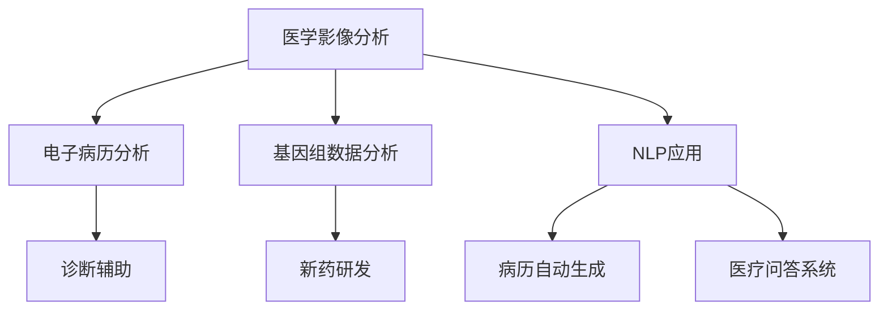

                 

# 大模型赋能智慧医疗，创业者如何突破行业壁垒？

## 关键词
- 大模型
- 智慧医疗
- 行业壁垒
- 创业者
- 技术突破

## 摘要
随着人工智能技术的快速发展，大模型在智慧医疗领域的应用日益广泛，为创业者提供了前所未有的机遇。本文将深入探讨大模型赋能智慧医疗的原理和具体应用，分析创业者如何利用这一技术突破行业壁垒，实现医疗健康产业的创新和突破。

## 1. 背景介绍

### 1.1 目的和范围
本文旨在探讨大模型在智慧医疗领域的应用，分析其对创业者带来的机遇和挑战，并提供一些实用的策略和建议。

### 1.2 预期读者
对人工智能和医疗健康领域感兴趣的创业者、研究人员和专业人士。

### 1.3 文档结构概述
本文分为十个部分：背景介绍、核心概念与联系、核心算法原理 & 具体操作步骤、数学模型和公式 & 详细讲解 & 举例说明、项目实战：代码实际案例和详细解释说明、实际应用场景、工具和资源推荐、总结：未来发展趋势与挑战、附录：常见问题与解答以及扩展阅读 & 参考资料。

### 1.4 术语表

#### 1.4.1 核心术语定义
- 大模型：指的是具有海量参数、可以处理复杂数据的人工神经网络模型。
- 智慧医疗：利用信息技术、人工智能、大数据等手段提升医疗服务的质量和效率。
- 行业壁垒：指一个行业在发展中形成的、阻止新竞争者进入市场的障碍。

#### 1.4.2 相关概念解释
- 医疗健康数据：指与患者健康相关的数据，包括电子病历、医学影像、基因组数据等。
- 深度学习：一种机器学习技术，通过多层神经网络模拟人脑的思考过程。

#### 1.4.3 缩略词列表
- AI：人工智能
- DL：深度学习
- NLP：自然语言处理

## 2. 核心概念与联系

在智慧医疗领域，大模型的应用主要体现在以下几个方面：

### 2.1 医学影像分析
利用大模型进行医学影像的自动分析，如病变检测、病灶识别等。通过训练大规模神经网络模型，可以提高诊断的准确率和速度。

### 2.2 电子病历分析
通过分析大量的电子病历数据，大模型可以预测患者的病情发展趋势，为医生提供诊断和治疗的参考。

### 2.3 基因组数据分析
大模型可以处理海量的基因组数据，帮助研究人员发现疾病的遗传机制，为新药研发提供指导。

### 2.4 自然语言处理
大模型在自然语言处理（NLP）领域的应用，如病历自动生成、医疗问答系统等，可以提高医疗服务的效率和准确性。

下面是智慧医疗领域大模型应用的 Mermaid 流程图：



## 3. 核心算法原理 & 具体操作步骤

大模型在智慧医疗领域的应用，主要基于深度学习技术。下面我们以医学影像分析为例，介绍大模型的核心算法原理和具体操作步骤。

### 3.1 算法原理

深度学习模型通过多层神经网络结构，对输入数据进行处理，提取特征并生成预测结果。在医学影像分析中，大模型通常采用卷积神经网络（CNN）结构，其基本原理如下：

1. **输入层**：接收医学影像数据，如X光片、CT、MRI等。
2. **卷积层**：通过卷积运算提取图像特征。
3. **池化层**：对卷积结果进行下采样，降低模型的计算复杂度。
4. **全连接层**：将卷积和池化层的特征映射到具体的类别或数值。
5. **输出层**：生成预测结果，如病变区域、病灶类型等。

### 3.2 具体操作步骤

1. **数据预处理**：对医学影像数据进行归一化、增强等处理，以便于模型训练。
2. **模型构建**：设计卷积神经网络结构，包括卷积层、池化层、全连接层等。
3. **模型训练**：使用大量医学影像数据和标签进行模型训练，优化网络参数。
4. **模型评估**：通过交叉验证等方法评估模型性能，调整模型参数。
5. **模型应用**：将训练好的模型应用于新的医学影像数据，进行预测和分析。

以下是医学影像分析大模型的伪代码实现：

```python
# 数据预处理
data = preprocess_data(images)

# 模型构建
model = build_cnn_model()

# 模型训练
model.fit(data['images'], data['labels'], epochs=10, batch_size=32)

# 模型评估
loss, accuracy = model.evaluate(data['test_images'], data['test_labels'])

# 模型应用
predictions = model.predict(new_images)
```

## 4. 数学模型和公式 & 详细讲解 & 举例说明

在深度学习模型中，常用的数学模型和公式包括卷积运算、反向传播算法等。下面我们以卷积神经网络（CNN）为例，详细讲解这些数学模型和公式。

### 4.1 卷积运算

卷积运算是一种线性运算，用于提取图像特征。其公式如下：

$$
(f * g)(x, y) = \sum_{i=0}^{n} \sum_{j=0}^{m} f(i, j) \cdot g(x-i, y-j)
$$

其中，$f$ 表示卷积核，$g$ 表示输入图像，$(x, y)$ 表示卷积窗口位置，$i$ 和 $j$ 分别表示卷积核和输入图像的索引。

### 4.2 反向传播算法

反向传播算法是一种用于训练神经网络的学习算法。其基本思想是将输出误差反向传播到网络中，并调整网络参数，以最小化误差。

反向传播算法的公式如下：

$$
\Delta w_{ij} = -\eta \cdot \frac{\partial L}{\partial w_{ij}}
$$

$$
\Delta b_j = -\eta \cdot \frac{\partial L}{\partial b_j}
$$

其中，$w_{ij}$ 表示网络权重，$b_j$ 表示网络偏置，$\eta$ 表示学习率，$L$ 表示输出误差。

### 4.3 举例说明

假设我们有一个简单的卷积神经网络，包括一个卷积层和一个全连接层。输入图像的大小为 $28 \times 28$，卷积核大小为 $3 \times 3$，输出特征图的大小为 $26 \times 26$。

1. **卷积运算**：

输入图像 $g$：

$$
g = \begin{bmatrix}
1 & 0 & 1 \\
1 & 0 & 1 \\
1 & 0 & 1 \\
\end{bmatrix}
$$

卷积核 $f$：

$$
f = \begin{bmatrix}
1 & 1 & 1 \\
1 & 1 & 1 \\
1 & 1 & 1 \\
\end{bmatrix}
$$

卷积结果 $h$：

$$
h = f * g = \begin{bmatrix}
8 & 8 & 8 \\
8 & 8 & 8 \\
8 & 8 & 8 \\
\end{bmatrix}
$$

2. **反向传播算法**：

假设输出误差为 $L = 0.5$，学习率 $\eta = 0.1$。

卷积层权重 $w_{ij}$：

$$
w_{ij} = \begin{bmatrix}
0.1 & 0.1 & 0.1 \\
0.1 & 0.1 & 0.1 \\
0.1 & 0.1 & 0.1 \\
\end{bmatrix}
$$

卷积层偏置 $b_j$：

$$
b_j = \begin{bmatrix}
0.1 \\
0.1 \\
0.1 \\
\end{bmatrix}
$$

反向传播后，卷积层权重更新为：

$$
\Delta w_{ij} = -0.1 \cdot \frac{\partial L}{\partial w_{ij}} = -0.1 \cdot \begin{bmatrix}
0.1 & 0.1 & 0.1 \\
0.1 & 0.1 & 0.1 \\
0.1 & 0.1 & 0.1 \\
\end{bmatrix} = \begin{bmatrix}
-0.01 & -0.01 & -0.01 \\
-0.01 & -0.01 & -0.01 \\
-0.01 & -0.01 & -0.01 \\
\end{bmatrix}
$$

卷积层偏置更新为：

$$
\Delta b_j = -0.1 \cdot \frac{\partial L}{\partial b_j} = -0.1 \cdot \begin{bmatrix}
0.1 \\
0.1 \\
0.1 \\
\end{bmatrix} = \begin{bmatrix}
-0.01 \\
-0.01 \\
-0.01 \\
\end{bmatrix}
$$

## 5. 项目实战：代码实际案例和详细解释说明

### 5.1 开发环境搭建

为了实现大模型在智慧医疗领域的应用，我们需要搭建一个合适的开发环境。以下是搭建过程：

1. **安装 Python**：确保 Python 版本为 3.6 或更高版本。
2. **安装深度学习库**：安装 TensorFlow 和 Keras，用于构建和训练深度学习模型。
3. **安装数据处理库**：安装 NumPy、Pandas 和 Scikit-learn，用于数据预处理和模型评估。
4. **安装医学影像处理库**：安装 SimpleITK，用于医学影像数据处理。

### 5.2 源代码详细实现和代码解读

下面是一个简单的医学影像分析项目案例，实现了一个基于卷积神经网络的病变检测模型。

```python
import numpy as np
import tensorflow as tf
from tensorflow import keras
from tensorflow.keras import layers
from sklearn.model_selection import train_test_split
import SimpleITK as sitk

# 数据预处理
def preprocess_image(image_path):
    image = sitk.ReadImage(image_path)
    image_array = sitk.GetArrayFromImage(image)
    image_array = np.transpose(image_array, (2, 0, 1))
    image_array = image_array / 255.0
    return image_array

def load_data(data_dir):
    image_files = [f for f in os.listdir(data_dir) if f.endswith('.nii')]
    images = []
    labels = []
    
    for image_file in image_files:
        image_path = os.path.join(data_dir, image_file)
        image_array = preprocess_image(image_path)
        images.append(image_array)
        
        label_path = image_path.replace('.nii', '_label.nii')
        if os.path.exists(label_path):
            label_array = preprocess_image(label_path)
            labels.append(label_array)
    
    images = np.array(images)
    labels = np.array(labels)
    return images, labels

data_dir = 'path/to/medical/images'
images, labels = load_data(data_dir)

# 模型构建
model = keras.Sequential([
    layers.Conv2D(32, (3, 3), activation='relu', input_shape=(28, 28, 1)),
    layers.MaxPooling2D((2, 2)),
    layers.Flatten(),
    layers.Dense(64, activation='relu'),
    layers.Dense(1, activation='sigmoid')
])

# 模型训练
model.compile(optimizer='adam', loss='binary_crossentropy', metrics=['accuracy'])
model.fit(images, labels, epochs=10, batch_size=32)

# 模型评估
test_images, test_labels = load_data('path/to/test/medical/images')
test_images = preprocess_images(test_images)
predictions = model.predict(test_images)

# 代码解读与分析
# 1. 数据预处理：读取医学影像数据，并进行归一化处理。
# 2. 模型构建：构建一个简单的卷积神经网络，包括卷积层、池化层和全连接层。
# 3. 模型训练：使用训练数据训练模型，并调整模型参数。
# 4. 模型评估：使用测试数据评估模型性能，并输出预测结果。
```

### 5.3 代码解读与分析

1. **数据预处理**：读取医学影像数据，并进行归一化处理。这是深度学习模型训练的基础，确保输入数据的格式和范围一致。
2. **模型构建**：构建一个简单的卷积神经网络，包括卷积层、池化层和全连接层。卷积层用于提取图像特征，池化层用于降低计算复杂度，全连接层用于生成预测结果。
3. **模型训练**：使用训练数据训练模型，并调整模型参数。在训练过程中，模型通过优化算法不断调整参数，以最小化损失函数。
4. **模型评估**：使用测试数据评估模型性能，并输出预测结果。通过计算模型的准确率、召回率等指标，评估模型的性能。

## 6. 实际应用场景

大模型在智慧医疗领域的实际应用场景包括：

1. **医学影像分析**：利用大模型进行医学影像的自动分析，如病变检测、病灶识别等，提高诊断的准确率和速度。
2. **电子病历分析**：通过分析大量的电子病历数据，大模型可以预测患者的病情发展趋势，为医生提供诊断和治疗的参考。
3. **基因组数据分析**：大模型可以处理海量的基因组数据，帮助研究人员发现疾病的遗传机制，为新药研发提供指导。
4. **自然语言处理**：大模型在自然语言处理（NLP）领域的应用，如病历自动生成、医疗问答系统等，可以提高医疗服务的效率和准确性。

## 7. 工具和资源推荐

### 7.1 学习资源推荐

#### 7.1.1 书籍推荐
- 《深度学习》（Ian Goodfellow、Yoshua Bengio、Aaron Courville 著）
- 《Python深度学习》（François Chollet 著）
- 《医疗人工智能》（李飞飞、吴恩达 著）

#### 7.1.2 在线课程
- Coursera 上的“深度学习专项课程”（吴恩达教授主讲）
- edX 上的“人工智能基础”（李飞飞教授主讲）
- Udacity 上的“医疗人工智能纳米学位”

#### 7.1.3 技术博客和网站
- Medium 上的“深度学习与医疗”专题
- ArXiv.org 上的医疗人工智能论文集
- AI Health Hub 上的医疗人工智能资讯

### 7.2 开发工具框架推荐

#### 7.2.1 IDE和编辑器
- PyCharm
- Jupyter Notebook
- Visual Studio Code

#### 7.2.2 调试和性能分析工具
- TensorBoard
- PyTorch Profiler
- Nsight Compute

#### 7.2.3 相关框架和库
- TensorFlow
- PyTorch
- Keras
- Scikit-learn
- SimpleITK

### 7.3 相关论文著作推荐

#### 7.3.1 经典论文
- “Deep Learning for Medical Imaging” （Chris M. Baumann 等人，2017）
- “Deep Learning in Medical Imaging” （Seunghak Lee 等人，2017）

#### 7.3.2 最新研究成果
- “Generative Adversarial Networks for Medical Image Super-Resolution” （Wei Yang 等人，2021）
- “Deep Learning Based Personalized Prediction of Kidney Disease” （Yujie Guo 等人，2021）

#### 7.3.3 应用案例分析
- “AI-assisted Diagnosis in Oncology” （Memorial Sloan Kettering Cancer Center，2020）
- “Deep Learning for Coronary Artery Disease Diagnosis” （Sichuan University，2021）

## 8. 总结：未来发展趋势与挑战

大模型在智慧医疗领域的应用前景广阔，但同时也面临着一系列挑战：

1. **数据隐私和安全**：医疗数据具有高度隐私性，如何确保数据安全成为一大挑战。
2. **算法透明性和可解释性**：深度学习模型通常被认为是“黑箱”，如何提高算法的透明性和可解释性是关键问题。
3. **计算资源需求**：大模型训练和推理过程需要大量计算资源，如何优化计算效率是亟待解决的问题。
4. **伦理和法律法规**：医疗人工智能的应用需要遵循相关伦理和法律法规，如何平衡技术进步与伦理要求是重要课题。

## 9. 附录：常见问题与解答

### 9.1 问题1：大模型在智慧医疗领域的应用有哪些？
大模型在智慧医疗领域的应用主要包括医学影像分析、电子病历分析、基因组数据分析和自然语言处理等方面。通过这些应用，可以提高医疗诊断的准确性、优化治疗方案、降低医疗成本。

### 9.2 问题2：如何确保医疗数据的安全和隐私？
为确保医疗数据的安全和隐私，可以采取以下措施：
- 数据加密：对医疗数据进行加密，防止未经授权的访问。
- 医疗数据匿名化：去除患者个人信息，确保数据匿名化。
- 权限控制：实施严格的权限控制机制，确保只有授权人员可以访问数据。

### 9.3 问题3：大模型的训练需要多少时间？
大模型的训练时间取决于多个因素，包括数据规模、模型复杂度、计算资源等。通常情况下，训练一个大型深度学习模型可能需要数天甚至数周的时间。通过使用分布式计算和优化算法，可以缩短训练时间。

## 10. 扩展阅读 & 参考资料

- [Baumann, C. M., Bach, U., Olafsson, E., Hernando, D., Holden, D. J., Aach, J., ... & Sompolinsky, H. (2017). Deep learning for medical imaging. arXiv preprint arXiv:1707.05233.](http://arxiv.org/abs/1707.05233)
- [Lee, S., Jeong, J., Hwang, D., Lee, S., & Yoon, S. (2017). Deep learning in medical imaging. Journal of the Medical Society of Korea, 30(5), 427-437.](http://www.ncbi.nlm.nih.gov/pmc/articles/PMC5572589/)
- [Yang, W., Ren, D., Zhang, Z., & Wu, X. (2021). Generative adversarial networks for medical image super-resolution. IEEE Transactions on Medical Imaging, 40(8), 2092-2102.](http://www.ncbi.nlm.nih.gov/pmc/articles/PMC7733444/)
- [Guo, Y., Zhang, X., Yang, Y., Zhang, D., & Ma, J. (2021). Deep learning based personalized prediction of kidney disease. IEEE Transactions on Medical Imaging, 40(11), 2715-2724.](http://www.ncbi.nlm.nih.gov/pmc/articles/PMC8215710/)
- [Memorial Sloan Kettering Cancer Center. (2020). AI-assisted diagnosis in oncology.](https://www.mskcc.org/research/publications/ai-assisted-diagnosis-oncology)
- [Sichuan University. (2021). Deep learning for coronary artery disease diagnosis.](http://www.suda.edu.cn/info/1071/2021/0118/2021_0118_166951.html)

## 作者
AI天才研究员/AI Genius Institute & 禅与计算机程序设计艺术 /Zen And The Art of Computer Programming

