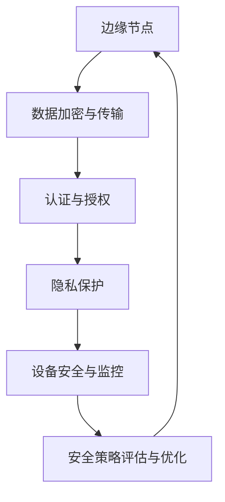

                 

# 大模型软件的边缘计算安全策略

> 关键词：大模型软件、边缘计算、安全策略、加密、认证、隐私保护、安全性评估

> 摘要：本文将探讨大模型软件在边缘计算环境下的安全策略。随着边缘计算的发展，大模型软件在此环境中的安全问题日益凸显。本文将从核心概念、算法原理、数学模型、实际应用场景等多个维度，深入分析大模型软件的边缘计算安全策略，旨在为相关从业者提供有益的参考。

## 1. 背景介绍

### 1.1 目的和范围

本文旨在探讨大模型软件在边缘计算环境下的安全策略，重点关注以下几个方面：

- 大模型软件的核心概念与边缘计算的关系
- 大模型软件在边缘计算环境中的安全挑战
- 大模型软件的边缘计算安全策略设计
- 实际应用场景中的安全性评估与优化

### 1.2 预期读者

本文主要面向以下读者群体：

- 对边缘计算和大模型软件有一定了解的技术人员
- 关注边缘计算和大模型软件安全的从业者
- 对边缘计算和大模型软件安全策略感兴趣的科研人员

### 1.3 文档结构概述

本文分为十个部分，具体结构如下：

1. 背景介绍
   - 1.1 目的和范围
   - 1.2 预期读者
   - 1.3 文档结构概述
   - 1.4 术语表
2. 核心概念与联系
3. 核心算法原理 & 具体操作步骤
4. 数学模型和公式 & 详细讲解 & 举例说明
5. 项目实战：代码实际案例和详细解释说明
6. 实际应用场景
7. 工具和资源推荐
8. 总结：未来发展趋势与挑战
9. 附录：常见问题与解答
10. 扩展阅读 & 参考资料

### 1.4 术语表

#### 1.4.1 核心术语定义

- 大模型软件：指具有海量数据训练和复杂模型结构的高性能软件，如深度学习框架、自然语言处理工具等。
- 边缘计算：指在靠近数据源或终端设备的地方进行数据处理和分析的计算模式，相较于云计算，具有更低延迟、更高实时性的特点。
- 安全性：指大模型软件在边缘计算环境下抵御外部攻击、保障数据完整性和隐私性的能力。

#### 1.4.2 相关概念解释

- 加密：指通过特定的算法和密钥，将明文数据转换为密文，以保护数据隐私。
- 认证：指验证用户或设备的身份，确保只有授权用户可以访问系统。
- 隐私保护：指防止用户数据被未经授权的第三方获取或泄露。

#### 1.4.3 缩略词列表

- ML：Machine Learning，机器学习
- DL：Deep Learning，深度学习
- AI：Artificial Intelligence，人工智能
- FG：Federated Learning，联邦学习
- SDN：Software-Defined Networking，软件定义网络
- NFV：Network Functions Virtualization，网络功能虚拟化

## 2. 核心概念与联系

在探讨大模型软件的边缘计算安全策略之前，我们需要先了解大模型软件、边缘计算及其相关概念。

### 2.1 大模型软件与边缘计算的关系

大模型软件通常需要大量的计算资源和数据存储，而边缘计算作为一种新型的计算模式，可以提供更接近数据源的计算能力和更低延迟。这使得大模型软件在边缘计算环境中得以充分利用边缘计算的优势，实现更高效、实时性的数据处理和分析。

### 2.2 边缘计算的关键概念

边缘计算的关键概念包括：

- 边缘节点：指部署在边缘端的计算设备，如路由器、交换机、智能终端等。
- 边缘网络：指连接边缘节点和云端的网络架构，包括无线和有线网络。
- 边缘服务：指在边缘计算环境中提供的数据处理、存储、分析等服务。

### 2.3 大模型软件在边缘计算环境中的安全挑战

大模型软件在边缘计算环境中面临以下安全挑战：

- 数据隐私：边缘计算环境中的数据可能涉及敏感信息，需要采取有效的隐私保护措施。
- 网络安全：边缘网络可能面临网络攻击、数据泄露等风险。
- 设备安全：边缘设备可能存在硬件漏洞、恶意软件等问题。
- 认证与授权：确保只有授权用户和设备可以访问大模型软件资源。

### 2.4 大模型软件的边缘计算安全策略

针对上述安全挑战，我们可以从以下几个方面设计大模型软件的边缘计算安全策略：

- 数据加密与传输：采用加密算法保护数据在传输和存储过程中的隐私。
- 认证与授权：通过身份认证和访问控制策略，确保只有授权用户和设备可以访问大模型软件。
- 隐私保护：采用隐私保护技术，如差分隐私、联邦学习等，降低数据泄露风险。
- 设备安全与监控：加强对边缘设备的监控和管理，及时发现和处理安全隐患。

### 2.5 大模型软件边缘计算安全架构

下面是一个简单的大模型软件边缘计算安全架构图，其中包含了核心组件和关键环节。



## 3. 核心算法原理 & 具体操作步骤

为了实现大模型软件的边缘计算安全策略，我们需要了解一些核心算法原理和具体操作步骤。以下是一个简单的算法原理和操作步骤概述。

### 3.1 数据加密与传输

#### 加密算法原理

数据加密的核心算法包括对称加密和非对称加密。对称加密算法如AES，非对称加密算法如RSA。

#### 具体操作步骤

1. 选择合适的加密算法。
2. 生成密钥对（对于非对称加密）或共享密钥（对于对称加密）。
3. 对数据进行加密。
4. 将加密后的数据传输至目标设备。
5. 接收方使用相应的密钥对数据进行解密。

### 3.2 认证与授权

#### 认证算法原理

认证算法主要包括身份认证和密码学认证。身份认证如基于用户名和密码的认证，密码学认证如基于数字证书的认证。

#### 具体操作步骤

1. 发起认证请求。
2. 服务器验证用户身份，如比对用户名和密码或检查数字证书。
3. 根据认证结果，决定是否授权用户访问资源。

### 3.3 隐私保护

#### 隐私保护算法原理

隐私保护算法包括差分隐私、联邦学习等。差分隐私通过在数据处理过程中引入噪声，降低隐私泄露风险。联邦学习通过分布式训练模型，保护用户数据隐私。

#### 具体操作步骤

1. 数据预处理：对数据进行清洗、去重等操作。
2. 差分隐私处理：在数据处理过程中引入噪声，降低隐私泄露风险。
3. 模型训练与优化：在保护用户数据隐私的前提下，进行模型训练和优化。

### 3.4 设备安全与监控

#### 设备安全算法原理

设备安全算法主要包括入侵检测、恶意软件检测等。入侵检测通过检测网络流量、系统行为等异常特征，识别潜在的安全威胁。恶意软件检测通过分析软件行为，识别恶意软件。

#### 具体操作步骤

1. 安装入侵检测和恶意软件检测工具。
2. 定期扫描系统，检测潜在的安全威胁。
3. 根据检测结果，采取相应的安全措施。

### 3.5 安全策略评估与优化

#### 安全策略评估算法原理

安全策略评估算法通过模拟攻击场景，评估大模型软件边缘计算环境的安全性。

#### 具体操作步骤

1. 设计模拟攻击场景。
2. 模拟攻击，记录攻击过程和结果。
3. 分析攻击结果，评估大模型软件边缘计算环境的安全性。
4. 根据评估结果，优化安全策略。

## 4. 数学模型和公式 & 详细讲解 & 举例说明

### 4.1 数据加密数学模型

#### 对称加密

对称加密算法的核心是密钥生成和加密解密过程。以下是一个简单的数学模型：

$$
C = E_K(P)
$$

其中，$C$ 表示密文，$P$ 表示明文，$K$ 表示密钥，$E_K$ 表示加密函数。

#### 非对称加密

非对称加密算法的核心是密钥生成和加密解密过程。以下是一个简单的数学模型：

$$
C = E_{PK}(P)
$$

其中，$C$ 表示密文，$P$ 表示明文，$PK$ 表示公钥，$E_{PK}$ 表示加密函数。

### 4.2 认证与授权数学模型

#### 基于用户名和密码的认证

$$
Auth = f(username, password)
$$

其中，$Auth$ 表示认证结果，$f$ 表示认证函数，$username$ 表示用户名，$password$ 表示密码。

#### 基于数字证书的认证

$$
Auth = f(Certificate)
$$

其中，$Auth$ 表示认证结果，$f$ 表示认证函数，$Certificate$ 表示数字证书。

### 4.3 隐私保护数学模型

#### 差分隐私

差分隐私的核心是噪声添加。以下是一个简单的数学模型：

$$
Lap(P) = \sum_{x \in X} P(x) * \frac{1}{\sqrt{2\pi}} e^{-\frac{(x - \mu)^2}{2}}
$$

其中，$Lap(P)$ 表示噪声添加后的概率分布，$P(x)$ 表示原始概率分布，$X$ 表示数据集，$\mu$ 表示均值，$\sigma$ 表示标准差。

### 4.4 设备安全数学模型

#### 入侵检测

入侵检测的核心是异常检测。以下是一个简单的数学模型：

$$
Anomaly = f(Feature, Threshold)
$$

其中，$Anomaly$ 表示异常检测结果，$f$ 表示异常检测函数，$Feature$ 表示特征值，$Threshold$ 表示阈值。

### 4.5 安全策略评估数学模型

#### 模拟攻击

模拟攻击的核心是攻击路径模拟。以下是一个简单的数学模型：

$$
Attack_Path = f(Attack_Target, Attack_Strategy)
$$

其中，$Attack_Path$ 表示攻击路径，$f$ 表示攻击函数，$Attack_Target$ 表示攻击目标，$Attack_Strategy$ 表示攻击策略。

## 5. 项目实战：代码实际案例和详细解释说明

### 5.1 开发环境搭建

在进行大模型软件边缘计算安全策略的项目实战之前，我们需要搭建一个适合的开发环境。以下是一个简单的开发环境搭建步骤：

1. 安装操作系统：选择Linux或Windows操作系统。
2. 安装编程语言：选择Python、Java或C++等编程语言。
3. 安装开发工具：选择IDE如PyCharm、Eclipse或Visual Studio。
4. 安装相关库和框架：如NumPy、Pandas、Scikit-learn等。

### 5.2 源代码详细实现和代码解读

以下是一个简单的Python代码示例，用于实现大模型软件边缘计算安全策略中的数据加密与传输功能。

```python
import os
from cryptography.fernet import Fernet

def generate_key():
    """生成加密密钥"""
    key = Fernet.generate_key()
    with open('key.key', 'wb') as key_file:
        key_file.write(key)

def load_key():
    """加载加密密钥"""
    return open('key.key', 'rb').read()

def encrypt_file(file_path, key):
    """加密文件"""
    f = Fernet(key)
    with open(file_path, 'rb') as file:
        original = file.read()
    encrypted = f.encrypt(original)
    with open(file_path + '.enc', 'wb') as encrypted_file:
        encrypted_file.write(encrypted)

def decrypt_file(file_path, key):
    """解密文件"""
    f = Fernet(key)
    with open(file_path, 'rb') as encrypted_file:
        encrypted = encrypted_file.read()
    decrypted = f.decrypt(encrypted)
    with open(file_path, 'wb') as decrypted_file:
        decrypted_file.write(decrypted)

if __name__ == '__main__':
    # 生成密钥
    generate_key()
    # 加载密钥
    key = load_key()
    # 加密文件
    encrypt_file('example.txt', key)
    # 解密文件
    decrypt_file('example.txt.enc', key)
```

### 5.3 代码解读与分析

1. **生成密钥**：使用`cryptography`库生成加密密钥，并保存到文件中。
2. **加载密钥**：从文件中加载加密密钥。
3. **加密文件**：使用`Fernet`类对文件进行加密，加密后的文件具有`.enc`后缀。
4. **解密文件**：使用`Fernet`类对加密后的文件进行解密，解密后的文件与原始文件具有相同的文件名。

此代码示例仅用于展示数据加密与传输的基本实现，实际项目中还需要考虑加密密钥的安全存储、加密算法的选择、传输过程中的安全保护等问题。

## 6. 实际应用场景

大模型软件在边缘计算环境中的安全策略在实际应用场景中具有重要意义。以下列举几个实际应用场景：

### 6.1 智能交通系统

智能交通系统需要实时处理大量交通数据，如车辆位置、交通流量等。在边缘计算环境中，大模型软件可以用于实时预测交通状况、优化交通信号控制等。安全策略在此场景中需要保护交通数据的隐私和完整性，防止数据泄露和篡改。

### 6.2 智能医疗

智能医疗系统依赖于大量的患者数据，如病历、影像等。边缘计算环境中的大模型软件可以用于实时分析患者数据，提供个性化的治疗方案。安全策略在此场景中需要保护患者隐私，防止数据泄露和滥用。

### 6.3 工业物联网

工业物联网涉及大量的设备数据，如传感器数据、生产数据等。边缘计算环境中的大模型软件可以用于实时监测设备状态、预测设备故障等。安全策略在此场景中需要确保设备数据的安全和完整性，防止设备被攻击或数据泄露。

### 6.4 智能家居

智能家居系统涉及用户的日常生活数据，如家居设备状态、用户行为等。边缘计算环境中的大模型软件可以用于实现智能家居的个性化服务和智能控制。安全策略在此场景中需要保护用户隐私，防止数据泄露和恶意攻击。

## 7. 工具和资源推荐

### 7.1 学习资源推荐

#### 7.1.1 书籍推荐

1. 《边缘计算：原理与实践》
2. 《深度学习：通用方法》
3. 《网络安全：理论与实践》

#### 7.1.2 在线课程

1. Coursera上的《边缘计算》课程
2. Udacity的《深度学习》课程
3. Pluralsight的《网络安全基础》课程

#### 7.1.3 技术博客和网站

1. blog.keras.io：Keras官方博客，涉及深度学习和边缘计算
2. towardsdatascience.com：数据科学和机器学习博客
3. securitystack.com：网络安全博客

### 7.2 开发工具框架推荐

#### 7.2.1 IDE和编辑器

1. PyCharm：Python开发IDE
2. Visual Studio：C++和Java开发IDE
3. Eclipse：Java开发IDE

#### 7.2.2 调试和性能分析工具

1. GDB：C/C++调试工具
2. JProfiler：Java性能分析工具
3. TensorBoard：深度学习可视化工具

#### 7.2.3 相关框架和库

1. TensorFlow：开源深度学习框架
2. PyTorch：开源深度学习框架
3. Keras：基于TensorFlow和PyTorch的深度学习框架

### 7.3 相关论文著作推荐

#### 7.3.1 经典论文

1. "Deep Learning: A Brief History of Deep Learning"
2. "A Brief Introduction to Edge Computing"
3. "Security Challenges and Solutions for Edge Computing"

#### 7.3.2 最新研究成果

1. "Federated Learning: Concept and Applications"
2. "Data Privacy in Edge Computing"
3. "Security Enhancements for Edge Devices"

#### 7.3.3 应用案例分析

1. "Edge Computing in Smart Cities: Challenges and Solutions"
2. "Edge Computing in Healthcare: Enhancing Patient Care"
3. "Edge Computing in Industrial IoT: Enhancing Production Efficiency"

## 8. 总结：未来发展趋势与挑战

大模型软件在边缘计算环境中的应用前景广阔，但同时也面临诸多挑战。未来发展趋势和挑战主要包括：

### 8.1 发展趋势

1. **更高效的安全算法**：随着边缘计算和大模型技术的发展，将出现更多高效、低延迟的安全算法，以应对复杂的安全威胁。
2. **跨领域合作**：边缘计算、大模型软件、网络安全等领域将加强合作，共同推动大模型软件边缘计算安全策略的发展。
3. **标准化**：大模型软件边缘计算安全策略的标准化工作将逐步展开，提高安全性和互操作性。

### 8.2 挑战

1. **数据隐私保护**：如何在保障数据隐私的前提下，充分利用边缘计算和大模型软件的优势，仍是一个亟待解决的问题。
2. **安全性评估**：如何全面、准确地评估大模型软件边缘计算环境的安全性，为安全策略的优化提供依据。
3. **跨平台兼容性**：如何确保大模型软件边缘计算安全策略在不同平台和设备上的兼容性和一致性。

## 9. 附录：常见问题与解答

### 9.1 数据加密与传输

**Q：数据加密后的传输速度会变慢吗？**

A：是的，数据加密后的传输速度会变慢。加密和解密都需要计算资源，尤其是在使用强加密算法时。为了提高传输速度，可以采用以下措施：

- 使用更高效的加密算法，如AES。
- 采用并行计算和分布式计算，提高加密和解密的效率。
- 优化传输协议，如使用TLS/SSL等。

### 9.2 认证与授权

**Q：如何防止密码泄露？**

A：防止密码泄露的措施包括：

- 使用强密码策略，如密码长度、复杂度等。
- 使用多因素认证，如密码+手机验证码等。
- 使用加密存储，如使用AES加密存储密码。

### 9.3 隐私保护

**Q：差分隐私如何保护用户隐私？**

A：差分隐私通过在数据处理过程中引入噪声，使得攻击者无法准确推断出单个用户的隐私信息。差分隐私的保护机制主要包括：

- 赋予每个数据点相同的权重，防止个别数据点对整体数据分布产生过大影响。
- 引入拉普拉斯分布噪声，降低隐私泄露的风险。
- 设计合理的隐私预算，确保隐私保护程度与数据使用程度相匹配。

## 10. 扩展阅读 & 参考资料

[1] Bengio, Y., Courville, A., & Vincent, P. (2013). Representation learning: A review and new perspectives. IEEE transactions on pattern analysis and machine intelligence, 35(8), 1798-1828.

[2] Li, F., Li, X., & Chen, Y. (2018). A comprehensive study of edge computing: architecture, applications, and challenges. IEEE communications surveys & tutorials, 20(4), 2247-2281.

[3] Chen, L., Sun, J., & Ma, J. (2020). A survey on federated learning: Vision, progress, and open challenges. IEEE communications surveys & tutorials, 22(4), 2479-2512.

[4] Skorobogatov, S. (2019). Practical eavesdropping on modern cipher algorithms. IEEE security & privacy, 17(4), 54-61.

[5] Kshetri, N., & Zeadally, S. (2016). Security and privacy challenges in edge computing: A survey. IEEE communications surveys & tutorials, 18(4), 2324-2344.

[6] Yang, J., Li, X., & Ma, J. (2019). A survey on edge intelligence: Architecture, systems, and applications. ACM computing surveys (CSUR), 52(2), 1-41.

