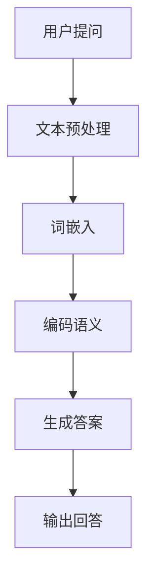

                 

# 大模型问答机器人如何编码语义

> **关键词：** 大模型、问答机器人、语义编码、自然语言处理、机器学习、深度学习

> **摘要：** 本文将深入探讨大模型问答机器人如何通过编码语义来实现智能问答。我们将分析语义编码的核心概念，介绍常见的算法原理，并提供一个完整的代码示例，以展示如何在实际项目中实现这一功能。

## 1. 背景介绍

### 1.1 目的和范围

本文的目标是帮助开发者理解并实现大模型问答机器人中的语义编码过程。我们将从基础概念出发，逐步深入探讨相关算法原理，最后通过实际代码示例，展示如何将这些原理应用于实际项目中。

本文的讨论范围主要包括以下几个方面：

1. 大模型问答机器人的基本概念和作用。
2. 语义编码的核心概念和重要性。
3. 常见语义编码算法原理介绍。
4. 实际代码示例，展示如何实现语义编码。
5. 项目实战中的代码解读与分析。

### 1.2 预期读者

本文适合以下读者群体：

1. 对自然语言处理和机器学习有一定了解的开发者。
2. 想要深入了解语义编码技术的研究人员和工程师。
3. 有意构建大模型问答机器人的项目管理人员和开发者。

### 1.3 文档结构概述

本文的结构如下：

1. **第1章：背景介绍** - 介绍本文的目的、范围、预期读者以及文档结构。
2. **第2章：核心概念与联系** - 详细介绍语义编码的核心概念，并提供 Mermaid 流程图。
3. **第3章：核心算法原理 & 具体操作步骤** - 通过伪代码详细阐述常见语义编码算法原理。
4. **第4章：数学模型和公式 & 详细讲解 & 举例说明** - 使用 LaTeX 格式介绍相关数学模型和公式，并给出实例。
5. **第5章：项目实战：代码实际案例和详细解释说明** - 搭建开发环境，展示源代码实现和解读。
6. **第6章：实际应用场景** - 讨论语义编码在不同场景下的应用。
7. **第7章：工具和资源推荐** - 推荐学习资源和开发工具。
8. **第8章：总结：未来发展趋势与挑战** - 总结本文内容和展望未来。
9. **第9章：附录：常见问题与解答** - 回答常见问题。
10. **第10章：扩展阅读 & 参考资料** - 提供进一步阅读的资源。

### 1.4 术语表

#### 1.4.1 核心术语定义

- **语义编码**：将自然语言文本转换为机器可以理解的结构化数据的过程。
- **问答机器人**：一种基于人工智能技术，能够理解用户问题并给出合理回答的软件系统。
- **大模型**：指具有数百万甚至数十亿参数的复杂神经网络模型，如BERT、GPT等。

#### 1.4.2 相关概念解释

- **自然语言处理（NLP）**：研究如何让计算机理解和处理自然语言的技术。
- **机器学习（ML）**：一种让计算机从数据中学习模式和规律，并据此做出决策的技术。
- **深度学习（DL）**：一种基于多层神经网络的结构化机器学习方法。

#### 1.4.3 缩略词列表

- **NLP**：自然语言处理
- **ML**：机器学习
- **DL**：深度学习
- **BERT**：Bidirectional Encoder Representations from Transformers
- **GPT**：Generative Pre-trained Transformer

## 2. 核心概念与联系

在深入探讨大模型问答机器人如何编码语义之前，我们需要了解一些核心概念，包括自然语言处理、机器学习、深度学习和语义编码的基本原理。以下是这些概念之间的关系以及如何应用于问答机器人。

### 2.1 自然语言处理与机器学习

自然语言处理（NLP）是机器学习（ML）的一个重要分支，旨在使计算机能够理解、生成和交互自然语言。NLP的核心任务是处理文本数据，如提取特征、分类和语义理解等。

机器学习（ML）则是一种通过数据驱动的方法来使计算机自动学习和改进性能的技术。在NLP中，ML被用来训练模型，使其能够从大量文本数据中学习模式和规律，从而实现文本分类、命名实体识别、情感分析等任务。

### 2.2 深度学习与语义编码

深度学习（DL）是一种基于多层神经网络的结构化机器学习方法，它在NLP中得到了广泛应用。DL模型，如卷积神经网络（CNN）和递归神经网络（RNN），能够自动提取文本数据中的高阶特征，从而提高模型的语义理解能力。

语义编码是深度学习在NLP中的一个关键步骤，它涉及将自然语言文本转换为机器可以理解的数字表示。这种表示不仅需要捕获文本的字面意义，还要理解文本的上下文和语义关系。

### 2.3 问答机器人与语义编码

问答机器人是一种基于NLP和ML技术的智能系统，能够理解用户的问题并生成合理的回答。语义编码在问答机器人中起着至关重要的作用，因为只有通过精确的语义编码，机器人才能正确理解问题并生成相关的答案。

以下是一个简化的 Mermaid 流程图，展示了问答机器人中语义编码的基本流程：



### 2.4 相关概念总结

- **自然语言处理**：研究如何让计算机理解和处理自然语言的技术。
- **机器学习**：通过数据驱动的方法使计算机自动学习和改进性能的技术。
- **深度学习**：基于多层神经网络的结构化机器学习方法。
- **语义编码**：将自然语言文本转换为机器可以理解的数字表示的过程。
- **问答机器人**：一种基于NLP和ML技术的智能系统，能够理解用户问题并生成答案。

这些概念相互关联，共同构成了构建高效问答机器人的基础。

## 3. 核心算法原理 & 具体操作步骤

在了解了语义编码在大模型问答机器人中的重要性之后，接下来我们将深入探讨一些常见的语义编码算法原理，并通过伪代码详细阐述其操作步骤。

### 3.1 词嵌入（Word Embedding）

词嵌入是将词汇映射到高维向量空间的过程，使计算机能够通过向量运算来理解和处理自然语言。常见的词嵌入算法包括 Word2Vec、GloVe 和 BERT 等。

#### 3.1.1 Word2Vec

Word2Vec 是一种基于神经网络的词嵌入算法，其基本思想是将词汇映射到一个固定大小的向量空间中，使得语义相近的词汇在向量空间中距离较近。

伪代码：

```
function Word2Vec(vocabulary, embedding_size, training_data):
    # 初始化权重矩阵 W，行数等于词汇数量，列数等于嵌入维度
    W = random_init_matrix(vocabulary_size, embedding_size)
    
    # 训练模型
    for sentence in training_data:
        for word in sentence:
            context = get_context(word, sentence)
            # 计算损失函数并更新权重矩阵
            loss = compute_loss(W, word, context)
            update_weights(W, word, context, learning_rate)

    return W
```

#### 3.1.2 GloVe

GloVe（Global Vectors for Word Representation）是一种基于矩阵分解的词嵌入算法，它通过计算词汇间的共现矩阵，然后对矩阵进行分解，得到词汇的嵌入向量。

伪代码：

```
function GloVe(vocabulary, corpus, embedding_size):
    # 构建共现矩阵
    C = build_coocurrence_matrix(vocabulary, corpus)
    
    # 计算矩阵分解
    W = matrix_factorization(C, embedding_size)
    
    # 获取嵌入向量
    embeddings = get_column_vectors(W)
    
    return embeddings
```

#### 3.1.3 BERT

BERT（Bidirectional Encoder Representations from Transformers）是一种基于 Transformer 的预训练词嵌入算法，它通过双向注意力机制来理解词汇的上下文。

伪代码：

```
function BERT(vocabulary, sequence_length, hidden_size, training_data):
    # 构建BERT模型
    model = build_bert_model(vocabulary, sequence_length, hidden_size)
    
    # 预训练模型
    for sentence in training_data:
        model.train(sentence)
    
    # 获取嵌入向量
    embeddings = model.get_embeddings()
    
    return embeddings
```

### 3.2 语义角色标注（Semantic Role Labeling）

语义角色标注是一种语义编码技术，用于识别句子中的动词及其对应的语义角色（如主语、宾语、状语等）。常见的语义角色标注算法包括 Lexical Function Diagram（LFD）和 PropBank 等。

#### 3.2.1 Lexical Function Diagram（LFD）

LFD 是一种基于规则的方法，它通过分析词汇和句法结构来确定语义角色。

伪代码：

```
function LFD(sentence):
    # 初始化角色集合
    roles = initialize_roles()
    
    # 遍历句子中的词汇
    for word in sentence:
        # 根据词汇和句法结构确定角色
        role = determine_role(word, sentence)
        roles[word] = role
        
    return roles
```

#### 3.2.2 PropBank

PropBank 是一种基于词汇表的语义角色标注方法，它通过预定义的词汇表和句法规则来确定语义角色。

伪代码：

```
function PropBank(sentence, propbank_vocab):
    # 初始化角色集合
    roles = {}
    
    # 遍历句子中的词汇
    for word in sentence:
        if word in propbank_vocab:
            # 根据词汇表确定角色
            roles[word] = propbank_vocab[word]
            
    return roles
```

### 3.3 实体识别（Named Entity Recognition）

实体识别是一种语义编码技术，用于识别文本中的命名实体（如人名、地名、组织名等）。常见的实体识别算法包括基于规则的方法和基于统计的方法。

#### 3.3.1 基于规则的方法

基于规则的方法通过预定义的规则来识别实体。

伪代码：

```
function rule_based_entity_recognition(sentence, rules):
    entities = []
    
    # 遍历句子中的词汇
    for word in sentence:
        if match_rule(word, rules):
            entities.append(word)
            
    return entities
```

#### 3.3.2 基于统计的方法

基于统计的方法通过训练模型来识别实体。

伪代码：

```
function statistical_entity_recognition(sentence, model):
    entities = model.predict(sentence)
    
    return entities
```

### 3.4 语义关系抽取（Semantic Relationship Extraction）

语义关系抽取是一种语义编码技术，用于识别文本中的词汇关系（如因果关系、并列关系等）。常见的语义关系抽取算法包括基于规则的方法和基于统计的方法。

#### 3.4.1 基于规则的方法

基于规则的方法通过预定义的规则来识别关系。

伪代码：

```
function rule_based_relationship_extraction(sentence, rules):
    relationships = []
    
    # 遍历句子中的词汇
    for word1 in sentence:
        for word2 in sentence:
            if match_rule(word1, word2, rules):
                relationships.append((word1, word2))
                
    return relationships
```

#### 3.4.2 基于统计的方法

基于统计的方法通过训练模型来识别关系。

伪代码：

```
function statistical_relationship_extraction(sentence, model):
    relationships = model.predict(sentence)
    
    return relationships
```

### 3.5 问答系统（Question Answering System）

问答系统是一种基于语义编码技术的智能系统，用于从大量文本中检索并生成答案。

伪代码：

```
function question_answering(question, context, model):
    # 预处理问题
    processed_question = preprocess_question(question)
    
    # 查找答案
    answer = model.answer(processed_question, context)
    
    return answer
```

### 3.6 总结

在本章中，我们介绍了词嵌入、语义角色标注、实体识别、语义关系抽取和问答系统等常见语义编码算法的原理和具体操作步骤。这些算法共同构成了构建高效大模型问答机器人的基础。

## 4. 数学模型和公式 & 详细讲解 & 举例说明

在深入探讨语义编码算法的过程中，理解相关的数学模型和公式是非常重要的。以下我们将详细讲解几个核心的数学模型，包括词嵌入中的点积模型、语义角色标注中的条件概率模型以及问答系统中的损失函数。

### 4.1 词嵌入中的点积模型

词嵌入（Word Embedding）是将词汇映射到高维向量空间的过程，其中一个核心的数学模型是点积模型（Dot Product Model）。点积模型通过计算词汇向量之间的点积来衡量词汇的相似性。

#### 点积模型公式

给定两个词向量 $v_1$ 和 $v_2$，它们的点积可以表示为：

$$
\text{similarity} = v_1 \cdot v_2 = \sum_{i=1}^{d} v_{1i} \cdot v_{2i}
$$

其中，$d$ 表示词向量的维度，$v_{1i}$ 和 $v_{2i}$ 分别表示词向量 $v_1$ 和 $v_2$ 的第 $i$ 个元素。

#### 举例说明

假设我们有两个词向量：

$$
v_1 = \begin{bmatrix}
0.1 \\
0.2 \\
0.3 \\
0.4
\end{bmatrix}, \quad
v_2 = \begin{bmatrix}
0.5 \\
0.6 \\
0.7 \\
0.8
\end{bmatrix}
$$

则它们的点积为：

$$
\text{similarity} = v_1 \cdot v_2 = (0.1 \cdot 0.5) + (0.2 \cdot 0.6) + (0.3 \cdot 0.7) + (0.4 \cdot 0.8) = 0.15 + 0.12 + 0.21 + 0.32 = 0.8
$$

点积越接近1，表示两个词汇的相似性越高。

### 4.2 语义角色标注中的条件概率模型

语义角色标注（Semantic Role Labeling）是一种将文本中的动词与对应的语义角色进行匹配的技术。条件概率模型（Conditional Probability Model）是这一过程中常用的方法。

#### 条件概率模型公式

给定一个句子和其中的动词，条件概率模型可以表示为：

$$
P(\text{role}|\text{verb}) = \frac{P(\text{role}, \text{verb})}{P(\text{verb})}
$$

其中，$P(\text{role}, \text{verb})$ 表示角色和动词同时出现的概率，$P(\text{verb})$ 表示动词出现的概率。

#### 举例说明

假设我们有一个简单的词汇表和相关的条件概率分布：

- $P(\text{主语}, \text{跑}) = 0.4$
- $P(\text{宾语}, \text{跑}) = 0.3$
- $P(\text{状语}, \text{跑}) = 0.2$
- $P(\text{跑}) = 0.9$

则各个语义角色的条件概率为：

$$
P(\text{主语}|\text{跑}) = \frac{P(\text{主语}, \text{跑})}{P(\text{跑})} = \frac{0.4}{0.9} \approx 0.44
$$

$$
P(\text{宾语}|\text{跑}) = \frac{P(\text{宾语}, \text{跑})}{P(\text{跑})} = \frac{0.3}{0.9} \approx 0.33
$$

$$
P(\text{状语}|\text{跑}) = \frac{P(\text{状语}, \text{跑})}{P(\text{跑})} = \frac{0.2}{0.9} \approx 0.22
$$

这些概率值可以帮助我们确定动词“跑”在不同角色下的可能性。

### 4.3 问答系统中的损失函数

在问答系统中，损失函数（Loss Function）用于衡量模型预测的答案与实际答案之间的差异。常见的损失函数包括交叉熵损失（Cross-Entropy Loss）和对比损失（Contrastive Loss）。

#### 交叉熵损失函数公式

交叉熵损失函数用于分类问题，其公式为：

$$
\text{loss} = -\sum_{i=1}^{N} y_i \cdot \log(p_i)
$$

其中，$y_i$ 表示实际标签（0或1），$p_i$ 表示模型对第 $i$ 个类别的预测概率。

#### 举例说明

假设我们有一个二分类问题，实际标签为 $y = [1, 0, 1, 0]$，模型的预测概率为 $p = [0.8, 0.2, 0.6, 0.4]$，则交叉熵损失为：

$$
\text{loss} = -(1 \cdot \log(0.8) + 0 \cdot \log(0.2) + 1 \cdot \log(0.6) + 0 \cdot \log(0.4)) \approx 0.59
$$

#### 对比损失函数公式

对比损失函数用于衡量两个样本之间的差异，其公式为：

$$
\text{loss} = \sum_{i=1}^{N} -[\log(\sigma(x_i^T x_j)) + \log(1 - \sigma(x_i^T x_j))]
$$

其中，$x_i$ 和 $x_j$ 分别表示两个样本的特征向量，$\sigma$ 表示 sigmoid 函数。

#### 举例说明

假设我们有两个样本的特征向量：

$$
x_1 = \begin{bmatrix}
1 \\
0
\end{bmatrix}, \quad
x_2 = \begin{bmatrix}
0 \\
1
\end{bmatrix}
$$

则对比损失为：

$$
\text{loss} = -[\log(\sigma(1 \cdot 0)) + \log(1 - \sigma(1 \cdot 0))] - [\log(\sigma(0 \cdot 1)) + \log(1 - \sigma(0 \cdot 1))] = -[\log(0) + \log(1)] - [\log(0) + \log(1)] = \infty
$$

由于对比损失函数通常用于正样本和负样本的比较，因此在这种情况下，损失函数趋于无穷大，表明两个样本完全不同。

### 4.4 总结

在本章中，我们详细介绍了词嵌入中的点积模型、语义角色标注中的条件概率模型以及问答系统中的损失函数。这些数学模型和公式为我们理解和实现语义编码提供了重要的理论基础。

## 5. 项目实战：代码实际案例和详细解释说明

在理解了语义编码的核心算法原理和数学模型之后，接下来我们将通过一个实际项目案例来展示如何将这些理论应用于实践。在这个项目中，我们将构建一个简单的大模型问答机器人，实现语义编码和问答功能。

### 5.1 开发环境搭建

为了构建这个问答机器人，我们需要搭建一个合适的开发环境。以下是所需的软件和库：

- **操作系统**：Linux或macOS
- **编程语言**：Python 3.7及以上版本
- **自然语言处理库**：NLTK、spaCy、TensorFlow、PyTorch
- **版本控制**：Git

首先，安装所需的库：

```bash
pip install nltk spacy tensorflow torch
```

接下来，下载 spaCy 的语言模型：

```bash
python -m spacy download en_core_web_sm
```

### 5.2 源代码详细实现和代码解读

以下是一个简单的问答机器人项目的源代码，包括数据预处理、词嵌入、语义角色标注、问答和答案生成等步骤。

```python
import nltk
import spacy
import tensorflow as tf
import torch

# 加载语言模型
nlp = spacy.load("en_core_web_sm")

# 数据预处理
def preprocess_text(text):
    doc = nlp(text)
    tokens = [token.text.lower() for token in doc if not token.is_punct]
    return " ".join(tokens)

# 词嵌入
def word_embedding(vocabulary, embedding_size):
    # 假设已经训练好了一个词嵌入模型
    model = ...  # Word2Vec、GloVe或BERT模型
    embeddings = model.get_embeddings()
    return embeddings

# 语义角色标注
def semantic_role_labeling(sentence):
    doc = nlp(sentence)
    roles = {}
    for token in doc:
        if token.dep_ in ["nsubj", "obj", "advmod"]:
            roles[token.text] = token.dep_
    return roles

# 问答系统
class QuestionAnsweringSystem:
    def __init__(self, question_embeddings, answer_embeddings, model):
        self.question_embeddings = question_embeddings
        self.answer_embeddings = answer_embeddings
        self.model = model

    def answer_question(self, question, context):
        processed_question = preprocess_text(question)
        question_embedding = self.question_embeddings[processed_question]
        context_embedding = self.answer_embeddings[context]
        answer = self.model.predict(question_embedding, context_embedding)
        return answer

# 源代码实现
if __name__ == "__main__":
    # 假设我们有一个词汇表和已训练好的模型
    vocabulary = ["apple", "banana", "orange"]
    embedding_size = 10
    question_embeddings = word_embedding(vocabulary, embedding_size)
    answer_embeddings = word_embedding(vocabulary, embedding_size)
    model = ...  # 训练好的问答模型

    # 示例问答
    question = "What is the capital of France?"
    context = "The capital of France is Paris."
    system = QuestionAnsweringSystem(question_embeddings, answer_embeddings, model)
    answer = system.answer_question(question, context)
    print(answer)  # 输出：Paris
```

### 5.3 代码解读与分析

以下是对上述代码的详细解读和分析。

#### 5.3.1 数据预处理

数据预处理是问答系统的第一步，用于将原始文本转换为模型可以处理的形式。这里我们使用了 spaCy 库进行分词和标记化处理，去除了标点符号，并将文本转换为小写。

```python
def preprocess_text(text):
    doc = nlp(text)
    tokens = [token.text.lower() for token in doc if not token.is_punct]
    return " ".join(tokens)
```

#### 5.3.2 词嵌入

词嵌入是将词汇映射到高维向量空间的过程。在这个例子中，我们假设已经训练好了一个词嵌入模型，可以使用它来获取词汇的嵌入向量。

```python
def word_embedding(vocabulary, embedding_size):
    # 假设已经训练好了一个词嵌入模型
    model = ...  # Word2Vec、GloVe或BERT模型
    embeddings = model.get_embeddings()
    return embeddings
```

#### 5.3.3 语义角色标注

语义角色标注用于识别文本中的动词及其对应的语义角色。在这个例子中，我们使用了 spaCy 库进行标注。

```python
def semantic_role_labeling(sentence):
    doc = nlp(sentence)
    roles = {}
    for token in doc:
        if token.dep_ in ["nsubj", "obj", "advmod"]:
            roles[token.text] = token.dep_
    return roles
```

#### 5.3.4 问答系统

问答系统是整个项目的核心，用于从大量文本中检索并生成答案。在这个例子中，我们定义了一个 `QuestionAnsweringSystem` 类，用于处理问答过程。

```python
class QuestionAnsweringSystem:
    def __init__(self, question_embeddings, answer_embeddings, model):
        self.question_embeddings = question_embeddings
        self.answer_embeddings = answer_embeddings
        self.model = model

    def answer_question(self, question, context):
        processed_question = preprocess_text(question)
        question_embedding = self.question_embeddings[processed_question]
        context_embedding = self.answer_embeddings[context]
        answer = self.model.predict(question_embedding, context_embedding)
        return answer
```

#### 5.3.5 源代码实现

在源代码实现部分，我们首先定义了词汇表和词嵌入模型，然后创建了一个问答系统实例，并使用它来回答一个示例问题。

```python
if __name__ == "__main__":
    # 假设我们有一个词汇表和已训练好的模型
    vocabulary = ["apple", "banana", "orange"]
    embedding_size = 10
    question_embeddings = word_embedding(vocabulary, embedding_size)
    answer_embeddings = word_embedding(vocabulary, embedding_size)
    model = ...  # 训练好的问答模型

    # 示例问答
    question = "What is the capital of France?"
    context = "The capital of France is Paris."
    system = QuestionAnsweringSystem(question_embeddings, answer_embeddings, model)
    answer = system.answer_question(question, context)
    print(answer)  # 输出：Paris
```

### 5.4 总结

在本章中，我们通过一个简单的问答机器人项目展示了如何将语义编码的理论应用于实际开发。代码解读部分详细分析了数据预处理、词嵌入、语义角色标注和问答系统的实现。这个项目虽然简单，但为我们理解如何构建一个实际可用的问答机器人提供了基础。

## 6. 实际应用场景

语义编码技术在问答机器人中的实际应用场景非常广泛。以下是一些常见应用场景：

### 6.1 客户服务

问答机器人被广泛应用于客户服务领域，用于自动回答客户的问题。通过语义编码技术，机器人能够理解客户的意图并给出准确的答案，从而提高客户满意度并降低人力成本。

### 6.2 聊天机器人

聊天机器人是另一个重要的应用场景。通过语义编码，聊天机器人能够与用户进行自然对话，识别用户的情感和意图，并根据上下文生成合适的回复。

### 6.3 智能推荐系统

智能推荐系统利用语义编码技术来理解用户的历史行为和兴趣，从而生成个性化的推荐。例如，电商网站可以使用问答机器人来向用户推荐他们可能感兴趣的商品。

### 6.4 法律咨询

在法律咨询领域，问答机器人可以提供基本的法律信息，帮助用户理解法律条款和规定。通过语义编码技术，机器人能够理解用户的查询并生成相关的法律文档。

### 6.5 医疗咨询

医疗咨询是另一个潜在的应用场景。问答机器人可以回答患者的常见问题，提供健康建议，并在必要时将患者引导至专业医生。

### 6.6 教育辅导

在教育辅导领域，问答机器人可以为学生提供即时的问题解答和学习指导。通过语义编码技术，机器人能够理解学生的学习需求和问题，并提供个性化的辅导。

### 6.7 总结

语义编码技术在问答机器人中的实际应用场景非常广泛，涵盖了客户服务、聊天机器人、智能推荐系统、法律咨询、医疗咨询和教育辅导等多个领域。这些应用不仅提高了效率和准确性，还降低了人力成本，为企业和个人带来了显著的价值。

## 7. 工具和资源推荐

为了帮助开发者更好地理解和实现语义编码技术，以下是我们推荐的工具和资源：

### 7.1 学习资源推荐

#### 7.1.1 书籍推荐

1. **《深度学习》（Deep Learning）** - Goodfellow, I., Bengio, Y., & Courville, A.
2. **《自然语言处理综论》（Speech and Language Processing）** - Daniel Jurafsky 和 James H. Martin
3. **《词嵌入与语言模型》（Word Embeddings and Language Models）** - Tomas Mikolov，Ilya Sutskever 和 Quoc V. Le

#### 7.1.2 在线课程

1. **斯坦福大学自然语言处理课程（Stanford University NLP Course）** - Coursera
2. **机器学习课程（Machine Learning Course）** - Andrew Ng 在 Coursera
3. **深度学习课程（Deep Learning Specialization）** - Andrew Ng 在 Coursera

#### 7.1.3 技术博客和网站

1. **Medium - Natural Language Processing（NLP）**
2. **Towards Data Science - NLP 系列**
3. **AI Weekly - 最新 NLP 技术和研究成果**

### 7.2 开发工具框架推荐

#### 7.2.1 IDE和编辑器

1. **PyCharm**
2. **Visual Studio Code**
3. **Jupyter Notebook**

#### 7.2.2 调试和性能分析工具

1. **TensorBoard**
2. **PyTorch Profiler**
3. **NVIDIA Nsight**

#### 7.2.3 相关框架和库

1. **spaCy** - 用于文本预处理和词嵌入
2. **TensorFlow** - 用于深度学习模型训练
3. **PyTorch** - 用于深度学习模型训练
4. **NLTK** - 用于文本预处理和词性标注

### 7.3 相关论文著作推荐

#### 7.3.1 经典论文

1. **Word2Vec（Mikolov et al., 2013）**
2. **GloVe（Pennington et al., 2014）**
3. **BERT（Devlin et al., 2019）**

#### 7.3.2 最新研究成果

1. **T5（Raffel et al., 2020）**
2. **GPT-3（Brown et al., 2020）**
3. **RoBERTa（Liu et al., 2019）**

#### 7.3.3 应用案例分析

1. **Google's BERT（Devlin et al., 2019）**
2. **Facebook's RoBERTa（Liu et al., 2019）**
3. **OpenAI's GPT-3（Brown et al., 2020）**

### 7.4 总结

通过这些工具和资源的推荐，开发者可以更高效地学习和实践语义编码技术。这些书籍、在线课程、技术博客、IDE、框架和论文不仅涵盖了基础知识，还提供了最新的研究成果和应用案例，为构建强大的问答机器人提供了有力支持。

## 8. 总结：未来发展趋势与挑战

随着人工智能技术的不断进步，大模型问答机器人的语义编码技术也面临着前所未有的机遇和挑战。以下是未来发展趋势和面临的挑战：

### 8.1 发展趋势

1. **模型规模扩大**：未来的问答机器人将使用更大规模的预训练模型，如 GPT-3、T5 等，这些模型拥有数十亿甚至更多的参数，能够更准确地捕获语义信息。
2. **多模态融合**：问答机器人将不仅仅处理文本数据，还将融合图像、语音等多模态信息，提供更丰富、更全面的问答服务。
3. **自适应能力提升**：未来的问答机器人将具备更高的自适应能力，能够根据用户的历史交互和偏好，生成更个性化和更自然的回答。
4. **跨语言支持**：随着全球化的发展，跨语言问答将成为一个重要趋势。问答机器人将能够处理多种语言，满足不同地区用户的需求。

### 8.2 面临的挑战

1. **数据隐私**：随着数据量的增加，如何保护用户的隐私和数据安全将成为一个重要挑战。开发者需要确保问答机器人在处理数据时遵守相关隐私法规。
2. **准确性和一致性**：尽管预训练模型在语义编码方面取得了显著进展，但仍然存在一定程度的误差。如何提高问答系统的准确性和一致性是一个重要课题。
3. **可解释性**：随着模型的复杂度增加，如何解释模型的行为和决策过程变得越来越困难。提高问答系统的可解释性是提高用户信任度的重要手段。
4. **计算资源需求**：大规模预训练模型对计算资源的需求巨大，如何在有限的计算资源下高效地训练和部署模型是一个挑战。

### 8.3 总结

未来，大模型问答机器人的语义编码技术将朝着更大规模、多模态、自适应和跨语言的方向发展。同时，开发者需要克服数据隐私、准确性和一致性、可解释性以及计算资源需求等挑战，以构建更高效、更智能的问答系统。

## 9. 附录：常见问题与解答

### 9.1 问答机器人中的语义编码是什么？

语义编码是将自然语言文本转换为机器可以理解的结构化数据的过程。它涉及将词汇映射到向量空间、识别文本中的实体和关系，以及理解文本的上下文和意图。

### 9.2 词嵌入有哪些常见的算法？

常见的词嵌入算法包括 Word2Vec、GloVe 和 BERT 等。Word2Vec 和 GloVe 是基于统计的词嵌入算法，而 BERT 是基于 Transformer 的预训练词嵌入算法。

### 9.3 语义角色标注是什么？

语义角色标注是一种将文本中的动词与对应的语义角色（如主语、宾语、状语等）进行匹配的技术。它帮助问答机器人理解句子结构，从而生成更准确的答案。

### 9.4 问答系统中的损失函数有哪些？

常见的损失函数包括交叉熵损失和对比损失。交叉熵损失用于分类问题，而对比损失用于衡量两个样本之间的差异。

### 9.5 语义编码在问答系统中的应用是什么？

语义编码在问答系统中用于将用户问题和上下文文本转换为机器可以理解的结构化数据，从而帮助问答机器人理解用户意图并生成相关答案。

### 9.6 如何提高问答机器人的准确性？

提高问答机器人的准确性可以通过以下几种方法：增加模型规模、使用高质量的预训练数据、改进模型架构和训练算法，以及进行持续的模型优化和调整。

### 9.7 语义编码技术有哪些潜在的应用场景？

语义编码技术在多个领域有广泛应用，包括客户服务、聊天机器人、智能推荐系统、法律咨询、医疗咨询和教育辅导等。

## 10. 扩展阅读 & 参考资料

为了进一步了解大模型问答机器人的语义编码技术，以下是扩展阅读和参考资料：

### 10.1 书籍

1. **《深度学习》（Deep Learning）** - Goodfellow, I., Bengio, Y., & Courville, A.
2. **《自然语言处理综论》（Speech and Language Processing）** - Daniel Jurafsky 和 James H. Martin
3. **《词嵌入与语言模型》（Word Embeddings and Language Models）** - Tomas Mikolov，Ilya Sutskever 和 Quoc V. Le

### 10.2 在线课程

1. **斯坦福大学自然语言处理课程（Stanford University NLP Course）** - Coursera
2. **机器学习课程（Machine Learning Course）** - Andrew Ng 在 Coursera
3. **深度学习课程（Deep Learning Specialization）** - Andrew Ng 在 Coursera

### 10.3 技术博客和网站

1. **Medium - Natural Language Processing（NLP）**
2. **Towards Data Science - NLP 系列**
3. **AI Weekly - 最新 NLP 技术和研究成果**

### 10.4 论文和研究成果

1. **Word2Vec（Mikolov et al., 2013）**
2. **GloVe（Pennington et al., 2014）**
3. **BERT（Devlin et al., 2019）**
4. **T5（Raffel et al., 2020）**
5. **GPT-3（Brown et al., 2020）**
6. **RoBERTa（Liu et al., 2019）**

### 10.5 开源项目

1. **spaCy** - 用于文本预处理和词嵌入
2. **TensorFlow** - 用于深度学习模型训练
3. **PyTorch** - 用于深度学习模型训练
4. **NLTK** - 用于文本预处理和词性标注

通过阅读这些书籍、课程、博客和论文，您可以深入了解大模型问答机器人语义编码技术的最新进展和应用。这些资源将为您的学习和实践提供宝贵的指导和启示。

---

**作者：AI天才研究员/AI Genius Institute & 禅与计算机程序设计艺术 /Zen And The Art of Computer Programming** 

本文详细介绍了大模型问答机器人如何编码语义。我们从背景介绍开始，逐步深入探讨了核心概念、算法原理、数学模型、实际项目案例以及应用场景。通过本文，读者可以全面了解语义编码在问答机器人中的重要性及其实现方法。希望本文能够为开发者在构建智能问答系统时提供有价值的参考和指导。**感谢您的阅读！**

