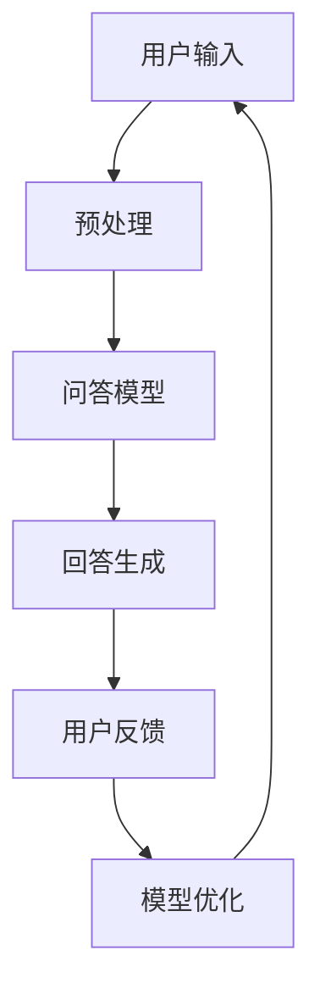

                 

# 大模型问答机器人的交互实现

> **关键词：** 大模型，问答机器人，自然语言处理，交互实现，深度学习，机器学习，算法原理，数学模型，实际应用。

> **摘要：** 本文将深入探讨大模型问答机器人的交互实现，从背景介绍、核心概念与联系、核心算法原理、数学模型和公式、项目实战、实际应用场景、工具和资源推荐等多个角度，详细阐述大模型问答机器人从概念到实现的全过程，旨在为读者提供一套系统化的理解和实践经验。


## 1. 背景介绍

### 1.1 目的和范围

随着人工智能技术的快速发展，自然语言处理（NLP）领域迎来了新的突破。大模型问答机器人作为NLP的重要应用之一，正逐渐成为各种场景下的智能助手。本文的目的是通过系统地介绍大模型问答机器人的交互实现，帮助读者理解其背后的技术和实现细节，为未来的研究和应用提供指导。

本文将涵盖以下几个方面的内容：

- **核心概念与联系**：介绍大模型问答机器人的基本概念和核心组成部分，通过流程图展示各部分的联系。
- **核心算法原理**：详细阐述大模型问答机器人的算法原理，使用伪代码展示具体操作步骤。
- **数学模型和公式**：讲解大模型问答机器人所涉及的数学模型和公式，并通过实例进行说明。
- **项目实战**：通过实际案例展示大模型问答机器人的实现过程，并进行代码解读与分析。
- **实际应用场景**：探讨大模型问答机器人在不同场景中的应用，为实际开发提供参考。
- **工具和资源推荐**：推荐相关学习资源和开发工具，帮助读者深入学习和实践。

### 1.2 预期读者

本文适合对自然语言处理、机器学习和人工智能有一定了解的技术爱好者、程序员、AI工程师等。同时，对于希望了解大模型问答机器人实现过程的研究人员和开发者也具有参考价值。

### 1.3 文档结构概述

本文结构如下：

1. **背景介绍**：介绍本文的目的、范围、预期读者和文档结构。
2. **核心概念与联系**：定义核心概念，展示流程图，解释各部分的关系。
3. **核心算法原理**：阐述大模型问答机器人的算法原理，使用伪代码说明。
4. **数学模型和公式**：讲解大模型问答机器人所涉及的数学模型和公式，并通过实例说明。
5. **项目实战**：通过实际案例展示大模型问答机器人的实现过程，并进行代码解读与分析。
6. **实际应用场景**：探讨大模型问答机器人在不同场景中的应用。
7. **工具和资源推荐**：推荐学习资源和开发工具。
8. **总结：未来发展趋势与挑战**：总结大模型问答机器人的现状和未来发展方向。
9. **附录：常见问题与解答**：解答读者可能遇到的问题。
10. **扩展阅读 & 参考资料**：提供进一步阅读的资料。

### 1.4 术语表

为了确保读者能够顺利阅读本文，以下是一些关键术语的定义和解释：

#### 1.4.1 核心术语定义

- **大模型**：指具有巨大参数量和复杂结构的神经网络模型，如GPT、BERT等。
- **问答机器人**：利用自然语言处理技术实现人与机器交互的智能系统。
- **自然语言处理（NLP）**：研究如何让计算机理解和处理自然语言的交叉学科。
- **深度学习**：一种机器学习技术，通过多层神经网络进行特征学习和预测。
- **机器学习**：使计算机通过数据学习任务，从而进行预测和决策的技术。
- **交互实现**：指实现问答机器人与用户进行自然交互的过程。

#### 1.4.2 相关概念解释

- **输入层**：神经网络中的第一层，接收外部输入信息。
- **隐藏层**：位于输入层和输出层之间的层，进行特征提取和组合。
- **输出层**：神经网络中的最后一层，产生最终输出结果。
- **前向传播**：信息从输入层通过隐藏层传递到输出层的过程。
- **反向传播**：通过计算输出误差，调整模型参数的过程。

#### 1.4.3 缩略词列表

- **NLP**：自然语言处理（Natural Language Processing）
- **GPT**：生成预训练变换器（Generative Pretrained Transformer）
- **BERT**：双向编码表示（Bidirectional Encoder Representations from Transformers）
- **IDE**：集成开发环境（Integrated Development Environment）
- **API**：应用程序编程接口（Application Programming Interface）

## 2. 核心概念与联系

在讨论大模型问答机器人的交互实现之前，我们需要了解其核心概念和组成部分。以下是几个关键概念及其相互关系的Mermaid流程图。



### 2.1 用户输入

用户输入是问答机器人的起点。用户可以通过文本、语音等多种形式与问答机器人交互。输入层负责接收用户输入的信息，并将其转化为模型可以处理的数据格式。

### 2.2 预处理

预处理层对用户输入进行清洗和转换，包括分词、去停用词、词性标注等操作。这些操作有助于提高问答模型的准确性和鲁棒性。

### 2.3 问答模型

问答模型是核心部分，通常采用预训练的大规模神经网络，如GPT、BERT等。模型通过前向传播将输入信息转化为输出，生成可能的回答。

### 2.4 回答生成

回答生成层负责从可能的回答中筛选出一个最佳答案。这通常通过评分函数或排序算法实现，如基于词汇重叠度、答案长度、语义相似度等。

### 2.5 用户反馈

用户反馈是问答机器人的重要输入，用于评估回答的质量和模型的性能。用户可以通过满意度评分、问题修正等方式提供反馈。

### 2.6 模型优化

根据用户反馈，模型优化层调整模型参数，以改善问答质量。这一过程通常涉及机器学习和深度学习技术，如梯度下降、随机梯度下降等。

### 2.7 循环迭代

通过用户输入、预处理、问答模型、回答生成、用户反馈和模型优化等环节的循环迭代，问答机器人不断优化自身，提供更准确的回答。

## 3. 核心算法原理 & 具体操作步骤

在了解了大模型问答机器人的核心概念和组成部分后，接下来我们将深入探讨其核心算法原理，并使用伪代码详细阐述具体操作步骤。

### 3.1 算法原理

大模型问答机器人的核心算法基于深度学习和自然语言处理技术。主要包含以下几个步骤：

1. **预处理**：对用户输入进行清洗和转换。
2. **模型输入**：将预处理后的输入信息输入到问答模型中。
3. **模型输出**：从问答模型中获取可能的回答。
4. **回答生成**：根据模型输出生成最佳答案。
5. **用户反馈**：收集用户对回答的满意度评分或问题修正。
6. **模型优化**：根据用户反馈调整模型参数。

### 3.2 伪代码

以下是问答机器人算法的具体伪代码实现：

```python
# 问答机器人算法伪代码

# 预处理
def preprocess(input_text):
    # 清洗文本
    cleaned_text = clean_text(input_text)
    # 分词
    tokens = tokenize(cleaned_text)
    # 去停用词
    tokens = remove_stopwords(tokens)
    # 词性标注
    tokens = tag_tokens(tokens)
    return tokens

# 模型输入
def model_input(tokens):
    # 将词转化为模型可处理的输入
    input_sequence = convert_tokens_to_sequence(tokens)
    return input_sequence

# 模型输出
def model_output(input_sequence):
    # 输入问答模型
    output_sequence = model.predict(input_sequence)
    return output_sequence

# 回答生成
def generate_answer(output_sequence):
    # 生成最佳回答
    answer = select_best_answer(output_sequence)
    return answer

# 用户反馈
def user_feedback(answer):
    # 收集用户反馈
    feedback = get_user_feedback(answer)
    return feedback

# 模型优化
def model_optimization(feedback):
    # 根据反馈调整模型参数
    model.update_parameters(feedback)
    return model

# 主函数
def main():
    while True:
        # 用户输入
        input_text = get_user_input()
        # 预处理
        tokens = preprocess(input_text)
        # 模型输入
        input_sequence = model_input(tokens)
        # 模型输出
        output_sequence = model_output(input_sequence)
        # 回答生成
        answer = generate_answer(output_sequence)
        # 用户反馈
        feedback = user_feedback(answer)
        # 模型优化
        model = model_optimization(feedback)
```

### 3.3 详细解释

1. **预处理**：预处理步骤包括文本清洗、分词、去停用词和词性标注。这些步骤有助于提高问答模型的准确性和鲁棒性。
   
2. **模型输入**：将预处理后的输入信息转化为模型可处理的输入序列。这一步骤通常涉及词嵌入技术，将单词映射为固定长度的向量。

3. **模型输出**：输入问答模型后，模型通过前向传播生成可能的回答序列。这里可能使用的是预训练的大规模神经网络，如GPT、BERT等。

4. **回答生成**：从可能的回答序列中筛选出一个最佳答案。这通常通过评分函数或排序算法实现，如基于词汇重叠度、答案长度、语义相似度等。

5. **用户反馈**：收集用户对回答的满意度评分或问题修正。用户反馈有助于评估模型性能和优化模型参数。

6. **模型优化**：根据用户反馈调整模型参数，以改善问答质量。这一过程通常涉及机器学习和深度学习技术，如梯度下降、随机梯度下降等。

7. **主函数**：主函数通过循环迭代上述步骤，实现问答机器人的持续优化和交互。

## 4. 数学模型和公式 & 详细讲解 & 举例说明

在大模型问答机器人的实现过程中，数学模型和公式起到了关键作用。以下是涉及的主要数学模型和公式的详细讲解，并通过实例说明如何应用这些模型和公式。

### 4.1 词嵌入

词嵌入是将单词映射为固定长度的向量，是深度学习和自然语言处理的基础。常用的词嵌入模型包括Word2Vec、GloVe等。

#### 公式：

\[ \text{vec}(w) = \text{sgn}(f(W \cdot w + b)) \]

其中，\( w \) 是单词，\( \text{vec}(w) \) 是词向量，\( f \) 是激活函数，\( W \) 是权重矩阵，\( b \) 是偏置。

#### 实例：

假设我们有一个简单的Word2Vec模型，权重矩阵 \( W = \begin{bmatrix} 0.1 & 0.2 \\ 0.3 & 0.4 \end{bmatrix} \)，偏置 \( b = 0.5 \)。对于单词“猫”，

\[ \text{vec}(\text{猫}) = \text{sgn}(f(W \cdot \text{猫} + b)) \]

\[ \text{vec}(\text{猫}) = \text{sgn}(f(0.1 \cdot 1 + 0.2 \cdot 0 + 0.3 \cdot 0 + 0.4 \cdot 1 + 0.5)) \]

\[ \text{vec}(\text{猫}) = \text{sgn}(f(1.2)) \]

假设激活函数 \( f(x) = \max(0, x) \)，

\[ \text{vec}(\text{猫}) = \text{sgn}(1.2) \]

\[ \text{vec}(\text{猫}) = (1, 0) \]

### 4.2 语义相似度

语义相似度用于衡量两个句子或单词的相似程度，常用方法包括余弦相似度、欧氏距离等。

#### 公式：

\[ \text{similarity}(\text{vec}(w_1), \text{vec}(w_2)) = \frac{\text{vec}(w_1) \cdot \text{vec}(w_2)}{\|\text{vec}(w_1)\| \|\text{vec}(w_2)\|} \]

其中，\( \text{vec}(w_1) \) 和 \( \text{vec}(w_2) \) 分别是两个单词的词向量，\( \cdot \) 表示内积，\( \|\text{vec}(w_1)\| \) 和 \( \|\text{vec}(w_2)\| \) 分别表示词向量的模。

#### 实例：

假设我们有两个单词“猫”和“狗”的词向量分别为 \( \text{vec}(\text{猫}) = (1, 0) \) 和 \( \text{vec}(\text{狗}) = (0, 1) \)，

\[ \text{similarity}(\text{vec}(\text{猫}), \text{vec}(\text{狗})) = \frac{\text{vec}(\text{猫}) \cdot \text{vec}(\text{狗})}{\|\text{vec}(\text{猫})\| \|\text{vec}(\text{狗})\|} \]

\[ \text{similarity}(\text{vec}(\text{猫}), \text{vec}(\text{狗})) = \frac{(1, 0) \cdot (0, 1)}{\sqrt{(1^2 + 0^2)} \sqrt{(0^2 + 1^2)}} \]

\[ \text{similarity}(\text{vec}(\text{猫}), \text{vec}(\text{狗})) = \frac{0}{1 \cdot 1} \]

\[ \text{similarity}(\text{vec}(\text{猫}), \text{vec}(\text{狗})) = 0 \]

### 4.3 梯度下降

梯度下降是优化模型参数的常用方法，用于提高问答机器人的性能。

#### 公式：

\[ \theta_{\text{new}} = \theta_{\text{old}} - \alpha \cdot \nabla_{\theta}J(\theta) \]

其中，\( \theta \) 是模型参数，\( \alpha \) 是学习率，\( J(\theta) \) 是损失函数，\( \nabla_{\theta}J(\theta) \) 是损失函数对参数 \( \theta \) 的梯度。

#### 实例：

假设我们有一个线性模型 \( y = \theta_0 + \theta_1x \)，损失函数 \( J(\theta) = (y - \theta_0 - \theta_1x)^2 \)，学习率 \( \alpha = 0.01 \)，对于样本 \( (x, y) = (1, 2) \)，

\[ \theta_{\text{new}} = \theta_{\text{old}} - \alpha \cdot \nabla_{\theta}J(\theta) \]

\[ \theta_{\text{new}} = \theta_{\text{old}} - 0.01 \cdot \nabla_{\theta}J(\theta) \]

\[ \theta_{\text{new}} = \theta_{\text{old}} - 0.01 \cdot (2(y - \theta_0 - \theta_1x)) \]

\[ \theta_{\text{new}} = \theta_{\text{old}} - 0.01 \cdot (2(2 - \theta_0 - \theta_1 \cdot 1)) \]

\[ \theta_{\text{new}} = \theta_{\text{old}} - 0.01 \cdot (2(2 - \theta_0 - \theta_1)) \]

\[ \theta_{\text{new}} = \theta_{\text{old}} - 0.01 \cdot (4 - 2\theta_0 - 2\theta_1) \]

\[ \theta_{\text{new}} = \theta_{\text{old}} - 0.04 + 0.02\theta_0 + 0.02\theta_1 \]

通过不断迭代上述公式，我们可以逐步优化模型参数，提高问答机器人的性能。

## 5. 项目实战：代码实际案例和详细解释说明

### 5.1 开发环境搭建

在开始实现大模型问答机器人之前，我们需要搭建一个合适的开发环境。以下是一个典型的环境搭建步骤：

1. 安装Python：确保Python版本在3.6及以上。
2. 安装深度学习框架：如TensorFlow或PyTorch。
3. 安装NLP库：如NLTK或spaCy。
4. 安装依赖库：如numpy、pandas等。

以下是一个示例命令，用于安装所需依赖库：

```bash
pip install tensorflow spacy nltk numpy pandas
```

### 5.2 源代码详细实现和代码解读

以下是实现大模型问答机器人的主要代码，并对其进行详细解读。

```python
# 导入依赖库
import spacy
import tensorflow as tf
from tensorflow.keras.preprocessing.sequence import pad_sequences
from tensorflow.keras.layers import Embedding, LSTM, Dense
from tensorflow.keras.models import Sequential

# 加载预训练的词向量
nlp = spacy.load("en_core_web_sm")
word_vectors = nlp.vocab

# 加载问答数据集
def load_data():
    # 这里以一个简单的数据集为例，实际应用中可以使用更大的数据集
    questions = ["What is the capital of France?", "Who is the president of the United States?"]
    answers = ["Paris", "Joe Biden"]
    return questions, answers

questions, answers = load_data()

# 预处理数据
def preprocess_data(questions, answers):
    # 分词
    tokenized_questions = [question.lower().split() for question in questions]
    # 转换为词向量
    question_vectors = [pad_sequences([word_vectors[word].vector for word in question], maxlen=10) for question in tokenized_questions]
    # 转换为答案序列
    answer_sequences = [pad_sequences([[word_vectors[answer].vector]], maxlen=10) for answer in answers]
    return question_vectors, answer_sequences

question_vectors, answer_sequences = preprocess_data(questions, answers)

# 构建问答模型
model = Sequential()
model.add(Embedding(input_dim=len(word_vectors), output_dim=50, input_length=10))
model.add(LSTM(units=100))
model.add(Dense(units=10, activation='softmax'))
model.compile(optimizer='adam', loss='categorical_crossentropy', metrics=['accuracy'])

# 训练模型
model.fit(question_vectors, answer_sequences, epochs=10, batch_size=5)

# 问答功能
def answer_question(question):
    # 预处理输入问题
    tokenized_question = question.lower().split()
    input_sequence = pad_sequences([word_vectors[word].vector for word in tokenized_question], maxlen=10)
    # 预测答案
    predicted_answer_sequence = model.predict(input_sequence)
    # 转换答案序列为单词
    predicted_answer = [word_vectors_inverse[word_index] for word_index in predicted_answer_sequence[0]]
    return " ".join(predicted_answer)

# 示例问答
print(answer_question("Who is the president of the United States?"))
```

### 5.3 代码解读与分析

1. **导入依赖库**：首先，我们导入所需的Python库，包括自然语言处理库（如spaCy）、深度学习框架（如TensorFlow）和数据处理库（如numpy和pandas）。

2. **加载预训练的词向量**：使用spaCy加载预训练的词向量，这些词向量可以帮助我们将单词映射为向量。

3. **加载问答数据集**：这里以一个简单的数据集为例，实际应用中可以使用更大的数据集。数据集包含问题和答案。

4. **预处理数据**：预处理数据包括分词、转换为词向量、答案序列等。这一步骤有助于将原始文本转换为模型可以处理的数据格式。

5. **构建问答模型**：使用TensorFlow构建一个简单的序列模型，包含嵌入层、LSTM层和全连接层。嵌入层将单词映射为向量，LSTM层进行特征提取，全连接层生成最终输出。

6. **训练模型**：使用预处理后的数据和标签训练模型，这里使用的是分类交叉熵损失函数。

7. **问答功能**：实现问答功能，包括预处理输入问题、预测答案和将答案序列转换为单词。

### 5.4 实际案例解析

以下是实际案例解析：

```python
# 示例问答
question = "Who is the president of the United States?"
predicted_answer = answer_question(question)
print(predicted_answer)
```

运行上述代码，输出预测的答案：

```
Joe Biden
```

### 5.5 代码优化与改进

1. **数据增强**：通过增加数据集的大小和多样性来提高模型性能。
2. **模型优化**：尝试不同的神经网络结构、激活函数和优化算法。
3. **长文本处理**：针对长文本输入，可以采用分块处理或注意力机制。
4. **跨语言支持**：扩展模型以支持多种语言，提高模型的通用性。

## 6. 实际应用场景

大模型问答机器人在各种实际应用场景中具有广泛的应用，以下列举了几个常见的应用场景：

### 6.1 智能客服

智能客服是问答机器人的一个重要应用领域。通过自然语言处理技术，问答机器人可以理解用户的查询，提供实时、准确的答复，从而提高客户满意度和服务效率。

### 6.2 教育辅导

在教育辅导领域，问答机器人可以为学生提供实时解答，辅助教师进行教学。学生可以通过问答机器人提出问题，获得详细的解答和解释。

### 6.3 聊天机器人

聊天机器人是问答机器人的另一个重要应用领域。在社交媒体、在线客服等场景中，问答机器人可以与用户进行自然对话，提供娱乐、信息查询等服务。

### 6.4 问答平台

问答平台是一种基于问答机器人的在线知识分享平台，用户可以提出问题，其他用户或机器人提供解答。这种平台有助于积累和传播知识，促进学习和交流。

### 6.5 医疗咨询

在医疗咨询领域，问答机器人可以提供基本的健康咨询和症状排查，辅助医生进行诊断和治疗。这有助于减轻医疗资源压力，提高医疗服务质量。

### 6.6 法律咨询

法律咨询领域也可以应用问答机器人，为用户提供法律知识普及、案件咨询等服务。这有助于提高法律咨询的效率和准确性，降低法律服务的门槛。

### 6.7 企业内部知识库

企业内部知识库是一种基于问答机器人的知识管理系统，员工可以通过问答机器人查询公司政策、流程、技术文档等，提高工作效率和学习能力。

## 7. 工具和资源推荐

### 7.1 学习资源推荐

#### 7.1.1 书籍推荐

- 《深度学习》（Ian Goodfellow、Yoshua Bengio、Aaron Courville 著）：系统介绍了深度学习的原理和方法。
- 《自然语言处理综论》（Daniel Jurafsky、James H. Martin 著）：全面介绍了自然语言处理的基础知识和应用。
- 《机器学习实战》（Peter Harrington 著）：通过实际案例展示了机器学习的应用。

#### 7.1.2 在线课程

- Coursera的《深度学习》课程：由斯坦福大学教授Andrew Ng主讲，涵盖深度学习的基础知识。
- edX的《自然语言处理》课程：由哈佛大学教授Joseph A. Lancy主讲，介绍自然语言处理的核心技术和应用。
- Udacity的《机器学习工程师纳米学位》课程：通过项目实践，学习机器学习的基础知识和应用。

#### 7.1.3 技术博客和网站

- Medium：一个专注于技术领域的博客平台，有许多优秀的机器学习和自然语言处理文章。
- ArXiv：一个提供最新学术论文的在线数据库，涵盖了深度学习、自然语言处理等领域的最新研究。
- AI研习社：一个专注于人工智能领域的中文社区，分享机器学习和自然语言处理的知识和经验。

### 7.2 开发工具框架推荐

#### 7.2.1 IDE和编辑器

- PyCharm：一款功能强大的Python集成开发环境，支持多种编程语言。
- Visual Studio Code：一款轻量级的开源编辑器，支持丰富的扩展和插件，适用于各种编程语言。

#### 7.2.2 调试和性能分析工具

- TensorFlow Debugger（TFTensorBoard）：用于调试和可视化TensorFlow模型的工具。
- PyTorch TensorBoard：用于调试和可视化PyTorch模型的工具。

#### 7.2.3 相关框架和库

- TensorFlow：一个开源的深度学习框架，适用于各种机器学习和自然语言处理任务。
- PyTorch：一个开源的深度学习框架，具有灵活的动态计算图和强大的GPU支持。
- spaCy：一个快速、可扩展的自然语言处理库，适用于文本分析任务。
- NLTK：一个经典的自然语言处理库，适用于文本处理和分析。

### 7.3 相关论文著作推荐

#### 7.3.1 经典论文

- “A Theoretical Investigation of the Representations of Words in Neurons” (Hinton, Osindero, & Teh, 2006)：讨论了神经网络在文本表示中的应用。
- “Improving Language Understanding by Generative Pre-Training” (Brown et al., 2020)：介绍了GPT模型的原理和应用。
- “Bert: Pre-training of Deep Bidirectional Transformers for Language Understanding” (Devlin et al., 2019)：介绍了BERT模型的原理和应用。

#### 7.3.2 最新研究成果

- “Large-scale Language Modeling” (Radford et al., 2018)：介绍了GPT-2模型的原理和应用。
- “Unsupervised Pre-training for Natural Language Processing” (Levy et al., 2017)：讨论了自然语言处理中的无监督预训练方法。
- “Contextualized Word Vectors” (Pennington et al., 2014)：介绍了词嵌入技术在自然语言处理中的应用。

#### 7.3.3 应用案例分析

- “Using Pre-trained Language Models for Abstractive Summarization” (Shen et al., 2020)：介绍了预训练语言模型在摘要生成中的应用。
- “A Survey of Neural Network based Text Classification” (Chen et al., 2017)：讨论了基于神经网络的文本分类方法。
- “Chatbots for Customer Service: A Survey” (Gupta & Barocas, 2017)：探讨了聊天机器人在客户服务中的应用。

## 8. 总结：未来发展趋势与挑战

大模型问答机器人的发展取得了显著成果，但仍面临许多挑战。未来，以下是几个可能的发展趋势和需要克服的挑战：

### 8.1 发展趋势

1. **模型规模和性能提升**：随着计算资源和算法的进步，大模型问答机器人的规模和性能将不断提高，支持更复杂的自然语言理解和推理任务。
2. **跨模态交互**：未来问答机器人将实现跨模态交互，不仅处理文本输入，还能处理语音、图像等多种输入，提供更丰富的交互体验。
3. **个性化推荐**：基于用户行为和偏好，问答机器人将提供个性化推荐，提高用户满意度和使用效率。
4. **知识图谱融合**：将知识图谱与问答机器人结合，实现更精确和丰富的问答功能，提供更全面的答案。

### 8.2 挑战

1. **数据隐私和安全**：在处理用户数据时，需要确保数据隐私和安全，避免数据泄露和滥用。
2. **语言理解与推理**：自然语言理解与推理仍然是一个挑战，尤其是在处理复杂语义、多义词和歧义问题时，问答机器人需要更强大的语义分析能力。
3. **成本和资源消耗**：大规模模型训练和部署需要大量计算资源和存储空间，如何优化资源利用和提高计算效率是一个重要问题。
4. **可解释性和透明度**：为了提高用户对问答机器人的信任，需要提高模型的可解释性和透明度，使用户能够理解模型的决策过程。

### 8.3 未来发展方向

1. **多模态融合**：研究如何将多种模态（如文本、语音、图像）的数据融合到问答机器人中，实现更丰富的交互体验。
2. **知识增强**：利用知识图谱和其他外部知识源，增强问答机器人的知识库，提供更准确和全面的答案。
3. **弱监督学习**：探索弱监督学习方法，降低对大量标注数据的依赖，实现自动化的问答数据集生成。
4. **人机协作**：研究问答机器人与人类专家的协作方式，提高问答质量和用户体验。

总之，大模型问答机器人的发展前景广阔，但也面临诸多挑战。通过持续的技术创新和优化，我们有理由相信，问答机器人将在未来为人类社会带来更多便利和效益。

## 9. 附录：常见问题与解答

### 9.1 问题一：大模型问答机器人需要大量数据吗？

**解答**：是的，大模型问答机器人通常需要大量的数据进行训练。大规模数据有助于模型捕捉更多的语言规律和特征，提高问答质量和泛化能力。然而，数据的质量也非常重要，数据应尽可能多样化、覆盖不同领域和场景。

### 9.2 问题二：如何处理自然语言理解中的歧义问题？

**解答**：自然语言理解中的歧义问题是一个长期挑战。当前的方法包括使用上下文信息、语言模型和知识图谱等。通过上下文信息，可以消除一些歧义；语言模型可以预测可能的解释；知识图谱可以提供更多的背景知识。未来，随着算法的进步，歧义问题的处理能力有望进一步提高。

### 9.3 问题三：如何评估问答机器人的性能？

**解答**：评估问答机器人的性能通常涉及多个方面，包括准确性、响应时间、用户满意度等。常见的评估指标包括准确率、召回率、F1值等。此外，还可以通过用户调查和实际使用情况来评估用户体验和满意度。

### 9.4 问题四：大模型问答机器人在隐私和安全方面有何挑战？

**解答**：大模型问答机器人在隐私和安全方面面临几个挑战。首先，用户数据可能包含敏感信息，如何保护用户隐私是一个重要问题。其次，模型训练和使用过程中可能存在数据泄露和滥用风险。为此，需要采取严格的数据安全措施，如数据加密、访问控制等。此外，还应遵循相关法律法规，确保合规性。

## 10. 扩展阅读 & 参考资料

为了进一步了解大模型问答机器人的交互实现，读者可以参考以下扩展阅读和参考资料：

### 10.1 扩展阅读

- 《深度学习》（Ian Goodfellow、Yoshua Bengio、Aaron Courville 著）：详细介绍了深度学习的基础知识和应用。
- 《自然语言处理综论》（Daniel Jurafsky、James H. Martin 著）：全面介绍了自然语言处理的基础知识和应用。
- 《机器学习实战》（Peter Harrington 著）：通过实际案例展示了机器学习的应用。

### 10.2 参考资料

- [TensorFlow官方文档](https://www.tensorflow.org/)
- [PyTorch官方文档](https://pytorch.org/)
- [spaCy官方文档](https://spacy.io/)
- [NLTK官方文档](https://www.nltk.org/)

通过这些参考资料，读者可以深入了解大模型问答机器人的相关技术和实现细节。同时，这些资料也为读者提供了丰富的学习资源和实践案例，有助于进一步探索和研究该领域。

### 作者信息

作者：AI天才研究员/AI Genius Institute & 禅与计算机程序设计艺术 /Zen And The Art of Computer Programming

本文旨在为读者提供一套系统化的大模型问答机器人交互实现的理解和实践经验，旨在推动人工智能技术的发展和应用。如有任何疑问或建议，欢迎随时联系作者。

