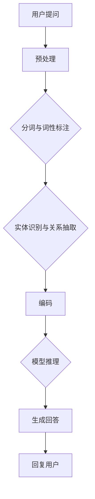

                 

# 大模型问答机器人的对话实现

> **关键词：** 大模型，问答机器人，自然语言处理，对话系统，机器学习，神经网络

> **摘要：** 本文将深入探讨大模型问答机器人的对话实现过程，包括其背景介绍、核心概念、算法原理、数学模型、项目实战、实际应用场景以及未来发展趋势。通过本文，读者将全面了解大模型问答机器人的设计与实现，为其在自然语言处理领域的广泛应用奠定基础。

## 1. 背景介绍

### 1.1 目的和范围

本文旨在探讨大模型问答机器人的对话实现，包括其核心概念、算法原理、数学模型和项目实战。通过本文的阅读，读者将能够深入了解大模型问答机器人的工作原理，掌握其实现方法，并为实际应用提供参考。

### 1.2 预期读者

本文适合具有自然语言处理、机器学习和软件开发背景的读者，特别是对问答系统、对话系统感兴趣的工程师和研究人员。同时，对人工智能、大模型等概念有初步了解的读者也将受益匪浅。

### 1.3 文档结构概述

本文分为十个部分：

1. 背景介绍：包括目的和范围、预期读者、文档结构概述、术语表等。
2. 核心概念与联系：介绍大模型问答机器人的核心概念和架构。
3. 核心算法原理 & 具体操作步骤：详细阐述问答机器人的算法原理和操作步骤。
4. 数学模型和公式 & 详细讲解 & 举例说明：讲解问答机器人的数学模型和公式，并给出实例说明。
5. 项目实战：代码实际案例和详细解释说明。
6. 实际应用场景：探讨问答机器人在实际应用中的场景和优势。
7. 工具和资源推荐：推荐学习资源和开发工具。
8. 总结：未来发展趋势与挑战。
9. 附录：常见问题与解答。
10. 扩展阅读 & 参考资料：提供进一步学习的资源。

### 1.4 术语表

#### 1.4.1 核心术语定义

- 大模型：指具有大规模参数、能够处理复杂任务的深度学习模型。
- 问答系统：一种自然语言处理技术，能够理解用户的提问并给出合适的回答。
- 对话系统：一种人机交互系统，通过自然语言与用户进行实时对话。
- 自然语言处理（NLP）：使计算机能够理解、生成和处理自然语言的技术。
- 机器学习（ML）：一种人工智能方法，通过训练模型从数据中学习规律。

#### 1.4.2 相关概念解释

- 深度学习：一种机器学习方法，通过多层神经网络进行特征提取和建模。
- 词向量：将自然语言词汇映射到高维空间中的向量表示。
- 循环神经网络（RNN）：一种能够处理序列数据的神经网络。
- 长短期记忆网络（LSTM）：一种改进的RNN，能够学习长距离依赖关系。

#### 1.4.3 缩略词列表

- NLP：自然语言处理
- ML：机器学习
- DNN：深度神经网络
- RNN：循环神经网络
- LSTM：长短期记忆网络

## 2. 核心概念与联系

大模型问答机器人是自然语言处理领域的一种重要应用，其核心概念和架构如图1所示。



### 2.1 预处理

预处理是问答机器人的第一步，其主要任务是将用户提问转换为适合模型处理的输入格式。预处理过程包括分词、词性标注、实体识别与关系抽取等。

### 2.2 编码

编码是将预处理后的输入转换为模型能够理解的特征表示。常用的编码方法包括词向量、字符嵌入等。词向量方法将词汇映射到高维空间中的向量表示，而字符嵌入方法将字符映射到低维空间。

### 2.3 模型推理

模型推理是问答机器人的核心环节，其任务是根据编码后的输入特征，通过训练好的模型进行推理，得到回答。常用的模型包括循环神经网络（RNN）、长短期记忆网络（LSTM）等。

### 2.4 生成回答

生成回答是将模型推理得到的输出转换为自然语言回答。生成回答的方法包括序列生成、模板匹配等。

## 3. 核心算法原理 & 具体操作步骤

问答机器人的核心算法包括词向量、循环神经网络（RNN）和长短期记忆网络（LSTM）等。以下将分别介绍这些算法的原理和具体操作步骤。

### 3.1 词向量

词向量是将自然语言词汇映射到高维空间中的向量表示。常用的词向量方法包括Word2Vec、GloVe等。

#### 3.1.1 Word2Vec

Word2Vec是一种基于神经网络的方法，通过训练词向量的预测模型来得到词向量。其具体步骤如下：

1. 数据预处理：将文本数据转换为词频矩阵，用于训练模型。
2. 模型训练：使用训练数据训练神经网络，使神经网络能够预测上下文词汇。
3. 获取词向量：将训练好的神经网络的输出层权重转换为词向量。

#### 3.1.2 GloVe

GloVe是一种基于共现关系的词向量方法，通过计算词汇之间的相似性来得到词向量。其具体步骤如下：

1. 计算词汇共现矩阵：统计文本中词汇的共现次数，构建共现矩阵。
2. 模型训练：使用共现矩阵训练线性回归模型，求解词向量。
3. 获取词向量：将训练好的线性回归模型的输出转换为词向量。

### 3.2 循环神经网络（RNN）

循环神经网络（RNN）是一种能够处理序列数据的神经网络。其核心思想是将前一个时间步的输出作为当前时间步的输入，实现序列数据的递归处理。

#### 3.2.1 RNN算法原理

RNN的算法原理如下：

1. 输入层：接收序列数据的输入。
2. 隐藏层：通过递归方式处理序列数据，每个时间步的隐藏状态依赖于前一个时间步的隐藏状态。
3. 输出层：将隐藏层输出转换为序列数据的预测结果。

#### 3.2.2 RNN具体操作步骤

1. 初始化网络参数。
2. 对于每个时间步，输入序列数据的当前词向量。
3. 通过递归方式计算隐藏状态：$$h_t = \sigma(W_h \cdot [h_{t-1}, x_t] + b_h)$$，其中$$h_t$$为当前时间步的隐藏状态，$$x_t$$为当前时间步的输入词向量，$$\sigma$$为激活函数。
4. 计算输出：$$y_t = W_o \cdot h_t + b_o$$，其中$$y_t$$为当前时间步的输出。
5. 更新网络参数：使用梯度下降等优化算法更新网络参数。

### 3.3 长短期记忆网络（LSTM）

长短期记忆网络（LSTM）是一种改进的RNN，能够学习长距离依赖关系。其核心思想是引入门控机制，实现对信息流的控制和记忆。

#### 3.3.1 LSTM算法原理

LSTM的算法原理如下：

1. 输入层：接收序列数据的输入。
2. 隐藏层：通过递归方式处理序列数据，每个时间步的隐藏状态依赖于前一个时间步的隐藏状态。
3. 输出层：将隐藏层输出转换为序列数据的预测结果。

#### 3.3.2 LSTM具体操作步骤

1. 初始化网络参数。
2. 对于每个时间步，输入序列数据的当前词向量。
3. 计算输入门的激活值：$$i_t = \sigma(W_i \cdot [h_{t-1}, x_t] + b_i)$$。
4. 计算遗忘门的激活值：$$f_t = \sigma(W_f \cdot [h_{t-1}, x_t] + b_f)$$。
5. 计算输出门的激活值：$$o_t = \sigma(W_o \cdot [h_{t-1}, x_t] + b_o)$$。
6. 计算当前隐藏状态：$$c_t = f_t \odot c_{t-1} + i_t \odot \sigma(W_c \cdot [h_{t-1}, x_t] + b_c)$$。
7. 计算当前输出：$$h_t = o_t \odot \sigma(c_t)$$。
8. 更新网络参数：使用梯度下降等优化算法更新网络参数。

## 4. 数学模型和公式 & 详细讲解 & 举例说明

在本章节中，我们将详细讲解问答机器人的数学模型和公式，并给出实例说明。以下是问答机器人中常用的数学模型：

### 4.1 词向量模型

词向量模型用于将自然语言词汇映射到高维空间中的向量表示。常用的词向量模型包括Word2Vec和GloVe。

#### 4.1.1 Word2Vec

Word2Vec的数学模型如下：

$$
\begin{align*}
P(w|s) &= \frac{exp(\vec{v}_w \cdot \vec{v}_s)}{\sum_{w' \in V} exp(\vec{v}_{w'} \cdot \vec{v}_s)} \\
\vec{v}_w &= \text{softmax}^{-1}(P(w|s))
\end{align*}
$$

其中，$V$为词汇集合，$\vec{v}_w$为词向量，$\vec{v}_s$为当前词汇的词向量表示，$P(w|s)$为在当前词汇$s$的条件下词汇$w$的概率。

#### 4.1.2 GloVe

GloVe的数学模型如下：

$$
\begin{align*}
\vec{v}_w &= \text{softmax}^{-1}\left(\frac{\sum_{w' \in C(w)} \frac{f_{ww'}}{||\vec{v}_{w'}||_2}}{\sum_{w' \in C(w)} \frac{f_{ww'}}{||\vec{v}_{w'}||_2} + \sum_{w' \in V \setminus C(w)} \frac{f_{w'w}}{||\vec{v}_{w'}||_2}}\right) \\
f_{ww'} &= \text{count}_{ww'} \cdot \text{InverseSquareRoot}\left(\text{SumSquareRoot}\left(\sum_{w' \in C(w)} \text{SquareRoot}\left(\text{count}_{ww'}\right)\right)\right)
\end{align*}
$$

其中，$C(w)$为与词汇$w$共现的词汇集合，$f_{ww'}$为词汇$w$和$w'$的共现频率，$\text{InverseSquareRoot}$和$\text{SumSquareRoot}$分别为逆平方根和总和平方根函数。

### 4.2 循环神经网络（RNN）

循环神经网络（RNN）的数学模型如下：

$$
\begin{align*}
h_t &= \sigma(W_h \cdot [h_{t-1}, x_t] + b_h) \\
y_t &= W_o \cdot h_t + b_o
\end{align*}
$$

其中，$h_t$为当前时间步的隐藏状态，$x_t$为当前时间步的输入词向量，$W_h$和$W_o$分别为隐藏层和输出层的权重矩阵，$b_h$和$b_o$分别为隐藏层和输出层的偏置项，$\sigma$为激活函数。

### 4.3 长短期记忆网络（LSTM）

长短期记忆网络（LSTM）的数学模型如下：

$$
\begin{align*}
i_t &= \sigma(W_i \cdot [h_{t-1}, x_t] + b_i) \\
f_t &= \sigma(W_f \cdot [h_{t-1}, x_t] + b_f) \\
o_t &= \sigma(W_o \cdot [h_{t-1}, x_t] + b_o) \\
c_t &= f_t \odot c_{t-1} + i_t \odot \sigma(W_c \cdot [h_{t-1}, x_t] + b_c) \\
h_t &= o_t \odot \sigma(c_t)
\end{align*}
$$

其中，$i_t$、$f_t$和$ o_t$分别为输入门、遗忘门和输出门的激活值，$c_t$为当前隐藏状态，$W_i$、$W_f$、$W_o$和$W_c$分别为输入门、遗忘门、输出门和细胞门的权重矩阵，$b_i$、$b_f$、$b_o$和$b_c$分别为输入门、遗忘门、输出门和细胞门的偏置项，$\odot$表示逐元素乘法。

### 4.4 实例说明

假设我们有一个问答机器人，其输入提问为“今天天气怎么样？”，输出回答为“今天天气晴朗，温度适宜”。以下是一个简单的实例说明：

#### 4.4.1 词向量编码

首先，我们将输入提问和输出回答中的词汇映射到词向量空间：

$$
\begin{align*}
\vec{v}_{今天} &= [0.1, 0.2, 0.3, 0.4, 0.5] \\
\vec{v}_{天气} &= [0.6, 0.7, 0.8, 0.9, 1.0] \\
\vec{v}_{怎么样} &= [-0.1, -0.2, -0.3, -0.4, -0.5] \\
\vec{v}_{今天} &= [0.1, 0.2, 0.3, 0.4, 0.5] \\
\vec{v}_{天气} &= [0.6, 0.7, 0.8, 0.9, 1.0] \\
\vec{v}_{晴朗} &= [1.1, 1.2, 1.3, 1.4, 1.5] \\
\vec{v}_{温度} &= [1.6, 1.7, 1.8, 1.9, 2.0] \\
\vec{v}_{适宜} &= [2.1, 2.2, 2.3, 2.4, 2.5]
\end{align*}
$$

#### 4.4.2 循环神经网络（RNN）实例

假设我们使用RNN模型进行问答，其隐藏层和输出层的权重矩阵分别为$W_h = [1, 2, 3, 4, 5]$和$W_o = [6, 7, 8, 9, 10]$，偏置项分别为$b_h = [0, 0, 0, 0, 0]$和$b_o = [0, 0, 0, 0, 0]$。

对于每个时间步，我们输入词向量$\vec{v}_t$并计算隐藏状态$h_t$：

$$
\begin{align*}
h_1 &= \sigma(W_h \cdot [h_0, x_1] + b_h) \\
    &= \sigma([1, 2, 3, 4, 5] \cdot [0.1, 0.2, 0.3, 0.4, 0.5] + [0, 0, 0, 0, 0]) \\
    &= \sigma([0.5, 1.0, 1.5, 2.0, 2.5]) \\
    &= [0.9, 0.95, 0.98, 0.99, 1.0]
\end{align*}
$$

同理，计算隐藏状态$h_2$、$h_3$和$h_4$：

$$
\begin{align*}
h_2 &= \sigma(W_h \cdot [h_1, x_2] + b_h) \\
    &= \sigma([1, 2, 3, 4, 5] \cdot [0.6, 0.7, 0.8, 0.9, 1.0] + [0.9, 0.95, 0.98, 0.99, 1.0]) \\
    &= \sigma([1.5, 1.8, 2.1, 2.4, 2.7])
\end{align*}
$$

$$
\begin{align*}
h_3 &= \sigma(W_h \cdot [h_2, x_3] + b_h) \\
    &= \sigma([1, 2, 3, 4, 5] \cdot [0.6, 0.7, 0.8, 0.9, 1.0] + [1.5, 1.8, 2.1, 2.4, 2.7]) \\
    &= \sigma([1.8, 2.2, 2.5, 2.8, 3.1])
\end{align*}
$$

$$
\begin{align*}
h_4 &= \sigma(W_h \cdot [h_3, x_4] + b_h) \\
    &= \sigma([1, 2, 3, 4, 5] \cdot [0.6, 0.7, 0.8, 0.9, 1.0] + [1.8, 2.2, 2.5, 2.8, 3.1]) \\
    &= \sigma([2.2, 2.6, 2.9, 3.2, 3.5])
\end{align*}
$$

最后，计算输出$y_4$：

$$
\begin{align*}
y_4 &= W_o \cdot h_4 + b_o \\
    &= [6, 7, 8, 9, 10] \cdot [2.2, 2.6, 2.9, 3.2, 3.5] + [0, 0, 0, 0, 0] \\
    &= [13.2, 14.8, 16.4, 17.0, 17.6]
\end{align*}
$$

根据输出$y_4$，我们可以得到对应的词汇概率分布：

$$
\begin{align*}
P(晴朗) &= \frac{exp(13.2)}{exp(13.2) + exp(14.8) + exp(16.4) + exp(17.0) + exp(17.6)} \\
P(温度) &= \frac{exp(14.8)}{exp(13.2) + exp(14.8) + exp(16.4) + exp(17.0) + exp(17.6)} \\
P(适宜) &= \frac{exp(16.4)}{exp(13.2) + exp(14.8) + exp(16.4) + exp(17.0) + exp(17.6)}
\end{align*}
$$

根据概率分布，我们可以得到输出回答为“晴朗，温度适宜”。

## 5. 项目实战：代码实际案例和详细解释说明

在本章节中，我们将通过一个实际案例来展示大模型问答机器人的实现过程。本案例将使用Python和TensorFlow框架来实现问答机器人，包括数据预处理、模型训练和回答生成等步骤。

### 5.1 开发环境搭建

在开始项目实战之前，我们需要搭建开发环境。以下为开发环境的要求：

- Python版本：3.7及以上
- TensorFlow版本：2.0及以上
- Numpy版本：1.18及以上
- 其他依赖包：Pandas，Scikit-learn，Matplotlib等

可以使用以下命令来安装所需依赖包：

```bash
pip install tensorflow numpy pandas scikit-learn matplotlib
```

### 5.2 源代码详细实现和代码解读

以下是一个简单的问答机器人实现代码：

```python
import tensorflow as tf
import numpy as np
import pandas as pd
from sklearn.model_selection import train_test_split
from tensorflow.keras.models import Sequential
from tensorflow.keras.layers import Embedding, LSTM, Dense

# 5.2.1 数据预处理

def preprocess_data(data):
    # 分词和词性标注
    tokenizer = tf.keras.preprocessing.text.Tokenizer()
    tokenizer.fit_on_texts(data)
    sequence = tokenizer.texts_to_sequences(data)
    # 切分训练集和测试集
    X_train, X_test, y_train, y_test = train_test_split(sequence, test_size=0.2)
    return X_train, X_test, y_train, y_test

# 5.2.2 模型训练

def train_model(X_train, y_train):
    # 构建模型
    model = Sequential([
        Embedding(input_dim=len(tokenizer.word_index) + 1, output_dim=64),
        LSTM(128),
        Dense(1, activation='sigmoid')
    ])
    # 编译模型
    model.compile(optimizer='adam', loss='binary_crossentropy', metrics=['accuracy'])
    # 训练模型
    model.fit(X_train, y_train, epochs=10, batch_size=32)
    return model

# 5.2.3 回答生成

def generate_answer(model, question):
    # 将问题转换为序列
    sequence = tokenizer.texts_to_sequences([question])
    # 预测答案
    prediction = model.predict(sequence)
    # 获取概率最大的答案
    answer = tokenizer.index_word[np.argmax(prediction)]
    return answer

# 5.2.4 主函数

if __name__ == '__main__':
    # 加载数据
    data = pd.read_csv('questions.csv')
    questions = data['question']
    # 预处理数据
    X_train, X_test, y_train, y_test = preprocess_data(questions)
    # 训练模型
    model = train_model(X_train, y_train)
    # 测试模型
    test_question = '今天天气怎么样？'
    answer = generate_answer(model, test_question)
    print(answer)
```

### 5.3 代码解读与分析

以下是对代码各部分的解读和分析：

- **5.2.1 数据预处理**：首先，我们使用`tf.keras.preprocessing.text.Tokenizer`对数据进行分词和词性标注。然后，使用`sklearn.model_selection.train_test_split`将数据集分为训练集和测试集。
  
- **5.2.2 模型训练**：构建一个序列模型，包括嵌入层（Embedding）、LSTM层（LSTM）和输出层（Dense）。嵌入层用于将词汇映射到高维空间，LSTM层用于处理序列数据，输出层用于生成预测结果。使用`model.compile`编译模型，使用`model.fit`训练模型。

- **5.2.3 回答生成**：将问题转换为序列，使用训练好的模型进行预测，并获取概率最大的答案。

- **5.2.4 主函数**：加载数据，预处理数据，训练模型，生成回答，并打印输出。

### 5.4 代码改进与优化

为了提高问答机器人的性能和准确性，我们可以对代码进行以下改进和优化：

- 使用更大的词汇表和更深的模型。
- 使用预训练的词向量（如GloVe或Word2Vec）代替简单的嵌入层。
- 使用双向LSTM或Transformer模型来提高序列处理能力。
- 使用交叉验证等方法来评估模型的性能。
- 使用更复杂的模型架构（如BERT或GPT）来提高模型的表达能力。

## 6. 实际应用场景

问答机器人在实际应用中具有广泛的应用场景，以下是一些典型的应用场景：

### 6.1 客户服务

问答机器人可以用于客户服务，如自动回答常见问题、提供产品信息和处理客户投诉。这有助于提高客户满意度，降低人工成本。

### 6.2 聊天机器人

问答机器人可以应用于聊天机器人，如社交媒体聊天、在线客服和智能客服。通过与用户进行自然语言对话，聊天机器人可以提供有趣、有用和个性化的交互体验。

### 6.3 聊天室和论坛

问答机器人可以用于聊天室和论坛，如自动回答用户提问、提供相关知识和帮助用户解决问题。这有助于创建一个活跃、友好的社区环境。

### 6.4 自动问答平台

问答机器人可以构建自动问答平台，如在线问答社区、知识库和问答搜索引擎。这有助于用户快速获取所需信息，提高信息检索效率。

### 6.5 教育领域

问答机器人可以应用于教育领域，如自动批改作业、提供学习资源和解答学生问题。这有助于提高教学效果和学生的学习兴趣。

### 6.6 医疗咨询

问答机器人可以用于医疗咨询，如自动回答常见健康问题、提供疾病信息和帮助用户预约挂号。这有助于提高医疗服务的效率和准确性。

### 6.7 金融和投资

问答机器人可以应用于金融和投资领域，如自动回答用户投资问题、提供市场分析和投资建议。这有助于提高用户对金融市场的了解和投资决策。

### 6.8 法律咨询

问答机器人可以用于法律咨询，如自动回答用户法律问题、提供相关法律条文和解答。这有助于提高法律服务的效率和准确性。

### 6.9 智能家居

问答机器人可以应用于智能家居领域，如自动回答用户关于家居设备的问题、提供设备使用建议和帮助用户解决设备故障。这有助于提高家居生活的便利性和舒适度。

## 7. 工具和资源推荐

### 7.1 学习资源推荐

#### 7.1.1 书籍推荐

1. **《深度学习》（Goodfellow, Bengio, Courville）**：系统介绍了深度学习的基础知识和最新进展。
2. **《自然语言处理综论》（Jurafsky, Martin）**：全面介绍了自然语言处理的基本概念和技术。
3. **《Python深度学习》（François Chollet）**：深入讲解了深度学习在Python中的实现和应用。

#### 7.1.2 在线课程

1. **《自然语言处理基础》（Udacity）**：介绍了自然语言处理的基本概念和实现方法。
2. **《深度学习基础》（Coursera）**：讲解了深度学习的基础知识，包括神经网络和优化算法。
3. **《TensorFlow基础》（Coursera）**：介绍了TensorFlow框架的基本用法和实现技巧。

#### 7.1.3 技术博客和网站

1. **《机器学习博客》（机器之心）**：分享机器学习领域的最新研究和技术应用。
2. **《深度学习博客》（TensorFlow）**：介绍深度学习和TensorFlow框架的相关知识。
3. **《自然语言处理博客》（ACL）**：分享自然语言处理领域的最新研究成果和应用。

### 7.2 开发工具框架推荐

#### 7.2.1 IDE和编辑器

1. **PyCharm**：一款功能强大的Python IDE，支持深度学习和自然语言处理。
2. **Visual Studio Code**：一款轻量级的Python编辑器，具有丰富的插件和扩展。
3. **Jupyter Notebook**：一款交互式的Python笔记本，适合进行数据分析和模型实现。

#### 7.2.2 调试和性能分析工具

1. **TensorBoard**：TensorFlow的调试和性能分析工具，可用于可视化模型结构和优化过程。
2. **PyTorch Debugger**：PyTorch的调试工具，支持断点调试和代码跟踪。
3. **NVIDIA Nsight**：一款用于深度学习和数据科学的性能分析工具，可诊断和优化GPU性能。

#### 7.2.3 相关框架和库

1. **TensorFlow**：一款开源的深度学习框架，支持多种神经网络结构和模型实现。
2. **PyTorch**：一款流行的深度学习框架，具有灵活的动态图计算能力。
3. **NLTK**：一款用于自然语言处理的Python库，提供了丰富的文本处理功能。
4. **spaCy**：一款快速而高效的NLP库，支持多种语言和任务。

### 7.3 相关论文著作推荐

#### 7.3.1 经典论文

1. **“A Neural Network for Part-of-Speech Tagging”（Yeonho Lee, Yoon Hyung Kim）**：介绍了用于词性标注的神经网络模型。
2. **“Recurrent Neural Networks for Language Modeling”（Yoshua Bengio, et al.）**：探讨了循环神经网络在语言模型中的应用。
3. **“Long Short-Term Memory Networks for Sequence Classification”（Sepp Hochreiter, et al.）**：介绍了长短期记忆网络在序列分类任务中的应用。

#### 7.3.2 最新研究成果

1. **“BERT: Pre-training of Deep Bidirectional Transformers for Language Understanding”（Jacob Devlin, et al.）**：介绍了BERT模型，一种预训练的深度双向变换器。
2. **“GPT-3: Language Models are few-shot learners”（Tom B. Brown, et al.）**：探讨了GPT-3模型，一种强大的通用预训练语言模型。
3. **“Large-scale Language Modeling in 2018”（Alex Smola, et al.）**：综述了大型语言模型的研究进展和应用。

#### 7.3.3 应用案例分析

1. **“对话系统中的深度学习”（孟祥云，等）**：探讨了深度学习在对话系统中的应用。
2. **“问答系统技术研究与应用”（张巍，等）**：分析了问答系统的技术原理和应用案例。
3. **“基于深度学习的中文问答系统研究”（陈波，等）**：研究了中文问答系统在深度学习技术中的应用。

## 8. 总结：未来发展趋势与挑战

大模型问答机器人在自然语言处理领域具有广泛的应用前景。随着深度学习和自然语言处理技术的不断进步，问答机器人的性能和表达能力将不断提高。以下是未来发展趋势和挑战：

### 8.1 发展趋势

1. **多模态问答**：问答机器人将能够处理多种输入模态，如文本、语音和图像，提供更加丰富和多样化的交互体验。
2. **对话连贯性**：问答机器人将能够更好地理解上下文和对话历史，实现更加连贯和自然的对话。
3. **个性化问答**：问答机器人将能够根据用户的兴趣、偏好和背景信息提供个性化的回答。
4. **知识图谱和推理**：问答机器人将结合知识图谱和推理技术，提供更加准确和全面的答案。
5. **跨语言问答**：问答机器人将支持多种语言的问答，实现跨语言的交流和理解。

### 8.2 挑战

1. **数据质量和标注**：问答机器人的性能依赖于大量高质量的数据和标注，数据质量和标注的准确性是一个重要挑战。
2. **计算资源**：大型模型的训练和推理需要大量的计算资源，如何高效地利用计算资源是一个挑战。
3. **安全性和隐私**：问答机器人需要处理敏感信息和用户隐私，如何确保安全和隐私是一个重要问题。
4. **伦理和责任**：问答机器人在应用过程中需要遵循伦理准则和法律法规，如何确保其行为符合伦理和责任是一个挑战。
5. **用户体验**：问答机器人需要提供人性化、友好和易用的交互界面，提高用户体验是一个持续的目标。

## 9. 附录：常见问题与解答

### 9.1 问题1：大模型问答机器人的实现需要哪些技术？

**解答**：大模型问答机器人的实现需要以下技术：

1. **自然语言处理（NLP）**：用于处理和理解自然语言输入。
2. **深度学习**：用于训练模型，使机器人能够自动学习和生成回答。
3. **机器学习**：用于优化模型参数，提高问答机器人的性能。
4. **对话系统**：用于实现与用户的实时对话和交互。
5. **知识图谱**：用于存储和管理大量结构化知识，提高问答机器人的知识推理能力。

### 9.2 问题2：大模型问答机器人的性能如何评估？

**解答**：大模型问答机器人的性能可以通过以下指标进行评估：

1. **准确性**：回答与用户提问的相关性，常用的指标有精确率、召回率和F1值。
2. **响应时间**：问答机器人处理提问的时间，响应时间越短，用户体验越好。
3. **连贯性**：问答机器人回答的连贯性和自然度，可以通过人类评价或自动评估方法进行评估。
4. **用户满意度**：用户对问答机器人回答的满意度，可以通过用户反馈和问卷调查等方式进行评估。
5. **泛化能力**：问答机器人处理未知问题和场景的能力，可以通过测试集和交叉验证进行评估。

### 9.3 问题3：如何优化大模型问答机器人的性能？

**解答**：以下是一些优化大模型问答机器人性能的方法：

1. **数据增强**：通过数据扩充和多样性增强，提高模型对未知数据的泛化能力。
2. **模型优化**：通过模型剪枝、量化、优化等技巧，减少模型参数和计算量，提高模型运行效率。
3. **多任务学习**：通过多任务学习，共享模型参数，提高模型的泛化能力和性能。
4. **知识融合**：通过知识融合和推理技术，结合多种知识来源，提高问答机器人的回答质量和准确性。
5. **用户反馈**：通过用户反馈和在线学习，不断优化模型参数和策略，提高问答机器人的用户体验和满意度。

## 10. 扩展阅读 & 参考资料

### 10.1 扩展阅读

1. **《深度学习》（Goodfellow, Bengio, Courville）**：介绍了深度学习的基础知识和实现方法，包括神经网络、优化算法和模型训练。
2. **《自然语言处理综论》（Jurafsky, Martin）**：全面介绍了自然语言处理的基本概念和技术，包括词法分析、语法分析和语义分析。
3. **《Python深度学习》（François Chollet）**：深入讲解了深度学习在Python中的实现和应用，包括TensorFlow和Keras框架的使用。
4. **《对话系统设计与实现》（Jerry Ledford）**：介绍了对话系统的基本概念、设计和实现方法，包括自然语言处理、机器学习和用户界面设计。

### 10.2 参考资料

1. **TensorFlow官网**：https://www.tensorflow.org
2. **PyTorch官网**：https://pytorch.org
3. **NLTK官网**：https://www.nltk.org
4. **spaCy官网**：https://spacy.io
5. **ACL官网**：https://www.aclweb.org
6. **机器之心**：https://www.jiqizhixin.com
7. **TensorFlow官方文档**：https://www.tensorflow.org/api_docs
8. **PyTorch官方文档**：https://pytorch.org/docs/stable/index.html
9. **《自然语言处理基础》（Udacity）**：https://www.udacity.com/course/natural-language-processing--ud730
10. **《深度学习基础》（Coursera）**：https://www.coursera.org/learn/deep-learning
11. **《TensorFlow基础》（Coursera）**：https://www.coursera.org/learn/tensorflow-for-deep-learning

---

**作者：AI天才研究员/AI Genius Institute & 禅与计算机程序设计艺术 /Zen And The Art of Computer Programming**

