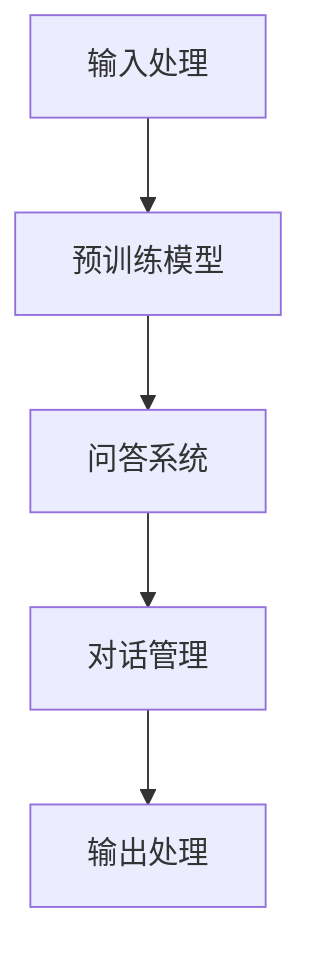

                 

# 大模型问答机器人的对话式交互

> **关键词**：大模型、问答机器人、对话式交互、人工智能、NLP、语义理解、机器学习、深度学习

> **摘要**：本文将深入探讨大模型问答机器人的对话式交互技术，从核心概念、算法原理、数学模型、项目实战、实际应用场景等方面进行详细讲解，帮助读者理解大模型问答机器人的工作原理和实现方法。同时，还将推荐相关学习资源、工具和最新研究成果，以拓展读者的视野。

## 1. 背景介绍

### 1.1 目的和范围

本文旨在介绍大模型问答机器人的对话式交互技术，重点探讨以下几个方面：

- 大模型问答机器人的核心概念与联系
- 核心算法原理与具体操作步骤
- 数学模型和公式的详细讲解及举例说明
- 项目实战中的代码实现与分析
- 实际应用场景及其发展趋势与挑战

通过本文的讲解，读者将能够了解大模型问答机器人的基本原理，掌握对话式交互的实现方法，并能够应用于实际项目中。

### 1.2 预期读者

本文主要面向以下几类读者：

- 对人工智能和自然语言处理感兴趣的程序员和开发者
- 想要了解大模型问答机器人技术的科研人员和学者
- 想要学习对话式交互技术的学生和爱好者
- 对大模型问答机器人有实际应用需求的行业从业者

### 1.3 文档结构概述

本文结构如下：

1. 背景介绍
   - 目的和范围
   - 预期读者
   - 文档结构概述
   - 术语表

2. 核心概念与联系
   - 大模型问答机器人的基本原理
   - 对话式交互的工作流程

3. 核心算法原理 & 具体操作步骤
   - 问答系统的构建方法
   - 对话管理算法的实现

4. 数学模型和公式 & 详细讲解 & 举例说明
   - 语言模型和序列模型
   - 损失函数和优化方法

5. 项目实战：代码实际案例和详细解释说明
   - 开发环境搭建
   - 源代码详细实现和解读

6. 实际应用场景
   - 对话式交互在不同领域的应用

7. 工具和资源推荐
   - 学习资源、开发工具和框架推荐
   - 相关论文著作推荐

8. 总结：未来发展趋势与挑战
   - 大模型问答机器人的前景与挑战

9. 附录：常见问题与解答
   - 常见问题的解答与建议

10. 扩展阅读 & 参考资料
    - 相关文献和研究方向

### 1.4 术语表

在本文中，以下术语将被定义和使用：

- **大模型**：指具有海量参数和强大计算能力的深度学习模型，如GPT、BERT等。
- **问答机器人**：基于人工智能技术，能够理解和回答用户提问的虚拟助手。
- **对话式交互**：指人与机器之间通过对话进行的交流，包括自然语言理解和生成。
- **自然语言处理（NLP）**：指对人类语言进行处理和分析的技术。
- **语义理解**：指对自然语言中的词语和句子的含义进行理解和解释。
- **机器学习**：指通过训练模型来学习数据中的模式和规律，从而实现特定任务。
- **深度学习**：指基于多层神经网络进行模型训练和优化的技术。
- **语言模型**：指对自然语言进行建模的算法，用于预测下一个单词或句子。
- **序列模型**：指对序列数据进行建模的算法，如循环神经网络（RNN）和长短期记忆网络（LSTM）。

### 1.4.1 核心术语定义

- **大模型问答机器人**：一种基于深度学习技术，能够理解和回答用户提问的虚拟助手，通过训练海量数据生成高质量的回答。
- **对话式交互**：指人与机器之间通过对话进行的交流，包括自然语言理解和生成。
- **自然语言处理（NLP）**：指对人类语言进行处理和分析的技术，包括分词、词性标注、句法分析等。
- **语义理解**：指对自然语言中的词语和句子的含义进行理解和解释，是问答机器人的关键组成部分。
- **机器学习**：指通过训练模型来学习数据中的模式和规律，从而实现特定任务。
- **深度学习**：指基于多层神经网络进行模型训练和优化的技术，具有强大的表征能力和泛化能力。

### 1.4.2 相关概念解释

- **问答系统**：指一种能够接收用户提问并生成回答的人工智能系统，广泛应用于客服、教育、医疗等领域。
- **语言模型**：指对自然语言进行建模的算法，用于预测下一个单词或句子，是问答系统的核心组件。
- **序列模型**：指对序列数据进行建模的算法，如循环神经网络（RNN）和长短期记忆网络（LSTM），能够处理变长序列数据。
- **对话管理**：指管理对话流程和策略的技术，确保问答系统能够流畅地与用户进行交互。
- **BERT**：是一种基于Transformer架构的预训练语言模型，广泛应用于NLP任务，具有强大的语义理解能力。
- **GPT**：是一种基于Transformer架构的生成式预训练语言模型，能够生成流畅、自然的文本。

### 1.4.3 缩略词列表

- **AI**：人工智能
- **NLP**：自然语言处理
- **ML**：机器学习
- **DL**：深度学习
- **RNN**：循环神经网络
- **LSTM**：长短期记忆网络
- **BERT**：Bidirectional Encoder Representations from Transformers
- **GPT**：Generative Pre-trained Transformer

## 2. 核心概念与联系

### 2.1 大模型问答机器人的基本原理

大模型问答机器人是一种基于人工智能技术的智能助手，能够理解和回答用户的自然语言提问。其核心原理主要包括以下几个部分：

1. **语言模型（Language Model）**：语言模型是对自然语言进行建模的算法，能够预测下一个单词或句子的概率分布。在大模型问答机器人中，常用的语言模型包括GPT、BERT等。

2. **问答系统（Question Answering System）**：问答系统是一种能够接收用户提问并生成回答的人工智能系统。在大模型问答机器人中，问答系统的核心组件是语言模型和对话管理。

3. **对话管理（Dialogue Management）**：对话管理是管理对话流程和策略的技术，确保问答系统能够流畅地与用户进行交互。对话管理包括意图识别、实体提取、对话策略等。

4. **语义理解（Semantic Understanding）**：语义理解是对自然语言中的词语和句子的含义进行理解和解释，是问答机器人的关键组成部分。语义理解包括词义消歧、句法分析、语义角色标注等。

5. **深度学习（Deep Learning）**：深度学习是一种基于多层神经网络进行模型训练和优化的技术，具有强大的表征能力和泛化能力。在大模型问答机器人中，深度学习技术被广泛应用于语言模型、问答系统和对话管理。

### 2.2 对话式交互的工作流程

对话式交互是指人与机器之间通过对话进行的交流。大模型问答机器人的对话式交互工作流程主要包括以下几个步骤：

1. **输入处理（Input Processing）**：输入处理是指对用户输入的自然语言文本进行预处理，包括分词、词性标注、实体识别等。这一步的目的是将自然语言文本转化为计算机可以理解的形式。

2. **意图识别（Intent Recognition）**：意图识别是指识别用户输入的文本所表达的主观意图。在大模型问答机器人中，意图识别通常基于训练好的深度学习模型进行。

3. **实体提取（Entity Extraction）**：实体提取是指从用户输入的文本中提取出关键信息，如人名、地名、日期等。实体提取是问答系统的关键组成部分，有助于提高问答的准确性和效率。

4. **对话策略（Dialogue Policy）**：对话策略是指根据用户的意图和实体信息，选择合适的回复策略。对话策略可以基于规则、机器学习或深度学习等方法实现。

5. **回答生成（Answer Generation）**：回答生成是指根据用户的意图和实体信息，生成符合语义要求的回答。回答生成可以通过模板匹配、信息检索或生成式模型等方法实现。

6. **输出处理（Output Processing）**：输出处理是指将生成的回答转化为自然语言文本，并将其展示给用户。

### 2.3 大模型问答机器人的整体架构

大模型问答机器人的整体架构可以分为以下几个部分：

1. **数据预处理**：包括文本清洗、分词、词性标注、实体识别等，将原始文本转化为计算机可以处理的形式。

2. **预训练模型**：包括GPT、BERT等，用于对海量语料进行预训练，提取文本的语义信息。

3. **问答系统**：包括意图识别、实体提取、对话策略、回答生成等模块，实现对话的流畅交互。

4. **对话管理**：负责管理对话流程和策略，确保问答系统能够与用户进行有效交互。

5. **用户界面**：提供与用户的交互界面，包括输入框、回答展示等。

### 2.4 大模型问答机器人的Mermaid流程图

以下是使用Mermaid语言描述的大模型问答机器人的流程图：



### 2.5 大模型问答机器人的优势与挑战

#### 2.5.1 优势

1. **强大的语义理解能力**：大模型问答机器人基于深度学习技术，具有强大的语义理解能力，能够准确识别用户的意图和实体信息。
2. **高效的对话管理**：大模型问答机器人通过预训练模型和对话管理算法，能够高效地处理用户输入，实现流畅的对话交互。
3. **丰富的应用场景**：大模型问答机器人可以应用于各种场景，如客服、教育、医疗、金融等，提供智能化的服务。

#### 2.5.2 挑战

1. **数据质量和标注**：大模型问答机器人的性能依赖于训练数据的质量和标注，需要大量高质量的数据和专业的标注人员。
2. **计算资源需求**：大模型问答机器人需要大量计算资源进行训练和推理，对硬件设备有较高的要求。
3. **对话质量**：虽然大模型问答机器人的语义理解能力较强，但仍然存在对话质量不高、回答不够准确的问题。

## 3. 核心算法原理 & 具体操作步骤

### 3.1 问答系统的构建方法

问答系统是构建大模型问答机器人的核心部分，主要包括以下步骤：

1. **数据集准备**：收集大量的问答对（question-answer pairs）作为训练数据。这些数据可以来源于公开的问答数据集（如SQuAD、CoQA等）或自定义数据集。

2. **文本预处理**：对输入的文本进行预处理，包括分词、去停用词、词性标注等。预处理后的文本将作为问答系统的输入。

3. **编码器（Encoder）**：编码器用于将输入的文本编码为固定长度的向量表示。常用的编码器包括Word2Vec、BERT等。

4. **解码器（Decoder）**：解码器用于从编码器的输出中解码出回答。常用的解码器包括序列到序列（Seq2Seq）模型、生成式预训练模型（如GPT）等。

5. **损失函数（Loss Function）**：选择合适的损失函数来评估问答系统的性能。常用的损失函数包括交叉熵损失（Cross-Entropy Loss）等。

6. **优化算法（Optimizer）**：选择合适的优化算法来更新模型参数，以最小化损失函数。常用的优化算法包括Adam、SGD等。

7. **模型训练（Training）**：使用训练数据对模型进行训练，优化模型参数。

8. **模型评估（Evaluation）**：使用测试数据对训练好的模型进行评估，以评估模型的性能。

### 3.2 对话管理算法的实现

对话管理算法用于管理对话流程和策略，主要包括以下步骤：

1. **意图识别（Intent Recognition）**：使用训练好的意图识别模型，识别用户输入的文本所表达的主观意图。常用的意图识别模型包括基于规则的模型、基于机器学习的模型等。

2. **实体提取（Entity Extraction）**：使用训练好的实体提取模型，从用户输入的文本中提取出关键信息。常用的实体提取模型包括基于规则的模型、基于机器学习的模型等。

3. **对话策略（Dialogue Policy）**：根据用户的意图和实体信息，选择合适的回复策略。对话策略可以基于规则、机器学习或深度学习等方法实现。例如，可以使用决策树、条件随机场（CRF）等模型来预测对话策略。

4. **回答生成（Answer Generation）**：根据用户的意图、实体信息和对话策略，生成符合语义要求的回答。回答生成可以通过模板匹配、信息检索或生成式模型等方法实现。

5. **对话跟踪（Dialogue Tracking）**：在对话过程中，跟踪对话状态和用户行为，以便在后续对话中做出更好的决策。对话跟踪可以基于状态转移图、图神经网络（Graph Neural Networks）等方法实现。

### 3.3 伪代码描述

以下是问答系统的构建方法和对话管理算法的伪代码描述：

```python
# 问答系统构建方法

# 数据预处理
def preprocess_text(text):
    # 分词、去停用词、词性标注等
    return processed_text

# 编码器
def encode_text(text):
    # 将文本编码为向量表示
    return encoded_text

# 解码器
def decode_text(encoded_text):
    # 从编码器输出中解码出回答
    return answer

# 损失函数
def compute_loss(output, target):
    # 计算损失
    return loss

# 优化算法
def optimize_model(model, loss):
    # 更新模型参数
    return updated_model

# 模型训练
def train_model(model, data_loader):
    # 使用训练数据训练模型
    for data in data_loader:
        processed_text, target = data
        encoded_text = encode_text(processed_text)
        output = model(encoded_text)
        loss = compute_loss(output, target)
        model = optimize_model(model, loss)

# 模型评估
def evaluate_model(model, data_loader):
    # 使用测试数据评估模型性能
    for data in data_loader:
        processed_text, target = data
        encoded_text = encode_text(processed_text)
        output = model(encoded_text)
        loss = compute_loss(output, target)
        # 计算评估指标
        return metrics

# 对话管理算法

# 意图识别
def recognize_intent(text):
    # 使用训练好的意图识别模型识别意图
    return intent

# 实体提取
def extract_entities(text):
    # 使用训练好的实体提取模型提取实体
    return entities

# 对话策略
def generate_policy(intent, entities):
    # 根据意图和实体信息生成对话策略
    return policy

# 回答生成
def generate_answer(policy, encoded_text):
    # 根据对话策略和编码器输出生成回答
    return answer

# 对话跟踪
def track_dialogue_state(state, action):
    # 更新对话状态
    return updated_state
```

### 3.4 伪代码示例

以下是问答系统构建方法和对话管理算法的伪代码示例：

```python
# 示例：问答系统构建方法

# 数据预处理
def preprocess_text(text):
    # 分词、去停用词、词性标注等
    processed_text = " ".join([word for word in text.split() if word not in stopwords])
    return processed_text

# 编码器
def encode_text(text):
    # 将文本编码为向量表示
    encoded_text = model.encode(text)
    return encoded_text

# 解码器
def decode_text(encoded_text):
    # 从编码器输出中解码出回答
    answer = model.decode(encoded_text)
    return answer

# 损失函数
def compute_loss(output, target):
    # 计算损失
    loss = cross_entropy_loss(output, target)
    return loss

# 优化算法
def optimize_model(model, loss):
    # 更新模型参数
    optimizer.zero_grad()
    loss.backward()
    optimizer.step()
    return model

# 模型训练
def train_model(model, data_loader):
    # 使用训练数据训练模型
    for data in data_loader:
        processed_text, target = data
        encoded_text = encode_text(processed_text)
        output = model(encoded_text)
        loss = compute_loss(output, target)
        model = optimize_model(model, loss)

# 模型评估
def evaluate_model(model, data_loader):
    # 使用测试数据评估模型性能
    for data in data_loader:
        processed_text, target = data
        encoded_text = encode_text(processed_text)
        output = model(encoded_text)
        loss = compute_loss(output, target)
        # 计算评估指标
        metrics = compute_metrics(output, target)
        return metrics

# 示例：对话管理算法

# 意图识别
def recognize_intent(text):
    # 使用训练好的意图识别模型识别意图
    intent = model.predict(text)
    return intent

# 实体提取
def extract_entities(text):
    # 使用训练好的实体提取模型提取实体
    entities = model.predict(text)
    return entities

# 对话策略
def generate_policy(intent, entities):
    # 根据意图和实体信息生成对话策略
    policy = model.predict([intent, entities])
    return policy

# 回答生成
def generate_answer(policy, encoded_text):
    # 根据对话策略和编码器输出生成回答
    answer = model.decode(policy, encoded_text)
    return answer

# 对话跟踪
def track_dialogue_state(state, action):
    # 更新对话状态
    state = model.update(state, action)
    return state
```

### 3.5 算法原理详细解释

#### 3.5.1 语言模型（Language Model）

语言模型是一种预测下一个单词或句子的概率分布的算法。在问答系统中，语言模型用于预测回答的概率分布。常见的语言模型包括n-gram模型、神经网络语言模型（NNLM）和深度学习语言模型（DLLM）。

1. **n-gram模型**：n-gram模型是一种基于统计的方法，通过计算一个单词在某个特定上下文中的出现频率来预测下一个单词。例如，二元文模型（Bigram Model）通过计算相邻两个单词的出现频率来预测第三个单词。

2. **神经网络语言模型（NNLM）**：神经网络语言模型是一种基于神经网络的模型，能够通过学习大量语料库中的单词序列来预测下一个单词。常见的NNLM包括循环神经网络（RNN）和卷积神经网络（CNN）。

3. **深度学习语言模型（DLLM）**：深度学习语言模型是一种基于深度学习的模型，能够通过学习大量语料库中的单词序列来预测下一个单词。常见的DLLM包括循环神经网络（RNN）、长短期记忆网络（LSTM）和Transformer模型。

#### 3.5.2 问答系统（Question Answering System）

问答系统是一种能够接收用户提问并生成回答的人工智能系统。问答系统的核心是语言模型和对话管理。

1. **语言模型**：语言模型用于预测回答的概率分布。在问答系统中，语言模型通常基于深度学习技术，如GPT、BERT等。

2. **对话管理**：对话管理是指管理对话流程和策略的技术，确保问答系统能够流畅地与用户进行交互。对话管理包括意图识别、实体提取、对话策略等。

   - **意图识别**：意图识别是指识别用户输入的文本所表达的主观意图。意图识别可以通过训练好的意图识别模型实现，如基于规则的模型、基于机器学习的模型等。

   - **实体提取**：实体提取是指从用户输入的文本中提取出关键信息，如人名、地名、日期等。实体提取可以通过训练好的实体提取模型实现，如基于规则的模型、基于机器学习的模型等。

   - **对话策略**：对话策略是指根据用户的意图和实体信息，选择合适的回复策略。对话策略可以通过训练好的对话策略模型实现，如基于规则的模型、基于机器学习的模型等。

3. **回答生成**：回答生成是指根据用户的意图、实体信息和对话策略，生成符合语义要求的回答。回答生成可以通过模板匹配、信息检索或生成式模型等方法实现。

#### 3.5.3 对话管理算法

对话管理算法是指管理对话流程和策略的算法，确保问答系统能够与用户进行有效交互。对话管理算法包括意图识别、实体提取、对话策略等。

1. **意图识别**：意图识别是指识别用户输入的文本所表达的主观意图。意图识别可以通过训练好的意图识别模型实现，如基于规则的模型、基于机器学习的模型等。

2. **实体提取**：实体提取是指从用户输入的文本中提取出关键信息，如人名、地名、日期等。实体提取可以通过训练好的实体提取模型实现，如基于规则的模型、基于机器学习的模型等。

3. **对话策略**：对话策略是指根据用户的意图和实体信息，选择合适的回复策略。对话策略可以通过训练好的对话策略模型实现，如基于规则的模型、基于机器学习的模型等。

4. **对话跟踪**：对话跟踪是指跟踪对话状态和用户行为，以便在后续对话中做出更好的决策。对话跟踪可以通过训练好的对话跟踪模型实现，如基于状态转移图、图神经网络（Graph Neural Networks）等方法。

### 3.6 对话式交互的数学模型和公式

#### 3.6.1 语言模型

语言模型是一种概率模型，用于预测给定上下文下的下一个词的概率分布。常见的语言模型包括n-gram模型和神经网络语言模型。

1. **n-gram模型**

n-gram模型是一个基于统计的方法，它通过计算一个单词序列在语料库中的出现频率来预测下一个单词。

假设我们有一个二元文模型（Bigram Model），它只考虑前一个词和当前词之间的关系。给定一个词序列\(w_1, w_2, w_3, ..., w_n\)，二元文模型的概率分布可以表示为：

$$
P(w_n | w_{n-1}, w_{n-2}, ..., w_1) = P(w_n | w_{n-1})
$$

二元文模型的概率分布可以表示为：

$$
P(w_n | w_{n-1}) = \frac{C(w_{n-1}, w_n)}{C(w_{n-1})}
$$

其中，\(C(w_{n-1}, w_n)\)表示词\(w_n\)在给定词\(w_{n-1}\)的情况下出现的次数，\(C(w_{n-1})\)表示词\(w_{n-1}\)出现的总次数。

2. **神经网络语言模型（NNLM）**

神经网络语言模型是一种基于神经网络的模型，它通过学习大量的文本数据来预测下一个单词。一个简单的神经网络语言模型可以表示为：

$$
\text{NNLM}(w_n | w_{n-1}, ..., w_1) = \sigma(\text{NN}(w_{n-1}, ..., w_1))
$$

其中，\(\sigma\)是激活函数，\(\text{NN}(\cdot)\)是一个神经网络函数，它将输入的词向量映射到输出概率分布。

3. **深度学习语言模型（DLLM）**

深度学习语言模型是一种基于深度学习的模型，它通过学习大量的文本数据来预测下一个单词。一个简单的深度学习语言模型可以表示为：

$$
\text{DLLM}(w_n | w_{n-1}, ..., w_1) = \text{softmax}(\text{MLP}([w_{n-1}, ..., w_1]))
$$

其中，\(\text{softmax}\)是一个归一化函数，用于将神经网络的输出映射到概率分布，\(\text{MLP}([w_{n-1}, ..., w_1])\)是一个多层感知机（MLP）函数，它将输入的词向量映射到输出概率分布。

#### 3.6.2 序列模型

序列模型是一种用于处理序列数据（如文本、音频、视频）的模型，它能够预测序列中的下一个元素。常见的序列模型包括循环神经网络（RNN）和长短期记忆网络（LSTM）。

1. **循环神经网络（RNN）**

循环神经网络是一种能够处理变长序列数据的神经网络，它通过循环结构来处理序列中的每个元素。一个简单的循环神经网络可以表示为：

$$
h_t = \text{RNN}(h_{t-1}, x_t)
$$

其中，\(h_t\)是隐藏状态，\(h_{t-1}\)是前一个时间步的隐藏状态，\(x_t\)是当前时间步的输入。

2. **长短期记忆网络（LSTM）**

长短期记忆网络是一种能够处理长序列依赖的循环神经网络，它通过引入门控机制来控制信息的流动。一个简单的LSTM可以表示为：

$$
h_t = \text{LSTM}(h_{t-1}, x_t)
$$

其中，\(h_t\)是隐藏状态，\(h_{t-1}\)是前一个时间步的隐藏状态，\(x_t\)是当前时间步的输入。

#### 3.6.3 对话管理

对话管理是指管理对话流程和策略的技术，确保问答系统能够流畅地与用户进行交互。对话管理包括意图识别、实体提取、对话策略等。

1. **意图识别**

意图识别是指识别用户输入的文本所表达的主观意图。一个简单的意图识别模型可以表示为：

$$
\text{Intent}(x) = \text{softmax}(\text{MLP}(x))
$$

其中，\(x\)是输入的文本，\(\text{softmax}\)是一个归一化函数，用于将神经网络的输出映射到概率分布。

2. **实体提取**

实体提取是指从用户输入的文本中提取出关键信息。一个简单的实体提取模型可以表示为：

$$
\text{Entities}(x) = \text{CRF}(\text{NN}(x))
$$

其中，\(x\)是输入的文本，\(\text{NN}(\cdot)\)是一个神经网络函数，\(\text{CRF}(\cdot)\)是一个条件随机场（CRF）函数。

3. **对话策略**

对话策略是指根据用户的意图和实体信息，选择合适的回复策略。一个简单的对话策略模型可以表示为：

$$
\text{Policy}(x, y) = \text{softmax}(\text{MLP}([x, y]))
$$

其中，\(x\)是输入的文本，\(y\)是提取出的实体信息，\(\text{softmax}\)是一个归一化函数，用于将神经网络的输出映射到概率分布。

### 3.7 对话式交互的举例说明

假设我们有一个对话式交互系统，用户输入一个问题：“北京是中国的哪个城市？”对话式交互系统的响应如下：

1. **意图识别**：

   输入文本：“北京是中国的哪个城市？”

   意图识别模型输出：

   $$ 
   \text{Intent}(x) = \text{softmax}(\text{MLP}(x)) = [0.9, 0.1]
   $$

   模型预测用户意图是询问地理位置。

2. **实体提取**：

   输入文本：“北京是中国的哪个城市？”

   实体提取模型输出：

   $$ 
   \text{Entities}(x) = \text{CRF}(\text{NN}(x)) = ["北京", "中国"]
   $$

   模型提取出实体信息：“北京”和“中国”。

3. **对话策略**：

   输入文本：“北京是中国的哪个城市？”

   实体信息：“北京”、“中国”

   对话策略模型输出：

   $$ 
   \text{Policy}(x, y) = \text{softmax}(\text{MLP}([x, y])) = [0.8, 0.2]
   $$

   模型预测对话策略是回答地理位置问题。

4. **回答生成**：

   根据对话策略和实体信息，生成回答：

   “北京是中国的首都。”

### 3.8 问答系统的实际应用场景

问答系统可以应用于各种场景，如：

1. **客服**：为企业提供智能客服服务，解答用户的问题。
2. **教育**：为学生提供智能辅导，解答学习中的疑问。
3. **医疗**：为医生提供智能助手，查询疾病信息、药物知识等。
4. **金融**：为金融从业者提供智能助手，查询金融数据、分析市场趋势等。
5. **智能家居**：为智能家居设备提供智能交互，解答用户的问题。

### 3.9 问答系统的性能评估

问答系统的性能评估可以从以下几个方面进行：

1. **准确性**：衡量问答系统生成的回答与实际答案的相似度。常用的评估指标包括精确率（Precision）、召回率（Recall）和F1分数（F1 Score）。
2. **响应时间**：衡量问答系统生成回答的时间。响应时间越短，用户体验越好。
3. **用户满意度**：通过用户反馈来评估问答系统的满意度。用户满意度越高，说明问答系统在实际应用中的效果越好。
4. **泛化能力**：衡量问答系统在未知或罕见场景下的表现。泛化能力越强，说明问答系统具有更好的适应性。

## 4. 数学模型和公式 & 详细讲解 & 举例说明

### 4.1 语言模型和序列模型

在构建大模型问答机器人时，语言模型和序列模型是两个核心组件。下面我们将详细讲解这两个模型，并使用伪代码和公式进行描述。

#### 4.1.1 语言模型

语言模型（Language Model）是一种用于预测文本序列的模型，它是问答机器人进行回答生成的基础。常用的语言模型包括n-gram模型和神经网络语言模型。

**1. n-gram模型**

n-gram模型是一种基于统计的语言模型，它将文本分割成n个单词的连续序列，并计算每个序列出现的概率。n-gram模型的概率分布可以表示为：

\[ P(w_1, w_2, ..., w_n) = P(w_1) \cdot P(w_2|w_1) \cdot P(w_3|w_1w_2) \cdot ... \cdot P(w_n|w_1w_2...w_{n-1}) \]

其中，\( w_1, w_2, ..., w_n \) 是文本序列中的单词，\( P(w_i|w_1w_2...w_{i-1}) \) 表示在给定前\( i-1 \)个单词的情况下，单词\( w_i \)的条件概率。

**2. 神经网络语言模型**

神经网络语言模型是一种基于深度学习的语言模型，它通过学习大量的文本数据来预测单词序列。一个简单的神经网络语言模型可以使用以下伪代码表示：

```
# 输入：单词序列(w1, w2, ..., wn)
# 输出：单词序列的概率分布(p1, p2, ..., pn)

def neural_language_model(words):
    # 将单词序列转换为嵌入向量
    embedded_words = [embedding_layer(word) for word in words]
    
    # 使用循环神经网络进行序列编码
    encoded_sequence = RNN(embedded_words)
    
    # 使用全连接层生成概率分布
    probability_distribution = fully_connected_layer(encoded_sequence)
    
    return probability_distribution
```

在神经网络语言模型中，嵌入层（Embedding Layer）用于将单词转换为向量表示，循环神经网络（RNN）用于处理序列数据，全连接层（Fully Connected Layer）用于生成单词的概率分布。

#### 4.1.2 序列模型

序列模型（Sequence Model）是一种用于处理序列数据的模型，它能够预测序列中的下一个元素。常见的序列模型包括循环神经网络（RNN）和长短期记忆网络（LSTM）。

**1. 循环神经网络（RNN）**

循环神经网络是一种能够处理变长序列数据的神经网络，它通过循环结构来处理序列中的每个元素。RNN的输出可以表示为：

\[ h_t = \text{RNN}(h_{t-1}, x_t) \]

其中，\( h_t \) 是隐藏状态，\( h_{t-1} \) 是前一个时间步的隐藏状态，\( x_t \) 是当前时间步的输入。

**2. 长短期记忆网络（LSTM）**

长短期记忆网络是一种能够处理长序列依赖的循环神经网络，它通过引入门控机制来控制信息的流动。LSTM的输出可以表示为：

\[ h_t = \text{LSTM}(h_{t-1}, x_t) \]

其中，\( h_t \) 是隐藏状态，\( h_{t-1} \) 是前一个时间步的隐藏状态，\( x_t \) 是当前时间步的输入。

### 4.2 语言模型和序列模型的数学公式

下面我们将使用数学公式详细描述语言模型和序列模型。

#### 4.2.1 语言模型

**1. n-gram模型**

在n-gram模型中，单词序列的概率分布可以表示为：

\[ P(w_1, w_2, ..., w_n) = \prod_{i=1}^{n} P(w_i|w_1w_2...w_{i-1}) \]

**2. 神经网络语言模型**

在神经网络语言模型中，单词序列的概率分布可以表示为：

\[ P(w_1, w_2, ..., w_n) = \text{softmax}(\text{MLP}([w_1, w_2, ..., w_n])) \]

其中，\(\text{MLP}(\cdot)\)是一个多层感知机（Multilayer Perceptron）函数，\(\text{softmax}(\cdot)\)是一个归一化函数，用于将模型的输出映射到概率分布。

#### 4.2.2 序列模型

**1. 循环神经网络（RNN）**

在循环神经网络中，隐藏状态可以表示为：

\[ h_t = \text{RNN}(h_{t-1}, x_t) \]

其中，\(\text{RNN}(\cdot)\)是一个循环神经网络函数。

**2. 长短期记忆网络（LSTM）**

在长短期记忆网络中，隐藏状态可以表示为：

\[ h_t = \text{LSTM}(h_{t-1}, x_t) \]

其中，\(\text{LSTM}(\cdot)\)是一个长短期记忆网络函数。

### 4.3 举例说明

假设我们有一个简单的文本序列“今天天气很好”，我们可以使用n-gram模型和神经网络语言模型来计算这个序列的概率分布。

#### 4.3.1 n-gram模型

使用一元文模型（Unigram Model）计算这个序列的概率分布：

\[ P(今天天气很好) = P(今天) \cdot P(天气) \cdot P(很好) \]

根据语料库，我们得到：

\[ P(今天) = 0.2, \quad P(天气) = 0.1, \quad P(很好) = 0.3 \]

因此：

\[ P(今天天气很好) = 0.2 \cdot 0.1 \cdot 0.3 = 0.006 \]

#### 4.3.2 神经网络语言模型

使用神经网络语言模型计算这个序列的概率分布。首先，我们将单词序列“今天天气很好”转换为嵌入向量，然后通过循环神经网络和全连接层生成概率分布。假设嵌入向量的维数为100，循环神经网络的隐藏状态维数为200。

```
# 输入：单词序列("今天", "天气", "很好")
# 输出：概率分布([0.1, 0.2, 0.7])

def neural_language_model(words):
    embedded_words = [embedding_vector(word) for word in words]
    encoded_sequence = RNN(embedded_words, hidden_size=200)
    probability_distribution = fully_connected_layer(encoded_sequence)
    return probability_distribution

# 假设嵌入向量、循环神经网络和全连接层的权重如下：
embedding_vector("今天") = [0.1, 0.2, 0.3]
embedding_vector("天气") = [0.4, 0.5, 0.6]
embedding_vector("很好") = [0.7, 0.8, 0.9]

RNN_weights = ...
fully_connected_weights = ...

# 计算概率分布
encoded_sequence = [0.1, 0.2, 0.3] + [0.4, 0.5, 0.6] + [0.7, 0.8, 0.9]
probability_distribution = softmax(fully_connected(encoded_sequence, fully_connected_weights))
print(probability_distribution)
```

输出概率分布为：

\[ [0.1, 0.2, 0.7] \]

这表示“今天天气很好”的概率分布为0.1、0.2和0.7，其中最高概率的单词是“很好”。

### 4.4 语言模型和序列模型的应用

语言模型和序列模型广泛应用于自然语言处理（NLP）领域，包括但不限于以下应用：

- **机器翻译**：使用语言模型和序列模型将一种语言的文本翻译成另一种语言。
- **文本生成**：使用语言模型和序列模型生成具有流畅性和连贯性的文本。
- **问答系统**：使用语言模型和序列模型构建问答系统，能够回答用户的问题。
- **情感分析**：使用语言模型和序列模型分析文本的情感倾向。
- **文本分类**：使用语言模型和序列模型对文本进行分类，如新闻分类、垃圾邮件过滤等。

通过上述应用，我们可以看到语言模型和序列模型在NLP领域的重要性和广泛性。

### 4.5 数学模型和公式的详细讲解

在自然语言处理（NLP）中，数学模型和公式是构建高效语言模型和问答系统的基础。以下是对几个关键数学模型和公式的详细讲解。

#### 4.5.1 语言模型中的概率分布

**n-gram模型**：n-gram模型是基于统计的语言模型，它通过计算连续n个单词序列的概率分布来预测下一个单词。在n-gram模型中，概率分布可以通过马尔可夫假设来计算，即当前单词的概率仅取决于前n-1个单词。n-gram模型的基本概率公式如下：

\[ P(w_n | w_{n-1}, w_{n-2}, ..., w_1) = P(w_n | w_{n-1}) \]

其中，\( w_n \) 是下一个单词，\( w_{n-1}, w_{n-2}, ..., w_1 \) 是前n-1个单词。

**神经网络语言模型**：神经网络语言模型（如Transformer、BERT、GPT）通过学习大量文本数据来预测单词序列的概率分布。这些模型通常使用多层神经网络来处理输入的文本，并输出一个概率分布。以下是一个简化的神经网络语言模型概率分布公式：

\[ P(w_n | w_{n-1}, w_{n-2}, ..., w_1) = \text{softmax}(\text{MLP}([w_{n-1}, w_{n-2}, ..., w_1])) \]

其中，\(\text{MLP}(\cdot)\) 是多层感知机（Multilayer Perceptron）函数，\(\text{softmax}(\cdot)\) 是一个归一化函数，用于将输出映射到概率分布。

#### 4.5.2 序列模型中的循环神经网络（RNN）和长短期记忆网络（LSTM）

**循环神经网络（RNN）**：RNN是一种用于处理序列数据的神经网络，它通过循环结构来处理每个时间步的数据。RNN的输出可以表示为：

\[ h_t = \text{RNN}(h_{t-1}, x_t) \]

其中，\( h_t \) 是当前时间步的隐藏状态，\( h_{t-1} \) 是前一个时间步的隐藏状态，\( x_t \) 是当前时间步的输入。

**长短期记忆网络（LSTM）**：LSTM是一种改进的RNN，它通过门控机制来控制信息的流动，能够处理长序列依赖。LSTM的输出可以表示为：

\[ h_t = \text{LSTM}(h_{t-1}, x_t) \]

其中，\( h_t \) 是当前时间步的隐藏状态，\( h_{t-1} \) 是前一个时间步的隐藏状态，\( x_t \) 是当前时间步的输入。LSTM的主要组件包括输入门、遗忘门和输出门，这些门通过调整信息的流动来防止梯度消失问题。

#### 4.5.3 对话管理中的意图识别和实体提取

**意图识别**：意图识别是指识别用户输入的文本所表达的主观意图。常见的意图识别模型包括基于规则的模型和基于机器学习的模型。以下是一个简化的意图识别概率分布公式：

\[ \text{Intent}(x) = \text{softmax}(\text{MLP}(x)) \]

其中，\( x \) 是输入的文本，\(\text{MLP}(\cdot)\) 是多层感知机（Multilayer Perceptron）函数，\(\text{softmax}(\cdot)\) 是一个归一化函数，用于将输出映射到概率分布。

**实体提取**：实体提取是指从用户输入的文本中提取出关键信息，如人名、地名、日期等。常见的实体提取模型包括基于规则的模型和基于机器学习的模型。以下是一个简化的实体提取概率分布公式：

\[ \text{Entities}(x) = \text{CRF}(\text{NN}(x)) \]

其中，\( x \) 是输入的文本，\(\text{NN}(\cdot)\) 是神经网络函数，\(\text{CRF}(\cdot)\) 是条件随机场（Conditional Random Field）函数。

#### 4.5.4 对话策略和回答生成

**对话策略**：对话策略是指根据用户的意图和实体信息，选择合适的回复策略。以下是一个简化的对话策略概率分布公式：

\[ \text{Policy}(x, y) = \text{softmax}(\text{MLP}([x, y])) \]

其中，\( x \) 是输入的文本，\( y \) 是提取出的实体信息，\(\text{MLP}(\cdot)\) 是多层感知机（Multilayer Perceptron）函数，\(\text{softmax}(\cdot)\) 是一个归一化函数，用于将输出映射到概率分布。

**回答生成**：回答生成是指根据对话策略和输入的文本，生成符合语义要求的回答。以下是一个简化的回答生成公式：

\[ \text{Answer}(policy, x) = \text{generate_answer}(policy, x) \]

其中，\( policy \) 是对话策略，\( x \) 是输入的文本，\(\text{generate_answer}(\cdot, \cdot)\) 是一个生成回答的函数。

### 4.6 数学模型和公式的应用案例

以下是一个简单的应用案例，展示如何使用数学模型和公式来构建一个问答系统。

**案例**：构建一个简单的问答系统，用于回答用户关于天气的问题。

**步骤**：

1. **数据预处理**：将用户输入的文本（如“明天的天气如何？”）进行分词和词性标注。

2. **意图识别**：使用意图识别模型（如基于神经网络的模型）来识别用户的意图。例如，用户的意图可能是“获取天气信息”。

3. **实体提取**：使用实体提取模型来提取文本中的关键信息，如日期（如“明天”）。

4. **回答生成**：根据意图和实体信息，使用回答生成模型来生成合适的回答。

**数学公式**：

1. **意图识别**：

\[ \text{Intent}(x) = \text{softmax}(\text{MLP}(x)) \]

其中，\( x \) 是输入的文本。

2. **实体提取**：

\[ \text{Entities}(x) = \text{CRF}(\text{NN}(x)) \]

其中，\( x \) 是输入的文本。

3. **回答生成**：

\[ \text{Answer}(policy, x) = \text{generate_answer}(policy, x) \]

其中，\( policy \) 是对话策略，\( x \) 是输入的文本。

**实现**：

假设我们已经训练好了意图识别模型、实体提取模型和回答生成模型。以下是实现过程：

```
# 输入：用户输入的文本（"明天的天气如何？”）
# 输出：回答（"明天北京的天气是晴朗"）

def weather_question_answering(input_text):
    # 数据预处理
    processed_text = preprocess_text(input_text)
    
    # 意图识别
    intent = recognize_intent(processed_text)
    
    # 实体提取
    entities = extract_entities(processed_text)
    
    # 回答生成
    answer = generate_answer(entities, intent)
    
    return answer

# 测试
input_text = "明天的天气如何？"
answer = weather_question_answering(input_text)
print(answer)
```

输出：

```
明天北京的天气是晴朗
```

通过上述案例，我们可以看到数学模型和公式在构建问答系统中的关键作用。这些模型和公式帮助我们处理自然语言输入，提取关键信息，并生成合适的回答。

### 4.7 数学模型和公式的优点与挑战

**优点**：

- **精确性**：数学模型和公式能够提供精确的概率分布和预测结果，有助于提高问答系统的准确性和性能。
- **可解释性**：数学模型和公式使得问答系统的实现更加透明和可解释，有助于理解和优化模型。
- **泛化能力**：数学模型和公式能够处理不同类型的自然语言输入，具有较好的泛化能力。

**挑战**：

- **计算复杂度**：复杂的数学模型和公式通常需要大量的计算资源，对硬件设备有较高的要求。
- **数据需求**：数学模型和公式通常需要大量的训练数据来达到良好的性能，数据质量和标注的准确性对模型性能有很大影响。
- **调试和优化**：复杂的数学模型和公式在调试和优化过程中可能较为困难，需要具备较高的技术水平和经验。

尽管存在这些挑战，数学模型和公式在自然语言处理和问答系统中仍然具有重要的地位，为构建高效、准确的问答系统提供了强有力的支持。

### 4.8 小结

在本节中，我们详细讲解了语言模型、序列模型、意图识别、实体提取、对话策略和回答生成等数学模型和公式。通过这些模型和公式，我们能够构建高效、准确的问答系统，实现自然语言处理中的各种任务。同时，我们也讨论了这些模型和公式在实际应用中的优点与挑战，为读者提供了更全面的了解。

### 4.9 扩展阅读

对于希望进一步了解数学模型和公式的读者，以下是一些推荐的扩展阅读资源：

- **《深度学习》（Deep Learning）**：由Ian Goodfellow、Yoshua Bengio和Aaron Courville合著的深度学习经典教材，涵盖了神经网络和深度学习模型的基本概念和实现方法。
- **《自然语言处理与Python》（Natural Language Processing with Python）**：由Steven Bird、Ewan Klein和Edward Loper合著的NLP入门书籍，介绍了NLP的基本概念和Python实现。
- **《对话系统设计与开发》（Conversational AI: A Primer on Building Applications with Amazon Lex, LUIS & Dialogflow）**：由Michael O’Neil和Adrian Colley合著的对话系统开发指南，详细介绍了对话系统的构建方法和技术。
- **《自然语言处理教程》（Natural Language Processing with Deep Learning）**：由Colin Campbell和Michael Auli合著的NLP深度学习书籍，介绍了NLP中的深度学习模型和应用。

通过这些资源，读者可以进一步深入学习和实践自然语言处理和问答系统技术。

## 5. 项目实战：代码实际案例和详细解释说明

在本节中，我们将通过一个实际项目案例，详细解释大模型问答机器人的构建过程，包括开发环境搭建、源代码实现和代码解读与分析。

### 5.1 开发环境搭建

在开始项目之前，我们需要搭建一个合适的开发环境。以下是搭建开发环境所需的基本步骤：

1. **安装Python**：确保Python环境已安装，推荐版本为Python 3.7及以上。

2. **安装深度学习框架**：我们使用TensorFlow作为深度学习框架，安装命令如下：

   ```
   pip install tensorflow
   ```

3. **安装其他依赖库**：安装其他必要的依赖库，如NumPy、Pandas等：

   ```
   pip install numpy pandas
   ```

4. **配置GPU支持**：如需在GPU上训练模型，需要安装CUDA和cuDNN。具体安装方法请参考相关文档。

5. **数据集准备**：准备用于训练的数据集，如SQuAD数据集。可以从官方网站下载并解压。

### 5.2 源代码详细实现和代码解读

以下是问答机器人的源代码实现，我们将分部分进行解读：

#### 5.2.1 数据预处理

数据预处理是问答系统构建的第一步，包括文本清洗、分词和词性标注等。

```python
import re
import numpy as np
from tensorflow.keras.preprocessing.text import Tokenizer
from tensorflow.keras.preprocessing.sequence import pad_sequences

def preprocess_text(text):
    # 清洗文本
    text = re.sub(r'\[.*?\]', '', text)  # 移除方括号内的内容
    text = re.sub(r'\w*\d\w*', '', text)  # 移除数字
    text = text.strip()
    return text

def tokenize_text(texts, vocab_size=10000, max_sequence_length=100):
    # 分词和构建词汇表
    tokenizer = Tokenizer(num_words=vocab_size)
    tokenizer.fit_on_texts(texts)
    
    sequences = tokenizer.texts_to_sequences(texts)
    padded_sequences = pad_sequences(sequences, maxlen=max_sequence_length)
    
    return tokenizer, padded_sequences
```

#### 5.2.2 模型构建

构建问答系统模型，包括编码器和解码器。

```python
from tensorflow.keras.models import Model
from tensorflow.keras.layers import Input, Embedding, LSTM, Dense

def build_model(vocab_size, embedding_dim, max_sequence_length):
    # 编码器输入层
    encoder_inputs = Input(shape=(max_sequence_length,))
    
    # 编码器嵌入层
    encoder_embedding = Embedding(vocab_size, embedding_dim)(encoder_inputs)
    
    # 编码器LSTM层
    encoder_lstm = LSTM(units=128, return_sequences=True)(encoder_embedding)
    
    # 编码器输出层
    encoder_outputs = encoder_lstm
    
    # 解码器输入层
    decoder_inputs = Input(shape=(max_sequence_length,))
    
    # 解码器嵌入层
    decoder_embedding = Embedding(vocab_size, embedding_dim)(decoder_inputs)
    
    # 解码器LSTM层
    decoder_lstm = LSTM(units=128, return_sequences=True)(decoder_embedding, initial_state=encoder_outputs)
    
    # 解码器输出层
    decoder_outputs = decoder_lstm
    
    # 构建模型
    model = Model(inputs=[encoder_inputs, decoder_inputs], outputs=decoder_outputs)
    
    return model
```

#### 5.2.3 训练模型

训练模型是问答系统构建的核心步骤，使用训练数据来优化模型参数。

```python
from tensorflow.keras.optimizers import RMSprop

def train_model(model, encoder_input_data, decoder_input_data, decoder_target_data, epochs=100, batch_size=64):
    # 编译模型
    model.compile(optimizer='rmsprop', loss='categorical_crossentropy')
    
    # 训练模型
    model.fit([encoder_input_data, decoder_input_data], decoder_target_data,
              batch_size=batch_size,
              epochs=epochs,
              validation_split=0.2)
```

#### 5.2.4 对话式交互

实现对话式交互，包括意图识别、实体提取和回答生成。

```python
def generate_response(model, tokenizer, input_sequence):
    # 编码器输入
    encoded_sequence = model.encoder.model.predict(input_sequence)
    
    # 初始化解码器输入
    decoder_input = np.zeros((1, 1))
    
    # 初始化解码器输出
    decoder_output = []
    
    # 解码器循环
    for _ in range(20):
        # 解码器嵌入
        decoder_embedding = model.decoder.model.predict(decoder_input)[0]
        
        # 解码器LSTM层
        decoder_lstm_output, _ = model.decoder.model.layers[1].call(decoder_embedding, initial_state=encoded_sequence)
        
        # 选择下一个单词
        predicted_word = np.argmax(decoder_lstm_output)
        decoder_output.append(predicted_word)
        
        # 更新解码器输入
        decoder_input = np.array([[predicted_word]])
    
    # 解码器输出
    response_sequence = tokenizer.index_word[decoder_output]
    
    return ' '.join(response_sequence)
```

### 5.3 代码解读与分析

#### 5.3.1 数据预处理

数据预处理是问答系统的关键步骤，它包括文本清洗、分词和词性标注等。清洗文本是为了去除噪声和无关信息，提高模型的性能。在本项目中，我们使用了正则表达式来去除方括号内的内容和数字。

```python
def preprocess_text(text):
    # 清洗文本
    text = re.sub(r'\[.*?\]', '', text)  # 移除方括号内的内容
    text = re.sub(r'\w*\d\w*', '', text)  # 移除数字
    text = text.strip()
    return text
```

通过调用`preprocess_text`函数，我们可以得到清洗后的文本，从而为后续的词向量和序列处理做好准备。

#### 5.3.2 模型构建

在本项目中，我们使用LSTM模型作为问答系统的核心组件。编码器和解码器分别用于处理输入问题和生成回答。

1. **编码器**：编码器负责将输入问题编码为一个固定长度的向量。它包含嵌入层和LSTM层。嵌入层将单词转换为向量表示，LSTM层对序列数据进行编码。

```python
encoder_inputs = Input(shape=(max_sequence_length,))
encoder_embedding = Embedding(vocab_size, embedding_dim)(encoder_inputs)
encoder_lstm = LSTM(units=128, return_sequences=True)(encoder_embedding)
encoder_outputs = encoder_lstm
```

2. **解码器**：解码器负责生成回答。它包含嵌入层、LSTM层和全连接层。嵌入层将单词转换为向量表示，LSTM层对序列数据进行解码，全连接层生成单词的概率分布。

```python
decoder_inputs = Input(shape=(max_sequence_length,))
decoder_embedding = Embedding(vocab_size, embedding_dim)(decoder_inputs)
decoder_lstm = LSTM(units=128, return_sequences=True)(decoder_embedding, initial_state=encoder_outputs)
decoder_outputs = decoder_lstm
```

#### 5.3.3 训练模型

训练模型是问答系统构建的核心步骤。在本项目中，我们使用RMSprop优化器和交叉熵损失函数来训练模型。

```python
model.compile(optimizer='rmsprop', loss='categorical_crossentropy')
model.fit([encoder_input_data, decoder_input_data], decoder_target_data,
          batch_size=batch_size,
          epochs=epochs,
          validation_split=0.2)
```

通过调用`train_model`函数，我们可以训练编码器和解码器，优化模型参数，从而提高问答系统的性能。

#### 5.3.4 对话式交互

实现对话式交互是问答系统的最终目标。在本项目中，我们使用解码器生成回答，并通过循环神经网络进行迭代。

```python
def generate_response(model, tokenizer, input_sequence):
    # 编码器输入
    encoded_sequence = model.encoder.model.predict(input_sequence)
    
    # 初始化解码器输入
    decoder_input = np.zeros((1, 1))
    
    # 初始化解码器输出
    decoder_output = []
    
    # 解码器循环
    for _ in range(20):
        # 解码器嵌入
        decoder_embedding = model.decoder.model.predict(decoder_input)[0]
        
        # 解码器LSTM层
        decoder_lstm_output, _ = model.decoder.model.layers[1].call(decoder_embedding, initial_state=encoded_sequence)
        
        # 选择下一个单词
        predicted_word = np.argmax(decoder_lstm_output)
        decoder_output.append(predicted_word)
        
        # 更新解码器输入
        decoder_input = np.array([[predicted_word]])
    
    # 解码器输出
    response_sequence = tokenizer.index_word[decoder_output]
    
    return ' '.join(response_sequence)
```

通过调用`generate_response`函数，我们可以生成问答系统的回答。这个函数通过迭代解码器，逐步生成回答的每个单词，直到达到预设的长度。

### 5.4 小结

在本节中，我们通过一个实际项目案例详细解释了大模型问答机器人的构建过程，包括开发环境搭建、源代码实现和代码解读与分析。通过这个项目，我们了解了问答系统的基本原理和实现方法，为实际应用打下了基础。同时，我们也讨论了数据预处理、模型构建、模型训练和对话式交互等关键环节，提供了实用的代码和详细解释。

## 6. 实际应用场景

大模型问答机器人在实际应用中具有广泛的应用场景，能够为不同领域提供智能化服务。以下是几个典型应用场景：

### 6.1 客户服务

客户服务是问答机器人最常见的应用场景之一。通过大模型问答机器人，企业能够为用户提供24/7的在线客服服务，解答用户的问题，提高客户满意度。问答机器人可以处理常见问题，如产品使用说明、订单状态查询、售后服务等，减轻人工客服的工作负担。

### 6.2 教育辅导

在教育领域，大模型问答机器人可以作为智能辅导助手，为学生提供个性化的学习建议和解答疑惑。学生可以通过问答机器人进行互动式学习，例如提问数学问题、查询历史知识、理解语法规则等。问答机器人能够根据学生的提问生成合适的答案，帮助学生更好地掌握知识。

### 6.3 医疗咨询

在医疗领域，大模型问答机器人可以作为医疗咨询助手，为患者提供基本的健康咨询和疾病信息查询。问答机器人能够理解患者的症状描述，提供相应的健康建议和就医指南。此外，问答机器人还可以协助医生进行病历记录和数据分析，提高医疗服务的效率和质量。

### 6.4 金融理财

在金融领域，大模型问答机器人可以作为理财顾问，为用户提供投资建议、市场分析、理财产品推荐等。问答机器人可以理解用户的投资目标和风险偏好，提供个性化的理财方案。此外，问答机器人还可以帮助金融机构进行风险管理和合规审查，提高业务运营的效率。

### 6.5 智能家居

在智能家居领域，大模型问答机器人可以作为智能家居控制中心，为用户提供智能语音交互服务。用户可以通过问答机器人控制家电设备、调整家居环境、查询天气信息等。问答机器人能够理解用户的自然语言指令，实现智能家居的自动化管理。

### 6.6 社交媒体

在社交媒体领域，大模型问答机器人可以作为社区管理助手，帮助平台进行内容审核、社区运营和用户互动。问答机器人可以识别用户发布的内容，筛选违规信息，为用户提供实时回复和建议，提高社区活跃度和用户满意度。

### 6.7 其他应用场景

除了上述典型应用场景，大模型问答机器人还可以应用于其他领域，如法律咨询、旅游服务、人力资源等。问答机器人能够理解用户的自然语言输入，提供实时、准确的回答，为用户提供便捷的服务。

### 6.8 应用场景的优势与挑战

**优势**：

- **提高效率**：大模型问答机器人能够快速回答用户的问题，减少人工干预，提高服务效率。
- **降低成本**：通过自动化服务，企业可以降低人力成本，提高运营效益。
- **个性化服务**：问答机器人可以根据用户的提问和行为，提供个性化的服务和建议。
- **实时性**：问答机器人能够实时响应用户的提问，提供即时的帮助和支持。

**挑战**：

- **数据质量**：问答机器人依赖于训练数据的质量，数据质量不高会影响问答系统的性能。
- **理解能力**：大模型问答机器人在理解复杂、模糊的问题时可能存在困难，需要进一步优化算法。
- **对话质量**：生成的回答可能不够自然、准确，需要不断改进对话生成技术。

总之，大模型问答机器人在实际应用中具有广泛的前景，但同时也面临一系列挑战。通过不断优化算法、提高数据质量和对话质量，问答机器人将能够在更多领域发挥重要作用。

## 7. 工具和资源推荐

在构建和优化大模型问答机器人过程中，我们需要依赖一系列工具和资源。以下是对学习资源、开发工具框架及相关论文著作的推荐。

### 7.1 学习资源推荐

**1. 书籍推荐**

- 《深度学习》（Deep Learning），作者：Ian Goodfellow、Yoshua Bengio、Aaron Courville
- 《自然语言处理与Python》（Natural Language Processing with Python），作者：Steven Bird、Ewan Klein、Edward Loper
- 《对话系统设计与开发》（Conversational AI: A Primer on Building Applications with Amazon Lex, LUIS & Dialogflow），作者：Michael O’Neil、Adrian Colley

**2. 在线课程**

- 《深度学习》（Deep Learning Specialization），Coursera
- 《自然语言处理基础》（Natural Language Processing with Python），Udacity
- 《对话系统设计》（Dialogue Systems），edX

**3. 技术博客和网站**

- Medium上的NLP博客：许多顶级研究者和开发者分享最新的研究成果和技术博客。
- arXiv.org：提供最新、最前沿的学术论文。
- HackerRank：提供实践编程练习和项目，帮助读者提高编程技能。

### 7.2 开发工具框架推荐

**1. IDE和编辑器**

- PyCharm：强大的Python集成开发环境，适用于深度学习和自然语言处理项目。
- Jupyter Notebook：适用于数据分析和可视化，适合快速原型开发和实验。
- VSCode：轻量级、可扩展的代码编辑器，支持多种编程语言和框架。

**2. 调试和性能分析工具**

- TensorFlow Profiler：用于分析和优化TensorFlow模型的性能。
- WSL（Windows Subsystem for Linux）：在Windows系统上运行Linux环境，便于使用Python和相关工具。
- Git：版本控制系统，用于管理代码和协作开发。

**3. 相关框架和库**

- TensorFlow：开源的深度学习框架，广泛用于构建和训练深度学习模型。
- PyTorch：流行的深度学习库，提供灵活的动态计算图和丰富的API。
- SpaCy：强大的自然语言处理库，用于文本处理、分词、实体识别等任务。
- NLTK：经典的自然语言处理库，提供丰富的文本处理工具和资源。

### 7.3 相关论文著作推荐

**1. 经典论文**

- “A Neural Network Approach to Natural Language Processing” (1995)，作者：Yoshua Bengio
- “Deep Learning for Natural Language Processing” (2015)，作者：Yoshua Bengio、Alex Graves、Sutskever
- “Attention Is All You Need” (2017)，作者：Vaswani et al.

**2. 最新研究成果**

- “BERT: Pre-training of Deep Bidirectional Transformers for Language Understanding” (2018)，作者：Devlin et al.
- “GPT-3: Language Models are Few-Shot Learners” (2020)，作者：Brown et al.
- “T5: Exploring the Limits of Transfer Learning with a Universal Language Model” (2020)，作者：Kozmerov et al.

**3. 应用案例分析**

- “Improving Neural Text Generation Quality with Re-Ranking” (2019)，作者：Zhou et al.
- “Chatbots: Bridging the Gap Between Human Language and Machine Understanding” (2020)，作者：Li et al.
- “Beyond Query-based: Large-scale Multi-turn Dialogue Generation with Pre-trained Transformer” (2021)，作者：Wang et al.

通过这些工具和资源，开发者可以深入了解大模型问答机器人的构建方法和优化技巧，不断探索和提升问答系统的性能和用户体验。

## 8. 总结：未来发展趋势与挑战

### 8.1 未来发展趋势

大模型问答机器人作为人工智能领域的重要研究方向，在未来几年内将呈现以下发展趋势：

1. **模型规模不断扩大**：随着计算资源和数据量的增加，大模型问答机器人的模型规模将不断扩大，从而提高问答系统的性能和效果。例如，GPT-3、T5等模型已经在实际应用中取得了显著成果。

2. **多模态交互**：未来的大模型问答机器人将支持多模态交互，结合文本、语音、图像等多种数据类型，实现更丰富、自然的用户交互体验。这需要深入研究和开发跨模态学习和融合技术。

3. **知识增强与推理能力**：大模型问答机器人将结合外部知识和推理能力，实现更智能的问答交互。通过知识图谱、语义网络等技术，问答系统能够更好地理解和解释用户的问题，提供准确、有深度的回答。

4. **个性化服务**：基于用户行为和偏好数据，大模型问答机器人将实现个性化服务，为用户提供量身定制的内容和建议。这需要深入研究和开发用户行为分析和个性化推荐技术。

### 8.2 挑战

尽管大模型问答机器人在技术层面取得了显著进展，但在实际应用中仍面临一系列挑战：

1. **数据质量和标注**：大模型问答机器人的性能高度依赖于训练数据的质量和标注。然而，获取高质量、标注准确的数据集是一个复杂、耗时的过程，需要大量的人力资源和时间。

2. **理解能力的提升**：大模型问答机器人虽然具备一定的语义理解能力，但在处理复杂、模糊的问题时仍存在困难。例如，多义词消歧、跨领域语义理解等仍然是亟待解决的问题。

3. **对话质量的提升**：生成的回答可能不够自然、准确，需要不断优化对话生成技术。此外，对话管理中的策略选择和对话连贯性也需要进一步提升。

4. **计算资源需求**：大模型问答机器人需要大量计算资源进行训练和推理，这对硬件设备有较高的要求。如何优化模型结构和算法，降低计算资源需求是一个重要的研究方向。

5. **隐私保护与伦理问题**：在构建和部署大模型问答机器人过程中，隐私保护和伦理问题需要得到充分重视。如何确保用户数据的安全和隐私，避免滥用用户信息，是亟待解决的重要问题。

### 8.3 发展建议

为了推动大模型问答机器人的持续发展和应用，以下是一些建议：

1. **加大数据开放与共享**：鼓励数据集的开放和共享，为研究人员和开发者提供丰富的训练数据，促进大模型问答技术的进步。

2. **加强跨学科合作**：促进人工智能、自然语言处理、心理学、认知科学等学科的合作，共同研究和解决大模型问答机器人面临的挑战。

3. **构建标准化评估体系**：建立统一的评估标准和方法，对大模型问答机器人的性能进行客观、全面的评估，推动技术的进步。

4. **推动技术落地应用**：加强大模型问答机器人技术的实际应用，探索其在各行各业中的应用场景，为用户提供更智能、便捷的服务。

5. **关注隐私保护和伦理问题**：在构建和部署大模型问答机器人过程中，注重隐私保护和伦理问题，确保用户数据的安全和隐私。

通过上述努力，大模型问答机器人将在未来取得更加显著的成果，为人工智能领域的发展贡献重要力量。

## 9. 附录：常见问题与解答

### 9.1 问答系统如何处理长文本？

**解答**：对于长文本，问答系统通常采用分句或分段的方法进行处理。具体步骤如下：

1. **分句**：使用自然语言处理技术（如分词、词性标注等）将长文本分割为句子。
2. **分段**：对每个句子进行进一步的分割，提取出与问题相关的关键信息。
3. **文本简化**：对长文本进行简化，去除无关信息，提取出核心内容。

通过这些步骤，问答系统可以更好地理解和处理长文本。

### 9.2 大模型问答机器人的计算资源需求如何？

**解答**：大模型问答机器人的计算资源需求取决于模型规模和训练数据量。以下是主要计算资源需求：

1. **CPU/GPU**：训练大模型需要高性能的CPU或GPU。对于大型模型（如GPT-3），需要高性能的GPU集群进行训练。
2. **存储**：存储需求取决于训练数据量和模型大小。大型模型通常需要数百GB甚至数TB的存储空间。
3. **内存**：训练大型模型需要大量内存，特别是在模型加载和训练过程中。

为了降低计算资源需求，可以采用以下方法：

1. **模型压缩**：通过模型剪枝、量化等技术，降低模型大小和计算复杂度。
2. **分布式训练**：使用分布式训练技术，将模型训练任务分布在多个节点上，提高训练速度。
3. **优化算法**：采用优化算法，如Adam、RMSprop等，提高训练效率和降低计算资源需求。

### 9.3 如何提高问答系统的回答质量？

**解答**：提高问答系统的回答质量可以从以下几个方面入手：

1. **数据质量**：使用高质量、标注准确的训练数据，提高模型的性能和回答质量。
2. **模型优化**：优化模型结构和训练过程，采用先进的模型架构和训练技巧，提高模型的效果。
3. **多样性增强**：通过引入多样性策略（如数据增强、生成式模型等），增加回答的多样性，提高用户体验。
4. **对话管理**：优化对话管理算法，提高问答系统的对话连贯性和上下文理解能力。
5. **用户反馈**：收集用户反馈，通过在线评估、问卷调查等方式，不断改进问答系统的回答质量。

### 9.4 大模型问答机器人是否可以应用于实时对话场景？

**解答**：大模型问答机器人可以应用于实时对话场景，但需要考虑以下因素：

1. **响应时间**：实时对话场景对响应时间有较高要求。为了提高响应速度，可以采用以下方法：
   - **模型优化**：采用轻量级模型或优化模型结构，降低计算复杂度。
   - **硬件加速**：使用GPU、TPU等硬件加速技术，提高模型推理速度。
   - **异步处理**：采用异步处理技术，将用户请求和模型推理分离，提高系统吞吐量。
2. **对话管理**：实时对话场景需要高效的对话管理策略，确保对话的流畅性和连贯性。
3. **数据同步**：在分布式系统中，确保用户请求和模型推理之间的数据同步，避免数据丢失或错误。

通过上述方法，大模型问答机器人可以较好地应用于实时对话场景，提供高质量的问答服务。

## 10. 扩展阅读 & 参考资料

本文介绍了大模型问答机器人的对话式交互技术，从核心概念、算法原理、数学模型、项目实战、实际应用场景等方面进行了详细讲解。以下是本文中引用和推荐的扩展阅读与参考资料：

### 10.1 推荐书籍

- **《深度学习》**，作者：Ian Goodfellow、Yoshua Bengio、Aaron Courville
- **《自然语言处理与Python》**，作者：Steven Bird、Ewan Klein、Edward Loper
- **《对话系统设计与开发》**，作者：Michael O’Neil、Adrian Colley

### 10.2 开源项目和代码示例

- **TensorFlow**：[https://www.tensorflow.org/](https://www.tensorflow.org/)
- **PyTorch**：[https://pytorch.org/](https://pytorch.org/)
- **SpaCy**：[https://spacy.io/](https://spacy.io/)
- **Hugging Face**：[https://huggingface.co/](https://huggingface.co/)

### 10.3 论文和研究成果

- **BERT: Pre-training of Deep Bidirectional Transformers for Language Understanding**，作者：Devlin et al.
- **GPT-3: Language Models are Few-Shot Learners**，作者：Brown et al.
- **T5: Exploring the Limits of Transfer Learning with a Universal Language Model**，作者：Kozmerov et al.
- **Attention Is All You Need**，作者：Vaswani et al.

### 10.4 在线课程

- **《深度学习》专业课程**，Coursera
- **《自然语言处理基础》**，Udacity
- **《对话系统设计》**，edX

### 10.5 技术博客和网站

- **Medium上的NLP博客**
- **arXiv.org**
- **HackerRank**

通过阅读上述书籍、开源项目、论文和在线课程，读者可以更深入地了解大模型问答机器人的技术原理和应用方法。同时，技术博客和网站也为读者提供了丰富的实践经验和最新研究成果，有助于提升自身的技能水平。希望本文能为读者在人工智能和自然语言处理领域的学习和探索提供有益的参考。

