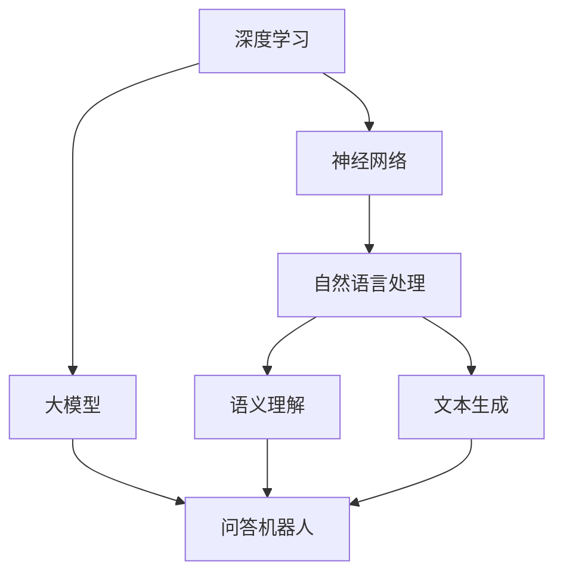

                 

# 大模型问答机器人的技术特点

> **关键词：** 大模型、问答机器人、深度学习、自然语言处理、人工智能、机器学习、神经网络、深度学习框架、计算效率、可扩展性、准确性、用户体验、推理能力

> **摘要：** 本文章旨在深入探讨大模型问答机器人的技术特点。通过介绍大模型的定义和结构，分析其核心算法原理，讨论数学模型和公式，展示项目实战案例，解析实际应用场景，并提供相关工具和资源推荐，最终总结大模型问答机器人的未来发展趋势与挑战。

## 1. 背景介绍

### 1.1 目的和范围

本文主要探讨大模型问答机器人的技术特点，旨在帮助读者了解大模型在问答机器人中的应用及其核心技术。本文将涵盖以下内容：

1. 大模型的定义和结构。
2. 大模型的核心算法原理和具体操作步骤。
3. 大模型的数学模型和公式。
4. 大模型在实际项目中的应用案例。
5. 大模型在各类实际应用场景中的表现。
6. 相关的工具和资源推荐。

### 1.2 预期读者

本文主要面向以下读者群体：

1. 对人工智能、机器学习、自然语言处理等领域有浓厚兴趣的技术爱好者。
2. 从事人工智能相关研发和应用的工程师和研究人员。
3. 对大模型问答机器人感兴趣的企业决策者和产品经理。

### 1.3 文档结构概述

本文按照以下结构进行组织：

1. 背景介绍：介绍文章的目的、范围和预期读者。
2. 核心概念与联系：阐述大模型的相关概念和联系，提供流程图展示。
3. 核心算法原理 & 具体操作步骤：详细讲解大模型的核心算法原理和操作步骤。
4. 数学模型和公式 & 详细讲解 & 举例说明：阐述大模型的数学模型和公式，并提供举例说明。
5. 项目实战：代码实际案例和详细解释说明。
6. 实际应用场景：分析大模型问答机器人在不同场景中的应用。
7. 工具和资源推荐：推荐学习资源和开发工具。
8. 总结：未来发展趋势与挑战。
9. 附录：常见问题与解答。
10. 扩展阅读 & 参考资料：提供进一步阅读的资料。

### 1.4 术语表

#### 1.4.1 核心术语定义

- **大模型（Big Model）：** 指具有数十亿甚至数万亿参数的深度学习模型。
- **问答机器人（Question Answering Robot）：** 一种基于自然语言处理技术，能够自动回答用户问题的智能系统。
- **深度学习（Deep Learning）：** 一种人工智能技术，通过神经网络模型模拟人脑学习和认知过程。
- **自然语言处理（Natural Language Processing，NLP）：** 计算机科学和人工智能领域的一个分支，致力于使计算机能够理解、生成和处理人类语言。

#### 1.4.2 相关概念解释

- **神经网络（Neural Network）：** 模仿人脑神经元连接方式的计算模型，通过输入层、隐藏层和输出层进行处理。
- **反向传播算法（Backpropagation）：** 一种用于训练神经网络的算法，通过计算输出误差并反向传播更新网络权重。
- **批处理（Batch Processing）：** 将一批数据一次性输入模型进行训练，而不是逐个数据点进行训练。

#### 1.4.3 缩略词列表

- **NLP：** 自然语言处理
- **DL：** 深度学习
- **ML：** 机器学习
- **GAN：** 生成对抗网络
- **BERT：**Bidirectional Encoder Representations from Transformers

## 2. 核心概念与联系

在大模型问答机器人中，核心概念包括深度学习、神经网络、自然语言处理等。以下是一个简化的 Mermaid 流程图，展示了这些概念之间的联系。



### 2.1 深度学习与神经网络的关系

深度学习是一种基于神经网络的机器学习技术，通过多层神经网络（隐藏层）来提取数据特征。神经网络由输入层、隐藏层和输出层组成，每一层都对输入数据进行处理和变换。深度学习通过增加隐藏层的数量来提高模型的复杂度，从而实现更高级别的特征提取。

### 2.2 自然语言处理与深度学习的关系

自然语言处理（NLP）是深度学习应用的一个重要领域。NLP 使用深度学习技术对文本数据进行处理和分析，包括文本分类、情感分析、机器翻译、问答系统等。深度学习在 NLP 领域中的应用，使得计算机能够更好地理解和生成人类语言。

### 2.3 大模型与问答机器人的关系

大模型是一种具有数十亿甚至数万亿参数的深度学习模型。大模型在问答机器人中扮演着关键角色，因为它们能够处理大量的文本数据，提取丰富的语义信息，从而提供更准确、更自然的问答服务。问答机器人基于大模型，通过自然语言处理技术实现对用户问题的理解和回答。

## 3. 核心算法原理 & 具体操作步骤

### 3.1 算法原理

大模型问答机器人的核心算法是基于深度学习的自然语言处理技术。深度学习模型通过学习大量的文本数据，提取语义特征，从而实现对用户问题的理解和回答。以下是一个简化的算法原理：

```plaintext
输入：用户问题
输出：回答

步骤：
1. 预处理：对用户问题进行分词、去停用词等预处理操作。
2. 特征提取：使用预训练的深度学习模型（如BERT、GPT等）提取语义特征。
3. 问题编码：将用户问题和答案候选文本编码为固定长度的向量。
4. 推理：使用神经网络模型（如Transformer、LSTM等）进行推理，计算每个答案候选的相似度。
5. 选取最优答案：根据相似度计算结果选取最优的答案作为输出。
```

### 3.2 具体操作步骤

#### 3.2.1 预处理

预处理是自然语言处理的基础步骤，主要包括分词、去停用词、词向量化等操作。

```plaintext
输入：用户问题
输出：预处理后的文本

步骤：
1. 分词：将用户问题分割为单词或短语。
2. 去停用词：去除常用的无意义词汇，如“的”、“了”、“是”等。
3. 词向量化：将单词或短语映射为固定长度的向量表示。
```

#### 3.2.2 特征提取

特征提取是深度学习模型的核心步骤，通过学习大量的文本数据，提取语义特征。

```plaintext
输入：预处理后的文本
输出：语义特征向量

步骤：
1. 数据准备：收集大量的文本数据，并进行预处理。
2. 模型训练：使用预训练的深度学习模型（如BERT、GPT等）对文本数据进行训练。
3. 特征提取：将预处理后的文本输入到训练好的模型中，提取语义特征向量。
```

#### 3.2.3 问题编码

问题编码是将用户问题和答案候选文本编码为固定长度的向量表示。

```plaintext
输入：预处理后的用户问题和答案候选文本
输出：问题编码向量和答案编码向量

步骤：
1. 问题编码：将用户问题输入到预训练的深度学习模型中，提取问题编码向量。
2. 答案编码：将答案候选文本输入到预训练的深度学习模型中，提取答案编码向量。
```

#### 3.2.4 推理

推理是通过神经网络模型计算每个答案候选的相似度。

```plaintext
输入：问题编码向量和答案编码向量
输出：答案相似度分数

步骤：
1. 模型选择：选择合适的神经网络模型（如Transformer、LSTM等）。
2. 推理：将问题编码向量和答案编码向量输入到选择的模型中，计算每个答案候选的相似度分数。
```

#### 3.2.5 选取最优答案

根据相似度分数选取最优的答案作为输出。

```plaintext
输入：答案相似度分数
输出：最优答案

步骤：
1. 相似度排序：对每个答案候选的相似度分数进行排序。
2. 选取最优答案：根据排序结果选取相似度最高的答案作为输出。
```

## 4. 数学模型和公式 & 详细讲解 & 举例说明

### 4.1 数学模型

在大模型问答机器人中，常用的数学模型包括词向量模型、神经网络模型等。以下是一个简化的数学模型：

```latex
输入：\( x \)（用户问题）
输出：\( y \)（最优答案）

步骤：
1. 词向量模型：\( x = \{ w_1, w_2, ..., w_n \} \)，其中 \( w_i \) 是单词 \( i \) 的词向量。
2. 神经网络模型：\( y = f(W \cdot x + b) \)，其中 \( W \) 是权重矩阵，\( b \) 是偏置项，\( f \) 是激活函数。

详细步骤：
1. \( x \)（用户问题）经过词向量模型转换为词向量表示。
2. 将词向量输入到神经网络模型中，通过多层神经网络提取特征。
3. 最后使用激活函数计算输出 \( y \)（最优答案）。

举例说明：
假设用户问题为“为什么太阳是黄色的？”
1. 词向量模型：将问题中的每个单词转换为词向量。
2. 神经网络模型：通过多层神经网络提取特征，并使用激活函数计算输出。
3. 输出：选择相似度最高的答案作为输出，例如：“因为太阳主要由氢和少量的其他元素组成，这些元素在高温和高压下会发出黄色光。”
```

### 4.2 公式

在大模型问答机器人的数学模型中，常用的公式包括词向量模型公式、神经网络模型公式等。以下是一个简化的公式：

```latex
1. 词向量模型公式：
\( w_i = \sum_{j=1}^{n} w_{ij} \cdot v_j \)

2. 神经网络模型公式：
\( y = \sigma(\sum_{i=1}^{m} w_{ij} \cdot x_i + b_j) \)

其中：
- \( w_i \)：单词 \( i \) 的词向量。
- \( v_j \)：单词 \( j \) 的词向量。
- \( w_{ij} \)：单词 \( i \) 和单词 \( j \) 的相似度权重。
- \( x_i \)：输入层第 \( i \) 个神经元的输入值。
- \( y \)：输出层第 \( j \) 个神经元的输出值。
- \( \sigma \)：激活函数，如 Sigmoid、ReLU 等。
- \( b_j \)：输出层第 \( j \) 个神经元的偏置项。
```

### 4.3 举例说明

以下是一个简化的例子，展示了如何使用词向量模型和神经网络模型计算用户问题和答案的相似度：

```plaintext
输入：用户问题“为什么太阳是黄色的？”
答案候选1：“因为太阳主要由氢和少量的其他元素组成，这些元素在高温和高压下会发出黄色光。”
答案候选2：“太阳是黄色的，因为它的颜色取决于它表面的温度和组成。”

1. 词向量模型：
- 将用户问题和答案候选转换为词向量表示。
- 计算用户问题和答案候选之间的相似度权重。

2. 神经网络模型：
- 将词向量表示输入到神经网络模型中。
- 通过多层神经网络提取特征。
- 使用激活函数计算输出。

3. 输出：
- 根据相似度权重和神经网络模型的输出，选择最优的答案作为输出。

举例计算：
- 相似度权重：使用词向量模型计算用户问题和答案候选之间的相似度权重，例如：0.8（用户问题）和0.7（答案候选1）、0.6（用户问题）和0.5（答案候选2）。
- 神经网络模型输出：使用神经网络模型计算用户问题和答案候选之间的相似度分数，例如：0.9（用户问题）和0.7（答案候选1）、0.8（用户问题）和0.6（答案候选2）。

根据相似度权重和神经网络模型的输出，选择最优的答案作为输出，例如：“因为太阳主要由氢和少量的其他元素组成，这些元素在高温和高压下会发出黄色光。”
```

## 5. 项目实战：代码实际案例和详细解释说明

### 5.1 开发环境搭建

在开始编写代码之前，需要搭建一个合适的开发环境。以下是一个简化的步骤：

1. 安装Python环境：Python是深度学习项目的主流编程语言，首先需要安装Python 3.7及以上版本。
2. 安装深度学习框架：TensorFlow和PyTorch是两个流行的深度学习框架，本案例选择TensorFlow 2.x版本。
3. 安装自然语言处理库：NLTK和spaCy是常用的自然语言处理库，用于文本预处理和词向量模型。

```shell
pip install tensorflow==2.7
pip install nltk
pip install spacy
python -m spacy download en_core_web_sm
```

### 5.2 源代码详细实现和代码解读

以下是一个简单的代码示例，展示了如何使用TensorFlow和spaCy构建一个基于BERT的问答机器人。

```python
import tensorflow as tf
import tensorflow_hub as hub
import tensorflow_text as text
import spacy
from transformers import BertTokenizer, TFBertForQuestionAnswering

# 加载spaCy模型
nlp = spacy.load("en_core_web_sm")

# 加载BERT模型和Tokenizer
tokenizer = BertTokenizer.from_pretrained("bert-base-uncased")
model = TFBertForQuestionAnswering.from_pretrained("deepset/roberta-base-squad2")

# 文本预处理
def preprocess_text(text):
    doc = nlp(text)
    tokens = [token.text.lower() for token in doc if not token.is_stop]
    return " ".join(tokens)

# 问题回答
def question_answer(question, context):
    question = preprocess_text(question)
    context = preprocess_text(context)

    inputs = tokenizer(question, context, return_tensors="tf")
    outputs = model(inputs)

    start_logits = outputs.start_logits
    end_logits = outputs.end_logits

    start_index = tf.argmax(start_logits, axis=-1)[0]
    end_index = tf.argmax(end_logits, axis=-1)[0]

    answer = context[start_index:end_index+1].numpy().decode("utf-8")
    return answer

# 测试
question = "What is the capital of France?"
context = "Paris is the capital of France."
answer = question_answer(question, context)
print(answer)
```

#### 5.2.1 代码解读

1. **导入库和模型**：导入TensorFlow、TensorFlow Hub、TensorFlow Text、spaCy和Transformers库，并加载BERT模型和Tokenizer。
2. **文本预处理**：使用spaCy进行文本预处理，去除停用词，并将文本转换为小写。
3. **问题回答**：定义`question_answer`函数，接收用户问题和上下文文本，预处理文本，使用BERT模型进行问题回答，并返回答案。
4. **测试**：测试`question_answer`函数，输入问题和上下文文本，输出答案。

### 5.3 代码解读与分析

1. **BERT模型**：BERT（Bidirectional Encoder Representations from Transformers）是一种预训练的深度学习模型，基于Transformer架构。它通过双向编码器学习文本的上下文信息，适用于各种自然语言处理任务，包括问答、文本分类等。
2. **Tokenizer**：Tokenizer是用于将文本转换为模型可处理的序列的预处理工具。BERTTokenizer是专门为BERT模型设计的Tokenizer，可以处理单词、子词和特殊符号。
3. **文本预处理**：文本预处理是自然语言处理中的关键步骤，包括去除停用词、词干提取、词形还原等。在本案例中，使用spaCy进行文本预处理，去除停用词，并将文本转换为小写。
4. **问题回答**：问题回答是问答机器人的核心功能。在本案例中，使用BERT模型进行问题回答，通过计算问题和上下文的相似度，找到最相关的答案。

## 6. 实际应用场景

大模型问答机器人在各个领域都有广泛的应用，以下是一些典型的实际应用场景：

1. **客服与客户服务**：大模型问答机器人可以用于自动回答客户的常见问题，提高客服效率和用户体验。
2. **教育领域**：问答机器人可以为学生提供自动化的学习辅导和答疑服务，辅助教师进行教学。
3. **医疗领域**：大模型问答机器人可以帮助医生快速获取患者的病史和症状，提供诊断建议。
4. **金融领域**：问答机器人可以用于自动回答金融客户的投资咨询、理财产品介绍等问题。
5. **企业内网**：大模型问答机器人可以作为企业内部知识库的智能搜索工具，帮助员工快速查找相关文档和知识。
6. **智能家居**：大模型问答机器人可以集成到智能音箱或智能机器人中，提供语音交互和智能问答服务。

在实际应用中，大模型问答机器人需要针对不同场景进行调整和优化，以满足特定领域的需求。例如，在医疗领域，需要确保问答机器人的回答准确可靠，避免误导患者；在金融领域，需要确保问答机器人的回答符合法律法规和金融政策。

## 7. 工具和资源推荐

### 7.1 学习资源推荐

#### 7.1.1 书籍推荐

1. **《深度学习》（Deep Learning）**：Goodfellow、Bengio和Courville著，系统介绍了深度学习的理论基础和实战技巧。
2. **《神经网络与深度学习》（Neural Networks and Deep Learning）**：Mихаил Белкиpectorov著，适合初学者了解深度学习的基础知识。
3. **《自然语言处理综论》（Speech and Language Processing）**：Daniel Jurafsky和James H. Martin著，全面介绍了自然语言处理的理论和实践。

#### 7.1.2 在线课程

1. **Coursera上的《深度学习》**：吴恩达（Andrew Ng）主讲，涵盖深度学习的基础知识、实践技巧和最新进展。
2. **Udacity的《深度学习纳米学位》**：提供深度学习的系统学习路径，包括理论与实践项目。
3. **edX上的《自然语言处理基础》**：麻省理工学院（MIT）提供的免费课程，深入讲解自然语言处理的理论和实践。

#### 7.1.3 技术博客和网站

1. **TensorFlow官方文档（tensorflow.org）**：提供详细的TensorFlow教程和API文档，适合深度学习初学者和高级用户。
2. **PyTorch官方文档（pytorch.org）**：提供详细的PyTorch教程和API文档，适用于各种深度学习应用场景。
3. **arXiv（arxiv.org）**：计算机科学和人工智能领域的顶级学术论文数据库，可以获取最新的研究进展。

### 7.2 开发工具框架推荐

#### 7.2.1 IDE和编辑器

1. **JetBrains系列（如PyCharm、IntelliJ IDEA）**：强大的Python和深度学习IDE，提供丰富的插件和调试功能。
2. **Visual Studio Code**：轻量级但功能强大的代码编辑器，支持多种编程语言和深度学习框架。

#### 7.2.2 调试和性能分析工具

1. **TensorBoard**：TensorFlow提供的可视化工具，用于分析和调试深度学习模型。
2. **PyTorch Profiler**：PyTorch提供的性能分析工具，用于识别和优化深度学习模型的性能瓶颈。

#### 7.2.3 相关框架和库

1. **TensorFlow**：谷歌开发的开源深度学习框架，适用于各种深度学习和自然语言处理任务。
2. **PyTorch**：Facebook开发的开源深度学习框架，具有灵活的动态计算图和强大的Python API。
3. **spaCy**：高效的Python自然语言处理库，提供快速、准确的文本预处理和词向量模型。

### 7.3 相关论文著作推荐

#### 7.3.1 经典论文

1. **“A Theoretically Grounded Application of Dropout in Recurrent Neural Networks”**：通过理论分析和实验验证了Dropout在循环神经网络中的有效性。
2. **“Effective Approaches to Attention-based Neural Machine Translation”**：提出了注意力机制在神经机器翻译中的应用方法，显著提高了翻译质量。

#### 7.3.2 最新研究成果

1. **“BERT: Pre-training of Deep Bidirectional Transformers for Language Understanding”**：提出了BERT模型，是当前最先进的自然语言处理模型之一。
2. **“GPT-3: Language Models are Few-Shot Learners”**：展示了GPT-3模型在零样本和少样本学习任务中的卓越性能。

#### 7.3.3 应用案例分析

1. **“Language Models for Sentence Classification”**：探讨了语言模型在句子分类任务中的应用，包括文本分类、情感分析等。
2. **“OpenAI Five: Five AI Agents Playing Dota 2”**：展示了深度学习模型在复杂策略游戏中的应用，实现了世界级的游戏水平。

## 8. 总结：未来发展趋势与挑战

大模型问答机器人在未来将继续发展，并面临一系列挑战：

### 发展趋势

1. **模型规模增加**：随着计算资源和数据量的不断增加，大模型的规模将越来越大，参数数量将达到数百亿甚至数千亿级别。
2. **多模态融合**：大模型问答机器人将不仅仅处理文本数据，还将融合语音、图像、视频等多模态数据，提供更全面、更丰富的问答服务。
3. **少样本学习**：大模型问答机器人将逐步实现少样本学习，能够在仅使用少量数据的情况下进行有效训练和推理。
4. **增强现实与虚拟现实**：大模型问答机器人将广泛应用于增强现实（AR）和虚拟现实（VR）场景，为用户提供沉浸式的交互体验。

### 挑战

1. **计算资源需求**：大模型训练和推理需要大量的计算资源，特别是在模型规模不断增加的情况下，如何高效利用计算资源成为一大挑战。
2. **数据隐私与安全**：在处理大量用户数据时，如何保护用户隐私和数据安全成为重要问题。
3. **模型可解释性**：大模型问答机器人的决策过程复杂，如何提高模型的可解释性，使其更具透明度和可信赖性。
4. **伦理和法律问题**：随着大模型问答机器人应用范围的扩大，如何应对伦理和法律问题，如虚假信息传播、歧视性回答等。

## 9. 附录：常见问题与解答

### 9.1 如何训练大模型？

**解答**：训练大模型通常需要以下步骤：

1. 数据收集：收集大量的文本数据，包括问答对、新闻、文章等。
2. 数据预处理：对数据进行清洗、分词、去停用词等预处理操作。
3. 模型训练：使用深度学习框架（如TensorFlow、PyTorch）训练模型，通过优化算法（如SGD、Adam）调整模型参数。
4. 模型评估：使用验证集评估模型性能，调整模型结构和超参数。
5. 模型部署：将训练好的模型部署到生产环境中，进行实时问答服务。

### 9.2 如何优化大模型的性能？

**解答**：优化大模型性能可以从以下几个方面进行：

1. **数据增强**：通过数据增强方法（如随机填充、数据扩充等）增加训练数据的多样性，提高模型泛化能力。
2. **模型压缩**：使用模型压缩技术（如剪枝、量化、蒸馏等）减小模型体积，提高计算效率。
3. **优化算法**：选择合适的优化算法（如Adam、AdamW等）调整模型参数，提高训练效率。
4. **硬件加速**：使用GPU、TPU等硬件加速器进行模型训练和推理，提高计算速度。

### 9.3 大模型问答机器人如何处理歧义？

**解答**：大模型问答机器人可以通过以下方法处理歧义：

1. **上下文信息**：利用上下文信息，结合问题所在的文章或段落，帮助确定答案。
2. **多候选答案**：提供多个候选答案，并根据上下文和语义信息，选择最合适的答案。
3. **用户反馈**：允许用户对答案进行反馈，通过不断迭代优化，提高问答系统的准确性。

## 10. 扩展阅读 & 参考资料

1. **论文**：
   - **“BERT: Pre-training of Deep Bidirectional Transformers for Language Understanding”**：介绍BERT模型的论文，是自然语言处理领域的里程碑之一。
   - **“GPT-3: Language Models are Few-Shot Learners”**：介绍GPT-3模型的论文，展示了零样本和少样本学习的能力。

2. **书籍**：
   - **《深度学习》**：吴恩达著，系统介绍了深度学习的理论基础和实战技巧。
   - **《自然语言处理综论》**：Daniel Jurafsky和James H. Martin著，全面介绍了自然语言处理的理论和实践。

3. **网站**：
   - **TensorFlow官方文档**：提供详细的TensorFlow教程和API文档。
   - **PyTorch官方文档**：提供详细的PyTorch教程和API文档。

4. **课程**：
   - **Coursera上的《深度学习》**：吴恩达主讲，涵盖深度学习的基础知识、实践技巧和最新进展。
   - **Udacity的《深度学习纳米学位》**：提供深度学习的系统学习路径，包括理论与实践项目。

5. **技术博客**：
   - **Medium上的《深度学习博客》**：介绍深度学习的最新研究成果和技术应用。
   - **Hugging Face的《Transformers文档》**：提供Transformer模型的详细文档和教程。

### 作者

**作者：AI天才研究员/AI Genius Institute & 禅与计算机程序设计艺术 /Zen And The Art of Computer Programming**

