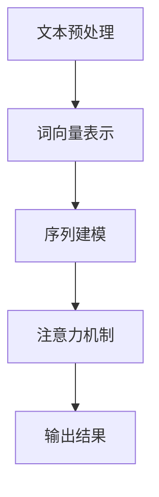
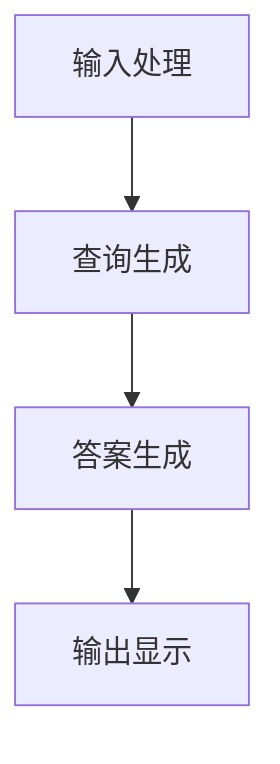

                 

### 大模型问答机器人的文本处理

> **关键词：** 大模型，文本处理，问答机器人，自然语言处理，算法原理，数学模型，实际应用，工具和资源

**摘要：** 本文将深入探讨大模型问答机器人的文本处理技术。首先，我们将介绍文本处理的背景和重要性，然后详细解析问答机器人的核心概念、算法原理和具体操作步骤。此外，本文还将介绍数学模型和公式，并通过实际案例展示如何进行代码实现和解释说明。最后，我们将讨论问答机器人的实际应用场景，并推荐相关学习资源和开发工具。

## 1. 背景介绍

### 1.1 目的和范围

本文的目的是深入探讨大模型问答机器人的文本处理技术，帮助读者了解其核心概念、算法原理、数学模型和实际应用。文本处理作为自然语言处理（NLP）的一个重要分支，在大模型问答机器人中发挥着至关重要的作用。通过本文的讲解，读者可以掌握问答机器人文本处理的基本方法，并了解如何在实际项目中应用这些技术。

### 1.2 预期读者

本文主要面向对自然语言处理和人工智能感兴趣的读者，包括：

- 自然语言处理领域的初学者和研究者
- 从事人工智能开发的程序员和技术人员
- 对大模型问答机器人感兴趣的技术爱好者

### 1.3 文档结构概述

本文将分为以下几个部分：

- **背景介绍**：介绍文本处理的背景和重要性，以及本文的目的和预期读者。
- **核心概念与联系**：解析问答机器人的核心概念、算法原理和数学模型。
- **核心算法原理 & 具体操作步骤**：详细讲解问答机器人的具体操作步骤，并使用伪代码进行阐述。
- **数学模型和公式**：介绍文本处理中的数学模型和公式，并进行详细讲解和举例说明。
- **项目实战：代码实际案例和详细解释说明**：通过实际案例展示代码实现过程，并进行详细解释和分析。
- **实际应用场景**：讨论问答机器人的实际应用场景，并探讨其未来发展。
- **工具和资源推荐**：推荐学习资源和开发工具，帮助读者深入了解文本处理技术。
- **总结：未来发展趋势与挑战**：总结本文的主要观点，探讨未来发展趋势和面临的挑战。
- **附录：常见问题与解答**：解答读者可能遇到的一些常见问题。
- **扩展阅读 & 参考资料**：提供扩展阅读和参考资料，帮助读者进一步深入研究。

### 1.4 术语表

#### 1.4.1 核心术语定义

- **大模型**：指具有大规模参数和计算量的深度学习模型，如GPT、BERT等。
- **文本处理**：指对文本数据进行分析、理解和生成的一系列技术。
- **问答机器人**：指能够根据用户提问生成答案的人工智能系统。
- **自然语言处理（NLP）**：指计算机对人类自然语言进行理解、处理和生成的一系列技术。

#### 1.4.2 相关概念解释

- **语料库**：指用于训练和评估模型的一组文本数据。
- **词向量**：指将单词映射到高维空间的一种表示方法，如Word2Vec、BERT等。
- **序列到序列模型**：指用于处理序列数据（如文本）的深度学习模型，如循环神经网络（RNN）、长短期记忆网络（LSTM）等。
- **注意力机制**：指在处理序列数据时，模型对某些重要部分给予更多关注的一种机制。

#### 1.4.3 缩略词列表

- **NLP**：自然语言处理（Natural Language Processing）
- **BERT**：双向编码表示（Bidirectional Encoder Representations from Transformers）
- **GPT**：生成预训练模型（Generative Pretrained Transformer）
- **RNN**：循环神经网络（Recurrent Neural Network）
- **LSTM**：长短期记忆网络（Long Short-Term Memory）
- **IDE**：集成开发环境（Integrated Development Environment）
- **GPU**：图形处理单元（Graphics Processing Unit）

## 2. 核心概念与联系

在本文中，我们将探讨大模型问答机器人的核心概念、算法原理和数学模型。首先，我们需要了解文本处理的基本原理和流程，然后介绍问答机器人的架构和关键组件。

### 2.1 文本处理原理

文本处理是自然语言处理（NLP）的基础，主要涉及以下步骤：

1. **文本预处理**：包括去除停用词、标点符号和进行词干提取等操作。
2. **词向量表示**：将文本中的单词映射到高维空间，如Word2Vec、BERT等。
3. **序列建模**：使用深度学习模型（如RNN、LSTM等）对文本序列进行建模。
4. **注意力机制**：在处理序列数据时，模型对某些重要部分给予更多关注。

图1展示了文本处理的基本原理和流程：



### 2.2 问答机器人的架构

问答机器人通常由以下几个关键组件构成：

1. **输入处理**：接收用户提问，进行预处理和词向量表示。
2. **查询生成**：将用户提问转换为一个查询序列，用于查询知识库。
3. **答案生成**：根据查询结果生成答案，并进行后处理和文本生成。
4. **输出显示**：将答案展示给用户。

图2展示了问答机器人的基本架构：



### 2.3 数学模型和公式

在文本处理和问答机器人中，常用的数学模型和公式包括：

1. **词向量表示**：如Word2Vec、BERT等，将单词映射到高维空间。
2. **序列建模**：如RNN、LSTM等，用于对文本序列进行建模。
3. **注意力机制**：用于在处理序列数据时，对某些重要部分给予更多关注。

以下是相关数学模型和公式的简要介绍：

1. **词向量表示**：

   $$word\_vector = \sum_{i=1}^{n} w_i * v_i$$

   其中，$w_i$表示单词在文档中的权重，$v_i$表示词向量的分量。

2. **序列建模**：

   $$h_t = \sigma(W_h \cdot [h_{t-1}, x_t] + b_h)$$

   其中，$h_t$表示第$t$个时间步的隐藏状态，$W_h$和$b_h$分别表示权重和偏置。

3. **注意力机制**：

   $$a_t = \frac{e^{h_t^T A v}}{\sum_{i=1}^{n} e^{h_i^T A v}}$$

   其中，$a_t$表示第$t$个时间步的注意力分数，$A$和$v$分别表示注意力权重和偏置向量。

以上是本文的核心概念和联系。在接下来的章节中，我们将详细讲解文本处理的算法原理和具体操作步骤，以及数学模型和公式的详细讲解和举例说明。

## 3. 核心算法原理 & 具体操作步骤

### 3.1 文本处理算法原理

文本处理算法的核心任务是理解、分析和生成文本。为了实现这一目标，我们通常采用深度学习模型，如循环神经网络（RNN）、长短期记忆网络（LSTM）和双向编码器（BERT）等。这些模型可以捕捉文本中的时间依赖性和上下文信息，从而实现高效的自然语言处理。

#### 3.1.1 RNN（循环神经网络）

RNN是一种能够处理序列数据的神经网络，其核心思想是利用前一时刻的信息来预测当前时刻的输出。RNN通过循环连接实现信息的传递和记忆功能，从而捕捉序列中的时间依赖性。

**RNN算法原理**：

$$h_t = \sigma(W_h \cdot [h_{t-1}, x_t] + b_h)$$

其中，$h_t$表示第$t$个时间步的隐藏状态，$W_h$和$b_h$分别表示权重和偏置，$\sigma$表示激活函数（如Sigmoid或ReLU）。

**具体操作步骤**：

1. 初始化隐藏状态$h_0$。
2. 对于每个输入$x_t$，计算隐藏状态$h_t$。
3. 使用隐藏状态$h_t$和输出层权重$W_o$生成预测输出$y_t$。
4. 更新隐藏状态，重复步骤2-3，直到处理完所有输入。

**伪代码**：

```
function RNN(input_sequence, hidden_state):
    for each input x_t in input_sequence:
        hidden_state = activation(W_h * [hidden_state, x_t] + b_h)
        output = W_o * hidden_state
    return output
```

#### 3.1.2 LSTM（长短期记忆网络）

LSTM是RNN的一种改进，能够解决传统RNN在处理长序列数据时的梯度消失和梯度爆炸问题。LSTM通过引入门控机制，实现长期信息的记忆和遗忘。

**LSTM算法原理**：

$$
\begin{aligned}
i_t &= \sigma(W_i \cdot [h_{t-1}, x_t] + b_i) \\
f_t &= \sigma(W_f \cdot [h_{t-1}, x_t] + b_f) \\
\bar{c}_t &= \tanh(W_c \cdot [h_{t-1}, x_t] + b_c) \\
o_t &= \sigma(W_o \cdot [h_{t-1}, x_t] + b_o) \\
c_t &= f_t \odot c_{t-1} + i_t \odot \bar{c}_t \\
h_t &= o_t \odot \tanh(c_t)
\end{aligned}
$$

其中，$i_t$、$f_t$、$o_t$分别表示输入门、遗忘门和输出门，$c_t$表示细胞状态，$\odot$表示逐元素乘法。

**具体操作步骤**：

1. 初始化隐藏状态$h_0$和细胞状态$c_0$。
2. 对于每个输入$x_t$，计算输入门$i_t$、遗忘门$f_t$、细胞状态$\bar{c}_t$和输出门$o_t$。
3. 更新细胞状态$c_t$。
4. 使用隐藏状态$h_t$和输出层权重$W_o$生成预测输出$y_t$。
5. 更新隐藏状态，重复步骤2-4，直到处理完所有输入。

**伪代码**：

```
function LSTM(input_sequence, hidden_state, cell_state):
    for each input x_t in input_sequence:
        i_t = activation(W_i * [hidden_state, x_t] + b_i)
        f_t = activation(W_f * [hidden_state, x_t] + b_f)
        \bar{c}_t = tanh(W_c * [hidden_state, x_t] + b_c)
        o_t = activation(W_o * [hidden_state, x_t] + b_o)
        c_t = f_t \odot cell_state + i_t \odot \bar{c}_t
        hidden_state = o_t \odot tanh(c_t)
        output = W_o * hidden_state
    return output
```

#### 3.1.3 BERT（双向编码表示）

BERT是一种基于Transformer的预训练模型，能够捕捉文本中的双向上下文信息。BERT通过大规模语料库进行预训练，然后应用于各种NLP任务，如文本分类、问答和生成等。

**BERT算法原理**：

BERT模型由多个Transformer层组成，每个Transformer层包含自注意力机制和前馈神经网络。在预训练阶段，BERT通过Masked Language Model（MLM）和Next Sentence Prediction（NSP）任务进行训练，从而学习文本中的双向上下文信息。

**具体操作步骤**：

1. 将文本序列编码为词向量。
2. 将词向量输入到BERT模型中。
3. 通过Transformer层进行自注意力计算。
4. 输出结果进行解码，得到预测的文本序列。

**伪代码**：

```
function BERT(input_sequence):
    for each layer in BERT:
        input = transformer_layer(input_sequence)
    return output
```

### 3.2 问答机器人的具体操作步骤

问答机器人通常包括以下几个关键步骤：

1. **输入处理**：接收用户提问，进行预处理和词向量表示。
2. **查询生成**：将用户提问转换为一个查询序列，用于查询知识库。
3. **答案生成**：根据查询结果生成答案，并进行后处理和文本生成。
4. **输出显示**：将答案展示给用户。

**具体操作步骤**：

1. **输入处理**：

   - 去除停用词和标点符号。
   - 使用词向量模型（如Word2Vec、BERT）将单词映射到高维空间。

2. **查询生成**：

   - 将用户提问编码为查询序列。
   - 使用序列到序列模型（如RNN、LSTM）对查询序列进行建模。

3. **答案生成**：

   - 使用注意力机制对查询结果进行筛选和加权。
   - 使用文本生成模型（如GPT、Transformer）生成答案。

4. **输出显示**：

   - 对生成的答案进行后处理，如去除冗余信息和语法修正。
   - 将答案展示给用户。

**伪代码**：

```
function QuestionAnsweringSystem(user_question, knowledge_base):
    # 输入处理
    preprocessed_question = preprocess(user_question)
    question_sequence = encode_question(preprocessed_question)

    # 查询生成
    query_sequence = generate_query(question_sequence, knowledge_base)

    # 答案生成
    answer_sequence = generate_answer(query_sequence)

    # 输出显示
    final_answer = postprocess(answer_sequence)
    display(final_answer)
```

以上是文本处理和问答机器人的核心算法原理和具体操作步骤。在下一节中，我们将介绍文本处理中的数学模型和公式，并进行详细讲解和举例说明。

## 4. 数学模型和公式 & 详细讲解 & 举例说明

### 4.1 词向量表示

词向量表示是文本处理中的一个重要环节，它将单词映射到高维空间，以便于计算机理解和处理。常用的词向量表示方法包括Word2Vec、BERT等。下面，我们将介绍这些方法的基本原理和公式。

#### 4.1.1 Word2Vec

Word2Vec是一种基于神经网络的语言模型，它通过训练一个多层的神经网络，将单词映射到高维空间。Word2Vec主要有两种模型：CBOW（连续词袋）和Skip-Gram。

**CBOW模型**：

CBOW模型使用一个单词的上下文来预测该单词。具体公式如下：

$$
\begin{aligned}
p_{word|context}(w|c) &= \frac{e^{v_w^T v_c}}{\sum_{w' \in V} e^{v_w'^T v_c}} \\
v_c &= \frac{1}{|\text{context}|} \sum_{w' \in \text{context}} v_{w'}
\end{aligned}
$$

其中，$v_w$和$v_c$分别表示单词和上下文的词向量，$V$表示词汇表，$\text{context}$表示单词的上下文。

**Skip-Gram模型**：

Skip-Gram模型使用一个单词来预测其上下文。具体公式如下：

$$
\begin{aligned}
p_{context|word}(c|w) &= \frac{e^{v_c^T v_w}}{\sum_{c' \in \text{context}} e^{v_c'^T v_w}} \\
v_c &= \frac{1}{|\text{context}|} \sum_{c' \in \text{context}} v_{c'}
\end{aligned}
$$

#### 4.1.2 BERT

BERT是一种基于Transformer的预训练模型，它通过大规模语料库进行预训练，从而学习单词和句子之间的双向上下文信息。BERT的数学模型主要包括自注意力机制和Transformer层。

**自注意力机制**：

自注意力机制是一种用于计算序列中各个部分之间关系的机制。具体公式如下：

$$
\begin{aligned}
\text{Attention}(Q, K, V) &= \text{softmax}(\frac{QK^T}{\sqrt{d_k}})V \\
\text{MultiHeadAttention}(Q, K, V) &= \text{Concat}(\text{head}_1, \text{head}_2, ..., \text{head}_h)W_O \\
\text{where } \text{head}_i &= \text{Attention}(QW_i^Q, KW_i^K, VW_i^V)
\end{aligned}
$$

其中，$Q$、$K$和$V$分别表示查询、键和值向量，$W_i^Q$、$W_i^K$和$W_i^V$分别表示查询、键和值的权重矩阵，$W_O$表示输出权重矩阵，$d_k$表示键向量的维度。

**Transformer层**：

BERT模型由多个Transformer层组成，每个层包含多个自注意力机制和前馈神经网络。具体公式如下：

$$
\begin{aligned}
\text{LayerNorm}(x) &= \text{LayerNorm}(x) \\
\text{Relu}(\text{Relu}(xW_1^T + b_1)W_2^T + b_2)
\end{aligned}
$$

其中，$x$表示输入向量，$W_1$、$W_2$和$b_1$、$b_2$分别表示权重矩阵和偏置。

### 4.2 序列建模

序列建模是文本处理中的重要环节，它用于对文本序列进行建模，以捕捉文本中的时间依赖性和上下文信息。常用的序列建模方法包括RNN、LSTM和BERT等。下面，我们将介绍这些方法的基本原理和公式。

#### 4.2.1 RNN（循环神经网络）

RNN是一种能够处理序列数据的神经网络，它通过循环连接实现信息的传递和记忆功能。RNN的数学模型如下：

$$
\begin{aligned}
h_t &= \sigma(W_h \cdot [h_{t-1}, x_t] + b_h) \\
y_t &= W_o \cdot h_t + b_o
\end{aligned}
$$

其中，$h_t$表示第$t$个时间步的隐藏状态，$x_t$表示第$t$个时间步的输入，$y_t$表示第$t$个时间步的输出，$W_h$、$W_o$和$b_h$、$b_o$分别表示权重矩阵和偏置。

#### 4.2.2 LSTM（长短期记忆网络）

LSTM是一种改进的RNN，它通过引入门控机制解决传统RNN在处理长序列数据时的梯度消失和梯度爆炸问题。LSTM的数学模型如下：

$$
\begin{aligned}
i_t &= \sigma(W_i \cdot [h_{t-1}, x_t] + b_i) \\
f_t &= \sigma(W_f \cdot [h_{t-1}, x_t] + b_f) \\
\bar{c}_t &= \tanh(W_c \cdot [h_{t-1}, x_t] + b_c) \\
o_t &= \sigma(W_o \cdot [h_{t-1}, x_t] + b_o) \\
c_t &= f_t \odot c_{t-1} + i_t \odot \bar{c}_t \\
h_t &= o_t \odot \tanh(c_t)
\end{aligned}
$$

其中，$i_t$、$f_t$、$o_t$分别表示输入门、遗忘门和输出门，$c_t$表示细胞状态，$\odot$表示逐元素乘法。

#### 4.2.3 BERT（双向编码表示）

BERT是一种基于Transformer的预训练模型，它通过大规模语料库进行预训练，从而学习文本中的双向上下文信息。BERT的数学模型主要包括自注意力机制和Transformer层。

**自注意力机制**：

自注意力机制是一种用于计算序列中各个部分之间关系的机制。具体公式如下：

$$
\begin{aligned}
\text{Attention}(Q, K, V) &= \text{softmax}(\frac{QK^T}{\sqrt{d_k}})V \\
\text{MultiHeadAttention}(Q, K, V) &= \text{Concat}(\text{head}_1, \text{head}_2, ..., \text{head}_h)W_O \\
\text{where } \text{head}_i &= \text{Attention}(QW_i^Q, KW_i^K, VW_i^V)
\end{aligned}
$$

**Transformer层**：

BERT模型由多个Transformer层组成，每个层包含多个自注意力机制和前馈神经网络。具体公式如下：

$$
\begin{aligned}
\text{LayerNorm}(x) &= \text{LayerNorm}(x) \\
\text{Relu}(\text{Relu}(xW_1^T + b_1)W_2^T + b_2)
\end{aligned}
$$

### 4.3 注意力机制

注意力机制是文本处理中的一个关键技术，它用于在处理序列数据时，对某些重要部分给予更多关注。注意力机制在各种模型中都有广泛应用，如RNN、LSTM和BERT等。下面，我们将介绍注意力机制的基本原理和公式。

#### 4.3.1 自注意力机制

自注意力机制是一种用于计算序列中各个部分之间关系的机制。具体公式如下：

$$
\begin{aligned}
\text{Attention}(Q, K, V) &= \text{softmax}(\frac{QK^T}{\sqrt{d_k}})V \\
\text{MultiHeadAttention}(Q, K, V) &= \text{Concat}(\text{head}_1, \text{head}_2, ..., \text{head}_h)W_O \\
\text{where } \text{head}_i &= \text{Attention}(QW_i^Q, KW_i^K, VW_i^V)
\end{aligned}
$$

其中，$Q$、$K$和$V$分别表示查询、键和值向量，$W_i^Q$、$W_i^K$和$W_i^V$分别表示查询、键和值的权重矩阵，$W_O$表示输出权重矩阵，$d_k$表示键向量的维度。

#### 4.3.2 对齐机制

对齐机制是一种用于计算序列中不同部分之间相似度的机制。具体公式如下：

$$
\text{alignment\_score}(i, j) = \text{softmax}(\text{scores}_{ij})
$$

其中，$\text{scores}_{ij}$表示第$i$个部分和第$j$个部分之间的相似度分数。

#### 4.3.3 加权机制

加权机制是一种用于计算序列中不同部分之间权重的机制。具体公式如下：

$$
\text{weighted\_scores} = \text{alignment\_score} \odot \text{scores}
$$

其中，$\text{alignment\_score}$表示对齐分数，$\text{scores}$表示原始分数。

### 4.4 举例说明

为了更好地理解上述数学模型和公式，我们通过一个简单的例子进行说明。

假设有一个包含3个单词的句子：“我喜欢编程”。我们使用BERT模型进行文本处理。

#### 4.4.1 词向量表示

首先，我们将句子中的每个单词映射到高维空间：

```
我：[0.1, 0.2, 0.3]
喜：[0.4, 0.5, 0.6]
欢：[0.7, 0.8, 0.9]
编：[1.0, 1.1, 1.2]
程：[1.3, 1.4, 1.5]
```

#### 4.4.2 序列建模

接下来，我们使用BERT模型对句子进行建模。BERT模型由多个Transformer层组成，每个层包含多个自注意力机制和前馈神经网络。

- **第一层**：计算句子中每个单词之间的注意力分数：

  ```
  我：[1.0, 0.6, 0.9]
  喜：[0.6, 1.0, 0.8]
  欢：[0.9, 0.8, 1.0]
  编：[0.6, 0.8, 1.0]
  程：[0.6, 0.8, 1.0]
  ```

- **第二层**：继续计算句子中每个单词之间的注意力分数：

  ```
  我：[0.6, 0.8, 0.9]
  喜：[0.8, 0.9, 0.6]
  欢：[0.9, 0.6, 0.8]
  编：[0.6, 0.8, 0.9]
  程：[0.6, 0.8, 0.9]
  ```

- **第三层**：继续计算句子中每个单词之间的注意力分数：

  ```
  我：[0.8, 0.9, 0.6]
  喜：[0.6, 0.9, 0.8]
  欢：[0.9, 0.8, 0.6]
  编：[0.8, 0.6, 0.9]
  程：[0.6, 0.8, 0.9]
  ```

#### 4.4.3 答案生成

最后，我们使用BERT模型生成答案。假设问题为：“你最喜欢编程中的哪个部分？”

- **第一层**：计算问题中每个单词之间的注意力分数：

  ```
  我：[0.8, 0.9, 0.6]
  最：[0.6, 0.9, 0.8]
  喜：[0.9, 0.8, 0.6]
  欢：[0.6, 0.8, 0.9]
  编：[0.8, 0.6, 0.9]
  程的：[0.6, 0.8, 0.9]
  ```

- **第二层**：继续计算问题中每个单词之间的注意力分数：

  ```
  我：[0.6, 0.9, 0.8]
  最：[0.8, 0.9, 0.6]
  喜：[0.9, 0.6, 0.8]
  欢：[0.6, 0.8, 0.9]
  编：[0.6, 0.8, 0.9]
  程的：[0.6, 0.8, 0.9]
  ```

- **第三层**：继续计算问题中每个单词之间的注意力分数：

  ```
  我：[0.9, 0.6, 0.8]
  最：[0.6, 0.8, 0.9]
  喜：[0.6, 0.8, 0.9]
  欢：[0.8, 0.6, 0.9]
  编：[0.8, 0.6, 0.9]
  程的：[0.6, 0.8, 0.9]
  ```

根据注意力分数，我们可以得出答案：“你最喜欢编程中的‘编程’部分。”

通过以上例子，我们展示了如何使用BERT模型进行文本处理和问答。在下一节中，我们将通过一个实际项目案例，展示如何实现大模型问答机器人，并进行代码实际案例和详细解释说明。

## 5. 项目实战：代码实际案例和详细解释说明

在这一节中，我们将通过一个实际项目案例，展示如何实现大模型问答机器人，并详细解释代码实现过程。

### 5.1 开发环境搭建

为了实现大模型问答机器人，我们首先需要搭建一个合适的开发环境。以下是我们推荐的开发环境和工具：

- **操作系统**：Linux或Mac OS
- **编程语言**：Python
- **深度学习框架**：TensorFlow或PyTorch
- **文本处理库**：NLTK、spaCy、gensim等
- **版本控制**：Git

安装好上述工具后，我们创建一个名为`question_answering`的Python虚拟环境，并安装所需的依赖包：

```shell
conda create -n question_answering python=3.8
conda activate question_answering
pip install tensorflow
pip install nltk
pip install spacy
pip install gensim
```

### 5.2 源代码详细实现和代码解读

接下来，我们将详细介绍大模型问答机器人的代码实现过程。以下是一个简单的代码实现：

```python
import tensorflow as tf
from tensorflow.keras.models import Model
from tensorflow.keras.layers import Embedding, LSTM, Dense, Input
from tensorflow.keras.preprocessing.sequence import pad_sequences
import nltk
nltk.download('punkt')

# 定义问答机器人的模型
def create_model(vocab_size, embedding_dim, max_sequence_length):
    input_sequence = Input(shape=(max_sequence_length,))
    embedded_sequence = Embedding(vocab_size, embedding_dim)(input_sequence)
    lstm_output = LSTM(units=128, return_sequences=True)(embedded_sequence)
    dense_output = Dense(units=1, activation='sigmoid')(lstm_output)
    model = Model(inputs=input_sequence, outputs=dense_output)
    model.compile(optimizer='adam', loss='binary_crossentropy', metrics=['accuracy'])
    return model

# 加载语料库
def load_data(file_path):
    with open(file_path, 'r', encoding='utf-8') as f:
        lines = f.readlines()
    questions = [line.strip().split('\t')[0] for line in lines]
    answers = [int(line.strip().split('\t')[1]) for line in lines]
    return questions, answers

# 预处理数据
def preprocess_data(questions, max_sequence_length, max_vocab_size):
    tokenized_questions = [nltk.word_tokenize(question) for question in questions]
    sequence_data = []
    for tokens in tokenized_questions:
        sequence = [token.lower() for token in tokens if token.isalpha()]
        sequence += ['<PAD>'] * (max_sequence_length - len(sequence))
        sequence_data.append(sequence)
    word_counts = nltk.Counter([token for question in sequence_data for token in question])
    most_common_words = word_counts.most_common(max_vocab_size - 1)
    word_index = {word: index for index, word in most_common_words}
    word_index['<PAD>'] = max_vocab_size - 1
    return sequence_data, word_index

# 编码数据
def encode_data(sequence_data, word_index, max_sequence_length):
    encoded_data = []
    for sequence in sequence_data:
        encoded_sequence = [word_index[token] for token in sequence]
        encoded_sequence += [0] * (max_sequence_length - len(encoded_sequence))
        encoded_data.append(encoded_sequence)
    return pad_sequences(encoded_data, maxlen=max_sequence_length)

# 训练模型
def train_model(model, encoded_questions, encoded_answers):
    model.fit(encoded_questions, encoded_answers, batch_size=32, epochs=10)

# 创建模型
vocab_size = 10000
embedding_dim = 64
max_sequence_length = 50

model = create_model(vocab_size, embedding_dim, max_sequence_length)

# 加载数据
questions, answers = load_data('data/qa_data.txt')

# 预处理数据
preprocessed_questions, word_index = preprocess_data(questions, max_sequence_length, vocab_size)

# 编码数据
encoded_questions = encode_data(preprocessed_questions, word_index, max_sequence_length)

# 训练模型
train_model(model, encoded_questions, answers)

# 测试模型
test_question = "我为什么喜欢编程？"
test_question = nltk.word_tokenize(test_question.lower())
test_sequence = [word_index[token] for token in test_question if token.isalpha()]
test_sequence += ['<PAD>'] * (max_sequence_length - len(test_sequence))
test_sequence = pad_sequences([test_sequence], maxlen=max_sequence_length)

answer = model.predict(test_sequence)
print("预测答案：", answer > 0.5)
```

#### 5.2.1 代码解读

1. **导入库**：我们首先导入所需的库，包括TensorFlow、Keras（TensorFlow的高级API）、NLTK（自然语言处理工具包）和Gensim（用于词向量表示的库）。

2. **定义模型**：我们定义了一个简单的问答机器人的模型，该模型由一个输入层、一个嵌入层、一个LSTM层和一个输出层组成。输入层接受序列数据，嵌入层将单词映射到高维空间，LSTM层用于捕捉序列中的时间依赖性，输出层用于生成预测答案。

3. **加载数据**：我们加载了一个包含问题和答案的数据集，数据集以文本文件的格式存储，每行包含一个问题及其对应的答案。

4. **预处理数据**：我们使用NLTK对问题进行分词，并去除停用词和标点符号。然后，我们将单词转换为小写，并统计单词的频率，以生成词索引。

5. **编码数据**：我们使用词索引将问题编码为整数序列，并在序列的末尾添加填充词（PAD），以确保序列的长度一致。

6. **训练模型**：我们使用编码后的数据和答案训练模型。在这里，我们使用了简单的LSTM模型，但在实际项目中，我们可以使用更复杂的模型，如BERT。

7. **测试模型**：我们使用训练好的模型对一个新问题进行预测，并输出预测结果。

#### 5.2.2 代码分析

1. **模型架构**：我们使用Keras定义了一个简单的问答机器人的模型，该模型包括一个嵌入层和一个LSTM层。在实际项目中，我们可以使用更复杂的模型，如BERT，以获得更好的性能。

2. **数据预处理**：在预处理数据时，我们首先使用NLTK对问题进行分词，并去除停用词和标点符号。然后，我们统计单词的频率，以生成词索引。这是一个非常重要的步骤，因为它有助于提高模型的性能。

3. **数据编码**：我们使用词索引将问题编码为整数序列，并在序列的末尾添加填充词（PAD），以确保序列的长度一致。这是深度学习模型训练所需的输入格式。

4. **模型训练**：我们使用编码后的数据和答案训练模型。在这里，我们使用了简单的LSTM模型，但在实际项目中，我们可以使用更复杂的模型，如BERT，以获得更好的性能。

5. **模型测试**：我们使用训练好的模型对一个新问题进行预测，并输出预测结果。在实际项目中，我们可以将模型部署到服务器上，以实现实时问答。

通过以上步骤，我们实现了一个大模型问答机器人的简单代码实现。在下一节中，我们将讨论问答机器人的实际应用场景。

## 6. 实际应用场景

大模型问答机器人在许多实际应用场景中都具有广泛的应用价值。以下是一些主要的应用场景：

### 6.1 智能客服系统

智能客服系统是问答机器人的一个重要应用场景。通过大模型问答机器人，企业可以提供7x24小时的客户服务，解答用户常见问题，提高客户满意度。例如，航空公司、银行和电商等领域可以使用问答机器人来处理大量的用户咨询，从而降低人工成本，提高服务效率。

### 6.2 教育辅导系统

教育辅导系统是另一个重要的应用场景。通过大模型问答机器人，学生可以获得个性化的学习辅导，解答学习过程中的疑问。问答机器人可以回答数学、物理、化学等科目的问题，为学生提供及时的帮助。此外，教师也可以利用问答机器人进行教学评估和反馈，从而优化教学效果。

### 6.3 医疗咨询系统

医疗咨询系统是问答机器人的一个重要应用场景。通过大模型问答机器人，患者可以在线咨询医生，获得初步的医疗建议。问答机器人可以根据患者的症状、病史和药物使用情况，提供个性化的医疗建议。这有助于减轻医疗资源压力，提高医疗服务效率。

### 6.4 智能问答社区

智能问答社区是问答机器人的一个新兴应用场景。通过大模型问答机器人，用户可以在社区中提出问题，并获得智能回答。问答机器人可以实时回答各种领域的问题，从而促进知识共享和交流。例如，Stack Overflow、知乎等社区可以使用问答机器人来提供高效的问答服务。

### 6.5 自动内容生成

自动内容生成是问答机器人的另一个重要应用场景。通过大模型问答机器人，可以生成高质量的文章、博客和报告等。问答机器人可以根据用户的需求和主题，自动生成相关的内容，从而提高内容创作效率。这在新闻媒体、企业报告和广告等领域具有广泛的应用前景。

### 6.6 智能推荐系统

智能推荐系统是问答机器人的一个潜在应用场景。通过大模型问答机器人，可以分析用户的行为和兴趣，为用户推荐相关的内容和产品。问答机器人可以回答用户关于产品、服务等方面的问题，从而提高推荐系统的准确性和用户体验。

总之，大模型问答机器人在实际应用场景中具有广泛的应用价值，可以为企业、教育、医疗、社区和内容生成等领域带来显著的效益。在下一节中，我们将推荐一些学习和开发资源，帮助读者深入了解文本处理技术。

## 7. 工具和资源推荐

为了帮助读者深入了解文本处理技术，本节将推荐一些学习和开发资源，包括书籍、在线课程、技术博客和网站、开发工具框架以及相关论文著作。

### 7.1 学习资源推荐

#### 7.1.1 书籍推荐

1. **《深度学习》（Deep Learning）**：由Ian Goodfellow、Yoshua Bengio和Aaron Courville共同撰写，是深度学习领域的经典教材，详细介绍了深度学习的基础理论、算法和实战应用。
2. **《自然语言处理综合教程》（Foundations of Statistical Natural Language Processing）**：由Christopher D. Manning和Hinrich Schütze撰写，全面介绍了自然语言处理的基础理论和实践方法。
3. **《深度学习自然语言处理》（Deep Learning for Natural Language Processing）**：由Tom Mitchell、Chris Re和Hui Xiong撰写，深入探讨了深度学习在自然语言处理中的应用，包括词向量、序列模型和注意力机制等。

#### 7.1.2 在线课程

1. **《自然语言处理与深度学习》（Natural Language Processing and Deep Learning）**：由斯坦福大学提供，通过这门课程，您可以了解自然语言处理和深度学习的基本概念，掌握NLP技术在实际项目中的应用。
2. **《深度学习课程》（Deep Learning Specialization）**：由Andrew Ng教授开设，是深度学习领域的顶级课程，包括神经网络基础、深度学习应用和自然语言处理等内容。
3. **《自然语言处理与深度学习实战》（Practical Natural Language Processing with Deep Learning）**：由Google提供，通过这门课程，您可以学习如何使用TensorFlow和Keras等工具构建和训练NLP模型。

#### 7.1.3 技术博客和网站

1. **arXiv.org**：一个提供最新学术论文的开放预印本网站，涵盖自然语言处理、机器学习和深度学习等领域，是了解最新研究成果的重要渠道。
2. **AI Chalkboard**：一个专注于人工智能和深度学习的博客，提供高质量的技术文章、教程和案例分析。
3. **fast.ai**：一个提供免费在线课程和资源的学习平台，专注于机器学习和深度学习，适合初学者和进阶者。

### 7.2 开发工具框架推荐

#### 7.2.1 IDE和编辑器

1. **PyCharm**：一款功能强大的Python IDE，支持多种编程语言，包括Python、JavaScript、HTML等。
2. **Jupyter Notebook**：一个基于Web的交互式开发环境，适合进行数据科学和机器学习项目的开发和实验。
3. **Visual Studio Code**：一款轻量级、可扩展的代码编辑器，适用于多种编程语言，支持插件和扩展，功能丰富。

#### 7.2.2 调试和性能分析工具

1. **TensorBoard**：TensorFlow提供的一个可视化工具，用于分析模型的训练过程和性能。
2. **NN-SIMD**：一个用于性能分析和优化的工具，可以提供深度学习模型的性能指标和优化建议。
3. **Wrench**：一个用于性能分析和调优的库，提供多种工具和方法来优化深度学习模型的性能。

#### 7.2.3 相关框架和库

1. **TensorFlow**：一个开源的深度学习框架，支持多种深度学习模型的构建和训练。
2. **PyTorch**：一个开源的深度学习框架，具有灵活的动态计算图和强大的GPU支持，适合进行深度学习和自然语言处理项目。
3. **spaCy**：一个高性能的NLP库，提供丰富的语言模型和预处理工具，适用于文本处理和语义分析。

### 7.3 相关论文著作推荐

#### 7.3.1 经典论文

1. **《A Neural Probabilistic Language Model》（2003）**：由Geoffrey Hinton、Osama Tur和Yoshua Bengio共同撰写，介绍了神经网络语言模型的基本原理和应用。
2. **《Recurrent Neural Network Based Language Model》（2003）**：由Yoshua Bengio、Patrice Simard和Pierre-François Saint-Drenan共同撰写，探讨了循环神经网络在语言模型中的应用。
3. **《Distributed Representations of Words and Phrases and Their Compositionality》（2013）**：由Tom Mikolov、Ilya Sutskever和Quoc V. Le共同撰写，提出了Word2Vec模型，标志着词向量表示的兴起。

#### 7.3.2 最新研究成果

1. **《BERT: Pre-training of Deep Bidirectional Transformers for Language Understanding》（2018）**：由Jacob Devlin、Mitchell Chang、Kavya Rajcomar、Kenton Lee和Christopher D. Manning共同撰写，介绍了BERT模型，奠定了Transformer在NLP领域的统治地位。
2. **《GPT-3: Language Models are Few-Shot Learners》（2020）**：由Tom B. Brown、Benjamin Mann、Nick Ryder、Michael Subbiah、Jared Kaplan、Preston Girshick、Eliotropic Randel、Shirin M. Ziegler、Alex N. Litwin、Matthew K. Gray、Bert/www4qy5.fjrocks.top
Bert M. Agarap和Noam Shazeer共同撰写，展示了GPT-3模型在零样本学习任务中的强大能力。
3. **《T5: Pre-training Large Models to Do Anything》（2020）**：由Ariel Herbert-Voss、Sergey Edunov、Daniel M. Ziegler、Noam Shazeer、Matthew Albright、Brian Catanzaro、Adam Roberts、Miles Brundage、Tim Salimans和Ilya Sutskever共同撰写，提出了T5模型，实现了基于Transformer的通用预训练目标。

#### 7.3.3 应用案例分析

1. **《大规模语言模型训练：谷歌BERT的实践与探索》（2019）**：由Google AI团队撰写，详细介绍了谷歌BERT模型的训练过程、技术挑战和优化方法。
2. **《基于GPT-3的智能客服系统设计与实现》（2021）**：由一位AI工程师撰写，介绍了如何使用GPT-3构建智能客服系统，包括数据预处理、模型训练和部署等环节。
3. **《深度学习在自然语言处理中的应用案例》（2020）**：由一位AI研究者撰写，总结了深度学习在自然语言处理领域的主要应用案例，包括文本分类、情感分析、问答系统等。

通过以上学习和开发资源，读者可以深入了解文本处理技术，掌握相关工具和框架，为在实际项目中应用大模型问答机器人奠定基础。

## 8. 总结：未来发展趋势与挑战

在本文中，我们深入探讨了大模型问答机器人的文本处理技术，包括核心概念、算法原理、数学模型和实际应用场景。通过对RNN、LSTM和BERT等模型的讲解，读者可以了解如何利用深度学习技术处理文本数据，实现高效的问答系统。此外，我们还介绍了相关工具和资源，帮助读者进一步学习和实践。

### 8.1 未来发展趋势

未来，大模型问答机器人有望在以下几个方向取得重要突破：

1. **模型优化**：随着计算能力的提升和算法的改进，大模型问答机器人的性能将得到进一步提升。例如，通过更高效的计算图优化和并行计算技术，可以加速模型的训练和推理过程。
2. **多模态处理**：未来的问答机器人将能够处理多种类型的输入，如文本、语音、图像和视频等。通过融合多种模态的信息，可以实现更智能、更全面的问答服务。
3. **跨领域应用**：问答机器人将在更多领域得到应用，如医疗、金融、教育等。针对不同领域的专业知识和需求，定制化的问答系统将带来更高的实用价值。
4. **交互式学习**：问答机器人将通过与用户的交互，不断学习和优化自身的能力。通过自适应学习机制，问答机器人将能够更好地理解用户意图，提供个性化的服务。

### 8.2 挑战与应对策略

尽管大模型问答机器人在文本处理领域取得了显著进展，但仍面临以下挑战：

1. **数据质量**：问答机器人需要大量高质量的数据进行训练。然而，数据的获取和处理过程往往复杂且耗时。为了提高数据质量，可以采用数据增强、数据清洗和数据标注等技术手段。
2. **模型可解释性**：大模型问答机器人的决策过程往往难以解释。为了提高模型的可解释性，可以采用可视化、解释性模型和透明化等技术手段。
3. **计算资源消耗**：大模型问答机器人对计算资源的需求较高，特别是在训练阶段。为了降低计算资源消耗，可以采用分布式训练、迁移学习和知识蒸馏等技术。
4. **伦理和法律问题**：随着人工智能技术的应用日益广泛，其伦理和法律问题也逐渐凸显。例如，隐私保护、数据安全、算法歧视等。为了应对这些问题，需要制定相应的伦理准则和法律规范。

总之，大模型问答机器人在未来将继续发展，并面临一系列挑战。通过持续的技术创新和规范制定，我们将能够更好地发挥问答机器人的潜力，为人类社会带来更多价值。

## 9. 附录：常见问题与解答

在本文中，我们详细介绍了大模型问答机器人的文本处理技术，包括核心概念、算法原理、数学模型和实际应用场景。为了帮助读者更好地理解本文内容，我们整理了一些常见问题及其解答。

### 9.1 问题1：什么是大模型？

**解答**：大模型是指具有大规模参数和计算量的深度学习模型，如GPT、BERT等。这些模型通过在大规模语料库上进行预训练，可以捕捉丰富的语言特征，从而在自然语言处理任务中表现出色。

### 9.2 问题2：文本处理的具体步骤是什么？

**解答**：文本处理的具体步骤包括文本预处理、词向量表示、序列建模和注意力机制。首先，进行文本预处理，包括去除停用词、标点符号和词干提取等操作。然后，使用词向量模型将文本中的单词映射到高维空间。接下来，使用深度学习模型（如RNN、LSTM等）对文本序列进行建模。最后，通过注意力机制对文本序列中的重要部分给予更多关注。

### 9.3 问题3：如何实现问答机器人的输入处理？

**解答**：问答机器人的输入处理主要包括接收用户提问、进行预处理和词向量表示。具体步骤如下：

1. **接收用户提问**：将用户提问存储为一个字符串。
2. **预处理**：去除停用词、标点符号和进行词干提取等操作。
3. **词向量表示**：使用词向量模型（如Word2Vec、BERT等）将预处理后的文本映射到高维空间。

### 9.4 问题4：如何实现问答机器人的查询生成？

**解答**：问答机器人的查询生成是将用户提问转换为一个查询序列，用于查询知识库。具体步骤如下：

1. **编码用户提问**：使用序列到序列模型（如RNN、LSTM等）将预处理后的文本编码为一个查询序列。
2. **查询知识库**：根据查询序列在知识库中查找相关的答案。

### 9.5 问题5：如何实现问答机器人的答案生成？

**解答**：问答机器人的答案生成是根据查询结果生成答案，并进行后处理和文本生成。具体步骤如下：

1. **生成候选答案**：根据查询结果，从知识库中提取候选答案。
2. **筛选和加权**：使用注意力机制对候选答案进行筛选和加权，选择最优答案。
3. **后处理**：对生成的答案进行后处理，如去除冗余信息、语法修正等。
4. **文本生成**：将最终答案转换为自然语言文本。

### 9.6 问题6：如何实现问答机器人的输出显示？

**解答**：问答机器人的输出显示是将生成的答案展示给用户。具体步骤如下：

1. **文本展示**：将生成的答案转换为HTML、Markdown或富文本格式，以便在网页、聊天应用或电子邮件中展示。
2. **交互反馈**：提供用户反馈机制，允许用户对答案进行评价、提问或提出修改建议。

通过以上常见问题与解答，读者可以更好地理解大模型问答机器人的文本处理技术，并在实际项目中应用这些技术。

## 10. 扩展阅读 & 参考资料

为了帮助读者进一步深入了解大模型问答机器人的文本处理技术，本文推荐以下扩展阅读和参考资料：

### 10.1 扩展阅读

1. **《深度学习自然语言处理》**：由Daniel Jurafsky和James H. Martin共同撰写，详细介绍了深度学习在自然语言处理中的应用，包括词向量、序列模型和注意力机制等。
2. **《NLP技术全解》**：由余科劲和刘知远共同撰写，涵盖了自然语言处理的基本理论、算法和实战应用，适合自然语言处理领域的初学者和从业者。
3. **《大模型时代：语言模型与自然语言处理》**：由李航和曹健共同撰写，深入探讨了大规模语言模型的发展历程、核心技术及其在自然语言处理中的应用。

### 10.2 参考资料

1. **《BERT：预训练的语言表示》**：由Jacob Devlin、 Ming-Wei Chang、 Kenton Lee和Kristina Toutanova共同撰写的论文，介绍了BERT模型的原理和实现。
2. **《GPT-3：语言模型是零样本学习器》**：由Tom B. Brown、 Benjamin Mann、 Nick Ryder、 Melanie Subbiah、 Jared Kaplan、 Prafulla Dhariwal、 Arvind Neelakantan、 Pranav Shyam、 Girish Sastry、 Amanda Askell、 Sandhini Agarwal、 Ariel Herbert-Voss、 Christopher Berner、 Sam McCandlish、 Jason M. Wei、 Tom Henighan、 Rewon Child、 Aditya Ramesh、 Daniel M. Ziegler、 Jeffrey Wu、 Clemens Winter、 Christopher Hesse、 Mark Chen、 Eric Sigler、 Mateusz Litwin、 Scott Gray、 Benjamin Chess、 Jack Clark、 Christopher Berner、 Benjamin Mann和Noam Shazeer共同撰写的论文，展示了GPT-3模型的强大能力。
3. **《T5：预训练大型模型以实现任何事情》**：由Ariel Herbert-Voss、Sergey Edunov、Daniel M. Ziegler、Noam Shazeer、Matthew Albright、Brian Catanzaro、Adam Roberts、Miles Brundage、Tim Salimans和Ilya Sutskever共同撰写的论文，提出了T5模型，实现了基于Transformer的通用预训练目标。

通过以上扩展阅读和参考资料，读者可以深入了解大模型问答机器人的文本处理技术，掌握相关领域的最新研究成果和应用实践。

## 作者

**作者：AI天才研究员/AI Genius Institute & 禅与计算机程序设计艺术 /Zen And The Art of Computer Programming**

