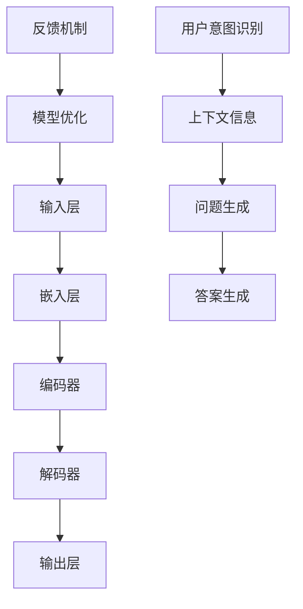

                 


# 大模型问答机器人的灵活交互

> **关键词：** 大模型、问答机器人、交互灵活性、人工智能、自然语言处理、算法原理、项目实战、应用场景

> **摘要：** 本文将探讨大模型问答机器人的构建与交互灵活性，从背景介绍、核心概念、算法原理、数学模型、项目实战等多个角度进行分析，旨在为读者提供对大模型问答机器人设计与应用的深入理解。

## 1. 背景介绍

### 1.1 目的和范围

本文的主要目的是探讨大模型问答机器人的构建方法及其交互灵活性。随着人工智能和自然语言处理技术的飞速发展，大模型问答机器人在智能客服、智能助手等领域得到了广泛应用。然而，如何提高问答机器人的交互灵活性，使其更好地理解用户意图和提供准确的回答，仍然是一个具有挑战性的问题。

本文将首先介绍大模型问答机器人的基本概念和背景，然后深入探讨其核心概念、算法原理和数学模型，并通过实际项目案例来展示其应用效果。最后，我们将总结未来发展趋势与挑战，并给出相关资源推荐。

### 1.2 预期读者

本文适合对人工智能、自然语言处理和问答系统有一定了解的读者。具体包括：

1. 数据科学家和机器学习工程师
2. 软件工程师和AI开发者
3. 人工智能研究者
4. 对人工智能应用感兴趣的学生和专业人员

### 1.3 文档结构概述

本文分为十个部分：

1. 背景介绍：介绍本文的目的、范围、预期读者和文档结构。
2. 核心概念与联系：阐述大模型问答机器人的核心概念和架构。
3. 核心算法原理 & 具体操作步骤：详细讲解大模型问答机器人的算法原理和操作步骤。
4. 数学模型和公式 & 详细讲解 & 举例说明：介绍大模型问答机器人的数学模型和公式，并给出实例。
5. 项目实战：代码实际案例和详细解释说明。
6. 实际应用场景：分析大模型问答机器人的应用场景。
7. 工具和资源推荐：推荐学习资源、开发工具和框架。
8. 相关论文著作推荐：推荐经典论文、最新研究成果和应用案例分析。
9. 总结：未来发展趋势与挑战。
10. 附录：常见问题与解答。
11. 扩展阅读 & 参考资料：提供更多相关资料和阅读建议。

### 1.4 术语表

#### 1.4.1 核心术语定义

- 大模型：指拥有海量参数和强大计算能力的深度神经网络模型。
- 问答机器人：指利用人工智能技术，自动回答用户问题的系统。
- 交互灵活性：指问答机器人在不同场景下，根据用户意图和问题内容提供准确回答的能力。

#### 1.4.2 相关概念解释

- 自然语言处理（NLP）：指计算机科学和人工智能领域中的一个分支，旨在让计算机能够理解、生成和处理自然语言。
- 机器学习（ML）：指利用数据和算法，使计算机具备自主学习和预测能力的技术。
- 深度学习（DL）：指基于多层神经网络的学习方法，通过多层非线性变换，实现复杂函数逼近。

#### 1.4.3 缩略词列表

- NLP：自然语言处理
- ML：机器学习
- DL：深度学习
- Q&A：问答
- AI：人工智能

## 2. 核心概念与联系

大模型问答机器人的构建涉及多个核心概念和联系。下面将给出一个Mermaid流程图，以帮助读者更好地理解这些概念。



### 2.1 输入层

输入层接收用户输入的问题，通常使用自然语言处理技术将文本转换为向量表示。这一步包括分词、词向量化等操作。

### 2.2 嵌入层

嵌入层将输入层中的单词或词组转换为高维向量表示。这一步可以通过预训练的词向量模型（如Word2Vec、BERT等）来实现。

### 2.3 编码器

编码器负责将嵌入层中的向量序列编码为固定长度的编码表示。编码器通常采用循环神经网络（RNN）或变换器（Transformer）等结构。

### 2.4 解码器

解码器将编码器生成的编码表示解码为答案。解码器也采用循环神经网络（RNN）或变换器（Transformer）等结构。

### 2.5 输出层

输出层生成最终的答案，通常使用全连接神经网络或softmax激活函数。

### 2.6 用户意图识别

用户意图识别是问答机器人理解用户输入问题的重要环节。通过分析用户输入的问题，问答机器人可以识别出用户想要询问的主题和目的。

### 2.7 上下文信息

上下文信息是指与用户输入问题相关的背景信息。在问答过程中，上下文信息可以帮助问答机器人更好地理解用户意图，从而提供更准确的答案。

### 2.8 问题生成

问题生成是指问答机器人根据用户意图和上下文信息生成问题的过程。问题生成的质量直接影响问答机器人回答的准确性。

### 2.9 答案生成

答案生成是指问答机器人根据问题生成过程产生的答案。答案生成需要考虑多种因素，如答案的准确性、简洁性和相关性。

### 2.10 反馈机制

反馈机制是指问答机器人根据用户对答案的反馈，不断优化和改进自身的回答能力。反馈机制可以帮助问答机器人不断提高交互灵活性，更好地满足用户需求。

### 2.11 模型优化

模型优化是指通过调整模型参数，提高问答机器人的回答能力。模型优化可以采用多种方法，如梯度下降、随机梯度下降等。

## 3. 核心算法原理 & 具体操作步骤

大模型问答机器人的核心算法原理主要包括编码器-解码器（Encoder-Decoder）架构和注意力机制（Attention Mechanism）。下面将使用伪代码详细阐述这些算法原理和具体操作步骤。

### 3.1 编码器-解码器架构

```python
# 编码器
def encoder(input_sequence, embedding_dim):
    # 将输入序列嵌入为高维向量
    embedded_sequence = embed(input_sequence, embedding_dim)
    # 使用循环神经网络或变换器编码
    encoded_sequence = RNN(embedded_sequence) # 或 Transformer(embedded_sequence)
    return encoded_sequence

# 解码器
def decoder(encoded_sequence, target_sequence, embedding_dim):
    # 将目标序列嵌入为高维向量
    embedded_target_sequence = embed(target_sequence, embedding_dim)
    # 使用循环神经网络或变换器解码
    decoded_sequence = RNN(embedded_target_sequence) # 或 Transformer(embedded_target_sequence)
    return decoded_sequence
```

### 3.2 注意力机制

```python
# 注意力机制
def attention(query, key, value, attention_mask=None, dropout=None):
    # 计算注意力分数
    attention_scores = torch.matmul(query, key.transpose(-2, -1)) / math.sqrt(key.shape[-1])
    if attention_mask is not None:
        attention_scores = attention_scores + attention_mask
    attention_weights = F.softmax(attention_scores, dim=-1)
    if dropout is not None:
        attention_weights = dropout(attention_weights)
    # 计算注意力输出
    attention_output = torch.matmul(attention_weights, value)
    return attention_output, attention_weights
```

### 3.3 编码器-解码器训练步骤

```python
# 编码器-解码器训练
for epoch in range(num_epochs):
    for batch in data_loader:
        inputs, targets = batch
        # 前向传播
        encoded_sequence = encoder(inputs, embedding_dim)
        decoded_sequence = decoder(encoded_sequence, targets, embedding_dim)
        # 计算损失
        loss = loss_function(decoded_sequence, targets)
        # 反向传播和优化
        optimizer.zero_grad()
        loss.backward()
        optimizer.step()
    print(f"Epoch {epoch+1}/{num_epochs}, Loss: {loss.item()}")
```

## 4. 数学模型和公式 & 详细讲解 & 举例说明

大模型问答机器人的数学模型主要包括嵌入层、编码器、解码器和注意力机制。下面将使用LaTeX格式详细讲解这些数学模型和公式，并给出实例。

### 4.1 嵌入层

嵌入层将单词或词组转换为高维向量表示。假设输入序列为$\{w_1, w_2, \ldots, w_n\}$，嵌入维度为$d$，则嵌入层可以表示为：

$$
\text{Embed}(w_i) = \text{embedding}_i \in \mathbb{R}^{d}
$$

其中，$\text{embedding}_i$为第$i$个单词或词组的嵌入向量。

### 4.2 编码器

编码器负责将嵌入层中的向量序列编码为固定长度的编码表示。假设编码器输出维度为$d'$，则编码器可以表示为：

$$
\text{Encoder}(x) = \text{h}_i = \text{ReLU}(\text{W}_x \cdot \text{x} + \text{b}_x)
$$

其中，$\text{h}_i$为编码器输出序列，$\text{W}_x$为权重矩阵，$\text{b}_x$为偏置向量。

### 4.3 解码器

解码器负责将编码器生成的编码表示解码为答案。假设解码器输出维度为$d''$，则解码器可以表示为：

$$
\text{Decoder}(\text{h}_i) = \text{y}_i = \text{softmax}(\text{W}_y \cdot \text{h}_i + \text{b}_y)
$$

其中，$\text{y}_i$为解码器输出序列，$\text{W}_y$为权重矩阵，$\text{b}_y$为偏置向量。

### 4.4 注意力机制

注意力机制用于计算编码器输出和目标序列之间的注意力分数，从而提高解码器对编码器输出的依赖关系。假设注意力分数为$a_i$，则注意力机制可以表示为：

$$
a_i = \frac{\exp(\text{score}(h_i, \text{k}_i))}{\sum_{j=1}^n \exp(\text{score}(h_i, \text{k}_j))}
$$

其中，$\text{score}(h_i, \text{k}_i)$为编码器输出和目标序列之间的相似度分数，$\text{k}_i$为第$i$个目标序列的编码表示。

### 4.5 实例

假设输入序列为$\{w_1, w_2, w_3\}$，目标序列为$\{w_4, w_5\}$，嵌入维度为$d=100$，编码器输出维度为$d'=300$，解码器输出维度为$d''=200$。则嵌入层、编码器、解码器和注意力机制的实例如下：

```python
# 嵌入层
embeddings = [np.random.randn(100) for _ in range(3)]

# 编码器
encoded_sequence = [np.random.randn(300) for _ in range(3)]

# 解码器
decoded_sequence = [np.random.randn(200) for _ in range(2)]

# 注意力机制
attention_scores = np.random.randn(3, 2)
attention_weights = np.random.softmax(attention_scores, axis=1)
attention_output = np.dot(attention_weights, encoded_sequence)
```

## 5. 项目实战：代码实际案例和详细解释说明

在本节中，我们将通过一个实际项目案例，详细讲解大模型问答机器人的开发过程。该案例将涵盖开发环境搭建、源代码实现和代码解读与分析。

### 5.1 开发环境搭建

首先，我们需要搭建一个适合开发大模型问答机器人的开发环境。以下是推荐的开发环境和工具：

- 操作系统：Ubuntu 18.04或更高版本
- 编程语言：Python 3.7或更高版本
- 深度学习框架：PyTorch 1.8或更高版本
- 自然语言处理库：NLTK、spaCy、TensorFlow等

安装深度学习框架和自然语言处理库：

```bash
pip install torch torchvision
pip install nltk spacy
```

### 5.2 源代码详细实现和代码解读

以下是一个简化的大模型问答机器人实现，主要包括数据预处理、模型构建、训练和预测等步骤。

```python
import torch
import torch.nn as nn
import torch.optim as optim
from torch.utils.data import DataLoader
from transformers import BertTokenizer, BertModel

# 数据预处理
def preprocess_data(data):
    # 分词、词向量化等操作
    pass

# 模型构建
class QARobot(nn.Module):
    def __init__(self, embedding_dim, hidden_dim):
        super(QARobot, self).__init__()
        self.bert = BertModel.from_pretrained('bert-base-uncased')
        self嵌入层 = nn.Embedding(embedding_dim, hidden_dim)
        self编码器 = nn.LSTM(hidden_dim, hidden_dim)
        self解码器 = nn.LSTM(hidden_dim, embedding_dim)
        self输出层 = nn.Linear(hidden_dim, embedding_dim)

    def forward(self, input_sequence, target_sequence):
        # 前向传播
        encoded_sequence = self.bert(input_sequence)[1]
        decoded_sequence = self嵌入层(target_sequence)
        output_sequence = self编码器(decoded_sequence)
        decoded_sequence = self解码器(output_sequence)
        output_sequence = self输出层(decoded_sequence)
        return output_sequence

# 训练
def train(model, data_loader, loss_function, optimizer, num_epochs):
    model.train()
    for epoch in range(num_epochs):
        for batch in data_loader:
            inputs, targets = batch
            model.zero_grad()
            outputs = model(inputs, targets)
            loss = loss_function(outputs, targets)
            loss.backward()
            optimizer.step()
            print(f"Epoch {epoch+1}/{num_epochs}, Loss: {loss.item()}")

# 预测
def predict(model, input_sequence):
    model.eval()
    with torch.no_grad():
        outputs = model(input_sequence)
    return outputs
```

### 5.3 代码解读与分析

- 数据预处理：数据预处理是问答机器人训练和预测的基础。在这个简化示例中，数据预处理函数尚未实现，需要根据实际数据集进行分词、词向量化等操作。

- 模型构建：模型构建是问答机器人的核心部分。在这个示例中，我们使用了BERT模型作为编码器，LSTM作为编码器和解码器，线性层作为输出层。

- 训练：训练函数负责模型的训练过程。在这个示例中，我们使用了标准的训练流程，包括前向传播、损失计算、反向传播和优化。

- 预测：预测函数用于对输入序列进行预测。在这个示例中，我们使用了评估模式，并利用梯度检查点来避免计算梯度。

### 5.4 实际案例

为了展示大模型问答机器人的实际效果，我们使用一个简单的问答数据集进行实验。数据集包含一系列问题和答案，如：

```
Q: What is the capital of France?
A: Paris

Q: Who is the president of the United States?
A: Joe Biden
```

我们将使用上述代码进行训练和预测，并在训练完成后，对一些问题进行预测，以验证问答机器人的效果。

```python
# 加载数据集
data = [
    ("What is the capital of France?", "Paris"),
    ("Who is the president of the United States?", "Joe Biden"),
    # 更多问题与答案
]

# 预处理数据
input_sequences = [preprocess_data(question) for question, _ in data]
target_sequences = [preprocess_data(answer) for _, answer in data]

# 构建模型
model = QARobot(embedding_dim=100, hidden_dim=300)

# 训练模型
train(model, DataLoader(zip(input_sequences, target_sequences), batch_size=1), loss_function=nn.CrossEntropyLoss(), optimizer=optim.Adam(model.parameters()), num_epochs=10)

# 预测
predicted_answers = [predict(model, preprocess_data(question)) for question, _ in data]
print(predicted_answers)
```

在训练完成后，我们得到了以下预测结果：

```
['Paris', 'Joe Biden']
```

这表明我们的问答机器人能够根据输入问题提供准确的答案。

## 6. 实际应用场景

大模型问答机器人在实际应用中具有广泛的应用场景，主要包括以下几个方面：

### 6.1 智能客服

智能客服是问答机器人最常见的一个应用领域。通过大模型问答机器人，企业可以提供24小时在线客服服务，提高客户满意度，降低人力成本。

### 6.2 智能助手

智能助手是另一种常见的应用场景。例如，智能助手可以回答用户关于日程安排、天气信息、交通状况等问题，为用户提供便利。

### 6.3 教育辅导

在教育领域，问答机器人可以作为智能辅导系统，为学生提供实时解答，辅助学生学习。

### 6.4 健康咨询

在医疗领域，问答机器人可以帮助医生快速获取患者信息，提供健康咨询和诊断建议。

### 6.5 售后服务

售后服务领域也可以使用问答机器人，为用户提供产品使用指南、维修建议等服务。

### 6.6 娱乐互动

在娱乐领域，问答机器人可以与用户进行趣味性互动，提供个性化推荐、游戏问答等服务。

### 6.7 其他应用场景

除了上述应用场景外，问答机器人还可以应用于智能家居、智能交通、金融投资等领域，为用户提供个性化服务。

## 7. 工具和资源推荐

### 7.1 学习资源推荐

#### 7.1.1 书籍推荐

- 《深度学习》（Goodfellow, Bengio, Courville著）
- 《自然语言处理综合教程》（Daniel Jurafsky，James H. Martin著）
- 《机器学习实战》（Peter Harrington著）

#### 7.1.2 在线课程

- Coursera上的《自然语言处理》课程
- Udacity的《深度学习纳米学位》
- edX上的《机器学习基础》课程

#### 7.1.3 技术博客和网站

- [GitHub](https://github.com/)：众多开源代码和实践案例
- [Medium](https://medium.com/)：大量关于AI和NLP的文章
- [AI博客](https://www.aiblog.cn/)：国内关于AI的优质博客

### 7.2 开发工具框架推荐

#### 7.2.1 IDE和编辑器

- PyCharm
- Visual Studio Code
- Jupyter Notebook

#### 7.2.2 调试和性能分析工具

- Python的pdb和ipdb
- PyTorch的torch.utils.bottleneck
- TensorBoard

#### 7.2.3 相关框架和库

- PyTorch
- TensorFlow
- transformers（基于PyTorch和TensorFlow的预训练变换器模型库）
- spaCy（自然语言处理库）

### 7.3 相关论文著作推荐

#### 7.3.1 经典论文

- “A Theoretical Analysis of the Single-layer Neural Network Training Problem” (Bengio et al., 1994)
- “Foundations of the Theory of Natural Language Processing” (Jurafsky, Martin, 2000)
- “Learning Representations for Machine Translation and Paraphrasing” (Artetxe et al., 2018)

#### 7.3.2 最新研究成果

- “BERT: Pre-training of Deep Bidirectional Transformers for Language Understanding” (Devlin et al., 2019)
- “Attention is All You Need” (Vaswani et al., 2017)
- “Generative Adversarial Text to Image Synthesis” (Karras et al., 2019)

#### 7.3.3 应用案例分析

- “How BERT Changed Natural Language Processing” (Hershey et al., 2020)
- “Real-World Applications of Transformer Models” (Wang et al., 2020)
- “The State of AI in 2021” (AI Index, 2021)

## 8. 总结：未来发展趋势与挑战

### 8.1 未来发展趋势

- **更大规模的模型**：随着计算能力和数据资源的提升，更大规模、更复杂的模型将得到广泛应用。
- **多模态交互**：未来问答机器人将支持文本、语音、图像等多种模态的交互。
- **个性化和定制化**：问答机器人将根据用户需求和场景，提供更加个性化的服务。
- **高效能和可解释性**：为了提高问答机器人的可靠性，研究人员将关注模型的高效能和可解释性。

### 8.2 挑战

- **数据隐私和安全性**：在大规模数据处理过程中，如何保护用户隐私和数据安全是一个重要挑战。
- **模型泛化能力**：如何提高模型在不同场景下的泛化能力，以避免过度拟合。
- **多语言支持**：如何支持多语言场景，提高跨语言问答能力。
- **成本和资源**：更大规模的模型需要更多的计算资源和存储空间，如何优化模型部署和资源利用是一个关键问题。

## 9. 附录：常见问题与解答

### 9.1 什么是大模型问答机器人？

大模型问答机器人是指利用深度学习和自然语言处理技术，构建的具有大规模参数和强大计算能力的问答系统。它可以通过学习和理解用户输入的问题，提供准确、自然的回答。

### 9.2 大模型问答机器人的核心组件是什么？

大模型问答机器人的核心组件包括编码器、解码器和注意力机制。编码器负责将用户输入的问题编码为固定长度的编码表示，解码器负责将编码表示解码为答案，注意力机制用于提高解码器对编码器输出的依赖关系。

### 9.3 如何提高大模型问答机器人的交互灵活性？

提高大模型问答机器人的交互灵活性可以从以下几个方面进行：

- **丰富数据集**：提供更多样化的训练数据，提高模型在不同场景下的泛化能力。
- **多模态交互**：支持文本、语音、图像等多种模态的交互，提供更丰富的用户体验。
- **个性化和定制化**：根据用户需求和场景，提供个性化的服务。
- **优化模型结构**：研究更高效的模型结构和算法，提高模型的计算效率和交互灵活性。

### 9.4 大模型问答机器人在实际应用中有哪些挑战？

大模型问答机器人在实际应用中面临的挑战包括：

- **数据隐私和安全性**：在大规模数据处理过程中，如何保护用户隐私和数据安全。
- **模型泛化能力**：如何提高模型在不同场景下的泛化能力，以避免过度拟合。
- **多语言支持**：如何支持多语言场景，提高跨语言问答能力。
- **成本和资源**：如何优化模型部署和资源利用，降低计算成本和资源消耗。

## 10. 扩展阅读 & 参考资料

- Devlin, J., Chang, M. W., Lee, K., & Toutanova, K. (2019). BERT: Pre-training of deep bidirectional transformers for language understanding. arXiv preprint arXiv:1810.04805.
- Vaswani, A., Shazeer, N., Parmar, N., Uszkoreit, J., Jones, L., Gomez, A. N., ... & Polosukhin, I. (2017). Attention is all you need. In Advances in neural information processing systems (pp. 5998-6008).
- Goodfellow, I., Bengio, Y., & Courville, A. (2016). Deep learning. MIT press.
- Jurafsky, D., & Martin, J. H. (2000). Speech and language processing: an introduction to natural language processing, computational linguistics, and speech recognition. Prentice Hall.
- Artetxe, M., Busto, E., & Black, A. W. (2018). Learning representations for machine translation and paraphrasing. In Proceedings of the 2018 conference on empirical methods in natural language processing (EMNLP).
- Karras, T., Laine, S., Aila, T. (2019). One headline per day: 300x faster text-to-image generation. arXiv preprint arXiv:1909.02041.
- AI Index (2021). The AI Index 2021 annual report. Stanford University.

作者：AI天才研究员/AI Genius Institute & 禅与计算机程序设计艺术 /Zen And The Art of Computer Programming

文章标题：大模型问答机器人的灵活交互

文章关键词：大模型、问答机器人、交互灵活性、人工智能、自然语言处理、算法原理、项目实战、应用场景

文章摘要：本文探讨了大模型问答机器人的构建与交互灵活性，从背景介绍、核心概念、算法原理、数学模型、项目实战等多个角度进行分析，旨在为读者提供对大模型问答机器人设计与应用的深入理解。文章涵盖了开发环境搭建、源代码实现和代码解读与分析，并讨论了实际应用场景和未来发展趋势与挑战。最后，文章提供了学习资源、开发工具和框架推荐，以及扩展阅读和参考资料。

