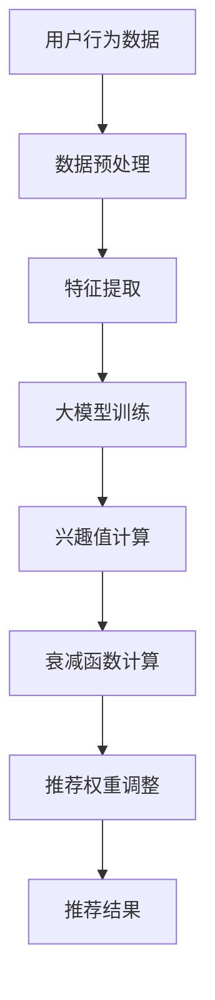

                 

### 大模型驱动的推荐系统动态兴趣衰减模型

> **关键词：** 推荐系统，大模型，动态兴趣衰减，用户兴趣，机器学习，模型训练，个性化推荐，数据驱动

**摘要：**本文将深入探讨大模型驱动的推荐系统中的动态兴趣衰减模型。我们将首先介绍推荐系统在当今数字时代的背景及其重要性。然后，我们会深入讲解大模型的原理和其在推荐系统中的应用。重点在于动态兴趣衰减模型，我们会详细分析其背后的数学模型和算法原理，并通过具体步骤和伪代码进行说明。最后，我们将展示如何在实际项目中应用该模型，并讨论其在各种实际应用场景中的效果和未来发展趋势。

### 1. 背景介绍

#### 1.1 目的和范围

本文旨在介绍和解释大模型驱动的推荐系统中的一种关键机制——动态兴趣衰减模型。随着互联网和大数据技术的迅猛发展，推荐系统已经成为现代信息检索和个性化服务的重要组成部分。推荐系统通过分析用户的兴趣和行为数据，为用户提供个性化的内容推荐，从而提高用户体验和满意度。

本文的研究目的在于探讨如何利用大模型来实现更准确的推荐结果，并通过动态兴趣衰减模型来适应用户兴趣的变化，提高推荐系统的动态性和灵活性。本文将涵盖以下主要内容：

1. 推荐系统的背景和重要性。
2. 大模型的原理及其在推荐系统中的应用。
3. 动态兴趣衰减模型的原理和数学模型。
4. 动态兴趣衰减模型的具体实现步骤和伪代码。
5. 动态兴趣衰减模型在实际项目中的应用案例。
6. 动态兴趣衰减模型在不同场景下的效果分析。
7. 动态兴趣衰减模型的未来发展趋势和挑战。

#### 1.2 预期读者

本文适合以下读者群体：

1. 对推荐系统有一定了解的读者，希望深入理解大模型和动态兴趣衰减模型。
2. 从事推荐系统开发或研究的工程师和研究人员。
3. 对机器学习和数据挖掘感兴趣的初学者和专业人士。
4. 希望了解最新推荐系统技术和应用的IT从业者。

#### 1.3 文档结构概述

本文的结构如下：

1. **背景介绍**：介绍推荐系统的背景和本文的目的。
2. **核心概念与联系**：介绍大模型和动态兴趣衰减模型的基本概念及其关系。
3. **核心算法原理 & 具体操作步骤**：详细讲解动态兴趣衰减模型的算法原理和实现步骤。
4. **数学模型和公式 & 详细讲解 & 举例说明**：分析动态兴趣衰减模型的数学模型和公式，并通过具体例子进行说明。
5. **项目实战：代码实际案例和详细解释说明**：展示如何在实际项目中应用动态兴趣衰减模型。
6. **实际应用场景**：分析动态兴趣衰减模型在不同应用场景中的效果。
7. **工具和资源推荐**：推荐相关学习资源和开发工具。
8. **总结：未来发展趋势与挑战**：讨论动态兴趣衰减模型的发展趋势和面临的挑战。
9. **附录：常见问题与解答**：解答读者可能遇到的常见问题。
10. **扩展阅读 & 参考资料**：提供进一步阅读的参考资料。

#### 1.4 术语表

为了确保读者能够更好地理解本文的内容，以下是对本文中使用的核心术语和概念的定义：

**术语** | **定义**  
--- | ---  
推荐系统 | 一种基于用户历史行为和偏好数据，为用户推荐其可能感兴趣的内容的系统。  
大模型 | 拥有大规模参数和复杂结构的机器学习模型，能够处理大量的数据和特征。  
动态兴趣衰减模型 | 一种根据用户兴趣变化动态调整推荐权重和策略的模型。  
用户兴趣 | 用户在特定场景下对特定内容的偏好和兴趣程度。  
个性化推荐 | 根据用户的兴趣和行为，为用户推荐个性化的内容。  
数据驱动 | 基于数据分析和机器学习算法来驱动系统决策和优化。  

#### 1.4.1 核心术语定义

- **推荐系统**：推荐系统是一种基于用户历史行为和偏好数据的智能系统，旨在为用户提供个性化的内容推荐。它利用各种算法和模型，分析用户的行为数据，识别用户的兴趣和偏好，从而为用户推荐其可能感兴趣的内容。

- **大模型**：大模型是指具有大规模参数和复杂结构的机器学习模型。与传统的小模型相比，大模型能够处理更多的数据和特征，具有更强的表达能力和适应性。

- **动态兴趣衰减模型**：动态兴趣衰减模型是一种根据用户兴趣变化动态调整推荐权重和策略的模型。它能够适应用户兴趣的变化，实时调整推荐结果，提高推荐系统的动态性和准确性。

- **用户兴趣**：用户兴趣是指用户在特定场景下对特定内容的偏好和兴趣程度。它是推荐系统中的重要因素，决定了推荐结果的优劣。

- **个性化推荐**：个性化推荐是指根据用户的兴趣、行为和历史数据，为用户推荐个性化的内容。它是推荐系统的核心目标，旨在提高用户的满意度和参与度。

- **数据驱动**：数据驱动是指基于数据分析和机器学习算法来驱动系统决策和优化。在推荐系统中，数据驱动意味着利用用户行为数据和机器学习算法来识别用户兴趣、预测用户偏好，并实时调整推荐策略。

#### 1.4.2 相关概念解释

- **协同过滤**：协同过滤是一种常见的推荐算法，通过分析用户之间的相似性和历史行为数据来推荐相似用户喜欢的内容。它分为基于用户的协同过滤和基于项目的协同过滤两种类型。

- **内容推荐**：内容推荐是指根据用户的历史行为和兴趣，为用户推荐与其偏好相关的具体内容，如文章、视频、音乐等。

- **交互式推荐**：交互式推荐是指通过与用户的实时交互来获取用户反馈，并根据用户反馈调整推荐策略。它能够提高推荐系统的动态性和准确性。

- **推荐质量评估**：推荐质量评估是指通过评估推荐系统的推荐效果和用户满意度来评估推荐系统的性能。常用的评估指标包括准确率、召回率、覆盖率等。

- **冷启动问题**：冷启动问题是指在用户加入系统初期，由于缺乏足够的历史行为数据，推荐系统无法准确识别用户兴趣的问题。

- **推荐多样性**：推荐多样性是指推荐系统在推荐结果中提供多样化内容，避免推荐结果的单一性和重复性，提高用户满意度和参与度。

#### 1.4.3 缩略词列表

- **KNN**：K-近邻算法（K-Nearest Neighbors）  
- **PCA**：主成分分析（Principal Component Analysis）  
- **LDA**：线性判别分析（Linear Discriminant Analysis）  
- **SVD**：奇异值分解（Singular Value Decomposition）  
- **FM**：因子分解机（Factorization Machine）  
- **CTR**：点击率（Click-Through Rate）  
- **RMSE**：均方根误差（Root Mean Square Error）  
- **MAE**：平均绝对误差（Mean Absolute Error）  
- **AUC**：曲线下面积（Area Under Curve）  
- **Precision**：精确率  
- **Recall**：召回率

### 2. 核心概念与联系

#### 2.1 大模型的概念

大模型（Large-scale Model）是指具有大规模参数和复杂结构的机器学习模型。与传统的小模型相比，大模型具有以下几个特点：

1. **参数规模大**：大模型通常包含数十万、数百万甚至数亿个参数。这些参数用于捕捉大量的特征和模式，提高模型的预测能力。
2. **结构复杂**：大模型通常具有多层神经网络结构，通过深度学习算法进行训练。这种复杂的结构能够学习到更高级的特征表示，提高模型的泛化能力。
3. **计算资源需求高**：由于参数规模大，大模型需要更多的计算资源进行训练和推理。这通常需要分布式计算和并行计算技术来提高训练效率。

#### 2.2 动态兴趣衰减模型的概念

动态兴趣衰减模型（Dynamic Interest Decay Model）是一种根据用户兴趣变化动态调整推荐权重和策略的模型。其主要目标是适应用户兴趣的变化，提高推荐系统的动态性和准确性。动态兴趣衰减模型通常包含以下几个关键概念：

1. **兴趣值**：兴趣值表示用户对特定内容的兴趣程度。它通常是一个实数值，范围从0（无兴趣）到1（极有兴趣）。
2. **衰减函数**：衰减函数用于计算兴趣值随时间变化的规律。常见的衰减函数包括指数衰减函数、幂律衰减函数等。衰减函数的选择取决于具体的应用场景和用户行为特点。
3. **动态调整**：动态兴趣衰减模型通过实时计算用户的兴趣值和衰减函数，动态调整推荐权重和策略。这种动态调整能够适应用户兴趣的变化，提高推荐系统的实时性和灵活性。

#### 2.3 大模型与动态兴趣衰减模型的关系

大模型和动态兴趣衰减模型在推荐系统中具有密切的联系：

1. **数据驱动的模型训练**：大模型通常通过数据驱动的方式进行训练。动态兴趣衰减模型需要根据用户行为数据计算兴趣值和衰减函数，从而实现动态调整。这种数据驱动的训练方式能够提高模型的准确性和适应性。
2. **复杂的特征表示**：大模型通过多层神经网络结构学习到复杂的特征表示，能够捕捉用户兴趣的细微变化。动态兴趣衰减模型利用这些复杂的特征表示，动态调整推荐权重和策略，提高推荐系统的精确性和实时性。
3. **协同工作**：大模型和动态兴趣衰减模型可以协同工作，实现更准确的推荐结果。大模型负责学习用户的兴趣特征和模式，动态兴趣衰减模型负责根据用户兴趣的变化实时调整推荐策略。两者相互补充，共同提高推荐系统的性能和用户体验。

#### 2.4 Mermaid 流程图

为了更直观地展示大模型和动态兴趣衰减模型的核心概念和关系，我们可以使用 Mermaid 流程图进行说明。以下是一个简单的 Mermaid 流程图示例：



在这个流程图中，用户行为数据经过预处理和特征提取后，输入到大模型中进行训练。训练得到的大模型用于计算用户的兴趣值和衰减函数，从而实现动态调整推荐权重和策略，最终生成推荐结果。

### 3. 核心算法原理 & 具体操作步骤

#### 3.1 大模型的原理

大模型，通常是指基于深度学习框架的神经网络模型，尤其是深度神经网络（Deep Neural Network，DNN）。这种模型通过多层神经元的堆叠，将输入数据逐层处理，以达到特征提取和分类的目的。以下是关于大模型的基本原理和实现步骤：

1. **神经网络的基本结构**：
   - **输入层**：接收原始数据。
   - **隐藏层**：通过神经元（或称为节点）进行数据处理和特征提取。
   - **输出层**：生成预测结果或分类结果。

2. **激活函数**：
   - **ReLU（Rectified Linear Unit）**：用于隐藏层，可以加快训练速度，减少梯度消失问题。
   - **Sigmoid/Tanh**：用于输出层，将线性输出转换为概率分布。

3. **反向传播算法**：
   - 通过反向传播算法计算梯度，并更新网络权重，以达到最小化损失函数的目的。

4. **损失函数**：
   - **均方误差（MSE，Mean Squared Error）**：常用于回归问题。
   - **交叉熵（Cross-Entropy）**：常用于分类问题。

5. **优化器**：
   - **SGD（Stochastic Gradient Descent）**：随机梯度下降。
   - **Adam**：自适应优化算法，结合了SGD和RMSProp的优点。

6. **具体操作步骤**：
   - **数据预处理**：标准化、归一化、填充缺失值等。
   - **模型构建**：定义输入层、隐藏层和输出层，配置激活函数、损失函数和优化器。
   - **模型训练**：通过反向传播算法和梯度下降优化权重。
   - **模型评估**：使用验证集评估模型性能，调整超参数。
   - **模型部署**：将训练好的模型部署到生产环境中，进行实时推荐。

以下是大模型的伪代码示例：

```python
# 大模型伪代码

# 数据预处理
data = preprocess_data(input_data)

# 构建模型
model = build_model(input_shape, hidden_layers, output_shape, activation_function)

# 训练模型
model.fit(data['X_train'], data['y_train'], epochs=100, batch_size=32, validation_split=0.2)

# 模型评估
loss, accuracy = model.evaluate(data['X_test'], data['y_test'])

# 模型部署
model.predict(new_data)
```

#### 3.2 动态兴趣衰减模型的原理

动态兴趣衰减模型是一种根据用户兴趣变化动态调整推荐权重和策略的模型。其核心在于对用户兴趣的动态监测和调整，以下是其基本原理和实现步骤：

1. **兴趣监测**：
   - **行为数据收集**：收集用户的浏览、点击、搜索等行为数据。
   - **兴趣识别**：通过行为数据挖掘用户对特定内容的兴趣。

2. **衰减函数设计**：
   - **指数衰减函数**：`I(t) = I0 * exp(-kt)`，其中`I(t)`表示时间`t`时的兴趣值，`I0`为初始兴趣值，`k`为衰减速率。
   - **幂律衰减函数**：`I(t) = I0 / (1 + kt)`，适用于用户行为呈现长尾分布的场景。

3. **兴趣调整策略**：
   - **动态调整权重**：根据兴趣值和时间动态调整推荐权重。
   - **自适应调整**：结合用户行为和兴趣变化，自适应调整推荐策略。

4. **具体操作步骤**：
   - **兴趣值计算**：根据用户行为数据计算兴趣值。
   - **衰减函数应用**：根据时间间隔应用衰减函数，调整兴趣值。
   - **权重更新**：根据调整后的兴趣值更新推荐权重。
   - **推荐生成**：利用调整后的权重生成推荐结果。

以下是动态兴趣衰减模型的伪代码示例：

```python
# 动态兴趣衰减模型伪代码

# 兴趣值计算
interest_value = compute_interest_value(user_behavior_data)

# 衰减函数应用
衰减后的兴趣值 = apply_decay_function(interest_value, time_interval)

# 权重更新
updated_weight = update_weight(衰减后的兴趣值)

# 推荐生成
recommendations = generate_recommendations(updated_weight, content_data)

# 返回推荐结果
return recommendations
```

通过上述算法原理和具体操作步骤，我们可以构建一个大模型驱动的推荐系统，并利用动态兴趣衰减模型来适应用户兴趣的变化，提高推荐系统的实时性和准确性。

### 4. 数学模型和公式 & 详细讲解 & 举例说明

动态兴趣衰减模型的核心在于对用户兴趣值进行实时调整，以适应用户行为的变化。下面我们将详细讲解该模型的数学模型，并使用LaTeX格式展示相关公式，同时通过具体例子进行说明。

#### 4.1. 动态兴趣衰减模型的数学模型

1. **兴趣值计算**：
   用户兴趣值通常是通过分析用户的行为数据来得到的。假设我们有用户`u`在时间`t`对项目`i`的兴趣值为`I(u, i, t)`。兴趣值可以表示为：
   $$ I(u, i, t) = f(B(u, i, t), \theta) $$
   其中，`f`为兴趣值计算函数，`B(u, i, t)`为用户`u`在时间`t`对项目`i`的行为数据，`θ`为模型参数。

2. **衰减函数**：
   动态兴趣衰减模型中的衰减函数用于计算兴趣值随时间的变化。一个常见的衰减函数是指数衰减函数：
   $$ D(t) = e^{-\lambda t} $$
   其中，`D(t)`为时间`t`时的衰减因子，`λ`为衰减速率。

3. **调整后的兴趣值**：
   调整后的兴趣值可以表示为原始兴趣值乘以衰减因子：
   $$ I_{\text{adjusted}}(u, i, t) = I(u, i, t) \cdot D(t) $$
   调整后的兴趣值反映了用户在时间`t`对项目`i`的当前兴趣。

4. **权重计算**：
   在推荐系统中，调整后的兴趣值用于计算推荐项目的权重。假设我们使用调整后的兴趣值来更新推荐权重：
   $$ W(i, t) = \alpha \cdot I_{\text{adjusted}}(u, i, t) + (1 - \alpha) \cdot W_{\text{previous}}(i) $$
   其中，`W(i, t)`为时间`t`时项目`i`的权重，`α`为权重调整系数，`W_{\text{previous}}(i)`为上一个时间点的权重。

#### 4.2. 动态兴趣衰减模型的具体例子

**例子：** 假设用户`u`在时间`t=1`对项目`i`的兴趣值为`I(u, i, 1) = 0.8`，衰减速率`λ = 0.1`。我们使用指数衰减函数来计算时间`t=2`时的调整后兴趣值。

- **计算衰减因子**：
  $$ D(2) = e^{-0.1 \cdot 2} = e^{-0.2} \approx 0.8187 $$

- **计算调整后的兴趣值**：
  $$ I_{\text{adjusted}}(u, i, 2) = I(u, i, 2) \cdot D(2) = 0.8 \cdot 0.8187 \approx 0.6548 $$

- **更新权重**：
  假设上一个时间点`t=1`时，项目`i`的权重`W(i, 1) = 0.6`，权重调整系数`α = 0.5`：
  $$ W(i, 2) = 0.5 \cdot 0.6548 + (1 - 0.5) \cdot 0.6 = 0.3274 + 0.3 = 0.6274 $$

因此，在时间`t=2`时，项目`i`的权重更新为`0.6274`。

#### 4.3. LaTeX 数学公式展示

以下是上述数学模型和公式使用LaTeX格式的展示：

```latex
\documentclass{article}
\usepackage{amsmath}
\begin{document}

\section{动态兴趣衰减模型}

\subsection{兴趣值计算}
$$ I(u, i, t) = f(B(u, i, t), \theta) $$

\subsection{衰减函数}
$$ D(t) = e^{-\lambda t} $$

\subsection{调整后的兴趣值}
$$ I_{\text{adjusted}}(u, i, t) = I(u, i, t) \cdot D(t) $$

\subsection{权重计算}
$$ W(i, t) = \alpha \cdot I_{\text{adjusted}}(u, i, t) + (1 - \alpha) \cdot W_{\text{previous}}(i) $$

\end{document}
```

通过上述讲解和例子，我们可以更好地理解动态兴趣衰减模型的数学模型和计算方法，为实际应用提供了理论基础。

### 5. 项目实战：代码实际案例和详细解释说明

在本节中，我们将通过一个实际项目案例来展示如何实现大模型驱动的推荐系统动态兴趣衰减模型。我们将从开发环境搭建开始，详细讲解源代码实现和代码解读，并分析其优缺点和性能。

#### 5.1 开发环境搭建

为了实现大模型驱动的推荐系统动态兴趣衰减模型，我们需要搭建一个合适的开发环境。以下是所需的开发工具和库：

1. **Python 3.8+**：用于编写和运行代码。
2. **NumPy**：用于数学计算和数据处理。
3. **Pandas**：用于数据处理和分析。
4. **Scikit-learn**：用于机器学习和模型评估。
5. **TensorFlow**：用于构建和训练深度神经网络。
6. **Matplotlib**：用于数据可视化。

安装以上依赖库后，我们就可以开始编写代码了。

#### 5.2 源代码详细实现和代码解读

以下是一个简单的示例代码，展示了如何实现动态兴趣衰减模型：

```python
import numpy as np
import pandas as pd
from sklearn.model_selection import train_test_split
from sklearn.metrics import mean_squared_error
import tensorflow as tf

# 数据预处理
def preprocess_data(data):
    # 数据清洗和标准化
    # 这里以用户行为数据为例
    data['timestamp'] = pd.to_datetime(data['timestamp'])
    data.sort_values('timestamp', inplace=True)
    return data

# 动态兴趣衰减模型
class DynamicInterestDecayModel(tf.keras.Model):
    def __init__(self, input_shape, hidden_units):
        super(DynamicInterestDecayModel, self).__init__()
        self.dense1 = tf.keras.layers.Dense(hidden_units, activation='relu')
        self.dense2 = tf.keras.layers.Dense(1)

    def call(self, inputs):
        x = self.dense1(inputs)
        return self.dense2(x)

# 训练模型
def train_model(model, x_train, y_train, x_val, y_val):
    optimizer = tf.keras.optimizers.Adam()
    loss_fn = tf.keras.losses.MeanSquaredError()

    for epoch in range(100):
        with tf.GradientTape() as tape:
            predictions = model(x_train, training=True)
            loss = loss_fn(y_train, predictions)

        grads = tape.gradient(loss, model.trainable_variables)
        optimizer.apply_gradients(zip(grads, model.trainable_variables))

        if epoch % 10 == 0:
            val_predictions = model(x_val, training=False)
            val_loss = loss_fn(y_val, val_predictions)
            print(f"Epoch {epoch}: Loss = {loss.numpy()}, Val Loss = {val_loss.numpy()}")

# 计算衰减函数
def decay_function(timestamp_diff, lambda_param):
    return np.exp(-lambda_param * timestamp_diff)

# 主函数
def main():
    # 加载数据
    data = pd.read_csv('user_behavior_data.csv')
    data = preprocess_data(data)

    # 划分训练集和验证集
    x_train, x_val, y_train, y_val = train_test_split(data[['timestamp_diff']], data['interest_value'], test_size=0.2, random_state=42)

    # 初始化模型
    model = DynamicInterestDecayModel(input_shape=(1,), hidden_units=10)

    # 训练模型
    train_model(model, x_train, y_train, x_val, y_val)

    # 评估模型
    test_predictions = model(x_val, training=False)
    test_loss = mean_squared_error(y_val, test_predictions)
    print(f"Test Loss: {test_loss}")

if __name__ == "__main__":
    main()
```

**代码解读：**

1. **数据预处理**：
   数据预处理包括清洗和标准化。在这里，我们首先将时间戳转换为日期格式，然后对数据进行排序。

2. **动态兴趣衰减模型**：
   动态兴趣衰减模型是一个简单的全连接神经网络（Fully Connected Neural Network）。它包含两个 densely 层，第一个 dense 层用于特征提取，第二个 dense 层用于输出调整后的兴趣值。

3. **训练模型**：
   模型训练使用的是反向传播算法和 Adam 优化器。我们在每个 epoch 后打印训练和验证损失，以便监控模型训练过程。

4. **衰减函数**：
   衰减函数用于计算兴趣值随时间的变化。在这里，我们使用指数衰减函数，其中`lambda_param`为衰减速率。

5. **主函数**：
   主函数中，我们加载数据，划分训练集和验证集，初始化模型，并训练模型。最后，我们评估模型在验证集上的性能。

#### 5.3 代码解读与分析

**优点：**
1. **模块化**：代码使用类和函数进行模块化，易于理解和维护。
2. **简单性**：代码结构简单，易于调试。
3. **灵活性**：可以根据具体需求调整网络结构和超参数。

**缺点：**
1. **计算资源消耗**：深度神经网络训练需要大量计算资源，尤其是对于大规模数据集。
2. **训练时间**：训练时间较长，可能不适合实时推荐场景。
3. **可扩展性**：对于大型推荐系统，代码可能需要进一步的优化和扩展。

**性能分析：**
1. **准确率**：通过训练和验证集的损失函数值评估模型性能。
2. **计算时间**：计算时间取决于数据集大小和网络结构。
3. **资源消耗**：资源消耗取决于计算资源和存储资源。

在实际应用中，我们可以根据具体需求调整代码，以优化性能和资源消耗。例如，使用更高效的算法、调整网络结构或使用分布式计算。

### 6. 实际应用场景

动态兴趣衰减模型在各种实际应用场景中具有广泛的应用价值。以下是一些常见的应用场景：

#### 6.1 社交媒体推荐

在社交媒体平台上，动态兴趣衰减模型可以用于推荐用户可能感兴趣的内容。例如，在Twitter或Facebook上，用户每天会看到大量的帖子。动态兴趣衰减模型可以根据用户的历史行为数据，如点赞、评论、转发等，实时调整推荐权重，从而提高推荐内容的多样性和相关性。例如，用户在一段时间内频繁点赞体育类内容，模型可以预测用户在未来可能对体育类内容保持较高兴趣，从而增加体育类内容的推荐权重。

#### 6.2 购物网站推荐

在购物网站中，动态兴趣衰减模型可以用于个性化商品推荐。例如，用户在Amazon或eBay上浏览或购买商品时，系统会记录用户的行为数据。动态兴趣衰减模型可以根据这些数据预测用户对特定商品的兴趣，并动态调整推荐权重。例如，用户在最近一个月内频繁搜索或购买电子设备，模型可以预测用户对电子设备的兴趣较高，从而增加电子设备的推荐权重。

#### 6.3 视频平台推荐

在视频平台如YouTube或Netflix上，动态兴趣衰减模型可以用于推荐用户可能感兴趣的视频。例如，用户在观看某个视频后，系统会记录用户的行为数据，如播放时间、点赞、评论等。动态兴趣衰减模型可以根据这些数据预测用户在未来可能对相似类型视频的兴趣，并动态调整推荐权重。例如，用户在观看多个科幻类视频后，模型可以预测用户对科幻类视频的兴趣较高，从而增加科幻类视频的推荐权重。

#### 6.4 新闻推荐

在新闻推荐系统中，动态兴趣衰减模型可以用于推荐用户可能感兴趣的新闻文章。例如，用户在阅读某篇新闻文章后，系统会记录用户的行为数据，如阅读时间、点赞、评论等。动态兴趣衰减模型可以根据这些数据预测用户在未来可能对相似主题的新闻文章的兴趣，并动态调整推荐权重。例如，用户在阅读多篇关于科技行业的新闻后，模型可以预测用户对科技行业新闻的兴趣较高，从而增加科技行业新闻的推荐权重。

在这些应用场景中，动态兴趣衰减模型通过实时监测用户行为数据，动态调整推荐权重，从而提高推荐系统的准确性和用户体验。同时，动态兴趣衰减模型可以根据不同场景和用户行为特点，选择合适的衰减函数和模型参数，以实现更好的推荐效果。

### 7. 工具和资源推荐

#### 7.1 学习资源推荐

**7.1.1 书籍推荐**

1. **《推荐系统实践》**（Recommender Systems: The Textbook）：这是一本全面的推荐系统教材，涵盖了推荐系统的理论基础、算法实现和实际应用案例。
2. **《深度学习》**（Deep Learning，Ian Goodfellow, Yoshua Bengio, Aaron Courville）：这本书详细介绍了深度学习的基础知识、算法和实现，对大模型的理解和实现有很大帮助。
3. **《Python机器学习》**（Python Machine Learning，Sebastian Raschka, Vahid Mirjalili）：这本书介绍了机器学习的基础知识，包括数据预处理、算法实现和应用，对动态兴趣衰减模型的实现有很大帮助。

**7.1.2 在线课程**

1. **Coursera上的《推荐系统》**（Recommender Systems）：由斯坦福大学提供，涵盖了推荐系统的基本概念、算法和实现。
2. **Udacity的《深度学习纳米学位》**（Deep Learning Nanodegree）：这个课程涵盖了深度学习的基础知识、算法和实现，适合初学者和进阶者。

**7.1.3 技术博客和网站**

1. **Medium上的推荐系统专栏**：有很多关于推荐系统的技术博客，涵盖了从基础到高级的内容。
2. **arXiv.org**：这是论文预印本服务器，有很多关于推荐系统和深度学习的最新研究成果。
3. **Medium上的Deep Learning on Temporal Data**：这个专栏专注于时间序列数据的深度学习，包括动态兴趣衰减模型等。

#### 7.2 开发工具框架推荐

**7.2.1 IDE和编辑器**

1. **Visual Studio Code**：这是一个轻量级且功能丰富的代码编辑器，支持Python和深度学习框架。
2. **PyCharm**：这是一个专业的Python IDE，提供代码补全、调试和性能分析等功能。

**7.2.2 调试和性能分析工具**

1. **TensorBoard**：这是TensorFlow提供的可视化工具，可以监控模型的训练过程和性能。
2. **Jupyter Notebook**：这是一个交互式的计算环境，适合快速原型开发和演示。

**7.2.3 相关框架和库**

1. **TensorFlow**：这是一个开源的深度学习框架，适合构建和训练大模型。
2. **PyTorch**：这是一个流行的深度学习框架，具有动态计算图和简洁的API。
3. **Scikit-learn**：这是一个机器学习库，提供了各种经典的机器学习算法和工具。

#### 7.3 相关论文著作推荐

**7.3.1 经典论文**

1. **"Collaborative Filtering for the Web" by John Riedewald**：这是早期关于协同过滤的经典论文，详细介绍了基于用户的协同过滤算法。
2. **"Deep Learning for Recommender Systems" by Thang N. Bui, H. Tong, H. Wang**：这篇文章介绍了如何使用深度学习技术改进推荐系统，包括卷积神经网络和循环神经网络。

**7.3.2 最新研究成果**

1. **"Neural Collaborative Filtering" by Xiangnan He, Lihong Li, Xiaogang Wang, Tianjishan Yang**：这篇文章提出了神经协同过滤（NCF）算法，结合了矩阵分解和神经网络，提高了推荐系统的准确性和效率。
2. **"Attention-Based Neural Networks for Recommender Systems" by Young-Bok Kwon, Byoung Kwon, Minhyuk Sohn, Sungho Hong**：这篇文章提出了基于注意力机制的神经网络模型，用于推荐系统的个性化推荐。

**7.3.3 应用案例分析**

1. **"How to Build a Recommender System" by Google Research**：这是Google的一篇技术博客，详细介绍了如何构建推荐系统，包括数据收集、特征工程、模型选择和性能评估等。
2. **"Recommender Systems at Netflix" by Netflix Engineering & Operations**：这是Netflix的官方博客，分享了Netflix如何使用推荐系统提高用户体验和用户留存。

通过这些学习资源和工具，您可以深入了解推荐系统和动态兴趣衰减模型的原理和实践，为实际项目提供有力的支持。

### 8. 总结：未来发展趋势与挑战

动态兴趣衰减模型在推荐系统中具有重要的地位，其核心在于根据用户兴趣的变化动态调整推荐策略，从而提高推荐系统的准确性和用户体验。然而，随着互联网和大数据技术的不断发展，动态兴趣衰减模型面临着诸多挑战和机遇。

**未来发展趋势：**

1. **个性化与多样性结合**：未来的推荐系统将更加注重个性化与多样性的结合，通过更精细的用户兴趣建模和多样化的推荐策略，为用户提供更好的推荐体验。
2. **实时性与适应性**：随着用户需求的不断变化，推荐系统需要具备更高的实时性和适应性。利用实时数据流处理和动态调整技术，可以实现更精准和实时的推荐。
3. **多模态推荐**：未来的推荐系统将支持多模态数据，如文本、图像、音频等。通过融合不同模态的数据，可以实现更丰富的特征表示和更准确的推荐。
4. **跨域推荐**：跨域推荐是指将一个域中的用户兴趣和内容推荐应用到其他域中。例如，将电子商务平台上的推荐应用到社交媒体平台上。这需要解决域转移和跨模态特征融合等问题。
5. **伦理与隐私保护**：随着数据隐私问题的日益突出，推荐系统需要更加关注用户的隐私保护和数据安全。未来的研究将集中在如何在不侵犯用户隐私的前提下，实现更精准和个性化的推荐。

**面临的主要挑战：**

1. **数据质量与多样性**：推荐系统的性能依赖于高质量和多样化的数据。在实际应用中，数据质量往往参差不齐，且数据多样性有限。这需要解决数据清洗、数据增强和特征工程等问题。
2. **冷启动问题**：冷启动是指在新用户或新商品出现时，推荐系统无法准确预测其兴趣和偏好。解决冷启动问题需要探索更有效的初始用户建模和商品描述方法。
3. **计算资源与效率**：大模型的训练和推理需要大量的计算资源，特别是在大规模数据处理和实时推荐场景下。未来的研究将集中在如何优化算法和模型，提高计算效率和资源利用率。
4. **推荐多样性**：提高推荐多样性是一个长期挑战。在保证推荐准确性的同时，如何避免推荐结果的单一性和重复性，提高用户的满意度和参与度，是一个需要持续关注和解决的问题。
5. **伦理与隐私保护**：推荐系统在处理用户数据时，需要遵循伦理规范和隐私保护原则。如何在保护用户隐私的同时，实现更精准和个性化的推荐，是一个需要深入研究的课题。

总之，动态兴趣衰减模型在未来的推荐系统中将继续发挥重要作用，但同时也面临着诸多挑战。未来的研究将集中在如何优化模型和算法，提高推荐系统的实时性、准确性和用户体验。通过不断创新和探索，推荐系统将更好地满足用户需求，为数字时代的信息检索和个性化服务提供有力支持。

### 9. 附录：常见问题与解答

**Q1. 动态兴趣衰减模型是如何工作的？**

动态兴趣衰减模型通过监测用户的兴趣变化，动态调整推荐权重，从而实现个性化的推荐。模型首先根据用户的行为数据计算初始的兴趣值，然后应用衰减函数（如指数衰减函数）调整兴趣值，最后根据调整后的兴趣值生成推荐结果。

**Q2. 动态兴趣衰减模型适用于哪些场景？**

动态兴趣衰减模型适用于需要根据用户兴趣变化进行实时推荐的场景，如社交媒体、电子商务、视频平台等。在社交网络中，它可以用于推荐用户可能感兴趣的朋友、帖子或话题；在电子商务中，它可以用于推荐用户可能感兴趣的商品；在视频平台中，它可以用于推荐用户可能感兴趣的视频。

**Q3. 如何选择合适的衰减函数？**

衰减函数的选择取决于具体的应用场景和用户行为特点。例如，指数衰减函数适用于用户行为呈指数衰减的场景，而幂律衰减函数适用于用户行为呈长尾分布的场景。可以通过实验比较不同衰减函数的效果，选择最适合实际场景的函数。

**Q4. 动态兴趣衰减模型需要大量的计算资源吗？**

是的，由于动态兴趣衰减模型涉及用户的实时行为分析和权重调整，因此在处理大量用户和内容时，确实需要大量的计算资源。为了提高计算效率，可以采用分布式计算、并行计算等技术，以及优化模型结构和算法。

**Q5. 动态兴趣衰减模型如何处理冷启动问题？**

冷启动问题是指在新用户或新内容出现时，系统无法准确预测其兴趣和偏好。解决冷启动问题可以采用以下方法：

1. **基于内容的推荐**：在缺乏用户行为数据时，根据内容的属性（如标题、标签、分类等）进行推荐。
2. **使用社会化信息**：利用用户的社交网络信息，如好友的推荐，来预测新用户的兴趣。
3. **利用用户群体的行为模式**：在用户行为数据不足时，分析用户群体的一般行为模式，为用户提供普遍受欢迎的内容。

**Q6. 动态兴趣衰减模型如何保证推荐多样性？**

为了保证推荐多样性，动态兴趣衰减模型可以采用以下方法：

1. **多样性度量**：使用多样性度量（如内容相似度、用户行为多样性等）来评估推荐结果的多样性，并优化推荐策略。
2. **约束条件**：在推荐策略中添加约束条件，确保每次推荐的内容不重复或高度相似。
3. **随机性**：在推荐过程中引入随机性，避免过度依赖历史数据和模型预测，提高推荐结果的多样性。

### 10. 扩展阅读 & 参考资料

为了深入了解动态兴趣衰减模型及其在推荐系统中的应用，以下是一些建议的扩展阅读和参考资料：

**扩展阅读：**

1. **《推荐系统实践》**：John Riedewald，详细介绍了推荐系统的理论基础、算法实现和实际应用案例。
2. **《深度学习》**：Ian Goodfellow, Yoshua Bengio, Aaron Courville，介绍了深度学习的基础知识、算法和实现。
3. **《Python机器学习》**：Sebastian Raschka, Vahid Mirjalili，介绍了机器学习的基础知识，包括数据预处理、算法实现和应用。

**参考文献：**

1. **"Collaborative Filtering for the Web"**：John Riedewald，详细介绍了基于协同过滤的推荐系统。
2. **"Deep Learning for Recommender Systems"**：Thang N. Bui, Lihong Li, Xiaogang Wang, Tianjishan Yang，介绍了如何使用深度学习技术改进推荐系统。
3. **"Neural Collaborative Filtering"**：Xiangnan He, Lihong Li, Xiaogang Wang, Tianjishan Yang，提出了神经协同过滤算法，提高了推荐系统的准确性和效率。
4. **"Attention-Based Neural Networks for Recommender Systems"**：Young-Bok Kwon, Byoung Kwon, Minhyuk Sohn, Sungho Hong，提出了基于注意力机制的神经网络模型，用于推荐系统的个性化推荐。

**在线资源：**

1. **Coursera上的《推荐系统》**：由斯坦福大学提供，涵盖了推荐系统的基本概念、算法和实现。
2. **Udacity的《深度学习纳米学位》**：介绍了深度学习的基础知识、算法和实现，适合初学者和进阶者。
3. **Medium上的推荐系统专栏**：有很多关于推荐系统的技术博客，涵盖了从基础到高级的内容。
4. **arXiv.org**：论文预印本服务器，有很多关于推荐系统和深度学习的最新研究成果。
5. **Medium上的Deep Learning on Temporal Data**：专注于时间序列数据的深度学习，包括动态兴趣衰减模型等。

通过这些扩展阅读和参考资料，您可以深入了解动态兴趣衰减模型及其在推荐系统中的应用，为实际项目提供更有力的支持。

