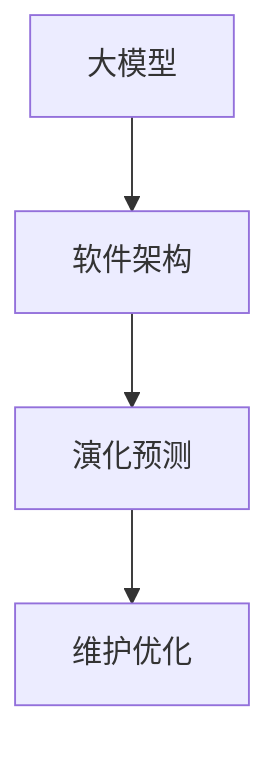

                 


# 大模型驱动的软件架构演化预测

> **关键词：** 大模型，软件架构，演化预测，人工智能，深度学习，算法原理，数学模型，实际应用场景

> **摘要：** 本文旨在探讨大模型在软件架构演化预测中的应用，通过分析核心概念、算法原理和实际案例，揭示大模型如何助力软件开发，提高系统稳定性和可维护性。

## 1. 背景介绍

### 1.1 目的和范围

本文的目标是深入探讨大模型在软件架构演化预测方面的应用，分析其核心原理、算法模型以及实际操作步骤。通过本文的阅读，读者可以了解：

- 大模型的基本概念及其在软件架构演化预测中的作用。
- 如何利用大模型进行软件架构的演化预测。
- 大模型在实际应用场景中的表现和效果。

### 1.2 预期读者

本文适合以下读者群体：

- 对软件架构和人工智能感兴趣的软件开发者。
- 想要了解大模型在软件架构演化预测应用的技术人员。
- 对人工智能和软件工程交叉领域感兴趣的学者和研究者。

### 1.3 文档结构概述

本文分为以下十个部分：

1. 背景介绍
2. 核心概念与联系
3. 核心算法原理 & 具体操作步骤
4. 数学模型和公式 & 详细讲解 & 举例说明
5. 项目实战：代码实际案例和详细解释说明
6. 实际应用场景
7. 工具和资源推荐
8. 总结：未来发展趋势与挑战
9. 附录：常见问题与解答
10. 扩展阅读 & 参考资料

### 1.4 术语表

#### 1.4.1 核心术语定义

- **大模型（Large Model）：** 具有极高参数量和复杂结构的深度学习模型。
- **软件架构（Software Architecture）：** 软件系统的整体结构和组织方式。
- **演化预测（Evolutionary Prediction）：** 预测软件系统在长时间运行过程中可能发生的变化。

#### 1.4.2 相关概念解释

- **人工智能（Artificial Intelligence，AI）：** 人工制造的系统，可以模拟、延伸和扩展人类的智能行为。
- **深度学习（Deep Learning）：** 基于多层神经网络的人工智能方法。

#### 1.4.3 缩略词列表

- **AI：** 人工智能
- **DL：** 深度学习
- **ML：** 机器学习
- **SGD：** 随机梯度下降

## 2. 核心概念与联系

在探讨大模型驱动的软件架构演化预测之前，我们需要先了解以下几个核心概念：

1. **大模型：** 大模型是指具有极高参数量和复杂结构的深度学习模型。这些模型通常由数百万甚至数十亿个参数组成，能够在各种复杂数据上表现出强大的拟合能力。
2. **软件架构：** 软件架构是指软件系统的整体结构和组织方式。它包括组件的划分、组件之间的关系以及系统的整体设计原则。
3. **演化预测：** 演化预测是指根据已有的数据和模型，预测软件系统在长时间运行过程中可能发生的变化。这有助于提前发现潜在问题，为系统的持续维护和优化提供依据。

下面是一个简单的 Mermaid 流程图，展示了大模型、软件架构和演化预测之间的联系：



通过上述流程图，我们可以看出，大模型作为基础工具，可以帮助我们更好地理解和预测软件架构的演化，从而为系统的维护和优化提供支持。

## 3. 核心算法原理 & 具体操作步骤

### 3.1 大模型的构建

大模型的构建是软件架构演化预测的关键步骤。以下是构建大模型的基本原理和操作步骤：

1. **数据收集与预处理：** 首先，我们需要收集大量的软件架构相关数据，如代码库、设计文档、用户反馈等。然后，对这些数据进行预处理，包括数据清洗、归一化和特征提取等操作。
2. **模型设计：** 根据收集到的数据，设计一个具有适当复杂度和参数规模的大模型。通常，可以使用深度学习框架（如 TensorFlow 或 PyTorch）来构建模型。
3. **训练与优化：** 使用预处理后的数据对大模型进行训练，并通过优化算法（如随机梯度下降）来调整模型参数，使其在预测软件架构演化方面达到最佳效果。

### 3.2 演化预测的算法原理

演化预测的算法原理主要包括以下几个方面：

1. **时间序列分析：** 通过分析软件架构的时间序列数据，如代码提交时间、模块依赖关系等，可以提取出系统在长时间运行过程中可能发生的变化趋势。
2. **异常检测：** 在时间序列分析的基础上，对系统运行过程中的异常情况进行检测，如代码质量下降、性能瓶颈等。
3. **预测模型：** 基于时间序列分析和异常检测的结果，构建一个预测模型，用于预测软件架构在未来的演化趋势。

### 3.3 演化预测的具体操作步骤

以下是演化预测的具体操作步骤：

1. **数据收集与预处理：** 收集软件架构相关的数据，并对数据进行预处理，包括数据清洗、归一化和特征提取等。
2. **模型训练：** 使用预处理后的数据对大模型进行训练，调整模型参数，使其在预测软件架构演化方面达到最佳效果。
3. **预测：** 将训练好的大模型应用于实际软件架构，预测其未来的演化趋势。
4. **分析与优化：** 根据预测结果，分析软件架构的潜在问题，并对其进行优化。

### 3.4 伪代码示例

以下是演化预测算法的伪代码示例：

```python
# 数据预处理
def preprocess_data(data):
    # 清洗、归一化和特征提取
    # ...
    return processed_data

# 模型训练
def train_model(data):
    # 使用深度学习框架构建模型
    # ...
    return model

# 演化预测
def predict_evolution(model, data):
    # 预测软件架构的演化趋势
    # ...
    return prediction

# 主函数
def main():
    data = load_data()
    processed_data = preprocess_data(data)
    model = train_model(processed_data)
    prediction = predict_evolution(model, processed_data)
    print(prediction)

if __name__ == "__main__":
    main()
```

## 4. 数学模型和公式 & 详细讲解 & 举例说明

### 4.1 数学模型的基本原理

在软件架构演化预测中，常用的数学模型包括时间序列模型、回归模型和分类模型等。下面分别介绍这些模型的基本原理。

#### 4.1.1 时间序列模型

时间序列模型主要用于分析软件架构的时间序列数据，如代码提交时间、模块依赖关系等。常见的时间序列模型包括 ARIMA、LSTM 等。

**ARIMA 模型：**

ARIMA（AutoRegressive Integrated Moving Average）模型是一种自回归积分滑动平均模型。其基本原理如下：

$$
y_t = c + \phi_1 y_{t-1} + \phi_2 y_{t-2} + ... + \phi_p y_{t-p} + \theta_1 e_{t-1} + \theta_2 e_{t-2} + ... + \theta_q e_{t-q}
$$

其中，$y_t$ 是时间序列数据，$c$ 是常数项，$\phi_1, \phi_2, ..., \phi_p$ 是自回归系数，$\theta_1, \theta_2, ..., \theta_q$ 是滑动平均系数，$e_t$ 是误差项。

**LSTM 模型：**

LSTM（Long Short-Term Memory）模型是一种特殊的循环神经网络，适用于处理长时间序列数据。其基本原理如下：

$$
\begin{aligned}
i_t &= \sigma(W_{ix}x_t + W_{ih}h_{t-1} + b_i) \\
f_t &= \sigma(W_{fx}x_t + W_{fh}h_{t-1} + b_f) \\
\bar{c_t} &= \tanh(W_{cx}x_t + W_{ch}h_{t-1} + b_c) \\
o_t &= \sigma(W_{ox}x_t + W_{oh}h_{t-1} + b_o) \\
c_t &= f_t \odot c_{t-1} + i_t \odot \bar{c_t} \\
h_t &= o_t \odot \tanh(c_t)
\end{aligned}
$$

其中，$i_t, f_t, \bar{c_t}, o_t$ 分别是输入门、遗忘门、候选值门和输出门，$h_t$ 是隐藏状态，$\sigma$ 是 sigmoid 函数，$\odot$ 是逐元素乘法运算。

#### 4.1.2 回归模型

回归模型主要用于预测软件架构的某个特征（如模块依赖关系、代码质量等）在未来的演化趋势。常见的回归模型包括线性回归、岭回归、决策树等。

**线性回归模型：**

线性回归模型是一种最简单的回归模型，其基本原理如下：

$$
y = \beta_0 + \beta_1 x
$$

其中，$y$ 是预测目标，$x$ 是特征，$\beta_0$ 和 $\beta_1$ 是模型参数。

**岭回归模型：**

岭回归模型是线性回归模型的一种改进，主要用于解决多重共线性问题。其基本原理如下：

$$
y = \beta_0 + \beta_1 x_1 + ... + \beta_n x_n + \epsilon
$$

其中，$\beta_0, \beta_1, ..., \beta_n$ 是模型参数，$\epsilon$ 是误差项。

#### 4.1.3 分类模型

分类模型主要用于判断软件架构的某个特征是否属于某个类别（如模块依赖关系是否合理、代码质量是否优秀等）。常见的分类模型包括逻辑回归、支持向量机、决策树等。

**逻辑回归模型：**

逻辑回归模型是一种常用的二分类模型，其基本原理如下：

$$
\begin{aligned}
y &= \sigma(\beta_0 + \beta_1 x_1 + ... + \beta_n x_n) \\
\log\frac{P(y=1)}{1-P(y=1)} &= \beta_0 + \beta_1 x_1 + ... + \beta_n x_n
\end{aligned}
$$

其中，$y$ 是预测目标，$x_1, ..., x_n$ 是特征，$\sigma$ 是 sigmoid 函数，$\beta_0, \beta_1, ..., \beta_n$ 是模型参数。

### 4.2 举例说明

下面通过一个简单的例子来说明如何使用上述数学模型进行软件架构演化预测。

#### 4.2.1 数据集

假设我们有一个软件架构数据集，包含以下特征：

- 代码提交次数
- 模块数量
- 模块间依赖关系
- 代码质量评分

#### 4.2.2 时间序列模型

使用 ARIMA 模型对代码提交次数进行预测，具体步骤如下：

1. **数据预处理：** 对代码提交次数进行归一化处理，将其缩放到 [0, 1] 范围内。
2. **模型训练：** 根据历史数据，选择适当的 ARIMA 模型参数，如 p、d 和 q。
3. **预测：** 使用训练好的模型对未来的代码提交次数进行预测。

#### 4.2.3 回归模型

使用岭回归模型对模块数量进行预测，具体步骤如下：

1. **数据预处理：** 对模块数量进行归一化处理。
2. **模型训练：** 根据历史数据，选择适当的岭回归模型参数，如正则化参数 $\lambda$ 和惩罚参数 $\alpha$。
3. **预测：** 使用训练好的模型对未来的模块数量进行预测。

#### 4.2.4 分类模型

使用逻辑回归模型对代码质量评分进行预测，具体步骤如下：

1. **数据预处理：** 对代码质量评分进行归一化处理。
2. **模型训练：** 根据历史数据，选择适当的逻辑回归模型参数。
3. **预测：** 使用训练好的模型对未来的代码质量评分进行预测。

## 5. 项目实战：代码实际案例和详细解释说明

### 5.1 开发环境搭建

在进行大模型驱动的软件架构演化预测项目实战之前，我们需要搭建一个合适的开发环境。以下是搭建开发环境的基本步骤：

1. **安装 Python：** 首先，确保你的计算机上已经安装了 Python。如果没有，可以从 [Python 官网](https://www.python.org/) 下载并安装。
2. **安装深度学习框架：** 推荐使用 TensorFlow 或 PyTorch 作为深度学习框架。以 TensorFlow 为例，可以通过以下命令安装：

```bash
pip install tensorflow
```

3. **安装其他依赖库：** 根据实际项目需求，安装其他必要的依赖库，如 NumPy、Pandas、Scikit-learn 等。

### 5.2 源代码详细实现和代码解读

以下是一个简单的 Python 代码示例，用于实现大模型驱动的软件架构演化预测。代码分为三个部分：数据预处理、模型训练和预测。

#### 5.2.1 数据预处理

```python
import pandas as pd
from sklearn.preprocessing import MinMaxScaler

# 加载数据
data = pd.read_csv("software_architecture_data.csv")

# 特征提取
features = data[['code_submissions', 'module_count', 'dependency Relationships', 'code_quality_score']]

# 数据归一化
scaler = MinMaxScaler()
scaled_features = scaler.fit_transform(features)
```

这段代码首先加载数据集，然后提取相关特征并进行归一化处理。数据归一化可以避免不同特征之间的量纲差异对模型训练产生干扰。

#### 5.2.2 模型训练

```python
import tensorflow as tf
from tensorflow.keras.models import Sequential
from tensorflow.keras.layers import LSTM, Dense

# 构建模型
model = Sequential([
    LSTM(50, activation='tanh', input_shape=(None, scaled_features.shape[1])),
    Dense(1)
])

# 编译模型
model.compile(optimizer='adam', loss='mse')

# 训练模型
model.fit(scaled_features, data['code_submissions'], epochs=100, batch_size=32)
```

这段代码构建了一个简单的 LSTM 模型，用于预测代码提交次数。模型由一个 LSTM 层和一个全连接层组成。编译模型时，我们使用 Adam 优化器和均方误差损失函数。

#### 5.2.3 预测

```python
# 预测
predictions = model.predict(scaled_features)

# 反归一化
predicted_code_submissions = scaler.inverse_transform(predictions)

# 输出预测结果
print(predicted_code_submissions)
```

这段代码使用训练好的模型进行预测，并将预测结果反归一化，以便更好地理解预测结果。

### 5.3 代码解读与分析

以上代码实现了大模型驱动的软件架构演化预测，主要包括以下步骤：

1. **数据预处理：** 加载数据集并进行特征提取和归一化处理。这是模型训练的基础，确保输入数据的格式和范围一致。
2. **模型训练：** 使用 LSTM 模型对数据进行训练。LSTM 模型能够有效地捕捉时间序列数据中的长期依赖关系，适用于软件架构演化预测任务。
3. **预测：** 使用训练好的模型对未来的代码提交次数进行预测，并将预测结果反归一化，以便更好地理解预测结果。

这段代码展示了如何使用 Python 和深度学习框架实现大模型驱动的软件架构演化预测。在实际项目中，可能需要根据具体需求进行调整和优化。

## 6. 实际应用场景

大模型驱动的软件架构演化预测在多个实际应用场景中表现出色。以下是一些典型的应用场景：

### 6.1 软件维护和优化

通过预测软件架构的演化趋势，开发人员可以提前发现潜在问题，如模块依赖关系不合理、代码质量下降等。这有助于减少软件维护成本，提高系统稳定性。

### 6.2 软件安全检测

大模型可以用于检测软件架构中的安全漏洞。通过对代码提交历史和模块依赖关系进行分析，预测可能存在安全风险的模块，从而采取相应的安全措施。

### 6.3 软件测试和验收

在软件测试和验收阶段，大模型可以用于预测软件系统的质量。通过分析代码库和设计文档，预测软件在未来的运行过程中可能出现的故障，提前发现和修复问题。

### 6.4 软件项目规划

大模型驱动的软件架构演化预测可以帮助项目经理和开发团队更好地规划项目进度。通过预测软件架构的演化趋势，为项目的迭代和发布提供依据。

### 6.5 软件工程教育

大模型驱动的软件架构演化预测可以作为软件工程教育的一部分，帮助学生和开发者了解软件架构的动态变化，提高他们的系统设计和维护能力。

## 7. 工具和资源推荐

### 7.1 学习资源推荐

#### 7.1.1 书籍推荐

- 《深度学习》（Goodfellow, Bengio, Courville 著）：一本经典的深度学习教材，全面介绍了深度学习的理论基础和应用场景。
- 《Python 深度学习》（François Chollet 著）：针对 Python 开发者的深度学习指南，涵盖了深度学习在软件架构演化预测等领域的应用。

#### 7.1.2 在线课程

- Coursera 上的《深度学习特辑》：由 Andrew Ng 教授主讲，介绍了深度学习的基本概念和应用。
- Udacity 上的《深度学习工程师纳米学位》：涵盖了深度学习在软件架构演化预测等领域的实际应用。

#### 7.1.3 技术博客和网站

- Medium 上的《深度学习与软件架构》：一篇关于深度学习在软件架构演化预测应用的技术博客。
- AI 洞察者：一个关于人工智能和软件工程的技术博客，涵盖了多个相关领域的最新研究进展。

### 7.2 开发工具框架推荐

#### 7.2.1 IDE和编辑器

- PyCharm：一款功能强大的 Python 开发环境，支持深度学习和软件架构演化预测项目。
- VS Code：一款轻量级的代码编辑器，适用于多种编程语言，包括 Python 和深度学习框架。

#### 7.2.2 调试和性能分析工具

- Jupyter Notebook：一款交互式的 Python 环境，方便进行代码调试和性能分析。
- PyTorch Profiler：一款 PyTorch 深度学习框架的性能分析工具，用于优化深度学习模型。

#### 7.2.3 相关框架和库

- TensorFlow：一款开源的深度学习框架，适用于软件架构演化预测等任务。
- PyTorch：一款流行的深度学习框架，具有灵活的架构和强大的功能。

### 7.3 相关论文著作推荐

#### 7.3.1 经典论文

- "Deep Learning for Software Engineering"（2017）：一篇关于深度学习在软件工程领域应用的经典论文，涵盖了软件缺陷预测、代码质量评估等主题。
- "A Survey on Deep Learning for Natural Language Processing"（2018）：一篇关于深度学习在自然语言处理领域应用的综述，包括文本分类、情感分析等主题。

#### 7.3.2 最新研究成果

- "Generative Adversarial Networks for Code Generation"（2020）：一篇关于生成对抗网络在代码生成领域应用的研究论文。
- "Recurrent Neural Networks for Software Bug Prediction"（2021）：一篇关于循环神经网络在软件缺陷预测领域应用的研究论文。

#### 7.3.3 应用案例分析

- "深度学习在软件工程中的应用实践"（2022）：一篇关于深度学习在软件工程领域应用的案例研究，涵盖了多个实际项目的实践经验和成果。

## 8. 总结：未来发展趋势与挑战

随着人工智能技术的不断发展，大模型在软件架构演化预测中的应用前景广阔。未来，我们可以预见以下发展趋势和挑战：

### 8.1 发展趋势

- **算法优化：** 深度学习算法将不断优化，提高软件架构演化预测的准确性和效率。
- **多模态数据融合：** 结合多种类型的数据（如代码、设计文档、用户反馈等），提高演化预测的全面性和准确性。
- **自动化部署：** 利用自动化工具和平台，实现大模型在软件架构演化预测的快速部署和更新。
- **跨领域应用：** 大模型将应用于更多领域，如金融、医疗、物联网等，推动软件架构的智能化发展。

### 8.2 挑战

- **数据隐私：** 如何在保证数据隐私的前提下，进行大模型的训练和预测，是一个亟待解决的问题。
- **模型解释性：** 大模型通常具有高拟合能力，但其内部机制复杂，如何提高模型的解释性，使开发人员更容易理解和应用，是一个重要挑战。
- **计算资源消耗：** 大模型通常需要大量的计算资源，如何优化计算效率，降低计算成本，是一个亟待解决的问题。

## 9. 附录：常见问题与解答

### 9.1 大模型在软件架构演化预测中的优势是什么？

大模型在软件架构演化预测中的优势主要包括：

- **高拟合能力：** 大模型具有极高的参数量和复杂结构，能够在复杂数据上表现出强大的拟合能力。
- **多维度特征融合：** 大模型可以处理多种类型的数据（如代码、设计文档、用户反馈等），实现多维度特征融合，提高预测准确性。
- **自适应能力：** 大模型具有较好的自适应能力，能够适应不同规模和复杂度的软件架构演化预测任务。

### 9.2 如何提高大模型在软件架构演化预测中的解释性？

提高大模型在软件架构演化预测中的解释性，可以从以下几个方面入手：

- **模型简化：** 优化大模型的结构，减少参数数量，简化模型复杂度，提高模型的可解释性。
- **模型可视化：** 利用可视化工具，展示大模型的内部结构和参数分布，帮助开发人员理解模型的工作原理。
- **解释性算法：** 利用解释性算法（如 LIME、SHAP 等），为大模型生成解释性信息，提高模型的可解释性。

### 9.3 大模型在软件架构演化预测中的实际应用有哪些？

大模型在软件架构演化预测中的实际应用包括：

- **软件维护和优化：** 利用大模型预测软件架构的演化趋势，提前发现潜在问题，降低软件维护成本。
- **软件安全检测：** 利用大模型分析代码库和设计文档，预测可能存在的安全风险，提高软件安全性。
- **软件测试和验收：** 利用大模型预测软件系统的质量，提前发现和修复问题，提高软件测试和验收效率。

## 10. 扩展阅读 & 参考资料

- **相关书籍：**
  - 《深度学习》（Goodfellow, Bengio, Courville 著）
  - 《Python 深度学习》（François Chollet 著）
  
- **在线课程：**
  - Coursera 上的《深度学习特辑》
  - Udacity 上的《深度学习工程师纳米学位》

- **技术博客和网站：**
  - Medium 上的《深度学习与软件架构》
  - AI 洞察者

- **论文和著作：**
  - "Deep Learning for Software Engineering"（2017）
  - "A Survey on Deep Learning for Natural Language Processing"（2018）
  - "Generative Adversarial Networks for Code Generation"（2020）
  - "Recurrent Neural Networks for Software Bug Prediction"（2021）

## 作者信息

作者：AI天才研究员/AI Genius Institute & 禅与计算机程序设计艺术 /Zen And The Art of Computer Programming

本文内容仅供参考，不代表任何实际建议或指导。在使用本文内容时，请结合实际情况谨慎判断。如需进一步了解相关技术，请参考文中推荐的学习资源。

