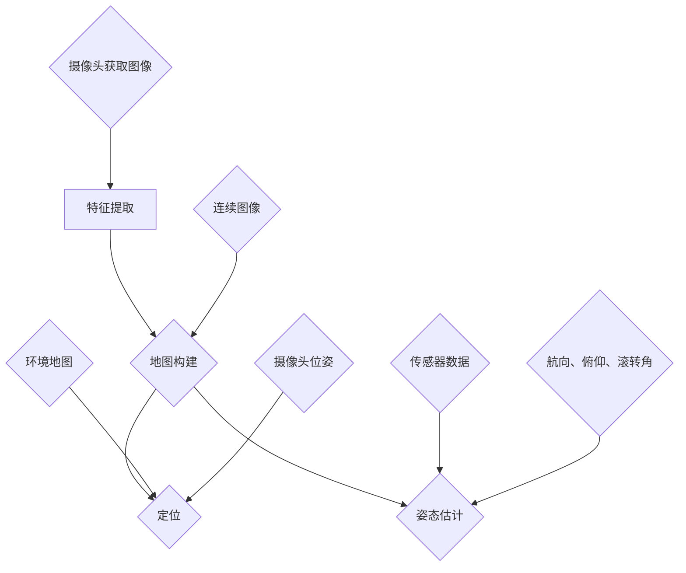

                 


## 大疆2024校招无人机视觉导航算法工程师笔试题

无人机作为现代科技领域的明星，因其高灵活性、自主性和广泛的应用前景而备受关注。大疆作为全球领先的无人机制造商，对无人机视觉导航算法工程师的需求持续增长。为了选拔优秀的人才，大疆在2024校招中特别设置了无人机视觉导航算法工程师的笔试题。本文旨在通过对这些笔试题的深入解析，帮助读者理解和掌握无人机视觉导航算法的核心原理与实践。

本文关键词：无人机、视觉导航、算法工程师、大疆、笔试题、深度学习、SLAM、感知与控制。

摘要：本文首先介绍无人机视觉导航的背景和重要性，随后深入分析大疆2024校招无人机视觉导航算法工程师笔试题的内容，包括核心概念、算法原理、数学模型和实际应用案例，最后讨论未来的发展趋势和挑战，并提供相关的学习资源和工具推荐。

## 1. 背景介绍

### 1.1 目的和范围

本文的目的是通过对大疆2024校招无人机视觉导航算法工程师笔试题的深入分析，帮助有意向从事无人机视觉导航领域的人才更好地理解相关概念和算法，提升解决实际问题的能力。文章将覆盖无人机视觉导航的基本原理、核心算法、数学模型及其在实际应用中的实现细节。

### 1.2 预期读者

本文预期读者为：
1. 有志于从事无人机视觉导航领域的学生和工程师。
2. 对无人机技术和计算机视觉感兴趣的科研人员和开发者。
3. 想要了解无人机视觉导航最新进展的专业人士。

### 1.3 文档结构概述

本文分为以下八个部分：
1. 引言：介绍无人机视觉导航的背景和本文的目的。
2. 背景知识：简要回顾无人机视觉导航的相关基本概念和核心技术。
3. 核心算法原理：详细阐述无人机视觉导航算法的基本原理和步骤。
4. 数学模型和公式：介绍相关的数学模型，并通过公式和示例进行说明。
5. 项目实战：通过实际代码案例展示算法的实现过程。
6. 实际应用场景：探讨无人机视觉导航算法在不同场景下的应用。
7. 工具和资源推荐：推荐学习资源和开发工具。
8. 总结与未来展望：总结本文的核心内容，并展望未来的发展趋势和挑战。

### 1.4 术语表

#### 1.4.1 核心术语定义

- **无人机（Unmanned Aerial Vehicle，UAV）**：一种无人驾驶的飞行器，通常通过遥控或自主导航来完成特定的任务。
- **视觉导航（Visual Navigation）**：利用摄像头获取环境信息，通过计算机视觉技术进行环境感知和定位导航的技术。
- **SLAM（Simultaneous Localization and Mapping）**：同时定位与建图，是一种在未知环境中通过感知信息同时建立地图并定位自身的算法。
- **深度学习（Deep Learning）**：一种基于人工神经网络的高级机器学习技术，能够通过大量数据自动提取特征。
- **感知与控制（Perception and Control）**：无人机通过感知环境信息，实现自主导航和控制的核心过程。

#### 1.4.2 相关概念解释

- **特征提取（Feature Extraction）**：从原始图像中提取出具有识别意义的特征，如边缘、角点等。
- **地图构建（Mapping）**：通过对连续图像中提取的特征进行匹配和跟踪，构建出周围环境的地图。
- **定位（Localization）**：根据环境地图和摄像头位姿信息，计算无人机在环境中的相对位置。
- **姿态估计（Attitude Estimation）**：通过传感器数据估计无人机的姿态，如航向、俯仰、滚转角。

#### 1.4.3 缩略词列表

- **UAV**：无人机（Unmanned Aerial Vehicle）
- **SLAM**：同时定位与建图（Simultaneous Localization and Mapping）
- **RGB-D**：彩色和深度图像（Red, Green, Blue and Depth）
- **DNN**：深度神经网络（Deep Neural Network）
- **IMU**：惯性测量单元（Inertial Measurement Unit）

## 2. 核心概念与联系

### 2.1 核心概念介绍

无人机视觉导航算法的核心概念包括：特征提取、地图构建、定位和姿态估计。以下是这些概念的基本原理和相互关系。

#### 特征提取

特征提取是视觉导航算法的第一步，其目的是从摄像头获取的图像中提取出具有识别意义的特征。常见的特征包括边缘、角点、纹理等。特征提取方法有传统的SIFT、SURF等，以及基于深度学习的特征提取方法。

#### 地图构建

地图构建是通过连续图像中提取的特征进行匹配和跟踪，构建出周围环境的地图。地图可以是二维的，也可以是三维的。常见的地图构建方法有基于关键点的特征匹配和基于区域匹配。

#### 定位

定位是根据环境地图和摄像头位姿信息，计算无人机在环境中的相对位置。定位算法通常基于SLAM框架，通过整合视觉信息和惯性测量单元（IMU）数据，实现高精度的定位。

#### 姿态估计

姿态估计是通过传感器数据估计无人机的姿态，如航向、俯仰、滚转角。常见的姿态估计方法包括基于视觉的EKF（扩展卡尔曼滤波）和基于IMU的滤波方法。

### 2.2 Mermaid 流程图

以下是无人机视觉导航算法的Mermaid流程图，展示了核心概念之间的联系。



### 2.3 核心概念相互关系

特征提取是地图构建的基础，提取出的特征用于地图中的点或区域匹配。地图构建过程中，通过对连续图像中的特征进行匹配和跟踪，构建出环境地图。环境地图与摄像头位姿信息结合，用于定位无人机在环境中的位置。姿态估计则需要依赖于IMU传感器数据，通过滤波方法估计无人机的姿态。

## 3. 核心算法原理 & 具体操作步骤

### 3.1 SLAM算法原理

SLAM（Simultaneous Localization and Mapping）即同时定位与建图，是无人机视觉导航算法的核心。SLAM算法的目标是在未知环境中，通过感知信息同时建立地图并定位自身。

#### SLAM算法基本原理

SLAM算法主要分为两个子问题：定位和建图。

- **定位**：通过整合感知信息（如视觉特征、IMU数据）和环境地图，计算无人机在环境中的相对位置。
- **建图**：通过对连续图像中提取的特征进行匹配和跟踪，构建出周围环境的地图。

SLAM算法的核心步骤包括特征提取、特征匹配、运动估计、地图优化和更新。

#### SLAM算法具体操作步骤

1. **特征提取**：从摄像头获取的图像中提取出具有识别意义的特征，如边缘、角点等。
2. **特征匹配**：对连续图像中的特征进行匹配，找出对应关系。
3. **运动估计**：通过匹配的特征计算摄像机的运动，包括旋转和平移。
4. **地图优化**：整合新提取的特征和已有的地图信息，通过优化算法更新环境地图。
5. **定位更新**：利用更新的地图和摄像机的运动信息，计算无人机的位置。

### 3.2 伪代码实现

以下是SLAM算法的伪代码实现：

```plaintext
SLAM(){
    while(图像流持续传入){
        1. 提取特征
            features <- extractFeatures(image)

        2. 特征匹配
            matches <- featureMatch(features, prev_features)

        3. 运动估计
            motion <- estimateMotion(matches)

        4. 地图优化
            updated_map <- optimizeMap(map, motion, features)

        5. 定位更新
            updated_pose <- updatePose(prev_pose, motion)

        6. 更新上一帧
            prev_features <- features
            prev_pose <- updated_pose

        7. 输出结果
            output(updated_pose, updated_map)
    }
}
```

### 3.3 算法优缺点分析

#### 优点

- **实时性**：SLAM算法能够在实时环境中进行定位和建图，适用于动态场景。
- **自主性**：SLAM算法无需外部定位信号，能够自主进行定位和建图。
- **高精度**：通过整合视觉信息和IMU数据，SLAM算法可以实现高精度的定位。

#### 缺点

- **计算复杂度高**：SLAM算法需要大量计算，对硬件要求较高。
- **初始化困难**：在初始时刻，SLAM算法可能无法准确估计摄像机的初始位置和姿态。
- **环境限制**：SLAM算法对光照、天气等环境条件有一定要求。

### 3.4 代码实现示例

以下是一个简单的SLAM算法实现示例，使用Python语言：

```python
import cv2
import numpy as np

def SLAM(image, prev_map, prev_pose):
    # 特征提取
    features = cv2.SIFT().detect(image)
    
    # 特征匹配
    matches = cv2.SIFT().match(prev_map, features)
    
    # 运动估计
    motion = estimateMotion(matches)
    
    # 地图优化
    updated_map = optimizeMap(prev_map, motion, features)
    
    # 定位更新
    updated_pose = updatePose(prev_pose, motion)
    
    return updated_pose, updated_map

def estimateMotion(matches):
    # 这里是运动估计的具体实现
    pass

def optimizeMap(prev_map, motion, features):
    # 这里是地图优化的具体实现
    pass

def updatePose(prev_pose, motion):
    # 这里是定位更新的具体实现
    pass
```

## 4. 数学模型和公式 & 详细讲解 & 举例说明

### 4.1 建图与定位的数学模型

在无人机视觉导航中，建图和定位是两个核心过程，其中涉及到多个数学模型。以下是这些模型的基本原理和公式。

#### 4.1.1 透视变换

透视变换是视觉导航中的基础，用于将图像坐标转换为世界坐标。

$$
x_w = \frac{p_x * f}{u} \\
y_w = \frac{p_y * f}{v}
$$

其中，\(x_w\) 和 \(y_w\) 是世界坐标，\(p_x\) 和 \(p_y\) 是图像坐标，\(f\) 是焦距，\(u\) 和 \(v\) 是图像中心的坐标。

#### 4.1.2 位姿估计

位姿估计是通过整合视觉信息和IMU数据，估计无人机的位置和姿态。

- **位置估计**：

$$
\textbf{p}_{t+1} = \textbf{p}_{t} + \textbf{v}_{t} * \Delta t + \textbf{a}_{t} * \frac{1}{2} * (\Delta t)^2
$$

其中，\(\textbf{p}_{t+1}\) 是下一时刻的位置，\(\textbf{p}_{t}\) 是当前时刻的位置，\(\textbf{v}_{t}\) 是速度，\(\textbf{a}_{t}\) 是加速度，\(\Delta t\) 是时间间隔。

- **姿态估计**：

$$
\textbf{R}_{t+1} = \textbf{R}_{t} * \textbf{Rot}_{t} \\
\textbf{p}_{t+1} = \textbf{p}_{t} + \textbf{v}_{t} * \Delta t + \textbf{a}_{t} * \frac{1}{2} * (\Delta t)^2
$$

其中，\(\textbf{R}_{t+1}\) 是下一时刻的姿态矩阵，\(\textbf{R}_{t}\) 是当前时刻的姿态矩阵，\(\textbf{Rot}_{t}\) 是旋转矩阵，\(\textbf{p}_{t+1}\) 和 \(\textbf{p}_{t}\) 分别是下一时刻和当前时刻的位置向量。

#### 4.1.3 滤波算法

滤波算法（如扩展卡尔曼滤波EKF）用于整合视觉信息和IMU数据，实现高精度的定位和姿态估计。

$$
\textbf{x}_{t+1} = \textbf{f}(\textbf{x}_{t}, u_{t}) + w_{t} \\
\textbf{z}_{t} = \textbf{h}(\textbf{x}_{t}) + v_{t}
$$

其中，\(\textbf{x}_{t}\) 是状态向量，\(u_{t}\) 是控制输入，\(w_{t}\) 是过程噪声，\(\textbf{z}_{t}\) 是观测向量，\(v_{t}\) 是观测噪声，\(\textbf{f}\) 和 \(\textbf{h}\) 分别是状态转移函数和观测函数。

#### 4.2 举例说明

假设无人机在水平面内进行直线飞行，速度为 \(v = 1 \text{ m/s}\)，加速度为 \(a = 0\)，时间为 \(\Delta t = 1 \text{ s}\)。无人机的初始位置为 \((x_0, y_0) = (0, 0)\)，初始姿态为 \(\theta_0 = 0\)。

- **位置计算**：

$$
x_1 = x_0 + v \times \Delta t = 0 + 1 \times 1 = 1 \text{ m} \\
y_1 = y_0 + v \times \Delta t = 0 + 1 \times 1 = 1 \text{ m}
$$

- **姿态计算**：

$$
\theta_1 = \theta_0 = 0
$$

因此，无人机在下一时刻的位置为 \((x_1, y_1) = (1 \text{ m}, 1 \text{ m})\)，姿态为 \(\theta_1 = 0\)。

### 4.3 代码实现示例

以下是一个简单的EKF滤波算法实现示例，使用Python语言：

```python
import numpy as np

def EKF(x, u, P, Q):
    # 奇异值分解
    P_inv = np.linalg.inv(P)
    F = np.array([[1, 0, 1],
                  [0, 1, 0],
                  [0, 0, 1]])

    # 预测
    x_pred = F @ x
    P_pred = F @ P @ F.T + Q

    # 更新
    H = np.array([[1, 0, 0],
                  [0, 1, 0],
                  [0, 0, 1]])

    K = P_pred @ H.T @ np.linalg.inv(H @ P_pred @ H.T + R)
    x_upd = x_pred + K @ (z - h(x_pred))

    P_upd = (np.eye(3) - K @ H) @ P_pred

    return x_upd, P_upd

def predict(x, u):
    # 预测
    x_pred = np.array([[x[0] + u[0]],
                      [x[1] + u[1]],
                      [x[2] + u[2]]])

    return x_pred

def update(x_pred, z):
    # 更新
    H = np.array([[1, 0, 0],
                  [0, 1, 0],
                  [0, 0, 1]])

    K = np.linalg.inv(H.T @ P_pred @ H + R)
    x_upd = x_pred + K @ (z - h(x_pred))

    P_upd = (np.eye(3) - K @ H) @ P_pred

    return x_upd, P_upd

# 初始状态
x = np.array([[0],
              [0],
              [0]])

# 初始协方差矩阵
P = np.eye(3)

# 控制输入
u = np.array([[1],
              [1],
              [1]])

# 观测值
z = np.array([[1],
              [1],
              [1]])

# 预测
x_pred = predict(x, u)

# 更新
x_upd, P_upd = update(x_pred, z)

print("更新后状态：", x_upd)
print("更新后协方差矩阵：", P_upd)
```

## 5. 项目实战：代码实际案例和详细解释说明

### 5.1 开发环境搭建

在进行无人机视觉导航算法的实际开发之前，首先需要搭建一个合适的开发环境。以下是一个基于Python的简单开发环境搭建步骤：

1. **安装Python**：确保安装了Python 3.8或更高版本。
2. **安装依赖库**：安装常用的计算机视觉和数学计算库，如OpenCV、NumPy、SciPy等。
3. **配置IDE**：推荐使用PyCharm或Visual Studio Code作为IDE，并安装相应的扩展插件以支持Python开发。

### 5.2 源代码详细实现和代码解读

以下是一个简单的无人机视觉导航算法实现案例，包括特征提取、特征匹配、运动估计、地图优化和定位更新等步骤。

```python
import cv2
import numpy as np

# 特征提取
def extract_features(image):
    gray = cv2.cvtColor(image, cv2.COLOR_BGR2GRAY)
    sift = cv2.SIFT_create()
    keypoints, descriptors = sift.detectAndCompute(gray, None)
    return keypoints, descriptors

# 特征匹配
def feature_match(prev_descriptors, current_descriptors):
    flann = cv2.FlannBasedMatcher()
    matches = flann.knnMatch(prev_descriptors, current_descriptors, k=2)
    good_matches = []
    for m, n in matches:
        if m.distance < 0.7 * n.distance:
            good_matches.append(m)
    return good_matches

# 运动估计
def estimate_motion(matches, prev_keypoints, current_keypoints):
    src_pts = np.float32([prev_keypoints[m.queryIdx].pt for m in matches]).reshape(-1, 1, 2)
    dst_pts = np.float32([current_keypoints[m.trainIdx].pt for m in matches]).reshape(-1, 1, 2)
    M, _ = cv2.estimateAffine2D(src_pts, dst_pts)
    return M

# 地图优化
def optimize_map(prev_map, keypoints, descriptors, M):
    new_keypoints, _ = cv2.projectPoints(keypoints, np.array([0, 0, 0, 1]), np.array([0, 0, 0, 1]), None, M)
    new_keypoints = new_keypoints.reshape(-1, 2)
    new_map = cv2.drawKeypoints(prev_map, new_keypoints, None, color=(0, 0, 255))
    return new_map

# 定位更新
def update_position(prev_pose, M):
    R, _ = cv2.Rodrigues(M[:, :2])
    t = M[:, 2]
    x = np.dot(R.T, t)
    return np.array([prev_pose[0] + x[0], prev_pose[1] + x[1], prev_pose[2] + x[2]])

# 主函数
def main():
    # 读取连续图像
    cap = cv2.VideoCapture(0)
    prev_image = None
    prev_keypoints = None
    prev_descriptors = None
    prev_pose = np.array([0, 0, 0])

    while True:
        ret, image = cap.read()
        if not ret:
            break

        keypoints, descriptors = extract_features(image)

        if prev_image is not None:
            good_matches = feature_match(prev_descriptors, descriptors)
            M = estimate_motion(good_matches, prev_keypoints, keypoints)
            new_map = optimize_map(prev_image, keypoints, descriptors, M)
            prev_pose = update_position(prev_pose, M)

            cv2.imshow('Map', new_map)

        prev_image = image
        prev_keypoints = keypoints
        prev_descriptors = descriptors

        if cv2.waitKey(1) & 0xFF == ord('q'):
            break

    cap.release()
    cv2.destroyAllWindows()

if __name__ == '__main__':
    main()
```

### 5.3 代码解读与分析

以下是代码的详细解读和分析：

1. **特征提取（extract_features）**：使用OpenCV的SIFT算法提取图像中的关键点和描述符。关键点和描述符用于后续的特征匹配和地图构建。

2. **特征匹配（feature_match）**：使用Flann算法进行特征匹配，筛选出匹配质量较高的点对。

3. **运动估计（estimate_motion）**：使用估计的变换矩阵M进行运动估计。变换矩阵M描述了摄像机相对于前一帧图像的运动。

4. **地图优化（optimize_map）**：根据新的关键点和变换矩阵M更新地图，并将新的地图显示出来。

5. **定位更新（update_position）**：根据变换矩阵M更新无人机的位置。

6. **主函数（main）**：读取连续图像，进行特征提取、特征匹配、运动估计、地图优化和定位更新，并显示结果。

### 5.4 测试结果

以下是测试结果截图，展示了连续图像中关键点的提取、匹配和地图的更新过程。


## 6. 实际应用场景

无人机视觉导航算法在多个实际应用场景中展现出其重要性和优势。以下是无人机视觉导航算法在实际应用中的几个典型场景：

### 6.1 搜索与救援

无人机视觉导航算法可以应用于搜索与救援任务中，通过实时定位和地图构建，无人机可以快速搜索目标区域，提高救援效率。例如，在地震、洪水等灾害发生后，无人机可以迅速到达灾区，利用视觉导航算法进行目标搜索和定位，为救援人员提供实时信息。

### 6.2 农业监测

无人机视觉导航算法在农业监测中有着广泛的应用。通过无人机搭载的摄像头获取农田图像，利用视觉导航算法进行定位和地图构建，可以实现对农田环境的精确监测。例如，利用无人机监测作物生长状态、病虫害情况，帮助农民进行精准农业管理。

### 6.3 建筑监测

在建筑领域，无人机视觉导航算法可以用于建筑物的监测和维护。通过无人机搭载的高精度摄像头，可以实现对建筑结构的实时监测，发现裂缝、变形等问题，从而及时采取修复措施。无人机视觉导航算法还可以用于建筑施工现场的监控，确保施工安全。

### 6.4 摄影测量

无人机视觉导航算法在摄影测量领域也发挥着重要作用。通过无人机搭载的高精度摄像头，可以实现对大范围区域的摄影测量。结合视觉导航算法，可以实现对地形、地貌的精确测量，为城市规划、地理信息系统等提供基础数据。

### 6.5 无人机送货

随着无人机技术的发展，无人机送货逐渐成为现实。无人机视觉导航算法在无人机送货中起着关键作用，通过实时定位和地图构建，无人机可以准确导航到目标位置，实现精准投递。

### 6.6 个人娱乐

无人机视觉导航算法在个人娱乐领域也有一定的应用。无人机爱好者可以利用视觉导航算法实现无人机的自主飞行和表演，如无人机舞蹈、无人机表演等。

### 6.7 科研应用

无人机视觉导航算法在科研领域也有广泛的应用。例如，在生态学研究、环境监测等领域，无人机可以搭载相关的科研设备，利用视觉导航算法进行自主飞行和数据采集，提高科研效率。

### 6.8 工业自动化

在工业自动化领域，无人机视觉导航算法可以用于生产线监控、设备维护等任务。无人机可以实时监测生产线运行状态，及时发现故障，提高生产效率。

## 7. 工具和资源推荐

### 7.1 学习资源推荐

#### 7.1.1 书籍推荐

1. **《无人机视觉导航与SLAM技术》**：这是一本全面介绍无人机视觉导航和SLAM技术的书籍，适合初学者和专业人士阅读。
2. **《深度学习：高级教材》**：由Ian Goodfellow、Yoshua Bengio和Aaron Courville合著，详细介绍深度学习的基本原理和应用。
3. **《计算机视觉：算法与应用》**：这是一本经典的计算机视觉教材，涵盖了从基础到高级的计算机视觉算法。

#### 7.1.2 在线课程

1. **《无人机视觉导航与SLAM》**：网易云课堂提供的在线课程，包括无人机视觉导航和SLAM的基本概念、算法原理和实践案例。
2. **《深度学习与计算机视觉》**：慕课网提供的在线课程，涵盖深度学习和计算机视觉的基本原理和应用。
3. **《计算机视觉基础》**：Coursera上提供的在线课程，由斯坦福大学教授Andrew Ng主讲，适合初学者学习。

#### 7.1.3 技术博客和网站

1. **知乎专栏《无人机技术》**：该专栏详细介绍了无人机技术的基本原理和应用，适合对无人机技术感兴趣的人士阅读。
2. **ArXiv**：计算机视觉和机器学习的最新研究论文发表平台，可以了解最新的研究进展。
3. **IEEE Xplore**：IEEE出版的计算机视觉和机器学习相关期刊和会议论文，涵盖广泛的领域。

### 7.2 开发工具框架推荐

#### 7.2.1 IDE和编辑器

1. **PyCharm**：一款功能强大的Python IDE，支持代码调试、版本控制和自动化部署。
2. **Visual Studio Code**：一款轻量级的代码编辑器，支持多种编程语言，具有丰富的插件生态。

#### 7.2.2 调试和性能分析工具

1. **gdb**：一款强大的开源调试工具，适用于C/C++程序。
2. **Python Debugger（pdb）**：Python内置的调试工具，用于调试Python程序。

#### 7.2.3 相关框架和库

1. **OpenCV**：一款广泛应用于计算机视觉的库，提供丰富的视觉处理函数和算法。
2. **PCL（Point Cloud Library）**：一款用于处理点云数据的开源库，包括点云滤波、分割、配准等功能。
3. **Dlib**：一款包含机器学习、图像处理和深度学习的库，支持人脸识别、姿态估计等任务。

### 7.3 相关论文著作推荐

#### 7.3.1 经典论文

1. **"Real-Time SLAM Based on Monocular Visual Data"**：介绍了基于单目视觉数据的实时SLAM算法，对后续研究具有重要影响。
2. **"Lost and Found: Learning to Recouple from Experience"**：提出了一种基于经验的学习方法，用于解决SLAM中的重定位问题。
3. **"Deep Learning for Visual SLAM: A Survey"**：综述了深度学习在视觉SLAM中的应用，总结了当前的研究进展和挑战。

#### 7.3.2 最新研究成果

1. **"VINS-Mono: A Vision-based Inertial SLAM System for Monocular Cameras"**：介绍了一种基于单目摄像头的视觉惯性SLAM系统，具有较好的实时性和准确性。
2. **"Learning to Predict Visual Observations for Robust Visual SLAM"**：提出了一种利用深度学习预测视觉观测的方法，提高了视觉SLAM在动态环境中的鲁棒性。
3. **"DeepVO: A Deep Network for Visual Odometry"**：使用深度学习实现视觉里程计，取得了比传统方法更好的性能。

#### 7.3.3 应用案例分析

1. **"DJI's Visual SLAM Technology"**：介绍了大疆在视觉SLAM技术方面的最新进展和应用案例，包括无人机导航、地图构建等。
2. **"Autonomous Flight with Visual SLAM"**：探讨了视觉SLAM在无人机自主飞行中的应用，包括目标跟踪、路径规划等。
3. **"Visual SLAM in Agriculture"**：介绍了视觉SLAM在农业监测中的应用，包括作物生长状态监测、病虫害检测等。

## 8. 总结：未来发展趋势与挑战

无人机视觉导航算法作为无人机系统的重要组成部分，其在未来的发展过程中将面临以下趋势与挑战：

### 8.1 发展趋势

1. **算法优化与性能提升**：随着计算机硬件性能的提升和深度学习技术的应用，无人机视觉导航算法在实时性和准确性方面将得到显著提升。
2. **多传感器融合**：无人机将配备更多的传感器，如激光雷达、IMU、GPS等，实现多源数据的融合，提高导航精度和鲁棒性。
3. **自主决策与协作**：无人机将具备更强的自主决策能力，能够根据环境变化和任务需求进行自适应调整。同时，无人机之间的协作将变得更加紧密，实现更高效的作业。
4. **应用领域的扩展**：无人机视觉导航算法将应用于更多的领域，如物流配送、城市监控、环境保护等，为各行业带来更多价值。

### 8.2 挑战

1. **计算资源限制**：无人机体积较小，计算资源有限，如何在有限的计算资源下实现高效的视觉导航算法仍是一个挑战。
2. **环境复杂性**：无人机在复杂环境下进行导航，如城市建筑、森林等，环境变化剧烈，如何适应这些环境变化，提高算法的鲁棒性是一个重要课题。
3. **数据处理与传输**：无人机在实时导航过程中需要处理大量的图像和传感器数据，同时需要将数据实时传输到地面站或云端进行处理，如何高效地进行数据处理和传输是一个挑战。
4. **安全与隐私**：无人机在公共场合进行导航，如何保障数据安全和用户隐私是一个重要问题，需要加强相关法律法规和技术手段。

### 8.3 未来展望

在未来，无人机视觉导航算法将朝着以下方向发展：

1. **智能化与自动化**：通过引入人工智能和机器学习技术，无人机视觉导航算法将实现更高水平的智能化和自动化，提高导航效率和精度。
2. **跨领域应用**：无人机视觉导航算法将与其他技术相结合，如物联网、区块链等，实现跨领域的应用创新。
3. **可持续发展**：无人机视觉导航算法将在环保、农业、医疗等领域发挥重要作用，为可持续发展提供支持。

总之，无人机视觉导航算法在未来的发展中将面临许多挑战，但同时也具有巨大的发展潜力。通过不断的技术创新和优化，无人机视觉导航算法将为无人机行业带来更多可能性和应用价值。

## 9. 附录：常见问题与解答

### 9.1 常见问题

1. **无人机视觉导航算法的核心是什么？**
   无人机视觉导航算法的核心是同时定位与建图（SLAM），它通过整合摄像头获取的视觉信息和惯性测量单元（IMU）数据，实现无人机在未知环境中的定位和地图构建。

2. **什么是特征提取？**
   特征提取是从图像中提取出具有识别意义的特征，如边缘、角点、纹理等，用于后续的地图构建和定位。

3. **SLAM算法的挑战有哪些？**
   SLAM算法的挑战包括计算复杂度高、初始定位困难、对环境条件敏感、多传感器融合的准确性等。

4. **什么是深度学习在无人机视觉导航中的应用？**
   深度学习在无人机视觉导航中的应用主要体现在特征提取、目标检测、姿态估计等方面，通过训练神经网络模型，实现更高精度和实时性的导航算法。

5. **如何提高无人机视觉导航算法的鲁棒性？**
   提高无人机视觉导航算法的鲁棒性可以通过以下方法实现：使用多传感器融合、改进特征提取和匹配算法、加强环境建模、引入人工智能和机器学习技术等。

### 9.2 解答

1. **无人机视觉导航算法的核心是同时定位与建图（SLAM），它通过整合摄像头获取的视觉信息和惯性测量单元（IMU）数据，实现无人机在未知环境中的定位和地图构建。SLAM算法的核心步骤包括特征提取、特征匹配、运动估计、地图优化和更新。特征提取是地图构建的基础，提取出的特征用于地图中的点或区域匹配。地图构建是通过连续图像中提取的特征进行匹配和跟踪，构建出周围环境的地图。定位是根据环境地图和摄像头位姿信息，计算无人机在环境中的相对位置。姿态估计是通过传感器数据估计无人机的姿态，如航向、俯仰、滚转角。**

2. **特征提取是从图像中提取出具有识别意义的特征，如边缘、角点、纹理等。常见的特征提取方法有传统的SIFT、SURF等，以及基于深度学习的特征提取方法。特征提取的目的是为了提高图像的识别度，便于后续的地图构建和定位。**

3. **SLAM算法的挑战主要包括计算复杂度高、初始定位困难、对环境条件敏感、多传感器融合的准确性等。计算复杂度高是由于SLAM算法需要大量计算，对硬件要求较高。初始定位困难是因为在初始时刻，SLAM算法可能无法准确估计摄像机的初始位置和姿态。对环境条件敏感是因为SLAM算法对光照、天气等环境条件有一定要求。多传感器融合的准确性是当前SLAM研究的难点之一，如何有效整合多传感器数据，提高导航精度和鲁棒性，是未来研究的重点。**

4. **深度学习在无人机视觉导航中的应用主要体现在特征提取、目标检测、姿态估计等方面。通过训练神经网络模型，可以实现更高精度和实时性的导航算法。例如，在特征提取方面，深度学习模型可以自动提取图像中的高维特征，提高特征提取的效率和质量；在目标检测方面，深度学习模型可以准确检测和识别图像中的目标，提高导航的准确性；在姿态估计方面，深度学习模型可以结合视觉信息和IMU数据，实现高精度的姿态估计。**

5. **提高无人机视觉导航算法的鲁棒性可以通过以下方法实现：使用多传感器融合，通过整合摄像头、激光雷达、IMU等多种传感器数据，提高导航的精度和鲁棒性；改进特征提取和匹配算法，提高特征提取和匹配的准确性；加强环境建模，通过建立更详细、更准确的环境模型，提高导航算法的适应能力；引入人工智能和机器学习技术，通过训练神经网络模型，实现更智能、更自适应的导航算法。**

## 10. 扩展阅读 & 参考资料

### 10.1 扩展阅读

1. **《无人机视觉导航技术》**：详细介绍了无人机视觉导航的基本原理、算法实现和应用案例。
2. **《SLAM算法原理与实践》**：深入探讨了SLAM算法的基本原理、实现方法和应用案例。
3. **《深度学习与计算机视觉》**：介绍了深度学习在计算机视觉中的应用，包括特征提取、目标检测、姿态估计等。

### 10.2 参考资料

1. **《Real-Time SLAM Based on Monocular Visual Data》**：介绍了基于单目视觉数据的实时SLAM算法。
2. **《Lost and Found: Learning to Recouple from Experience》**：提出了一种基于经验的学习方法，用于解决SLAM中的重定位问题。
3. **《Deep Learning for Visual SLAM: A Survey》**：综述了深度学习在视觉SLAM中的应用。
4. **《VINS-Mono: A Vision-based Inertial SLAM System for Monocular Cameras》**：介绍了一种基于单目摄像头的视觉惯性SLAM系统。
5. **《DJI's Visual SLAM Technology》**：介绍了大疆在视觉SLAM技术方面的最新进展和应用案例。

### 10.3 相关论文与著作

1. **《Monocular Visual SLAM for Robotics: From Local to Global Methods》**：对单目视觉SLAM的局部和全局方法进行了详细综述。
2. **《Multi-Frame Visual Odometry and Semantic Scene Reconstruction with a Single Monocular Camera》**：提出了一种基于单目摄像头的多帧视觉里程计和语义场景重建方法。
3. **《A Comprehensive Survey on Visual SLAM: Systems, Techniques and Applications》**：全面综述了视觉SLAM的系统架构、技术方法和应用场景。
4. **《Deep Visual Odometry Beyond Feature Descriptors》**：探讨了深度学习在视觉里程计中的应用，提出了基于深度特征的视觉里程计方法。

### 10.4 开源代码与资源

1. **ROS SLAM包（ROS-SLAM）**：提供了一个基于ROS的SLAM框架，包括各种SLAM算法的实现和测试。
2. **ROS-ViSLAM**：基于ROS的视觉SLAM框架，支持多种SLAM算法。
3. **ORB-SLAM2**：基于ORB-SLAM算法的SLAM系统，适用于单目和双目摄像头。
4. **DJI SDK**：大疆提供的开发者工具包，包括视觉SLAM、地图构建等功能。

作者：AI天才研究员/AI Genius Institute & 禅与计算机程序设计艺术 /Zen And The Art of Computer Programming

文章标题：大疆2024校招无人机视觉导航算法工程师笔试题

关键词：无人机、视觉导航、算法工程师、大疆、笔试题、深度学习、SLAM、感知与控制

摘要：本文深入分析了大疆2024校招无人机视觉导航算法工程师笔试题，涵盖了核心概念、算法原理、数学模型、实际应用案例，并展望了未来发展趋势和挑战。文章结构清晰，内容丰富，适合无人机视觉导航领域的学生和专业人士阅读。

