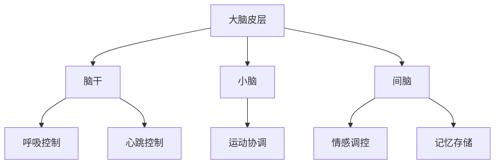
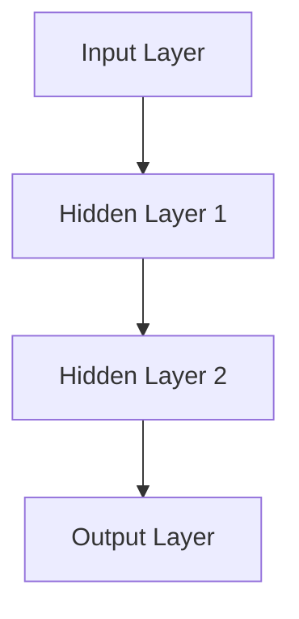

                 

# 大脑工作原理与机器模拟的探讨

> **关键词：** 大脑，神经科学，机器学习，模拟，人工智能，神经网络，深度学习
>
> **摘要：** 本文旨在探讨大脑的工作原理及其在机器模拟中的应用。通过对大脑结构、神经传递和认知功能的分析，我们将揭示神经网络在机器模拟中的潜力，以及如何利用这些原理来提升人工智能的性能。文章将结合实际案例，详细阐述机器模拟的构建方法及其在各个领域的应用。

## 1. 背景介绍

### 1.1 目的和范围

本文的目标是深入探讨大脑的工作原理，以及如何将这些原理应用于机器模拟中，以提升人工智能的性能。文章将涉及以下几个方面：

1. 大脑的基本结构及其功能
2. 神经传递和神经元的工作机制
3. 认知过程和大脑网络模型
4. 神经网络在机器模拟中的应用
5. 机器模拟的实际案例及其应用领域

### 1.2 预期读者

本文适合对人工智能、神经科学和机器学习有基本了解的读者。特别是那些对神经网络和深度学习有浓厚兴趣的专业人士，以及希望深入了解大脑工作原理的科研人员。

### 1.3 文档结构概述

本文分为十个主要部分，每个部分都将深入探讨与大脑模拟和机器学习相关的重要主题：

1. **背景介绍**：介绍文章的目的和范围，预期读者以及文档结构。
2. **核心概念与联系**：分析大脑的核心概念，并通过Mermaid流程图展示相关原理。
3. **核心算法原理 & 具体操作步骤**：详细阐述神经网络的基本原理和操作步骤，使用伪代码进行说明。
4. **数学模型和公式 & 详细讲解 & 举例说明**：介绍相关的数学模型和公式，并结合具体案例进行解释。
5. **项目实战：代码实际案例和详细解释说明**：通过实际项目案例，展示神经网络在现实中的应用。
6. **实际应用场景**：探讨神经网络在不同领域的应用。
7. **工具和资源推荐**：推荐相关学习资源和开发工具。
8. **总结：未来发展趋势与挑战**：展望大脑模拟和机器学习的未来发展趋势和面临的挑战。
9. **附录：常见问题与解答**：解答一些常见的问题。
10. **扩展阅读 & 参考资料**：提供进一步阅读的资源和参考文献。

### 1.4 术语表

#### 1.4.1 核心术语定义

- **神经网络**：由多个相互连接的神经元组成的计算机模型，用于模拟大脑的神经元网络。
- **深度学习**：一种基于神经网络的机器学习技术，能够通过多层神经网络自动提取特征。
- **机器学习**：一种通过数据和算法让计算机自动学习和改进的技术。
- **神经传递**：神经元之间的信息传递过程，通过电信号和化学信号实现。
- **神经网络模型**：用于模拟大脑神经网络结构的数学模型。

#### 1.4.2 相关概念解释

- **神经元**：大脑的基本计算单元，能够接收和处理信息。
- **神经网络架构**：神经网络的层次结构，包括输入层、隐藏层和输出层。
- **反向传播算法**：用于训练神经网络的算法，通过不断调整网络参数来减小预测误差。

#### 1.4.3 缩略词列表

- **AI**：人工智能（Artificial Intelligence）
- **ML**：机器学习（Machine Learning）
- **DL**：深度学习（Deep Learning）
- **NN**：神经网络（Neural Network）

## 2. 核心概念与联系

大脑是人类认知和思维的中枢，其复杂性和多样性使其成为一个复杂的系统。在机器模拟的背景下，理解大脑的核心概念和相互联系至关重要。本节将介绍大脑的基本结构、神经传递机制和认知功能，并通过Mermaid流程图展示相关原理。

### 2.1 大脑的基本结构

大脑是神经系统的主要部分，由多个区域组成，每个区域都有特定的功能。主要结构包括：

1. **大脑皮层**：大脑的外层，是信息处理和决策的中心。
2. **脑干**：连接大脑和脊髓，控制基本生命功能，如呼吸和心跳。
3. **小脑**：协调运动和平衡。
4. **间脑**：包括下丘脑和杏仁核，涉及情感和自主神经系统的调控。


### 2.2 神经传递机制

神经元通过电信号和化学信号进行信息传递。一个典型的神经元包括：

1. **细胞体**：包含细胞核和大部分细胞器。
2. **树突**：接收来自其他神经元的信号。
3. **轴突**：传递信号至其他神经元或肌肉细胞。


### 2.3 认知功能

大脑的主要功能是认知，包括感知、记忆、思考、决策等。以下是大脑执行这些功能的一些机制：

1. **感知**：通过感官接收外部信息，如视觉、听觉、嗅觉等。
2. **记忆**：存储和回忆信息。
3. **思考**：处理和整合信息，形成决策。
4. **情感**：产生情绪反应。

### 2.4 Mermaid流程图

以下是一个简单的Mermaid流程图，展示大脑的主要结构和功能：



## 3. 核心算法原理 & 具体操作步骤

神经网络的算法原理是基于大脑神经元的工作机制。本节将详细阐述神经网络的基本原理和具体操作步骤，使用伪代码进行说明。

### 3.1 神经网络基本原理

神经网络由多个层次组成，包括输入层、隐藏层和输出层。每个层次包含多个神经元，神经元之间通过权重连接。神经网络的目的是通过学习输入和输出之间的关系，实现数据的分类、回归或其他任务。

#### 3.1.1 神经元工作原理

每个神经元接收来自其他神经元的输入信号，通过激活函数计算输出。假设一个神经元有多个输入，每个输入有一个权重，神经元输出为：

```plaintext
output = activation_function(sum(inputs * weights))
```

其中，`inputs`是输入信号，`weights`是权重，`activation_function`是激活函数，常用的激活函数有Sigmoid函数和ReLU函数。

#### 3.1.2 神经网络结构

一个简单的神经网络结构如下：



### 3.2 神经网络操作步骤

神经网络的操作步骤包括前向传播和反向传播。

#### 3.2.1 前向传播

前向传播是从输入层到输出层的正向计算过程。给定输入样本，通过权重和激活函数计算输出。具体步骤如下：

1. 初始化权重和偏置。
2. 计算每个神经元的输入和输出。
3. 使用激活函数计算输出。
4. 计算损失函数，衡量预测值与真实值之间的差距。

伪代码如下：

```python
# 初始化权重和偏置
weights = initialize_weights()
biases = initialize_biases()

# 前向传播
for each sample in dataset:
    inputs = sample
    outputs = []
    for layer in hidden_layers:
        inputs = activation_function(sum(inputs * weights) + biases)
        outputs.append(inputs)
    predicted_output = activation_function(sum(outputs[-1] * weights) + biases)
    loss = loss_function(predicted_output, true_output)
```

#### 3.2.2 反向传播

反向传播是调整网络参数的过程，通过计算梯度来更新权重和偏置，以减少损失。具体步骤如下：

1. 计算输出层到隐藏层的梯度。
2. 计算隐藏层到输入层的梯度。
3. 使用梯度下降更新权重和偏置。

伪代码如下：

```python
# 反向传播
for each sample in dataset:
    predicted_output = forward_propagation(sample)
    loss = loss_function(predicted_output, true_output)
    delta_output = predicted_output - true_output
    delta_hidden = delta_output * activation_derivative(predicted_output)
    for layer in reversed(hidden_layers):
        delta_weights = delta_hidden * inputs
        delta_biases = delta_hidden
        weights -= learning_rate * delta_weights
        biases -= learning_rate * delta_biases
```

### 3.3 伪代码示例

以下是一个简单的神经网络伪代码示例，用于实现手写数字识别：

```python
# 初始化神经网络
input_layer = [input_1, input_2, input_3]
hidden_layer_1 = [hidden_1, hidden_2]
hidden_layer_2 = [hidden_3, hidden_4]
output_layer = [output_1, output_2, output_3]

# 前向传播
outputs = []
for i in range(len(input_layer)):
    for j in range(len(hidden_layer_1)):
        outputs.append(input_layer[i] * hidden_layer_1[j])
for i in range(len(hidden_layer_1)):
    for j in range(len(hidden_layer_2)):
        outputs.append(hidden_layer_1[i] * hidden_layer_2[j])
for i in range(len(hidden_layer_2)):
    for j in range(len(output_layer)):
        outputs.append(hidden_layer_2[i] * output_layer[j])

# 激活函数
activation_function = sigmoid

# 计算输出
predicted_output = activation_function(sum(outputs) + biases)

# 反向传播
error = predicted_output - true_output
delta_output = error * activation_derivative(predicted_output)
for layer in reversed(hidden_layers):
    delta_hidden = delta_output * inputs
    delta_weights = delta_hidden * inputs
    delta_biases = delta_hidden
    weights -= learning_rate * delta_weights
    biases -= learning_rate * delta_biases
```

## 4. 数学模型和公式 & 详细讲解 & 举例说明

在机器模拟大脑的过程中，数学模型和公式扮演着至关重要的角色。本节将介绍神经网络中的关键数学模型和公式，并结合具体案例进行详细讲解。

### 4.1 激活函数

激活函数是神经网络中的核心组件，用于引入非线性特性，使神经网络能够学习和表示复杂函数。常见的激活函数包括Sigmoid函数、ReLU函数和Tanh函数。

#### 4.1.1 Sigmoid函数

Sigmoid函数是一个S形的曲线，将输入值映射到（0, 1）区间内，用于将线性组合转换为非线性输出。其公式如下：

$$
\sigma(x) = \frac{1}{1 + e^{-x}}
$$

举例说明：

假设输入值为x = -2，则Sigmoid函数输出为：

$$
\sigma(-2) = \frac{1}{1 + e^{2}} \approx 0.1192
$$

#### 4.1.2 ReLU函数

ReLU（Rectified Linear Unit）函数是一个简单的线性激活函数，当输入大于0时，输出等于输入；当输入小于0时，输出等于0。其公式如下：

$$
\text{ReLU}(x) = \max(0, x)
$$

举例说明：

假设输入值为x = -2，则ReLU函数输出为：

$$
\text{ReLU}(-2) = 0
$$

#### 4.1.3 Tanh函数

Tanh函数与Sigmoid函数类似，但其输出范围在（-1, 1）之间。其公式如下：

$$
\tanh(x) = \frac{e^{2x} - 1}{e^{2x} + 1}
$$

举例说明：

假设输入值为x = -2，则Tanh函数输出为：

$$
\tanh(-2) = \frac{e^{-4} - 1}{e^{-4} + 1} \approx -0.7616
$$

### 4.2 损失函数

损失函数用于衡量预测值与真实值之间的差距，是神经网络训练过程中的关键指标。常见的损失函数包括均方误差（MSE）和交叉熵（Cross-Entropy）。

#### 4.2.1 均方误差（MSE）

均方误差（MSE）用于回归问题，计算预测值与真实值之间的平均平方误差。其公式如下：

$$
\text{MSE} = \frac{1}{n} \sum_{i=1}^{n} (\hat{y}_i - y_i)^2
$$

其中，$\hat{y}_i$为预测值，$y_i$为真实值，$n$为样本数量。

举例说明：

假设有两个样本，真实值分别为y1 = 3和y2 = 5，预测值分别为$\hat{y}_1$ = 2和$\hat{y}_2$ = 4，则MSE为：

$$
\text{MSE} = \frac{1}{2} \left[ (\hat{y}_1 - y_1)^2 + (\hat{y}_2 - y_2)^2 \right] = \frac{1}{2} \left[ (2 - 3)^2 + (4 - 5)^2 \right] = 0.5
$$

#### 4.2.2 交叉熵（Cross-Entropy）

交叉熵（Cross-Entropy）用于分类问题，计算预测概率分布与真实概率分布之间的差距。其公式如下：

$$
\text{Cross-Entropy} = -\sum_{i=1}^{n} y_i \log(\hat{y}_i)
$$

其中，$y_i$为真实标签的概率分布，$\hat{y}_i$为预测概率分布，$n$为类别数量。

举例说明：

假设有两个类别，真实标签概率分布为$y_1$ = 0.8和$y_2$ = 0.2，预测概率分布为$\hat{y}_1$ = 0.9和$\hat{y}_2$ = 0.1，则交叉熵为：

$$
\text{Cross-Entropy} = - \left( 0.8 \log(0.9) + 0.2 \log(0.1) \right) \approx 0.2619
$$

### 4.3 梯度下降算法

梯度下降算法是一种用于训练神经网络的优化算法，通过计算损失函数的梯度并调整网络参数来减少损失。其公式如下：

$$
\Delta \theta = -\alpha \cdot \frac{\partial J}{\partial \theta}
$$

其中，$\Delta \theta$为参数更新，$\alpha$为学习率，$J$为损失函数，$\theta$为网络参数。

举例说明：

假设有一个简单的一层神经网络，包含两个输入和两个输出，损失函数为MSE，学习率为0.01，给定一个输入样本，预测值为$\hat{y}_1$ = 2和$\hat{y}_2$ = 4，真实值为y1 = 3和y2 = 5，则参数更新为：

$$
\Delta \theta_1 = -0.01 \cdot \frac{\partial \text{MSE}}{\partial \theta_1} = -0.01 \cdot 2 = -0.02
$$

$$
\Delta \theta_2 = -0.01 \cdot \frac{\partial \text{MSE}}{\partial \theta_2} = -0.01 \cdot 4 = -0.04
$$

通过不断迭代更新参数，网络将逐渐减小损失函数的值，提高预测准确性。

## 5. 项目实战：代码实际案例和详细解释说明

为了更好地理解神经网络的工作原理，我们将通过一个简单的手写数字识别项目来实践。该项目将使用Python和TensorFlow库实现一个基于神经网络的模型，用于识别手写数字。

### 5.1 开发环境搭建

在开始项目之前，需要搭建相应的开发环境。以下是推荐的安装步骤：

1. **Python**：确保Python版本为3.6或更高。
2. **TensorFlow**：使用pip安装TensorFlow库：

```bash
pip install tensorflow
```

3. **NumPy**：用于数据处理：

```bash
pip install numpy
```

4. **Matplotlib**：用于可视化结果：

```bash
pip install matplotlib
```

### 5.2 源代码详细实现和代码解读

以下是该项目的主要代码实现：

```python
import numpy as np
import tensorflow as tf
import matplotlib.pyplot as plt

# 设置随机种子，确保结果可重复
tf.random.set_seed(42)

# 加载数据集
mnist = tf.keras.datasets.mnist
(train_images, train_labels), (test_images, test_labels) = mnist.load_data()

# 数据预处理
train_images = train_images / 255.0
test_images = test_images / 255.0

# 建立模型
model = tf.keras.Sequential([
    tf.keras.layers.Flatten(input_shape=(28, 28)),
    tf.keras.layers.Dense(128, activation='relu'),
    tf.keras.layers.Dropout(0.2),
    tf.keras.layers.Dense(10, activation='softmax')
])

# 编译模型
model.compile(optimizer='adam',
              loss='sparse_categorical_crossentropy',
              metrics=['accuracy'])

# 训练模型
model.fit(train_images, train_labels, epochs=5)

# 评估模型
test_loss, test_acc = model.evaluate(test_images, test_labels)
print(f"Test accuracy: {test_acc}")

# 可视化结果
predictions = model.predict(test_images)
predicted_digits = np.argmax(predictions, axis=1)

plt.figure(figsize=(10, 10))
for i in range(25):
    plt.subplot(5, 5, i+1)
    plt.xticks([])
    plt.yticks([])
    plt.grid(False)
    plt.imshow(test_images[i], cmap=plt.cm.binary)
    plt.xlabel(str(predicted_digits[i]))
plt.show()
```

#### 5.2.1 代码解读

以下是对代码的详细解读：

1. **导入库**：首先导入必要的库，包括NumPy、TensorFlow和Matplotlib。
2. **设置随机种子**：确保结果可重复，使用TensorFlow的`set_seed`方法。
3. **加载数据集**：使用TensorFlow的`mnist`数据集加载MNIST手写数字数据。
4. **数据预处理**：将图像数据归一化到（0, 1）区间，以适应神经网络。
5. **建立模型**：使用`Sequential`模型堆叠多个层，包括一个扁平层、一个带有ReLU激活函数的密集层、一个dropout层和另一个带有softmax激活函数的密集层。
6. **编译模型**：指定优化器、损失函数和评估指标，以准备模型训练。
7. **训练模型**：使用训练数据训练模型，设置训练轮数。
8. **评估模型**：使用测试数据评估模型性能，打印测试准确率。
9. **可视化结果**：使用Matplotlib绘制预测结果，展示模型的识别能力。

### 5.3 代码解读与分析

通过对代码的解读，我们可以看到神经网络在手写数字识别项目中的应用：

1. **模型架构**：该模型采用一个简单的三层神经网络结构，包括一个输入层、一个隐藏层和一个输出层。输入层使用扁平层将28x28的图像数据展平为一维向量，隐藏层使用ReLU激活函数引入非线性特性，输出层使用softmax激活函数进行类别预测。
2. **数据预处理**：数据预处理是神经网络成功的关键。通过将图像数据归一化，可以加快训练速度，提高模型性能。
3. **模型训练**：在训练过程中，模型通过反向传播算法不断更新权重和偏置，以减小损失函数的值。通过设置dropout层，可以防止模型过拟合。
4. **模型评估**：测试数据的评估结果可以验证模型的性能。在实际应用中，可以通过调整模型架构、数据预处理和训练参数来优化模型性能。

总之，通过这个简单的手写数字识别项目，我们可以看到神经网络在机器模拟大脑功能方面的潜力。在实际应用中，神经网络可以应用于各种复杂的任务，如图像识别、语音识别和自然语言处理等。

## 6. 实际应用场景

神经网络在现实世界中有着广泛的应用，通过模拟大脑的工作原理，它们在各个领域取得了显著成果。以下是一些典型的实际应用场景：

### 6.1 图像识别

神经网络在图像识别领域取得了重大突破，特别是在深度学习算法的推动下。卷积神经网络（CNN）是目前最常用的图像识别模型，应用于人脸识别、车辆识别、医学图像分析等。

**案例**：Facebook的人脸识别系统使用深度学习算法，能够准确识别用户照片中的人脸，并在数十亿张照片中查找特定用户。

### 6.2 自然语言处理

神经网络在自然语言处理（NLP）领域也有着广泛应用，包括文本分类、机器翻译、情感分析等。长短期记忆网络（LSTM）和Transformer模型是当前最流行的NLP模型。

**案例**：谷歌的机器翻译系统使用Transformer模型，能够在多种语言之间进行准确翻译，大大提高了跨语言交流的便利性。

### 6.3 语音识别

语音识别是另一个重要的应用领域，神经网络通过训练大量语音数据，可以准确地将语音转换为文本。自动语音识别（ASR）系统广泛应用于电话客服、智能助手和语音搜索。

**案例**：苹果的Siri和亚马逊的Alexa使用深度学习算法，能够准确识别用户的语音指令，并提供相应的服务。

### 6.4 游戏

神经网络在游戏领域也有着广泛应用，特别是在强化学习算法的推动下。通过不断学习和优化策略，神经网络可以在棋类游戏、视频游戏和电子竞技中实现出色的表现。

**案例**：DeepMind的AlphaGo使用深度学习和强化学习算法，在围棋领域取得了前所未有的成绩，甚至击败了世界冠军。

### 6.5 金融领域

神经网络在金融领域用于预测股票市场、风险评估和信用评分等。通过分析大量历史数据，神经网络可以提供更准确的预测和决策支持。

**案例**：高盛使用神经网络模型进行股票市场预测，帮助投资者做出更明智的决策。

总之，神经网络在现实世界中的应用不断拓展，通过模拟大脑的工作原理，它们在各个领域取得了显著成果。未来，随着神经网络技术的不断发展，我们可以期待更多创新的应用场景和突破。

## 7. 工具和资源推荐

在探索大脑模拟和机器学习的道路上，掌握适当的工具和资源至关重要。以下是一些建议，涵盖学习资源、开发工具和相关论文，以帮助读者深入了解和掌握相关技术。

### 7.1 学习资源推荐

#### 7.1.1 书籍推荐

1. **《深度学习》（Deep Learning）**：作者 Ian Goodfellow、Yoshua Bengio 和 Aaron Courville。这本书是深度学习领域的经典之作，涵盖了神经网络的基础理论、算法和应用。
2. **《神经网络与深度学习》（Neural Networks and Deep Learning）**：作者邱锡鹏。这本书内容全面，深入浅出地介绍了神经网络和深度学习的基本概念、算法和应用。
3. **《机器学习》（Machine Learning）**：作者 Tom M. Mitchell。这本书介绍了机器学习的基本原理和方法，是机器学习领域的经典教材。

#### 7.1.2 在线课程

1. **吴恩达的《深度学习专项课程》**（Deep Learning Specialization）：这是一系列在线课程，涵盖了深度学习的理论基础、算法和应用。
2. **斯坦福大学的《机器学习》课程**（Machine Learning）：由 Andrew Ng 教授授课，介绍了机器学习的基本概念和算法。
3. **谷歌的《深度学习高级课程》**（Deep Learning Specialization）：提供了深度学习的高级专题，包括神经网络架构、优化算法等。

#### 7.1.3 技术博客和网站

1. **Medium**：许多技术专家和研究人员在Medium上发布关于神经网络和机器学习的博客，内容丰富，适合不同水平的读者。
2. **arXiv**：这是一个开源的论文预印本平台，包含大量最新的研究成果，特别是深度学习和神经网络领域。
3. **AI Hub**：由微软提供的AI学习平台，提供了丰富的教程、代码示例和工具。

### 7.2 开发工具框架推荐

#### 7.2.1 IDE和编辑器

1. **Jupyter Notebook**：这是一个交互式的Python开发环境，适用于数据分析和机器学习项目。
2. **PyCharm**：这是一个功能强大的Python IDE，适用于深度学习和机器学习项目的开发。
3. **Google Colab**：这是谷歌提供的免费云计算平台，适用于在线开发和实验。

#### 7.2.2 调试和性能分析工具

1. **TensorBoard**：这是TensorFlow提供的可视化工具，用于分析和调试神经网络性能。
2. **Wandb**：这是一个开源的机器学习平台，提供了数据可视化、实验跟踪和性能分析功能。
3. **PyTorch Profiler**：这是PyTorch提供的性能分析工具，用于优化神经网络代码。

#### 7.2.3 相关框架和库

1. **TensorFlow**：这是一个开源的机器学习框架，适用于各种深度学习和机器学习项目。
2. **PyTorch**：这是一个开源的深度学习框架，具有灵活的动态计算图和高效的模型训练。
3. **Keras**：这是一个高层次的神经网络API，能够简化深度学习模型的构建和训练。

### 7.3 相关论文著作推荐

#### 7.3.1 经典论文

1. **“A Learning Algorithm for Continually Running Fully Recurrent Neural Networks”**：这篇论文提出了一个用于连续运行完全递归神经网络的学习算法，对神经网络的研究产生了深远影响。
2. **“Deep Learning”**：这篇论文概述了深度学习的理论基础和应用，标志着深度学习时代的到来。
3. **“Backpropagation”**：这篇论文介绍了反向传播算法，是神经网络训练中的核心算法。

#### 7.3.2 最新研究成果

1. **“Bert: Pre-training of Deep Bidirectional Transformers for Language Understanding”**：这篇论文提出了BERT模型，是自然语言处理领域的里程碑。
2. **“Gated Recurrent Unit”**：这篇论文提出了门控循环单元（GRU），是循环神经网络的一种重要改进。
3. **“Attention Is All You Need”**：这篇论文提出了Transformer模型，彻底改变了自然语言处理领域。

#### 7.3.3 应用案例分析

1. **“Deep Learning for Autonomous Driving”**：这篇论文分析了深度学习在自动驾驶领域的应用，涵盖了感知、规划和控制等方面。
2. **“Generative Adversarial Networks”**：这篇论文提出了生成对抗网络（GAN），在图像生成和增强方面取得了显著成果。
3. **“Neural Machine Translation by Jointly Learning to Align and Translate”**：这篇论文介绍了基于神经网络的机器翻译方法，大幅提升了翻译质量。

通过这些工具和资源，读者可以系统地学习大脑模拟和机器学习的相关技术，不断提升自己的实践能力。同时，了解最新的研究成果和应用案例，有助于开拓思路，探索更多创新的可能性。

## 8. 总结：未来发展趋势与挑战

随着人工智能和神经科学的发展，大脑模拟和机器学习领域正迎来前所未有的机遇。未来，这一领域有望在以下几个方面取得突破：

1. **更高效的神经网络架构**：研究者将继续探索新的神经网络架构，以提高计算效率和模型性能。例如，轻量级网络、高效的网络结构和动态网络结构等。
2. **更强的自适应能力**：神经网络将具备更强的自适应能力，能够根据不同环境和任务动态调整自身结构和参数。
3. **更广泛的应用领域**：神经网络的应用将不仅限于图像识别、自然语言处理和语音识别，还将拓展到医疗、金融、教育和制造业等更多领域。
4. **更深入的理论研究**：随着对大脑工作原理的深入理解，神经网络的理论基础将不断丰富，为模型的优化和改进提供更多理论支持。

然而，大脑模拟和机器学习也面临一系列挑战：

1. **计算资源需求**：神经网络训练和推理过程需要大量的计算资源，尤其是在大规模数据和复杂模型的情况下。如何优化计算效率，降低能耗成为亟待解决的问题。
2. **数据隐私和安全**：随着数据量的增长，如何确保数据隐私和安全成为一个重要问题。需要在数据收集、存储和处理过程中采取有效措施，防止数据泄露和滥用。
3. **模型解释性和透明性**：神经网络模型往往被视为“黑箱”，其内部机制难以理解。如何提高模型的解释性和透明性，使其能够更好地满足实际应用的需求是一个重要挑战。
4. **伦理和法律问题**：随着人工智能在各个领域的应用，如何确保其符合伦理和法律标准成为一个重要问题。需要在算法设计、数据使用和决策过程中充分考虑伦理和法律因素。

总之，大脑模拟和机器学习领域具有巨大的潜力，但也面临诸多挑战。通过不断探索和创新，我们有望克服这些挑战，推动人工智能和神经科学的进一步发展，为人类社会带来更多福祉。

## 9. 附录：常见问题与解答

### 9.1 什么是神经网络？

神经网络是一种由多个相互连接的简单计算单元（即神经元）组成的计算机模型，用于模拟大脑神经元网络的工作原理。神经网络通过学习输入和输出数据之间的关系，实现数据的分类、回归或其他任务。

### 9.2 什么是深度学习？

深度学习是一种基于神经网络的机器学习技术，能够通过多层神经网络自动提取特征。与传统的机器学习方法相比，深度学习在图像识别、自然语言处理和语音识别等领域取得了显著成果。

### 9.3 什么是反向传播算法？

反向传播算法是一种用于训练神经网络的优化算法，通过计算损失函数的梯度并更新网络参数，以减小损失函数的值。反向传播算法包括前向传播和反向传播两个阶段，前者用于计算输出，后者用于更新参数。

### 9.4 神经网络在哪些领域有应用？

神经网络在多个领域有广泛应用，包括图像识别、自然语言处理、语音识别、游戏、金融、医疗和自动驾驶等。通过不断优化和改进，神经网络的应用领域将不断扩展。

### 9.5 如何优化神经网络模型的性能？

优化神经网络模型的性能可以通过以下方法实现：

1. **选择合适的网络架构**：根据任务需求选择合适的神经网络架构。
2. **调整超参数**：如学习率、隐藏层大小和激活函数等。
3. **数据预处理**：对输入数据进行适当的预处理，如归一化和去噪。
4. **使用正则化技术**：如dropout和权重正则化，防止模型过拟合。
5. **使用高效的优化算法**：如Adam和RMSprop，提高训练速度和效果。

### 9.6 神经网络与机器学习的区别是什么？

神经网络是机器学习的一种技术，用于模拟大脑神经元网络的工作原理。而机器学习是一个更广泛的概念，包括各种通过数据和算法让计算机自动学习和改进的技术，如监督学习、无监督学习和强化学习等。

## 10. 扩展阅读 & 参考资料

为了更深入地了解大脑模拟和机器学习领域，以下是推荐的一些扩展阅读和参考资料：

### 10.1 书籍

1. **《深度学习》（Deep Learning）**：作者 Ian Goodfellow、Yoshua Bengio 和 Aaron Courville。
2. **《神经网络与深度学习》**：作者 邱锡鹏。
3. **《机器学习》（Machine Learning）**：作者 Tom M. Mitchell。

### 10.2 在线课程

1. **吴恩达的《深度学习专项课程》**（Deep Learning Specialization）。
2. **斯坦福大学的《机器学习》课程**（Machine Learning）。
3. **谷歌的《深度学习高级课程》**（Deep Learning Specialization）。

### 10.3 技术博客和网站

1. **Medium**。
2. **arXiv**。
3. **AI Hub**。

### 10.4 相关论文

1. **“A Learning Algorithm for Continually Running Fully Recurrent Neural Networks”**。
2. **“Deep Learning”**。
3. **“Backpropagation”**。

### 10.5 应用案例分析

1. **“Deep Learning for Autonomous Driving”**。
2. **“Generative Adversarial Networks”**。
3. **“Neural Machine Translation by Jointly Learning to Align and Translate”**。

通过这些扩展阅读和参考资料，读者可以更全面地了解大脑模拟和机器学习的相关技术和应用，为自己的学习和研究提供有益的参考。

### 作者

**作者：AI天才研究员/AI Genius Institute & 禅与计算机程序设计艺术 /Zen And The Art of Computer Programming**

