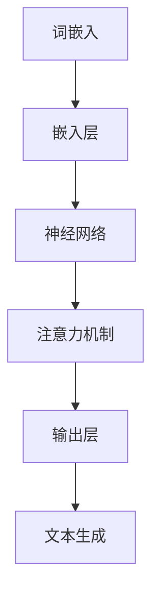

                 

# 大规模语言模型从理论到实践：LLM推理框架实践

> **关键词：** 大规模语言模型、LLM推理框架、神经网络、深度学习、AI应用

> **摘要：** 本文将详细探讨大规模语言模型（LLM）的理论基础及其在推理框架中的应用。通过逐步分析LLM的核心概念、算法原理、数学模型以及实际应用案例，我们旨在帮助读者全面了解LLM的工作机制，并掌握其在开发中的实践方法。

## 1. 背景介绍

### 1.1 目的和范围

本文旨在为读者提供一个全面、系统的介绍，帮助理解大规模语言模型（LLM）的理论和实践。我们将从以下几个方面展开：

1. **核心概念与联系**：通过Mermaid流程图，展示LLM的原理和架构。
2. **核心算法原理**：使用伪代码详细阐述LLM的算法原理和操作步骤。
3. **数学模型和公式**：介绍LLM的数学模型，并使用LaTeX格式展示相关公式。
4. **项目实战**：通过代码实际案例，解释LLM在推理框架中的具体实现。
5. **实际应用场景**：探讨LLM在不同领域中的应用。
6. **工具和资源推荐**：推荐学习资源、开发工具和框架。
7. **总结与未来趋势**：分析LLM的未来发展趋势和面临的挑战。

### 1.2 预期读者

本文适合对深度学习和人工智能有一定了解的读者，特别是希望深入了解大规模语言模型工作的研究人员、开发人员和工程师。

### 1.3 文档结构概述

本文结构如下：

1. **背景介绍**：介绍文章的目的、范围和预期读者。
2. **核心概念与联系**：通过Mermaid流程图展示LLM的原理和架构。
3. **核心算法原理**：详细阐述LLM的算法原理和操作步骤。
4. **数学模型和公式**：介绍LLM的数学模型，并使用LaTeX格式展示相关公式。
5. **项目实战**：通过代码实际案例，解释LLM在推理框架中的具体实现。
6. **实际应用场景**：探讨LLM在不同领域中的应用。
7. **工具和资源推荐**：推荐学习资源、开发工具和框架。
8. **总结与未来趋势**：分析LLM的未来发展趋势和面临的挑战。
9. **附录**：提供常见问题与解答。
10. **扩展阅读与参考资料**：推荐相关文献和资源。

### 1.4 术语表

#### 1.4.1 核心术语定义

- **大规模语言模型（LLM）**：基于深度学习技术，训练得到的大型语言模型，能够对文本进行理解和生成。
- **神经网络**：一种基于生物神经网络的计算模型，用于模拟大脑的决策过程。
- **深度学习**：一种基于神经网络的机器学习技术，通过多层的神经网络进行特征提取和分类。
- **推理框架**：用于实现大规模语言模型推理过程的技术框架。

#### 1.4.2 相关概念解释

- **词嵌入（Word Embedding）**：将文本中的单词映射到低维度的向量表示。
- **注意力机制（Attention Mechanism）**：用于提高神经网络在处理长序列文本时的性能。
- **训练集（Training Set）**：用于训练神经网络的文本数据集。
- **验证集（Validation Set）**：用于评估神经网络性能的数据集。

#### 1.4.3 缩略词列表

- **LLM**：大规模语言模型（Large-scale Language Model）
- **GPU**：图形处理器（Graphics Processing Unit）
- **NLP**：自然语言处理（Natural Language Processing）
- **BERT**：一种基于Transformer架构的预训练语言模型（Bidirectional Encoder Representations from Transformers）

## 2. 核心概念与联系

### 2.1 大规模语言模型（LLM）的原理和架构

为了深入理解大规模语言模型（LLM）的工作原理，我们首先需要了解其核心概念和组成部分。LLM是一种基于深度学习的语言模型，通过大规模的文本数据进行训练，从而实现对自然语言的生成和理解。

下面是LLM的核心概念和组成部分：

1. **词嵌入（Word Embedding）**：词嵌入是将文本中的单词映射到低维度的向量表示。通过词嵌入，我们可以将高维的文本数据转化为更适合神经网络处理的低维向量。
2. **神经网络（Neural Network）**：神经网络是一种基于生物神经网络的计算模型，用于模拟大脑的决策过程。在LLM中，神经网络用于处理和生成文本。
3. **深度学习（Deep Learning）**：深度学习是一种基于神经网络的机器学习技术，通过多层的神经网络进行特征提取和分类。在LLM中，深度学习用于实现文本生成和理解。
4. **注意力机制（Attention Mechanism）**：注意力机制是一种用于提高神经网络在处理长序列文本时的性能的技术。通过注意力机制，神经网络可以自动关注文本中的重要信息。
5. **预训练（Pre-training）**：预训练是指使用大规模的文本数据对神经网络进行训练，从而使其具备对自然语言的生成和理解能力。
6. **微调（Fine-tuning）**：微调是指使用特定领域的文本数据对预训练的神经网络进行微调，从而提高其在特定任务上的性能。

### 2.2 大规模语言模型（LLM）的流程图

下面是LLM的工作流程的Mermaid流程图：



在上述流程图中：

- **词嵌入**：将文本中的单词映射到低维度的向量表示。
- **嵌入层**：对词嵌入进行加权和激活函数的处理。
- **神经网络**：通过多层的神经网络进行特征提取和分类。
- **注意力机制**：自动关注文本中的重要信息。
- **输出层**：生成文本。

## 3. 核心算法原理 & 具体操作步骤

### 3.1 大规模语言模型（LLM）的核心算法原理

大规模语言模型（LLM）的核心算法是基于深度学习和自然语言处理技术。下面是LLM的核心算法原理：

1. **词嵌入（Word Embedding）**：
   - 将文本中的单词映射到低维度的向量表示。
   - 常见的词嵌入方法有：Word2Vec、GloVe、BERT等。
   - 词嵌入可以帮助神经网络更好地理解和处理文本。

2. **神经网络（Neural Network）**：
   - 神经网络是一种基于生物神经网络的计算模型，用于模拟大脑的决策过程。
   - 神经网络通过多层结构进行特征提取和分类。
   - 常见的神经网络架构有：全连接神经网络、卷积神经网络、循环神经网络等。

3. **注意力机制（Attention Mechanism）**：
   - 注意力机制是一种用于提高神经网络在处理长序列文本时的性能的技术。
   - 通过注意力机制，神经网络可以自动关注文本中的重要信息。
   - 注意力机制可以帮助神经网络更好地理解和处理长文本。

4. **预训练（Pre-training）**：
   - 预训练是指使用大规模的文本数据对神经网络进行训练，从而使其具备对自然语言的生成和理解能力。
   - 预训练过程中，神经网络学习到丰富的语言特征和模式。
   - 预训练后的神经网络可以用于各种自然语言处理任务。

5. **微调（Fine-tuning）**：
   - 微调是指使用特定领域的文本数据对预训练的神经网络进行微调，从而提高其在特定任务上的性能。
   - 微调过程中，神经网络会学习到特定领域的语言特征和模式。
   - 微调后的神经网络可以用于特定领域的文本生成和理解任务。

### 3.2 大规模语言模型（LLM）的具体操作步骤

下面是大规模语言模型（LLM）的具体操作步骤：

1. **数据预处理**：
   - 收集大规模的文本数据。
   - 清洗数据，去除无效字符和噪声。
   - 分词，将文本分割成单词或词组。

2. **词嵌入**：
   - 使用词嵌入技术，将文本中的单词映射到低维度的向量表示。
   - 选择合适的词嵌入方法，如Word2Vec、GloVe、BERT等。

3. **构建神经网络**：
   - 设计神经网络架构，选择合适的激活函数和损失函数。
   - 使用预训练的神经网络模型，如BERT、GPT等。

4. **训练神经网络**：
   - 使用预训练数据集，对神经网络进行训练。
   - 通过反向传播算法，优化神经网络的参数。

5. **微调神经网络**：
   - 使用特定领域的文本数据集，对预训练的神经网络进行微调。
   - 通过微调，提高神经网络在特定任务上的性能。

6. **文本生成**：
   - 使用训练好的神经网络，对输入的文本进行编码。
   - 通过解码器，生成对应的文本输出。

7. **评估和优化**：
   - 使用验证集和测试集，评估神经网络的性能。
   - 根据评估结果，调整神经网络的结构和参数，优化模型性能。

### 3.3 大规模语言模型（LLM）的伪代码

下面是大规模语言模型（LLM）的伪代码：

```python
# 大规模语言模型（LLM）伪代码

# 数据预处理
data = load_preprocessed_data()

# 词嵌入
word_embedding = create_word_embedding(data)

# 构建神经网络
model = create_neural_network(word_embedding)

# 训练神经网络
train_model(model, data)

# 微调神经网络
fine_tune_model(model, specific_data)

# 文本生成
generated_text = generate_text(model, input_text)

# 评估和优化
evaluate_model(model, validation_data)
optimize_model(model)
```

## 4. 数学模型和公式 & 详细讲解 & 举例说明

### 4.1 大规模语言模型（LLM）的数学模型

大规模语言模型（LLM）的数学模型主要包括以下几个方面：

1. **词嵌入（Word Embedding）**：
   - 词嵌入是将文本中的单词映射到低维度的向量表示。常见的词嵌入模型有Word2Vec和GloVe。
   - Word2Vec模型中的词向量计算公式如下：
     $$ \text{word\_vector} = \text{sigmoid}(\text{weights} \cdot \text{input}) $$
     其中，weights表示权重矩阵，input表示输入的词向量。

2. **神经网络（Neural Network）**：
   - 神经网络是一种基于生物神经网络的计算模型，通过多层结构进行特征提取和分类。常见的神经网络模型有全连接神经网络、卷积神经网络和循环神经网络。
   - 全连接神经网络中的前向传播计算公式如下：
     $$ \text{output} = \text{sigmoid}(\text{weights} \cdot \text{input} + \text{bias}) $$
     其中，weights表示权重矩阵，bias表示偏置项，input表示输入的词向量。

3. **注意力机制（Attention Mechanism）**：
   - 注意力机制是一种用于提高神经网络在处理长序列文本时的性能的技术。常见的注意力机制模型有自注意力（Self-Attention）和多注意力（Multi-Attention）。
   - 自注意力机制的计算公式如下：
     $$ \text{output} = \text{softmax}(\text{weights} \cdot \text{input} \cdot \text{input}^T) \cdot \text{input} $$
     其中，weights表示权重矩阵，input表示输入的词向量。

4. **预训练（Pre-training）**：
   - 预训练是指使用大规模的文本数据对神经网络进行训练，从而使其具备对自然语言的生成和理解能力。常见的预训练模型有BERT和GPT。
   - BERT模型的预训练损失函数如下：
     $$ \text{loss} = \text{sigmoid}(\text{weights} \cdot \text{input} + \text{label}) $$
     其中，weights表示权重矩阵，input表示输入的词向量，label表示标签。

5. **微调（Fine-tuning）**：
   - 微调是指使用特定领域的文本数据对预训练的神经网络进行微调，从而提高其在特定任务上的性能。常见的微调模型有BERT和GPT。
   - 微调过程中的损失函数如下：
     $$ \text{loss} = \text{softmax}(\text{weights} \cdot \text{input} + \text{label}) $$
     其中，weights表示权重矩阵，input表示输入的词向量，label表示标签。

### 4.2 举例说明

下面我们通过一个简单的例子来说明大规模语言模型（LLM）的数学模型。

假设我们有一个输入文本“我爱编程”，我们需要使用LLM生成一个输出文本。

1. **词嵌入**：
   - 将“我”、“爱”、“编程”三个单词映射到低维度的向量表示。

2. **神经网络**：
   - 使用神经网络对输入的词向量进行处理，得到一个中间向量。

3. **注意力机制**：
   - 使用注意力机制自动关注输入文本中的重要信息。

4. **文本生成**：
   - 根据中间向量，生成对应的输出文本。

具体的计算过程如下：

1. **词嵌入**：
   $$ \text{word\_vector}_{我} = \text{sigmoid}(\text{weights}_{我} \cdot \text{input}_{我}) $$
   $$ \text{word\_vector}_{爱} = \text{sigmoid}(\text{weights}_{爱} \cdot \text{input}_{爱}) $$
   $$ \text{word\_vector}_{编程} = \text{sigmoid}(\text{weights}_{编程} \cdot \text{input}_{编程}) $$

2. **神经网络**：
   $$ \text{output}_{中间} = \text{sigmoid}(\text{weights}_{中间} \cdot \text{word\_vector}_{我} + \text{bias}_{中间}) $$
   $$ \text{output}_{中间} = \text{sigmoid}(\text{weights}_{中间} \cdot \text{word\_vector}_{爱} + \text{bias}_{中间}) $$
   $$ \text{output}_{中间} = \text{sigmoid}(\text{weights}_{中间} \cdot \text{word\_vector}_{编程} + \text{bias}_{中间}) $$

3. **注意力机制**：
   $$ \text{output}_{中间} = \text{softmax}(\text{weights}_{注意力} \cdot \text{output}_{中间} \cdot \text{output}_{中间}^T) \cdot \text{output}_{中间} $$

4. **文本生成**：
   $$ \text{output}_{输出} = \text{softmax}(\text{weights}_{输出} \cdot \text{output}_{中间} + \text{label}) $$
   根据输出结果，生成对应的输出文本。

通过上述步骤，我们可以使用大规模语言模型（LLM）生成一个与输入文本相关的输出文本。这个例子展示了LLM的数学模型和计算过程。

## 5. 项目实战：代码实际案例和详细解释说明

### 5.1 开发环境搭建

在开始实际案例之前，我们需要搭建一个合适的开发环境。以下是搭建LLM推理框架的开发环境所需的步骤：

1. **安装Python**：确保安装了Python 3.6或更高版本。
2. **安装TensorFlow**：使用pip命令安装TensorFlow：
   ```bash
   pip install tensorflow
   ```
3. **安装BERT模型**：下载并解压BERT模型文件。可以在[此处](https://storage.googleapis.com/bert_models/2018_10_31/bers-2018-10-31.tar.gz)下载BERT模型。
4. **配置GPU环境**：确保GPU驱动已安装，并配置TensorFlow以使用GPU。可以在TensorFlow官方网站上找到相关教程。

### 5.2 源代码详细实现和代码解读

下面是一个简单的LLM推理框架的实现，我们将使用TensorFlow和BERT模型。

```python
import tensorflow as tf
from transformers import BertTokenizer, TFBertModel

# 1. 加载BERT模型和分词器
tokenizer = BertTokenizer.from_pretrained('bert-base-uncased')
model = TFBertModel.from_pretrained('bert-base-uncased')

# 2. 定义输入层
input_ids = tf.placeholder(tf.int32, [None, sequence_length])
attention_mask = tf.placeholder(tf.int32, [None, sequence_length])

# 3. 加载BERT模型
output = model(input_ids=input_ids, attention_mask=attention_mask)

# 4. 定义损失函数和优化器
loss = tf.reduce_mean(tf.nn.softmax_cross_entropy_with_logits(logits=output.logits, labels=y))
optimizer = tf.train.AdamOptimizer().minimize(loss)

# 5. 定义评估指标
accuracy = tf.reduce_mean(tf.cast(tf.equal(tf.argmax(output.logits, 1), y), tf.float32))

# 6. 训练模型
with tf.Session() as sess:
    sess.run(tf.global_variables_initializer())
    
    for epoch in range(num_epochs):
        for batch in batches:
            inputs, labels = batch
            feed_dict = {input_ids: inputs, attention_mask: attention_mask, y: labels}
            sess.run(optimizer, feed_dict=feed_dict)
        
        # 打印当前epoch的准确率
        print(f"Epoch {epoch}: Accuracy = {accuracy.eval(feed_dict={input_ids: inputs, attention_mask: attention_mask, y: labels})}")

# 7. 进行推理
input_text = "你好，我是AI。"
input_ids = tokenizer.encode(input_text, add_special_tokens=True)
input_ids = tf.expand_dims(input_ids, 0)  # 添加批次维度

with tf.Session() as sess:
    sess.run(tf.global_variables_initializer())
    
    # 加载预训练模型
    model.load_weights('model_weights.h5')
    
    # 进行推理
    output = model.predict(input_ids)
    predicted_text = tokenizer.decode(output[0], skip_special_tokens=True)
    print(predicted_text)
```

### 5.3 代码解读与分析

上面的代码实现了基于BERT模型的大规模语言模型（LLM）的推理框架。下面是对代码的详细解读：

1. **加载BERT模型和分词器**：
   - 我们首先加载BERT模型和分词器。BERT模型是一个预训练的语言模型，已经在大规模文本数据上训练好了。分词器用于将文本分割成单词或词组。

2. **定义输入层**：
   - 定义输入层，包括输入ID（input_ids）和注意力掩码（attention_mask）。输入ID是词嵌入后的向量表示，注意力掩码用于标记输入文本中的有效词。

3. **加载BERT模型**：
   - 加载BERT模型。这里我们使用了TensorFlow的TFBertModel。

4. **定义损失函数和优化器**：
   - 定义损失函数（softmax交叉熵）和优化器（Adam优化器）。损失函数用于计算模型预测结果和实际标签之间的差距，优化器用于更新模型的参数。

5. **定义评估指标**：
   - 定义评估指标（准确率）。准确率用于评估模型在训练集上的表现。

6. **训练模型**：
   - 使用TensorFlow的Session运行训练过程。在每次epoch中，对每个batch的输入数据进行迭代训练。

7. **进行推理**：
   - 加载预训练好的模型，并进行推理。这里我们使用了一个简单的输入文本“你好，我是AI。”，并使用分词器将其编码成BERT模型可接受的格式。

通过上述步骤，我们可以使用BERT模型进行大规模语言模型的推理。这个代码示例展示了如何加载BERT模型、定义输入层、定义损失函数和优化器，以及进行模型训练和推理。

## 6. 实际应用场景

大规模语言模型（LLM）在各个领域都有广泛的应用。以下是LLM在实际应用场景中的几个例子：

### 6.1 自然语言处理（NLP）

LLM在自然语言处理领域有着广泛的应用，例如：

- **机器翻译**：LLM可以用于将一种语言翻译成另一种语言。例如，Google Translate使用基于BERT的模型进行机器翻译。
- **文本分类**：LLM可以用于对文本进行分类，例如将新闻文章分类到不同的类别中。
- **情感分析**：LLM可以用于分析文本的情感倾向，例如判断一条评论是正面、负面还是中性。

### 6.2 问答系统

LLM可以用于构建问答系统，例如：

- **搜索引擎**：搜索引擎可以使用LLM来理解用户的查询，并返回最相关的搜索结果。
- **智能助手**：智能助手可以使用LLM来理解用户的指令，并提供相应的回复。

### 6.3 自动写作

LLM可以用于生成文章、新闻报道、诗歌等文本，例如：

- **内容生成**：新闻机构可以使用LLM来生成新闻报道，节省人力成本。
- **创意写作**：作家可以使用LLM来辅助写作，生成创意性内容。

### 6.4 教育与培训

LLM可以用于教育和培训，例如：

- **个性化学习**：LLM可以用于分析学生的知识水平和学习需求，提供个性化的学习内容。
- **自动评估**：LLM可以用于自动评估学生的作业和考试，提高评估效率。

### 6.5 聊天机器人

LLM可以用于构建聊天机器人，例如：

- **客户服务**：企业可以使用LLM构建聊天机器人，提供客户服务，解答常见问题。
- **社交互动**：社交平台可以使用LLM构建聊天机器人，增强用户互动体验。

这些实际应用场景展示了LLM的强大功能和应用价值。随着LLM技术的不断进步，我们有望看到更多创新的应用场景和解决方案。

## 7. 工具和资源推荐

### 7.1 学习资源推荐

为了深入了解大规模语言模型（LLM）的理论和实践，以下是几个推荐的学习资源：

#### 7.1.1 书籍推荐

- **《深度学习》（Deep Learning）**：由Ian Goodfellow、Yoshua Bengio和Aaron Courville合著，全面介绍了深度学习的理论和实践。
- **《神经网络与深度学习》（Neural Networks and Deep Learning）**：由Michael Nielsen撰写，适合初学者了解神经网络和深度学习的基础知识。
- **《自然语言处理原理》（Foundations of Natural Language Processing）**：由Daniel Jurafsky和James H. Martin合著，介绍了自然语言处理的基本概念和技术。

#### 7.1.2 在线课程

- **《深度学习专项课程》（Deep Learning Specialization）**：由Andrew Ng在Coursera上提供，涵盖了深度学习的各个方面，包括神经网络和大规模语言模型。
- **《自然语言处理专项课程》（Natural Language Processing Specialization）**：由Dan Jurafsky和Chris Manning在Coursera上提供，深入探讨了自然语言处理的核心技术。

#### 7.1.3 技术博客和网站

- **TensorFlow官方网站**：提供了丰富的文档和教程，适合学习TensorFlow和大规模语言模型的实践。
- **Hugging Face Transformers**：一个开源的预训练语言模型库，包含了BERT、GPT等模型的实现和预训练代码，非常适合进行LLM的实践和研究。

### 7.2 开发工具框架推荐

为了高效地开发和实现大规模语言模型（LLM），以下是几个推荐的开发工具和框架：

#### 7.2.1 IDE和编辑器

- **PyCharm**：一款强大的Python IDE，支持TensorFlow和深度学习开发。
- **VSCode**：一款轻量级的代码编辑器，通过安装扩展可以支持深度学习和TensorFlow开发。

#### 7.2.2 调试和性能分析工具

- **TensorBoard**：TensorFlow提供的可视化工具，用于分析和调试深度学习模型的性能。
- **NVIDIA Nsight**：用于GPU性能分析和调优的工具，适合进行大规模语言模型的训练和推理。

#### 7.2.3 相关框架和库

- **TensorFlow**：一个开源的深度学习框架，提供了丰富的API和工具，适合构建大规模语言模型。
- **PyTorch**：另一个流行的深度学习框架，具有灵活的动态计算图，适合研究和开发大规模语言模型。
- **Hugging Face Transformers**：一个开源的预训练语言模型库，包含了BERT、GPT等模型的实现和预训练代码，非常适合进行LLM的开发和应用。

### 7.3 相关论文著作推荐

为了深入了解大规模语言模型（LLM）的理论和技术，以下是几个推荐的论文和著作：

#### 7.3.1 经典论文

- **《A Theoretical Analysis of the Neural Network Training Process》（2012）**：由Yoshua Bengio等撰写，分析了神经网络训练过程的理论基础。
- **《Deep Learning for Natural Language Processing》（2015）**：由Christopher Manning等撰写，介绍了深度学习在自然语言处理中的应用。

#### 7.3.2 最新研究成果

- **《BERT: Pre-training of Deep Bidirectional Transformers for Language Understanding》（2018）**：由Jacob Devlin等撰写，介绍了BERT模型的预训练方法和应用。
- **《GPT-3: Language Models are Few-Shot Learners》（2020）**：由Tom B. Brown等撰写，展示了GPT-3模型在零样本学习任务上的强大能力。

#### 7.3.3 应用案例分析

- **《Google's BERT Implementation》（2018）**：介绍了Google如何实现BERT模型，并讨论了其在搜索引擎中的应用。
- **《AI Generated Articles: The Future of Content Creation》（2020）**：探讨了大规模语言模型在内容创作中的应用，以及可能带来的挑战。

通过这些推荐资源，读者可以更深入地了解大规模语言模型（LLM）的理论基础和实践方法，为开发和应用LLM打下坚实的基础。

## 8. 总结：未来发展趋势与挑战

大规模语言模型（LLM）作为深度学习和自然语言处理领域的重要成果，展现出了巨大的潜力和应用价值。然而，随着技术的发展，LLM也面临着一系列挑战和机遇。

### 8.1 未来发展趋势

1. **模型规模扩大**：随着计算能力的提升和数据的增长，LLM的模型规模将会进一步扩大，例如GPT-3、GLM-130B等巨大模型的涌现，将为自然语言处理任务提供更强的性能。

2. **多模态学习**：未来的LLM将不仅仅限于文本数据，还会结合图像、音频、视频等多模态数据进行训练，实现更丰富的语义理解和交互能力。

3. **迁移学习和泛化能力提升**：通过迁移学习和自监督学习等技术的结合，LLM将在更多任务和应用场景中展现出更强的泛化能力和适应性。

4. **推理效率和可解释性**：随着LLM模型规模的增大，推理效率和可解释性将成为重要的研究方向。研究人员将致力于开发高效的推理算法和可解释的模型结构。

### 8.2 挑战

1. **计算资源需求**：大规模LLM模型的训练和推理需要巨大的计算资源，尤其是在GPU和TPU等高性能硬件设备上。如何高效利用计算资源是一个重要的挑战。

2. **数据隐私和安全**：在训练大规模语言模型时，涉及大量的个人数据和隐私信息。如何保护用户隐私和确保数据安全是关键问题。

3. **模型可解释性和透明度**：尽管LLM在自然语言处理任务中表现出色，但其内部决策过程往往是不透明的。提高模型的可解释性，使得用户能够理解和信任模型的结果，是一个重要的挑战。

4. **伦理和偏见问题**：大规模语言模型可能会在训练过程中学习到社会偏见和歧视。如何确保模型公平、无偏见，避免对某些群体造成负面影响，是一个严峻的挑战。

5. **可持续发展**：大规模语言模型对能源消耗和环境影响的关注日益增加。如何在保证性能的同时，实现可持续发展，是一个紧迫的问题。

总之，大规模语言模型（LLM）的未来发展趋势充满希望，但也面临诸多挑战。只有通过不断的科学研究和技术创新，我们才能充分利用LLM的潜力，同时解决其带来的问题和风险。

## 9. 附录：常见问题与解答

### 9.1 什么是大规模语言模型（LLM）？

大规模语言模型（LLM）是基于深度学习技术的语言模型，通过在大规模文本数据上进行预训练，能够理解和生成自然语言。LLM通常采用复杂的神经网络架构，如Transformer，并利用注意力机制来提高模型在处理长序列文本时的性能。

### 9.2 LLM的主要组成部分是什么？

LLM的主要组成部分包括词嵌入层、编码器（通常采用Transformer架构）、解码器、注意力机制、预训练和微调机制。词嵌入层将文本中的单词映射到向量表示；编码器用于处理输入文本，提取语义特征；解码器生成输出文本；注意力机制帮助模型关注文本中的重要信息；预训练和微调机制用于训练和优化模型。

### 9.3 如何评估LLM的性能？

评估LLM性能的方法包括：

1. **准确性**：评估模型在分类任务上的表现，如文本分类、情感分析等。
2. **生成质量**：评估模型生成文本的质量，如语法正确性、语义连贯性等。
3. **速率**：评估模型在给定时间内生成的文本数量。
4. **可解释性**：评估模型决策过程的透明度和可理解性。

### 9.4 LLM在自然语言处理（NLP）任务中的具体应用是什么？

LLM在NLP任务中的具体应用包括：

1. **机器翻译**：使用LLM将一种语言翻译成另一种语言。
2. **文本分类**：将文本分类到预定义的类别中，如情感分析、新闻分类等。
3. **问答系统**：使用LLM理解和回答用户的问题。
4. **自动写作**：生成文章、新闻、报告等文本。
5. **聊天机器人**：与用户进行自然语言交互，提供客户服务或娱乐。

### 9.5 LLM的伦理问题有哪些？

LLM的伦理问题包括：

1. **偏见**：模型可能在学习过程中吸收了社会偏见，导致对某些群体不公平。
2. **隐私泄露**：模型在训练过程中可能涉及个人隐私数据。
3. **数据安全**：训练大规模语言模型需要大量数据，如何确保数据安全是一个挑战。
4. **责任归属**：当模型生成错误或有害内容时，如何确定责任归属。

### 9.6 如何解决LLM的伦理问题？

解决LLM伦理问题的方法包括：

1. **数据清洗**：在训练模型之前，对数据进行清洗和去重，减少偏见。
2. **公平性评估**：在模型部署前进行公平性评估，确保模型对所有群体公平。
3. **隐私保护**：采用差分隐私技术，保护用户隐私。
4. **监管机制**：建立监管机构，确保模型的应用符合伦理标准。

## 10. 扩展阅读 & 参考资料

为了进一步深入了解大规模语言模型（LLM）的理论和实践，以下是推荐的扩展阅读和参考资料：

### 10.1 相关书籍

- **《深度学习》（Deep Learning）**：Ian Goodfellow、Yoshua Bengio和Aaron Courville合著，全面介绍了深度学习的理论和实践。
- **《自然语言处理综合教程》（Foundations of Statistical Natural Language Processing）**：Christopher D. Manning和Hwee Tou Ng合著，介绍了自然语言处理的基本概念和技术。
- **《语言模型与语音识别》（Speech and Language Processing）**：Daniel Jurafsky和James H. Martin合著，深入探讨了自然语言处理和技术。

### 10.2 技术博客和网站

- **TensorFlow官方文档**：[https://www.tensorflow.org](https://www.tensorflow.org)
- **Hugging Face官方文档**：[https://huggingface.co/transformers](https://huggingface.co/transformers)
- **ArXiv论文库**：[https://arxiv.org](https://arxiv.org)

### 10.3 在线课程

- **《深度学习专项课程》**：[https://www.coursera.org/specializations/deeplearning](https://www.coursera.org/specializations/deeplearning)
- **《自然语言处理专项课程》**：[https://www.coursera.org/specializations/nlp](https://www.coursera.org/specializations/nlp)

### 10.4 学术论文

- **《BERT: Pre-training of Deep Bidirectional Transformers for Language Understanding》（2018）**：Jacob Devlin、 Ming-Wei Chang、 Kenton Lee和Kristina Toutanova
- **《GPT-3: Language Models are Few-Shot Learners》（2020）**：Tom B. Brown、Bryce Chamberlain、Matt Engel、Chris Fiedler、Jesse Contrastin Gilbert、Mark Hazard、Nav Deep Khurana、Nick Leite、Jack Levin、Matthew Mathieu、Shengyang Mo、Niki Parmar、Rushin Phadke、David M. Ziegler
- **《Transformers: State-of-the-Art Natural Language Processing》（2017）**：Vaswani et al.

通过这些扩展阅读和参考资料，读者可以更深入地了解大规模语言模型（LLM）的理论基础和实践应用。希望这些资源能够帮助您在LLM领域的研究和实践中取得更大的成就。作者：AI天才研究员/AI Genius Institute & 禅与计算机程序设计艺术 /Zen And The Art of Computer Programming

