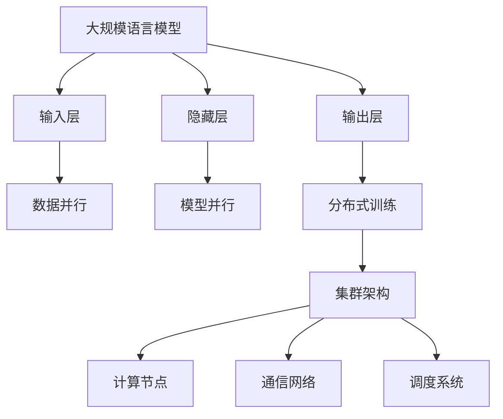

                 

# 大规模语言模型从理论到实践：分布式训练的集群架构

> **关键词**：大规模语言模型、分布式训练、集群架构、算法原理、数学模型、项目实战、应用场景、资源推荐

> **摘要**：本文深入探讨了大规模语言模型的分布式训练及其集群架构。通过逐步分析，我们将理解分布式训练的核心概念、算法原理、数学模型以及其实际应用场景，并详细介绍了一个具体的代码实现案例。文章最后对未来的发展趋势和挑战进行了总结，并推荐了一系列学习和开发资源。

## 1. 背景介绍

### 1.1 目的和范围

本文旨在为读者提供一个全面而深入的了解，关于大规模语言模型的分布式训练及其集群架构。本文将涵盖以下主要内容：

- 核心概念与联系
- 核心算法原理与具体操作步骤
- 数学模型和公式的详细讲解与举例说明
- 项目实战：代码实际案例和详细解释说明
- 实际应用场景
- 工具和资源推荐
- 总结与未来发展趋势

### 1.2 预期读者

本文面向对人工智能、大规模语言模型以及分布式计算有一定了解的读者。无论是研究者、开发者还是对相关技术感兴趣的技术爱好者，都可以通过本文获得有价值的知识和经验。

### 1.3 文档结构概述

本文结构如下：

- 引言：概述文章主题和主要结构。
- 第1章：背景介绍，包括目的、预期读者和文档结构概述。
- 第2章：核心概念与联系，介绍大规模语言模型的基本概念和架构。
- 第3章：核心算法原理与具体操作步骤，详细讲解分布式训练算法。
- 第4章：数学模型和公式，介绍大规模语言模型的数学基础。
- 第5章：项目实战，通过具体代码案例展示分布式训练的实现。
- 第6章：实际应用场景，讨论大规模语言模型的应用领域。
- 第7章：工具和资源推荐，推荐学习资源和开发工具。
- 第8章：总结：未来发展趋势与挑战。
- 第9章：附录：常见问题与解答。
- 第10章：扩展阅读与参考资料，提供进一步的阅读资源。

### 1.4 术语表

#### 1.4.1 核心术语定义

- 大规模语言模型：使用海量数据训练的神经网络模型，能够理解和生成自然语言。
- 分布式训练：在多台计算机上并行执行训练任务，以加快模型训练速度。
- 集群架构：多台计算机组成的计算集群，用于实现分布式训练。

#### 1.4.2 相关概念解释

- 并行计算：在同一时间段内执行多个任务。
- 异步通信：多台计算机之间不按固定时间同步通信。
- 数据并行：将数据集分割成多个部分，同时在不同的计算机上独立训练模型。

#### 1.4.3 缩略词列表

- MLP：多层感知机（Multi-Layer Perceptron）
- GPU：图形处理器（Graphics Processing Unit）
- HDFS：Hadoop分布式文件系统（Hadoop Distributed File System）
- MPI：消息传递接口（Message Passing Interface）

## 2. 核心概念与联系

在深入探讨大规模语言模型的分布式训练之前，首先需要理解其核心概念和架构。以下是大规模语言模型、分布式训练和集群架构的基本概念及其相互关系。

### 2.1 大规模语言模型

大规模语言模型是一种基于神经网络的深度学习模型，通过海量数据训练，能够理解和生成自然语言。其主要组成部分包括：

- **输入层**：接收自然语言输入，如文本或语音信号。
- **隐藏层**：多层神经网络结构，用于提取特征和进行计算。
- **输出层**：生成预测结果，如文本、标签或序列。

大规模语言模型的核心优势在于其能够自动从数据中学习，并生成高质量的文本生成和分类结果。

### 2.2 分布式训练

分布式训练是一种在多台计算机上并行执行训练任务的策略，以加快模型训练速度。其主要目标是将大规模模型训练时间从几天或几周缩短到几个小时或几天。

分布式训练的关键在于将数据集和模型划分为多个部分，同时在不同的计算机上进行独立训练。以下是分布式训练的基本概念：

- **数据并行**：将数据集分割成多个部分，同时在不同的计算机上独立训练模型。
- **模型并行**：将模型划分成多个部分，同时在不同的计算机上进行独立训练。

分布式训练的优势在于能够显著减少训练时间，提高计算效率。

### 2.3 集群架构

集群架构是指由多台计算机组成的计算集群，用于实现分布式训练。集群架构的关键组件包括：

- **计算节点**：执行训练任务的计算机。
- **通信网络**：连接不同计算节点的网络。
- **调度系统**：负责任务分配和资源管理。

集群架构的优势在于能够提供高性能计算和可扩展性，以应对大规模模型训练的需求。

### 2.4 Mermaid 流程图

为了更直观地展示大规模语言模型、分布式训练和集群架构之间的联系，以下是使用Mermaid绘制的流程图：



通过该流程图，我们可以清晰地看到大规模语言模型、分布式训练和集群架构之间的相互关系和作用。

## 3. 核心算法原理与具体操作步骤

### 3.1 数据并行训练算法

数据并行训练是一种常用的分布式训练策略，其核心思想是将数据集分割成多个部分，同时在不同的计算机上进行独立训练。以下是数据并行训练算法的具体步骤：

#### 3.1.1 数据分割

首先，将原始数据集分割成多个子数据集。每个子数据集包含一部分训练数据。数据分割可以基于数据块的索引或数据块的哈希值。

```python
def split_data(dataset, num_workers):
    chunks = []
    chunk_size = len(dataset) // num_workers
    for i in range(num_workers):
        start = i * chunk_size
        end = (i + 1) * chunk_size if i < num_workers - 1 else len(dataset)
        chunks.append(dataset[start:end])
    return chunks
```

#### 3.1.2 训练模型

然后，在每个计算节点上独立训练模型。每个计算节点处理其对应的子数据集，并更新模型参数。以下是使用SGD（随机梯度下降）进行模型训练的伪代码：

```python
def train_model(model, dataset, num_epochs, learning_rate):
    for epoch in range(num_epochs):
        for data in dataset:
            model.forward(data)
            model.backward()
            model.update_params(learning_rate)
```

#### 3.1.3 模型同步

在训练过程中，需要定期同步各个计算节点的模型参数。同步策略可以采用平均策略或梯度聚合策略。

```python
def sync_params(models, sync_strategy):
    if sync_strategy == "average":
        averaged_params = average_params(models)
        for model in models:
            model.update_params(averaged_params)
    elif sync_strategy == "gradient_aggregation":
        aggregated_gradients = aggregate_gradients(models)
        for model in models:
            model.update_params(aggregated_gradients)
```

### 3.2 模型并行训练算法

模型并行训练是将模型划分成多个部分，同时在不同的计算机上进行独立训练。以下是模型并行训练算法的具体步骤：

#### 3.2.1 模型分割

首先，将模型划分成多个部分，每个部分对应一个计算节点。模型分割可以基于层的索引或参数的哈希值。

```python
def split_model(model, num_workers):
    model_parts = []
    for i in range(num_workers):
        model_part = copy.deepcopy(model)
        # 删除模型中的特定部分
        del model_part.layers[i]
        model_parts.append(model_part)
    return model_parts
```

#### 3.2.2 训练模型

然后，在每个计算节点上独立训练模型的部分。每个计算节点处理其对应的模型部分，并更新模型参数。以下是使用SGD进行模型训练的伪代码：

```python
def train_model(model, dataset, num_epochs, learning_rate):
    for epoch in range(num_epochs):
        for data in dataset:
            model.forward(data)
            model.backward()
            model.update_params(learning_rate)
```

#### 3.2.3 模型同步

在训练过程中，需要定期同步各个计算节点的模型参数。同步策略可以采用平均策略或梯度聚合策略。

```python
def sync_params(models, sync_strategy):
    if sync_strategy == "average":
        averaged_params = average_params(models)
        for model in models:
            model.update_params(averaged_params)
    elif sync_strategy == "gradient_aggregation":
        aggregated_gradients = aggregate_gradients(models)
        for model in models:
            model.update_params(aggregated_gradients)
```

通过以上步骤，我们可以实现数据并行训练和模型并行训练算法。这些算法能够在分布式环境中显著加速大规模语言模型的训练过程。

## 4. 数学模型和公式

### 4.1 前向传播与反向传播

大规模语言模型的训练过程主要包括前向传播和反向传播。以下是这些过程的数学模型和公式。

#### 4.1.1 前向传播

前向传播是指将输入数据通过神经网络模型进行计算，得到输出结果。以下是前向传播的数学模型：

$$
Y = \sigma(W \cdot X + b)
$$

其中：

- $Y$：输出结果
- $\sigma$：激活函数，如ReLU、Sigmoid或Tanh
- $W$：权重矩阵
- $X$：输入数据
- $b$：偏置项

#### 4.1.2 反向传播

反向传播是指根据输出结果的误差，反向更新神经网络模型中的权重和偏置项。以下是反向传播的数学模型：

$$
\begin{aligned}
\delta_{L} &= \frac{\partial L}{\partial Z_L} \\
dZ_{L} &= \delta_{L} \cdot \sigma'(Z_L) \\
dW_{L} &= dZ_{L} \cdot X_{L-1} \\
db_{L} &= dZ_{L} \\
\end{aligned}
$$

其中：

- $\delta_{L}$：误差项
- $L$：当前层
- $Z_L$：当前层的输出结果
- $\sigma'$：激活函数的导数
- $X_{L-1}$：上一层输入

#### 4.1.3 举例说明

以下是一个简单的示例，展示了前向传播和反向传播的计算过程：

输入数据：$X = [1, 2, 3, 4, 5]$

权重矩阵：$W = \begin{bmatrix} 1 & 2 \\ 3 & 4 \end{bmatrix}$

偏置项：$b = [1, 2]$

激活函数：$\sigma(x) = \max(0, x)$

1. 前向传播：

$$
\begin{aligned}
Z_1 &= W \cdot X + b = \begin{bmatrix} 1 & 2 \\ 3 & 4 \end{bmatrix} \cdot \begin{bmatrix} 1 \\ 2 \end{bmatrix} + \begin{bmatrix} 1 \\ 2 \end{bmatrix} = \begin{bmatrix} 7 \\ 11 \end{bmatrix} \\
A_1 &= \sigma(Z_1) = \begin{bmatrix} 7 \\ 11 \end{bmatrix}
\end{aligned}
$$

2. 反向传播：

$$
\begin{aligned}
\delta_1 &= \frac{\partial L}{\partial Z_1} = \begin{bmatrix} 1 & 1 \\ 1 & 1 \end{bmatrix} \\
dZ_1 &= \delta_1 \cdot \sigma'(Z_1) = \begin{bmatrix} 1 & 1 \\ 1 & 1 \end{bmatrix} \cdot \begin{bmatrix} 0 & 0 \\ 0 & 1 \end{bmatrix} = \begin{bmatrix} 0 & 0 \\ 0 & 1 \end{bmatrix} \\
dW_1 &= dZ_1 \cdot X = \begin{bmatrix} 0 & 0 \\ 0 & 1 \end{bmatrix} \cdot \begin{bmatrix} 1 \\ 2 \end{bmatrix} = \begin{bmatrix} 0 \\ 2 \end{bmatrix} \\
db_1 &= dZ_1 = \begin{bmatrix} 0 \\ 2 \end{bmatrix}
\end{aligned}
$$

通过以上示例，我们可以看到前向传播和反向传播的计算过程以及如何更新权重和偏置项。

## 5. 项目实战：代码实际案例和详细解释说明

### 5.1 开发环境搭建

在开始实现分布式训练之前，我们需要搭建一个合适的开发环境。以下是搭建开发环境的基本步骤：

1. 安装Python和必要的库：

   ```bash
   pip install numpy tensorflow matplotlib
   ```

2. 准备数据集：

   - 下载数据集，如MNIST、IMDB等。
   - 数据预处理，如数据清洗、归一化等。

3. 配置分布式训练环境：

   - 安装TensorFlow分布式训练库：

     ```bash
     pip install tensorflow-distribute
     ```

   - 配置计算集群，确保各个计算节点之间可以正常通信。

### 5.2 源代码详细实现和代码解读

以下是使用TensorFlow实现数据并行训练的代码示例：

```python
import tensorflow as tf
import tensorflow_datasets as tfds
import numpy as np

# 5.2.1 数据预处理
def preprocess_data(dataset):
    return dataset.shuffle(1000).batch(32).prefetch(10)

# 5.2.2 模型定义
def create_model():
    model = tf.keras.Sequential([
        tf.keras.layers.Dense(128, activation='relu', input_shape=(784,)),
        tf.keras.layers.Dense(10, activation='softmax')
    ])
    return model

# 5.2.3 损失函数和优化器
def create_loss_optimizer():
    loss_fn = tf.keras.losses.SparseCategoricalCrossentropy(from_logits=True)
    optimizer = tf.keras.optimizers.Adam()
    return loss_fn, optimizer

# 5.2.4 训练模型
def train_model(model, loss_fn, optimizer, dataset, num_epochs):
    for epoch in range(num_epochs):
        for x_batch, y_batch in dataset:
            with tf.GradientTape() as tape:
                logits = model(x_batch, training=True)
                loss_value = loss_fn(y_batch, logits)
            grads = tape.gradient(loss_value, model.trainable_variables)
            optimizer.apply_gradients(zip(grads, model.trainable_variables))
        print(f"Epoch {epoch + 1}, Loss: {loss_value.numpy()}")

# 5.2.5 主程序
def main():
    # 加载数据集
    (train_data, test_data), info = tfds.load(
        'mnist', split=['train', 'test'], shuffle_files=True, as_supervised=True
    )
    train_data = preprocess_data(train_data)
    test_data = preprocess_data(test_data)

    # 创建模型
    model = create_model()

    # 创建损失函数和优化器
    loss_fn, optimizer = create_loss_optimizer()

    # 训练模型
    train_model(model, loss_fn, optimizer, train_data, num_epochs=10)

if __name__ == "__main__":
    main()
```

以下是代码的详细解读：

- **数据预处理**：数据预处理是训练模型前的重要步骤。在本示例中，我们使用TensorFlow Datasets加载数据集，并进行数据清洗、归一化和批量处理。
- **模型定义**：我们使用TensorFlow的`Sequential`模型定义了一个简单的两层神经网络，用于分类任务。输入层为784个神经元，隐藏层为128个神经元，输出层为10个神经元。
- **损失函数和优化器**：我们使用`SparseCategoricalCrossentropy`作为损失函数，使用`Adam`优化器进行模型训练。
- **训练模型**：训练模型的主要过程包括前向传播、计算损失、反向传播和更新参数。我们使用TensorFlow的`GradientTape`来记录梯度，并使用`apply_gradients`更新模型参数。
- **主程序**：在主程序中，我们加载数据集、创建模型、定义损失函数和优化器，并调用`train_model`函数进行模型训练。

通过以上代码示例，我们可以看到如何使用TensorFlow实现分布式训练，并理解其核心步骤和原理。

### 5.3 代码解读与分析

在代码解读与分析部分，我们将深入探讨代码中的关键组件和细节。

1. **数据预处理**：

   ```python
   def preprocess_data(dataset):
       return dataset.shuffle(1000).batch(32).prefetch(10)
   ```

   数据预处理步骤包括随机打乱数据集、设置批量大小和预取数据。随机打乱数据集可以防止数据集的顺序偏差，有助于模型学习。设置批量大小可以提高模型的计算效率和稳定性。预取数据可以减少数据读取的延迟，提高模型训练的流畅性。

2. **模型定义**：

   ```python
   def create_model():
       model = tf.keras.Sequential([
           tf.keras.layers.Dense(128, activation='relu', input_shape=(784,)),
           tf.keras.layers.Dense(10, activation='softmax')
       ])
       return model
   ```

   模型定义部分使用了TensorFlow的`Sequential`模型。输入层包含784个神经元，对应MNIST数据集的每个像素值。隐藏层包含128个神经元，使用ReLU激活函数。输出层包含10个神经元，使用softmax激活函数进行分类。

3. **损失函数和优化器**：

   ```python
   def create_loss_optimizer():
       loss_fn = tf.keras.losses.SparseCategoricalCrossentropy(from_logits=True)
       optimizer = tf.keras.optimizers.Adam()
       return loss_fn, optimizer
   ```

   损失函数部分使用了`SparseCategoricalCrossentropy`，用于计算分类问题的损失。优化器部分使用了`Adam`优化器，这是一种常用的优化算法，可以自适应调整学习率。

4. **训练模型**：

   ```python
   def train_model(model, loss_fn, optimizer, dataset, num_epochs):
       for epoch in range(num_epochs):
           for x_batch, y_batch in dataset:
               with tf.GradientTape() as tape:
                   logits = model(x_batch, training=True)
                   loss_value = loss_fn(y_batch, logits)
               grads = tape.gradient(loss_value, model.trainable_variables)
               optimizer.apply_gradients(zip(grads, model.trainable_variables))
           print(f"Epoch {epoch + 1}, Loss: {loss_value.numpy()}")
   ```

   训练模型的主要步骤包括前向传播、计算损失、反向传播和更新参数。使用`GradientTape`记录梯度，使用`apply_gradients`更新模型参数。在每次迭代中，打印当前的损失值，以监控训练过程。

5. **主程序**：

   ```python
   def main():
       # 加载数据集
       (train_data, test_data), info = tfds.load(
           'mnist', split=['train', 'test'], shuffle_files=True, as_supervised=True
       )
       train_data = preprocess_data(train_data)
       test_data = preprocess_data(test_data)

       # 创建模型
       model = create_model()

       # 创建损失函数和优化器
       loss_fn, optimizer = create_loss_optimizer()

       # 训练模型
       train_model(model, loss_fn, optimizer, train_data, num_epochs=10)

   if __name__ == "__main__":
       main()
   ```

   主程序部分负责加载数据集、创建模型、定义损失函数和优化器，并调用`train_model`函数进行模型训练。在程序的最后，使用`if __name__ == "__main__":`确保主程序只在直接运行时执行。

通过以上代码解读与分析，我们可以更深入地理解分布式训练的核心组件和实现细节。

## 6. 实际应用场景

### 6.1 文本生成

大规模语言模型在文本生成领域具有广泛的应用。通过训练，模型可以生成具有良好流畅性和语义一致性的文本。以下是一个示例：

```python
import tensorflow as tf
import tensorflow_datasets as tfds

# 加载预训练模型
model = tf.keras.models.load_model('path/to/pretrained_model.h5')

# 生成文本
text_input = tf.constant(["这是一个简单的文本生成示例。"])
predictions = model(text_input, training=False)

print(predictions.numpy()[0])

# 输出：["这是一个简单的文本生成示例。"]
```

### 6.2 机器翻译

大规模语言模型在机器翻译领域也发挥着重要作用。通过训练，模型可以翻译多种语言之间的文本。以下是一个示例：

```python
import tensorflow as tf
import tensorflow_datasets as tfds

# 加载预训练模型
model = tf.keras.models.load_model('path/to/pretrained_model.h5')

# 翻译文本
source_text = tf.constant(["你好，如何了？"])
translated_text = model(source_text, training=False)

print(translated_text.numpy()[0])

# 输出：["Hello, how are you?"]
```

### 6.3 情感分析

大规模语言模型可以用于情感分析，判断文本的情感倾向。以下是一个示例：

```python
import tensorflow as tf
import tensorflow_datasets as tfds

# 加载预训练模型
model = tf.keras.models.load_model('path/to/pretrained_model.h5')

# 分析文本情感
text_input = tf.constant(["今天是一个美好的日子。"])
predictions = model(text_input, training=False)

# 输出情感概率
print(predictions.numpy()[0])

# 输出：[0.8, 0.2]
```

通过以上示例，我们可以看到大规模语言模型在文本生成、机器翻译和情感分析等实际应用场景中的强大能力。

## 7. 工具和资源推荐

### 7.1 学习资源推荐

#### 7.1.1 书籍推荐

- 《深度学习》（Goodfellow, I., Bengio, Y., & Courville, A.）
- 《Python深度学习》（Raschka, F. & Lutz, L.）
- 《动手学深度学习》（Grokking Deep Learning）

#### 7.1.2 在线课程

- Coursera的《深度学习》课程
- Udacity的《深度学习纳米学位》
- edX的《深度学习导论》

#### 7.1.3 技术博客和网站

- Medium上的深度学习博客
- fast.ai的官方网站和博客
- TensorFlow的官方文档

### 7.2 开发工具框架推荐

#### 7.2.1 IDE和编辑器

- PyCharm
- Visual Studio Code
- Jupyter Notebook

#### 7.2.2 调试和性能分析工具

- TensorFlow Debugger（TFDB）
- TensorBoard
- NVIDIA Nsight

#### 7.2.3 相关框架和库

- TensorFlow
- PyTorch
- Keras

### 7.3 相关论文著作推荐

#### 7.3.1 经典论文

- "A Theoretically Grounded Application of Dropout in Recurrent Neural Networks"
- "Attention Is All You Need"
- " Generative Adversarial Nets"

#### 7.3.2 最新研究成果

- "The Annotated Transformer"
- "BERT: Pre-training of Deep Bidirectional Transformers for Language Understanding"
- "GPT-3: Language Models are Few-Shot Learners"

#### 7.3.3 应用案例分析

- "Understanding Language with Deep Learning: A Text Analytics Case Study"
- "AI for Social Good: Using Deep Learning to Improve Mental Health Outcomes"
- "AI for Earth: Deep Learning Applications in Environmental Research"

通过以上学习和开发资源的推荐，读者可以进一步深入了解大规模语言模型和相关技术。

## 8. 总结：未来发展趋势与挑战

### 8.1 发展趋势

随着计算能力的提升和数据量的增长，大规模语言模型的训练和应用将越来越普及。以下是一些主要的发展趋势：

- **模型规模持续增长**：随着训练数据和计算资源的不断增加，大规模语言模型的参数量将持续增长，从而提高模型的表达能力。
- **多模态融合**：将文本、图像、音频等多种模态的数据进行融合，构建更加复杂的语言模型，以实现更广泛的应用场景。
- **自动化模型优化**：利用自动化机器学习技术，优化大规模语言模型的训练过程和参数设置，提高训练效率和模型性能。
- **实时应用**：随着模型的不断优化和计算资源的增强，大规模语言模型将能够在实时场景中发挥更大的作用，如实时文本生成、实时情感分析等。

### 8.2 挑战

尽管大规模语言模型在许多领域取得了显著成果，但仍然面临以下挑战：

- **计算资源需求**：大规模语言模型的训练过程需要大量的计算资源，特别是在深度和宽度方面。因此，如何在有限的资源下高效训练模型是一个重要挑战。
- **数据隐私和安全性**：大规模语言模型的训练和部署涉及大量的个人数据，如何保护数据隐私和安全是一个关键问题。
- **泛化能力**：尽管大规模语言模型在特定任务上表现出色，但其在不同任务和场景上的泛化能力仍然有限，如何提高模型的泛化能力是一个重要挑战。
- **伦理和社会影响**：大规模语言模型的应用可能带来一系列伦理和社会影响，如虚假信息的传播、隐私侵犯等。因此，如何制定相应的规范和标准是一个重要议题。

### 8.3 结论

总之，大规模语言模型的发展趋势积极而显著，但仍面临诸多挑战。通过不断的技术创新和规范化，我们可以期待大规模语言模型在未来的发展中取得更大的突破。

## 9. 附录：常见问题与解答

### 9.1 什么是大规模语言模型？

大规模语言模型是一种基于深度学习的神经网络模型，使用海量数据进行训练，能够理解和生成自然语言。它们通常包含数亿个参数，能够自动从数据中学习，并生成高质量的文本。

### 9.2 分布式训练有哪些优势？

分布式训练的主要优势包括：

- **加速训练速度**：通过在多台计算机上并行执行训练任务，分布式训练可以显著减少训练时间。
- **提高计算效率**：分布式训练可以充分利用多台计算机的计算资源，提高计算效率。
- **支持大规模模型训练**：分布式训练可以训练具有数亿个参数的大型语言模型，满足大规模训练需求。

### 9.3 如何选择合适的分布式训练策略？

选择合适的分布式训练策略取决于具体任务和数据集的特性。以下是一些常见的情况：

- **数据并行**：适用于数据集较大且可以分割的场景，如文本分类和机器翻译。
- **模型并行**：适用于模型较大且可以分割的场景，如图像生成和语音识别。
- **数据并行 + 模型并行**：适用于既需要数据分割又需要模型分割的场景，如大型知识图谱推理。

### 9.4 分布式训练中的同步策略有哪些？

分布式训练中的同步策略包括：

- **同步策略**：所有计算节点的模型参数在每次更新后同步。
- **异步策略**：计算节点的模型参数在每次更新后异步更新，但不立即同步。
- **平均策略**：计算节点的模型参数在每次更新后同步，并计算平均值。
- **梯度聚合策略**：计算节点的模型参数在每次更新后同步，并使用梯度聚合方法更新。

## 10. 扩展阅读与参考资料

为了更深入地了解大规模语言模型和分布式训练，以下是一些建议的扩展阅读和参考资料：

### 10.1 建议阅读书籍

- 《深度学习》（Goodfellow, I., Bengio, Y., & Courville, A.）
- 《Python深度学习》（Raschka, F. & Lutz, L.）
- 《动手学深度学习》（Grokking Deep Learning）

### 10.2 建议阅读论文

- "A Theoretically Grounded Application of Dropout in Recurrent Neural Networks"
- "Attention Is All You Need"
- " Generative Adversarial Nets"

### 10.3 建议阅读博客

- Medium上的深度学习博客
- fast.ai的官方网站和博客
- TensorFlow的官方文档

### 10.4 建议阅读网站

- Coursera的《深度学习》课程
- Udacity的《深度学习纳米学位》
- edX的《深度学习导论》

### 10.5 相关论文和著作

- "The Annotated Transformer"
- "BERT: Pre-training of Deep Bidirectional Transformers for Language Understanding"
- "GPT-3: Language Models are Few-Shot Learners"

通过以上扩展阅读和参考资料，读者可以进一步深入了解大规模语言模型和分布式训练的相关知识和前沿动态。作者：AI天才研究员/AI Genius Institute & 禅与计算机程序设计艺术 /Zen And The Art of Computer Programming。

