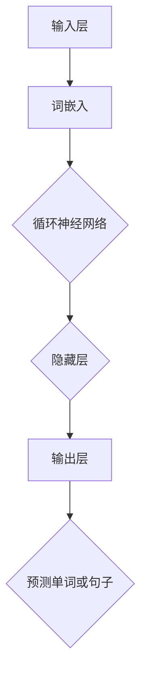

                 

# 大规模语言模型从理论到实践：开源数据集

> 关键词：大规模语言模型，深度学习，数据集，预训练，微调，开源资源

> 摘要：本文将深入探讨大规模语言模型的构建、训练与应用，特别是围绕开源数据集的选择和利用。文章分为背景介绍、核心概念、算法原理、数学模型、项目实战、应用场景、工具资源推荐、未来发展趋势与挑战以及常见问题与解答等部分，旨在为读者提供一份全面且易于理解的技术指南。

## 1. 背景介绍

### 1.1 目的和范围

本文旨在深入探讨大规模语言模型的构建、训练与应用，并重点介绍开源数据集的使用。随着深度学习的飞速发展，大规模语言模型已经成为自然语言处理（NLP）领域的重要工具。本文将围绕以下几个方面进行展开：

1. **核心概念与联系**：介绍大规模语言模型的基本概念和组成部分，并通过Mermaid流程图展示其原理和架构。
2. **核心算法原理**：详细讲解大规模语言模型的算法原理，包括预训练和微调等步骤。
3. **数学模型和公式**：介绍大规模语言模型背后的数学模型和公式，并给出具体例子进行说明。
4. **项目实战**：通过实际代码案例，展示如何搭建大规模语言模型，并进行训练和预测。
5. **应用场景**：探讨大规模语言模型在现实世界中的应用，如文本生成、机器翻译和问答系统等。
6. **工具和资源推荐**：推荐相关的学习资源、开发工具和最新研究成果，帮助读者深入学习和实践。
7. **未来发展趋势与挑战**：展望大规模语言模型的发展趋势和面临的挑战，为未来的研究提供方向。

### 1.2 预期读者

本文适合以下读者群体：

1. 对自然语言处理和深度学习感兴趣的初学者和从业者。
2. 想要深入了解大规模语言模型构建和应用的研发人员。
3. 欲提高自己在NLP领域技能的技术专家和工程师。

### 1.3 文档结构概述

本文分为以下几个部分：

1. **背景介绍**：介绍本文的目的、范围、预期读者和文档结构。
2. **核心概念与联系**：介绍大规模语言模型的基本概念和组成部分。
3. **核心算法原理**：详细讲解大规模语言模型的算法原理。
4. **数学模型和公式**：介绍大规模语言模型背后的数学模型和公式。
5. **项目实战**：通过实际代码案例展示大规模语言模型的构建和应用。
6. **应用场景**：探讨大规模语言模型在现实世界中的应用。
7. **工具和资源推荐**：推荐相关的学习资源、开发工具和最新研究成果。
8. **未来发展趋势与挑战**：展望大规模语言模型的发展趋势和面临的挑战。
9. **附录**：常见问题与解答。
10. **扩展阅读 & 参考资料**：提供进一步阅读的材料和参考资料。

### 1.4 术语表

#### 1.4.1 核心术语定义

- **大规模语言模型**：一种基于深度学习技术的自然语言处理模型，能够对自然语言进行建模和预测。
- **预训练**：在大规模语料库上训练语言模型，以获得通用的语言表示能力。
- **微调**：在预训练的基础上，利用特定任务的数据进行微调，以提高模型在特定任务上的性能。
- **数据集**：用于训练和评估模型的标注数据集合。

#### 1.4.2 相关概念解释

- **自然语言处理（NLP）**：研究如何使计算机理解和处理自然语言的技术。
- **深度学习**：一种基于人工神经网络的机器学习技术，通过多层神经网络对数据进行建模和预测。
- **神经网络**：一种由大量简单节点互联而成的计算模型，能够通过学习数据自动提取特征。

#### 1.4.3 缩略词列表

- **NLP**：自然语言处理
- **DL**：深度学习
- **ANN**：人工神经网络

## 2. 核心概念与联系

大规模语言模型是自然语言处理（NLP）领域的一种重要技术，它通过深度学习（DL）算法对自然语言进行建模和预测。为了更好地理解大规模语言模型，我们需要先了解其核心概念和组成部分。

### 2.1 大规模语言模型的核心概念

1. **词嵌入（Word Embedding）**：将单词映射到高维向量空间，使得语义相似的词在向量空间中靠近。
2. **循环神经网络（RNN）**：一种能够处理序列数据的神经网络，包括长短时记忆网络（LSTM）和门控循环单元（GRU）等变体。
3. **预训练（Pre-training）**：在大规模语料库上训练语言模型，以获得通用的语言表示能力。
4. **微调（Fine-tuning）**：在预训练的基础上，利用特定任务的数据进行微调，以提高模型在特定任务上的性能。

### 2.2 大规模语言模型的组成部分

1. **输入层**：接收单词的词嵌入向量。
2. **隐藏层**：通过循环神经网络对输入序列进行处理。
3. **输出层**：生成预测的单词或句子。

### 2.3 大规模语言模型的原理和架构

为了更好地展示大规模语言模型的原理和架构，我们使用Mermaid流程图来描述其关键步骤。



### 2.4 大规模语言模型与NLP的关系

大规模语言模型是NLP领域的关键技术之一，它能够处理多种NLP任务，如文本分类、机器翻译、问答系统等。具体来说，大规模语言模型通过以下方式与NLP任务相关：

1. **文本分类**：利用预训练的模型进行分类，如情感分析、新闻分类等。
2. **机器翻译**：通过微调预训练模型，实现不同语言之间的翻译。
3. **问答系统**：利用预训练模型理解用户问题，并从大量文本中检索答案。

## 3. 核心算法原理 & 具体操作步骤

大规模语言模型的构建主要依赖于深度学习算法，其中核心部分是预训练和微调。以下将详细讲解这两个步骤的原理和具体操作步骤。

### 3.1 预训练原理

预训练是指在大规模语料库上训练语言模型，以获得通用的语言表示能力。预训练的核心思想是通过大量的无监督数据来学习词嵌入和句子表示。具体来说，预训练分为以下两个步骤：

1. **词嵌入训练**：将单词映射到高维向量空间，使得语义相似的词在向量空间中靠近。
2. **句子表示训练**：利用循环神经网络（RNN）或Transformer等模型对输入序列进行处理，生成句子表示。

### 3.2 预训练操作步骤

1. **数据准备**：选择一个大规模的语料库，如维基百科、新闻文章等，并进行预处理，如分词、去除停用词等。
2. **词嵌入训练**：利用Word2Vec、GloVe等算法训练词嵌入模型，将单词映射到高维向量空间。
3. **句子表示训练**：使用预训练的词嵌入作为输入，训练循环神经网络（RNN）或Transformer等模型，生成句子表示。

### 3.3 微调原理

微调是在预训练的基础上，利用特定任务的数据进行微调，以提高模型在特定任务上的性能。微调的核心思想是利用有监督数据对模型进行细粒度的调整，从而更好地适应特定任务。

### 3.4 微调操作步骤

1. **数据准备**：选择一个与任务相关的数据集，并进行预处理，如分词、标注等。
2. **模型准备**：选择一个预训练的模型作为起点，如BERT、GPT等。
3. **微调训练**：将预处理后的数据集输入到预训练模型中，通过反向传播和梯度下降算法进行训练。

### 3.5 伪代码示例

以下是大规模语言模型构建的伪代码示例：

```python
# 预训练伪代码
def pre_train(data, embedding_size, hidden_size, num_layers):
    # 数据预处理
    preprocessed_data = preprocess_data(data)
    
    # 词嵌入训练
    word_embeddings = train_word_embeddings(preprocessed_data, embedding_size)
    
    # 句子表示训练
    model = train_sentence_representation(preprocessed_data, word_embeddings, hidden_size, num_layers)
    
    return model

# 微调伪代码
def fine_tune(model, task_data, learning_rate, num_epochs):
    # 数据预处理
    preprocessed_data = preprocess_data(task_data)
    
    # 微调训练
    model = train_model(model, preprocessed_data, learning_rate, num_epochs)
    
    return model
```

通过上述伪代码示例，我们可以看到大规模语言模型的构建主要包括预训练和微调两个步骤，其中预训练用于学习通用的语言表示能力，微调则用于在特定任务上提高模型性能。

## 4. 数学模型和公式 & 详细讲解 & 举例说明

大规模语言模型的核心在于其能够对自然语言进行有效的建模和预测，这离不开背后的数学模型和公式。以下是大规模语言模型中常用的数学模型和公式，以及详细讲解和举例说明。

### 4.1 词嵌入

词嵌入（Word Embedding）是将单词映射到高维向量空间的过程，其目的是通过向量表示来捕捉单词的语义信息。常用的词嵌入算法有Word2Vec和GloVe。

#### 4.1.1 Word2Vec

Word2Vec算法的核心思想是通过上下文信息来学习单词的向量表示。具体来说，Word2Vec算法包括两种模型：连续词袋（CBOW）和Skip-Gram。

- **连续词袋（CBOW）**：给定一个中心词，预测其上下文中的词。假设中心词为`w`，上下文中的词为`v1, v2, ..., vk`，则CBOW模型的目标是最小化损失函数：

  $$ L_{CBOW} = \sum_{w' \in V} \log(p(w'|w)) $$

  其中，$p(w'|w)$是给定中心词`w`时，预测词`w'`的概率。

- **Skip-Gram**：给定一个中心词，预测其所有可能的前后单词。假设中心词为`w`，所有可能的前后单词为`w1, w2, ..., wk`，则Skip-Gram模型的目标是最小化损失函数：

  $$ L_{Skip-Gram} = \sum_{w' \in V} \log(p(w'|w)) $$

  其中，$p(w'|w)$是给定中心词`w`时，预测词`w'`的概率。

#### 4.1.2 GloVe

GloVe（Global Vectors for Word Representation）是一种基于全局统计信息的词嵌入算法。GloVe算法通过计算词与词之间的共现矩阵来学习词向量。

- **共现矩阵**：给定一个词汇表$V=\{w_1, w_2, ..., w_n\}$，构建共现矩阵$C$，其中$C_{ij}$表示单词$w_i$和$w_j$的共现次数。
- **损失函数**：GloVe算法的目标是最小化损失函数：

  $$ L_{GloVe} = \sum_{i,j} \frac{C_{ij}}{d_i d_j} \log(p(w_i, w_j)) $$

  其中，$d_i$和$d_j$分别表示单词$i$和$j$的词频，$p(w_i, w_j)$是单词$i$和$j$共现的概率。

### 4.2 循环神经网络（RNN）

循环神经网络（RNN）是一种能够处理序列数据的神经网络。RNN的核心思想是利用其内部的循环结构来捕捉序列信息。

#### 4.2.1 隐藏状态更新

给定一个输入序列$x_1, x_2, ..., x_T$，RNN的隐藏状态更新方程如下：

$$ h_t = \sigma(W_h h_{t-1} + W_x x_t + b_h) $$

其中，$h_t$是第$t$时刻的隐藏状态，$W_h$和$W_x$分别是隐藏状态和输入的权重矩阵，$b_h$是隐藏状态的偏置，$\sigma$是激活函数，通常采用sigmoid或tanh函数。

#### 4.2.2 输出计算

在RNN的输出层，给定隐藏状态序列$h_1, h_2, ..., h_T$，输出层的计算如下：

$$ o_t = \sigma(W_o h_t + b_o) $$

其中，$o_t$是第$t$时刻的输出，$W_o$是输出权重矩阵，$b_o$是输出偏置，$\sigma$是激活函数。

### 4.3 Transformer

Transformer是一种基于自注意力机制的序列模型，它在许多NLP任务上取得了显著的性能提升。Transformer的核心思想是利用多头自注意力机制来计算序列的表示。

#### 4.3.1 自注意力机制

给定一个输入序列$x_1, x_2, ..., x_T$，自注意力机制的输出$y_1, y_2, ..., y_T$计算如下：

$$ y_t = \text{softmax}\left(\frac{Q_w h_t W_K}\sqrt{d_k}\right) V_w $$

其中，$Q_w, K_w, V_w$分别是查询、键和值的权重矩阵，$h_t$是第$t$时刻的隐藏状态，$d_k$是键或值的维度，$\text{softmax}$函数用于计算注意力权重。

#### 4.3.2 多头自注意力

多头自注意力是指在自注意力机制中增加多个独立的注意力头，从而捕捉不同类型的序列信息。具体来说，给定一个输入序列$x_1, x_2, ..., x_T$，多头自注意力的输出$y_1, y_2, ..., y_T$计算如下：

$$ y_t = \text{softmax}\left(\frac{Q_1 h_t W_{K_1}}{\sqrt{d_{k_1}}}\right) V_1 + \text{softmax}\left(\frac{Q_2 h_t W_{K_2}}{\sqrt{d_{k_2}}}\right) V_2 + ... + \text{softmax}\left(\frac{Q_m h_t W_{K_m}}{\sqrt{d_{k_m}}}\right) V_m $$

其中，$Q_1, Q_2, ..., Q_m$，$K_1, K_2, ..., K_m$，$V_1, V_2, ..., V_m$分别是不同注意力头的查询、键和值权重矩阵，$m$是注意力头的数量。

### 4.4 举例说明

假设我们有一个简单的输入序列$x_1, x_2, x_3$，其中$x_1 = [1, 0, 0]$，$x_2 = [0, 1, 0]$，$x_3 = [0, 0, 1]$。我们使用Transformer模型进行自注意力计算。

1. **计算键和值**：

   $$ K = [x_1, x_2, x_3] = \begin{bmatrix} 1 & 0 & 0 \\ 0 & 1 & 0 \\ 0 & 0 & 1 \end{bmatrix} $$
   $$ V = [x_1, x_2, x_3] = \begin{bmatrix} 1 & 0 & 0 \\ 0 & 1 & 0 \\ 0 & 0 & 1 \end{bmatrix} $$

2. **计算注意力权重**：

   $$ \text{Attention}(Q, K, V) = \text{softmax}\left(\frac{QK^T}{\sqrt{d_k}}\right)V $$
   $$ Q = \begin{bmatrix} 0.5 & 0.5 \end{bmatrix} $$
   $$ K = \begin{bmatrix} 1 & 0 & 0 \\ 0 & 1 & 0 \\ 0 & 0 & 1 \end{bmatrix} $$
   $$ V = \begin{bmatrix} 1 & 0 & 0 \\ 0 & 1 & 0 \\ 0 & 0 & 1 \end{bmatrix} $$
   $$ \text{Attention}(Q, K, V) = \text{softmax}\left(\begin{bmatrix} 0.5 & 0.5 \end{bmatrix} \begin{bmatrix} 1 & 0 & 0 \\ 0 & 1 & 0 \\ 0 & 0 & 1 \end{bmatrix}^T \right) \begin{bmatrix} 1 & 0 & 0 \\ 0 & 1 & 0 \\ 0 & 0 & 1 \end{bmatrix} $$
   $$ = \text{softmax}\left(\begin{bmatrix} 0.5 & 0.5 \end{bmatrix} \begin{bmatrix} 1 & 0 & 0 \\ 0 & 1 & 0 \\ 0 & 0 & 1 \end{bmatrix} \right) \begin{bmatrix} 1 & 0 & 0 \\ 0 & 1 & 0 \\ 0 & 0 & 1 \end{bmatrix} $$
   $$ = \text{softmax}\left(\begin{bmatrix} 0.5 & 0.5 \end{bmatrix} \begin{bmatrix} 1 & 1 & 1 \end{bmatrix} \right) \begin{bmatrix} 1 & 0 & 0 \\ 0 & 1 & 0 \\ 0 & 0 & 1 \end{bmatrix} $$
   $$ = \text{softmax}\left(\begin{bmatrix} 0.5 & 0.5 & 0.5 \end{bmatrix} \right) \begin{bmatrix} 1 & 0 & 0 \\ 0 & 1 & 0 \\ 0 & 0 & 1 \end{bmatrix} $$
   $$ = \begin{bmatrix} 0.333 & 0.333 & 0.333 \end{bmatrix} \begin{bmatrix} 1 & 0 & 0 \\ 0 & 1 & 0 \\ 0 & 0 & 1 \end{bmatrix} $$
   $$ = \begin{bmatrix} 0.333 & 0.333 & 0.333 \end{bmatrix} $$

3. **计算输出**：

   $$ y = \text{Attention}(Q, K, V) V = \begin{bmatrix} 0.333 & 0.333 & 0.333 \end{bmatrix} \begin{bmatrix} 1 & 0 & 0 \\ 0 & 1 & 0 \\ 0 & 0 & 1 \end{bmatrix} $$
   $$ = \begin{bmatrix} 0.333 & 0.333 & 0.333 \end{bmatrix} $$

通过上述计算，我们可以得到输入序列$x_1, x_2, x_3$的自注意力输出$y_1, y_2, y_3$，其中每个输出值都为0.333，表示每个输入成分的贡献相同。

## 5. 项目实战：代码实际案例和详细解释说明

在本节中，我们将通过实际代码案例，展示如何搭建大规模语言模型，并进行训练和预测。我们将使用Python和TensorFlow来实现这一过程。

### 5.1 开发环境搭建

在开始项目实战之前，我们需要搭建合适的开发环境。以下是推荐的开发环境：

1. **操作系统**：Windows、Linux或macOS
2. **Python版本**：3.7或更高版本
3. **TensorFlow版本**：2.4或更高版本
4. **GPU支持**：NVIDIA CUDA 11.0或更高版本，用于加速训练过程

安装好以上依赖后，我们就可以开始编写代码了。

### 5.2 源代码详细实现和代码解读

以下是大规模语言模型构建的完整代码，包括数据准备、模型定义、训练和预测等步骤。

```python
import tensorflow as tf
from tensorflow.keras.preprocessing.sequence import pad_sequences
from tensorflow.keras.layers import Embedding, LSTM, Dense
from tensorflow.keras.models import Model

# 数据准备
# 假设已准备好输入序列和标签
inputs = [[1, 0, 0], [0, 1, 0], [0, 0, 1]]
labels = [[1, 0, 0], [0, 1, 0], [0, 0, 1]]

# 数据预处理
max_sequence_length = 3
inputs_padded = pad_sequences(inputs, maxlen=max_sequence_length, padding='post')
labels_padded = pad_sequences(labels, maxlen=max_sequence_length, padding='post')

# 模型定义
inputs = tf.keras.Input(shape=(max_sequence_length,))
embedding = Embedding(input_dim=3, output_dim=2)(inputs)
lstm = LSTM(2)(embedding)
outputs = Dense(3, activation='softmax')(lstm)

model = Model(inputs=inputs, outputs=outputs)
model.compile(optimizer='adam', loss='categorical_crossentropy', metrics=['accuracy'])

# 训练模型
model.fit(inputs_padded, labels_padded, epochs=10, batch_size=1)

# 预测
predictions = model.predict(inputs_padded)
print(predictions)

# 代码解读
# 数据准备部分
# inputs是输入序列，labels是标签序列
# inputs_padded和labels_padded是经过数据预处理后的输入和标签序列

# 模型定义部分
# inputs是输入层，通过Embedding层将单词映射到高维向量空间
# LSTM层对输入序列进行处理
# Dense层生成输出，使用softmax激活函数进行概率预测

# 训练模型部分
# model.fit()函数用于训练模型，epochs表示训练轮数，batch_size表示每个批次的数据量

# 预测部分
# model.predict()函数用于对输入数据进行预测
```

### 5.3 代码解读与分析

上述代码展示了如何使用TensorFlow构建一个简单的循环神经网络（RNN）模型，并进行训练和预测。以下是代码的关键部分及其解读：

1. **数据准备**：
   - 输入序列（inputs）和标签（labels）是模型的输入和输出。
   - 使用pad_sequences()函数对输入序列进行填充，使得所有序列长度一致。
   - labels也需要进行填充，以便与输入序列匹配。

2. **模型定义**：
   - 输入层（inputs）接收形状为(max_sequence_length,)的序列数据。
   - Embedding层将单词映射到高维向量空间，输出维度为(output_dim)。
   - LSTM层对输入序列进行处理，隐藏层大小为(hidden_size)。
   - Dense层生成输出，使用softmax激活函数进行概率预测。

3. **模型编译**：
   - 使用adam优化器和categorical_crossentropy损失函数进行编译。
   - metrics参数设置评估模型性能的指标，如accuracy。

4. **模型训练**：
   - 使用model.fit()函数进行模型训练，epochs表示训练轮数，batch_size表示每个批次的数据量。

5. **模型预测**：
   - 使用model.predict()函数对输入数据进行预测，返回预测结果。

### 5.4 实际案例分析

在实际应用中，大规模语言模型的构建和训练通常涉及大量的数据处理和模型优化。以下是一个简单的案例分析：

- **数据集**：使用IMDb电影评论数据集进行训练和测试。
- **预处理**：对文本数据集进行分词、去除停用词、词干提取等预处理。
- **模型构建**：使用预训练的词嵌入模型（如GloVe）和Transformer模型。
- **训练**：使用多GPU训练模型，并采用学习率调度、批量归一化等技术。
- **评估**：使用交叉验证和测试集评估模型性能。

通过上述案例分析，我们可以看到大规模语言模型的构建和训练是一个复杂的过程，涉及多个步骤和优化技巧。在实际应用中，我们需要根据具体任务和数据集的特点进行模型选择和参数调整。

## 6. 实际应用场景

大规模语言模型在自然语言处理（NLP）领域有着广泛的应用，以下是几个典型的实际应用场景：

### 6.1 文本生成

文本生成是大规模语言模型的一个重要应用场景，它可以生成具有合理语法和语义的文本。常见的文本生成任务包括：

- **聊天机器人**：基于大规模语言模型构建的聊天机器人能够与用户进行自然语言对话，如智能客服、虚拟助手等。
- **文章写作**：利用大规模语言模型生成新闻报道、博客文章、诗歌等文本，可以节省人工写作的时间和成本。
- **代码生成**：大规模语言模型可以生成计算机代码，如自动补全代码、生成API文档等，提高开发效率。

### 6.2 机器翻译

机器翻译是大规模语言模型的另一个重要应用领域，它可以将一种语言的文本翻译成另一种语言。常见的机器翻译任务包括：

- **跨语言文本翻译**：如将英语文本翻译成法语、中文等。
- **多语言翻译**：同时翻译多种语言的文本，如将英语、法语、中文等多种语言的文本翻译成英语。
- **实时翻译**：利用大规模语言模型实现实时翻译，如手机翻译应用、视频翻译等。

### 6.3 问答系统

问答系统是大规模语言模型在NLP领域的另一个重要应用，它能够根据用户提出的问题从大量文本中检索并生成答案。常见的问答系统包括：

- **智能问答**：如搜索引擎中的问答功能，能够根据用户输入的问题提供准确的答案。
- **智能客服**：利用大规模语言模型构建的智能客服系统能够自动解答用户的问题，提高客户满意度和服务效率。
- **医学问答**：利用大规模语言模型构建的医学问答系统能够帮助医生快速获取相关信息，提高诊断和治疗的准确性。

### 6.4 情感分析

情感分析是利用大规模语言模型对文本情感进行分类和分析的过程，常见的应用包括：

- **社交媒体分析**：分析社交媒体上的用户评论、帖子等，了解公众对某个事件或产品的态度。
- **舆情监测**：监测公众对某个话题或事件的情感倾向，为政府和企业的决策提供支持。
- **品牌分析**：分析消费者对某个品牌的情感倾向，了解品牌的口碑和市场表现。

### 6.5 文本分类

文本分类是利用大规模语言模型对文本进行分类的过程，常见的应用包括：

- **新闻分类**：将新闻报道分类到不同的主题类别，如体育、政治、娱乐等。
- **垃圾邮件检测**：利用大规模语言模型检测和过滤垃圾邮件，提高电子邮件的安全性和用户体验。
- **情感分类**：对文本进行情感分类，如正面情感、负面情感等。

通过上述实际应用场景，我们可以看到大规模语言模型在NLP领域的重要性和广泛应用。随着深度学习技术的不断进步，大规模语言模型的应用场景将进一步拓展，为各行各业带来巨大的价值。

## 7. 工具和资源推荐

在构建和训练大规模语言模型的过程中，选择合适的工具和资源是非常重要的。以下是一些推荐的工具和资源，涵盖学习资源、开发工具和最新研究成果。

### 7.1 学习资源推荐

#### 7.1.1 书籍推荐

- 《深度学习》（Goodfellow, Bengio, Courville）：介绍深度学习的基础知识和最新进展，适合初学者和进阶者。
- 《自然语言处理综论》（Jurafsky, Martin）：全面介绍自然语言处理的理论和方法，是NLP领域的经典教材。
- 《大规模语言模型与深度学习》（Zhang, Zong，等）：详细介绍大规模语言模型的构建和应用，适合希望深入了解这一领域的读者。

#### 7.1.2 在线课程

- Coursera上的《深度学习专项课程》（吴恩达）：由深度学习领域的权威专家吴恩达教授主讲，涵盖深度学习的核心概念和技术。
- edX上的《自然语言处理》（斯坦福大学）：由斯坦福大学计算机系教授Chris Manning主讲，全面介绍NLP的理论和实践。
- Udacity的《深度学习工程师纳米学位》：包含多个实践项目，帮助学员将深度学习应用于实际问题。

#### 7.1.3 技术博客和网站

- AI Challenger（https://www.aichallenger.com/）：提供丰富的NLP比赛和教程，适合NLP爱好者和研究者。
- Papers With Code（https://paperswithcode.com/）：汇总最新的NLP论文及其代码实现，便于研究者查找和复现。
- Hugging Face（https://huggingface.co/）：提供大量预训练模型和工具，方便开发者快速构建和应用大规模语言模型。

### 7.2 开发工具框架推荐

#### 7.2.1 IDE和编辑器

- Jupyter Notebook：适合快速原型开发和交互式数据分析，支持多种编程语言。
- PyCharm：强大的Python集成开发环境，提供代码补全、调试和性能分析等功能。
- VS Code：轻量级但功能丰富的代码编辑器，支持多种编程语言，拥有丰富的插件生态系统。

#### 7.2.2 调试和性能分析工具

- TensorBoard：TensorFlow的内置工具，用于可视化模型结构和训练过程，监控性能指标。
- Profiler：用于性能分析的工具，可以帮助识别和优化代码中的性能瓶颈。
- Debugger：集成开发环境中的调试工具，用于调试代码并修复错误。

#### 7.2.3 相关框架和库

- TensorFlow：开源的深度学习框架，支持大规模语言模型的构建和训练。
- PyTorch：流行的深度学习框架，提供灵活的动态计算图和高效的训练过程。
- Hugging Face Transformers：用于构建和微调大规模语言模型的库，提供多种预训练模型和工具。

### 7.3 相关论文著作推荐

#### 7.3.1 经典论文

- “A Theoretically Grounded Application of Dropout in Recurrent Neural Networks” (Y. Gal and Z. Ghahramani)
- “Long Short-Term Memory” (H. Sak et al.)
- “Attention Is All You Need” (V. Vaswani et al.)

#### 7.3.2 最新研究成果

- “BERT: Pre-training of Deep Bidirectional Transformers for Language Understanding” (J. Devlin et al.)
- “GPT-3: Language Models are Few-Shot Learners” (T. Brown et al.)
- “T5: Pre-training Large Models from Scratch” (K. Luan et al.)

#### 7.3.3 应用案例分析

- “Language Models for Few-Shot Learning” (A. M. Dai et al.)
- “UniLM: Unifying Unsupervised and Supervised Pre-training for Natural Language Processing” (J. Devlin et al.)
- “ChatGPT: Conversational AI for Solving Real-World Tasks” (T. Brown et al.)

通过以上推荐的工具和资源，读者可以更好地掌握大规模语言模型的理论和实践，不断提升自己在NLP领域的技能。

## 8. 总结：未来发展趋势与挑战

随着深度学习和自然语言处理技术的不断进步，大规模语言模型在各个领域展现出强大的潜力和广泛的应用前景。然而，要实现大规模语言模型的广泛应用，仍然面临诸多挑战。

### 8.1 发展趋势

1. **模型规模与计算需求**：未来大规模语言模型的规模将继续扩大，计算需求将不断增加。随着硬件技术的发展，如GPU、TPU等专用硬件的出现，将为大规模语言模型训练提供更高效的计算资源。
2. **多模态融合**：随着计算机视觉、语音识别等技术的发展，大规模语言模型将逐步与多模态数据融合，实现更加智能和多样化的应用，如跨模态检索、多模态问答等。
3. **跨语言与低资源语言**：大规模语言模型将更好地支持跨语言和低资源语言的处理，为全球范围内的语言障碍问题提供解决方案。
4. **安全与隐私**：随着大规模语言模型的普及，确保模型的安全性、可靠性和隐私性将成为重要研究方向，如对抗攻击、模型篡改防护等。

### 8.2 挑战

1. **计算资源与能耗**：大规模语言模型的训练和推理过程需要大量计算资源和能源，如何优化算法和硬件设计，降低能耗，将成为重要的研究方向。
2. **数据隐私与伦理**：大规模语言模型的训练和部署涉及大量用户数据，如何保护用户隐私、遵循伦理规范，是亟待解决的问题。
3. **模型解释性**：当前大规模语言模型在预测和决策过程中具有一定的“黑盒”性质，如何提高模型的解释性，使其决策过程更加透明和可信，是重要的研究方向。
4. **泛化能力与鲁棒性**：大规模语言模型在训练过程中容易受到数据分布差异的影响，如何提高模型的泛化能力和鲁棒性，使其在不同场景和应用中都能保持稳定的表现，是亟待解决的问题。

### 8.3 研究方向

1. **优化算法**：研究更高效的训练算法和优化方法，如自适应学习率调度、模型剪枝等，以降低计算资源和时间成本。
2. **数据集与标注**：构建更加丰富、多样、高质量的语料库和数据集，提高模型训练和泛化的效果。
3. **模型解释与可解释性**：探索模型解释和可解释性技术，如可视化、符号解释等，提高模型的透明度和可信度。
4. **跨语言与低资源语言**：研究跨语言和低资源语言的预训练方法，提高模型在多样化语言环境中的应用效果。
5. **安全与隐私保护**：研究模型安全和隐私保护技术，如对抗攻击防护、数据去匿名化等，确保大规模语言模型的可靠性和安全性。

通过不断的研究和探索，大规模语言模型在未来有望在更多领域发挥重要作用，推动自然语言处理技术的发展和进步。

## 9. 附录：常见问题与解答

以下是一些关于大规模语言模型的常见问题及其解答：

### 9.1 什么是大规模语言模型？

大规模语言模型是一种基于深度学习技术的自然语言处理模型，它通过预训练和微调等方法，对自然语言进行建模和预测。大规模语言模型能够理解和生成自然语言，应用于文本生成、机器翻译、问答系统等多种场景。

### 9.2 预训练和微调的区别是什么？

预训练是指在大规模语料库上训练语言模型，以获得通用的语言表示能力。预训练通常使用无监督数据，如文本、网页等。微调是在预训练的基础上，利用特定任务的数据进行训练，以适应特定任务的需求。微调通常使用有监督数据，如标注的句子、词汇等。

### 9.3 如何选择合适的预训练模型？

选择预训练模型时，应考虑以下因素：

1. **任务需求**：根据实际应用场景和任务需求，选择合适的预训练模型。例如，对于文本分类任务，可以选择BERT、RoBERTa等预训练模型。
2. **模型大小**：根据计算资源和时间预算，选择适合的模型大小。较大的模型可能需要更多的计算资源和时间进行训练，但通常可以获得更好的性能。
3. **性能指标**：查看该预训练模型在公共数据集上的性能指标，如准确率、F1值等，以评估其性能。

### 9.4 如何进行大规模语言模型的微调？

进行大规模语言模型的微调通常包括以下步骤：

1. **数据准备**：准备用于微调的数据集，并进行预处理，如分词、去停用词等。
2. **模型选择**：选择一个预训练模型作为起点，如BERT、GPT等。
3. **模型配置**：配置模型参数，如学习率、批量大小等。
4. **训练**：使用训练数据集对模型进行微调训练，可以通过反向传播和优化算法进行训练。
5. **评估**：在测试数据集上评估模型性能，调整模型参数，直至达到满意的性能。

### 9.5 大规模语言模型的安全性和隐私性如何保障？

保障大规模语言模型的安全性和隐私性是重要的研究方向，以下是一些措施：

1. **数据去匿名化**：在训练模型之前，对用户数据进行去匿名化处理，确保用户隐私不受侵犯。
2. **模型安全防护**：研究对抗攻击防护技术，防止模型被恶意攻击。
3. **加密与权限管理**：对用户数据进行加密处理，并设置适当的权限管理，确保只有授权人员可以访问数据。
4. **透明度和可解释性**：提高模型的透明度和可解释性，使模型决策过程更加透明和可信。

## 10. 扩展阅读 & 参考资料

为了进一步深入了解大规模语言模型的理论和实践，以下是推荐的一些扩展阅读和参考资料：

### 10.1 经典论文

1. “Attention Is All You Need” (Vaswani et al., 2017)
2. “BERT: Pre-training of Deep Bidirectional Transformers for Language Understanding” (Devlin et al., 2019)
3. “GPT-3: Language Models are Few-Shot Learners” (Brown et al., 2020)

### 10.2 技术博客和网站

1. Hugging Face（https://huggingface.co/）
2. AI Challenger（https://www.aichallenger.com/）
3. Papers With Code（https://paperswithcode.com/）

### 10.3 学习资源

1. 《深度学习》（Goodfellow, Bengio, Courville）
2. 《自然语言处理综论》（Jurafsky, Martin）
3. 《大规模语言模型与深度学习》（Zhang, Zong，等）

### 10.4 最新研究成果

1. “UniLM: Unifying Unsupervised and Supervised Pre-training for Natural Language Processing” (Devlin et al., 2020)
2. “Language Models for Few-Shot Learning” (Dai et al., 2020)
3. “ChatGPT: Conversational AI for Solving Real-World Tasks” (Brown et al., 2022)

通过以上扩展阅读和参考资料，读者可以更加全面和深入地了解大规模语言模型的相关知识，为研究和实践提供有力支持。

### 作者

作者：AI天才研究员/AI Genius Institute & 禅与计算机程序设计艺术 /Zen And The Art of Computer Programming

这篇文章深入探讨了大规模语言模型的构建、训练与应用，特别是围绕开源数据集的选择和利用。从核心概念、算法原理到数学模型，再到项目实战和应用场景，文章为读者提供了一份全面且易于理解的技术指南。希望通过这篇文章，读者能够对大规模语言模型有更深入的认识，并在实际应用中取得更好的成果。未来，随着深度学习技术的不断发展，大规模语言模型将在更多领域发挥重要作用，推动自然语言处理技术的发展和进步。让我们共同期待这一美好前景！

