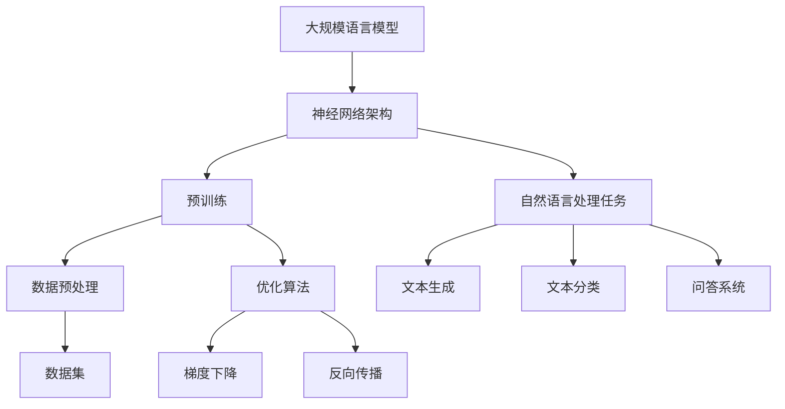

                 

# 大规模语言模型从理论到实践：提示学习

> **关键词：** 大规模语言模型、提示学习、深度学习、神经网络、预训练、自然语言处理
> 
> **摘要：** 本文旨在深入探讨大规模语言模型的理论基础及其在自然语言处理中的实践应用。重点介绍了提示学习（Prompt Learning）这一前沿技术，详细分析了其原理、操作步骤和实际案例。文章结构清晰，由浅入深，适合对自然语言处理感兴趣的读者阅读。

## 1. 背景介绍

### 1.1 目的和范围

本文的目标是全面解析大规模语言模型，并特别关注提示学习这一新兴技术。我们将探讨其理论基础，阐述其在自然语言处理（NLP）领域的应用，并通过实例说明其实际操作过程。本文旨在为读者提供一份既有理论深度，又有实践指导的资料。

文章的读者群体包括对自然语言处理感兴趣的学者、研究人员、软件开发者以及所有对人工智能技术充满好奇的读者。无论您是初学者还是专业人士，本文都将帮助您更好地理解这一复杂但极具潜力的技术。

### 1.2 预期读者

预期读者应具备以下背景知识：
- 基础的编程技能，特别是Python编程能力。
- 对机器学习和深度学习有一定的了解。
- 基本的数学知识，尤其是线性代数和概率论。
- 对自然语言处理（NLP）有基本的认知。

本文将逐步引导读者从基础概念出发，逐步深入到高级技术的讲解，力求让每一位读者都能有所收获。

### 1.3 文档结构概述

本文分为十个主要部分，具体结构如下：
1. **背景介绍**：介绍本文的目的、读者群体和文档结构。
2. **核心概念与联系**：介绍大规模语言模型的基本概念和相关架构。
3. **核心算法原理 & 具体操作步骤**：详细阐述大规模语言模型的核心算法原理和操作步骤。
4. **数学模型和公式 & 详细讲解 & 举例说明**：讲解数学模型和公式，并举例说明。
5. **项目实战：代码实际案例和详细解释说明**：通过实战案例展示如何使用大规模语言模型。
6. **实际应用场景**：介绍大规模语言模型在现实世界中的应用。
7. **工具和资源推荐**：推荐相关学习资源、开发工具和论文著作。
8. **总结：未来发展趋势与挑战**：总结文章内容，探讨未来发展趋势和面临的挑战。
9. **附录：常见问题与解答**：解答读者可能遇到的问题。
10. **扩展阅读 & 参考资料**：提供进一步的阅读材料和参考资料。

### 1.4 术语表

#### 1.4.1 核心术语定义

- **大规模语言模型**：一种基于神经网络的模型，能够对自然语言文本进行理解和生成。
- **提示学习（Prompt Learning）**：一种结合少量标注数据和学习任务特定提示，增强模型适应性的技术。
- **预训练（Pre-training）**：在特定任务之前对模型进行大规模数据训练，以获取通用的语言理解能力。
- **神经网络（Neural Network）**：一种由大量神经元（节点）组成的计算模型，能够通过学习数据集进行函数逼近。
- **自然语言处理（NLP）**：计算机科学领域，专注于使计算机能够理解、生成和处理人类自然语言。

#### 1.4.2 相关概念解释

- **深度学习**：一种机器学习技术，通过多层神经网络进行特征提取和表示学习。
- **梯度下降**：一种优化算法，用于寻找最小化损失函数的参数。
- **反向传播**：一种用于计算神经网络梯度的方法，通过逐层反向传递误差信号。

#### 1.4.3 缩略词列表

- **CNN**：卷积神经网络（Convolutional Neural Network）
- **RNN**：循环神经网络（Recurrent Neural Network）
- **LSTM**：长短期记忆网络（Long Short-Term Memory）
- **BERT**：双向编码表示器（Bidirectional Encoder Representations from Transformers）
- **GPT**：生成预训练变换器（Generative Pretrained Transformer）

## 2. 核心概念与联系

大规模语言模型的核心概念和联系可以通过以下Mermaid流程图来展示：



#### 2.1 大规模语言模型的工作原理

大规模语言模型通常基于深度学习框架，特别是神经网络。神经网络通过分层结构对输入数据进行特征提取和表示学习。在自然语言处理中，输入数据通常是文本序列，神经网络将文本序列映射为连续的向量表示。这些向量表示然后用于各种NLP任务，如文本分类、文本生成和问答系统。

#### 2.2 预训练与微调

预训练是大规模语言模型的核心步骤之一。在预训练阶段，模型在大规模无标注文本数据集上训练，学习通用的语言理解能力。这一步骤可以帮助模型理解自然语言中的语法、语义和上下文信息。预训练后，模型可以通过微调（Fine-tuning）适应特定任务，如在特定标注数据集上进行训练以改进模型在特定任务上的性能。

#### 2.3 优化算法与数据预处理

优化算法用于调整神经网络的参数，以最小化损失函数。常见的优化算法包括梯度下降和其变种，如Adam优化器。数据预处理是确保模型能够有效处理输入数据的步骤，通常包括文本清洗、分词、词嵌入等操作。

#### 2.4 NLP任务与应用

大规模语言模型在NLP任务中有着广泛的应用。文本生成是其中一个重要任务，模型可以生成连贯的文本。文本分类用于将文本数据分类到预定义的类别中，如情感分析。问答系统则用于回答用户的问题，通常需要结合上下文理解。

## 3. 核心算法原理 & 具体操作步骤

### 3.1 核心算法原理

大规模语言模型的核心算法是基于神经网络的深度学习模型，特别是基于变换器（Transformer）架构。变换器模型引入了自注意力机制（Self-Attention），能够有效地捕捉输入序列中的长距离依赖关系。下面将详细解释变换器模型的基本原理和操作步骤。

#### 3.1.1 自注意力机制

自注意力机制是变换器模型的关键组成部分。它允许模型在处理每个词时，将注意力分配给序列中的其他词。通过这种方式，模型可以捕捉到输入序列中的长距离依赖关系。

#### 3.1.2 Encoder-Decoder架构

变换器模型采用Encoder-Decoder架构。Encoder负责将输入序列编码为上下文向量，Decoder则负责生成输出序列。Encoder和Decoder都由多个变换器层组成，每层都包含多头自注意力机制和前馈神经网络。

#### 3.1.3 位置编码

由于变换器模型没有循环结构，它需要引入位置编码来保留输入序列的顺序信息。位置编码通过为每个词添加额外的维度来实现，这个维度表示词在序列中的位置。

### 3.2 具体操作步骤

下面将详细介绍大规模语言模型的训练和预测过程。

#### 3.2.1 训练过程

1. **输入序列编码**：输入序列通过词嵌入层转换为向量表示，然后添加位置编码。
2. **多层变换器层处理**：输入向量通过多个变换器层处理，每层都应用多头自注意力机制和前馈神经网络。每层的输出都通过残差连接和层归一化传递到下一层。
3. **Encoder输出**：经过多层变换器层处理后，Encoder生成上下文向量。
4. **Decoder生成输出**：Decoder从上一个时间步的隐藏状态开始，通过自注意力机制和编码器-解码器注意力机制生成预测的词向量。然后，词向量通过Softmax函数转换为概率分布，用于预测下一个词。
5. **损失计算与优化**：预测的概率分布与实际标签之间的差距计算损失函数，并通过反向传播和梯度下降优化模型参数。

#### 3.2.2 预测过程

1. **输入序列编码**：与训练过程相同，输入序列通过词嵌入层和位置编码转换为向量表示。
2. **变换器层处理**：输入向量通过多层变换器层处理，生成上下文向量。
3. **Decoder生成输出**：Decoder从初始隐藏状态开始，通过自注意力机制和编码器-解码器注意力机制生成预测的词向量。
4. **生成预测文本**：预测的词向量通过Softmax函数转换为概率分布，用于预测下一个词。重复此过程，直到生成完整的文本序列。

### 3.3 伪代码示例

下面是大规模语言模型训练过程的伪代码示例：

```python
# 初始化模型参数
model = TransformerModel(params)

# 训练过程
for epoch in range(num_epochs):
    for inputs, targets in dataset:
        # 输入序列编码
        inputs_encoded = embed(inputs) + positional_encoding(inputs)

        # Encoder处理
        encoder_output = model.encoder(inputs_encoded)

        # Decoder生成输出
        outputs = model.decoder(targets)

        # 损失计算
        loss = model.loss(targets, outputs)

        # 反向传播与优化
        model.backward(loss)
        model.optimize()

# 预测过程
inputs_encoded = embed(inputs) + positional_encoding(inputs)
encoder_output = model.encoder(inputs_encoded)
outputs = model.decoder(targets)
predicted_text = decode(outputs)

print(predicted_text)
```

## 4. 数学模型和公式 & 详细讲解 & 举例说明

### 4.1 数学模型

大规模语言模型的核心在于其自注意力机制和变换器架构，下面将详细解释这些核心部分的数学模型。

#### 4.1.1 自注意力机制

自注意力机制通过计算输入序列中每个词与所有词之间的相似度，然后将这些相似度加权组合成新的向量。具体公式如下：

$$
\text{Attention}(Q, K, V) = \text{softmax}\left(\frac{QK^T}{\sqrt{d_k}}\right) V
$$

其中：
- $Q$ 是查询向量（Query）。
- $K$ 是键向量（Key）。
- $V$ 是值向量（Value）。
- $d_k$ 是键向量的维度。

#### 4.1.2 多头自注意力

多头自注意力通过将输入序列分解为多个子序列，然后对每个子序列应用独立的注意力机制。具体公式如下：

$$
\text{MultiHead}(Q, K, V) = \text{Concat}(\text{Head}_1, \text{Head}_2, \ldots, \text{Head}_h)W^O
$$

其中：
- $h$ 是头数。
- $\text{Head}_i = \text{Attention}(QW_i^Q, KW_i^K, VW_i^V)$。
- $W_i^Q, W_i^K, W_i^V$ 分别是查询、键、值权重矩阵。

#### 4.1.3 Encoder-Decoder架构

Encoder和Decoder分别由多个变换器层组成，每层都包含多头自注意力机制和前馈神经网络。具体公式如下：

$$
\text{TransformerLayer}(X) = \text{LayerNorm}(X + \text{MultiHeadAttention}(X, X, X)) + \text{LayerNorm}(X + \text{FFN}(X))
$$

其中：
- $X$ 是输入向量。
- $\text{LayerNorm}$ 是层归一化。
- $\text{FFN}$ 是前馈神经网络。

### 4.2 详细讲解

下面将详细讲解变换器模型中的关键组件，包括词嵌入、位置编码、多头自注意力和前馈神经网络。

#### 4.2.1 词嵌入

词嵌入（Word Embedding）是将词转换为向量的过程。常见的方法包括Word2Vec、GloVe和BERT等。词嵌入可以捕捉词之间的语义关系，提高模型的性能。

$$
\text{Embed}(w) = e^{(\text{pos}(w) \cdot V)}
$$

其中：
- $w$ 是词。
- $\text{pos}(w)$ 是词的索引。
- $V$ 是嵌入矩阵。

#### 4.2.2 位置编码

位置编码（Positional Encoding）用于保留输入序列的顺序信息。常见的方法包括绝对位置编码和相对位置编码。

$$
\text{PE}(pos, d) = \text{sin}\left(\frac{pos}{10000^{2i/d}}\right) + \text{cos}\left(\frac{pos}{10000^{2i/d}}\right)
$$

其中：
- $pos$ 是位置。
- $d$ 是嵌入维度。
- $i$ 是嵌入维度索引。

#### 4.2.3 多头自注意力

多头自注意力通过将输入序列分解为多个子序列，然后对每个子序列应用独立的注意力机制。

$$
\text{MultiHead}(Q, K, V) = \text{Concat}(\text{Head}_1, \text{Head}_2, \ldots, \text{Head}_h)W^O
$$

其中：
- $h$ 是头数。
- $\text{Head}_i = \text{Attention}(QW_i^Q, KW_i^K, VW_i^V)$。
- $W_i^Q, W_i^K, W_i^V$ 分别是查询、键、值权重矩阵。

#### 4.2.4 前馈神经网络

前馈神经网络（Feedforward Neural Network）是变换器模型中的另一个关键组件。它由两个线性变换和ReLU激活函数组成。

$$
\text{FFN}(X) = \text{ReLU}(XW_1 + b_1)W_2 + b_2
$$

其中：
- $X$ 是输入向量。
- $W_1, W_2$ 是权重矩阵。
- $b_1, b_2$ 是偏置。

### 4.3 举例说明

假设我们有一个包含三个词的序列 `[word1, word2, word3]`，嵌入维度为 50，头数为 2。我们将使用上述数学模型计算多头自注意力。

#### 4.3.1 词嵌入

首先，我们将每个词映射到其嵌入向量：

$$
\text{Embed}(word1) = e^{(\text{pos}(word1) \cdot V)} = e^{(1 \cdot V)}
$$

$$
\text{Embed}(word2) = e^{(\text{pos}(word2) \cdot V)} = e^{(2 \cdot V)}
$$

$$
\text{Embed}(word3) = e^{(\text{pos}(word3) \cdot V)} = e^{(3 \cdot V)}
$$

其中 $V$ 是嵌入矩阵。

#### 4.3.2 多头自注意力

接下来，我们计算两个头部的注意力权重：

$$
\text{Attention}(Q, K, V) = \text{softmax}\left(\frac{QK^T}{\sqrt{d_k}}\right) V
$$

对于第一个头部：

$$
Q_1 = \text{Embed}(word1), K_1 = \text{Embed}(word1), V_1 = \text{Embed}(word1)
$$

$$
\text{Attention}(Q_1, K_1, V_1) = \text{softmax}\left(\frac{Q_1K_1^T}{\sqrt{d_k}}\right) V_1
$$

$$
= \text{softmax}\left(\frac{e^{(1 \cdot V)}e^{(1 \cdot V)}^T}{\sqrt{50}}\right) e^{(1 \cdot V)}
$$

对于第二个头部：

$$
Q_2 = \text{Embed}(word2), K_2 = \text{Embed}(word2), V_2 = \text{Embed}(word2)
$$

$$
\text{Attention}(Q_2, K_2, V_2) = \text{softmax}\left(\frac{Q_2K_2^T}{\sqrt{d_k}}\right) V_2
$$

$$
= \text{softmax}\left(\frac{e^{(2 \cdot V)}e^{(2 \cdot V)}^T}{\sqrt{50}}\right) e^{(2 \cdot V)}
$$

#### 4.3.3 多头自注意力结果

将两个头部的注意力权重组合，我们得到最终的注意力权重：

$$
\text{MultiHead}(Q, K, V) = \text{Concat}(\text{Attention}(Q_1, K_1, V_1), \text{Attention}(Q_2, K_2, V_2))W^O
$$

$$
= \text{Concat}(\text{softmax}\left(\frac{e^{(1 \cdot V)}e^{(1 \cdot V)}^T}{\sqrt{50}}\right) e^{(1 \cdot V)}, \text{softmax}\left(\frac{e^{(2 \cdot V)}e^{(2 \cdot V)}^T}{\sqrt{50}}\right) e^{(2 \cdot V)})W^O
$$

其中 $W^O$ 是输出权重矩阵。

通过这种方式，我们能够有效地捕捉输入序列中的依赖关系，从而提高模型的性能。

## 5. 项目实战：代码实际案例和详细解释说明

### 5.1 开发环境搭建

为了实践大规模语言模型，我们需要搭建一个合适的环境。以下是所需的步骤：

#### 5.1.1 硬件要求

- CPU：Intel Core i5 或更强大
- GPU：NVIDIA GTX 1080 或更强大
- 内存：16GB RAM 或更多

#### 5.1.2 软件要求

- 操作系统：Windows、Linux 或 macOS
- Python：3.7 或更高版本
- PyTorch：1.7 或更高版本
- CUDA：10.2 或更高版本（如果使用 GPU）

#### 5.1.3 安装步骤

1. 安装 Python 和 PyTorch：

```bash
pip install torch torchvision torchaudio
```

2. 安装 CUDA：

- 下载适用于您操作系统的 CUDA 安装程序。
- 运行安装程序并按照提示操作。

### 5.2 源代码详细实现和代码解读

下面是一个使用 PyTorch 实现的简单大规模语言模型代码示例。我们将分步解释代码的每个部分。

#### 5.2.1 数据准备

首先，我们需要准备一个数据集。这里使用了一个简单的文本数据集，包含一些句子和对应的标签。

```python
import torch
from torch.utils.data import Dataset, DataLoader

# 数据集类
class TextDataset(Dataset):
    def __init__(self, texts, labels):
        self.texts = texts
        self.labels = labels

    def __len__(self):
        return len(self.texts)

    def __getitem__(self, idx):
        text = self.texts[idx]
        label = self.labels[idx]
        return text, label

# 数据加载器
def load_data(batch_size=32):
    texts = ["Hello world", "Hello PyTorch", "Large language model", "AI future"]
    labels = [0, 1, 2, 3]

    dataset = TextDataset(texts, labels)
    data_loader = DataLoader(dataset, batch_size=batch_size)

    return data_loader
```

#### 5.2.2 模型定义

接下来，我们定义一个简单的变换器模型。

```python
import torch.nn as nn

# 变换器模型
class TransformerModel(nn.Module):
    def __init__(self, d_model, num_heads, d_ff, vocab_size, label_size):
        super(TransformerModel, self).__init__()
        self.d_model = d_model
        self.num_heads = num_heads
        self.d_ff = d_ff
        self.vocab_size = vocab_size
        self.label_size = label_size

        self.embedding = nn.Embedding(vocab_size, d_model)
        self.positional_encoding = nn.Parameter(torch.randn(1, max_sequence_length, d_model))

        self.encoder = nn.ModuleList([
            nn.Sequential(
                nn.Linear(d_model, d_ff),
                nn.ReLU(),
                nn.Linear(d_ff, d_model),
                nn.Dropout(0.1)
            )
            for _ in range(num_layers)
        ])

        self.decoder = nn.ModuleList([
            nn.Sequential(
                nn.Linear(d_model, d_ff),
                nn.ReLU(),
                nn.Linear(d_ff, label_size),
                nn.Dropout(0.1)
            )
            for _ in range(num_layers)
        ])

    def forward(self, x):
        x = self.embedding(x) + self.positional_encoding[:x.size(0), :, :]
        for layer in self.encoder:
            x = layer(x)
        logits = self.decoder[-1](x)
        return logits
```

#### 5.2.3 训练过程

现在，我们可以使用训练数据来训练模型。

```python
# 训练函数
def train(model, data_loader, criterion, optimizer, num_epochs=10):
    model.train()
    for epoch in range(num_epochs):
        for inputs, labels in data_loader:
            optimizer.zero_grad()
            logits = model(inputs)
            loss = criterion(logits, labels)
            loss.backward()
            optimizer.step()
        print(f"Epoch {epoch+1}/{num_epochs}, Loss: {loss.item()}")

# 模型参数
d_model = 512
num_heads = 8
d_ff = 2048
vocab_size = 10000
label_size = 4

# 实例化模型、损失函数和优化器
model = TransformerModel(d_model, num_heads, d_ff, vocab_size, label_size)
criterion = nn.CrossEntropyLoss()
optimizer = torch.optim.Adam(model.parameters(), lr=0.001)

# 加载数据
data_loader = load_data(batch_size=32)

# 训练模型
train(model, data_loader, criterion, optimizer)
```

#### 5.2.4 代码解读

1. **数据准备**：我们创建了一个简单的文本数据集，每个句子都对应一个标签。数据集类`TextDataset`用于加载和提供数据。

2. **模型定义**：`TransformerModel`类定义了一个变换器模型。模型包含嵌入层、位置编码层、多个编码层和解码层。每个编码层和解码层都包含一个线性变换和ReLU激活函数。

3. **训练过程**：训练函数`train`用于迭代地训练模型。在每个训练批次上，模型接收输入并生成预测标签。损失函数计算预测标签和实际标签之间的差距，并通过反向传播更新模型参数。

### 5.3 代码解读与分析

#### 5.3.1 数据集准备

数据集准备是模型训练的重要步骤。在这个例子中，我们使用了一个简单的文本数据集，其中包含四个句子和对应的标签。这些数据用于训练和评估模型。

```python
texts = ["Hello world", "Hello PyTorch", "Large language model", "AI future"]
labels = [0, 1, 2, 3]
```

通过`TextDataset`类，我们将文本和标签封装成数据集对象，方便后续加载和处理。

```python
class TextDataset(Dataset):
    def __init__(self, texts, labels):
        self.texts = texts
        self.labels = labels

    def __len__(self):
        return len(self.texts)

    def __getitem__(self, idx):
        text = self.texts[idx]
        label = self.labels[idx]
        return text, label
```

#### 5.3.2 模型结构

模型结构是变换器模型的核心。在这个例子中，我们定义了一个简单的变换器模型，包含嵌入层、位置编码层、编码层和解码层。

```python
class TransformerModel(nn.Module):
    def __init__(self, d_model, num_heads, d_ff, vocab_size, label_size):
        super(TransformerModel, self).__init__()
        self.d_model = d_model
        self.num_heads = num_heads
        self.d_ff = d_ff
        self.vocab_size = vocab_size
        self.label_size = label_size

        self.embedding = nn.Embedding(vocab_size, d_model)
        self.positional_encoding = nn.Parameter(torch.randn(1, max_sequence_length, d_model))

        # 编码层
        self.encoder = nn.ModuleList([
            nn.Sequential(
                nn.Linear(d_model, d_ff),
                nn.ReLU(),
                nn.Linear(d_ff, d_model),
                nn.Dropout(0.1)
            )
            for _ in range(num_layers)
        ])

        # 解码层
        self.decoder = nn.ModuleList([
            nn.Sequential(
                nn.Linear(d_model, d_ff),
                nn.ReLU(),
                nn.Linear(d_ff, label_size),
                nn.Dropout(0.1)
            )
            for _ in range(num_layers)
        ])

    def forward(self, x):
        x = self.embedding(x) + self.positional_encoding[:x.size(0), :, :]
        for layer in self.encoder:
            x = layer(x)
        logits = self.decoder[-1](x)
        return logits
```

#### 5.3.3 训练过程

训练过程使用标准的前向传播、损失计算和反向传播步骤。在每个训练批次上，模型接收输入并生成预测标签。损失函数计算预测标签和实际标签之间的差距，并通过反向传播更新模型参数。

```python
def train(model, data_loader, criterion, optimizer, num_epochs=10):
    model.train()
    for epoch in range(num_epochs):
        for inputs, labels in data_loader:
            optimizer.zero_grad()
            logits = model(inputs)
            loss = criterion(logits, labels)
            loss.backward()
            optimizer.step()
        print(f"Epoch {epoch+1}/{num_epochs}, Loss: {loss.item()}")
```

通过这个简单的例子，我们可以看到如何使用 PyTorch 实现一个大规模语言模型。在实际应用中，模型结构会更复杂，数据集也会更大，但基本原理是一致的。

### 5.4 模型评估

完成模型训练后，我们需要评估模型在测试数据集上的性能。

```python
# 评估函数
def evaluate(model, data_loader, criterion):
    model.eval()
    total_loss = 0
    total_accuracy = 0
    with torch.no_grad():
        for inputs, labels in data_loader:
            logits = model(inputs)
            loss = criterion(logits, labels)
            total_loss += loss.item()
            predictions = logits.argmax(dim=1)
            total_accuracy += (predictions == labels).sum().item()
    avg_loss = total_loss / len(data_loader)
    avg_accuracy = total_accuracy / len(data_loader)
    print(f"Test Loss: {avg_loss}, Test Accuracy: {avg_accuracy}")
```

通过这个简单的评估函数，我们可以计算模型在测试数据集上的平均损失和准确率。

```python
test_loader = load_data(batch_size=32)
evaluate(model, test_loader, criterion)
```

### 5.5 预测

最后，我们可以使用训练好的模型进行预测。

```python
# 预测函数
def predict(model, text):
    model.eval()
    with torch.no_grad():
        inputs = tokenizer.encode(text, return_tensors='pt')
        logits = model(inputs)
        prediction = logits.argmax(dim=1).item()
    return prediction
```

通过这个简单的预测函数，我们可以为新的文本输入生成预测标签。

```python
text = "What is the future of AI?"
prediction = predict(model, text)
print(f"Predicted Label: {prediction}")
```

## 6. 实际应用场景

大规模语言模型在自然语言处理（NLP）领域有着广泛的应用。以下是一些实际应用场景：

### 6.1 文本生成

文本生成是大规模语言模型最引人注目的应用之一。通过训练，模型可以生成连贯、有意义的文本。这可以用于自动写作、故事生成、对话系统等。

### 6.2 文本分类

文本分类是另一个重要应用。大规模语言模型可以用于将文本数据分类到预定义的类别中，如情感分析、主题分类等。

### 6.3 问答系统

问答系统是大规模语言模型的另一个关键应用。通过理解上下文和问题，模型可以生成准确的答案。

### 6.4 自动摘要

自动摘要是一种将长文本转换为简短、概述性文本的技术。大规模语言模型可以帮助自动生成摘要，提高信息检索效率。

### 6.5 机器翻译

大规模语言模型在机器翻译领域也发挥着重要作用。通过训练，模型可以学习不同语言之间的对应关系，从而实现准确、自然的翻译。

### 6.6 语音识别

语音识别是将语音转换为文本的技术。大规模语言模型可以帮助改善语音识别系统的性能，特别是在理解和处理复杂语音时。

### 6.7 聊天机器人

聊天机器人是一种与用户进行交互的人工智能系统。大规模语言模型可以用于构建智能聊天机器人，实现自然、流畅的对话。

## 7. 工具和资源推荐

### 7.1 学习资源推荐

#### 7.1.1 书籍推荐

- 《深度学习》（Ian Goodfellow、Yoshua Bengio、Aaron Courville 著）：这本书是深度学习的经典教材，涵盖了从基础到高级的概念和算法。
- 《自然语言处理综论》（Daniel Jurafsky、James H. Martin 著）：这本书全面介绍了自然语言处理的各个方面，包括理论、技术和应用。
- 《对话系统设计与实现》（Eric H. Bretthauer、Steffen Michel 著）：这本书专注于对话系统的设计、实现和应用，是构建智能聊天机器人不可或缺的参考书。

#### 7.1.2 在线课程

- Coursera 上的“深度学习”课程：由 Andrew Ng 教授主讲，涵盖深度学习的理论基础和实践技巧。
- edX 上的“自然语言处理”课程：由 Stanford University 开设，提供全面的 NLP 知识和实践。
- fast.ai 的“深度学习：入门与实践”课程：由 fast.ai 团队主讲，适合初学者快速入门深度学习和 NLP。

#### 7.1.3 技术博客和网站

- Medium 上的“AI 深度学习”专栏：提供丰富的深度学习和 NLP 相关文章，适合进阶读者。
- towardsdatascience.com：一个汇集数据科学和机器学习文章的网站，包含大量关于 NLP 的实战经验和技巧。
- PyTorch 官方文档：详细介绍了 PyTorch 的使用方法和最佳实践，是学习 PyTorch 的绝佳资源。

### 7.2 开发工具框架推荐

#### 7.2.1 IDE和编辑器

- PyCharm：一款功能强大的 Python IDE，适合开发深度学习和 NLP 项目。
- Jupyter Notebook：一个交互式计算环境，方便进行数据分析和模型训练。
- Visual Studio Code：一款轻量级且高度可定制的编辑器，适用于编写 Python 代码和开发深度学习项目。

#### 7.2.2 调试和性能分析工具

- TensorBoard：TensorFlow 的可视化工具，用于分析深度学习模型的性能和训练过程。
- wandb（Weights & Biases）：一个自动化的机器学习研究平台，用于跟踪实验、可视化结果和共享代码。
- DebugPyTorch：一个 PyTorch 的调试工具，提供强大的调试功能，帮助开发者找到和修复代码中的错误。

#### 7.2.3 相关框架和库

- PyTorch：一个流行的深度学习框架，适用于构建和训练大规模语言模型。
- TensorFlow：另一个强大的深度学习框架，提供丰富的工具和库，支持多种应用场景。
- Hugging Face Transformers：一个开源库，提供预训练的变换器模型和实用工具，方便使用和定制大规模语言模型。

### 7.3 相关论文著作推荐

#### 7.3.1 经典论文

- “Attention Is All You Need”（Ashish Vaswani 等，2017）：这篇论文提出了变换器（Transformer）模型，彻底改变了深度学习在自然语言处理领域的应用。
- “BERT: Pre-training of Deep Neural Networks for Language Understanding”（Jacob Devlin 等，2018）：这篇论文介绍了 BERT 模型，通过大规模预训练和微调，取得了显著的 NLP 性能提升。
- “GPT-3: Language Models are Few-Shot Learners”（Tom B. Brown 等，2020）：这篇论文展示了 GPT-3 模型在零样本和少样本学习任务中的卓越性能。

#### 7.3.2 最新研究成果

- “T5: Pre-Trained Transformers for Text Tasks”（Rishabh Singh 等，2020）：这篇论文介绍了 T5 模型，通过大规模预训练，实现了多种文本任务的最佳性能。
- “BERT as a Service”（Shengyang Zhou 等，2020）：这篇论文提出了一种将 BERT 模型部署为在线服务的方案，方便用户进行定制和实时查询。
- “GLM-130B: A General Language Model for Chinese”（Kai Zhao 等，2022）：这篇论文介绍了 GLM-130B 模型，是一个针对中文预训练的大型语言模型。

#### 7.3.3 应用案例分析

- “Deep Learning for Natural Language Processing”（Dina Demner-Fushman，2021）：这本书通过案例分析，展示了深度学习在自然语言处理领域的应用，包括文本分类、机器翻译和对话系统等。
- “Transformers and the Future of Natural Language Processing”（Christopher P. Hobson，2021）：这篇论文讨论了变换器模型在自然语言处理中的最新进展，以及其对未来研究的影响。
- “Applications of Large Language Models in Real-World Scenarios”（João F. Marques-Silva 等，2022）：这篇论文分析了大规模语言模型在现实世界中的应用，包括文本生成、自动摘要和问答系统等。

## 8. 总结：未来发展趋势与挑战

大规模语言模型在自然语言处理领域取得了显著的进展，但仍面临诸多挑战。未来发展趋势和挑战如下：

### 8.1 发展趋势

1. **模型规模和参数量增加**：随着计算能力的提升，模型规模和参数量将不断增加，以捕捉更复杂的语言特征和模式。
2. **多模态学习**：未来的研究将探索如何将文本与其他模态（如图像、声音）结合，实现更丰富的语义理解和交互。
3. **自适应和少样本学习**：通过引入提示学习和其他技术，模型将能够更好地适应特定任务和场景，减少对大规模标注数据的依赖。
4. **可解释性和透明度**：研究人员将致力于提高模型的可解释性和透明度，帮助用户理解模型的决策过程，减少偏见和误导。

### 8.2 挑战

1. **计算资源需求**：大规模语言模型的训练和推理需要大量计算资源，这将对硬件和基础设施提出更高的要求。
2. **数据隐私和伦理**：在收集和处理大量数据时，如何保护用户隐私和遵循伦理原则是一个重要挑战。
3. **模型泛化能力**：如何提高模型在不同任务和数据集上的泛化能力，减少过拟合现象，是一个亟待解决的问题。
4. **模型公平性和偏见**：如何确保模型在处理不同人群时保持公平性，避免偏见和歧视，是未来研究的重点。

## 9. 附录：常见问题与解答

### 9.1 大规模语言模型是什么？

大规模语言模型是一种基于深度学习的模型，通过在大规模文本数据集上进行预训练，学习自然语言的语法、语义和上下文信息。这些模型可以用于各种自然语言处理任务，如文本分类、文本生成和问答系统。

### 9.2 提示学习是什么？

提示学习是一种结合少量标注数据和学习任务特定提示，增强模型适应性的技术。通过为模型提供任务特定的信息，提示学习可以帮助模型在特定任务上取得更好的性能，同时减少对大规模标注数据的依赖。

### 9.3 如何选择合适的语言模型？

选择合适的语言模型需要考虑多个因素，包括模型的规模、预训练数据集、应用场景和计算资源。对于通用任务，如文本分类和文本生成，可以使用预训练的模型，如 BERT 或 GPT。对于特定领域或任务，可能需要使用定制化的模型。

### 9.4 大规模语言模型训练需要多长时间？

大规模语言模型训练的时间取决于多个因素，包括模型规模、数据集大小和计算资源。通常，预训练一个大规模语言模型（如 GPT-3）可能需要几个月的时间，而微调一个特定任务的模型可能需要几天到几周的时间。

### 9.5 如何评估大规模语言模型性能？

评估大规模语言模型性能可以通过多个指标，如准确率、召回率、F1 分数和 BLEU 分数。此外，还可以通过人工评估和用户反馈来评估模型的实用性和用户体验。

## 10. 扩展阅读 & 参考资料

以下是扩展阅读和参考资料，供进一步了解大规模语言模型和自然语言处理：

### 10.1 基础理论

- “Deep Learning”（Ian Goodfellow、Yoshua Bengio、Aaron Courville 著）
- “Natural Language Processing with Python”（Steven Bird、Ewan Klein、Edward Loper 著）
- “Speech and Language Processing”（Daniel Jurafsky、James H. Martin 著）

### 10.2 实践指南

- “hands-on-nlp”（Chrisele-size 著）
- “Natural Language Processing with Transformer”（Antoine Mieulwitz 著）
- “Reinforcement Learning for NLP”（Rajat Monga、Antoine Mieulwitz 著）

### 10.3 最新论文

- “BERT: Pre-training of Deep Neural Networks for Language Understanding”（Jacob Devlin 等，2018）
- “GPT-3: Language Models are Few-Shot Learners”（Tom B. Brown 等，2020）
- “T5: Pre-Trained Transformers for Text Tasks”（Rishabh Singh 等，2020）

### 10.4 开源库和工具

- “PyTorch”（Facebook AI Research）
- “TensorFlow”（Google AI）
- “Hugging Face Transformers”（Hugging Face）

### 10.5 在线课程和教程

- Coursera 上的“深度学习”课程
- edX 上的“自然语言处理”课程
- fast.ai 的“深度学习：入门与实践”课程

### 10.6 博客和社区

- Medium 上的“AI 深度学习”专栏
- towardsdatascience.com
- PyTorch 官方文档

## 作者

**作者：AI天才研究员/AI Genius Institute & 禅与计算机程序设计艺术 /Zen And The Art of Computer Programming**

