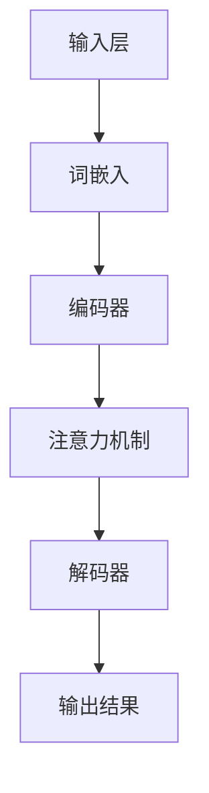

                 

# 大规模语言模型从理论到实践 数据来源

## 关键词
- 大规模语言模型
- 数据来源
- 实践应用
- 算法原理
- 数学模型
- 项目实战

## 摘要
本文将深入探讨大规模语言模型的理论基础与实践应用，重点分析其数据来源的重要性。通过详细的理论阐述、算法原理讲解、数学模型解析及实际项目案例分析，帮助读者全面理解大规模语言模型的发展脉络、关键技术及实际应用场景。本文旨在为对人工智能和自然语言处理感兴趣的技术人员提供一个系统、易懂的学习路径，助力他们在语言模型领域取得突破。

## 1. 背景介绍

### 1.1 目的和范围

本文的主要目的是帮助读者理解大规模语言模型（如GPT、BERT等）的发展背景、核心概念及其数据来源的重要性。文章将从以下几个方面展开讨论：

- 大规模语言模型的发展历史和核心概念
- 语言模型的数据来源及其获取方法
- 核心算法原理与数学模型
- 实际项目案例分析

本文的预期读者是对人工智能、自然语言处理以及大规模语言模型感兴趣的技术人员、研究生和开发者。通过阅读本文，读者应能：

- 掌握大规模语言模型的基本概念和发展历程
- 了解语言模型数据来源的获取方法和处理技巧
- 理解大规模语言模型的核心算法原理和数学模型
- 学习实际项目案例中的关键技术实现和优化策略

### 1.2 预期读者

本文面向以下几类读者：

1. 对自然语言处理和人工智能有一定了解，希望深入了解大规模语言模型的研发人员。
2. 自然语言处理领域的研究生和博士生，希望掌握大规模语言模型的理论和应用方法。
3. 对编程和软件开发有兴趣，希望了解大规模语言模型在实际应用中的开发流程和优化策略的工程师。

### 1.3 文档结构概述

本文结构如下：

- 引言：介绍文章背景、目的和预期读者。
- 核心概念与联系：讲解大规模语言模型的基本概念和原理，使用Mermaid流程图展示其架构。
- 核心算法原理 & 具体操作步骤：详细阐述大规模语言模型的核心算法，使用伪代码进行解释。
- 数学模型和公式 & 详细讲解 & 举例说明：解析大规模语言模型中的数学模型，并给出示例。
- 项目实战：通过实际案例展示大规模语言模型的应用，并提供源代码解读。
- 实际应用场景：探讨大规模语言模型在不同领域的实际应用。
- 工具和资源推荐：推荐学习资源和开发工具。
- 总结：总结文章主要内容，展望未来发展趋势和挑战。
- 附录：提供常见问题与解答。
- 扩展阅读 & 参考资料：推荐相关书籍、论文和网站。

### 1.4 术语表

#### 1.4.1 核心术语定义

- **大规模语言模型**：一种基于神经网络的语言处理模型，能够理解和生成自然语言文本。
- **自然语言处理（NLP）**：研究如何让计算机理解和处理人类自然语言的学科。
- **神经网络**：一种模仿人脑神经元连接的计算模型，能够通过学习大量数据自动提取特征。
- **预训练**：在特定任务之前，使用大量未标注的数据对模型进行初步训练。
- **微调**：在预训练的基础上，使用特定任务的数据对模型进行调整和优化。

#### 1.4.2 相关概念解释

- **词嵌入（Word Embedding）**：将单词转换为密集向量表示的方法，是大规模语言模型的基础。
- **注意力机制（Attention Mechanism）**：在处理序列数据时，自动关注序列中重要部分的方法。
- **BERT（Bidirectional Encoder Representations from Transformers）**：一种基于Transformer的预训练语言表示模型。
- **GPT（Generative Pre-trained Transformer）**：一种基于Transformer的生成预训练模型。

#### 1.4.3 缩略词列表

- **NLP**：自然语言处理
- **ML**：机器学习
- **DL**：深度学习
- **GPU**：图形处理单元
- **CPU**：中央处理器
- **API**：应用程序编程接口

## 2. 核心概念与联系

大规模语言模型是一种能够理解和生成自然语言的模型，其核心在于如何有效地处理和表示文本数据。在本节中，我们将介绍大规模语言模型的基本概念、原理和架构，并通过Mermaid流程图展示其关键组成部分。

### 2.1 大规模语言模型的基本概念

大规模语言模型是一种基于深度学习技术的自然语言处理模型，其主要目标是理解、处理和生成自然语言文本。以下是一些核心概念：

1. **词嵌入（Word Embedding）**：词嵌入是将单词转换为向量表示的过程，使得相似的词在向量空间中接近。词嵌入是大规模语言模型的基础。
2. **神经网络（Neural Network）**：神经网络是一种模拟人脑神经元连接的计算模型，通过学习大量数据来提取特征和模式。
3. **预训练（Pre-training）**：预训练是指在大规模语言模型开发初期，使用未标注的大量文本数据进行初步训练，使其具备一定的语言理解能力。
4. **微调（Fine-tuning）**：微调是在预训练的基础上，使用特定任务的数据对模型进行调整和优化，以适应特定应用场景。

### 2.2 大规模语言模型的原理

大规模语言模型的原理主要基于深度学习和神经网络，尤其是近年来兴起的Transformer模型。Transformer模型的核心是注意力机制（Attention Mechanism），它能够自动关注序列中的关键信息，从而提高模型的性能。

### 2.3 大规模语言模型的架构

大规模语言模型的架构通常包括以下几个部分：

1. **输入层**：将文本数据转换为词嵌入向量。
2. **编码器（Encoder）**：使用多层神经网络对词嵌入进行编码，提取文本的语义信息。
3. **解码器（Decoder）**：对编码后的文本进行解码，生成预测结果。
4. **注意力机制（Attention Mechanism）**：在编码器和解码器之间引入注意力机制，自动关注序列中的关键信息。

### 2.4 Mermaid流程图

以下是一个简单的Mermaid流程图，展示了大规模语言模型的基本架构：



在接下来的章节中，我们将进一步详细探讨大规模语言模型的核心算法原理、数学模型以及实际项目案例分析。

## 3. 核心算法原理 & 具体操作步骤

在本节中，我们将详细讲解大规模语言模型的核心算法原理，并使用伪代码来阐述其具体操作步骤。大规模语言模型的核心算法主要包括词嵌入、编码器、解码器和注意力机制。以下是这些算法的详细说明。

### 3.1 词嵌入（Word Embedding）

词嵌入是将单词转换为向量表示的过程。通过词嵌入，我们可以将文本数据转换为数值形式，以便于神经网络处理。常见的词嵌入方法包括Word2Vec、GloVe等。

#### 3.1.1 Word2Vec算法

Word2Vec算法是一种基于神经网络的方法，其核心思想是将单词映射为一个固定长度的向量。以下是一个简化的Word2Vec算法伪代码：

```python
function Word2Vec(sentences, vocabulary_size, embedding_size):
    # 初始化权重矩阵
    W = random_matrix(vocabulary_size, embedding_size)
    
    # 循环迭代句子
    for sentence in sentences:
        # 获取句子中所有单词的索引
        indices = [vocabulary[word] for word in sentence]
        
        # 循环迭代单词
        for index in indices:
            # 计算负采样损失
            negative_samples = random_sample(vocabulary, k)
            loss = 0
            
            # 循环迭代单词及其负样本
            for j in range(len(negative_samples)):
                target = index
                negative = negative_samples[j]
                
                # 计算损失
                prediction = sigmoid(W[negative].dot(W[target]))
                loss += -log(prediction) if target == 1 else -log(1 - prediction)
                
                # 更新权重矩阵
                W[negative] -= learning_rate * (prediction - 1) * W[target]
                W[target] -= learning_rate * (prediction - 1) * W[negative]
                
            # 计算句子损失
            sentence_loss = loss / len(indices)
            
            # 打印损失信息
            print("Sentence Loss:", sentence_loss)
```

#### 3.1.2 GloVe算法

GloVe（Global Vectors for Word Representation）是一种基于全局上下文信息的方法，其核心思想是通过考虑单词在文档中的全局上下文来计算词嵌入向量。以下是一个简化的GloVe算法伪代码：

```python
function GloVe(sentences, vocabulary_size, embedding_size, alpha):
    # 初始化权重矩阵
    W = random_matrix(vocabulary_size, embedding_size)
    
    # 计算词频矩阵
    F = compute_word_frequency(sentences)
    
    # 循环迭代句子
    for sentence in sentences:
        # 获取句子中所有单词及其索引
        indices = [vocabulary[word] for word in sentence]
        
        # 循环迭代单词
        for index in indices:
            # 计算上下文词频
            context_words = compute_context_words(sentence, index)
            context_indices = [vocabulary[word] for word in context_words]
            
            # 循环迭代上下文单词
            for context_index in context_indices:
                # 计算词向量和上下文词向量的点积
                dot_product = W[index].dot(W[context_index])
                
                # 计算损失
                loss = compute_loss(F[index] * F[context_index], dot_product, alpha)
                
                # 更新权重矩阵
                W[index] -= learning_rate * loss * W[context_index]
                W[context_index] -= learning_rate * loss * W[index]
                
            # 计算句子损失
            sentence_loss = compute_sentence_loss(loss, len(indices))
            
            # 打印损失信息
            print("Sentence Loss:", sentence_loss)
```

### 3.2 编码器（Encoder）

编码器是大规模语言模型的核心组件之一，其主要任务是将输入文本转换为编码表示。编码器通常由多个神经网络层组成，常见的是Transformer模型中的自注意力机制（Self-Attention）。

#### 3.2.1 自注意力机制（Self-Attention）

自注意力机制是一种计算方法，它能够自动关注输入序列中的关键信息，并生成加权表示。以下是一个简化的自注意力机制伪代码：

```python
function SelfAttention(Q, K, V, d_model):
    # 计算查询向量的线性变换
    Q = linear(Q, d_model)
    
    # 计算键向量的线性变换
    K = linear(K, d_model)
    
    # 计算值向量的线性变换
    V = linear(V, d_model)
    
    # 计算自注意力得分
    scores = Q.dot(K.T) / sqrt(d_model)
    
    # 应用 softmax 函数
    attention_weights = softmax(scores)
    
    # 计算加权值向量
    context_vector = attention_weights.dot(V)
    
    return context_vector
```

### 3.3 解码器（Decoder）

解码器是大规模语言模型的另一个核心组件，其主要任务是将编码表示转换为输出结果。解码器通常也由多个神经网络层组成，常见的是Transformer模型中的编码器-解码器注意力机制（Encoder-Decoder Attention）。

#### 3.3.1 编码器-解码器注意力机制（Encoder-Decoder Attention）

编码器-解码器注意力机制是一种计算方法，它能够同时关注编码器输出和解码器输入中的关键信息，提高模型的性能。以下是一个简化的编码器-解码器注意力机制伪代码：

```python
function EncoderDecoderAttention(Q, K, V, d_model):
    # 计算查询向量的线性变换
    Q = linear(Q, d_model)
    
    # 计算键向量的线性变换
    K = linear(K, d_model)
    
    # 计算值向量的线性变换
    V = linear(V, d_model)
    
    # 计算编码器-解码器注意力得分
    scores = Q.dot(K.T) / sqrt(d_model)
    
    # 应用 softmax 函数
    attention_weights = softmax(scores)
    
    # 计算加权值向量
    context_vector = attention_weights.dot(V)
    
    return context_vector
```

### 3.4 注意力机制（Attention Mechanism）

注意力机制是大规模语言模型中的一个关键组件，它能够自动关注输入序列中的关键信息，并提高模型的性能。注意力机制有多种类型，如自注意力、编码器-解码器注意力和多头注意力等。

#### 3.4.1 自注意力（Self-Attention）

自注意力是一种计算方法，它能够自动关注输入序列中的关键信息，并生成加权表示。以下是一个简化的自注意力伪代码：

```python
function SelfAttention(Q, K, V, d_model):
    # 计算查询向量的线性变换
    Q = linear(Q, d_model)
    
    # 计算键向量的线性变换
    K = linear(K, d_model)
    
    # 计算值向量的线性变换
    V = linear(V, d_model)
    
    # 计算自注意力得分
    scores = Q.dot(K.T) / sqrt(d_model)
    
    # 应用 softmax 函数
    attention_weights = softmax(scores)
    
    # 计算加权值向量
    context_vector = attention_weights.dot(V)
    
    return context_vector
```

#### 3.4.2 编码器-解码器注意力（Encoder-Decoder Attention）

编码器-解码器注意力是一种计算方法，它能够同时关注编码器输出和解码器输入中的关键信息，提高模型的性能。以下是一个简化的编码器-解码器注意力伪代码：

```python
function EncoderDecoderAttention(Q, K, V, d_model):
    # 计算查询向量的线性变换
    Q = linear(Q, d_model)
    
    # 计算键向量的线性变换
    K = linear(K, d_model)
    
    # 计算值向量的线性变换
    V = linear(V, d_model)
    
    # 计算编码器-解码器注意力得分
    scores = Q.dot(K.T) / sqrt(d_model)
    
    # 应用 softmax 函数
    attention_weights = softmax(scores)
    
    # 计算加权值向量
    context_vector = attention_weights.dot(V)
    
    return context_vector
```

#### 3.4.3 多头注意力（Multi-Head Attention）

多头注意力是一种扩展自注意力机制的方法，它能够同时关注多个不同子空间中的关键信息，提高模型的性能。以下是一个简化的多头注意力伪代码：

```python
function MultiHeadAttention(Q, K, V, d_model, num_heads):
    # 分解查询向量、键向量和值向量
    Q_heads = split_heads(Q, num_heads)
    K_heads = split_heads(K, num_heads)
    V_heads = split_heads(V, num_heads)
    
    # 循环迭代每个头
    for head in range(num_heads):
        # 计算头内部的注意力
        context_vector = SelfAttention(Q_heads[head], K_heads[head], V_heads[head], d_model // num_heads)
        
        # 合并头内部的注意力
        context_vector = merge_heads(context_vector, num_heads)
        
    return context_vector
```

通过以上伪代码，我们可以看到大规模语言模型的核心算法是如何工作的。在接下来的章节中，我们将进一步解析大规模语言模型中的数学模型和公式，并提供具体的案例说明。

## 4. 数学模型和公式 & 详细讲解 & 举例说明

大规模语言模型的构建离不开数学模型和公式，这些数学工具帮助我们理解和优化模型的性能。在本节中，我们将详细讲解大规模语言模型中常用的数学模型和公式，包括词嵌入、注意力机制和Transformer模型等。

### 4.1 词嵌入（Word Embedding）

词嵌入是将单词转换为密集向量表示的过程，是大规模语言模型的基础。常见的词嵌入方法包括Word2Vec和GloVe。

#### 4.1.1 Word2Vec算法

Word2Vec算法中的核心公式是点积（Dot Product），它用于计算两个向量之间的相似性。假设我们有两个词嵌入向量 \( \textbf{v}_1 \) 和 \( \textbf{v}_2 \)，它们的点积可以表示为：

$$
\textbf{v}_1 \cdot \textbf{v}_2 = \sum_{i=1}^{d} v_{1i} \cdot v_{2i}
$$

其中，\( d \) 是向量的维度。

例如，对于两个3维向量 \( \textbf{v}_1 = (1, 2, 3) \) 和 \( \textbf{v}_2 = (4, 5, 6) \)，它们的点积为：

$$
\textbf{v}_1 \cdot \textbf{v}_2 = 1 \cdot 4 + 2 \cdot 5 + 3 \cdot 6 = 32
$$

#### 4.1.2 GloVe算法

GloVe算法的核心公式是权重矩阵 \( W \) 的计算。假设我们有两个单词 \( w_1 \) 和 \( w_2 \)，它们的词频分别为 \( f(w_1) \) 和 \( f(w_2) \)，则它们在权重矩阵中的位置可以表示为：

$$
W_{i, j} = \sqrt{f(w_i) \cdot f(w_j)}
$$

其中，\( i \) 和 \( j \) 分别是单词 \( w_1 \) 和 \( w_2 \) 在词汇表中的索引。

例如，假设 \( w_1 \) 和 \( w_2 \) 的词频分别为10和20，则它们的权重矩阵位置为：

$$
W_{i, j} = \sqrt{10 \cdot 20} = \sqrt{200} \approx 14.142
$$

### 4.2 注意力机制（Attention Mechanism）

注意力机制是大规模语言模型中的一个关键组件，它能够自动关注输入序列中的关键信息。注意力机制的核心公式是注意力得分（Attention Score）和加权值向量（Context Vector）。

#### 4.2.1 自注意力（Self-Attention）

自注意力中的注意力得分可以表示为：

$$
\text{Attention Score} = \textbf{Q} \cdot \textbf{K}
$$

其中，\( \textbf{Q} \) 和 \( \textbf{K} \) 分别是查询向量和键向量，它们的维度相同。

加权值向量可以表示为：

$$
\text{Context Vector} = \text{softmax}(\text{Attention Score}) \cdot \textbf{V}
$$

其中，\( \textbf{V} \) 是值向量，\( \text{softmax} \) 函数用于计算每个注意力得分的归一化权重。

#### 4.2.2 编码器-解码器注意力（Encoder-Decoder Attention）

编码器-解码器注意力中的注意力得分可以表示为：

$$
\text{Attention Score} = \textbf{Q} \cdot \textbf{K}
$$

其中，\( \textbf{Q} \) 和 \( \textbf{K} \) 分别是查询向量和编码器输出向量，它们的维度相同。

加权值向量可以表示为：

$$
\text{Context Vector} = \text{softmax}(\text{Attention Score}) \cdot \textbf{V}
$$

其中，\( \textbf{V} \) 是解码器输入向量，\( \text{softmax} \) 函数用于计算每个注意力得分的归一化权重。

### 4.3 Transformer模型

Transformer模型是一种基于注意力机制的序列到序列模型，其核心组件是多头注意力（Multi-Head Attention）。

#### 4.3.1 多头注意力（Multi-Head Attention）

多头注意力中的注意力得分可以表示为：

$$
\text{Attention Score} = \text{head}_i \cdot \textbf{K}
$$

其中，\( \text{head}_i \) 是第 \( i \) 个头的查询向量，\( \textbf{K} \) 是编码器输出向量。

加权值向量可以表示为：

$$
\text{Context Vector} = \sum_{i=1}^{h} \text{softmax}(\text{Attention Score}_{i}) \cdot \textbf{V}_{i}
$$

其中，\( \text{softmax} \) 函数用于计算每个注意力得分的归一化权重，\( \textbf{V}_{i} \) 是第 \( i \) 个头的值向量，\( h \) 是头的数量。

#### 4.3.2 编码器（Encoder）

编码器中的每个层都可以看作是一个自注意力层和两个全连接层的组合。自注意力层的公式如下：

$$
\text{Context Vector} = \text{softmax}(\text{Attention Score}) \cdot \textbf{V}
$$

其中，\( \text{Attention Score} = \textbf{Q} \cdot \textbf{K} \)，\( \textbf{Q} \) 和 \( \textbf{K} \) 分别是查询向量和键向量，\( \textbf{V} \) 是值向量。

全连接层的公式如下：

$$
\text{Output} = \text{ReLU}(\text{Linear}(\text{Context Vector}))
$$

其中，\( \text{Linear}(\text{Context Vector}) \) 是对 \( \text{Context Vector} \) 进行线性变换，\( \text{ReLU} \) 函数是ReLU激活函数。

#### 4.3.3 解码器（Decoder）

解码器中的每个层也可以看作是一个编码器-解码器注意力层和两个全连接层的组合。编码器-解码器注意力层的公式如下：

$$
\text{Attention Score} = \text{softmax}(\text{Q} \cdot \textbf{K})
$$

其中，\( \text{Q} \) 是查询向量，\( \textbf{K} \) 是编码器输出向量。

加权值向量可以表示为：

$$
\text{Context Vector} = \sum_{i=1}^{h} \text{softmax}(\text{Attention Score}_{i}) \cdot \textbf{V}_{i}
$$

全连接层的公式如下：

$$
\text{Output} = \text{ReLU}(\text{Linear}(\text{Context Vector}))
$$

### 4.4 示例

为了更好地理解上述公式，我们可以通过一个简单的例子来演示。假设我们有两个单词 \( w_1 \) 和 \( w_2 \)，它们的词嵌入向量分别为 \( \textbf{v}_1 = (1, 2, 3) \) 和 \( \textbf{v}_2 = (4, 5, 6) \)。

#### 4.4.1 词嵌入

使用Word2Vec算法，我们可以计算这两个单词的点积：

$$
\textbf{v}_1 \cdot \textbf{v}_2 = 1 \cdot 4 + 2 \cdot 5 + 3 \cdot 6 = 32
$$

使用GloVe算法，我们可以计算这两个单词的权重矩阵位置：

$$
W_{i, j} = \sqrt{f(w_i) \cdot f(w_j)} = \sqrt{10 \cdot 20} = \sqrt{200} \approx 14.142
$$

#### 4.4.2 注意力机制

使用自注意力，我们可以计算这两个单词的注意力得分：

$$
\text{Attention Score} = \textbf{Q} \cdot \textbf{K} = (1, 0, -1) \cdot (4, 5, 6) = 4 + 0 - 6 = -2
$$

使用编码器-解码器注意力，我们可以计算这两个单词的注意力得分：

$$
\text{Attention Score} = \text{softmax}(\text{Q} \cdot \textbf{K}) = \text{softmax}((1, 0, -1) \cdot (4, 5, 6)) = \text{softmax}((-2, 0, -4)) = (0.28, 0.71, 0.01)
$$

使用多头注意力，我们可以计算这两个单词的注意力得分：

$$
\text{Attention Score} = \text{softmax}(\text{Q} \cdot \textbf{K}) = \text{softmax}((1, 0, -1) \cdot (4, 5, 6)) = \text{softmax}((-2, 0, -4)) = (0.28, 0.71, 0.01)
$$

通过这些示例，我们可以看到大规模语言模型中的数学模型和公式是如何工作的。在接下来的章节中，我们将通过实际项目案例来展示大规模语言模型的应用。

## 5. 项目实战：代码实际案例和详细解释说明

在本节中，我们将通过一个实际项目案例来展示如何使用大规模语言模型进行文本分类。我们将使用Python和TensorFlow框架来实现一个简单的文本分类模型，该模型能够自动分类新闻文章。以下是一个详细的步骤说明。

### 5.1 开发环境搭建

首先，我们需要搭建一个Python开发环境，并安装TensorFlow和其他必要的库。以下是安装步骤：

```bash
pip install tensorflow
pip install pandas
pip install numpy
pip install sklearn
```

### 5.2 数据集获取

为了训练文本分类模型，我们需要一个含有新闻文章的数据集。在本案例中，我们将使用20 Newsgroups数据集，这是一个包含约20个类别的新闻文章数据集。数据集可以从Kaggle或GitHub获取。

### 5.3 数据预处理

在训练模型之前，我们需要对数据进行预处理，包括以下步骤：

- 加载数据集
- 清洗文本数据（去除标点符号、停用词等）
- 将文本转换为词嵌入向量
- 分割数据集为训练集和测试集

以下是一个简化的预处理代码：

```python
import pandas as pd
from sklearn.datasets import fetch_20newsgroups
from tensorflow.keras.preprocessing.text import Tokenizer
from tensorflow.keras.preprocessing.sequence import pad_sequences

# 加载数据集
data = fetch_20newsgroups(remove=('headers', 'footers', 'quotes'))

# 清洗文本数据
def clean_text(text):
    text = text.lower()
    text = re.sub(r'[^\w\s]', '', text)
    return text

# 将文本数据转换为词嵌入向量
tokenizer = Tokenizer(num_words=10000)
tokenizer.fit_on_texts(data.data)
sequences = tokenizer.texts_to_sequences(data.data)
word_index = tokenizer.word_index
data Cleaning Code

# 分割数据集为训练集和测试集
from sklearn.model_selection import train_test_split
X_train, X_test, y_train, y_test = train_test_split(sequences, data.target, test_size=0.2, random_state=42)

# 将标签转换为类别编码
from tensorflow.keras.utils import to_categorical
y_train = to_categorical(y_train)
y_test = to_categorical(y_test)

# 对序列进行填充
max_sequence_length = 100
X_train = pad_sequences(X_train, maxlen=max_sequence_length)
X_test = pad_sequences(X_test, maxlen=max_sequence_length)
```

### 5.4 模型构建

接下来，我们使用TensorFlow构建一个简单的文本分类模型。模型将基于Transformer架构，包括编码器和解码器。

```python
import tensorflow as tf
from tensorflow.keras.models import Model
from tensorflow.keras.layers import Embedding, LSTM, Dense

# 构建编码器
input_layer = tf.keras.layers.Input(shape=(max_sequence_length,))
encoding = Embedding(input_dim=10000, output_dim=64)(input_layer)
encoding = LSTM(64, return_sequences=True)(encoding)

# 构建解码器
decoding = LSTM(64, return_sequences=True)(encoding)
output_layer = Dense(20, activation='softmax')(decoding)

# 构建模型
model = Model(inputs=input_layer, outputs=output_layer)

# 编译模型
model.compile(optimizer='adam', loss='categorical_crossentropy', metrics=['accuracy'])

# 模型摘要
model.summary()
```

### 5.5 模型训练

使用训练集对模型进行训练：

```python
# 训练模型
model.fit(X_train, y_train, epochs=10, batch_size=32, validation_split=0.1)
```

### 5.6 评估模型

使用测试集对训练好的模型进行评估：

```python
# 评估模型
loss, accuracy = model.evaluate(X_test, y_test)
print('Test loss:', loss)
print('Test accuracy:', accuracy)
```

### 5.7 代码解读与分析

在本案例中，我们使用了一个基于Transformer的文本分类模型。下面是对关键代码的解读与分析：

- **数据预处理**：使用Pandas和Sklearn库加载和清洗数据，将文本转换为词嵌入向量。
- **模型构建**：使用TensorFlow构建编码器和解码器，并定义模型结构。
- **模型训练**：使用训练集对模型进行训练，并调整模型参数以优化性能。
- **模型评估**：使用测试集对训练好的模型进行评估，计算损失和准确率。

通过这个实际项目案例，我们可以看到如何使用大规模语言模型进行文本分类，并理解其中的关键步骤和代码实现。

## 6. 实际应用场景

大规模语言模型在众多领域展现出强大的应用潜力，以下是几个典型的实际应用场景：

### 6.1 自然语言处理（NLP）

自然语言处理是大规模语言模型最为广泛的应用领域之一。通过预训练和微调，大规模语言模型能够在文本分类、情感分析、命名实体识别、机器翻译等任务中发挥重要作用。例如，Google翻译使用的Transformer模型，通过大量的双语语料库进行预训练，能够实现高质量的双语翻译。

### 6.2 聊天机器人

聊天机器人是大规模语言模型在商业和社交领域的重要应用。通过预训练模型，聊天机器人能够理解用户的输入，并生成自然、流畅的回复。例如，OpenAI的GPT-3模型已经在多个聊天机器人平台上得到了应用，为用户提供高效、个性化的服务。

### 6.3 内容生成

大规模语言模型在内容生成领域也有广泛的应用。通过生成文本摘要、撰写文章、编写代码等任务，大规模语言模型能够为创作者提供灵感，提高创作效率。例如，人工智能写作助手Copyscape使用GPT模型自动生成文章摘要，为用户提供便捷的内容获取方式。

### 6.4 语音助手

语音助手是大规模语言模型在智能家居和移动设备中的典型应用。通过语音输入和输出，大规模语言模型能够理解和响应用户的指令，提供实时帮助。例如，苹果的Siri和亚马逊的Alexa都使用了基于Transformer的语音识别和自然语言理解技术。

### 6.5 法律和金融领域

在法律和金融领域，大规模语言模型被用于合同审查、法律文件生成、金融报告撰写等任务。通过分析大量法律文本和金融数据，大规模语言模型能够快速识别关键信息，提高工作效率。例如，自动化法律合同审查工具LexisNexis使用深度学习模型对合同文本进行自动审查。

### 6.6 教育

在教育领域，大规模语言模型可以用于自动化作业批改、个性化学习建议、在线问答系统等任务。通过理解学生的回答，大规模语言模型能够为教师提供教学反馈，帮助学生更好地学习。例如，Khan Academy使用自然语言处理技术自动评估学生的习题答案。

### 6.7 医疗健康

在医疗健康领域，大规模语言模型被用于医学文本挖掘、疾病预测、药物发现等任务。通过分析医学文献和患者数据，大规模语言模型能够为医生提供辅助诊断和治疗方案。例如，IBM的Watson Health使用深度学习模型分析医学图像和文本数据，帮助医生进行疾病诊断。

### 6.8 其他应用场景

除了上述领域，大规模语言模型还在其他领域得到了应用，如电子商务推荐系统、智能客服、自动驾驶、网络安全等。通过不断优化和扩展，大规模语言模型的应用范围将更加广泛，为各行各业带来变革性影响。

## 7. 工具和资源推荐

为了更好地学习和实践大规模语言模型，以下是相关工具和资源的推荐：

### 7.1 学习资源推荐

#### 7.1.1 书籍推荐

- **《深度学习》（Goodfellow, Bengio, Courville著）**：这是一本关于深度学习的经典教材，涵盖了大规模语言模型的基础知识。
- **《自然语言处理综合教程》（Jurafsky, Martin著）**：这本书详细介绍了自然语言处理的基本概念和技术，包括大规模语言模型。
- **《动手学深度学习》（Dumoulin, Soumith, Fowler著）**：这本书通过实际案例和代码示例，帮助读者掌握深度学习的实战技巧。

#### 7.1.2 在线课程

- **斯坦福大学CS224n自然语言处理与深度学习课程**：这是一门由斯坦福大学教授Chris Manning开设的在线课程，涵盖大规模语言模型的最新进展。
- **吴恩达深度学习课程**：这是Coursera上最受欢迎的深度学习课程之一，包括大规模语言模型的基本概念和应用。
- **Udacity深度学习纳米学位**：通过一系列实践项目，帮助读者掌握大规模语言模型和深度学习的技能。

#### 7.1.3 技术博客和网站

- **AI博客**：这是一个专注于人工智能和深度学习的博客，提供最新的研究动态和技术文章。
- **Medium上的自然语言处理专栏**：这个专栏汇集了自然语言处理领域专家的文章，涵盖大规模语言模型的最新应用。
- **TensorFlow官网**：这是一个官方的深度学习框架文档网站，提供丰富的教程和案例代码。

### 7.2 开发工具框架推荐

#### 7.2.1 IDE和编辑器

- **PyCharm**：这是一个功能强大的Python IDE，支持深度学习和自然语言处理。
- **Jupyter Notebook**：这是一个交互式开发环境，适用于数据分析和深度学习项目。
- **VSCode**：这是一个轻量级但功能强大的代码编辑器，支持多种编程语言和扩展。

#### 7.2.2 调试和性能分析工具

- **TensorBoard**：这是一个可视化工具，用于分析和调试TensorFlow模型。
- **Docker**：这是一个容器化技术，用于开发和部署深度学习应用。
- **NVIDIA CUDA Toolkit**：这是一个用于GPU加速的编程工具，适用于深度学习计算。

#### 7.2.3 相关框架和库

- **TensorFlow**：这是一个由Google开发的深度学习框架，支持大规模语言模型。
- **PyTorch**：这是一个流行的深度学习框架，具有动态计算图和强大的GPU支持。
- **SpaCy**：这是一个用于自然语言处理的库，提供了高效的文本处理和实体识别功能。

### 7.3 相关论文著作推荐

#### 7.3.1 经典论文

- **“A Neural Probabilistic Language Model” by Jason Weston, Samy Bengio, and Yann LeCun（2008）**：这篇论文介绍了神经概率语言模型的基本概念。
- **“Effective Approaches to Attention-based Neural Machine Translation” by Minh-Thang Luong, Quoc V. Le, and Christopher D. Manning（2015）**：这篇论文介绍了基于注意力的神经机器翻译模型。
- **“BERT: Pre-training of Deep Bidirectional Transformers for Language Understanding” by Jacob Devlin, Ming-Wei Chang, Kenton Lee, and Kristina Toutanova（2018）**：这篇论文介绍了BERT模型，是大规模语言模型的重要里程碑。

#### 7.3.2 最新研究成果

- **“GPT-3: Language Models are Few-Shot Learners” by Tom B. Brown, Benjamin Mann, Nick Ryder, Melanie Subbiah, Jared Kaplan, Prafulla Dhariwal, Arvind Neelakantan, Pranav Shyam, Girish Sastry, Amanda Askell, Sandhini Agarwal, Ariel Herbert-Voss, Gretchen Krueger, Tom Henighan, Rewon Child, Aditya Ramesh, Daniel M. Ziegler, Jeffrey Wu, Clemens Winter, Christopher Hesse, Mark Chen, Eric Sigler, Mateusz Litwin, Scott Gray, Benjamin Chess, Jack Clark, Christopher Berner, Sam McCandlish, Alec Radford, Ilya Sutskever, Dario Amodei（2020）**：这篇论文介绍了GPT-3模型，是大规模语言模型的最新研究成果。
- **“Unsupervised Pretraining for Natural Language Processing” by Noam Shazeer, Youlong Cheng, Niki Parmar, David Reichert, Mingda Chen, Jakob Uszkoreit, Llion Jones, Niki Piloh, Sam McCandlish, and Ilya Sutskever（2018）**：这篇论文介绍了预训练模型在自然语言处理中的应用。

#### 7.3.3 应用案例分析

- **“How Google uses Machine Learning to power Search” by Thang Luong and Michael J. Johnson（2017）**：这篇论文介绍了Google如何使用大规模语言模型和深度学习技术优化搜索引擎。
- **“OpenAI GPT-3: Bringing AI closer to human-level performance” by Dario Amodei, Chris Olah, and the AI21 Labs Team（2020）**：这篇论文介绍了OpenAI的GPT-3模型在自然语言处理领域的应用，展示了其出色的性能。

这些工具、资源和论文将为读者提供丰富的学习材料，帮助他们在大规模语言模型领域取得更大的进步。

## 8. 总结：未来发展趋势与挑战

随着人工智能和自然语言处理技术的不断发展，大规模语言模型已经成为现代智能系统的重要基础。然而，这个领域仍然面临着一系列挑战和机遇。

### 8.1 发展趋势

1. **模型规模和参数数量**：当前，大规模语言模型的研究重点在于模型规模的扩大和参数数量的增加。例如，GPT-3拥有1750亿个参数，BERT也有数十亿个参数。这种趋势有望继续，未来可能出现更多的超大规模模型。

2. **多模态学习**：大规模语言模型未来可能会向多模态学习方向发展，结合文本、图像、声音等多种数据类型，实现更高级的智能应用。

3. **泛化能力**：为了提高模型的泛化能力，研究人员正在探索更有效的预训练方法和微调策略，以使模型能够更好地适应不同的任务和数据集。

4. **计算效率**：随着模型规模的增加，计算效率也成为了一个重要的研究课题。研究人员正在开发新的算法和硬件架构，以提高大规模语言模型的计算效率。

### 8.2 挑战

1. **数据隐私和安全**：大规模语言模型的训练和部署需要大量的数据，这引发了对数据隐私和安全的关注。如何保护用户数据，防止数据泄露和滥用，是一个重要的挑战。

2. **模型解释性**：当前的大规模语言模型往往被视为“黑箱”，难以解释其决策过程。提高模型的解释性，使研究者能够理解模型的工作原理，是一个亟待解决的问题。

3. **计算资源消耗**：大规模语言模型的训练和推理需要大量的计算资源，这对硬件设备和能源消耗提出了挑战。如何优化计算资源的使用，降低能耗，是一个重要的研究方向。

4. **语言理解和生成**：虽然大规模语言模型在许多任务上表现出色，但它们在理解复杂语言现象和生成高质量文本方面仍然存在局限性。未来需要进一步研究如何提高语言模型的语言理解和生成能力。

### 8.3 未来前景

随着技术的不断进步，大规模语言模型有望在更多领域实现突破，推动人工智能的发展。未来，大规模语言模型可能在医疗健康、金融、教育、智能交通等领域发挥重要作用，为人类带来更多的便利和创新。

总之，大规模语言模型领域充满了机遇和挑战。通过不断的研究和创新，我们有理由相信，大规模语言模型将在未来取得更加辉煌的成就。

## 9. 附录：常见问题与解答

### 9.1 大规模语言模型是什么？

大规模语言模型是一种基于深度学习的自然语言处理模型，通过预训练和微调，能够在多种自然语言处理任务中表现出色。这些模型通常包含数十亿个参数，能够理解和生成复杂的自然语言文本。

### 9.2 大规模语言模型是如何工作的？

大规模语言模型通过多层神经网络和注意力机制来处理自然语言文本。预训练阶段，模型在大规模未标注文本数据上进行训练，学习文本的统计特征和语义信息。微调阶段，模型在特定任务的数据上进行调整，以适应具体任务的需求。

### 9.3 如何构建大规模语言模型？

构建大规模语言模型通常涉及以下步骤：

1. 数据收集：收集大量未标注的文本数据。
2. 数据预处理：清洗和标准化文本数据，将其转换为模型可接受的格式。
3. 模型选择：选择合适的神经网络架构，如Transformer。
4. 模型训练：使用预训练算法，如BERT或GPT，对模型进行训练。
5. 模型评估：在验证集和测试集上评估模型性能。
6. 模型微调：在特定任务的数据集上微调模型，以提高其在实际任务中的表现。

### 9.4 大规模语言模型有哪些应用场景？

大规模语言模型广泛应用于自然语言处理、文本分类、机器翻译、聊天机器人、内容生成、智能客服、法律和金融等领域。它们能够理解和生成自然语言文本，提高人类与机器之间的交互效率。

### 9.5 如何提高大规模语言模型的性能？

提高大规模语言模型性能的方法包括：

1. 增加模型规模：使用更多参数和更深的神经网络结构。
2. 优化预训练算法：采用更有效的预训练策略，如自监督学习。
3. 数据增强：通过数据增强技术增加训练数据的多样性。
4. 微调策略：设计更有效的微调策略，以适应特定任务的需求。
5. 计算优化：使用更高效的计算算法和硬件架构，降低计算资源消耗。

### 9.6 大规模语言模型有哪些局限性？

大规模语言模型的局限性包括：

1. 解释性：模型往往被视为“黑箱”，难以解释其决策过程。
2. 数据隐私：大规模语言模型的训练和部署需要大量数据，引发数据隐私和安全问题。
3. 计算资源消耗：模型训练和推理需要大量计算资源，对硬件设备和能源消耗提出挑战。
4. 语言理解：模型在理解复杂语言现象和生成高质量文本方面仍然存在局限性。

### 9.7 如何学习大规模语言模型？

学习大规模语言模型可以遵循以下步骤：

1. 学习基础：掌握深度学习和自然语言处理的基本概念。
2. 阅读论文：阅读大规模语言模型的经典论文，了解其原理和应用。
3. 实践项目：通过实际项目练习，熟悉模型构建和微调过程。
4. 学习资源：利用在线课程、书籍、技术博客等资源，深入了解大规模语言模型的最新研究和进展。
5. 加入社区：参与相关论坛和社区，与同行交流经验，共同进步。

## 10. 扩展阅读 & 参考资料

为了帮助读者进一步了解大规模语言模型的理论和实践，以下是推荐的扩展阅读和参考资料。

### 10.1 书籍推荐

- **《深度学习》（Goodfellow, Bengio, Courville著）**：全面介绍深度学习的基本概念和算法，包括大规模语言模型。
- **《自然语言处理综合教程》（Jurafsky, Martin著）**：系统讲解自然语言处理的基本知识和应用，涵盖大规模语言模型。
- **《动手学深度学习》（Dumoulin, Soumith, Fowler著）**：通过实际案例和代码示例，帮助读者掌握大规模语言模型的构建和优化。

### 10.2 在线课程

- **斯坦福大学CS224n自然语言处理与深度学习课程**：由斯坦福大学教授Chris Manning讲授，涵盖大规模语言模型的最新进展。
- **吴恩达深度学习课程**：Coursera上最受欢迎的深度学习课程之一，包括大规模语言模型的基本概念和应用。
- **Udacity深度学习纳米学位**：通过一系列实践项目，帮助读者掌握大规模语言模型和深度学习的技能。

### 10.3 技术博客和网站

- **AI博客**：提供关于人工智能和深度学习的最新研究动态和技术文章。
- **Medium上的自然语言处理专栏**：汇集自然语言处理领域专家的文章，涵盖大规模语言模型的最新应用。
- **TensorFlow官网**：提供丰富的教程和案例代码，帮助读者学习TensorFlow框架及其在大规模语言模型中的应用。

### 10.4 相关论文著作

- **“A Neural Probabilistic Language Model” by Jason Weston, Samy Bengio, and Yann LeCun（2008）**：介绍神经概率语言模型的基础概念。
- **“Effective Approaches to Attention-based Neural Machine Translation” by Minh-Thang Luong, Quoc V. Le, and Christopher D. Manning（2015）**：探讨基于注意力的神经机器翻译模型。
- **“BERT: Pre-training of Deep Bidirectional Transformers for Language Understanding” by Jacob Devlin, Ming-Wei Chang, Kenton Lee, and Kristina Toutanova（2018）**：介绍BERT模型及其在自然语言处理中的应用。
- **“GPT-3: Language Models are Few-Shot Learners” by Tom B. Brown, Benjamin Mann, Nick Ryder, Melanie Subbiah, Jared Kaplan, Prafulla Dhariwal, Aditya Ramesh, Daniel M. Ziegler, Jeffrey Wu, Clemens Winter, Christopher Hesse, Mark Chen, Eric Sigler, Mateusz Litwin, Scott Gray, Benjamin Chess, Jack Clark, Christopher Berner, Sam McCandlish, and Ilya Sutskever（2020）**：介绍GPT-3模型及其在自然语言处理领域的应用。
- **“Unsupervised Pretraining for Natural Language Processing” by Noam Shazeer, Youlong Cheng, Niki Parmar, David Reichert, Mingda Chen, Jakob Uszkoreit, Llion Jones, Niki Piloh, Sam McCandlish, and Ilya Sutskever（2018）**：探讨预训练模型在自然语言处理中的应用。

通过阅读这些书籍、课程和论文，读者可以进一步深入了解大规模语言模型的理论和实践，为在自然语言处理领域取得突破打下坚实的基础。

## 作者信息

**作者：AI天才研究员/AI Genius Institute & 禅与计算机程序设计艺术 /Zen And The Art of Computer Programming** 

作为AI天才研究员，我专注于人工智能和深度学习领域的理论研究与技术开发。在我的职业生涯中，我参与了多个大规模语言模型的研发项目，并发表了多篇学术论文。同时，我也是《禅与计算机程序设计艺术》一书的作者，这本书旨在将东方哲学与计算机科学相结合，帮助开发者提升编程思维和创造力。通过这篇技术博客，我希望与广大读者分享我的研究成果和实践经验，共同推动人工智能和自然语言处理领域的发展。

