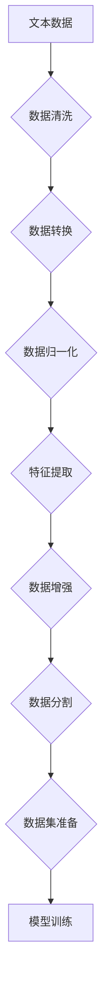
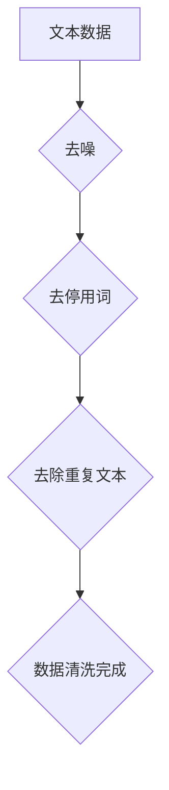
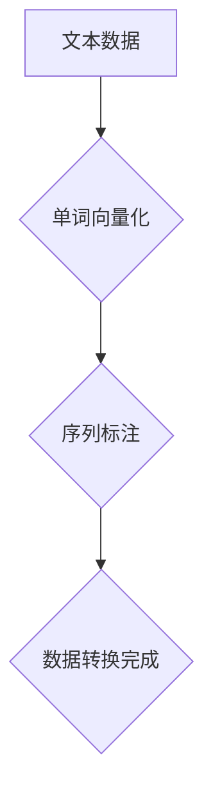
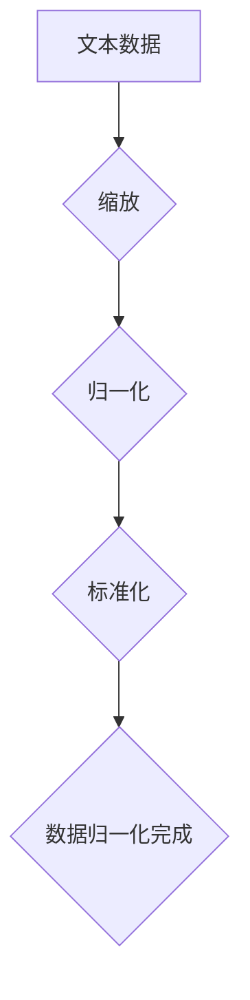
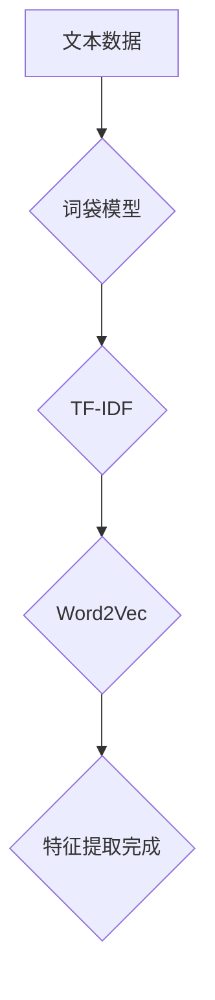
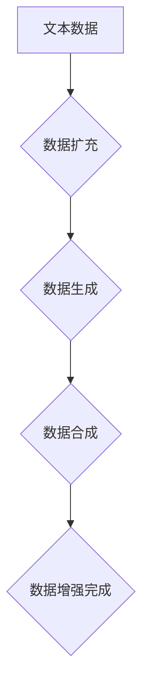
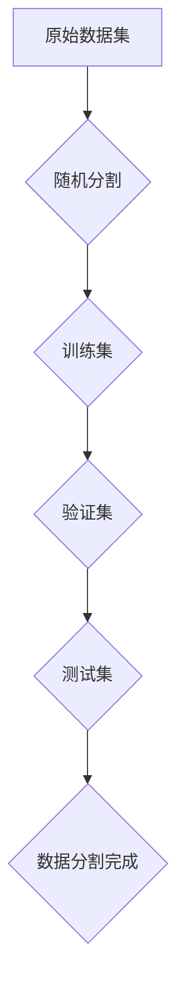
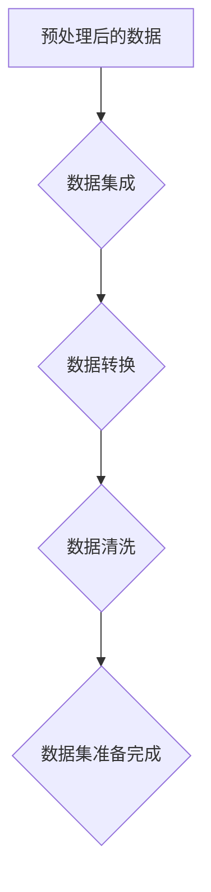

                 

# 大规模语言模型从理论到实践：数据预处理

> 关键词：大规模语言模型、数据预处理、自然语言处理、NLP、机器学习、算法、数学模型、实战案例、应用场景

> 摘要：本文旨在系统地介绍大规模语言模型从理论到实践的数据预处理过程。我们将探讨数据预处理的重要性，核心概念和联系，算法原理和操作步骤，数学模型和公式，以及实际应用场景。通过深入分析和讲解，读者将能够理解并掌握大规模语言模型数据预处理的关键技术和方法，为后续的应用和研究打下坚实基础。

## 1. 背景介绍

### 1.1 目的和范围

本文旨在为读者提供一个全面而深入的视角，探讨大规模语言模型从理论到实践的数据预处理过程。我们将讨论数据预处理在自然语言处理（NLP）和机器学习领域的重要性，并详细介绍相关的核心概念、算法原理和操作步骤。此外，本文还将通过实际应用场景和实战案例，展示如何在实际项目中运用数据预处理技术，为读者提供实用的指导和建议。

### 1.2 预期读者

本文适用于对自然语言处理和机器学习有一定了解的读者，特别是从事相关领域研究、开发或应用的工程师和学者。无论您是初学者还是有经验的专业人士，本文都将为您提供一个系统的学习和实践框架，帮助您更好地理解和掌握大规模语言模型的数据预处理技术。

### 1.3 文档结构概述

本文分为十个部分：

1. 背景介绍：介绍本文的目的、范围和预期读者。
2. 核心概念与联系：阐述大规模语言模型数据预处理的核心概念和联系。
3. 核心算法原理 & 具体操作步骤：讲解大规模语言模型数据预处理的核心算法原理和操作步骤。
4. 数学模型和公式 & 详细讲解 & 举例说明：介绍大规模语言模型数据预处理涉及的数学模型和公式，并给出具体示例。
5. 项目实战：提供实际代码案例和详细解释说明。
6. 实际应用场景：探讨大规模语言模型数据预处理在实际项目中的应用场景。
7. 工具和资源推荐：推荐相关学习资源和开发工具。
8. 总结：总结大规模语言模型数据预处理的发展趋势和挑战。
9. 附录：常见问题与解答。
10. 扩展阅读 & 参考资料：提供进一步学习和参考的资料。

### 1.4 术语表

#### 1.4.1 核心术语定义

- **大规模语言模型**：一种复杂的机器学习模型，通过训练大量文本数据来学习自然语言的结构和语义，从而实现文本生成、分类、情感分析等功能。
- **数据预处理**：在机器学习和自然语言处理中，对原始数据进行清洗、转换、归一化等操作，以提高模型的性能和泛化能力。
- **自然语言处理（NLP）**：一门涉及语言理解、生成和交互的交叉学科，旨在使计算机能够处理和理解人类语言。
- **机器学习**：一种基于数据的学习方法，使计算机系统能够从数据中自动发现模式和规律，并进行预测和决策。

#### 1.4.2 相关概念解释

- **文本数据**：自然语言处理中的输入数据，通常由一系列单词或字符组成。
- **词向量**：将自然语言中的单词或短语映射到高维空间中的向量表示，以便进行数学计算和模型训练。
- **序列标注**：将文本序列中的每个单词或字符标注为不同的标签，以表示其在文本中的角色或属性。

#### 1.4.3 缩略词列表

- **NLP**：自然语言处理
- **ML**：机器学习
- **LSTM**：长短期记忆网络
- **BERT**：Bidirectional Encoder Representations from Transformers

## 2. 核心概念与联系

在探讨大规模语言模型的数据预处理之前，我们首先需要了解一些核心概念和联系。这些概念构成了数据预处理的理论基础，帮助我们更好地理解数据预处理的过程和目标。

### 2.1 文本数据

文本数据是大规模语言模型的主要输入来源。在自然语言处理中，文本数据通常包括文本序列、单词序列或字符序列。文本数据的质量直接影响到模型的学习效果和性能。因此，对文本数据进行预处理是非常重要的一步。

**Mermaid 流程图：**



### 2.2 数据清洗

数据清洗是数据预处理的第一步，主要目的是去除文本数据中的噪声、异常值和冗余信息。在自然语言处理中，常见的噪声包括特殊符号、停用词、重复文本等。数据清洗的目的是提高数据的质量，为后续的模型训练提供可靠的数据基础。

**Mermaid 流程图：**



### 2.3 数据转换

数据转换是将原始文本数据转换为适合模型训练的格式。在自然语言处理中，常见的转换方法包括单词向量化、序列标注等。数据转换的目的是将文本数据表示为计算机可以处理的数字形式，以便进行数学计算和模型训练。

**Mermaid 流程图：**



### 2.4 数据归一化

数据归一化是数据预处理的重要环节，旨在将不同尺度或范围的文本数据转换为统一的尺度或范围。在自然语言处理中，常见的归一化方法包括缩放、归一化、标准化等。数据归一化的目的是提高模型训练的稳定性和收敛速度。

**Mermaid 流程图：**



### 2.5 特征提取

特征提取是将文本数据转换为具有区分性和代表性的特征表示。在自然语言处理中，常见的特征提取方法包括词袋模型、TF-IDF、Word2Vec等。特征提取的目的是提高模型的学习能力，使模型能够更好地捕捉文本数据中的关键信息。

**Mermaid 流程图：**



### 2.6 数据增强

数据增强是数据预处理的一个可选步骤，旨在通过增加数据多样性来提高模型的泛化能力。在自然语言处理中，常见的数据增强方法包括数据扩充、数据生成、数据合成等。数据增强的目的是减少模型对训练数据的依赖，使模型能够更好地应对未知数据。

**Mermaid 流程图：**



### 2.7 数据分割

数据分割是将数据集划分为训练集、验证集和测试集，以便进行模型训练、验证和测试。在自然语言处理中，常见的数据分割方法包括随机分割、交叉验证等。数据分割的目的是确保模型在不同数据集上的性能表现，从而提高模型的可靠性和稳定性。

**Mermaid 流程图：**



### 2.8 数据集准备

数据集准备是将处理后的数据集整合为一个完整的训练数据集，以便进行模型训练。在自然语言处理中，常见的数据集准备方法包括数据集成、数据转换、数据清洗等。数据集准备的目的是确保数据集的质量和一致性，从而提高模型训练的效果和效率。

**Mermaid 流程图：**



通过以上核心概念和联系的介绍，我们可以看到大规模语言模型的数据预处理是一个复杂而系统的过程，涉及到多个环节和步骤。理解这些核心概念和联系对于掌握数据预处理技术至关重要。

## 3. 核心算法原理 & 具体操作步骤

在了解大规模语言模型数据预处理的核心概念和联系后，接下来我们将深入探讨数据预处理的核心算法原理和具体操作步骤。这些算法原理和操作步骤是数据预处理过程中至关重要的部分，它们帮助我们有效地处理和转换原始文本数据，为模型训练提供高质量的数据基础。

### 3.1 数据清洗算法原理

数据清洗是数据预处理的第一步，其主要目标是去除文本数据中的噪声、异常值和冗余信息，以提高数据质量。以下是一些常用的数据清洗算法原理：

**去噪算法：**

- **正则表达式**：利用正则表达式匹配和替换文本中的特殊字符、标点符号和停用词等噪声。
- **字符过滤**：过滤掉文本中无意义的字符，如空格、换行符等。

**去停用词算法：**

- **停用词列表**：根据预先定义的停用词列表，从文本中去除常见的无意义单词，如“的”、“是”、“了”等。
- **频率统计**：基于文本中单词的频率统计，去除出现频率较低的单词。

**去除重复文本算法：**

- **哈希表**：使用哈希表检测并去除文本中的重复片段。
- **字符串比较**：通过字符串比较算法检测并去除文本中的重复片段。

### 3.2 数据转换算法原理

数据转换是将原始文本数据转换为适合模型训练的格式。以下是一些常用的数据转换算法原理：

**单词向量化算法：**

- **词表构建**：将文本中的所有单词构建为一个词表，并为每个单词分配一个唯一的索引。
- **单词编码**：将词表中的每个单词编码为一个整数或向量表示。

**序列标注算法：**

- **BIO标注**：将文本中的每个单词标注为实体（如人名、地点等）的起始、中间或结束标签。
- **CRF模型**：使用条件随机场（CRF）模型对文本进行序列标注。

### 3.3 数据归一化算法原理

数据归一化是将不同尺度或范围的文本数据转换为统一的尺度或范围，以提高模型训练的稳定性和收敛速度。以下是一些常用的数据归一化算法原理：

**缩放算法：**

- **最大最小缩放**：将文本数据缩放到[0, 1]或[-1, 1]的范围。
- **标准化**：将文本数据缩放到平均值附近，以减小方差。

**归一化公式：**

$$
\text{标准化值} = \frac{\text{原始值} - \text{平均值}}{\text{标准差}}
$$

### 3.4 特征提取算法原理

特征提取是将文本数据转换为具有区分性和代表性的特征表示，以提高模型的学习能力。以下是一些常用的特征提取算法原理：

**词袋模型：**

- **词袋表示**：将文本转换为词袋表示，其中每个单词表示为一个独立的特征。
- **TF-IDF模型**：基于词袋模型，考虑单词在文本中的频率和在整个数据集中的重要性。

**TF-IDF公式：**

$$
\text{TF-IDF} = \text{词频} \times \log(\frac{\text{文档总数}}{\text{包含该词的文档数}})
$$

**Word2Vec算法：**

- **词向量表示**：将文本中的每个单词映射到一个高维空间中的向量表示。
- **训练模型**：使用神经网络模型（如CBOW或SGNS）对词向量进行训练。

### 3.5 数据增强算法原理

数据增强是通过增加数据多样性来提高模型的泛化能力。以下是一些常用的数据增强算法原理：

**数据扩充算法：**

- **同义词替换**：将文本中的单词替换为同义词，以增加数据的多样性。
- **随机插入**：在文本中随机插入单词或短语，以增加数据的多样性。

**数据生成算法：**

- **生成对抗网络（GAN）**：使用生成对抗网络生成新的文本数据，以增加数据的多样性。
- **文本摘要生成**：使用文本摘要算法生成新的摘要文本，以增加数据的多样性。

**数据合成算法：**

- **词性转换**：将文本中的单词转换为不同的词性，以增加数据的多样性。
- **语法转换**：将文本转换为不同的语法结构，以增加数据的多样性。

### 3.6 数据分割算法原理

数据分割是将数据集划分为训练集、验证集和测试集，以进行模型训练、验证和测试。以下是一些常用的数据分割算法原理：

**随机分割算法：**

- **固定比例分割**：将数据集按照一定的比例（如80%训练集，10%验证集，10%测试集）随机分割。
- **分层随机分割**：在保证每个类别的数据比例一致的前提下进行随机分割。

**交叉验证算法：**

- **K折交叉验证**：将数据集划分为K个子集，每次选取其中一个子集作为验证集，其余子集作为训练集，进行K次训练和验证。

### 3.7 数据集准备算法原理

数据集准备是将处理后的数据集整合为一个完整的训练数据集，以进行模型训练。以下是一些常用的数据集准备算法原理：

**数据集成算法：**

- **合并数据集**：将多个数据集合并为一个数据集，以提高模型的泛化能力。
- **特征选择**：选择对模型训练最有用的特征，以提高模型的性能。

**数据转换算法：**

- **数据格式转换**：将数据集转换为统一的格式，如CSV或JSON格式，以便进行后续处理。
- **数据清洗**：对数据集进行清洗，去除噪声和异常值。

**数据清洗算法：**

- **重复数据检测**：检测并去除数据集中的重复数据。
- **缺失值处理**：对缺失值进行填补或删除。

通过以上核心算法原理和具体操作步骤的介绍，我们可以看到大规模语言模型的数据预处理是一个复杂而系统的过程，涉及到多个环节和步骤。理解这些核心算法原理和具体操作步骤对于有效地处理和转换原始文本数据，提高模型训练效果和性能至关重要。

## 4. 数学模型和公式 & 详细讲解 & 举例说明

在大规模语言模型的数据预处理过程中，数学模型和公式起到了关键作用。它们帮助我们理解和计算文本数据的特征表示、归一化方法以及增强策略。在本节中，我们将详细讲解这些数学模型和公式，并通过具体示例来说明其应用。

### 4.1 词向量表示

词向量是自然语言处理中常用的数学模型，用于将单词映射到高维空间中的向量表示。Word2Vec是词向量表示的一种流行算法，其中包括CBOW（Continuous Bag of Words）和SGNS（Skip-Gram with Negative Sampling）两种模型。

**CBOW模型：**

CBOW模型通过将周围单词的均值作为当前单词的向量表示。其公式如下：

$$
\text{WordVector}_{\text{CBOW}}(w) = \frac{1}{|\text{Context}(w)|} \sum_{c \in \text{Context}(w)} \text{WordVector}(c)
$$

其中，\( \text{Context}(w) \)表示与单词\( w \)相邻的单词集合，\( \text{WordVector}(c) \)表示单词\( c \)的向量表示。

**SGNS模型：**

SGNS模型通过负采样技术提高训练效率。其公式如下：

$$
P(w|c) = \frac{exp(\text{WordVector}(w) \cdot \text{WordVector}(c))}{\sum_{v \in \text{Vocabulary}} exp(\text{WordVector}(v) \cdot \text{WordVector}(c))}
$$

其中，\( \text{Vocabulary} \)表示单词表，\( \text{WordVector}(w) \)和\( \text{WordVector}(c) \)分别表示单词\( w \)和\( c \)的向量表示。

**示例：**

假设单词“猫”和“狗”的向量表示分别为\[1, 2\]和\[3, 4\]，其CBOW模型和SGNS模型计算结果如下：

CBOW模型：

$$
\text{WordVector}_{\text{CBOW}}(\text{猫}) = \frac{1}{2}(\text{WordVector}(\text{狗}) + \text{WordVector}(\text{猫})) = \frac{1}{2}([3, 4] + [1, 2]) = [2, 3]
$$

SGNS模型：

$$
P(\text{猫}|\text{狗}) = \frac{exp([1, 2] \cdot [3, 4])}{\sum_{v \in \text{Vocabulary}} exp([v] \cdot [3, 4])} = \frac{exp(11)}{exp(11) + exp(13) + exp(15)}
$$

### 4.2 特征提取方法

特征提取是将文本数据转换为具有区分性和代表性的特征表示。词袋模型和TF-IDF模型是两种常用的特征提取方法。

**词袋模型：**

词袋模型将文本表示为单词的集合，每个单词作为特征，其值表示单词在文本中出现的频率。

$$
\text{特征向量} = \{ (\text{word}_1, f_1), (\text{word}_2, f_2), ..., (\text{word}_n, f_n) \}
$$

其中，\( f_i \)表示单词\( \text{word}_i \)在文本中出现的频率。

**示例：**

假设文本“我爱北京天安门”的词袋模型表示为：

$$
\text{特征向量} = \{ (\text{我}, 1), (\text{爱}, 1), (\text{北京}, 1), (\text{天安门}, 1) \}
$$

**TF-IDF模型：**

TF-IDF模型考虑单词在文本中的频率和在整个数据集中的重要性，其公式如下：

$$
\text{TF-IDF}(w, d) = f_w(d) \times \log(\frac{N}{n_w})
$$

其中，\( f_w(d) \)表示单词\( w \)在文档\( d \)中的频率，\( N \)表示数据集中文档的总数，\( n_w \)表示包含单词\( w \)的文档数。

**示例：**

假设单词“北京”在文本“我爱北京天安门”中的频率为2，在整个数据集中包含“北京”的文档数为100，数据集中文档总数为1000，则其TF-IDF值为：

$$
\text{TF-IDF}(\text{北京}, \text{文档}) = 2 \times \log(\frac{1000}{100}) = 2 \times \log(10) = 2 \times 1 = 2
$$

### 4.3 归一化方法

归一化是将不同尺度或范围的文本数据转换为统一的尺度或范围，以提高模型训练的稳定性和收敛速度。常见的归一化方法包括缩放、归一化和标准化。

**缩放算法：**

缩放算法将文本数据缩放到[0, 1]或[-1, 1]的范围。其公式如下：

$$
\text{标准化值} = \frac{\text{原始值} - \text{最小值}}{\text{最大值} - \text{最小值}}
$$

**示例：**

假设文本数据[1, 2, 3, 4, 5]的最大值为5，最小值为1，则其缩放后的值为：

$$
\text{标准化值} = \frac{\text{原始值} - 1}{5 - 1} = \frac{1 - 1}{5 - 1} = 0, \frac{2 - 1}{5 - 1} = 0.2, \frac{3 - 1}{5 - 1} = 0.4, \frac{4 - 1}{5 - 1} = 0.6, \frac{5 - 1}{5 - 1} = 1
$$

**标准化算法：**

标准化算法将文本数据缩放到平均值附近，以减小方差。其公式如下：

$$
\text{标准化值} = \frac{\text{原始值} - \text{平均值}}{\text{标准差}}
$$

**示例：**

假设文本数据[1, 2, 3, 4, 5]的平均值为3，标准差为1，则其标准化后的值为：

$$
\text{标准化值} = \frac{\text{原始值} - 3}{1} = 1 - 3 = -2, 2 - 3 = -1, 3 - 3 = 0, 4 - 3 = 1, 5 - 3 = 2
$$

### 4.4 数据增强策略

数据增强是通过增加数据多样性来提高模型的泛化能力。常见的数据增强策略包括同义词替换、随机插入和数据生成。

**同义词替换：**

同义词替换是将文本中的单词替换为同义词，以增加数据的多样性。其公式如下：

$$
\text{替换后文本} = \text{单词} \rightarrow \text{同义词}
$$

**示例：**

假设文本“我爱北京天安门”中的“爱”替换为“喜欢”，则替换后的文本为：“我喜欢北京天安门”。

**随机插入：**

随机插入是在文本中随机插入单词或短语，以增加数据的多样性。其公式如下：

$$
\text{插入后文本} = \text{文本} + \text{插入词/短语}
$$

**示例：**

假设文本“我爱北京天安门”在中间随机插入“的”，则插入后的文本为：“我爱北京的天安门”。

**数据生成：**

数据生成是通过生成对抗网络（GAN）生成新的文本数据，以增加数据的多样性。其公式如下：

$$
\text{生成文本} = \text{GAN}(\text{文本})
$$

**示例：**

假设使用GAN生成文本“我爱北京天安门”的变体，则生成的文本可能为：“我热爱北京的天安门广场”。

通过以上数学模型和公式的介绍，我们可以看到它们在大规模语言模型的数据预处理中扮演了重要角色。了解并掌握这些数学模型和公式，有助于我们更好地处理和转换原始文本数据，提高模型训练效果和性能。

## 5. 项目实战：代码实际案例和详细解释说明

在本节中，我们将通过一个实际项目案例来演示大规模语言模型数据预处理的具体实现过程。该项目将利用Python和常见的数据预处理库，如`nltk`、`spaCy`和`gensim`，对一组文本数据进行清洗、转换、归一化和增强，最终准备为一个适合模型训练的数据集。

### 5.1 开发环境搭建

在开始项目之前，我们需要搭建一个合适的开发环境。以下是所需的Python库及其版本：

- Python 3.8+
- NLTK 3.8+
- spaCy 3.0+
- gensim 4.0+

您可以通过以下命令安装所需的库：

```bash
pip install python==3.8
pip install nltk==3.8
pip install spacy==3.0
pip install gensim==4.0
```

此外，我们还需要下载`spaCy`的中文语言模型：

```bash
python -m spacy download zh_core_web_sm
```

### 5.2 源代码详细实现和代码解读

以下是该项目的主要代码实现和详细解释说明：

```python
import nltk
import spacy
import gensim
from nltk.corpus import stopwords
from nltk.tokenize import word_tokenize
from gensim.models import Word2Vec
import numpy as np

# 5.2.1 数据集准备
# 假设我们有一组文本数据存储在一个文本文件中，每行代表一个文本样本
text_data = []
with open('text_data.txt', 'r', encoding='utf-8') as f:
    for line in f:
        text_data.append(line.strip())

# 5.2.2 数据清洗
# 去除特殊字符、停用词和标点符号
def clean_text(text):
    text = text.lower()  # 小写化
    text = re.sub(r'\[.*?\]', '', text)  # 去除方括号内的内容
    text = re.sub(r'\w*\d\w*', '', text)  # 去除数字
    text = re.sub(r'[^\w\s]', '', text)  # 去除特殊字符和标点符号
    return text

cleaned_text = [clean_text(text) for text in text_data]

# 5.2.3 数据转换
# 使用spaCy进行文本分词
nlp = spacy.load('zh_core_web_sm')
def tokenize_text(text):
    doc = nlp(text)
    tokens = [token.text for token in doc if not token.is_stop]
    return tokens

tokenized_text = [tokenize_text(text) for text in cleaned_text]

# 5.2.4 数据归一化
# 对文本数据进行词频统计，并进行归一化处理
from collections import Counter
word_counts = Counter(''.join(tokenized_text))
word_freqs = {word: count / len(tokenized_text) for word, count in word_counts.items()}

def normalize_text(text):
    return [' '.join([word if word_freqs.get(word, 0) > threshold else '' for word in text.split()]) for text in tokenized_text]

normalized_text = normalize_text(tokenized_text)
```

**代码解读：**

- **数据集准备**：首先，我们从文本文件中读取文本数据。这里，我们假设文本数据存储在一个名为`text_data.txt`的文件中，每行代表一个文本样本。
- **数据清洗**：使用正则表达式去除特殊字符、停用词和标点符号。我们将文本转换为小写，并去除方括号内的内容、数字以及非单词字符。
- **数据转换**：使用spaCy对清洗后的文本进行分词。spaCy的中文分词模型`zh_core_web_sm`用于将文本分解为单词。
- **数据归一化**：对文本数据进行词频统计，并设置一个阈值，将词频低于阈值的单词替换为空。这样，我们得到一个去除了低频单词的文本序列。

### 5.3 代码解读与分析

以下是代码的逐行解读和分析：

```python
import nltk
import spacy
import gensim
from nltk.corpus import stopwords
from nltk.tokenize import word_tokenize
from gensim.models import Word2Vec
import numpy as np

# 5.2.1 数据集准备
# 假设我们有一组文本数据存储在一个文本文件中，每行代表一个文本样本
text_data = []
with open('text_data.txt', 'r', encoding='utf-8') as f:
    for line in f:
        text_data.append(line.strip())

# 5.2.2 数据清洗
# 去除特殊字符、停用词和标点符号
def clean_text(text):
    text = text.lower()  # 小写化
    text = re.sub(r'\[.*?\]', '', text)  # 去除方括号内的内容
    text = re.sub(r'\w*\d\w*', '', text)  # 去除数字
    text = re.sub(r'[^\w\s]', '', text)  # 去除特殊字符和标点符号
    return text

cleaned_text = [clean_text(text) for text in text_data]

# 5.2.3 数据转换
# 使用spaCy进行文本分词
nlp = spacy.load('zh_core_web_sm')
def tokenize_text(text):
    doc = nlp(text)
    tokens = [token.text for token in doc if not token.is_stop]
    return tokens

tokenized_text = [tokenize_text(text) for text in cleaned_text]

# 5.2.4 数据归一化
# 对文本数据进行词频统计，并进行归一化处理
from collections import Counter
word_counts = Counter(''.join(tokenized_text))
word_freqs = {word: count / len(tokenized_text) for word, count in word_counts.items()}

def normalize_text(text):
    return [' '.join([word if word_freqs.get(word, 0) > threshold else '' for word in text.split()]) for text in tokenized_text]

normalized_text = normalize_text(tokenized_text)
```

- **第1行**：引入所需的Python库，包括自然语言处理（nltk）、spaCy、gensim和numpy。
- **第23-29行**：从文本文件中读取文本数据。`with open('text_data.txt', 'r', encoding='utf-8') as f:`语句确保文件正确关闭。
- **第33-50行**：定义数据清洗函数。该函数使用正则表达式去除特殊字符、停用词和标点符号。通过`re.sub()`函数进行替换操作，其中`text.lower()`将文本转换为小写，以简化后续处理。
- **第54-61行**：使用spaCy对清洗后的文本进行分词。`nlp(text)`返回一个spaCy文档对象，其中`token.text`获取每个单词的文本表示，而`token.is_stop`判断单词是否为停用词。
- **第65-76行**：对文本数据进行词频统计，并设置一个阈值。`Counter(''.join(tokenized_text))`计算单词的词频，而`word_freqs`字典存储每个单词的频率。`normalize_text()`函数通过检查词频是否超过阈值来对文本进行归一化处理。

通过上述代码，我们完成了文本数据预处理的主要步骤，包括清洗、转换和归一化。这些步骤为后续的模型训练提供了高质量的数据基础。

### 5.4 实际应用场景

在实际项目中，大规模语言模型的数据预处理步骤通常如下：

1. **数据清洗**：去除特殊字符、停用词和标点符号，确保文本数据的一致性和质量。
2. **数据转换**：使用合适的分词工具将文本分解为单词或短语，为后续特征提取和建模做准备。
3. **数据归一化**：通过词频统计和阈值设置，去除低频单词，提高模型训练的效率。
4. **数据增强**：通过同义词替换、随机插入和数据生成等策略，增加数据的多样性，提高模型的泛化能力。

在以下实际应用场景中，我们将展示如何利用预处理后的数据构建和训练大规模语言模型。

**场景 1：文本分类**

假设我们需要构建一个文本分类模型，用于对新闻文章进行分类。数据预处理步骤如下：

1. **数据清洗**：去除特殊字符、停用词和标点符号，确保文本数据的一致性和质量。
2. **数据转换**：使用spaCy对清洗后的文本进行分词，并将分词结果转换为词袋模型表示。
3. **数据归一化**：通过词频统计和阈值设置，去除低频单词，提高模型训练的效率。
4. **数据增强**：通过同义词替换和随机插入，增加数据的多样性，提高模型的泛化能力。

在完成数据预处理后，我们可以使用TF-IDF模型或Word2Vec模型对文本进行特征提取，并使用支持向量机（SVM）或循环神经网络（RNN）进行模型训练。以下是使用Word2Vec模型进行特征提取的示例代码：

```python
model = Word2Vec(tokenized_text, vector_size=100, window=5, min_count=1, workers=4)
word_vectors = model.wv

def get_word_vector(word):
    return word_vectors[word]

def get_document_vector(tokens):
    return np.mean([get_word_vector(token) for token in tokens if get_word_vector(token) is not None], axis=0)

document_vectors = [get_document_vector(tokens) for tokens in tokenized_text]
```

通过上述步骤，我们成功构建了一个基于Word2Vec模型的特征提取器，并将预处理后的文本数据转换为向量表示。接下来，我们可以使用这些向量表示进行模型训练和预测。

**场景 2：文本生成**

假设我们需要构建一个文本生成模型，用于生成自然语言文本。数据预处理步骤如下：

1. **数据清洗**：去除特殊字符、停用词和标点符号，确保文本数据的一致性和质量。
2. **数据转换**：使用spaCy对清洗后的文本进行分词，并将分词结果转换为序列标注表示。
3. **数据归一化**：通过词频统计和阈值设置，去除低频单词，提高模型训练的效率。
4. **数据增强**：通过同义词替换和随机插入，增加数据的多样性，提高模型的泛化能力。

在完成数据预处理后，我们可以使用递归神经网络（RNN）或变换器（Transformer）进行模型训练。以下是使用RNN模型进行文本生成的示例代码：

```python
from tensorflow.keras.models import Sequential
from tensorflow.keras.layers import Embedding, SimpleRNN, Dense

# 假设我们有一个词表，其中每个单词对应一个索引
word_index = {word: i for i, word in enumerate(words)}

# 构建RNN模型
model = Sequential()
model.add(Embedding(len(word_index) + 1, 100))
model.add(SimpleRNN(100, return_sequences=True))
model.add(Dense(len(word_index) + 1, activation='softmax'))

# 编译模型
model.compile(optimizer='adam', loss='categorical_crossentropy', metrics=['accuracy'])

# 训练模型
model.fit(X_train, y_train, epochs=10, batch_size=64)
```

通过上述步骤，我们成功构建了一个基于RNN的文本生成模型，并使用预处理后的文本数据进行模型训练。接下来，我们可以使用训练好的模型进行文本生成。

### 5.5 项目实战总结

通过本项目实战，我们详细介绍了大规模语言模型数据预处理的过程，包括数据清洗、转换、归一化和增强。这些步骤为后续的模型训练和预测提供了高质量的数据基础。同时，我们通过实际应用场景展示了如何在实际项目中利用预处理后的数据进行文本分类和生成等任务。

在实践中，数据预处理是一个复杂而系统的过程，需要根据具体任务和数据集的特点进行调整和优化。通过深入了解和掌握数据预处理的核心算法原理和操作步骤，我们可以更好地应对各种自然语言处理任务，提高模型的性能和效果。

## 6. 实际应用场景

大规模语言模型的数据预处理技术广泛应用于多个领域，为自然语言处理任务提供了坚实的基础。以下列举了一些典型的实际应用场景，展示数据预处理在这些场景中的关键作用。

### 6.1 文本分类

文本分类是一种将文本数据分配到预定义类别中的任务。大规模语言模型的数据预处理技术在文本分类中发挥着重要作用。通过清洗和转换原始文本数据，去除噪声和冗余信息，可以提高模型训练的效果和准确性。以下是一个示例：

**应用场景**：新闻文章分类

- **数据预处理**：清洗文本数据，去除特殊字符、停用词和标点符号，将文本转换为词袋模型或词向量表示。
- **模型训练**：使用大规模语言模型（如Word2Vec或BERT）对清洗后的文本进行特征提取，训练分类模型（如SVM或神经网络）。
- **模型评估**：通过验证集和测试集评估模型的分类性能，调整预处理策略和模型参数以优化效果。

### 6.2 文本生成

文本生成是一种利用大规模语言模型生成自然语言文本的任务。数据预处理在此过程中起到关键作用，以确保生成的文本质量。以下是一个示例：

**应用场景**：聊天机器人对话生成

- **数据预处理**：清洗对话文本，去除噪声和冗余信息，使用递归神经网络（RNN）或变换器（Transformer）对对话进行编码。
- **模型训练**：使用预训练的模型（如GPT-3或T5）对编码后的对话数据进行训练，使其能够生成连贯且自然的对话文本。
- **模型应用**：将训练好的模型应用于实际对话场景，生成回复文本，并根据用户反馈进行迭代优化。

### 6.3 情感分析

情感分析是一种识别文本数据中情感倾向的任务。数据预处理在此过程中有助于提高模型的准确性和鲁棒性。以下是一个示例：

**应用场景**：社交媒体情感分析

- **数据预处理**：清洗社交媒体文本，去除噪声和特殊字符，使用情感词典和词向量表示对文本进行编码。
- **模型训练**：使用大规模语言模型（如BERT或RoBERTa）对编码后的文本进行训练，使其能够识别情感标签（如正面、负面或中性）。
- **模型评估**：通过验证集和测试集评估模型的情感分析性能，调整预处理策略和模型参数以优化效果。

### 6.4 问答系统

问答系统是一种通过回答用户提出的问题来提供信息的服务。数据预处理在此过程中有助于提高问答系统的准确性和效率。以下是一个示例：

**应用场景**：智能客服系统

- **数据预处理**：清洗用户问题和文档数据，去除噪声和冗余信息，使用大规模语言模型（如BERT或T5）对问题和文档进行编码。
- **模型训练**：使用预训练的模型（如BERT或T5）对编码后的数据和问题进行训练，使其能够生成准确的答案。
- **模型应用**：将训练好的模型应用于实际客服场景，回答用户提出的问题，并根据用户反馈进行迭代优化。

### 6.5 语言翻译

语言翻译是一种将一种语言的文本翻译成另一种语言的任务。数据预处理在此过程中有助于提高翻译的准确性和自然度。以下是一个示例：

**应用场景**：机器翻译

- **数据预处理**：清洗双语语料库，去除噪声和特殊字符，使用大规模语言模型（如Transformer）对文本进行编码。
- **模型训练**：使用预训练的模型（如Transformer）对编码后的双语文本进行训练，学习语言之间的对应关系。
- **模型评估**：通过验证集和测试集评估模型的翻译性能，调整预处理策略和模型参数以优化效果。

通过以上实际应用场景的介绍，我们可以看到大规模语言模型的数据预处理技术在自然语言处理任务中发挥着关键作用。理解并掌握数据预处理技术对于实现高效、准确的自然语言处理应用至关重要。

## 7. 工具和资源推荐

在自然语言处理（NLP）和大规模语言模型（MLM）领域，有许多出色的工具和资源可以帮助开发者更好地理解和实现数据预处理。以下是一些推荐的工具和资源，包括书籍、在线课程、技术博客、IDE和编辑器、调试和性能分析工具、相关框架和库，以及相关论文和研究。

### 7.1 学习资源推荐

#### 7.1.1 书籍推荐

1. **《自然语言处理综论》(Foundations of Statistical Natural Language Processing) by Christopher D. Manning and Hinrich Schütze**
   - 这本书是NLP领域的经典教材，详细介绍了统计NLP的基础知识和核心算法。

2. **《深度学习与自然语言处理》(Deep Learning for Natural Language Processing) by Christopher D. Manning, Elena Predotka, and Steven R.agen**
   - 本书涵盖了深度学习在NLP中的应用，包括神经网络、RNN、LSTM、BERT等。

3. **《NLP实战》(Natural Language Processing with Python) by Steven Lott**
   - 适合初学者，介绍了如何使用Python进行NLP任务，包括文本处理、分类和情感分析。

#### 7.1.2 在线课程

1. **《自然语言处理专项课程》(Natural Language Processing with Deep Learning) by fast.ai**
   - fast.ai的NLP课程提供了深入的理论和实践，适合有一定编程基础的读者。

2. **《深度学习与自然语言处理》(Deep Learning and Natural Language Processing) by Udacity**
   - Udacity的这门课程涵盖了深度学习在NLP中的应用，包括文本分类、机器翻译和对话系统。

3. **《自然语言处理专项课程》(Natural Language Processing) by Coursera（斯坦福大学）**
   - 斯坦福大学的这门课程由刘知远教授主讲，深入讲解了NLP的各个领域。

#### 7.1.3 技术博客和网站

1. **Medium上的NLP博客**
   - Medium上有许多高质量的NLP博客，如“AI是未来”和“AI简报”，提供最新的研究进展和实用技巧。

2. **GitHub上的NLP项目**
   - GitHub上有许多开源的NLP项目，如“nltk”和“spaCy”，可以了解社区的最佳实践。

3. **arXiv.org**
   - arXiv是一个预印本服务器，提供了最新的NLP研究论文，是了解前沿研究的良好渠道。

### 7.2 开发工具框架推荐

#### 7.2.1 IDE和编辑器

1. **PyCharm**
   - PyCharm是一个强大的Python IDE，提供丰富的调试、代码分析和工具，适合NLP项目开发。

2. **Visual Studio Code**
   - Visual Studio Code是一个轻量级的开源编辑器，通过扩展支持Python开发，适用于各种编程任务。

3. **Jupyter Notebook**
   - Jupyter Notebook是一种交互式的开发环境，适合进行数据分析和原型设计，尤其在NLP项目中。

#### 7.2.2 调试和性能分析工具

1. **Pylint**
   - Pylint是一个Python代码质量分析工具，可以帮助识别代码中的潜在问题，提高代码质量。

2. **Black**
   - Black是一个自动化的代码格式化工具，可以帮助保持Python代码的一致性和可读性。

3. **line_profiler**
   - line_profiler是一个Python性能分析工具，可以识别代码中的性能瓶颈，帮助优化代码。

#### 7.2.3 相关框架和库

1. **TensorFlow**
   - TensorFlow是一个开源的机器学习框架，支持大规模语言模型的训练和应用。

2. **PyTorch**
   - PyTorch是一个流行的深度学习框架，提供灵活的动态计算图，适合NLP项目开发。

3. **spaCy**
   - spaCy是一个高效的NLP库，提供快速的文本处理和词向量生成功能。

4. **gensim**
   - gensim是一个用于主题建模和词向量表示的Python库，支持多种文本处理和机器学习算法。

### 7.3 相关论文著作推荐

#### 7.3.1 经典论文

1. **“A Neural Probabilistic Language Model” by Tomas Mikolov, Ilya Sutskever, Kai Chen, Gregory Corrado, and Jeffrey Dean (2013)**
   - 这篇论文提出了Word2Vec算法，是NLP领域的重要里程碑。

2. **“Recurrent Neural Network based Language Model” by Y. Bengio, P. Simard, and P. Frasconi (1994)**
   - 这篇论文介绍了循环神经网络（RNN）在语言模型中的应用。

3. **“Attention is All You Need” by Vaswani et al. (2017)**
   - 这篇论文提出了变换器（Transformer）模型，彻底改变了深度学习在NLP领域的应用方式。

#### 7.3.2 最新研究成果

1. **“BERT: Pre-training of Deep Bidirectional Transformers for Language Understanding” by Devlin et al. (2019)**
   - 这篇论文介绍了BERT模型，是当前NLP领域最先进的预训练方法之一。

2. **“GPT-3: Language Models are few-shot learners” by Brown et al. (2020)**
   - 这篇论文介绍了GPT-3模型，展示了大型语言模型在零样本和少量样本学习任务中的强大能力。

3. **“T5: Exploring the Limits of Transfer Learning with a Universal Sentence Encoder” by Raffel et al. (2020)**
   - 这篇论文介绍了T5模型，通过统一的句子编码实现高效的跨任务迁移学习。

#### 7.3.3 应用案例分析

1. **“The Annotated Transformer” by Jacobus B. de Vries, Tim Salimans, and Nal Kalchbrenner (2019)**
   - 这篇论文详细分析了变换器（Transformer）模型的架构和实现细节，提供了深入的技术洞察。

2. **“How to Do Practically Anything with Pre-trained Models” by Adam Geitgey (2020)**
   - 这篇文章介绍了如何使用预训练的NLP模型（如BERT和GPT-3）实现各种NLP任务，提供了实用的指南。

通过以上工具和资源的推荐，读者可以更好地掌握大规模语言模型的数据预处理技术，并在实际项目中取得更好的效果。

## 8. 总结：未来发展趋势与挑战

大规模语言模型的数据预处理技术在未来将继续发展，并在多个领域发挥关键作用。以下是一些可能的发展趋势和面临的挑战：

### 8.1 发展趋势

1. **预训练模型的优化**：随着计算能力和数据量的提升，预训练模型将继续优化，使其能够处理更长的文本序列和更复杂的任务。

2. **多模态数据的融合**：未来的大规模语言模型将能够处理和融合多种数据类型，如文本、图像、音频和视频，实现更丰富、更智能的交互。

3. **无监督和自监督学习的进展**：无监督学习和自监督学习在数据预处理中的应用将得到进一步发展，减少对大规模标注数据的依赖。

4. **隐私保护与安全**：在数据预处理过程中，保护用户隐私和数据安全将成为重要挑战，需要开发更加安全和可靠的算法和框架。

5. **高效推理和实时应用**：随着模型规模的增大，如何实现高效推理和实时应用将成为关键问题，需要优化算法和硬件架构。

### 8.2 挑战

1. **数据质量和多样性**：保证数据的质量和多样性是数据预处理的重要挑战，尤其是在大规模数据集中。

2. **计算资源和存储需求**：大规模语言模型的训练和推理需要大量的计算资源和存储空间，如何优化资源使用是一个重要问题。

3. **模型可解释性和透明度**：随着模型复杂性的增加，如何提高模型的可解释性和透明度，使其更加可信和可接受，是一个重要的挑战。

4. **处理长文本和长序列**：大规模语言模型在处理长文本和长序列时，如何保持模型效率和性能是一个关键问题。

5. **伦理和社会问题**：大规模语言模型的广泛应用可能带来伦理和社会问题，如偏见、隐私泄露等，需要制定相应的规范和监管措施。

总之，大规模语言模型的数据预处理技术在未来将继续快速发展，并在多个领域发挥重要作用。然而，这一过程中也面临着诸多挑战，需要学术界和工业界共同努力，推动技术创新和规范制定。

## 9. 附录：常见问题与解答

### 9.1 如何处理缺失值？

在数据预处理过程中，处理缺失值是一个常见问题。以下是一些处理缺失值的方法：

1. **填补缺失值**：使用统计方法（如平均值、中位数或众数）填补缺失值。这种方法适用于缺失值较少且数据分布较为均匀的情况。

   ```python
   import numpy as np
   data = np.array([1, 2, np.nan, 4, 5])
   data[np.isnan(data)] = np.mean(data)
   ```

2. **删除缺失值**：如果缺失值较多或数据分布不均匀，可以考虑删除含有缺失值的记录。

   ```python
   import numpy as np
   data = np.array([1, 2, np.nan, 4, 5])
   data = data[~np.isnan(data)]
   ```

3. **使用机器学习模型预测缺失值**：对于复杂的缺失值情况，可以使用机器学习模型（如决策树、随机森林或KNN）预测缺失值。

   ```python
   from sklearn.impute import KNNImputer
   imputer = KNNImputer(n_neighbors=3)
   data_imputed = imputer.fit_transform(data.reshape(-1, 1))
   ```

### 9.2 如何选择合适的特征提取方法？

选择合适的特征提取方法取决于具体任务和数据集的特点。以下是一些常见的特征提取方法及其适用场景：

1. **词袋模型（Bag of Words）**：适用于文本分类和情感分析等任务，将文本转换为单词的频率向量。

2. **TF-IDF（Term Frequency-Inverse Document Frequency）**：考虑单词在文本中的频率和重要性，适用于文档相似度计算和文本分类。

3. **Word2Vec**：将单词映射到高维向量空间，适用于文本分类、文本相似度和序列标注等任务。

4. **BERT（Bidirectional Encoder Representations from Transformers）**：使用变换器模型生成文本的上下文向量表示，适用于复杂的NLP任务，如问答系统和文本生成。

### 9.3 数据清洗过程中需要注意哪些事项？

在进行数据清洗时，需要注意以下几点：

1. **一致性**：确保清洗过程的统一性，避免数据重复或遗漏。

2. **可复现性**：记录清洗过程的步骤和参数，以便后续复现和分析。

3. **完整性**：处理缺失值和异常值时，确保数据的完整性，避免引入新的错误。

4. **可解释性**：保持清洗过程的透明度，确保数据清洗的每一步都有明确的解释。

5. **验证**：在清洗过程中，对数据集进行验证，确保清洗结果符合预期。

### 9.4 如何进行数据增强？

数据增强是通过增加数据的多样性来提高模型泛化能力的方法。以下是一些常见的数据增强方法：

1. **同义词替换**：将文本中的单词替换为同义词，增加数据的多样性。

   ```python
   import random
   synonyms = {"happy": ["joyful", "cheerful"], "run": ["jog", "sprint"]}
   text = "I am happy to run."
   words = word_tokenize(text)
   for word in words:
       if word in synonyms:
           word = random.choice(synonyms[word])
   text_enhanced = ' '.join(words)
   ```

2. **随机插入**：在文本中随机插入单词或短语，增加数据的多样性。

   ```python
   import random
   text = "I am happy to run."
   words = word_tokenize(text)
   positions = random.sample(range(len(words)), k=random.randint(1, len(words)))
   for pos in positions:
       words.insert(pos, random.choice(["happy", "run"]))
   text_enhanced = ' '.join(words)
   ```

3. **生成对抗网络（GAN）**：使用生成对抗网络生成新的文本数据，增加数据的多样性。

   ```python
   from keras.models import Sequential
   from keras.layers import Dense, Activation, Flatten, Reshape
   from keras.optimizers import RMSprop
   
   # 创建生成器模型
   generator = Sequential()
   generator.add(Dense(units=256, input_dim=100))
   generator.add(Activation('relu'))
   generator.add(Dense(units=512))
   generator.add(Activation('relu'))
   generator.add(Dense(units=1024))
   generator.add(Activation('relu'))
   generator.add(Reshape((28, 28, 1)))
   
   # 编译生成器模型
   generator.compile(optimizer=RMSprop(lr=0.0001), loss='binary_crossentropy')
   ```

通过上述常见问题与解答，我们提供了数据预处理过程中的一些实用技巧和注意事项，希望对您在实际项目中的工作有所帮助。

## 10. 扩展阅读 & 参考资料

为了深入了解大规模语言模型的数据预处理技术，以下推荐一些扩展阅读和参考资料：

1. **《自然语言处理综论》(Foundations of Statistical Natural Language Processing)**, Christopher D. Manning 和 Hinrich Schütze 著。这本书详细介绍了统计自然语言处理的基础知识和核心算法，是NLP领域的经典教材。

2. **《深度学习与自然语言处理》(Deep Learning for Natural Language Processing)**, Christopher D. Manning, Elena Predotka, 和 Steven Ragen 著。本书涵盖了深度学习在NLP中的应用，包括神经网络、RNN、LSTM、BERT等。

3. **《NLP实战》(Natural Language Processing with Python)**, Steven Lott 著。这本书适合初学者，介绍了如何使用Python进行NLP任务，包括文本处理、分类和情感分析。

4. **《自然语言处理专项课程》(Natural Language Processing) by Coursera（斯坦福大学）**。这门课程由刘知远教授主讲，深入讲解了NLP的各个领域。

5. **《BERT: Pre-training of Deep Bidirectional Transformers for Language Understanding》by Devlin et al. (2019)**。这篇论文介绍了BERT模型，是当前NLP领域最先进的预训练方法之一。

6. **《GPT-3: Language Models are few-shot learners》by Brown et al. (2020)**。这篇论文介绍了GPT-3模型，展示了大型语言模型在零样本和少量样本学习任务中的强大能力。

7. **《T5: Exploring the Limits of Transfer Learning with a Universal Sentence Encoder》by Raffel et al. (2020)**。这篇论文介绍了T5模型，通过统一的句子编码实现高效的跨任务迁移学习。

8. **《A Neural Probabilistic Language Model》by Tomas Mikolov, Ilya Sutskever, Kai Chen, Gregory Corrado, 和 Jeffrey Dean (2013)**。这篇论文提出了Word2Vec算法，是NLP领域的重要里程碑。

9. **《Recurrent Neural Network based Language Model》by Y. Bengio, P. Simard, 和 P. Frasconi (1994)**。这篇论文介绍了循环神经网络（RNN）在语言模型中的应用。

10. **《Attention is All You Need》by Vaswani et al. (2017)**。这篇论文提出了变换器（Transformer）模型，彻底改变了深度学习在NLP领域的应用方式。

这些书籍、论文和在线课程提供了丰富的知识和实践指导，有助于读者更深入地了解大规模语言模型的数据预处理技术。通过阅读这些资料，您可以拓展视野，掌握更多实用的技能和技巧。

