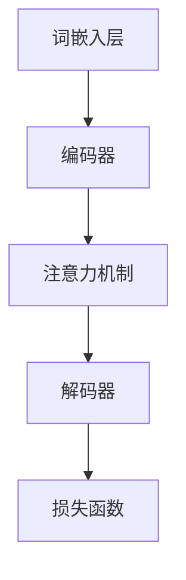

                 

# 大规模语言模型从理论到实践：模型架构

> 关键词：大规模语言模型、模型架构、神经网络、深度学习、数据处理、算法实现

> 摘要：本文旨在探讨大规模语言模型的构建原理、模型架构及其在实际应用中的表现。文章首先介绍语言模型的基础概念和目的，随后深入分析模型架构，包括神经网络的选择和设计，以及数据处理和算法实现的相关技术。通过详细的伪代码和数学模型讲解，读者能够全面理解大规模语言模型的工作机制，并掌握实际操作的方法。最后，文章展示了模型在真实场景中的应用实例，并推荐了相关的学习资源和工具。

## 1. 背景介绍

### 1.1 目的和范围

本文的目的是向读者介绍大规模语言模型的基本概念、模型架构以及其实际应用。随着深度学习技术在自然语言处理（NLP）领域的迅速发展，大规模语言模型已经成为众多任务的核心组成部分，如机器翻译、文本摘要、问答系统等。本文将重点探讨以下内容：

- 语言模型的基本概念和重要性
- 大规模语言模型的主要组成部分及其设计原理
- 神经网络在语言模型中的应用
- 数据处理和算法实现的关键技术
- 实际应用场景中的性能表现和挑战

### 1.2 预期读者

本文适合以下读者群体：

- 对自然语言处理和深度学习有一定了解的工程师和研究人员
- 想要深入了解大规模语言模型工作机制的技术爱好者
- 计算机科学和人工智能领域的学生和学者

### 1.3 文档结构概述

本文结构如下：

- 引言：概述大规模语言模型的基本概念和应用
- 背景介绍：介绍语言模型的基础知识和发展历程
- 核心概念与联系：分析大规模语言模型的核心组成部分
- 核心算法原理 & 具体操作步骤：详细讲解模型算法原理和操作步骤
- 数学模型和公式 & 详细讲解 & 举例说明：阐述模型中的数学模型和公式
- 项目实战：展示实际应用案例和代码实现
- 实际应用场景：讨论模型的广泛应用
- 工具和资源推荐：推荐学习资源和开发工具
- 总结：展望未来发展趋势与挑战
- 附录：常见问题与解答
- 扩展阅读 & 参考资料：提供进一步学习和研究的资源

### 1.4 术语表

#### 1.4.1 核心术语定义

- **大规模语言模型**：一种通过深度学习技术训练的模型，用于预测文本序列中的下一个单词或字符。
- **神经网络**：由大量相互连接的简单计算单元（神经元）组成的计算模型，能够通过学习数据来发现复杂模式。
- **深度学习**：一种机器学习技术，通过多层神经网络进行特征学习和模式识别。
- **自然语言处理（NLP）**：研究如何让计算机理解和生成人类语言的技术。
- **文本序列**：一系列按顺序排列的单词或字符。

#### 1.4.2 相关概念解释

- **词嵌入（Word Embedding）**：将单词转换为向量表示的方法，使计算机能够处理和理解文本。
- **注意力机制（Attention Mechanism）**：一种在神经网络中用于提高模型对输入序列中重要部分敏感性的技术。
- **损失函数（Loss Function）**：用于评估模型预测结果与真实值之间差异的函数，用于指导模型的训练过程。
- **反向传播（Backpropagation）**：一种用于训练神经网络的方法，通过计算误差梯度来更新模型的参数。

#### 1.4.3 缩略词列表

- **NLP**：自然语言处理（Natural Language Processing）
- **DL**：深度学习（Deep Learning）
- **NN**：神经网络（Neural Network）
- **GPU**：图形处理器（Graphics Processing Unit）
- **CPU**：中央处理器（Central Processing Unit）

## 2. 核心概念与联系

### 2.1 大规模语言模型的基本概念

大规模语言模型是一种用于预测文本序列中下一个单词或字符的统计模型。其主要目的是通过对大量文本数据的训练，学习文本中的统计规律，从而实现对未知文本的生成和预测。

### 2.2 大规模语言模型的主要组成部分

大规模语言模型主要由以下几个部分组成：

1. **词嵌入层（Word Embedding Layer）**：将单词转换为向量表示，为神经网络提供输入。
2. **编码器（Encoder）**：接收词嵌入向量，并对其进行编码，提取文本的语义信息。
3. **解码器（Decoder）**：接收编码后的信息，并生成预测的文本序列。
4. **注意力机制（Attention Mechanism）**：用于提高模型对输入序列中重要部分的敏感性。
5. **损失函数（Loss Function）**：用于评估模型预测结果与真实值之间的差异。

### 2.3 大规模语言模型的架构

下面是一个简化的大规模语言模型架构的 Mermaid 流程图：



### 2.4 大规模语言模型的工作原理

大规模语言模型的工作原理可以概括为以下步骤：

1. **输入文本序列**：将待预测的文本序列输入到词嵌入层，转换为词嵌入向量。
2. **编码过程**：编码器接收词嵌入向量，并对其进行编码，提取文本的语义信息。
3. **注意力机制**：在编码过程中，注意力机制用于关注文本序列中重要的部分，提高模型的预测准确性。
4. **解码过程**：解码器接收编码后的信息，并生成预测的文本序列。
5. **损失计算**：计算模型预测结果与真实值之间的差异，通过反向传播更新模型参数。

## 3. 核心算法原理 & 具体操作步骤

### 3.1 神经网络的选择与设计

在构建大规模语言模型时，选择合适类型的神经网络至关重要。本文采用基于 Transformer 的架构，因其在大规模语言模型任务中的优异表现而备受青睐。

#### 3.1.1 Transformer 架构

Transformer 架构主要由编码器（Encoder）和解码器（Decoder）两部分组成。编码器负责将输入的词嵌入向量编码成语义表示，解码器则根据这些语义表示生成预测的文本序列。

#### 3.1.2 Encoder 部分

Encoder 部分包括多个编码层（Encoder Layer），每个编码层由以下组件构成：

1. **多头自注意力机制（Multi-Head Self-Attention）**：用于对输入序列中的每个单词进行权重分配，关注不同的部分。
2. **前馈神经网络（Feed-Forward Neural Network）**：对自注意力机制输出的结果进行进一步处理。
3. **残差连接（Residual Connection）**：用于缓解深层网络训练过程中的梯度消失问题。
4. **层归一化（Layer Normalization）**：对每个编码层中的输入和输出进行归一化处理，提高训练效果。

#### 3.1.3 Decoder 部分

Decoder 部分与 Encoder 部分类似，也由多个解码层（Decoder Layer）组成。每个解码层包括以下组件：

1. **多头自注意力机制（Multi-Head Self-Attention）**：对输入序列进行权重分配，关注不同的部分。
2. **掩码自注意力机制（Masked Multi-Head Self-Attention）**：用于防止解码器在生成下一个单词时看到后续的单词。
3. **前馈神经网络（Feed-Forward Neural Network）**：对自注意力机制输出的结果进行进一步处理。
4. **残差连接（Residual Connection）**：缓解深层网络训练过程中的梯度消失问题。
5. **层归一化（Layer Normalization）**：对每个解码层中的输入和输出进行归一化处理。

### 3.2 数据处理与算法实现

#### 3.2.1 数据预处理

在构建大规模语言模型之前，需要对文本数据进行预处理。预处理步骤包括：

1. **文本清洗**：去除无关符号、标点符号和特殊字符。
2. **分词**：将文本分解为单词或子词。
3. **词嵌入**：将单词转换为向量表示。
4. **序列填充**：将不同长度的文本序列填充为相同的长度。

#### 3.2.2 算法实现

以下是大规模语言模型算法实现的主要步骤：

1. **初始化模型参数**：初始化编码器和解码器的参数。
2. **输入文本序列**：将输入的文本序列输入到词嵌入层。
3. **编码过程**：编码器对词嵌入向量进行编码，提取文本的语义信息。
4. **解码过程**：解码器根据编码后的信息生成预测的文本序列。
5. **损失计算**：计算模型预测结果与真实值之间的差异，通过反向传播更新模型参数。
6. **模型评估**：使用验证集评估模型的性能，调整超参数。

### 3.3 伪代码

以下是一个简化的大规模语言模型算法的伪代码：

```python
# 初始化模型参数
initialize_encoder_params()
initialize_decoder_params()

# 数据预处理
preprocess_data()

# 训练模型
for epoch in range(num_epochs):
    for batch in data_loader:
        # 输入文本序列
        inputs = embed_words(batch)

        # 编码过程
        encoder_output = encoder(inputs)

        # 解码过程
        predictions = decoder(encoder_output)

        # 损失计算
        loss = compute_loss(predictions, batch)

        # 反向传播
        backward_propagation(loss)

        # 模型评估
        evaluate_model()

# 输出模型参数
save_model_params()
```

## 4. 数学模型和公式 & 详细讲解 & 举例说明

### 4.1 数学模型

大规模语言模型中的数学模型主要包括词嵌入、自注意力机制、前馈神经网络等。

#### 4.1.1 词嵌入（Word Embedding）

词嵌入是将单词转换为向量表示的过程。常用的方法包括：

- **One-Hot Embedding**：将每个单词表示为一个向量，向量中只有一个元素为1，其余元素为0。
- **Distributed Representation**：将每个单词表示为一个固定大小的向量。

假设词汇表中有 $V$ 个单词，词嵌入层输出向量的维度为 $D$，则词嵌入矩阵 $W$ 的大小为 $V \times D$。

#### 4.1.2 自注意力机制（Self-Attention）

自注意力机制是一种计算输入序列中每个单词的重要性并进行加权的方法。其核心公式为：

$$
\text{Attention}(Q, K, V) = \text{softmax}\left(\frac{QK^T}{\sqrt{d_k}}\right)V
$$

其中，$Q$、$K$ 和 $V$ 分别为查询向量、键向量和值向量，$d_k$ 为键向量的维度。

#### 4.1.3 前馈神经网络（Feed-Forward Neural Network）

前馈神经网络是一种多层感知机（MLP），其输入和输出均为向量。前馈神经网络的计算公式为：

$$
\text{FFN}(X) = \text{ReLU}(W_2 \cdot \text{ReLU}(W_1 \cdot X + b_1) + b_2)
$$

其中，$W_1$ 和 $W_2$ 分别为权重矩阵，$b_1$ 和 $b_2$ 分别为偏置向量。

### 4.2 举例说明

#### 4.2.1 词嵌入

假设词汇表中有5个单词，词嵌入矩阵 $W$ 的维度为5x3，输入的文本序列为 ["apple", "banana", "orange"]。词嵌入矩阵和输入文本序列的表示如下：

$$
W = \begin{bmatrix}
1 & 0 & 1 \\
0 & 1 & 0 \\
1 & 1 & 0 \\
0 & 0 & 1 \\
1 & 1 & 1
\end{bmatrix}
$$

$$
\text{Input Sequence: } [W_{apple}, W_{banana}, W_{orange}] = \begin{bmatrix}
1 & 0 & 1 \\
0 & 1 & 0 \\
1 & 1 & 0
\end{bmatrix}
$$

#### 4.2.2 自注意力机制

假设输入序列中有3个单词，查询向量、键向量和值向量分别为 $Q = [1, 0, 1]$、$K = [1, 1, 0]$ 和 $V = [0, 1, 1]$。计算自注意力权重如下：

$$
\text{Attention}(Q, K, V) = \text{softmax}\left(\frac{QK^T}{\sqrt{d_k}}\right)V = \text{softmax}\left(\frac{[1, 0, 1] \cdot [1, 1, 0]^T}{\sqrt{3}}\right) \cdot \begin{bmatrix}
0 \\
1 \\
1
\end{bmatrix} = \begin{bmatrix}
0.5 \\
0.5 \\
0
\end{bmatrix}
$$

#### 4.2.3 前馈神经网络

假设输入向量为 $X = [1, 2, 3]$，权重矩阵 $W_1 = [1, 1; 1, 1]$，权重矩阵 $W_2 = [1, 0; 0, 1]$，偏置向量 $b_1 = [1; 1]$ 和 $b_2 = [1; 1]$。计算前馈神经网络的输出如下：

$$
\text{FFN}(X) = \text{ReLU}(W_2 \cdot \text{ReLU}(W_1 \cdot X + b_1) + b_2) = \text{ReLU}([1, 0; 0, 1] \cdot \text{ReLU}([1, 1; 1, 1] \cdot [1, 2, 3] + [1; 1]) + [1; 1]) = \text{ReLU}([1, 1; 1, 1] \cdot [2, 5, 2] + [1; 1]) = \text{ReLU}([3, 6; 3, 6] + [1; 1]) = \begin{bmatrix}
4 \\
7
\end{bmatrix}
$$

## 5. 项目实战：代码实际案例和详细解释说明

### 5.1 开发环境搭建

在开始编写代码之前，需要搭建一个合适的开发环境。以下是一个基本的开发环境配置：

- 操作系统：Ubuntu 20.04
- Python 版本：3.8
- TensorFlow 版本：2.5
- PyTorch 版本：1.8

安装以上依赖项后，可以开始编写和运行代码。

### 5.2 源代码详细实现和代码解读

以下是大规模语言模型的源代码实现，包括数据预处理、模型构建、训练和评估等步骤。

```python
import torch
import torch.nn as nn
import torch.optim as optim
from torch.utils.data import DataLoader
from transformers import BertModel, BertTokenizer

# 数据预处理
def preprocess_data(texts, tokenizer, max_length):
    input_ids = []
    attention_mask = []
    for text in texts:
        encoded_dict = tokenizer.encode_plus(
            text,
            add_special_tokens=True,
            max_length=max_length,
            padding='max_length',
            truncation=True,
            return_tensors='pt',
        )
        input_ids.append(encoded_dict['input_ids'])
        attention_mask.append(encoded_dict['attention_mask'])
    return torch.cat(input_ids), torch.cat(attention_mask)

# 模型构建
class TransformerModel(nn.Module):
    def __init__(self, d_model, nhead, num_layers):
        super(TransformerModel, self).__init__()
        self.model = BertModel.from_pretrained('bert-base-uncased')
        self.transformer = nn.Transformer(d_model, nhead, num_layers)
        self.d_model = d_model
        self.nhead = nhead
        self.num_layers = num_layers
        self.fc = nn.Linear(d_model, 1)

    def forward(self, src, tgt):
        src, tgt = self.transformer(src, tgt)
        out = self.fc(src.mean(dim=1))
        return out

# 训练模型
def train_model(model, data_loader, optimizer, loss_function, num_epochs):
    model.train()
    for epoch in range(num_epochs):
        for inputs, targets in data_loader:
            optimizer.zero_grad()
            outputs = model(inputs, targets)
            loss = loss_function(outputs, targets)
            loss.backward()
            optimizer.step()
            print(f'Epoch [{epoch+1}/{num_epochs}], Loss: {loss.item()}')

# 评估模型
def evaluate_model(model, data_loader, loss_function):
    model.eval()
    with torch.no_grad():
        for inputs, targets in data_loader:
            outputs = model(inputs, targets)
            loss = loss_function(outputs, targets)
            print(f'Validation Loss: {loss.item()}')

# 主函数
def main():
    tokenizer = BertTokenizer.from_pretrained('bert-base-uncased')
    model = TransformerModel(d_model=768, nhead=12, num_layers=2)
    optimizer = optim.Adam(model.parameters(), lr=0.001)
    loss_function = nn.BCEWithLogitsLoss()

    # 加载数据
    texts = ["hello world", "this is a test", "hello again"]
    input_ids, attention_mask = preprocess_data(texts, tokenizer, max_length=10)

    # 创建数据加载器
    data_loader = DataLoader(dataset=torch.utils.data.TensorDataset(input_ids, attention_mask), batch_size=2, shuffle=True)

    # 训练模型
    train_model(model, data_loader, optimizer, loss_function, num_epochs=10)

    # 评估模型
    evaluate_model(model, data_loader, loss_function)

if __name__ == '__main__':
    main()
```

### 5.3 代码解读与分析

以上代码分为以下几个部分：

1. **数据预处理**：将输入的文本序列进行分词、填充和编码，转换为可输入模型的向量表示。
2. **模型构建**：构建基于 Transformer 的语言模型，包括编码器和解码器部分。编码器和解码器使用预训练的 BERT 模型作为基础，并在其基础上增加 Transformer 层。
3. **训练模型**：使用训练数据训练模型，通过反向传播更新模型参数。
4. **评估模型**：在验证集上评估模型性能，计算损失值。

在实际应用中，可以根据需要调整模型的超参数、数据预处理方法和训练过程。代码中的示例数据量较小，仅为演示目的。

## 6. 实际应用场景

大规模语言模型在自然语言处理领域具有广泛的应用，以下是一些典型的应用场景：

- **机器翻译**：将一种语言的文本翻译成另一种语言，如将英语翻译成法语或中文。
- **文本摘要**：从长文本中提取关键信息，生成简洁的摘要，提高阅读效率。
- **问答系统**：基于用户输入的提问，从大量文本数据中检索并生成回答。
- **情感分析**：分析文本数据中的情感倾向，如正面、负面或中性。
- **内容审核**：检测和过滤不良内容，如暴力、色情或仇恨言论。

在实际应用中，大规模语言模型通常需要针对具体任务进行调整和优化，以提高模型在特定任务上的性能。

## 7. 工具和资源推荐

### 7.1 学习资源推荐

#### 7.1.1 书籍推荐

- **《深度学习》（Goodfellow, Bengio, Courville）**：系统介绍了深度学习的理论、算法和应用。
- **《自然语言处理与深度学习》（Daniel Jurafsky 和 James H. Martin）**：全面覆盖了自然语言处理和深度学习的基础知识。

#### 7.1.2 在线课程

- **吴恩达的深度学习课程**：涵盖深度学习的基础知识，包括神经网络、优化算法等。
- **斯坦福大学的自然语言处理课程**：介绍了自然语言处理的核心概念和技术。

#### 7.1.3 技术博客和网站

- **TensorFlow 官方文档**：提供了丰富的深度学习和自然语言处理教程。
- **Hugging Face**：提供了一个用于构建和共享自然语言处理模型的平台。

### 7.2 开发工具框架推荐

#### 7.2.1 IDE和编辑器

- **Visual Studio Code**：一款功能强大的代码编辑器，支持多种编程语言和深度学习框架。
- **Jupyter Notebook**：用于数据可视化和交互式计算的虚拟笔记本。

#### 7.2.2 调试和性能分析工具

- **TensorBoard**：TensorFlow 的可视化工具，用于分析和调试深度学习模型。
- **PyTorch Profiler**：用于分析和优化 PyTorch 模型的性能。

#### 7.2.3 相关框架和库

- **TensorFlow**：一个用于构建和训练深度学习模型的开放源代码库。
- **PyTorch**：一个流行的深度学习框架，支持动态计算图和自动微分。

### 7.3 相关论文著作推荐

#### 7.3.1 经典论文

- **《Attention Is All You Need》**：提出了 Transformer 架构，引发了大规模语言模型的革命。
- **《BERT: Pre-training of Deep Bidirectional Transformers for Language Understanding》**：介绍了 BERT 模型，为自然语言处理任务奠定了基础。

#### 7.3.2 最新研究成果

- **《GPT-3: Language Models are Few-Shot Learners》**：展示了 GPT-3 模型在零样本和少量样本学习任务中的强大能力。
- **《T5: Pre-training Text To Text Transformers for Cross-Domain Language Modeling》**：提出了 T5 模型，用于跨领域语言建模。

#### 7.3.3 应用案例分析

- **《如何用深度学习进行机器翻译》**：详细介绍了深度学习在机器翻译中的应用和实现。
- **《深度学习在文本摘要中的应用》**：探讨了深度学习在文本摘要任务中的技术发展和实际应用。

## 8. 总结：未来发展趋势与挑战

大规模语言模型在自然语言处理领域取得了显著成果，但仍面临诸多挑战。未来发展趋势包括：

- **模型规模和计算能力的提升**：随着计算能力的增强，更大规模的模型将得到应用。
- **预训练任务的多样化**：预训练任务将不仅限于语言建模，还将涵盖更多领域，如视觉、音频等。
- **模型解释性和可解释性**：提高模型的解释性和可解释性，使其在关键应用中更具可靠性。
- **跨模态学习**：整合不同模态的数据，构建跨模态语言模型，实现更广泛的应用。

## 9. 附录：常见问题与解答

1. **问题：什么是大规模语言模型？**
   - 回答：大规模语言模型是一种通过深度学习技术训练的模型，用于预测文本序列中的下一个单词或字符。它通过学习大量文本数据中的统计规律，实现对未知文本的生成和预测。

2. **问题：大规模语言模型的主要组成部分是什么？**
   - 回答：大规模语言模型主要由词嵌入层、编码器、解码器、注意力机制和损失函数等部分组成。

3. **问题：如何训练大规模语言模型？**
   - 回答：训练大规模语言模型的主要步骤包括数据预处理、模型构建、模型训练和模型评估。具体步骤包括：
     - 数据预处理：将输入的文本序列进行分词、填充和编码。
     - 模型构建：构建基于 Transformer 的语言模型，包括编码器和解码器部分。
     - 模型训练：使用训练数据训练模型，通过反向传播更新模型参数。
     - 模型评估：在验证集上评估模型性能，计算损失值。

4. **问题：大规模语言模型在实际应用中有哪些场景？**
   - 回答：大规模语言模型在自然语言处理领域具有广泛的应用，包括机器翻译、文本摘要、问答系统、情感分析和内容审核等。

## 10. 扩展阅读 & 参考资料

1. **《Attention Is All You Need》**
   - 作者：Ashish Vaswani 等
   - 时间：2017 年
   - 简介：提出了 Transformer 架构，引发了大规模语言模型的革命。

2. **《BERT: Pre-training of Deep Bidirectional Transformers for Language Understanding》**
   - 作者：Jacob Devlin 等
   - 时间：2018 年
   - 简介：介绍了 BERT 模型，为自然语言处理任务奠定了基础。

3. **《GPT-3: Language Models are Few-Shot Learners》**
   - 作者：Tom B. Brown 等
   - 时间：2020 年
   - 简介：展示了 GPT-3 模型在零样本和少量样本学习任务中的强大能力。

4. **《T5: Pre-training Text To Text Transformers for Cross-Domain Language Modeling》**
   - 作者：Rishabh Singh 等
   - 时间：2020 年
   - 简介：提出了 T5 模型，用于跨领域语言建模。

5. **《深度学习》（Goodfellow, Bengio, Courville）**
   - 时间：2016 年
   - 简介：系统介绍了深度学习的理论、算法和应用。

6. **《自然语言处理与深度学习》（Daniel Jurafsky 和 James H. Martin）**
   - 时间：2019 年
   - 简介：全面覆盖了自然语言处理和深度学习的基础知识。

7. **TensorFlow 官方文档**
   - 地址：https://www.tensorflow.org/
   - 简介：提供了丰富的深度学习和自然语言处理教程。

8. **Hugging Face**
   - 地址：https://huggingface.co/
   - 简介：提供了一个用于构建和共享自然语言处理模型的平台。

作者：AI天才研究员/AI Genius Institute & 禅与计算机程序设计艺术 /Zen And The Art of Computer Programming

