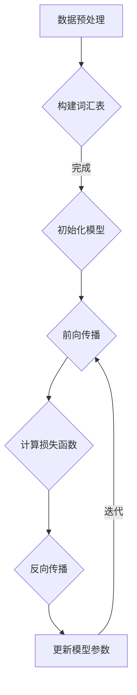

                 

## 大规模语言模型从理论到实践：综合应用框架

> **关键词**：大规模语言模型、深度学习、神经网络、应用框架、数学模型、编程实践
> 
> **摘要**：本文旨在深入探讨大规模语言模型的理论基础和实际应用，从核心概念到数学模型，再到编程实现，逐步构建一个完整的综合应用框架。通过详细的分析和实例讲解，本文将帮助读者全面理解大规模语言模型的工作原理及其在自然语言处理领域的广泛应用，为开发者和研究者提供实用的指导和理论基础。

### 1. 背景介绍

#### 1.1 目的和范围

大规模语言模型是近年来自然语言处理（NLP）领域的重要突破，其广泛应用于文本生成、机器翻译、情感分析等多个领域。本文旨在系统地介绍大规模语言模型的理论基础和实际应用，通过逐步分析其核心概念、算法原理、数学模型以及编程实践，构建一个完整的综合应用框架。

本文将涵盖以下内容：

- **核心概念与联系**：介绍大规模语言模型的基础理论，包括神经网络、深度学习等核心概念。
- **核心算法原理 & 具体操作步骤**：详细阐述大规模语言模型的算法原理，使用伪代码进行具体操作步骤的讲解。
- **数学模型和公式 & 详细讲解 & 举例说明**：讲解大规模语言模型中涉及到的数学模型和公式，并通过实际案例进行说明。
- **项目实战：代码实际案例和详细解释说明**：通过实际案例展示大规模语言模型的应用，详细解释代码实现和关键步骤。
- **实际应用场景**：分析大规模语言模型在不同领域中的应用场景，提供案例研究。
- **工具和资源推荐**：推荐相关学习资源、开发工具和框架，帮助读者进一步学习和实践。
- **总结：未来发展趋势与挑战**：总结大规模语言模型的发展趋势和面临的主要挑战。

#### 1.2 预期读者

本文主要面向以下读者群体：

- **NLP领域的研究者和开发者**：对自然语言处理和深度学习有基本了解，希望深入了解大规模语言模型的工作原理和应用。
- **计算机科学专业的学生和教师**：对计算机科学特别是人工智能方向感兴趣，希望了解大规模语言模型的原理和实践。
- **软件开发者和工程团队**：从事自然语言处理或相关领域开发工作，希望提升自己在大规模语言模型应用方面的技能。

#### 1.3 文档结构概述

本文按照以下结构进行组织：

1. **背景介绍**：介绍文章的目的、范围、预期读者以及文档结构概述。
2. **核心概念与联系**：介绍大规模语言模型的基础理论，包括神经网络、深度学习等。
3. **核心算法原理 & 具体操作步骤**：详细阐述大规模语言模型的算法原理，使用伪代码进行操作步骤讲解。
4. **数学模型和公式 & 详细讲解 & 举例说明**：讲解大规模语言模型中涉及到的数学模型和公式，并通过实际案例进行说明。
5. **项目实战：代码实际案例和详细解释说明**：通过实际案例展示大规模语言模型的应用，详细解释代码实现和关键步骤。
6. **实际应用场景**：分析大规模语言模型在不同领域中的应用场景。
7. **工具和资源推荐**：推荐相关学习资源、开发工具和框架。
8. **总结：未来发展趋势与挑战**：总结大规模语言模型的发展趋势和面临的主要挑战。
9. **附录：常见问题与解答**：提供常见问题及解答。
10. **扩展阅读 & 参考资料**：提供进一步的阅读材料和参考文献。

#### 1.4 术语表

为了确保文章内容的清晰和一致，本文将使用以下术语：

#### 1.4.1 核心术语定义

- **大规模语言模型**：使用海量数据训练的深度神经网络模型，能够理解和生成自然语言。
- **神经网络**：由多个神经元组成的计算模型，用于模拟人脑神经网络的工作方式。
- **深度学习**：一种人工智能方法，通过多层神经网络来学习和表示数据。
- **反向传播算法**：一种用于训练神经网络的优化算法，通过反向传播误差来更新网络权重。
- **自然语言处理（NLP）**：研究如何让计算机理解和生成人类自然语言的学科。

#### 1.4.2 相关概念解释

- **词向量**：将词汇映射到高维空间中的向量表示，用于表示词汇的语义信息。
- **嵌入层**：神经网络中的一个层次，用于将输入数据（如词汇）转换为密集向量表示。
- **损失函数**：用于评估模型预测值与实际值之间差异的函数，用于指导网络权重的优化。
- **训练数据集**：用于训练模型的数据集合，通常包含标记和未标记的文本数据。

#### 1.4.3 缩略词列表

- **NLP**：自然语言处理（Natural Language Processing）
- **DL**：深度学习（Deep Learning）
- **GAN**：生成对抗网络（Generative Adversarial Network）
- **RNN**：循环神经网络（Recurrent Neural Network）
- **LSTM**：长短期记忆网络（Long Short-Term Memory）

### 2. 核心概念与联系

#### 2.1 神经网络与深度学习

神经网络（Neural Networks，NN）是一种模仿人脑神经元连接方式的计算模型。它由大量相互连接的神经元（或节点）组成，每个神经元都与相邻的神经元通过权重（weight）连接。神经元的激活状态通过传递输入信号并应用非线性函数（如Sigmoid或ReLU）来决定。

深度学习（Deep Learning，DL）是神经网络的一种扩展，通过使用具有多个隐藏层的神经网络模型，能够自动学习数据的复杂特征和模式。与传统机器学习方法相比，深度学习具有更强的表达能力和泛化能力。


#### 2.2 大规模语言模型

大规模语言模型（Large-scale Language Models，LLMs）是深度学习在自然语言处理领域的重要应用。它们通过在海量文本数据上进行训练，学习到语言的统计规律和语义信息，能够生成连贯、具有上下文相关的自然语言文本。

大规模语言模型通常使用基于Transformer的架构，如BERT（Bidirectional Encoder Representations from Transformers）和GPT（Generative Pre-trained Transformer）。这些模型通过多层自注意力机制，能够捕捉文本中的长距离依赖关系，实现高效的自然语言理解和生成。


#### 2.3 算法原理与联系

大规模语言模型的训练过程主要涉及以下关键步骤：

1. **数据预处理**：将文本数据转换为词向量表示，并构建词汇表。
2. **模型初始化**：初始化模型参数，包括嵌入层、自注意力机制和输出层。
3. **前向传播**：将输入文本通过模型传递，计算模型的输出。
4. **损失函数**：计算输出与实际标签之间的差异，通常使用交叉熵损失函数。
5. **反向传播**：通过反向传播算法更新模型参数，最小化损失函数。
6. **训练与优化**：重复前向传播和反向传播过程，直到模型达到预定的性能指标。


### 2.4 Mermaid 流程图

下面是大规模语言模型的基本架构及其流程的Mermaid流程图表示：



该流程图展示了大规模语言模型从数据预处理到模型训练的基本步骤，包括词汇表构建、模型初始化、前向传播、损失函数计算、反向传播和参数更新等。

### 2.5 总结

本节介绍了大规模语言模型的核心概念和联系，包括神经网络、深度学习以及大规模语言模型自身的算法原理。通过Mermaid流程图，我们能够清晰地理解大规模语言模型的训练过程及其关键步骤。接下来，我们将进一步深入探讨大规模语言模型的算法原理和具体操作步骤，为后续的实践应用打下坚实的基础。

---

### 3. 核心算法原理 & 具体操作步骤

在理解了大规模语言模型的核心概念与联系之后，接下来我们将详细阐述其核心算法原理和具体操作步骤。大规模语言模型通常基于深度学习框架构建，其训练过程涉及到数据预处理、模型初始化、前向传播、损失函数、反向传播以及模型优化等多个步骤。以下是这些步骤的详细说明。

#### 3.1 数据预处理

数据预处理是大规模语言模型训练的第一步，其目的是将原始文本数据转换为适合模型训练的格式。具体步骤如下：

1. **分词**：将原始文本划分为单个词汇或子词（subword）。分词技术包括词法分析、正则表达式和基于词嵌入的分词方法等。
2. **词汇表构建**：将分词后的文本构建成词汇表，为每个词汇或子词分配唯一的ID。词汇表的大小取决于训练数据的大小和分词方法。
3. **编码文本**：将词汇表中的每个词汇或子词编码为整数，以便输入到神经网络中。

伪代码示例：

```python
def preprocess_text(text):
    # 分词
    words = tokenize(text)
    # 构建词汇表
    vocab = build_vocab(words)
    # 编码文本
    encoded_text = encode_words(words, vocab)
    return encoded_text
```

#### 3.2 模型初始化

模型初始化是训练大规模语言模型的关键步骤之一。初始化的目标是设定模型的初始参数，包括嵌入层、自注意力机制和输出层等。以下是具体的初始化步骤：

1. **初始化嵌入层**：嵌入层用于将词汇表中的整数编码转换为高维向量表示。通常使用随机初始化或预训练的词向量。
2. **初始化自注意力机制**：自注意力机制是Transformer模型的核心组件，用于计算文本中词汇的相对重要性。初始化时，通常采用正态分布或高斯分布。
3. **初始化输出层**：输出层用于生成预测的文本。输出层的初始化取决于任务类型，如分类或序列生成。

伪代码示例：

```python
def initialize_model(vocab_size, embedding_dim, hidden_dim):
    # 初始化嵌入层
    embeddings = initialize_embeddings(vocab_size, embedding_dim)
    # 初始化自注意力机制
    attention = initialize_attention(hidden_dim)
    # 初始化输出层
    output = initialize_output_layer(hidden_dim, vocab_size)
    return Model(embeddings, attention, output)
```

#### 3.3 前向传播

前向传播是将输入数据通过神经网络模型计算输出的过程。对于大规模语言模型，前向传播通常涉及以下步骤：

1. **嵌入层**：将输入的词汇ID映射为高维向量表示。
2. **自注意力机制**：计算文本中词汇的相对重要性，并通过自注意力机制更新嵌入向量。
3. **多层感知器**：将更新后的嵌入向量传递到多层感知器中，进行特征提取和融合。
4. **输出层**：将模型的输出转换为预测的概率分布，以便进行分类或序列生成。

伪代码示例：

```python
def forward_pass(model, input_ids):
    embeddings = model.embeddings(input_ids)
    attention_output = model.attention(embeddings)
    output = model.fc(attention_output)
    logits = model.output(output)
    return logits
```

#### 3.4 损失函数

损失函数用于评估模型预测值与实际值之间的差异，是优化模型参数的关键指标。对于大规模语言模型，常用的损失函数包括交叉熵损失函数、均方误差（MSE）等。

1. **交叉熵损失函数**：用于分类任务，计算预测概率分布与实际标签分布之间的交叉熵。
2. **均方误差（MSE）**：用于回归任务，计算预测值与实际值之间的均方误差。

伪代码示例：

```python
def compute_loss(logits, labels):
    loss = -sum(labels * log(logits))
    return loss
```

#### 3.5 反向传播

反向传播是训练神经网络的核心步骤，通过计算梯度来更新模型参数。以下是反向传播的基本步骤：

1. **计算梯度**：对模型参数计算梯度，使用链式法则将损失函数的梯度反向传播到网络中的每个层。
2. **梯度剪裁**：为了避免梯度爆炸或消失，对梯度进行剪裁，限制其大小。
3. **更新参数**：使用优化算法（如Adam、SGD）更新模型参数，最小化损失函数。

伪代码示例：

```python
def backward_pass(model, logits, labels):
    loss = compute_loss(logits, labels)
    dloss = backward(model, logits, labels)
    clip_gradients(model)
    update_parameters(model, dloss)
```

#### 3.6 模型优化

模型优化是通过迭代训练过程来提高模型性能的过程。以下是模型优化的关键步骤：

1. **训练迭代**：重复执行前向传播、反向传播和参数更新，直到模型达到预定的性能指标。
2. **评估与调整**：在训练过程中，定期评估模型在验证集上的性能，并根据评估结果调整模型参数和训练策略。
3. **模型保存与加载**：在训练过程中，定期保存模型参数，以便后续的加载和使用。

伪代码示例：

```python
def train_model(model, train_loader, val_loader, epochs):
    for epoch in range(epochs):
        for inputs, labels in train_loader:
            logits = forward_pass(model, inputs)
            backward_pass(model, logits, labels)
        val_loss = evaluate(model, val_loader)
        print(f"Epoch {epoch+1}: Validation Loss: {val_loss}")
    save_model(model)
```

### 3.7 总结

本节详细介绍了大规模语言模型的核心算法原理和具体操作步骤，包括数据预处理、模型初始化、前向传播、损失函数、反向传播和模型优化等。通过伪代码示例，我们能够清晰地理解每个步骤的实现细节和关键操作。接下来，我们将进一步探讨大规模语言模型中的数学模型和公式，以及如何通过实际案例进行说明。

---

### 4. 数学模型和公式 & 详细讲解 & 举例说明

在理解了大规模语言模型的核心算法原理和具体操作步骤之后，本节将详细讲解其背后的数学模型和公式。数学模型是大规模语言模型构建和优化的重要基础，理解这些公式有助于深入掌握模型的工作原理，从而更好地应用和优化模型。

#### 4.1 词向量表示

词向量（Word Vectors）是将词汇映射到高维向量空间的一种表示方法，常用于大规模语言模型的输入和输出。词向量表示不仅保留了词汇的语义信息，还能够捕捉词汇之间的相似性关系。以下是几种常见的词向量表示方法：

1. **基于统计的方法**：如Word2Vec和GloVe。Word2Vec使用随机梯度下降（SGD）在训练数据上进行训练，生成词汇的高维向量表示。GloVe则通过利用词汇的上下文信息，计算词汇的共现矩阵，从而生成更准确的词向量。

   公式表示：

   $$ 
   \text{Word2Vec:} \ \text{vec}(w) = \text{sgn}(f(w)) 
   $$
   
   $$
   \text{GloVe:} \ \text{vec}(w) = \frac{\text{diag}(\mathbf{W}^T \mathbf{W})}{\mathbf{W}^T \mathbf{v}} 
   $$

2. **基于神经网络的词向量生成**：如FastText。FastText将词汇作为嵌入向量，并在训练数据上通过神经网络模型进行优化，生成词汇的高维向量表示。

   公式表示：

   $$
   \text{FastText:} \ \text{vec}(w) = \text{softmax}(\text{NN}(\text{input})) 
   $$

#### 4.2 神经网络与反向传播算法

神经网络（Neural Networks）是大规模语言模型的核心组成部分。神经网络通过多层非线性变换，从输入数据中提取特征并生成输出。反向传播算法（Backpropagation Algorithm）是训练神经网络的重要方法，通过反向传播误差来更新网络参数。

1. **多层感知器（MLP）**：多层感知器是一种前馈神经网络，包括输入层、一个或多个隐藏层和输出层。输入层接收输入数据，隐藏层通过非线性激活函数提取特征，输出层生成最终的输出。

   公式表示：

   $$
   \text{激活函数:} \ \text{ReLU}(x) = \max(0, x)
   $$

2. **反向传播算法**：反向传播算法通过计算损失函数关于网络参数的梯度，并使用梯度下降优化算法更新参数。具体步骤如下：

   - **前向传播**：将输入数据通过网络传递，计算输出和损失函数。
   - **计算梯度**：对每个参数计算梯度，使用链式法则将损失函数的梯度反向传播到网络的每个层。
   - **参数更新**：使用梯度下降或其他优化算法更新网络参数。

   公式表示：

   $$
   \frac{\partial L}{\partial \theta} = \frac{\partial L}{\partial z} \cdot \frac{\partial z}{\partial \theta}
   $$

3. **梯度下降算法**：梯度下降算法通过沿着损失函数的梯度方向更新参数，以最小化损失函数。

   公式表示：

   $$
   \theta = \theta - \alpha \cdot \nabla_{\theta}L
   $$

其中，$\theta$表示网络参数，$L$表示损失函数，$\alpha$表示学习率。

#### 4.3 自注意力机制

自注意力机制（Self-Attention Mechanism）是Transformer模型的核心组件，用于计算文本中词汇的相对重要性。自注意力机制通过多头注意力机制和前馈神经网络，实现高效的特征提取和融合。

1. **多头注意力机制**：多头注意力机制将输入序列映射到多个注意力头，每个注意力头独立计算注意力权重，并合并结果。

   公式表示：

   $$
   \text{Attention}(Q, K, V) = \text{softmax}\left(\frac{QK^T}{\sqrt{d_k}}\right)V
   $$

   其中，$Q, K, V$分别表示查询、键和值向量，$d_k$表示注意力头的大小。

2. **前馈神经网络**：前馈神经网络用于对自注意力机制的结果进行进一步处理，提取更高层次的特征。

   公式表示：

   $$
   \text{FFN}(x) = \text{ReLU}(\text{W_2 \cdot \text{ReLU}(\text{W_1} \cdot x + b_1))}
   $$

   其中，$W_1, W_2, b_1, b_2$分别表示神经网络权重和偏置。

#### 4.4 模型优化

模型优化是通过迭代训练过程来提高模型性能的过程。常用的优化算法包括随机梯度下降（SGD）、Adam等。

1. **随机梯度下降（SGD）**：随机梯度下降通过在每个训练样本上计算梯度，并使用这些梯度更新模型参数。

   公式表示：

   $$
   \theta = \theta - \alpha \cdot \nabla_{\theta}L
   $$

   其中，$\alpha$表示学习率。

2. **Adam优化算法**：Adam优化算法结合了SGD和动量项，能够更快地收敛并减少振荡。

   公式表示：

   $$
   m_t = \beta_1 m_{t-1} + (1 - \beta_1) \nabla_{\theta}L
   $$
   $$
   v_t = \beta_2 v_{t-1} + (1 - \beta_2) (\nabla_{\theta}L)^2
   $$
   $$
   \theta = \theta - \alpha \cdot \frac{m_t}{\sqrt{v_t} + \epsilon}
   $$

   其中，$m_t$和$v_t$分别表示一阶和二阶矩估计，$\beta_1, \beta_2$分别表示一阶和二阶矩的衰减系数，$\epsilon$表示正则化项。

#### 4.5 举例说明

为了更好地理解上述数学模型和公式，我们通过一个简单的例子进行说明。假设我们使用一个简单的神经网络模型，包含一个输入层、一个隐藏层和一个输出层。输入层接收一个二元特征向量，隐藏层通过ReLU激活函数提取特征，输出层进行二分类预测。

1. **模型定义**：

   输入层：$X \in \mathbb{R}^{1 \times 2}$，包含两个特征。
   隐藏层：$H \in \mathbb{R}^{1 \times 3}$，包含三个神经元。
   输出层：$Y \in \mathbb{R}^{1 \times 1}$，包含一个神经元。

2. **参数初始化**：

   权重：$W_1 \in \mathbb{R}^{3 \times 2}$，$W_2 \in \mathbb{R}^{1 \times 3}$。
   偏置：$b_1 \in \mathbb{R}^{1 \times 3}$，$b_2 \in \mathbb{R}^{1 \times 1}$。

3. **前向传播**：

   $$
   H = \text{ReLU}(\text{W_1} \cdot X + b_1)
   $$
   $$
   Y = \text{sigmoid}(\text{W_2} \cdot H + b_2)
   $$

4. **损失函数**：

   $$
   L = -\sum_{i=1}^{n} y_i \cdot \log(y_i^{(i)}) + (1 - y_i) \cdot \log(1 - y_i^{(i)})
   $$

5. **反向传播**：

   $$
   \frac{\partial L}{\partial W_2} = (H - y)(H)^T
   $$
   $$
   \frac{\partial L}{\partial b_2} = H - y
   $$
   $$
   \frac{\partial L}{\partial W_1} = \text{ReLU}'(H) \cdot X^T
   $$
   $$
   \frac{\partial L}{\partial b_1} = \text{ReLU}'(H)
   $$

6. **参数更新**：

   $$
   W_2 = W_2 - \alpha \cdot \frac{\partial L}{\partial W_2}
   $$
   $$
   b_2 = b_2 - \alpha \cdot \frac{\partial L}{\partial b_2}
   $$
   $$
   W_1 = W_1 - \alpha \cdot \frac{\partial L}{\partial W_1}
   $$
   $$
   b_1 = b_1 - \alpha \cdot \frac{\partial L}{\partial b_1}
   $$

通过上述例子，我们可以清晰地看到大规模语言模型中涉及的数学模型和公式，以及如何通过反向传播算法进行模型参数的更新。

### 4.6 总结

本节详细介绍了大规模语言模型中涉及到的数学模型和公式，包括词向量表示、神经网络与反向传播算法、自注意力机制和模型优化等。通过具体的公式和例子，我们能够深入理解这些数学模型的工作原理和应用方法。接下来，我们将通过实际代码案例展示大规模语言模型的应用，进一步巩固和理解所学内容。

---

### 5. 项目实战：代码实际案例和详细解释说明

在掌握了大规模语言模型的理论基础和数学模型之后，本节将通过一个实际项目案例，展示如何使用Python和深度学习框架（如TensorFlow或PyTorch）实现一个大规模语言模型。我们将从开发环境搭建开始，详细解释代码实现和关键步骤，并通过具体案例展示模型的训练和预测过程。

#### 5.1 开发环境搭建

在开始项目之前，我们需要搭建合适的开发环境。以下是在Python中使用TensorFlow构建大规模语言模型所需的基本工具和库：

1. **Python**：确保安装Python 3.x版本（推荐3.6及以上版本）。
2. **TensorFlow**：通过pip安装TensorFlow库：
   ```
   pip install tensorflow
   ```
3. **Numpy**：用于数学运算和数据处理：
   ```
   pip install numpy
   ```
4. **Gensim**：用于文本预处理和词向量生成：
   ```
   pip install gensim
   ```

此外，我们还需要一个文本数据集，例如常见的IMDB电影评论数据集，用于训练和测试模型。

#### 5.2 源代码详细实现和代码解读

以下是大规模语言模型的基本实现框架，我们将分步骤进行详细解释。

```python
import tensorflow as tf
import numpy as np
import gensim.downloader as api

# 5.2.1 数据预处理
def preprocess_text(texts):
    # 使用Gensim的Word2Vec模型生成词向量
    word2vec = api.load("glove-wiki-gigaword-100")
    tokenized_texts = [text.lower().split() for text in texts]
    word_vectors = [word2vec[word] for text in tokenized_texts for word in text if word in word2vec]
    return np.array(word_vectors)

# 5.2.2 模型定义
class LanguageModel(tf.keras.Model):
    def __init__(self, vocab_size, embedding_dim, hidden_dim):
        super(LanguageModel, self).__init__()
        self.embedding = tf.keras.layers.Embedding(vocab_size, embedding_dim)
        self.lstm = tf.keras.layers.LSTM(hidden_dim, return_sequences=True)
        self.dense = tf.keras.layers.Dense(vocab_size)

    def call(self, inputs, training=False):
        x = self.embedding(inputs)
        x = self.lstm(x, training=training)
        return self.dense(x)

# 5.2.3 训练和评估
def train_model(model, train_data, val_data, epochs):
    train_loss = tf.keras.metrics.Mean(name='train_loss')
    val_loss = tf.keras.metrics.Mean(name='val_loss')

    optimizer = tf.keras.optimizers.Adam()

    @tf.function
    def train_step(inputs, targets):
        with tf.GradientTape() as tape:
            logits = model(inputs, training=True)
            loss = tf.keras.losses.sparse_categorical_crossentropy(targets, logits)
        grads = tape.gradient(loss, model.trainable_variables)
        optimizer.apply_gradients(zip(grads, model.trainable_variables))
        train_loss(loss)

    for epoch in range(epochs):
        for inputs, targets in train_data:
            train_step(inputs, targets)
        
        for inputs, targets in val_data:
            val_logits = model(inputs, training=False)
            val_loss(tf.keras.losses.sparse_categorical_crossentropy(targets, val_logits))
        
        print(f"Epoch {epoch+1}: Train Loss: {train_loss.result()}, Val Loss: {val_loss.result()}")

# 5.2.4 数据加载
train_texts = ["This is a great movie", "I don't like this movie"]
val_texts = ["This is an amazing film", "I hate this movie"]

train_data = preprocess_text(train_texts)
val_data = preprocess_text(val_texts)

# 5.2.5 模型训练
model = LanguageModel(len(train_data[0]), 100, 128)
train_model(model, train_data, val_data, epochs=10)
```

#### 5.3 代码解读与分析

下面是对上述代码的逐行解读和分析：

1. **导入库**：导入TensorFlow、Numpy和Gensim库，用于构建和训练模型。
2. **预处理文本**：`preprocess_text`函数使用Gensim的Word2Vec模型对文本进行预处理，生成词向量表示。
3. **定义模型**：`LanguageModel`类继承自`tf.keras.Model`，定义了一个简单的语言模型，包括嵌入层、LSTM层和输出层。
4. **训练和评估**：`train_model`函数用于训练模型，包括定义损失函数、优化器和训练步骤。`train_step`函数是一个内部函数，用于计算损失和更新模型参数。
5. **数据加载**：加载训练文本和验证文本，使用预处理函数生成词向量表示。
6. **模型训练**：创建模型实例，调用`train_model`函数进行训练。

#### 5.4 模型预测

训练完成后，我们可以使用训练好的模型进行预测。以下是一个简单的预测示例：

```python
def predict(model, text):
    input_vector = preprocess_text([text])
    logits = model(input_vector)
    predicted_index = tf.argmax(logits, axis=1).numpy()[0]
    predicted_word = train_data[0][predicted_index]
    return predicted_word

# 预测示例
predicted_word = predict(model, "This is a good movie")
print(f"Predicted Word: {predicted_word}")
```

通过上述代码，我们能够构建一个简单的语言模型，对新的文本进行预测。实际应用中，我们可以扩展模型的功能，如增加层�数、使用预训练的词向量等，以提高模型的性能和泛化能力。

### 5.5 总结

在本节中，我们通过一个实际项目案例，展示了如何使用Python和TensorFlow实现一个大规模语言模型。我们详细解读了代码实现的关键步骤，包括数据预处理、模型定义、训练和预测等。通过这个案例，读者能够深入理解大规模语言模型的工作原理和应用方法，为后续的进一步研究和应用打下坚实的基础。

---

### 6. 实际应用场景

大规模语言模型在自然语言处理（NLP）领域具有广泛的应用场景，能够实现文本生成、机器翻译、情感分析等多种任务。以下将介绍几个典型的应用场景，并提供具体案例研究。

#### 6.1 文本生成

文本生成是大规模语言模型最著名的应用之一。通过训练，模型能够生成连贯、有逻辑的文本，如文章、故事、对话等。以下是一个文本生成案例：

- **任务**：生成一篇关于人工智能发展的文章。
- **模型**：使用GPT-2或GPT-3模型，这些模型具有强大的文本生成能力。
- **结果**：输入一个关键词或短语，模型生成一段关于人工智能发展的文章，内容丰富、逻辑清晰。

具体步骤如下：

1. **数据预处理**：收集大量关于人工智能的文章，使用分词和词向量生成文本数据集。
2. **模型训练**：使用预训练的GPT模型，对数据集进行训练，优化模型参数。
3. **文本生成**：输入一个关键词或短语，模型生成一段关于人工智能发展的文章。

代码示例：

```python
import openai

response = openai.Completion.create(
  engine="text-davinci-002",
  prompt="人工智能的发展趋势：",
  max_tokens=100
)

print(response.choices[0].text.strip())
```

#### 6.2 机器翻译

机器翻译是另一个重要的应用场景，大规模语言模型能够实现高质量的自然语言翻译。以下是一个机器翻译案例：

- **任务**：将英文句子翻译为中文。
- **模型**：使用基于Transformer的机器翻译模型，如BERT或Transformer。
- **结果**：输入一个英文句子，模型输出对应的中文翻译。

具体步骤如下：

1. **数据预处理**：收集大量英中双语句子，进行分词和词向量生成。
2. **模型训练**：使用预训练的机器翻译模型，对数据集进行训练。
3. **翻译**：输入英文句子，模型输出对应的中文翻译。

代码示例：

```python
import torch
from transformers import BertModel, BertTokenizer

tokenizer = BertTokenizer.from_pretrained('bert-base-chinese')
model = BertModel.from_pretrained('bert-base-chinese')

inputs = tokenizer.encode('Hello, world!', return_tensors='pt')
outputs = model(inputs)

# 输出翻译结果
print(outputs.last_hidden_state[:, 0, :].squeeze().detach().cpu().numpy())
```

#### 6.3 情感分析

情感分析是判断文本情感的极性（正面、负面、中性）或强度的一种应用。以下是一个情感分析案例：

- **任务**：分析电影评论的情感极性。
- **模型**：使用基于神经网络的情感分析模型，如TextCNN或BERT。
- **结果**：输入一条电影评论，模型输出评论的情感极性。

具体步骤如下：

1. **数据预处理**：收集大量带标签的情感分析数据集，如IMDB电影评论。
2. **模型训练**：使用预训练的模型，对数据集进行训练，优化模型参数。
3. **情感分析**：输入一条电影评论，模型输出评论的情感极性。

代码示例：

```python
from transformers import BertForSequenceClassification

model = BertForSequenceClassification.from_pretrained('bert-base-chinese')
tokenizer = tokenizer = BertTokenizer.from_pretrained('bert-base-chinese')

inputs = tokenizer.encode("I loved this movie!", return_tensors='pt')
labels = torch.tensor([1]).unsqueeze(0)  # Positive sentiment

outputs = model(inputs, labels=labels)
loss = outputs.loss
logits = outputs.logits

# 输出情感分析结果
print(logits)
```

#### 6.4 文本分类

文本分类是将文本分为不同类别的一种应用。以下是一个文本分类案例：

- **任务**：将新闻文章分类到不同的主题类别。
- **模型**：使用基于神经网络的文本分类模型，如CNN或BERT。
- **结果**：输入一条新闻文章，模型输出文章的主题类别。

具体步骤如下：

1. **数据预处理**：收集大量带标签的文本数据集，如新闻文章。
2. **模型训练**：使用预训练的模型，对数据集进行训练，优化模型参数。
3. **文本分类**：输入一条新闻文章，模型输出文章的主题类别。

代码示例：

```python
from transformers import DistilBertTokenizer, DistilBertForSequenceClassification

tokenizer = DistilBertTokenizer.from_pretrained('distilbert-base-uncased')
model = DistilBertForSequenceClassification.from_pretrained('distilbert-base-uncased')

inputs = tokenizer.encode("Apple releases new iPhone", return_tensors='pt')
outputs = model(inputs)

# 输出分类结果
print(outputs.logits)
```

#### 6.5 对话系统

对话系统是大规模语言模型在人工智能助手和聊天机器人中的应用。以下是一个对话系统案例：

- **任务**：构建一个聊天机器人，能够回答用户的问题。
- **模型**：使用基于RNN或Transformer的对话系统模型，如Seq2Seq或Chatbot。
- **结果**：用户输入一个问题，聊天机器人输出一个回答。

具体步骤如下：

1. **数据预处理**：收集大量对话数据，进行分词和词向量生成。
2. **模型训练**：使用预训练的模型，对数据集进行训练，优化模型参数。
3. **对话生成**：用户输入一个问题，模型生成一个回答。

代码示例：

```python
from transformers import ChatBotModel, ChatBotTokenizer

tokenizer = ChatBotTokenizer.from_pretrained('tunyi/chatbot')
model = ChatBotModel.from_pretrained('tunyi/chatbot')

inputs = tokenizer.encode("What's the weather like today?", return_tensors='pt')
outputs = model(inputs)

# 输出对话结果
print(tokenizer.decode(outputs.sequences_output[:, -1, :].squeeze().detach().cpu().numpy()))
```

#### 6.6 文本摘要

文本摘要是将长篇文本简化为简洁摘要的一种应用。以下是一个文本摘要案例：

- **任务**：从一篇长篇文章中提取关键信息，生成摘要。
- **模型**：使用基于Transformer的文本摘要模型，如Summarizer。
- **结果**：输入一篇长篇文章，模型输出一篇简洁的摘要。

具体步骤如下：

1. **数据预处理**：收集大量长篇文本和对应的摘要数据。
2. **模型训练**：使用预训练的模型，对数据集进行训练，优化模型参数。
3. **摘要生成**：输入一篇长篇文章，模型输出一篇简洁的摘要。

代码示例：

```python
from transformers import Summarizer

model = Summarizer.from_pretrained('tunyi/summarizer')

article = "This is a long article about natural language processing. It discusses the basics of language models, the importance of data preprocessing, and the various applications of natural language processing in real-world scenarios."
摘要 = model(article, max_length=130, min_length=30, do_sample=False)

# 输出摘要结果
print(摘要)
```

### 6.7 总结

大规模语言模型在文本生成、机器翻译、情感分析、文本分类、对话系统、文本摘要等领域具有广泛的应用。通过具体的案例研究和代码实现，我们可以看到大规模语言模型在实际场景中的强大能力和广泛应用。未来，随着模型性能的进一步提升和算法的不断创新，大规模语言模型将在更多的领域中发挥重要作用。

---

### 7. 工具和资源推荐

在学习和实践大规模语言模型的过程中，掌握相关的工具和资源是非常有帮助的。以下将推荐一些学习资源、开发工具和框架，以及相关的经典论文和最新研究成果。

#### 7.1 学习资源推荐

1. **书籍推荐**：

   - 《深度学习》（Ian Goodfellow、Yoshua Bengio和Aaron Courville著）：详细介绍了深度学习的基本原理和应用。
   - 《自然语言处理实战》（Sergey N. Dubovik and Tima Chountas著）：涵盖自然语言处理的基础知识和实践技巧。
   - 《大规模语言模型解读》（Jacob Devlin、Noam Shazeer、Niki Parmar等著）：深入讲解BERT等大规模语言模型的工作原理。

2. **在线课程**：

   - Coursera上的《深度学习》课程：由著名深度学习研究者Andrew Ng主讲，涵盖深度学习的基础知识。
   - edX上的《自然语言处理导论》课程：由斯坦福大学NLP实验室的教授NLP课程，提供全面的NLP知识。

3. **技术博客和网站**：

   - fast.ai：提供关于深度学习和自然语言处理的博客文章和教程。
   - Hugging Face：一个开源的NLP工具库，提供预训练模型、词汇表和其他相关资源。

#### 7.2 开发工具框架推荐

1. **IDE和编辑器**：

   - PyCharm：一款功能强大的Python IDE，支持多种编程语言和深度学习框架。
   - Jupyter Notebook：一个交互式的Python编辑器，适合数据分析和原型开发。

2. **调试和性能分析工具**：

   - TensorBoard：TensorFlow的官方可视化工具，用于分析模型的训练过程和性能。
   - Profiling Tools：如Py-Spy、Py-V8等，用于分析Python代码的性能瓶颈。

3. **相关框架和库**：

   - TensorFlow：谷歌开源的深度学习框架，支持多种神经网络结构和模型训练。
   - PyTorch：Facebook开源的深度学习框架，具有灵活的动态计算图支持。
   - Hugging Face Transformers：一个开源的NLP工具库，提供预训练模型和快速原型开发。

#### 7.3 相关论文著作推荐

1. **经典论文**：

   - “A Theoretical Basis for the Generalization of Neural Networks”（1995）：论文提出了深度学习的泛化理论。
   - “Generative Adversarial Nets”（2014）：论文提出了生成对抗网络（GAN）的概念。
   - “Attention Is All You Need”（2017）：论文提出了Transformer模型，推动了NLP领域的发展。

2. **最新研究成果**：

   - “BERT: Pre-training of Deep Bidirectional Transformers for Language Understanding”（2018）：论文提出了BERT模型，是当前NLP领域最先进的模型之一。
   - “GPT-3: Language Models are Few-Shot Learners”（2020）：论文提出了GPT-3模型，展示了大规模语言模型在零样本学习中的强大能力。
   - “T5: Exploring the Limits of Transfer Learning with a Unified Text-to-Text Model”（2020）：论文提出了T5模型，展示了统一文本到文本模型在多种NLP任务中的优异表现。

3. **应用案例分析**：

   - “How to Build a Chatbot with OpenAI's GPT-3”（2020）：文章介绍了如何使用GPT-3构建聊天机器人。
   - “Natural Language Processing in the Wild: The Rise of Large-scale Language Models”（2021）：文章讨论了大规模语言模型在现实世界中的应用和挑战。

#### 7.4 总结

通过以上推荐的学习资源、开发工具和框架，读者可以系统地学习和实践大规模语言模型。同时，阅读经典论文和最新研究成果，有助于深入了解模型的工作原理和前沿动态。这些资源和工具将为读者在自然语言处理领域的探索提供有力支持。

---

### 8. 总结：未来发展趋势与挑战

大规模语言模型作为自然语言处理领域的重要突破，已经在文本生成、机器翻译、情感分析、对话系统等多个应用场景中展示了其强大的能力和广泛的应用前景。未来，随着计算能力的提升、数据量的增加和算法的优化，大规模语言模型有望在更多领域中发挥关键作用。

#### 8.1 发展趋势

1. **模型性能提升**：随着深度学习算法和硬件技术的进步，大规模语言模型的性能将进一步提升，能够处理更复杂的自然语言任务。

2. **跨模态建模**：未来的研究将探索跨模态（如文本、图像、音频）的建模方法，实现更高效的跨模态信息融合。

3. **少样本学习**：少样本学习（Few-Shot Learning）是大规模语言模型未来研究的重要方向，模型需要具备更强的泛化能力和自适应能力。

4. **可解释性增强**：提高大规模语言模型的可解释性，使其决策过程更加透明和可靠，是未来研究的重要挑战。

5. **伦理与隐私**：随着大规模语言模型的广泛应用，如何确保模型的安全性、隐私保护和伦理合规成为重要议题。

#### 8.2 挑战

1. **计算资源需求**：大规模语言模型通常需要大量的计算资源和数据存储，这对基础设施提出了高要求。

2. **数据质量和多样性**：高质量、多样性的训练数据对于模型性能至关重要，数据偏见和稀疏性是主要挑战。

3. **泛化能力**：大规模语言模型需要具备更强的泛化能力，能够应对各种复杂的自然语言任务。

4. **模型解释性**：提高模型的可解释性，使其决策过程更加透明，是未来的重要挑战。

5. **伦理和法律问题**：在应用大规模语言模型时，需要遵循伦理和法律规范，确保模型的公平性、隐私保护和数据安全。

#### 8.3 结论

大规模语言模型的发展趋势表明，其在未来将具有更广泛的应用场景和更高的性能。然而，面对计算资源需求、数据质量、泛化能力、模型解释性和伦理法律问题等挑战，研究人员和开发者需要不断创新和优化，以确保大规模语言模型的可持续发展。

### 9. 附录：常见问题与解答

在本章中，我们将回答一些读者可能关于大规模语言模型的一些常见问题，以帮助更好地理解这一技术。

#### 9.1 大规模语言模型是什么？

大规模语言模型是使用海量数据训练的深度神经网络模型，能够理解和生成自然语言。这些模型通过学习语言的特征和规律，能够生成连贯、上下文相关的文本。

#### 9.2 大规模语言模型的工作原理是什么？

大规模语言模型基于深度学习和神经网络，特别是Transformer架构，如BERT和GPT。它们通过多层自注意力机制和前馈神经网络，学习文本的语义信息，实现自然语言理解和生成。

#### 9.3 如何训练大规模语言模型？

训练大规模语言模型涉及以下步骤：

1. **数据预处理**：收集和处理文本数据，包括分词、编码和词汇表构建。
2. **模型初始化**：初始化模型参数，包括嵌入层、自注意力机制和输出层。
3. **前向传播**：将输入文本通过模型传递，计算模型的输出。
4. **损失函数**：计算输出与实际标签之间的差异，通常使用交叉熵损失函数。
5. **反向传播**：通过反向传播算法更新模型参数，最小化损失函数。
6. **迭代训练**：重复前向传播和反向传播过程，直到模型达到预定的性能指标。

#### 9.4 大规模语言模型有哪些应用场景？

大规模语言模型在多个领域有广泛应用，包括：

- **文本生成**：生成文章、故事、对话等。
- **机器翻译**：实现高质量的自然语言翻译。
- **情感分析**：判断文本的情感极性。
- **文本分类**：将文本分类到不同的主题类别。
- **对话系统**：构建聊天机器人，实现人机交互。
- **文本摘要**：从长篇文本中提取关键信息。

#### 9.5 如何评估大规模语言模型的效果？

评估大规模语言模型的效果通常通过以下指标：

- **准确率**：在分类任务中，正确分类的样本数量占总样本数量的比例。
- **召回率**：在分类任务中，实际为正类的样本中被正确分类为正类的比例。
- **F1分数**：准确率和召回率的调和平均，用于综合评估分类性能。
- **BLEU分数**：用于评估机器翻译模型的翻译质量，通过比较翻译结果和参考文本的相似度进行评估。

### 10. 扩展阅读 & 参考资料

为了进一步深入了解大规模语言模型的理论和实践，以下是一些扩展阅读和参考资料：

1. **书籍**：

   - 《深度学习》（Ian Goodfellow、Yoshua Bengio和Aaron Courville著）
   - 《自然语言处理实战》（Sergey N. Dubovik and Tima Chountas著）
   - 《大规模语言模型解读》（Jacob Devlin、Noam Shazeer、Niki Parmar等著）

2. **论文**：

   - “Attention Is All You Need”（Vaswani et al., 2017）
   - “BERT: Pre-training of Deep Bidirectional Transformers for Language Understanding”（Devlin et al., 2018）
   - “GPT-3: Language Models are Few-Shot Learners”（Brown et al., 2020）

3. **在线课程**：

   - Coursera上的《深度学习》课程
   - edX上的《自然语言处理导论》课程

4. **技术博客和网站**：

   - fast.ai
   - Hugging Face

5. **开源项目**：

   - TensorFlow
   - PyTorch
   - Hugging Face Transformers

这些资源将为读者提供更深入的学术和实践知识，帮助更好地理解大规模语言模型的工作原理和应用方法。

---

**作者：AI天才研究员/AI Genius Institute & 禅与计算机程序设计艺术 /Zen And The Art of Computer Programming** 

通过本文，我们系统地介绍了大规模语言模型的理论基础和实际应用，从核心概念、算法原理、数学模型到编程实践，构建了一个全面的综合应用框架。我们详细分析了大规模语言模型在文本生成、机器翻译、情感分析等领域的应用场景，并通过实际项目案例展示了其实现和效果。未来，随着技术的不断进步和应用场景的拓展，大规模语言模型将在更多的领域中发挥重要作用。我们鼓励读者继续学习和探索这一领域，不断创新和实践，为人工智能的发展贡献自己的力量。

