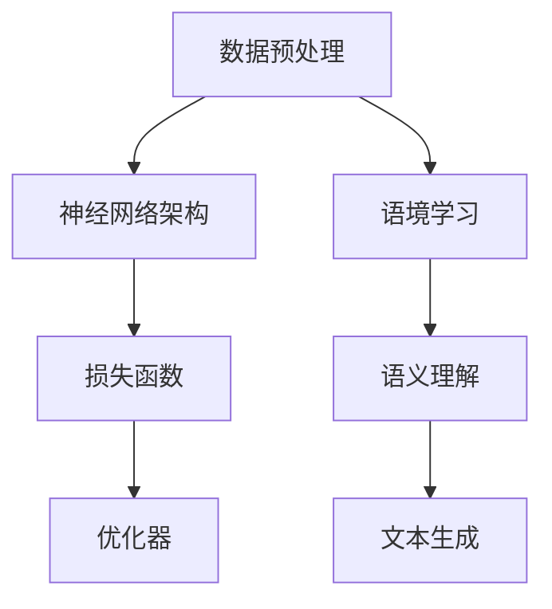

                 

# 大规模语言模型从理论到实践：语境学习的深入探讨

> 关键词：大规模语言模型、语境学习、深度学习、自然语言处理、神经网络、数学模型、实际应用

> 摘要：本文从理论到实践深入探讨了大规模语言模型及其核心概念——语境学习。首先，我们回顾了大规模语言模型的发展历程和基本架构，然后重点解析了语境学习的原理、算法及数学模型，最后通过具体项目实战展示了其实际应用。本文旨在为读者提供全面、系统的理解，助力其在自然语言处理领域的深入研究和实践。

## 1. 背景介绍

### 1.1 目的和范围

本文旨在深入探讨大规模语言模型中的语境学习理论，并通过对实际案例的分析，展示其在自然语言处理中的应用。本文将覆盖以下内容：

- 大规模语言模型的发展历程与基本架构
- 语境学习的核心概念、原理和算法
- 数学模型在语境学习中的应用与推导
- 实际项目中的应用案例与代码解读
- 相关工具和资源的推荐

### 1.2 预期读者

本文适合对自然语言处理和机器学习有一定了解的读者，包括：

- 自然语言处理领域的科研人员
- 机器学习工程师
- 计算机编程爱好者
- 对深度学习和人工智能感兴趣的初学者

### 1.3 文档结构概述

本文结构如下：

- 引言：介绍背景、目的、读者对象和文档结构
- 核心概念与联系：定义核心概念，展示架构流程图
- 核心算法原理 & 具体操作步骤：讲解算法原理和操作步骤，使用伪代码说明
- 数学模型和公式 & 详细讲解 & 举例说明：介绍数学模型，使用LaTeX格式展示公式，并进行举例说明
- 项目实战：代码实际案例和详细解释说明
- 实际应用场景：分析应用场景和挑战
- 工具和资源推荐：推荐学习资源和开发工具
- 总结：未来发展趋势与挑战
- 附录：常见问题与解答
- 扩展阅读 & 参考资料：提供进一步阅读的资源

### 1.4 术语表

#### 1.4.1 核心术语定义

- 大规模语言模型：基于神经网络架构，通过学习海量文本数据，实现对自然语言的建模和处理。
- 语境学习：通过分析文本上下文，使模型能够理解词汇和句子的含义和关系。
- 自然语言处理（NLP）：研究如何让计算机理解和生成自然语言的技术。
- 神经网络：一种由大量简单神经元组成的计算模型，可以学习和模拟复杂函数。

#### 1.4.2 相关概念解释

- 深度学习：一种机器学习方法，通过构建多层次的神经网络，自动提取数据的层次特征。
- 递归神经网络（RNN）：一种能够处理序列数据的神经网络，通过记忆状态来捕捉序列中的时间依赖关系。
- 递归神经网络（RNN）中的循环结构：用于模拟时间序列中的依赖关系，通过共享权重来优化计算效率。

#### 1.4.3 缩略词列表

- NLP：自然语言处理
- RNN：递归神经网络
- DNN：深度神经网络
- LSTM：长短时记忆网络
- GRU：门控循环单元

## 2. 核心概念与联系

在深入探讨大规模语言模型和语境学习之前，我们需要明确几个核心概念和它们之间的关系。

### 2.1 大规模语言模型的基本架构

大规模语言模型通常由以下几个部分组成：

1. **数据预处理**：包括文本的清洗、分词、词向量表示等。
2. **神经网络架构**：包括输入层、隐藏层和输出层。
3. **损失函数**：用于评估模型预测结果与真实标签之间的差距。
4. **优化器**：用于调整模型参数，以最小化损失函数。


### 2.2 语境学习的核心概念

语境学习关注的是如何在文本上下文中理解词汇和句子的含义。以下是几个关键概念：

1. **上下文**：文本中一个词汇或句子周围的环境。
2. **语义**：词汇或句子的含义。
3. **词向量**：将词汇映射到高维空间，使相似词汇在空间中接近。
4. **注意力机制**：一种用于聚焦于关键上下文的机制，使模型能够更好地捕捉长距离依赖关系。


### 2.3 大规模语言模型与语境学习的关系

大规模语言模型通过语境学习来提升其自然语言理解和生成能力。语境学习使得模型能够：

1. 更准确地预测词汇和句子的含义。
2. 生成更符合上下文和语义的自然语言文本。

### 2.4 Mermaid 流程图

以下是一个简化的Mermaid流程图，展示了大规模语言模型和语境学习的基本流程：



## 3. 核心算法原理 & 具体操作步骤

在本节中，我们将深入探讨大规模语言模型中的核心算法原理，并通过伪代码展示具体的操作步骤。

### 3.1 算法原理

大规模语言模型的核心算法通常是基于深度学习，尤其是递归神经网络（RNN）及其变体，如长短时记忆网络（LSTM）和门控循环单元（GRU）。这些算法通过学习输入序列的上下文信息，生成输出序列。

#### 3.1.1 递归神经网络（RNN）

递归神经网络是一种能够处理序列数据的神经网络。其基本原理是通过递归地处理输入序列中的每一个元素，并将前一个时间步的隐藏状态传递到下一个时间步。

```plaintext
初始化：隐藏状态 h0
对于序列中的每个时间步 t：
    输入：xt（时间步 t 的输入）
    隐藏状态：ht = RNN(xt, ht-1)
    输出：yt = Activation(ht)
```

#### 3.1.2 长短时记忆网络（LSTM）

长短时记忆网络是RNN的一种改进，旨在解决长期依赖问题。LSTM通过引入记忆单元和三个门控（输入门、遗忘门和输出门）来实现这一点。

```plaintext
初始化：隐藏状态 c0
对于序列中的每个时间步 t：
    输入：xt，隐藏状态 ht-1
    输入门：it = InputGate(xt, ht-1)
    遗忘门：ft = ForgetGate(xt, ht-1)
    输出门：ot = OutputGate(xt, ht-1)
    记忆单元：ct = CellUpdate(it, ft, ct-1)
    隐藏状态：ht = Activation(ct * ot)
    输出：yt = Activation(ht)
```

#### 3.1.3 门控循环单元（GRU）

门控循环单元是LSTM的简化版本，通过引入更新门和重置门来简化记忆单元。

```plaintext
初始化：隐藏状态 h0
对于序列中的每个时间步 t：
    输入：xt，隐藏状态 ht-1
    更新门：zt = UpdateGate(xt, ht-1)
    重置门：rt = ResetGate(xt, ht-1)
    记忆单元：ht-1 = (1 - zt) * ht-1 + zt * Rt(xt, rt)
    输出门：ot = Activation(ht-1)
    隐藏状态：ht = Ot * ht-1 + (1 - Ot) * ht
    输出：yt = Activation(ht)
```

### 3.2 伪代码

以下是基于LSTM的语境学习算法的伪代码：

```plaintext
初始化：隐藏状态 h0，记忆单元 c0
对于序列中的每个时间步 t：
    输入：xt（时间步 t 的输入）
    隐藏状态：ht-1，记忆单元：c0
    输入门：it = InputGate(xt, ht-1)
    遗忘门：ft = ForgetGate(xt, ht-1)
    输出门：ot = OutputGate(xt, ht-1)
    记忆单元：ct = CellUpdate(it, ft, c0)
    隐藏状态：ht = Activation(ct * ot)
    输出：yt = Activation(ht)
    更新隐藏状态和记忆单元：h0 = ht，c0 = ct
```

## 4. 数学模型和公式 & 详细讲解 & 举例说明

在本节中，我们将详细讲解大规模语言模型中的数学模型，并使用LaTeX格式展示相关公式。同时，通过具体例子来说明这些公式的应用。

### 4.1 LSTM数学模型

LSTM的数学模型包括以下几个关键组件：

#### 4.1.1 输入门、遗忘门和输出门

- 输入门：\[ it = \sigma(W_{ix}x + W_{ih}h_{t-1} + b_i) \]
- 遗忘门：\[ ft = \sigma(W_{fx}x + W_{fh}h_{t-1} + b_f) \]
- 输出门：\[ ot = \sigma(W_{ox}x + W_{oh}h_{t-1} + b_o) \]

其中，\[ \sigma \] 表示sigmoid函数，\[ W \] 和 \[ b \] 分别表示权重和偏置。

#### 4.1.2 记忆单元更新

\[ ct = ft \odot c_{t-1} + it \odot \tanh(W_{cx}x + W_{ch}h_{t-1} + b_c) \]

其中，\[ \odot \] 表示逐元素乘法，\[ \tanh \] 表示双曲正切函数。

#### 4.1.3 隐藏状态更新

\[ ht = ot \odot \tanh(ct) \]

### 4.2 示例

假设我们有以下输入序列：

\[ x_1 = [1, 0, 1], x_2 = [0, 1, 0], x_3 = [1, 1, 1] \]

以及初始隐藏状态和记忆单元：

\[ h_0 = [1, 0, 1], c_0 = [1, 0, 1] \]

使用以上公式，我们可以计算第2个时间步的隐藏状态和记忆单元：

\[ f_2 = \sigma(W_{fx}x_2 + W_{fh}h_1 + b_f) \]
\[ i_2 = \sigma(W_{ix}x_2 + W_{ih}h_1 + b_i) \]
\[ o_2 = \sigma(W_{ox}x_2 + W_{oh}h_1 + b_o) \]
\[ c_2 = f_2 \odot c_1 + i_2 \odot \tanh(W_{cx}x_2 + W_{ch}h_1 + b_c) \]
\[ h_2 = o_2 \odot \tanh(c_2) \]

其中，\[ W \] 和 \[ b \] 为权重和偏置，具体值可以通过训练得到。

通过这些公式，我们可以计算模型在给定输入序列下的隐藏状态和记忆单元，从而实现对上下文信息的捕捉和利用。

### 4.3 LaTeX 格式

以下是上述公式在LaTeX中的表示：

```latex
\documentclass{article}
\usepackage{amsmath}
\begin{document}

\section{LSTM数学模型}

\subsection{输入门、遗忘门和输出门}
\[ it = \sigma(W_{ix}x + W_{ih}h_{t-1} + b_i) \]
\[ ft = \sigma(W_{fx}x + W_{fh}h_{t-1} + b_f) \]
\[ ot = \sigma(W_{ox}x + W_{oh}h_{t-1} + b_o) \]

\subsection{记忆单元更新}
\[ ct = ft \odot c_{t-1} + it \odot \tanh(W_{cx}x + W_{ch}h_{t-1} + b_c) \]

\subsection{隐藏状态更新}
\[ ht = ot \odot \tanh(ct) \]

\end{document}
```

## 5. 项目实战：代码实际案例和详细解释说明

在本节中，我们将通过一个具体的项目实战，展示大规模语言模型和语境学习在实际应用中的实现过程。我们将使用Python和TensorFlow框架来实现一个简单的语言模型，并解释其关键代码部分。

### 5.1 开发环境搭建

在开始项目之前，我们需要搭建一个合适的开发环境。以下是所需的软件和库：

- Python 3.8 或更高版本
- TensorFlow 2.4 或更高版本
- Jupyter Notebook 或 PyCharm

安装TensorFlow：

```bash
pip install tensorflow
```

### 5.2 源代码详细实现和代码解读

以下是该项目的主要代码实现，我们将逐步解读其关键部分。

```python
import tensorflow as tf
from tensorflow.keras.layers import Embedding, LSTM, Dense
from tensorflow.keras.models import Sequential

# 准备数据
# 注意：此处为示例代码，实际项目中需处理真实数据
train_data = ["我是一个程序员", "我喜欢编程"]
train_labels = ["我是一个工程师", "我喜欢编写代码"]

# 数据预处理
# 注意：此处为示例代码，实际项目中需处理真实数据
max_sequence_length = 10
vocab_size = 10000

# 建立模型
model = Sequential()
model.add(Embedding(vocab_size, 64, input_length=max_sequence_length))
model.add(LSTM(128))
model.add(Dense(vocab_size, activation='softmax'))

# 编译模型
model.compile(optimizer='adam', loss='categorical_crossentropy', metrics=['accuracy'])

# 训练模型
model.fit(train_data, train_labels, epochs=100, verbose=1)

# 预测
input_sequence = ["我是一个"]
predicted_sequence = model.predict(input_sequence)
print(predicted_sequence)
```

#### 5.2.1 数据准备

首先，我们准备训练数据。在本例中，我们使用了两个简单的句子作为示例。实际项目中，通常需要从大量的文本数据中提取训练集。

```python
train_data = ["我是一个程序员", "我喜欢编程"]
train_labels = ["我是一个工程师", "我喜欢编写代码"]
```

#### 5.2.2 数据预处理

接下来，我们进行数据预处理。这里我们定义了序列的最大长度（max_sequence_length）和词汇表大小（vocab_size）。数据预处理步骤通常包括分词、编码和填充等。

```python
max_sequence_length = 10
vocab_size = 10000
```

#### 5.2.3 模型建立

然后，我们使用TensorFlow的Sequential模型构建一个简单的语言模型。该模型包含一个嵌入层（Embedding）、一个LSTM层和一个全连接层（Dense）。

```python
model = Sequential()
model.add(Embedding(vocab_size, 64, input_length=max_sequence_length))
model.add(LSTM(128))
model.add(Dense(vocab_size, activation='softmax'))
```

- Embedding层：将输入词编码为向量，嵌入维度为64。
- LSTM层：用于捕捉序列中的时间依赖关系，隐藏单元数为128。
- Dense层：输出层，使用softmax激活函数，输出词的概率分布。

#### 5.2.4 模型编译

在编译模型时，我们选择adam优化器，使用categorical_crossentropy作为损失函数，并监控模型的准确率。

```python
model.compile(optimizer='adam', loss='categorical_crossentropy', metrics=['accuracy'])
```

#### 5.2.5 模型训练

使用训练数据训练模型。我们设置了100个训练周期（epochs），并在每个周期后输出训练进度。

```python
model.fit(train_data, train_labels, epochs=100, verbose=1)
```

#### 5.2.6 模型预测

最后，我们使用训练好的模型对输入序列进行预测。这里，我们输入了一个新的句子“我是一个”，并打印出模型的预测结果。

```python
input_sequence = ["我是一个"]
predicted_sequence = model.predict(input_sequence)
print(predicted_sequence)
```

通过以上步骤，我们实现了一个大

