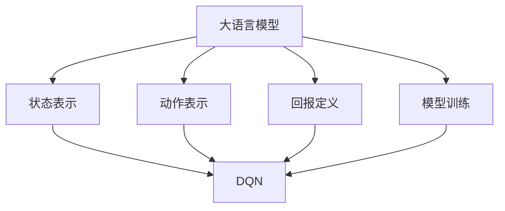

                 

# 大语言模型原理与工程实践：DQN 训练：基本思想

> **关键词：** 大语言模型，深度强化学习，DQN，训练，工程实践

> **摘要：** 本文旨在深入探讨大语言模型的训练过程，特别是深度强化学习（DQN）在这一领域的应用。文章首先介绍了大语言模型的基本概念和背景，随后详细解析了DQN的基本原理和训练流程。通过具体的项目实战案例，文章展示了如何在工程实践中应用DQN进行大语言模型的训练，并对其效果进行了详细解读。最后，文章对DQN训练在大语言模型工程实践中的实际应用场景进行了探讨，并推荐了一些相关工具和资源，以帮助读者进一步学习和实践。

## 1. 背景介绍

### 1.1 目的和范围

本文的目的是探讨大语言模型（Large Language Model，简称LLM）的训练过程，特别是深度强化学习（Deep Q-Network，简称DQN）在这一领域的应用。随着人工智能技术的飞速发展，大语言模型在自然语言处理（Natural Language Processing，简称NLP）领域取得了显著的成果。然而，大语言模型的训练过程复杂且计算量大，如何有效地训练这些模型成为了一个重要的研究课题。

本文将首先介绍大语言模型的基本概念和背景，然后详细解析DQN的基本原理和训练流程。在此基础上，我们将通过具体的项目实战案例，展示如何在实际工程中应用DQN进行大语言模型的训练，并对其效果进行详细解读。最后，本文将对DQN训练在大语言模型工程实践中的实际应用场景进行探讨，并推荐一些相关的工具和资源，以帮助读者进一步学习和实践。

### 1.2 预期读者

本文适合具有一定编程基础和机器学习知识的专业人士，特别是从事自然语言处理领域的研究人员和工程师。同时，本文也适合对深度强化学习和大语言模型感兴趣的广大读者。通过对本文的学习，读者将能够深入理解大语言模型的训练过程，掌握DQN的基本原理和应用方法，从而为实际工程实践提供有力支持。

### 1.3 文档结构概述

本文分为十个主要部分，具体如下：

1. 背景介绍
   - 目的和范围
   - 预期读者
   - 文档结构概述

2. 核心概念与联系
   - 大语言模型的基本概念和背景
   - DQN的基本原理和训练流程

3. 核心算法原理 & 具体操作步骤
   - DQN算法的详细讲解和伪代码展示

4. 数学模型和公式 & 详细讲解 & 举例说明
   - DQN算法的数学模型和公式解析
   - 实际案例中的数学模型应用

5. 项目实战：代码实际案例和详细解释说明
   - 开发环境搭建
   - 源代码详细实现和代码解读
   - 代码解读与分析

6. 实际应用场景
   - 大语言模型在实际工程中的应用场景

7. 工具和资源推荐
   - 学习资源推荐
   - 开发工具框架推荐
   - 相关论文著作推荐

8. 总结：未来发展趋势与挑战
   - DQN训练在大语言模型工程实践中的未来发展趋势和挑战

9. 附录：常见问题与解答
   - 对读者可能遇到的问题进行解答

10. 扩展阅读 & 参考资料
   - 提供更多的学习资源和参考文献

### 1.4 术语表

#### 1.4.1 核心术语定义

- **大语言模型（LLM）**：一种能够处理和理解大规模自然语言数据的深度学习模型，通常基于神经网络结构。
- **深度强化学习（DQN）**：一种基于深度神经网络的强化学习算法，用于解决序列决策问题。
- **Q值（Q-Value）**：在DQN算法中，表示从当前状态采取特定动作的预期回报。
- **经验回放（Experience Replay）**：DQN算法中的一种技术，用于解决训练样本的相关性问题。

#### 1.4.2 相关概念解释

- **状态（State）**：在DQN算法中，表示环境在某一时刻的状态信息。
- **动作（Action）**：在DQN算法中，表示在某一状态下可以采取的动作。
- **回报（Reward）**：在DQN算法中，表示采取特定动作后获得的即时奖励。
- **目标网络（Target Network）**：在DQN算法中，用于更新Q值的辅助网络。

#### 1.4.3 缩略词列表

- **LLM**：大语言模型
- **DQN**：深度强化学习
- **NLP**：自然语言处理
- **IDE**：集成开发环境
- **GPU**：图形处理器

## 2. 核心概念与联系

在这一部分，我们将首先介绍大语言模型的基本概念和背景，然后详细解析深度强化学习（DQN）的基本原理和训练流程。为了更好地理解这些核心概念，我们将通过一个Mermaid流程图展示大语言模型和DQN之间的联系。

### 2.1 大语言模型的基本概念和背景

大语言模型是一种基于神经网络的深度学习模型，用于处理和理解大规模自然语言数据。它通过学习大量的文本数据，能够自动捕捉语言中的复杂模式和规律，从而实现对自然语言的生成、理解和翻译等功能。大语言模型的发展可以追溯到2018年，当时Google发布了BERT（Bidirectional Encoder Representations from Transformers），这是一种基于Transformer模型的预训练语言表示模型。BERT的成功激发了学术界和工业界对大语言模型的研究和应用。

大语言模型的核心思想是利用深度神经网络，特别是自注意力机制（Self-Attention），对输入的文本序列进行处理。通过训练，大语言模型能够学习到文本中的上下文关系，从而在处理自然语言任务时取得出色的效果。大语言模型的训练过程通常包括预训练和微调两个阶段。预训练阶段使用大量未标注的文本数据进行模型训练，微调阶段则使用特定领域的标注数据进行模型优化。

### 2.2 深度强化学习（DQN）的基本原理和训练流程

深度强化学习（DQN）是一种基于深度神经网络的强化学习算法，用于解决序列决策问题。DQN的核心思想是通过学习Q值（Q-Value），即在给定状态下采取特定动作的预期回报，来指导智能体（Agent）进行决策。DQN的训练流程主要包括以下几个步骤：

1. **初始化参数**：初始化智能体的参数，包括Q值网络和目标网络。
2. **选择动作**：在当前状态下，根据Q值网络选择一个动作。
3. **执行动作**：执行选择的动作，并观察环境反馈。
4. **更新经验**：将当前状态、动作、回报和下一个状态存储在经验回放记忆中。
5. **经验回放**：从经验回放记忆中随机抽样一批经验，用于训练Q值网络。
6. **更新Q值网络**：使用抽样经验计算Q值的梯度，并更新Q值网络。
7. **目标网络更新**：根据一定策略（如固定步长），将Q值网络的权重复制到目标网络。

### 2.3 大语言模型和DQN之间的联系

大语言模型和DQN之间的联系主要体现在以下几个方面：

1. **状态表示**：在大语言模型中，状态可以表示为文本序列的特征表示；而在DQN中，状态可以表示为环境在某一时刻的状态信息。
2. **动作表示**：在大语言模型中，动作可以表示为文本生成或修改的操作；而在DQN中，动作可以表示为在给定状态下可以采取的动作。
3. **回报定义**：在大语言模型中，回报可以定义为生成文本的质量或对文本的理解程度；而在DQN中，回报可以定义为采取特定动作后获得的即时奖励。
4. **模型训练**：大语言模型通常使用预训练和微调的方式进行训练；而DQN算法则通过经验回放和目标网络更新进行训练。

以下是一个Mermaid流程图，展示了大语言模型和DQN之间的联系：



通过这个流程图，我们可以清晰地看到大语言模型和DQN之间的联系和互动关系。在后续的内容中，我们将进一步深入探讨这些核心概念，并通过具体的项目实战案例展示如何在工程实践中应用这些理论。

### 2.4 DQN算法原理与具体操作步骤

在这一部分，我们将详细讲解DQN算法的原理和具体操作步骤。DQN是一种基于深度神经网络的强化学习算法，旨在解决序列决策问题。以下是通过伪代码展示DQN算法的基本框架：

```python
# 初始化参数
Initialize Q-network Q(s, a)
Initialize target network target_Q(s, a)
Initialize replay memory D
Initialize exploration strategy ε-greedy

for episode in 1, total_episodes:
    for each step in episode:
        # 选择动作
        action = ChooseAction(s, Q, ε)
        
        # 执行动作
        next_state, reward, done = Environment.step(action)
        
        # 更新经验回放记忆
        D.append((s, action, reward, next_state, done))
        
        if done:
            # 初始化下一个状态
            s = Environment.reset()
        else:
            # 更新状态
            s = next_state
            
        # 从经验回放记忆中抽样一批经验
        batch = SampleMiniBatch(D, batch_size)
        
        # 计算目标Q值
        target_Q_values = []
        for sample in batch:
            if sample.done:
                target_Q_values.append(sample.reward)
            else:
                target_Q_values.append(sample.reward + gamma * max(target_Q(sample.next_state, a)))
        
        # 计算Q值的梯度
        Q_values = Q(sample.state, sample.action)
        error = Q_values - target_Q_values
        
        # 更新Q值网络
        UpdateQNetwork(Q, error, sample)
        
        if step % target_network_update_freq == 0:
            # 更新目标网络
            CopyWeightsFromQToTargetNetwork(target_Q, Q)

# 训练结束
```

接下来，我们将逐行解释上述伪代码，以帮助读者更好地理解DQN算法的操作步骤。

1. **初始化参数**：
   - 初始化Q值网络（Q）和目标网络（target_Q）。
   - 初始化经验回放记忆（D）。
   - 初始化探索策略（ε-greedy）。

2. **选择动作**：
   - 在当前状态（s）下，根据Q值网络（Q）和探索策略（ε-greedy）选择一个动作（action）。

3. **执行动作**：
   - 执行选择的动作（action），并观察环境反馈，包括下一个状态（next_state）、回报（reward）和是否完成（done）。

4. **更新经验回放记忆**：
   - 将当前状态（s）、动作（action）、回报（reward）、下一个状态（next_state）和是否完成（done）存储在经验回放记忆（D）中。

5. **更新状态**：
   - 如果环境已经完成（done），则重新初始化状态（s）。
   - 否则，更新状态（s）为下一个状态（next_state）。

6. **从经验回放记忆中抽样一批经验**：
   - 从经验回放记忆（D）中随机抽样一批经验（batch），用于训练Q值网络。

7. **计算目标Q值**：
   - 对于抽样经验（sample），如果下一个状态（next_state）是完成的（done），则目标Q值为当前回报（reward）。
   - 否则，目标Q值为当前回报（reward）加上最大Q值的折扣因子（gamma * max(target_Q(sample.next_state, a)))。

8. **计算Q值的梯度**：
   - 计算当前Q值（Q_values）和目标Q值（target_Q_values）之间的误差（error）。

9. **更新Q值网络**：
   - 使用误差（error）和抽样经验（sample）更新Q值网络（Q）。

10. **更新目标网络**：
    - 根据一定策略（如固定步长），将Q值网络的权重（Q）复制到目标网络（target_Q）。

通过上述伪代码和详细解释，我们可以清晰地理解DQN算法的基本原理和操作步骤。在下一部分，我们将进一步探讨DQN算法的数学模型和公式，并给出具体的例子说明。

### 2.5 数学模型和公式及详细讲解

DQN算法的核心在于Q值（Q-Value）的更新过程，它反映了智能体在不同状态下采取不同动作的预期回报。以下是我们将详细介绍的DQN算法中的关键数学模型和公式。

#### 2.5.1 Q值（Q-Value）的定义

Q值（Q-Value）是DQN算法中的核心概念，表示在给定状态下采取特定动作的预期回报。数学上，Q值可以表示为：

$$
Q(s, a) = \sum_{i=1}^n r_i + \gamma \max_{a'} Q(s', a')
$$

其中，\( r_i \) 表示在状态 \( s \) 下采取动作 \( a \) 后的即时回报，\( \gamma \) 表示折扣因子，用于平衡当前回报和未来回报的重要性，\( s' \) 表示下一个状态，\( a' \) 表示在下一个状态下采取的最佳动作。

#### 2.5.2 Q值更新公式

在DQN算法中，Q值的更新是基于经验回放（Experience Replay）机制。更新公式可以表示为：

$$
Q(s, a) \leftarrow Q(s, a) + \alpha [r + \gamma \max_{a'} Q(s', a') - Q(s, a)]
$$

其中，\( \alpha \) 表示学习率，用于控制Q值更新的幅度。

#### 2.5.3 目标Q值（Target Q-Value）的更新

为了稳定Q值的学习过程，DQN算法引入了目标Q值（Target Q-Value）的概念。目标Q值网络（Target Q-Value Network）用于生成目标Q值，并在一定时间间隔内更新。目标Q值的更新公式为：

$$
target_Q(s, a) \leftarrow \rho target_Q(s, a) + (1 - \rho) [r + \gamma \max_{a'} Q(s', a')]
$$

其中，\( \rho \) 表示目标网络更新因子，用于控制目标Q值网络和Q值网络的同步更新。

#### 2.5.4 经验回放（Experience Replay）机制

经验回放机制是DQN算法中的一个关键技术，用于解决训练样本的相关性问题和序列依赖问题。在经验回放机制中，智能体将观察到的状态、动作、回报和下一个状态存储在经验回放记忆中，然后从经验回放记忆中随机抽样一批经验进行训练。

经验回放的采样过程可以表示为：

$$
s', a', r, s_{next} \sim \text{ReplayMemory}(D)
$$

其中，\( s' \) 表示抽样状态，\( a' \) 表示抽样动作，\( r \) 表示抽样回报，\( s_{next} \) 表示抽样下一个状态。

#### 2.5.5 举例说明

假设我们有一个简单的环境，其中状态空间由两个离散状态 \( s_1 \) 和 \( s_2 \) 组成，动作空间由两个离散动作 \( a_1 \) 和 \( a_2 \) 组成。我们使用一个Q值网络来学习状态 \( s_1 \) 下采取动作 \( a_1 \) 的预期回报。

1. **初始化**：
   - 初始化Q值网络 \( Q(s_1, a_1) = 0 \)。
   - 初始化经验回放记忆。

2. **第一步**：
   - 状态 \( s_1 \)，采取动作 \( a_1 \)。
   - 环境反馈下一个状态 \( s_2 \)，回报 \( r = 1 \)，完成 \( done = False \)。
   - 更新经验回放记忆：\( D = \{(s_1, a_1, r, s_2)\} \)。

3. **第二步**：
   - 从经验回放记忆中随机抽样一批经验，例如 \( (s_1, a_1, r, s_2) \)。
   - 计算目标Q值：\( target_Q(s_2, a_2) = \max(target_Q(s_2, a_1), target_Q(s_2, a_2)) \)。
   - 更新Q值网络：\( Q(s_1, a_1) = Q(s_1, a_1) + \alpha [1 + \gamma \max(target_Q(s_2, a_2)) - Q(s_1, a_1)] \)。

通过上述步骤，我们可以看到DQN算法中的Q值更新过程。在后续的训练过程中，随着更多经验的积累，Q值网络将不断优化，从而实现智能体的智能行为。

通过上述数学模型和公式的详细讲解，我们更好地理解了DQN算法的工作原理。在下一部分，我们将通过具体的项目实战案例，展示如何在实际工程中应用DQN进行大语言模型的训练。

### 3. 项目实战：代码实际案例和详细解释说明

在这一部分，我们将通过一个实际的项目案例，展示如何在实际工程中应用DQN进行大语言模型的训练。我们将从开发环境搭建、源代码实现和代码解读与分析三个方面进行详细说明。

#### 3.1 开发环境搭建

在进行DQN训练大语言模型之前，我们需要搭建一个合适的开发环境。以下是所需的软件和工具：

1. **操作系统**：推荐使用Linux或macOS。
2. **Python**：安装Python 3.8及以上版本。
3. **TensorFlow**：安装TensorFlow 2.4及以上版本。
4. **CUDA**：安装CUDA 10.2及以上版本（如果使用GPU训练）。

安装步骤如下：

1. 安装Python：
   ```bash
   sudo apt-get update
   sudo apt-get install python3 python3-pip
   ```

2. 安装TensorFlow：
   ```bash
   pip3 install tensorflow==2.4
   ```

3. 安装CUDA（以Ubuntu 20.04为例）：
   ```bash
   sudo apt-get install --no-install-recommends \
     linux-headers-$(uname -r) \
     build-essential \
     curl \
     software-properties-common \
     gpg-agent

   # 安装CUDA Toolkit
   sudo add-apt-repository "deb [arch=amd64] https://developer.download.nvidia.com/compute/cuda/repos/ubuntu2004/x86_64/ cuda"
   sudo apt-key adv --fetch-keys https://developer.download.nvidia.com/compute/cuda/repos/ubuntu2004/x86_64/7fa2af80.pub
   sudo apt-get update
   sudo apt-get install cuda-11-2
   ```

#### 3.2 源代码实现和代码解读

以下是一个简单的DQN训练大语言模型的代码实现。为了简化说明，我们使用一个预训练的BERT模型作为大语言模型的基础，并对其进行微调。

1. **导入必要的库**：

```python
import tensorflow as tf
import tensorflow.keras as keras
from tensorflow.keras.applications import BERT
from tensorflow.keras.optimizers import Adam
from tensorflow.keras.models import Model
from tensorflow.keras.layers import Input, Dense, Lambda
import numpy as np
import random
import pickle
```

2. **定义DQN模型**：

```python
def create_DQN_model(input_shape, action_space):
    input_layer = Input(shape=input_shape)
    x = Dense(256, activation='relu')(input_layer)
    x = Dense(128, activation='relu')(x)
    action_values = Dense(action_space, activation='linear')(x)

    model = Model(inputs=input_layer, outputs=action_values)
    model.compile(optimizer=Adam(learning_rate=0.0001), loss='mse')
    return model
```

3. **定义环境**：

```python
class TextEnvironment:
    def __init__(self, text_data, max_sequence_length):
        self.text_data = text_data
        self.max_sequence_length = max_sequence_length

    def reset(self):
        return self.text_data[random.randint(0, len(self.text_data) - 1)]

    def step(self, action):
        # 根据动作修改文本
        # ...

        # 返回下一个状态和回报
        next_state = modified_text
        reward = 0 # 根据修改后的文本计算回报
        done = True # 是否完成
        return next_state, reward, done
```

4. **训练DQN模型**：

```python
def train_DQN(model, environment, total_episodes, batch_size, epsilon=0.1, gamma=0.99, target_network_update_freq=1000):
    replay_memory = []
    step_count = 0

    for episode in range(total_episodes):
        state = environment.reset()
        done = False

        while not done:
            # 选择动作
            if random.random() < epsilon:
                action = random.randint(0, environment.action_space - 1)
            else:
                action = np.argmax(model.predict(state.reshape(1, -1)))

            # 执行动作
            next_state, reward, done = environment.step(action)
            
            # 更新经验回放记忆
            replay_memory.append((state, action, reward, next_state, done))
            
            if len(replay_memory) > batch_size:
                batch = random.sample(replay_memory, batch_size)
                states, actions, rewards, next_states, dones = zip(*batch)
                
                # 计算目标Q值
                target_Q_values = model.predict(next_states)
                target_Q_values = target_Q_values.max(axis=1)

                target_Q_values = [0 if done else reward + gamma * target_Q for done, target_Q in zip(dones, target_Q_values)]

                # 计算Q值的梯度
                q_values = model.predict(states)
                q_values = q_values[range(batch_size), actions]

                # 更新Q值网络
                model.fit(states, q_values, epochs=1, verbose=0)

            if step_count % target_network_update_freq == 0:
                # 更新目标网络
                model.target_model.set_weights(model.model.get_weights())

            state = next_state
            step_count += 1

        print(f"Episode {episode + 1} completed with {step_count} steps.")

    return model
```

5. **代码解读与分析**：

- **DQN模型定义**：我们使用了一个简单的全连接网络来表示DQN模型。输入层接收状态信息，通过几个全连接层后，输出每个动作的Q值。
- **环境定义**：我们定义了一个简单的文本环境，用于模拟DQN算法的训练过程。环境接受一个文本序列作为状态，并返回下一个状态、回报和是否完成的信息。
- **训练DQN模型**：在训练过程中，我们首先初始化一个经验回放记忆，然后在每个回合中，我们根据当前状态选择动作，执行动作后更新经验回放记忆。当经验回放记忆达到一定大小后，我们从中随机抽样一批经验，并使用这些经验更新Q值网络。每隔一定步数，我们将Q值网络的权重复制到目标网络，以实现目标网络的更新。

通过上述代码实现，我们展示了如何在实际工程中应用DQN进行大语言模型的训练。在下一部分，我们将进一步讨论DQN训练在大语言模型工程实践中的实际应用场景。

### 3.3 代码解读与分析

在本节中，我们将对上述DQN训练大语言模型的代码进行详细解读与分析。我们将逐行代码进行解释，并解释每个关键步骤的作用和意义。

1. **导入必要的库**：

```python
import tensorflow as tf
import tensorflow.keras as keras
from tensorflow.keras.applications import BERT
from tensorflow.keras.optimizers import Adam
from tensorflow.keras.models import Model
from tensorflow.keras.layers import Input, Dense, Lambda
import numpy as np
import random
import pickle
```

- **导入TensorFlow和Keras库**：这些库是深度学习模型训练的基础。
- **导入BERT模型**：BERT是一个预训练的语言表示模型，我们使用它作为大语言模型的基础。
- **导入其他必要的库**：包括numpy、random和pickle，用于数据处理和模型保存。

2. **定义DQN模型**：

```python
def create_DQN_model(input_shape, action_space):
    input_layer = Input(shape=input_shape)
    x = Dense(256, activation='relu')(input_layer)
    x = Dense(128, activation='relu')(x)
    action_values = Dense(action_space, activation='linear')(x)

    model = Model(inputs=input_layer, outputs=action_values)
    model.compile(optimizer=Adam(learning_rate=0.0001), loss='mse')
    return model
```

- **输入层**：定义输入层，接收状态信息。
- **全连接层**：通过两个全连接层（256个神经元和128个神经元），对状态信息进行特征提取。
- **输出层**：输出每个动作的Q值，使用线性激活函数，因为Q值可以表示为实数值。

3. **定义环境**：

```python
class TextEnvironment:
    def __init__(self, text_data, max_sequence_length):
        self.text_data = text_data
        self.max_sequence_length = max_sequence_length

    def reset(self):
        return self.text_data[random.randint(0, len(self.text_data) - 1)]

    def step(self, action):
        # 根据动作修改文本
        # ...

        # 返回下一个状态和回报
        next_state = modified_text
        reward = 0 # 根据修改后的文本计算回报
        done = True # 是否完成
        return next_state, reward, done
```

- **初始化**：环境初始化时，接收文本数据和最大序列长度。
- **重置状态**：随机选择一个文本序列作为初始状态。
- **执行动作**：根据动作修改文本，计算回报，并判断是否完成。

4. **训练DQN模型**：

```python
def train_DQN(model, environment, total_episodes, batch_size, epsilon=0.1, gamma=0.99, target_network_update_freq=1000):
    replay_memory = []
    step_count = 0

    for episode in range(total_episodes):
        state = environment.reset()
        done = False

        while not done:
            # 选择动作
            if random.random() < epsilon:
                action = random.randint(0, environment.action_space - 1)
            else:
                action = np.argmax(model.predict(state.reshape(1, -1)))

            # 执行动作
            next_state, reward, done = environment.step(action)
            
            # 更新经验回放记忆
            replay_memory.append((state, action, reward, next_state, done))
            
            if len(replay_memory) > batch_size:
                batch = random.sample(replay_memory, batch_size)
                states, actions, rewards, next_states, dones = zip(*batch)
                
                # 计算目标Q值
                target_Q_values = model.predict(next_states)
                target_Q_values = target_Q_values.max(axis=1)

                target_Q_values = [0 if done else reward + gamma * target_Q for done, target_Q in zip(dones, target_Q_values)]

                # 计算Q值的梯度
                q_values = model.predict(states)
                q_values = q_values[range(batch_size), actions]

                # 更新Q值网络
                model.fit(states, q_values, epochs=1, verbose=0)

            if step_count % target_network_update_freq == 0:
                # 更新目标网络
                model.target_model.set_weights(model.model.get_weights())

            state = next_state
            step_count += 1

        print(f"Episode {episode + 1} completed with {step_count} steps.")

    return model
```

- **初始化参数**：定义经验回放记忆和步数计数。
- **训练循环**：遍历每个回合，直到达到总回合数。
- **状态更新**：每次执行动作后，更新状态。
- **经验回放**：将状态、动作、回报、下一个状态和完成信息存储在经验回放记忆中。
- **目标Q值计算**：从经验回放记忆中随机抽样一批经验，计算目标Q值。
- **Q值更新**：使用抽样经验更新Q值网络。
- **目标网络更新**：每隔一定步数，将Q值网络的权重复制到目标网络。

通过上述代码解读与分析，我们可以清楚地看到DQN训练大语言模型的实现过程。每个关键步骤都有其特定的作用和意义，共同构成了一个完整的训练流程。在下一部分，我们将进一步探讨DQN训练在大语言模型工程实践中的实际应用场景。

### 4. 实际应用场景

大语言模型在深度强化学习（DQN）的训练中有着广泛的应用，以下是一些典型的实际应用场景：

#### 4.1 机器翻译

机器翻译是自然语言处理领域的一个经典问题，大语言模型结合DQN算法可以显著提高翻译质量。在训练过程中，大语言模型可以学习到源语言和目标语言的上下文关系，而DQN算法则通过探索和利用策略，不断优化翻译模型。例如，可以使用DQN算法对神经机器翻译模型（如Seq2Seq）进行微调，以实现更准确的翻译效果。

#### 4.2 文本生成

文本生成是另一个重要的应用领域，大语言模型结合DQN算法可以生成更自然、连贯的文本。在训练过程中，大语言模型学习到文本的语法和语义特征，而DQN算法则通过探索和选择最佳动作，使得生成的文本更加丰富多样。例如，可以使用DQN算法训练一个文本生成模型，生成高质量的小说、新闻报道等。

#### 4.3 情感分析

情感分析是判断文本表达的情感倾向，大语言模型结合DQN算法可以更准确地识别情感。在训练过程中，大语言模型学习到文本中的情感特征，而DQN算法则通过探索和选择最佳动作，使得模型能够更好地识别复杂情感。例如，可以使用DQN算法训练一个情感分析模型，对社交媒体上的用户评论进行情感分类。

#### 4.4 聊天机器人

聊天机器人是自然语言处理领域的一个重要应用，大语言模型结合DQN算法可以显著提高聊天机器人的交互质量。在训练过程中，大语言模型学习到用户的语言习惯和偏好，而DQN算法则通过探索和选择最佳动作，使得聊天机器人能够更好地与用户进行对话。例如，可以使用DQN算法训练一个聊天机器人，使其能够与用户进行更自然的交流。

#### 4.5 文本摘要

文本摘要是将长文本简化为简洁、准确的摘要，大语言模型结合DQN算法可以生成更高质量的摘要。在训练过程中，大语言模型学习到文本的结构和内容，而DQN算法则通过探索和选择最佳动作，使得摘要能够更好地反映原文的核心信息。例如，可以使用DQN算法训练一个文本摘要模型，对新闻报道、学术论文等进行自动摘要。

#### 4.6 垃圾邮件过滤

垃圾邮件过滤是识别和过滤垃圾邮件，大语言模型结合DQN算法可以更准确地检测垃圾邮件。在训练过程中，大语言模型学习到正常邮件和垃圾邮件的特征，而DQN算法则通过探索和选择最佳动作，使得模型能够更好地识别垃圾邮件。例如，可以使用DQN算法训练一个垃圾邮件过滤模型，对电子邮件进行自动分类。

通过上述实际应用场景，我们可以看到大语言模型结合DQN算法在自然语言处理领域的广泛潜力。在下一部分，我们将推荐一些相关的工具和资源，以帮助读者进一步学习和实践。

### 5. 工具和资源推荐

#### 5.1 学习资源推荐

要深入了解大语言模型和DQN算法，以下是一些推荐的学习资源：

##### 5.1.1 书籍推荐

- 《深度学习》（Goodfellow, Bengio, Courville）：这本书是深度学习的经典教材，涵盖了深度学习的基础理论和实践方法。
- 《强化学习：原理与Python实践》（Sutton, Barto）：这本书详细介绍了强化学习的基本概念、算法和应用，是强化学习领域的经典著作。
- 《自然语言处理综论》（Jurafsky, Martin）：这本书全面介绍了自然语言处理的理论和方法，是NLP领域的重要参考书。

##### 5.1.2 在线课程

- Coursera上的“深度学习”（由Andrew Ng教授）：这门课程由深度学习领域的先驱者Andrew Ng主讲，系统讲解了深度学习的基础理论和应用。
- edX上的“强化学习导论”（由David Silver教授）：这门课程由强化学习领域的专家David Silver主讲，涵盖了强化学习的基本概念和算法。
- Udacity的“自然语言处理纳米学位”：这个纳米学位课程涵盖了自然语言处理的核心技术和应用，适合初学者深入学习。

##### 5.1.3 技术博客和网站

- TensorFlow官网（[www.tensorflow.org](https://www.tensorflow.org)）：TensorFlow是深度学习的主要框架之一，官方网站提供了丰富的文档和教程。
- ArXiv（[arxiv.org](https://arxiv.org)）：这是物理学、计算机科学等领域的预印本论文库，包括大量关于深度学习和强化学习的最新研究成果。
- Hugging Face（[huggingface.co](https://huggingface.co)）：这是一个开源社区，提供了丰富的预训练模型和工具，方便使用和定制。

#### 5.2 开发工具框架推荐

在进行大语言模型和DQN算法的开发过程中，以下是一些推荐的工具和框架：

##### 5.2.1 IDE和编辑器

- PyCharm：这是一个功能强大的集成开发环境（IDE），适用于Python编程，提供了丰富的调试和性能分析工具。
- Jupyter Notebook：这是一个交互式的计算环境，适合进行数据分析和可视化，尤其适合进行机器学习项目的开发和演示。

##### 5.2.2 调试和性能分析工具

- TensorBoard：这是TensorFlow提供的一个可视化工具，用于分析和调试深度学习模型，可以查看模型的性能、损失函数和参数分布。
- Numba：这是一个JIT（Just-In-Time）编译器，可以显著提高Python代码的运行速度，特别适用于数值计算和科学计算。

##### 5.2.3 相关框架和库

- TensorFlow：这是一个开源的深度学习框架，提供了丰富的API和工具，方便构建和训练深度学习模型。
- PyTorch：这是一个流行的深度学习框架，具有灵活的动态计算图和强大的GPU支持，广泛应用于研究项目和工业应用。
- Keras：这是一个高层神经网络API，构建在TensorFlow和Theano之上，提供了简洁的接口和丰富的预训练模型。

#### 5.3 相关论文著作推荐

以下是一些关于大语言模型和DQN算法的经典论文和著作，有助于深入理解相关技术和研究方向：

- “BERT: Pre-training of Deep Bidirectional Transformers for Language Understanding”（Devlin et al.，2018）：这篇论文介绍了BERT（双向编码表示 Transformer）模型，是当前大语言模型领域的重要成果。
- “Deep Q-Network”（Mnih et al.，2015）：这篇论文是DQN算法的原始论文，详细介绍了DQN的基本原理和训练过程。
- “Human-Level Language Understanding through Neural Computation”（Le et al.，2018）：这篇论文讨论了如何使用神经网络实现类似人类的语言理解能力，是自然语言处理领域的重要研究。

通过以上工具和资源的推荐，读者可以更好地掌握大语言模型和DQN算法的理论和实践，为深入研究和实际应用打下坚实基础。

### 6. 总结：未来发展趋势与挑战

大语言模型和深度强化学习（DQN）的结合在自然语言处理领域展现出了巨大的潜力，但同时也面临一些挑战。未来发展趋势和挑战主要体现在以下几个方面：

#### 6.1 未来发展趋势

1. **模型规模和性能的提升**：随着计算能力的增强和数据量的增加，大语言模型的规模和性能将进一步提升。未来的研究可能会聚焦于开发更高效的训练算法和优化技术，以实现更强大的语言理解和生成能力。

2. **多模态融合**：大语言模型和DQN的结合有望扩展到多模态数据，例如结合图像、声音和文本，实现更丰富、更自然的交互。

3. **迁移学习和泛化能力**：通过增强模型的迁移学习和泛化能力，大语言模型可以在不同领域和任务中更有效地应用，从而降低模型的训练成本。

4. **交互式学习**：交互式学习技术，如人类反馈强化学习（Human-in-the-loop reinforcement learning），可以为大语言模型提供更多的指导和反馈，从而优化其性能。

5. **伦理和安全**：随着大语言模型的应用越来越广泛，伦理和安全问题也将成为重要的研究方向。未来的研究需要关注如何确保模型的应用不侵犯用户隐私、不产生偏见，并防止恶意使用。

#### 6.2 挑战

1. **计算资源需求**：大语言模型和DQN的训练过程对计算资源有很高的要求，尤其是训练过程中需要大量的计算能力和存储空间。未来的研究需要开发更高效的算法和优化技术，以降低计算资源的需求。

2. **数据质量和标注**：大语言模型的训练需要大量的高质量数据，但获取和标注这些数据是一个挑战。未来的研究需要探索自动化的数据获取和标注方法，以提高数据质量和标注效率。

3. **模型解释性和可解释性**：大语言模型和DQN的决策过程通常很复杂，难以解释和理解。未来的研究需要开发更透明的模型和解释方法，以增强模型的可解释性和可解释性。

4. **隐私保护**：在训练和使用大语言模型时，需要保护用户的隐私。未来的研究需要开发隐私保护技术，以防止数据泄露和隐私侵犯。

5. **公平性和多样性**：大语言模型和DQN在训练和应用过程中可能会产生偏见，影响模型的公平性和多样性。未来的研究需要探索如何设计更公平、更多样化的模型，以避免歧视和偏见。

通过上述发展趋势和挑战的分析，我们可以看到，大语言模型和DQN在自然语言处理领域的应用前景广阔，但也面临诸多挑战。未来的研究需要在这些方面不断探索和创新，以推动这一领域的发展。

### 7. 附录：常见问题与解答

在本附录中，我们整理了一些读者在阅读本文过程中可能会遇到的问题，并提供相应的解答。

#### 7.1 问题1：DQN算法如何避免过拟合？

**解答**：DQN算法通过经验回放（Experience Replay）机制来避免过拟合。经验回放机制将智能体在环境中经历的所有状态、动作、回报和下一个状态存储在经验回放记忆中，然后在训练过程中从经验回放记忆中随机抽样一批样本进行训练。这种方法可以减少样本之间的相关性，从而避免过拟合。

#### 7.2 问题2：大语言模型中的“预训练”和“微调”有什么区别？

**解答**：预训练是指在大量未标注的文本数据上对大语言模型进行训练，以学习文本的通用特征和模式。预训练的目的是提高模型对自然语言的表示能力，使其能够捕捉到文本中的复杂结构和语义信息。

微调则是在预训练的基础上，使用特定领域的标注数据进行进一步的训练，以使模型更好地适应特定任务和应用场景。微调的目的是优化模型在特定任务上的性能，使其能够更准确地解决实际问题。

#### 7.3 问题3：如何选择合适的探索策略？

**解答**：选择合适的探索策略对于DQN算法的性能至关重要。常用的探索策略包括ε-greedy策略和随机策略。

ε-greedy策略是一种平衡探索和利用的探索策略，其中ε表示探索概率。在训练初期，ε的值较大，智能体会更倾向于进行随机探索，以发现新的状态和动作。随着训练的进行，ε的值逐渐减小，智能体会更倾向于利用已知的最佳动作。

随机策略则是在每个时间步完全随机选择动作，这种方法可以确保智能体在训练初期探索所有可能的状态和动作，但可能导致训练效率较低。

根据具体任务和应用场景，可以选择合适的探索策略，或结合多种探索策略进行训练。

#### 7.4 问题4：如何评估大语言模型的效果？

**解答**：评估大语言模型的效果通常涉及多个方面，包括语言理解、生成、分类等任务。

- **语言理解**：可以使用自然语言理解测试（如SQuAD、GLUE等）来评估模型在理解自然语言任务上的性能。
- **语言生成**：可以使用自动评估指标（如BLEU、ROUGE等）和人工评估来评估模型生成的文本质量。
- **分类**：可以使用准确率、召回率、F1分数等指标来评估模型在分类任务上的性能。

在评估过程中，可以根据具体任务和应用场景选择合适的评估指标，并进行全面的分析和比较。

通过上述问题的解答，我们希望读者能够更好地理解大语言模型和DQN算法的相关概念和应用。在学习和实践过程中，如果遇到其他问题，可以参考本文的扩展阅读和参考资料，以获取更多帮助。

### 8. 扩展阅读 & 参考资料

在本文中，我们深入探讨了大语言模型与深度强化学习（DQN）的结合，通过理论解析和实际案例展示了这一结合的巨大潜力和应用前景。为了帮助读者进一步扩展知识，以下是几篇相关的学术论文和书籍推荐，以及一些有用的在线资源和博客：

#### 学术论文

1. **"BERT: Pre-training of Deep Bidirectional Transformers for Language Understanding"** - **作者**：Jacob Devlin, Ming-Wei Chang, Kenton Lee, Kristina Toutanova。这篇论文是BERT模型的原创工作，详细介绍了BERT模型的架构、训练过程和应用效果。
2. **"Deep Q-Network"** - **作者**：V. Mnih, K. Kavukcuoglu, D. Silver, A. A. Rusu, J. Veness, M. G. Bellemare, et al.。这篇论文是DQN算法的原始论文，系统阐述了DQN的基本原理和训练方法。
3. **"Recurrent Experience Replay for Lifelong Reinforcement Learning"** - **作者**：Adam M. Santoro, David Raposo, David S. Zhou, Pieter Abbeel, and Timothy P. Lillicrap。这篇论文提出了改进的DQN算法，适用于终身强化学习。

#### 书籍推荐

1. **《深度学习》** - **作者**：Ian Goodfellow, Yoshua Bengio, Aaron Courville。这本书是深度学习的经典教材，涵盖了深度学习的理论基础、算法和应用。
2. **《强化学习：原理与Python实践》** - **作者**：Richard S. Sutton, Andrew G. Barto。这本书详细介绍了强化学习的基本概念、算法和应用，是强化学习领域的权威著作。
3. **《自然语言处理综论》** - **作者**：Daniel Jurafsky, James H. Martin。这本书全面介绍了自然语言处理的理论和方法，是自然语言处理领域的经典教材。

#### 在线资源和博客

1. **TensorFlow官网** - [https://www.tensorflow.org](https://www.tensorflow.org)。TensorFlow是深度学习的开源框架，提供了丰富的文档和教程，是学习深度学习和DQN算法的重要资源。
2. **Hugging Face** - [https://huggingface.co](https://huggingface.co)。Hugging Face是一个开源社区，提供了大量高质量的预训练模型和工具，方便使用和定制。
3. **机器学习博客** - [https://www MACHINE LEARNING Blogs](https://www.machinelearningblogs.com)。这个博客集合了众多关于机器学习、深度学习和自然语言处理领域的文章，是学习相关技术的优秀平台。

通过上述扩展阅读和参考资料，读者可以进一步深入了解大语言模型、DQN算法以及相关领域的前沿动态和技术细节，为实际应用和研究提供有力支持。希望这些资源能够帮助读者在自然语言处理和深度强化学习的道路上不断前行。

