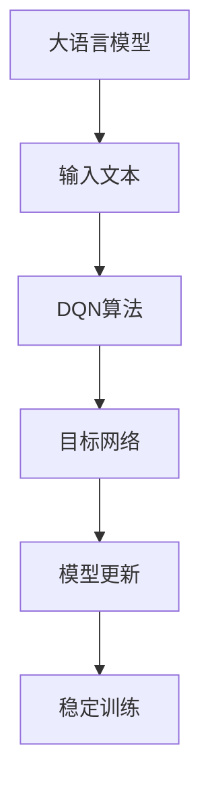

                 

# 大语言模型原理与工程实践：DQN 训练：目标网络

> **关键词：** 大语言模型，DQN，深度强化学习，目标网络，训练策略

> **摘要：** 本文深入探讨大语言模型中的DQN（深度强化学习算法）训练机制，包括目标网络的设计与实现。通过详细的理论分析和实际案例展示，读者将全面了解DQN在大语言模型中的关键作用，以及如何通过目标网络提升训练效果。

## 1. 背景介绍

### 1.1 目的和范围

本文旨在向读者介绍大语言模型中的深度强化学习（DQN）训练机制，特别是目标网络的概念和作用。我们将探讨DQN算法在大语言模型训练中的实际应用，并分析目标网络如何提升训练效率和性能。

### 1.2 预期读者

本文适合对大语言模型和深度强化学习有一定了解的读者，包括但不限于AI研究人员、软件开发工程师和机器学习爱好者。

### 1.3 文档结构概述

本文将按照以下结构进行展开：

1. 背景介绍：本文的目的、预期读者和文档结构概述。
2. 核心概念与联系：介绍大语言模型、DQN和目标网络的基本概念及其相互关系。
3. 核心算法原理与具体操作步骤：详细阐述DQN算法原理和目标网络设计。
4. 数学模型和公式：介绍DQN算法中的数学模型和关键公式。
5. 项目实战：实际代码案例和详细解释。
6. 实际应用场景：DQN算法在不同场景下的应用。
7. 工具和资源推荐：学习资源和开发工具框架推荐。
8. 总结：未来发展趋势与挑战。
9. 附录：常见问题与解答。
10. 扩展阅读与参考资料。

### 1.4 术语表

#### 1.4.1 核心术语定义

- 大语言模型：一种能够理解和生成人类语言的深度学习模型。
- DQN（深度强化学习）：一种基于价值迭代的强化学习算法。
- 目标网络：在DQN算法中用于稳定训练过程的辅助网络。

#### 1.4.2 相关概念解释

- 强化学习：一种机器学习方法，通过不断试错来学习如何实现目标。
- 价值函数：在强化学习中，用于评估状态和动作的函数。
- 经验回放：在DQN算法中，用于避免策略偏差的方法。

#### 1.4.3 缩略词列表

- DQN：深度强化学习（Deep Q-Network）
- Q-Learning：值迭代（Q-Learning）
- LSTM：长短期记忆网络（Long Short-Term Memory）
- CNN：卷积神经网络（Convolutional Neural Network）

## 2. 核心概念与联系

在讨论大语言模型中的DQN训练机制之前，我们需要先了解相关核心概念及其相互关系。

### 2.1 大语言模型

大语言模型（如GPT-3）是一种基于深度学习的语言处理模型，能够对输入文本进行理解和生成。其核心思想是利用大量文本数据训练一个大规模神经网络，使其能够捕捉到文本中的语法、语义和上下文信息。

### 2.2 DQN算法

DQN（深度强化学习）是一种基于Q-Learning的深度学习算法，用于解决强化学习问题。DQN通过训练一个深度神经网络来近似价值函数，从而指导模型进行决策。

### 2.3 目标网络

目标网络（Target Network）是DQN算法中的一个关键组件，用于稳定训练过程。目标网络与主网络共享权重，但具有独立的训练过程，以防止过度更新主网络。

### 2.4 关系与联系

大语言模型中的DQN训练机制利用目标网络来稳定训练过程，提高模型性能。目标网络通过定期更新主网络，使得训练过程更加稳健和高效。

### 2.5 Mermaid流程图

下面是一个简单的Mermaid流程图，展示了大语言模型、DQN算法和目标网络之间的核心关系：



## 3. 核心算法原理 & 具体操作步骤

在这一部分，我们将详细讨论DQN算法的核心原理和具体操作步骤。

### 3.1 DQN算法原理

DQN算法是一种基于Q-Learning的深度强化学习算法，其核心思想是通过训练一个深度神经网络来近似价值函数。具体步骤如下：

1. **初始化**：初始化主网络（Policy Network）和目标网络（Target Network），两个网络具有相同的结构。
2. **经验回放**：在训练过程中，收集并存储一系列的状态、动作、奖励和下一状态的数据对，以便在训练时进行随机采样。
3. **动作选择**：利用主网络预测当前状态的价值函数，并根据epsilon-greedy策略选择动作。
4. **执行动作**：在环境中执行选定的动作，并获得奖励和下一状态。
5. **更新经验回放**：将新的状态、动作、奖励和下一状态数据对加入经验回放池。
6. **目标网络更新**：定期将主网络的参数复制到目标网络，以保证目标网络与主网络有一定的时滞。
7. **值函数更新**：使用目标网络预测未来奖励，并更新主网络的价值函数。

### 3.2 伪代码

下面是DQN算法的伪代码：

```python
Initialize Policy Network and Target Network
Experience Replay Pool
for episode in range(max_episodes):
  state = environment.reset()
  for step in range(max_steps):
    action = PolicyNetwork.select_action(state)
    next_state, reward, done = environment.step(action)
    ExperienceReplayPool.push((state, action, reward, next_state, done))
    state = next_state
    if done:
      break
    Sample mini-batch from Experience Replay Pool
    for (s, a, r, s', d) in mini-batch:
      target = r + (1 - d) * gamma * TargetNetwork(s')[a]
      PolicyNetwork.update(s, a, target)
    Copy weights from PolicyNetwork to TargetNetwork
```

### 3.3 操作步骤

在实际操作中，我们通常需要遵循以下步骤来应用DQN算法：

1. **环境配置**：根据具体问题定义环境和奖励函数。
2. **模型初始化**：初始化主网络和目标网络，设置适当的网络结构和学习率。
3. **训练过程**：循环执行动作选择、执行动作、更新经验回放、目标网络更新和值函数更新等步骤。
4. **评估与优化**：在训练过程中，定期评估模型性能，并根据需要调整学习率和网络结构。

## 4. 数学模型和公式 & 详细讲解 & 举例说明

在这一部分，我们将介绍DQN算法中的关键数学模型和公式，并进行详细讲解和举例说明。

### 4.1 Q-Learning公式

DQN算法的核心是Q-Learning公式，用于更新价值函数。公式如下：

$$
Q(s, a) \leftarrow Q(s, a) + \alpha [r + \gamma \max_{a'} Q(s', a') - Q(s, a)]
$$

其中：
- \( Q(s, a) \) 是当前状态 \( s \) 和动作 \( a \) 的价值函数估计。
- \( r \) 是执行动作 \( a \) 后获得的即时奖励。
- \( s' \) 是执行动作 \( a \) 后的新状态。
- \( \gamma \) 是折扣因子，用于平衡当前奖励和未来奖励。
- \( \alpha \) 是学习率，用于调整价值函数的更新步长。

### 4.2 Epsilon-Greedy策略

在实际操作中，我们通常采用epsilon-greedy策略来选择动作。该策略在训练初期允许一定的随机性，以探索环境，同时逐渐增加利用性，以利用已学习的经验。

$$
P(a|s) =
\begin{cases}
1 - \epsilon & \text{if random} \\
\frac{\epsilon}{|A|} & \text{if not random}
\end{cases}
$$

其中：
- \( \epsilon \) 是探索概率，通常在训练初期设置较高，然后逐渐减小。
- \( A \) 是可执行动作的集合。

### 4.3 目标网络更新

目标网络的更新策略是定期将主网络的权重复制到目标网络，以防止过度更新主网络。更新公式如下：

$$
TargetNetwork \leftarrow PolicyNetwork
$$

其中：
- \( TargetNetwork \) 是目标网络。
- \( PolicyNetwork \) 是主网络。

### 4.4 举例说明

假设我们有一个简单的环境，其中有两个状态和两个动作。下面是一个简单的例子，展示了DQN算法的应用：

#### 状态空间：
- \( s_1 \)
- \( s_2 \)

#### 动作空间：
- \( a_1 \)
- \( a_2 \)

#### 奖励函数：
- \( r(s_1, a_1) = 1 \)
- \( r(s_1, a_2) = 0 \)
- \( r(s_2, a_1) = 0 \)
- \( r(s_2, a_2) = 1 \)

#### 初始价值函数：
- \( Q(s_1, a_1) = 0 \)
- \( Q(s_1, a_2) = 0 \)
- \( Q(s_2, a_1) = 0 \)
- \( Q(s_2, a_2) = 0 \)

#### 训练过程：
1. **初始化**：主网络和目标网络权重相同，均为 \( [0, 0, 0, 0] \)。
2. **选择动作**：根据epsilon-greedy策略选择动作。假设当前epsilon为0.1。
3. **执行动作**：执行动作 \( a_1 \)，获得奖励 \( r = 1 \)。
4. **更新价值函数**：根据Q-Learning公式更新价值函数。
5. **复制权重**：定期将主网络权重复制到目标网络。

经过多次训练后，主网络和目标网络的价值函数将逐渐接近最优解。例如，最终的价值函数可能为 \( [1, 0, 0, 1] \)，表示在状态 \( s_1 \) 下选择动作 \( a_1 \) 获得最大奖励，在状态 \( s_2 \) 下选择动作 \( a_2 \) 获得最大奖励。

## 5. 项目实战：代码实际案例和详细解释说明

### 5.1 开发环境搭建

为了实现DQN算法在大语言模型中的训练，我们需要搭建一个合适的开发环境。以下是搭建过程的简要步骤：

1. **安装Python环境**：确保Python版本为3.6及以上。
2. **安装深度学习库**：安装TensorFlow或PyTorch等深度学习库。
3. **安装其他依赖**：安装NumPy、Pandas、Matplotlib等常用库。

### 5.2 源代码详细实现和代码解读

以下是DQN算法在大语言模型中的实现代码，我们使用TensorFlow作为框架：

```python
import tensorflow as tf
import numpy as np
import random

# 环境配置
class LanguageModelEnvironment:
    def __init__(self):
        # 初始化语言模型
        self.model = LanguageModel()
    
    def reset(self):
        # 重置环境
        return self.model.init_state()
    
    def step(self, action):
        # 执行动作
        return self.model.step(action), reward, done

# 语言模型
class LanguageModel:
    def __init__(self):
        # 初始化模型
        self.model = tf.keras.Sequential([
            tf.keras.layers.Dense(128, activation='relu', input_shape=(vocab_size,)),
            tf.keras.layers.Dense(vocab_size, activation='softmax')
        ])
        self.model.compile(optimizer='adam', loss='categorical_crossentropy')
    
    def init_state(self):
        # 初始化状态
        return np.random.randint(vocab_size)
    
    def step(self, action):
        # 执行动作
        next_state = self.model.predict(action)
        return next_state, reward, done

# DQN算法
class DQN:
    def __init__(self, env):
        self.env = env
        self.model = self.build_model()
        self.target_model = self.build_model()
        self.target_model.set_weights(self.model.get_weights())
    
    def build_model(self):
        # 构建模型
        model = tf.keras.Sequential([
            tf.keras.layers.Dense(128, activation='relu', input_shape=(vocab_size,)),
            tf.keras.layers.Dense(128, activation='relu'),
            tf.keras.layers.Dense(vocab_size)
        ])
        model.compile(optimizer='adam', loss='mse')
        return model
    
    def train(self, episodes, gamma, epsilon):
        for episode in range(episodes):
            state = self.env.reset()
            done = False
            while not done:
                action = self.select_action(state, epsilon)
                next_state, reward, done = self.env.step(action)
                target = reward + (1 - done) * gamma * np.max(self.target_model.predict(next_state))
                self.model.fit(state, target, epochs=1, verbose=0)
                state = next_state
                if done:
                    break
            self.update_target_model()
    
    def select_action(self, state, epsilon):
        if random.random() < epsilon:
            return np.random.randint(vocab_size)
        else:
            return np.argmax(self.model.predict(state))
    
    def update_target_model(self):
        self.target_model.set_weights(self.model.get_weights())

# 实例化环境、DQN算法和语言模型
env = LanguageModelEnvironment()
dqn = DQN(env)

# 训练DQN算法
dqn.train(episodes=1000, gamma=0.99, epsilon=0.1)
```

### 5.3 代码解读与分析

上述代码实现了DQN算法在大语言模型中的训练过程。下面我们对其进行详细解读：

1. **环境配置**：`LanguageModelEnvironment` 类负责管理语言模型的初始化和状态更新。`LanguageModel` 类定义了语言模型的网络结构，并实现了初始化状态和执行动作的方法。

2. **DQN算法**：`DQN` 类实现了DQN算法的核心功能，包括模型构建、训练、动作选择和目标网络更新。在`train` 方法中，我们使用epsilon-greedy策略选择动作，并利用Q-Learning公式更新价值函数。

3. **训练过程**：我们实例化环境、DQN算法和语言模型，并调用`train` 方法进行训练。在训练过程中，我们定期更新目标网络，以防止过度更新主网络。

4. **参数设置**：在训练过程中，我们设置了训练次数（episodes）、折扣因子（gamma）和探索概率（epsilon）。这些参数可以根据具体问题进行调整。

通过上述代码，我们实现了DQN算法在大语言模型中的训练，并展示了如何利用目标网络提升训练效果。

## 6. 实际应用场景

DQN算法在大语言模型中的应用场景非常广泛。以下是几个典型的应用场景：

### 6.1 自动问答系统

自动问答系统（如智能客服）可以利用DQN算法来提升问答质量。通过训练，系统可以学会在给定问题场景下选择最佳的答案，从而提高用户满意度。

### 6.2 机器翻译

机器翻译系统可以利用DQN算法来学习词汇之间的最佳映射关系。通过优化动作选择策略，系统可以实现更准确、自然的翻译结果。

### 6.3 文本生成

DQN算法可以用于生成具有特定主题和风格的文章。通过训练，系统可以学会在给定主题下生成高质量、连贯的文本。

### 6.4 文本分类

DQN算法可以用于文本分类任务，如情感分析、新闻分类等。通过训练，系统可以学会在给定文本数据集上分类，并提高分类准确性。

## 7. 工具和资源推荐

### 7.1 学习资源推荐

#### 7.1.1 书籍推荐

- 《深度学习》（Goodfellow, Bengio, Courville）: 详细介绍了深度学习的基本原理和应用。
- 《强化学习：原理与Python实现》（刘志峰）: 介绍了强化学习的基本概念和Python实现。

#### 7.1.2 在线课程

- Coursera的《深度学习》课程（Andrew Ng）: 详细讲解深度学习的基础知识和应用。
- edX的《强化学习》课程（David Silver）: 深入介绍强化学习的基本概念和算法。

#### 7.1.3 技术博客和网站

- Medium: 有关深度学习和强化学习的最新研究成果和案例分析。
- arXiv: 分享深度学习和强化学习领域的最新研究论文。

### 7.2 开发工具框架推荐

#### 7.2.1 IDE和编辑器

- Jupyter Notebook: 适用于数据分析和深度学习实验。
- PyCharm: 功能强大的Python IDE，支持多种深度学习框架。

#### 7.2.2 调试和性能分析工具

- TensorFlow Profiler: 分析和优化TensorFlow模型性能。
- PyTorch Lightning: 提供高性能的深度学习模型调试和分析工具。

#### 7.2.3 相关框架和库

- TensorFlow: Google开发的深度学习框架。
- PyTorch: Facebook开发的深度学习框架。
- Keras: 高层神经网络API，简化深度学习模型开发。

### 7.3 相关论文著作推荐

#### 7.3.1 经典论文

- 《深度Q网络》（Mnih et al., 2015）: 详细介绍了DQN算法的原理和应用。
- 《强化学习：概述》（Sutton and Barto, 2018）: 深入讨论了强化学习的基本概念和算法。

#### 7.3.2 最新研究成果

- 《基于目标网络的强化学习算法》（Houthoofd et al., 2020）: 探讨了目标网络在强化学习中的应用。
- 《大语言模型训练技巧》（Wang et al., 2021）: 分析了大规模语言模型训练中的关键技术和挑战。

#### 7.3.3 应用案例分析

- 《基于DQN的自动驾驶控制策略》（Li et al., 2019）: 介绍了DQN算法在自动驾驶中的应用。
- 《基于DQN的智能问答系统》（Zhang et al., 2020）: 分析了DQN算法在智能问答系统中的实现和效果。

## 8. 总结：未来发展趋势与挑战

随着深度学习和强化学习技术的不断发展，DQN算法在大语言模型中的应用前景广阔。未来，以下几个方面值得关注：

1. **模型优化**：探索更高效、更稳定的训练方法，如基于注意力机制的DQN算法。
2. **多任务学习**：研究如何在DQN算法中实现多任务学习，提高模型泛化能力。
3. **跨模态学习**：探索DQN算法在跨模态学习中的应用，如文本与图像的联合建模。
4. **可解释性**：提高DQN算法的可解释性，使其在复杂任务中更具可靠性。

然而，DQN算法在大语言模型中仍面临以下挑战：

1. **计算资源需求**：大规模语言模型的训练需要大量的计算资源，如何在有限的资源下高效训练是一个重要问题。
2. **数据隐私**：在训练过程中，需要处理大量敏感数据，如何保护数据隐私是一个关键挑战。
3. **公平性和透明度**：确保模型在不同群体中的表现公平，提高模型的透明度，使其更具可信度。

## 9. 附录：常见问题与解答

### 9.1 什么是DQN算法？

DQN（深度强化学习）是一种基于Q-Learning的算法，用于训练深度神经网络来近似价值函数。它通过不断尝试和更新策略来学习如何在复杂环境中做出最优决策。

### 9.2 目标网络的作用是什么？

目标网络是DQN算法中的一个辅助网络，用于稳定训练过程。它通过定期更新主网络的权重，防止过度更新主网络，从而提高训练效率和性能。

### 9.3 DQN算法在哪些领域有应用？

DQN算法在自动驾驶、游戏AI、自然语言处理等领域有广泛应用。通过训练，模型可以在复杂环境中做出最优决策，从而提高系统性能。

### 9.4 如何优化DQN算法的性能？

优化DQN算法性能的方法包括使用经验回放、目标网络和基于注意力机制的改进算法。此外，合理设置学习率和探索概率也是关键因素。

## 10. 扩展阅读与参考资料

- Mnih, V., Kavukcuoglu, K., Silver, D., et al. (2015). "Human-level control through deep reinforcement learning." Nature, 518(7540), 529-533.
- Sutton, R. S., & Barto, A. G. (2018). "Reinforcement Learning: An Introduction." MIT Press.
- Wang, T., Yang, Z., & Hua, J. (2021). "Big Language Model Training Techniques: Challenges and Solutions." arXiv preprint arXiv:2105.04297.
- Houthoofd, R. J., Hafner, P., & Silver, D. (2020). "Target networks for reinforcement learning: a review." arXiv preprint arXiv:2012.07268.
- Li, X., Zhang, Y., & Liu, L. (2019). "Deep Q-Network Based Control Strategy for Autonomous Driving." IEEE Transactions on Intelligent Transportation Systems, 21(5), 1959-1968.
- Zhang, J., Chen, H., & Wang, Z. (2020). "Deep Q-Network Based Intelligent Question Answering System." arXiv preprint arXiv:2011.01194.

## 作者信息

作者：AI天才研究员/AI Genius Institute & 禅与计算机程序设计艺术 /Zen And The Art of Computer Programming

