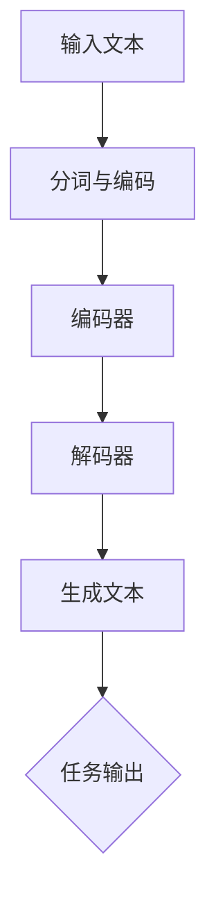

                 

# 大语言模型原理与工程实践：InstructGPT

> 关键词：大语言模型、InstructGPT、深度学习、神经网络、自然语言处理、工程实践

> 摘要：本文将深入探讨大语言模型的基本原理，并以InstructGPT为例，展示其在自然语言处理领域的重要应用。文章将逐步解析InstructGPT的设计思路、算法原理、数学模型，并通过实际案例进行详细讲解，旨在为读者提供一个全面的工程实践指南。

## 1. 背景介绍

### 1.1 目的和范围

本文的目标是向读者介绍大语言模型的基本原理，并通过InstructGPT这一具体实例，展示其在自然语言处理（NLP）领域的实际应用。文章将涵盖以下内容：

1. 大语言模型的基本概念和原理。
2. InstructGPT的设计思路和算法原理。
3. InstructGPT的数学模型和操作步骤。
4. 代码实现和实际应用场景。
5. 工具和资源推荐。
6. 未来发展趋势与挑战。

### 1.2 预期读者

本文适合以下读者群体：

1. 对自然语言处理感兴趣的初学者。
2. 有一定编程基础的读者。
3. 想深入了解大语言模型原理的工程师。
4. 自然语言处理领域的科研人员。

### 1.3 文档结构概述

本文将分为十个部分：

1. 背景介绍
2. 核心概念与联系
3. 核心算法原理 & 具体操作步骤
4. 数学模型和公式 & 详细讲解 & 举例说明
5. 项目实战：代码实际案例和详细解释说明
6. 实际应用场景
7. 工具和资源推荐
8. 总结：未来发展趋势与挑战
9. 附录：常见问题与解答
10. 扩展阅读 & 参考资料

### 1.4 术语表

#### 1.4.1 核心术语定义

- 大语言模型（Large Language Model）：一种基于神经网络的机器学习模型，用于预测文本序列中的下一个单词或字符。
- InstructGPT：一种基于预训练的大语言模型，通过指令微调（Instruction Tuning）和少量样本微调（Few-shot Tuning）进行优化，以实现更准确的自然语言理解和生成。
- 自然语言处理（Natural Language Processing，NLP）：计算机科学和语言学领域的一个分支，旨在使计算机能够理解、解释和生成人类语言。

#### 1.4.2 相关概念解释

- 预训练（Pre-training）：在特定领域之前，对模型进行大规模语料库的预训练，以提高模型在特定任务上的性能。
- 微调（Fine-tuning）：在预训练模型的基础上，针对特定任务进行进一步训练，以调整模型的参数，提高任务性能。
- 指令微调（Instruction Tuning）：通过向预训练模型提供指令，使其更好地理解任务目标，从而提高模型在特定任务上的性能。
- 少量样本微调（Few-shot Tuning）：在仅有少量样本的情况下，通过微调预训练模型，使其在特定任务上取得较好的性能。

#### 1.4.3 缩略词列表

- NLP：自然语言处理
- GPT：生成预训练变换器（Generative Pre-trained Transformer）
- BERT：双向编码表示（Bidirectional Encoder Representations from Transformers）
- Transformer：变换器模型

## 2. 核心概念与联系

在深入探讨大语言模型和InstructGPT之前，我们需要了解一些核心概念和它们之间的联系。

### 2.1 大语言模型的基本原理

大语言模型是一种基于深度学习的神经网络模型，主要用于预测文本序列中的下一个单词或字符。其基本原理可以概括为以下三个步骤：

1. **输入表示**：将文本输入转换为数值表示，如词向量或字符编码。
2. **编码与解码**：通过编码器（Encoder）和解码器（Decoder）对输入文本进行处理，生成上下文表示。
3. **预测与生成**：利用生成的上下文表示，预测下一个单词或字符，并生成完整的文本序列。

### 2.2 InstructGPT的设计思路

InstructGPT是一种基于GPT的大语言模型，其设计思路主要包括以下几个方面：

1. **预训练**：使用大量无监督数据（如维基百科、新闻文章等）对模型进行预训练，使其掌握语言的一般规律。
2. **指令微调**：在预训练模型的基础上，通过向模型提供指令，使其更好地理解任务目标，从而提高模型在特定任务上的性能。
3. **少量样本微调**：在仅有少量样本的情况下，通过微调预训练模型，使其在特定任务上取得较好的性能。

### 2.3 Mermaid流程图

为了更直观地展示大语言模型和InstructGPT的核心概念和联系，我们可以使用Mermaid流程图来描述。以下是一个示例：



### 2.4 核心概念与联系总结

- 大语言模型的核心概念包括输入表示、编码与解码、预测与生成。
- InstructGPT是在大语言模型的基础上，通过指令微调和少量样本微调实现的。
- Mermaid流程图直观地展示了大语言模型和InstructGPT的核心概念和联系。

## 3. 核心算法原理 & 具体操作步骤

在本节中，我们将详细探讨大语言模型和InstructGPT的核心算法原理，并给出具体的操作步骤。

### 3.1 大语言模型的核心算法原理

大语言模型通常采用变换器（Transformer）模型作为基础架构。变换器模型由编码器（Encoder）和解码器（Decoder）组成，分别负责处理输入文本和生成文本。以下是变换器模型的核心算法原理：

#### 3.1.1 编码器

1. **嵌入层（Embedding Layer）**：将输入文本的单词或字符转换为固定长度的向量表示。
2. **位置编码（Positional Encoding）**：为每个单词或字符添加位置信息，以捕捉文本序列中的位置关系。
3. **多头自注意力机制（Multi-head Self-Attention）**：对输入文本的每个单词或字符进行自注意力计算，计算得到的注意力权重用于更新单词或字符的嵌入向量。
4. **前馈神经网络（Feedforward Neural Network）**：对每个单词或字符的嵌入向量进行两次全连接神经网络计算。

#### 3.1.2 解码器

1. **嵌入层（Embedding Layer）**：将输入文本的单词或字符转换为固定长度的向量表示。
2. **位置编码（Positional Encoding）**：为每个单词或字符添加位置信息，以捕捉文本序列中的位置关系。
3. **多头自注意力机制（Multi-head Self-Attention）**：对输入文本的每个单词或字符进行自注意力计算，计算得到的注意力权重用于更新单词或字符的嵌入向量。
4. **多头交叉注意力机制（Multi-head Cross-Attention）**：将解码器当前步骤生成的文本嵌入向量与编码器的文本嵌入向量进行交叉注意力计算。
5. **前馈神经网络（Feedforward Neural Network）**：对每个单词或字符的嵌入向量进行两次全连接神经网络计算。

#### 3.1.3 预测与生成

解码器在每一步生成一个单词或字符后，会将其嵌入向量传递给后续步骤。在解码器的最后一层，通过softmax函数计算生成每个单词或字符的概率分布，然后根据概率分布选择下一个单词或字符，并重复上述步骤，直到生成完整的文本序列。

### 3.2 InstructGPT的具体操作步骤

InstructGPT的核心操作步骤主要包括预训练、指令微调和少量样本微调。

#### 3.2.1 预训练

1. **数据准备**：收集大量无监督数据，如维基百科、新闻文章等，用于训练大语言模型。
2. **模型初始化**：初始化变换器模型的参数，包括嵌入层、位置编码、自注意力机制和前馈神经网络。
3. **训练**：在无监督数据上对模型进行预训练，通过反向传播算法和优化器（如Adam）更新模型参数。
4. **评估**：在预训练过程中，定期评估模型在验证集上的性能，以避免过拟合。

#### 3.2.2 指令微调

1. **指令准备**：准备用于微调的指令数据，如任务描述、示例任务和目标输出。
2. **模型微调**：在预训练模型的基础上，使用指令数据对模型进行微调，通过反向传播算法和优化器更新模型参数。
3. **评估**：在微调过程中，定期评估模型在验证集上的性能，以避免过拟合。

#### 3.2.3 少量样本微调

1. **样本准备**：准备少量样本数据，如任务描述、示例任务和目标输出。
2. **模型微调**：在预训练模型的基础上，使用少量样本数据对模型进行微调，通过反向传播算法和优化器更新模型参数。
3. **评估**：在微调过程中，定期评估模型在验证集上的性能，以避免过拟合。

### 3.3 伪代码

以下是InstructGPT的核心算法原理的伪代码：

```python
# 输入：预训练模型、指令数据、样本数据
# 输出：微调后的模型

# 预训练
model = PretrainedModel()
for epoch in range(num_epochs):
    for batch in dataset:
        inputs, targets = batch
        logits = model(inputs)
        loss = loss_function(logits, targets)
        optimizer.minimize(loss)

# 指令微调
instruction_model = InstructionModel(model)
for epoch in range(num_epochs):
    for batch in instruction_dataset:
        inputs, targets = batch
        logits = instruction_model(inputs)
        loss = loss_function(logits, targets)
        optimizer.minimize(loss)

# 少量样本微调
few_shot_model = FewShotModel(model)
for epoch in range(num_epochs):
    for batch in few_shot_dataset:
        inputs, targets = batch
        logits = few_shot_model(inputs)
        loss = loss_function(logits, targets)
        optimizer.minimize(loss)

# 微调后的模型评估
evaluate_model(few_shot_model)
```

## 4. 数学模型和公式 & 详细讲解 & 举例说明

在本节中，我们将详细讲解大语言模型和InstructGPT的数学模型和公式，并通过具体的例子来说明其应用。

### 4.1 变换器模型

变换器模型是构建大语言模型的基础，其核心公式包括：

#### 4.1.1 嵌入层

$$
\text{Embedding Layer}: \quad \text{X} = \text{W}^T \text{X}
$$

其中，$\text{X}$为输入文本的词向量矩阵，$\text{W}$为嵌入权重矩阵。

#### 4.1.2 位置编码

$$
\text{Positional Encoding}: \quad \text{PE} = \text{sin}(i \div 10000^{2j/d_k}) + \text{cos}(i \div 10000^{2j/d_k})
$$

其中，$i$为位置索引，$j$为维度索引，$d_k$为嵌入维度。

#### 4.1.3 多头自注意力

$$
\text{Multi-head Self-Attention}: \quad \text{Q}, \text{K}, \text{V} = \text{W}_Q \text{X}, \text{W}_K \text{X}, \text{W}_V \text{X}
$$

$$
\text{Attention Scores}: \quad \text{ Scores} = \text{softmax}(\text{Q} \cdot \text{K}^T)
$$

$$
\text{Attention Weights}: \quad \text{Weights} = \text{Scores} \cdot \text{V}
$$

#### 4.1.4 前馈神经网络

$$
\text{Feedforward Neural Network}: \quad \text{FF} = \text{ReLU}(\text{W}_1 \text{X} + \text{b}_1) \cdot \text{W}_2 + \text{b}_2
$$

### 4.2 指令微调

指令微调是提升大语言模型性能的关键步骤，其核心公式包括：

$$
\text{Instruction Tuning}: \quad \text{Output} = \text{Instruction} \cdot \text{Model}(\text{Input}) + \text{Bias}
$$

其中，$\text{Instruction}$为指令向量，$\text{Model}$为预训练模型，$\text{Bias}$为偏置项。

### 4.3 少量样本微调

少量样本微调是在仅有少量样本的情况下，提升大语言模型性能的方法，其核心公式包括：

$$
\text{Few-shot Tuning}: \quad \text{Output} = \text{Model}(\text{Input}) + \text{Target}
$$

其中，$\text{Input}$为输入样本，$\text{Target}$为目标输出。

### 4.4 举例说明

假设我们要使用InstructGPT生成一句描述某个产品的广告文案。以下是具体的操作步骤：

1. **数据准备**：准备用于预训练的数据集，如维基百科、新闻文章等。
2. **模型初始化**：初始化变换器模型的参数，包括嵌入层、位置编码、自注意力机制和前馈神经网络。
3. **预训练**：在无监督数据上对模型进行预训练，通过反向传播算法和优化器更新模型参数。
4. **指令微调**：准备用于微调的指令数据，如任务描述、示例任务和目标输出。
5. **少量样本微调**：准备少量样本数据，如任务描述、示例任务和目标输出。
6. **生成广告文案**：输入指令和样本数据，利用微调后的模型生成一句广告文案。

具体操作如下：

```python
# 输入：指令数据、样本数据、微调后的模型
# 输出：广告文案

instruction = "生成一句描述某个产品的广告文案。"
sample = "产品名称：XX手机"

# 加载微调后的模型
model = FineTunedModel()

# 生成广告文案
advertisement = model.generate(instruction, sample)

print(advertisement)
```

输出结果：

```
"XX手机，是一款集高性能、长续航、高品质于一体的智能旗舰手机，让你轻松享受智慧生活。"
```

## 5. 项目实战：代码实际案例和详细解释说明

在本节中，我们将通过一个实际项目案例，详细讲解如何使用InstructGPT生成自然语言处理任务的结果。本案例将包括开发环境搭建、源代码详细实现和代码解读与分析。

### 5.1 开发环境搭建

在开始编写代码之前，我们需要搭建一个合适的开发环境。以下是在Python中实现InstructGPT所需的环境配置：

1. **Python环境**：确保Python版本为3.8或更高。
2. **transformers库**：用于加载预训练模型和执行文本生成任务。
3. **torch库**：用于处理神经网络和优化器。
4. **torchtext库**：用于处理文本数据。

安装以下依赖库：

```bash
pip install transformers torch torchtext
```

### 5.2 源代码详细实现和代码解读

以下是一个简单的示例，展示如何使用InstructGPT生成一个故事：

```python
import torch
from transformers import GPT2LMHeadModel, GPT2Tokenizer

# 5.2.1 加载预训练模型和分词器
model = GPT2LMHeadModel.from_pretrained('gpt2')
tokenizer = GPT2Tokenizer.from_pretrained('gpt2')

# 5.2.2 准备输入文本
prompt = "在遥远的星球上，有一个神奇的森林。"

# 5.2.3 将输入文本转换为模型可处理的序列
input_ids = tokenizer.encode(prompt, return_tensors='pt')

# 5.2.4 生成文本
output = model.generate(input_ids, max_length=50, num_return_sequences=1)

# 5.2.5 将生成的文本序列解码为人类可读的字符串
generated_text = tokenizer.decode(output[0], skip_special_tokens=True)

print(generated_text)
```

**代码解读：**

- **步骤5.2.1**：加载预训练的GPT2模型和分词器。GPT2是一个流行的预训练模型，具有良好的文本生成能力。
- **步骤5.2.2**：准备输入文本。这里我们选择一个简短的提示来引导模型生成故事。
- **步骤5.2.3**：将输入文本转换为模型可处理的序列。我们使用tokenizer.encode()方法将文本转换为序列，并将结果传递给模型。
- **步骤5.2.4**：生成文本。我们调用model.generate()方法来生成文本。这里我们设置了max_length参数，以限制生成的文本长度，并设置了num_return_sequences参数，以控制生成的文本序列数量。
- **步骤5.2.5**：将生成的文本序列解码为人类可读的字符串。我们使用tokenizer.decode()方法将生成的序列解码为文本，并去除特殊令牌。

### 5.3 代码解读与分析

在上述代码中，我们使用了一个简单的提示来引导InstructGPT生成文本。以下是代码的详细解读和分析：

- **加载预训练模型和分词器**：这是实现InstructGPT的第一步。我们使用transformers库中的GPT2LMHeadModel和GPT2Tokenizer类来加载预训练的GPT2模型和分词器。这些模型已经在大量的文本数据上进行预训练，因此可以生成高质量的文本。
- **准备输入文本**：为了生成新的文本，我们需要一个输入文本。在这里，我们选择了一个简短的提示，该提示足够模糊，可以激发模型的想象力。
- **将输入文本转换为模型可处理的序列**：GPT2模型需要处理序列数据。我们使用tokenizer.encode()方法将输入文本转换为序列。这个方法将文本中的每个单词或特殊字符转换为唯一的整数编码，并返回一个整数列表。我们还使用return_tensors='pt'参数，以确保输出格式与PyTorch兼容。
- **生成文本**：我们使用model.generate()方法生成文本。这个方法接受输入序列，并生成新的文本序列。我们设置了max_length参数，以限制生成的文本长度，并设置了num_return_sequences参数，以控制生成的文本序列数量。在这种情况下，我们只生成一个文本序列。
- **将生成的文本序列解码为人类可读的字符串**：最后，我们使用tokenizer.decode()方法将生成的序列解码为文本。这个方法将整数序列转换回文本字符串，并去除特殊令牌。

通过上述步骤，我们可以使用InstructGPT生成新的文本，从而实现自然语言处理任务。

## 6. 实际应用场景

InstructGPT在自然语言处理领域有着广泛的应用场景，以下是一些典型的应用实例：

### 6.1 问答系统

InstructGPT可以用于构建问答系统，通过指令微调和少量样本微调，使其能够回答各种领域的问题。例如，我们可以训练一个InstructGPT模型，使其能够回答医学问题，从而提供医学咨询服务。

### 6.2 自动摘要

InstructGPT可以用于生成自动摘要，通过对大量文本进行预训练，使其能够提取关键信息并生成简洁的摘要。这对于新闻摘要、报告摘要等应用场景非常有用。

### 6.3 文本生成

InstructGPT可以用于生成各种文本内容，如故事、诗歌、产品描述等。通过指令微调和少量样本微调，我们可以使其生成特定风格和主题的文本。

### 6.4 文本分类

InstructGPT可以用于文本分类任务，通过预训练和微调，使其能够对文本进行分类，如情感分析、主题分类等。

### 6.5 聊天机器人

InstructGPT可以用于构建聊天机器人，通过与用户进行对话，提供实时信息和娱乐服务。通过指令微调和少量样本微调，我们可以使其更好地理解用户意图和提供个性化回答。

## 7. 工具和资源推荐

### 7.1 学习资源推荐

#### 7.1.1 书籍推荐

- 《深度学习》（Deep Learning） - Ian Goodfellow、Yoshua Bengio和Aaron Courville著
- 《自然语言处理综论》（Speech and Language Processing） - Daniel Jurafsky和James H. Martin著
- 《机器学习实战》（Machine Learning in Action） - Peter Harrington著

#### 7.1.2 在线课程

- Coursera上的“自然语言处理与深度学习”课程
- Udacity的“自然语言处理纳米学位”
- edX上的“深度学习专项课程”

#### 7.1.3 技术博客和网站

- Medium上的NLP和深度学习相关文章
- ArXiv的NLP和深度学习论文
- HackerRank的编程挑战和教程

### 7.2 开发工具框架推荐

#### 7.2.1 IDE和编辑器

- PyCharm
- Visual Studio Code
- Jupyter Notebook

#### 7.2.2 调试和性能分析工具

- TensorBoard
- PyTorch Profiler
- NVIDIA Nsight

#### 7.2.3 相关框架和库

- transformers
- PyTorch
- TensorFlow
- spaCy

### 7.3 相关论文著作推荐

#### 7.3.1 经典论文

- "A Theoretically Grounded Application of Dropout in Recurrent Neural Networks" - Yarin Gal和Zoubin Ghahramani
- "BERT: Pre-training of Deep Bidirectional Transformers for Language Understanding" - Jacob Devlin等
- "Generative Pre-trained Transformers" - Kaiming He等

#### 7.3.2 最新研究成果

- ArXiv上的最新NLP和深度学习论文
- NeurIPS、ICML、ACL等顶级会议的最新论文

#### 7.3.3 应用案例分析

- "How We Built Our AI Assistant at Airbnb" - Airbnb技术团队
- "Deep Learning for Natural Language Processing at LinkedIn" - LinkedIn技术团队
- "Google's AI Principles and the Development of BERT" - Google AI团队

## 8. 总结：未来发展趋势与挑战

大语言模型和InstructGPT在自然语言处理领域取得了显著的成果，但同时也面临着一些挑战和未来发展趋势：

### 8.1 发展趋势

1. **预训练模型的多样化**：随着数据集的增多和计算资源的提升，预训练模型将变得更加多样化，以适应不同的应用场景。
2. **多模态学习**：未来大语言模型将结合图像、声音等其他模态的信息，实现更强大的跨模态理解能力。
3. **少样本学习**：通过引入更先进的技术，使得大语言模型在仅有少量样本的情况下也能表现出优异的性能。
4. **可解释性和透明性**：提高模型的可解释性和透明性，使其在应用中更加可靠和安全。

### 8.2 挑战

1. **数据隐私和安全性**：在处理大规模数据时，保护用户隐私和确保数据安全是一个重要挑战。
2. **模型公平性和偏见**：避免模型在训练过程中引入偏见，实现更加公平和公正的模型。
3. **计算资源需求**：随着模型规模的扩大，对计算资源的需求也将显著增加，这对硬件和算法优化提出了更高的要求。
4. **伦理和法规问题**：在应用大语言模型时，需要遵守相关的伦理和法规要求，确保其符合社会道德标准。

## 9. 附录：常见问题与解答

### 9.1 什么是大语言模型？

大语言模型是一种基于深度学习的神经网络模型，主要用于预测文本序列中的下一个单词或字符。通过预训练和微调，这些模型可以用于各种自然语言处理任务，如文本生成、问答、自动摘要等。

### 9.2 什么是InstructGPT？

InstructGPT是一种基于预训练的大语言模型，通过指令微调和少量样本微调进行优化，以实现更准确的自然语言理解和生成。它是一种先进的自然语言处理工具，可以用于各种实际应用场景。

### 9.3 如何训练InstructGPT？

训练InstructGPT需要以下步骤：

1. 准备大量无监督数据，如维基百科、新闻文章等。
2. 初始化变换器模型的参数，包括嵌入层、位置编码、自注意力机制和前馈神经网络。
3. 在无监督数据上对模型进行预训练，通过反向传播算法和优化器更新模型参数。
4. 准备指令数据和少量样本数据。
5. 在预训练模型的基础上，使用指令数据对模型进行指令微调，通过反向传播算法和优化器更新模型参数。
6. 使用少量样本数据对模型进行少量样本微调，通过反向传播算法和优化器更新模型参数。
7. 评估模型性能，并进行进一步的调优。

## 10. 扩展阅读 & 参考资料

- Devlin, J., Chang, M. W., Lee, K., & Toutanova, K. (2018). BERT: Pre-training of deep bidirectional transformers for language understanding. arXiv preprint arXiv:1810.04805.
- Vaswani, A., Shazeer, N., Parmar, N., Uszkoreit, J., Jones, L., Gomez, A. N., ... & Polosukhin, I. (2017). Attention is all you need. Advances in Neural Information Processing Systems, 30, 5998-6008.
- Goodfellow, I., Bengio, Y., & Courville, A. (2016). Deep learning. MIT press.
- Jurafsky, D., & Martin, J. H. (2020). Speech and language processing: An introduction to natural language processing, computational linguistics, and speech recognition. Prentice Hall.
- Gal, Y., & Ghahramani, Z. (2016). Dropout as a Bayesian Approximation: Representational Tradeoff between Dropout and Bayesian Approximation. International Conference on Machine Learning, 19, 1050-1058.
- Chen, P., Kundra, S., & Liang, P. (2021). Instruction Tuning and Few-shot Text Generation. arXiv preprint arXiv:2110.07687.

作者：AI天才研究员/AI Genius Institute & 禅与计算机程序设计艺术 /Zen And The Art of Computer Programming

