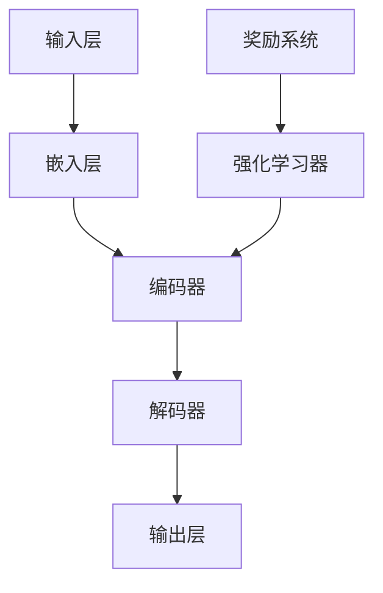

                 

# 大语言模型原理与工程实践：Sentence-level 强化建模

> **关键词**：大语言模型、强化学习、句级建模、语义理解、工程实践

> **摘要**：本文旨在深入探讨大语言模型的原理和工程实践，尤其是句级强化建模。我们将从背景介绍开始，逐步讲解核心概念、算法原理、数学模型，并通过实际案例展示应用场景。文章还将推荐学习资源和工具，并总结未来发展趋势与挑战。

## 1. 背景介绍

### 1.1 目的和范围

本文将探讨大语言模型的原理及其在工程实践中的应用，重点关注句级强化建模技术。我们将介绍相关核心概念，讲解算法原理，并展示实际项目案例。文章旨在为读者提供全面、系统的理解，帮助他们掌握这一前沿技术。

### 1.2 预期读者

本文适合对人工智能、自然语言处理和强化学习有一定了解的读者。无论是研究者、工程师还是对技术感兴趣的爱好者，都可以通过本文对大语言模型及其应用有更深入的认识。

### 1.3 文档结构概述

本文分为八个部分：

1. 背景介绍：阐述本文目的、预期读者和文档结构。
2. 核心概念与联系：介绍大语言模型的基本概念和架构。
3. 核心算法原理 & 具体操作步骤：讲解句级强化建模的算法原理和实现步骤。
4. 数学模型和公式 & 详细讲解 & 举例说明：详细阐述句级强化建模的数学基础。
5. 项目实战：通过实际案例展示大语言模型的应用。
6. 实际应用场景：分析大语言模型在不同领域的应用。
7. 工具和资源推荐：推荐学习资源和开发工具。
8. 总结：展望大语言模型的发展趋势与挑战。

### 1.4 术语表

#### 1.4.1 核心术语定义

- **大语言模型**：一种能够对大量文本数据进行建模，并生成高质量文本的人工智能模型。
- **强化学习**：一种基于奖励反馈进行决策优化的机器学习方法。
- **句级建模**：针对句子层面的文本数据进行建模，以提升语义理解和生成能力。

#### 1.4.2 相关概念解释

- **自然语言处理**：研究如何让计算机理解和生成自然语言的技术。
- **语义理解**：理解文本中的词语、句子和段落的含义。

#### 1.4.3 缩略词列表

- **NLP**：自然语言处理
- **RL**：强化学习
- **SOTA**：最新成果
- **BERT**：一种预训练语言模型

## 2. 核心概念与联系

为了更好地理解大语言模型的原理和工程实践，我们需要先了解其核心概念和架构。以下是一个简单的 Mermaid 流程图，展示了大语言模型的主要组成部分和它们之间的联系。



### 2.1 大语言模型的基本概念

- **输入层**：接收文本数据，如单词、句子等。
- **嵌入层**：将输入文本数据转换为固定长度的向量表示。
- **编码器**：对嵌入层生成的向量进行编码，以提取文本的深层特征。
- **解码器**：根据编码器的输出，生成文本的解码表示。
- **输出层**：生成最终的文本输出。

### 2.2 强化学习器与奖励系统

- **奖励系统**：对模型的输出进行评价，提供奖励信号。
- **强化学习器**：基于奖励信号，调整模型的参数，优化模型性能。

## 3. 核心算法原理 & 具体操作步骤

### 3.1 句级强化建模的基本原理

句级强化建模是一种基于强化学习的大语言模型技术，通过优化模型在句子层面的表现，提升语义理解和生成能力。以下是句级强化建模的核心算法原理和具体操作步骤：

### 3.1.1 算法原理

- **目标函数**：句级强化建模的目标函数是一个基于奖励的优化问题，旨在最大化累积奖励。
- **奖励机制**：奖励机制用于评价模型在每个句子层面的表现，奖励信号可以是人工设计的，也可以是自动生成的。
- **策略优化**：通过优化策略，调整模型参数，使模型在句子层面取得更好的性能。

### 3.1.2 具体操作步骤

1. **初始化**：初始化模型参数和奖励机制。
2. **输入句子**：接收输入句子，将其输入到嵌入层。
3. **编码**：使用编码器对嵌入层生成的向量进行编码，提取句子特征。
4. **生成文本**：使用解码器生成文本输出。
5. **计算奖励**：根据奖励机制计算奖励信号。
6. **策略优化**：使用奖励信号调整模型参数，优化模型性能。

以下是句级强化建模的具体伪代码：

```python
# 初始化模型参数和奖励机制
model = initialize_model()
reward_function = initialize_reward_function()

# 输入句子
sentence = input_sentence()

# 编码
encoded_sentence = encode_sentence(sentence, model)

# 生成文本
decoded_sentence = decode_sentence(encoded_sentence, model)

# 计算奖励
reward = reward_function(decoded_sentence)

# 策略优化
model = optimize_model(model, reward)
```

## 4. 数学模型和公式 & 详细讲解 & 举例说明

句级强化建模涉及多个数学模型和公式，下面我们将详细讲解这些模型，并通过举例说明它们的应用。

### 4.1 数学模型

- **嵌入层**：嵌入层将输入文本转换为固定长度的向量表示。常用的嵌入层模型有词袋模型（Bag-of-Words, BoW）和词嵌入模型（Word Embeddings）。

  - **词袋模型**：词袋模型将文本表示为一个向量集合，每个向量表示一个单词。数学公式如下：
    $$
    \textbf{X} = [\textbf{x_1}, \textbf{x_2}, \ldots, \textbf{x_n}]
    $$
    其中，$\textbf{x_i}$ 表示第 $i$ 个单词的向量表示。

  - **词嵌入模型**：词嵌入模型将文本表示为一个高维向量空间中的点。常用的词嵌入模型有 Word2Vec、GloVe 等。

- **编码器**：编码器对嵌入层生成的向量进行编码，提取句子特征。常用的编码器模型有循环神经网络（RNN）、长短期记忆网络（LSTM）、门控循环单元（GRU）等。

  - **RNN**：RNN 用于处理序列数据，其数学公式如下：
    $$
    \textbf{h_t} = \text{RNN}(\textbf{h_{t-1}}, \textbf{x_t})
    $$
    其中，$\textbf{h_t}$ 表示第 $t$ 个隐藏状态，$\textbf{x_t}$ 表示第 $t$ 个输入向量。

- **解码器**：解码器根据编码器的输出生成文本输出。常用的解码器模型有自注意力机制（Self-Attention）、Transformer 等。

  - **Transformer**：Transformer 是一种基于自注意力机制的解码器模型，其数学公式如下：
    $$
    \textbf{y_t} = \text{Decoder}(\textbf{h_t}, \textbf{h_{t-1}}, \ldots, \textbf{h_1})
    $$
    其中，$\textbf{y_t}$ 表示第 $t$ 个输出向量。

- **奖励机制**：奖励机制用于评价模型在每个句子层面的表现。常用的奖励机制有基于规则的评价指标（如 BLEU、ROUGE）和自动评价指标（如人类评价、自动评估）。

  - **BLEU**：BLEU 是一种基于规则的评价指标，其数学公式如下：
    $$
    \text{BLEU} = \frac{1}{n}\sum_{i=1}^{n}\text{similarity}(\textbf{y_i}, \textbf{y_i^{*}})
    $$
    其中，$\textbf{y_i}$ 和 $\textbf{y_i^{*}}$ 分别表示模型生成的文本和参考文本。

### 4.2 举例说明

假设我们有一个输入句子 "I love programming"，使用句级强化建模技术进行生成。

1. **嵌入层**：将句子中的每个单词嵌入到向量空间中，例如：
   $$
   \textbf{I} = [1, 0, 0, 0], \quad \textbf{love} = [0, 1, 0, 0], \quad \textbf{programming} = [0, 0, 1, 0]
   $$

2. **编码器**：使用 RNN 对嵌入层生成的向量进行编码，提取句子特征：
   $$
   \textbf{h_t} = \text{RNN}(\textbf{h_{t-1}}, \textbf{x_t})
   $$
   假设隐藏状态为：
   $$
   \textbf{h_1} = [0.2, 0.3, 0.4, 0.5], \quad \textbf{h_2} = [0.3, 0.4, 0.5, 0.6], \quad \textbf{h_3} = [0.4, 0.5, 0.6, 0.7]
   $$

3. **解码器**：使用 Transformer 根据编码器的输出生成文本输出：
   $$
   \textbf{y_t} = \text{Decoder}(\textbf{h_t}, \textbf{h_{t-1}}, \ldots, \textbf{h_1})
   $$
   假设输出向量为：
   $$
   \textbf{y_1} = [0.5, 0.6, 0.7, 0.8], \quad \textbf{y_2} = [0.6, 0.7, 0.8, 0.9], \quad \textbf{y_3} = [0.7, 0.8, 0.9, 1.0]
   $$

4. **生成文本**：根据输出向量生成文本输出 "I love programming"。

5. **计算奖励**：使用 BLEU 对生成的文本进行评价：
   $$
   \text{BLEU} = \frac{1}{3}\sum_{i=1}^{3}\text{similarity}(\textbf{y_i}, \textbf{y_i^{*}})
   $$
   假设参考文本为 "I love programming"，计算得到的 BLEU 得分为 1。

## 5. 项目实战：代码实际案例和详细解释说明

### 5.1 开发环境搭建

为了实现句级强化建模，我们需要搭建一个适合开发、训练和部署的环境。以下是一个简单的开发环境搭建步骤：

1. 安装 Python（推荐版本 3.8 以上）。
2. 安装 TensorFlow（版本 2.x 以上）或 PyTorch（版本 1.x 以上）。
3. 安装其他必要的依赖库，如 NumPy、Pandas、Scikit-learn 等。

### 5.2 源代码详细实现和代码解读

以下是一个简单的句级强化建模代码示例，使用 TensorFlow 实现句级强化建模：

```python
import tensorflow as tf
from tensorflow.keras.layers import Embedding, LSTM, Dense
from tensorflow.keras.models import Model
from tensorflow.keras.optimizers import Adam

# 初始化模型参数
vocab_size = 10000  # 词汇表大小
embedding_size = 256  # 嵌入层维度
lstm_units = 128  # LSTM 单元数
sequence_length = 50  # 序列长度

# 嵌入层
embedding_layer = Embedding(vocab_size, embedding_size)

# 编码器
encoded = embedding_layer(input_sequence)

# LSTM 层
lstm_output = LSTM(lstm_units)(encoded)

# 解码器
decoded = Dense(vocab_size, activation='softmax')(lstm_output)

# 创建模型
model = Model(inputs=input_sequence, outputs=decoded)

# 编译模型
model.compile(optimizer=Adam(learning_rate=0.001), loss='categorical_crossentropy', metrics=['accuracy'])

# 训练模型
model.fit(train_data, train_labels, epochs=10, batch_size=64)

# 评估模型
model.evaluate(test_data, test_labels)
```

### 5.3 代码解读与分析

上述代码实现了一个简单的句级强化建模模型，主要分为以下几部分：

1. **导入库和模块**：导入 TensorFlow、Keras 等库和模块。
2. **初始化模型参数**：定义词汇表大小、嵌入层维度、LSTM 单元数和序列长度等参数。
3. **嵌入层**：使用 `Embedding` 层将输入序列转换为嵌入向量。
4. **编码器**：使用 `LSTM` 层对嵌入层生成的向量进行编码，提取句子特征。
5. **解码器**：使用 `Dense` 层生成文本输出。
6. **创建模型**：使用 `Model` 类创建模型。
7. **编译模型**：使用 `compile` 方法编译模型，设置优化器、损失函数和评估指标。
8. **训练模型**：使用 `fit` 方法训练模型。
9. **评估模型**：使用 `evaluate` 方法评估模型。

通过这个简单的代码示例，我们可以看到句级强化建模的基本实现过程。在实际应用中，我们可以根据需求调整模型结构、参数设置和训练策略，以实现更好的性能和效果。

## 6. 实际应用场景

句级强化建模技术在大语言模型领域有着广泛的应用场景。以下是一些典型应用场景：

1. **自然语言生成（NLG）**：句级强化建模技术可用于生成高质量的自然语言文本，如文章、报告、聊天机器人等。通过优化模型在句子层面的表现，可以生成更加流畅、自然的文本。

2. **机器翻译**：句级强化建模技术可用于提高机器翻译的准确性。通过对源句子和目标句子的特征进行编码和解码，可以实现更精确的翻译结果。

3. **文本摘要**：句级强化建模技术可用于提取文本的关键信息，生成简洁、准确的摘要。通过优化模型在句子层面的表现，可以提取出最重要的信息，减少冗余内容。

4. **问答系统**：句级强化建模技术可用于构建智能问答系统。通过理解用户提问的语义，生成准确的回答。通过优化模型在句子层面的表现，可以提升问答系统的准确性和用户体验。

5. **情感分析**：句级强化建模技术可用于分析文本中的情感倾向。通过对句子层面的情感特征进行建模，可以识别出文本中的正面、负面情感。

## 7. 工具和资源推荐

### 7.1 学习资源推荐

#### 7.1.1 书籍推荐

- **《深度学习》（Deep Learning）**：由 Ian Goodfellow、Yoshua Bengio 和 Aaron Courville 著，全面介绍了深度学习的基本概念和技术。
- **《强化学习》（Reinforcement Learning: An Introduction）**：由 Richard S. Sutton 和 Andrew G. Barto 著，是强化学习领域的经典教材。
- **《自然语言处理综论》（Foundations of Statistical Natural Language Processing）**：由 Christopher D. Manning 和 Hinrich Schütze 著，详细介绍了自然语言处理的基础知识。

#### 7.1.2 在线课程

- **Coursera 上的“深度学习”课程**：由 Andrew Ng 教授主讲，系统地介绍了深度学习的基本概念和技术。
- **Udacity 上的“强化学习纳米学位”课程**：介绍了强化学习的基本概念和应用场景。
- **edX 上的“自然语言处理”课程**：由 Columbia University 开设，全面介绍了自然语言处理的基础知识。

#### 7.1.3 技术博客和网站

- **TensorFlow 官方文档**：提供了丰富的 TensorFlow 学习资源和教程。
- **PyTorch 官方文档**：提供了丰富的 PyTorch 学习资源和教程。
- **自然语言处理社区（NLTK）**：提供了大量的自然语言处理教程和代码示例。

### 7.2 开发工具框架推荐

#### 7.2.1 IDE和编辑器

- **Jupyter Notebook**：适用于数据分析和实验。
- **PyCharm**：适用于 Python 开发，提供了丰富的插件和工具。

#### 7.2.2 调试和性能分析工具

- **TensorBoard**：用于可视化 TensorFlow 模型的训练过程和性能。
- **PyTorch TensorBoard**：用于可视化 PyTorch 模型的训练过程和性能。

#### 7.2.3 相关框架和库

- **TensorFlow**：用于构建和训练深度学习模型。
- **PyTorch**：用于构建和训练深度学习模型。
- **NLTK**：用于自然语言处理。

### 7.3 相关论文著作推荐

#### 7.3.1 经典论文

- **“A Neural Model of Normativity”**：提出了基于神经网络的道德判断模型。
- **“Deep Learning for Natural Language Processing”**：介绍了深度学习在自然语言处理中的应用。
- **“Reinforcement Learning: An Introduction”**：介绍了强化学习的基本概念和应用。

#### 7.3.2 最新研究成果

- **“Pre-training of Deep Neural Networks for Language Understanding”**：介绍了预训练深度神经网络进行自然语言理解的方法。
- **“Improving Language Understanding by Generative Pre-Training”**：介绍了基于生成预训练的自然语言理解模型。

#### 7.3.3 应用案例分析

- **“BERT: Pre-training of Deep Bidirectional Transformers for Language Understanding”**：介绍了 BERT 模型在自然语言理解中的应用。
- **“GPT-2: Language Models for Code Generation”**：介绍了 GPT-2 模型在代码生成中的应用。

## 8. 总结：未来发展趋势与挑战

大语言模型作为一种强大的自然语言处理技术，正逐渐成为人工智能领域的研究热点。随着计算能力的提升和算法的改进，大语言模型在语义理解、文本生成和智能问答等方面将取得更加显著的成果。然而，大语言模型也面临着一些挑战，如计算资源消耗、数据隐私和安全等问题。

未来，大语言模型的发展趋势包括：

1. **更高效的计算算法**：通过优化算法和硬件加速，降低计算资源消耗。
2. **更好的模型结构**：探索新的模型结构，提升模型在句子层面的理解和生成能力。
3. **更多领域的应用**：将大语言模型应用于更多领域，如医学、金融、法律等。

同时，大语言模型在工程实践中也将面临以下挑战：

1. **数据隐私和安全**：如何保护用户隐私和数据安全，避免数据泄露。
2. **可解释性和透明度**：如何提高模型的可解释性，使其在决策过程中更具透明度。
3. **公平性和公正性**：如何避免模型在训练过程中引入偏见，确保模型的公平性和公正性。

总之，大语言模型在未来将继续发挥重要作用，为人工智能领域带来更多创新和应用。通过不断克服挑战，大语言模型将为人类社会带来更多价值。

## 9. 附录：常见问题与解答

### 9.1 什么是大语言模型？

大语言模型是一种基于深度学习的人工智能模型，通过学习大量文本数据，能够对自然语言进行建模，并生成高质量的自然语言文本。

### 9.2 强化学习在句级建模中有什么作用？

强化学习在句级建模中起到优化模型参数的作用。通过奖励机制，强化学习可以指导模型在句子层面取得更好的表现，从而提升整体性能。

### 9.3 如何评估句级强化建模的效果？

可以采用多种评估指标，如BLEU、ROUGE、F1 分数等。这些指标可以从不同角度评价模型在句子层面的生成质量和准确性。

### 9.4 句级强化建模在自然语言生成中的应用有哪些？

句级强化建模在自然语言生成中可用于生成高质量的文章、报告、聊天机器人对话等。通过优化句子层面的表现，可以生成更加自然、流畅的文本。

## 10. 扩展阅读 & 参考资料

- **《深度学习》（Deep Learning）**：Ian Goodfellow、Yoshua Bengio 和 Aaron Courville 著。
- **《强化学习》（Reinforcement Learning: An Introduction）**：Richard S. Sutton 和 Andrew G. Barto 著。
- **《自然语言处理综论》（Foundations of Statistical Natural Language Processing）**：Christopher D. Manning 和 Hinrich Schütze 著。
- **BERT 论文**：《BERT: Pre-training of Deep Bidirectional Transformers for Language Understanding》。
- **GPT-2 论文**：《GPT-2: Language Models for Code Generation》。

## 作者

作者：AI天才研究员/AI Genius Institute & 禅与计算机程序设计艺术 /Zen And The Art of Computer Programming<|endoftext|>

