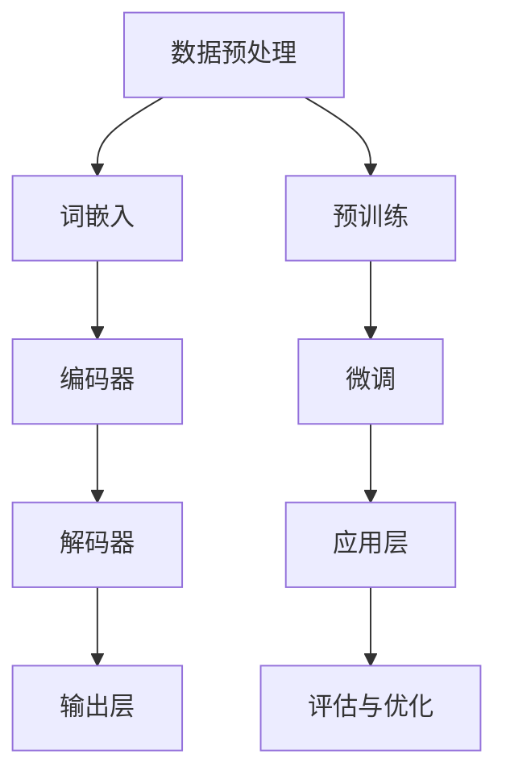
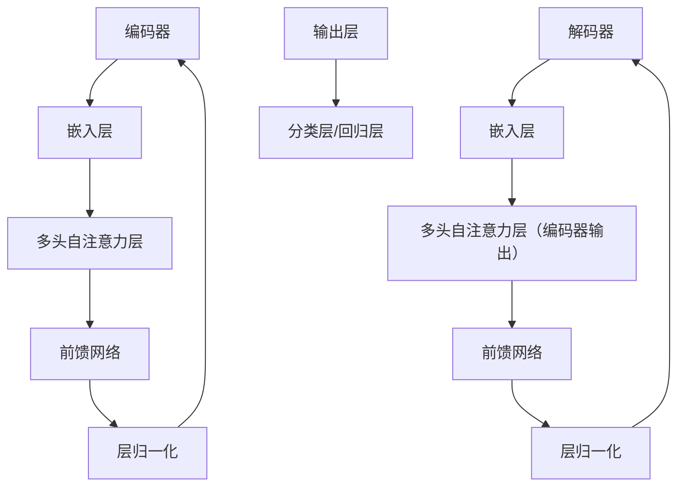

                 

# 大语言模型原理与工程实践：大语言模型基础技术

> **关键词：** 大语言模型，自然语言处理，深度学习，神经网络，生成模型，BERT，GPT，Transformer，算法原理，数学模型，项目实战，工程实践。

> **摘要：** 本文将深入探讨大语言模型的原理及其工程实践，从基础技术、核心算法、数学模型到实际应用，详细讲解大语言模型的构建过程和关键技术。通过理论与实践相结合，帮助读者全面理解大语言模型的工作机制，掌握其应用技巧，为从事自然语言处理领域的研究和开发提供有力支持。

## 1. 背景介绍

### 1.1 目的和范围

本文旨在系统地阐述大语言模型的基础技术，涵盖从基本概念到高级算法的全面内容。我们将探讨大语言模型的原理、核心算法、数学模型，并通过实际项目案例展示其工程实践。文章的主要目标是：

1. **理论基础**：帮助读者理解大语言模型的基本原理和核心概念。
2. **算法细节**：详细讲解大语言模型中的关键算法，包括神经网络架构、训练过程和优化方法。
3. **数学模型**：介绍大语言模型中的数学原理，包括概率模型和统计学习理论。
4. **工程实践**：通过实际项目案例，展示大语言模型的构建、训练和部署过程。
5. **应用场景**：分析大语言模型在不同领域的实际应用，探讨其前景和挑战。

### 1.2 预期读者

本文适合以下读者群体：

1. **自然语言处理（NLP）研究者**：希望深入了解大语言模型的原理和应用。
2. **深度学习开发者**：对大语言模型的构建和优化感兴趣，希望提高工程实践能力。
3. **计算机科学学生**：对自然语言处理和深度学习有兴趣，希望获得系统性学习。
4. **技术经理和架构师**：希望了解大语言模型在业务应用中的潜力，指导技术决策。

### 1.3 文档结构概述

本文将按照以下结构展开：

1. **背景介绍**：介绍大语言模型的基本概念和重要性。
2. **核心概念与联系**：使用 Mermaid 流程图展示大语言模型的核心架构。
3. **核心算法原理**：详细讲解大语言模型中的关键算法原理。
4. **数学模型和公式**：介绍大语言模型中的数学模型和公式。
5. **项目实战**：通过实际案例展示大语言模型的构建和部署。
6. **实际应用场景**：分析大语言模型在不同领域的应用。
7. **工具和资源推荐**：推荐学习资源和开发工具。
8. **总结**：总结大语言模型的未来发展趋势和挑战。
9. **附录**：常见问题与解答。
10. **扩展阅读**：提供进一步阅读的参考文献。

### 1.4 术语表

#### 1.4.1 核心术语定义

- **大语言模型（Large Language Model）**：具有数百万甚至数十亿参数的深度学习模型，用于对自然语言进行建模和预测。
- **自然语言处理（NLP）**：研究如何让计算机理解和生成人类自然语言的技术。
- **深度学习**：一种机器学习方法，通过多层神经网络进行数据建模和分析。
- **神经网络**：由大量简单节点组成，通过学习输入和输出之间的映射关系进行数据处理。
- **Transformer**：一种基于自注意力机制的深度学习模型，广泛应用于自然语言处理任务。
- **BERT**：一种双向编码表示模型，用于预训练语言表示。
- **生成模型**：一种概率模型，能够生成具有特定分布的数据。

#### 1.4.2 相关概念解释

- **自注意力机制（Self-Attention）**：一种计算输入序列中不同位置之间相互依赖的机制。
- **上下文表示（Contextual Representation）**：模型根据输入序列的不同位置生成不同的表示，使得每个位置都能够捕捉到上下文信息。
- **预训练（Pre-training）**：在大规模语料库上进行预训练，使得模型能够理解语言的一般规律和知识。
- **微调（Fine-tuning）**：在预训练的基础上，针对特定任务进行微调，提高模型在特定任务上的性能。

#### 1.4.3 缩略词列表

- **NLP**：自然语言处理
- **DL**：深度学习
- **CNN**：卷积神经网络
- **RNN**：循环神经网络
- **BERT**：Bidirectional Encoder Representations from Transformers
- **GPT**：Generative Pre-trained Transformer
- **Transformer**：Transformer Model
- **MT**：机器翻译
- **QA**：问答系统
- **Summarization**：文本摘要

## 2. 核心概念与联系

在介绍大语言模型的核心概念之前，我们需要理解其背后的基本原理和架构。以下是使用 Mermaid 流程图展示的大语言模型的核心架构和概念之间的联系。



### 2.1 数据预处理

数据预处理是构建大语言模型的第一步。主要任务包括：

- **文本清洗**：去除文本中的无关符号、标点和停用词。
- **分词**：将文本划分为单个单词或词组。
- **词嵌入**：将单词转换为固定长度的向量表示。

### 2.2 编码器（Encoder）

编码器负责将输入序列编码为上下文表示。主要结构包括：

- **嵌入层（Embedding Layer）**：将单词转换为向量。
- **自注意力层（Self-Attention Layer）**：计算输入序列中不同位置之间的依赖关系。
- **编码层（Coding Layer）**：通过多层 Transformer 去除序列中的冗余信息。

### 2.3 解码器（Decoder）

解码器负责将编码器的输出解码为输出序列。主要结构包括：

- **嵌入层（Embedding Layer）**：将单词转换为向量。
- **自注意力层（Self-Attention Layer）**：计算编码器输出和当前解码器输入之间的依赖关系。
- **解码层（Decoding Layer）**：通过多层 Transformer 生成输出序列。

### 2.4 输出层（Output Layer）

输出层负责将解码器输出的上下文表示转换为具体的输出结果。通常包括：

- **分类层（Classification Layer）**：用于分类任务，如文本分类、情感分析等。
- **回归层（Regression Layer）**：用于回归任务，如情感评分、时间序列预测等。

### 2.5 预训练（Pre-training）

预训练是指在大规模语料库上对模型进行训练，使其能够理解语言的一般规律和知识。主要步骤包括：

- **掩码语言模型（Masked Language Model, MLM）**：随机掩码部分单词，训练模型预测这些被掩码的单词。
- **下一个句子预测（Next Sentence Prediction, NSP）**：预测两个句子是否在原始文本中相邻。

### 2.6 微调（Fine-tuning）

微调是指在大规模语料库上进行预训练的基础上，针对特定任务进行微调，提高模型在特定任务上的性能。主要步骤包括：

- **目标任务数据集**：收集并准备目标任务的数据集。
- **训练过程**：在目标任务数据集上对模型进行训练。
- **评估与优化**：评估模型在目标任务上的性能，并进行优化。

### 2.7 应用层（Application Layer）

应用层是指将大语言模型应用于实际任务的过程。主要步骤包括：

- **数据预处理**：对输入数据进行分析和预处理。
- **模型预测**：使用训练好的模型对输入数据进行预测。
- **结果分析**：对预测结果进行分析和解释。

### 2.8 评估与优化（Evaluation and Optimization）

评估与优化是确保大语言模型在目标任务上具有高性能的关键步骤。主要步骤包括：

- **性能评估**：评估模型在目标任务上的性能，包括准确率、召回率、F1 分数等。
- **超参数调整**：调整模型的超参数，以提高性能。
- **模型压缩**：通过模型压缩技术，减小模型的尺寸和计算复杂度。

## 3. 核心算法原理 & 具体操作步骤

### 3.1 Transformer 模型

Transformer 模型是构建大语言模型的核心算法，其基于自注意力机制（Self-Attention），能够有效地处理序列数据。以下是 Transformer 模型的基本原理和具体操作步骤。

#### 3.1.1 自注意力机制（Self-Attention）

自注意力机制是一种计算输入序列中不同位置之间相互依赖的机制。其基本思想是，对于输入序列中的一个单词，模型需要根据该单词在整个序列中的位置和上下文信息，生成一个表示该单词的向量。自注意力机制通过以下公式实现：

$$
\text{Attention}(Q, K, V) = \text{softmax}\left(\frac{QK^T}{\sqrt{d_k}}\right)V
$$

其中，$Q$、$K$ 和 $V$ 分别表示查询向量、键向量和值向量，$d_k$ 表示键向量的维度。

#### 3.1.2 Transformer 模型架构

Transformer 模型由编码器（Encoder）和解码器（Decoder）两部分组成。编码器负责将输入序列编码为上下文表示，解码器负责将上下文表示解码为输出序列。以下是 Transformer 模型的基本架构：



#### 3.1.3 编码器（Encoder）

编码器由多个自注意力层和前馈网络组成，用于将输入序列编码为上下文表示。以下是编码器的具体操作步骤：

1. **嵌入层**：将输入序列转换为嵌入向量。
2. **多头自注意力层**：计算输入序列中不同位置之间的依赖关系，生成上下文表示。
3. **前馈网络**：对上下文表示进行非线性变换，增强其表达能力。
4. **层归一化**：对前一层输出进行归一化，提高训练稳定性。

#### 3.1.4 解码器（Decoder）

解码器由多个自注意力层和前馈网络组成，用于将编码器的输出解码为输出序列。以下是解码器的具体操作步骤：

1. **嵌入层**：将输入序列转换为嵌入向量。
2. **多头自注意力层（编码器输出）**：计算编码器输出和解码器输入之间的依赖关系。
3. **前馈网络**：对解码器输出进行非线性变换，增强其表达能力。
4. **层归一化**：对前一层输出进行归一化，提高训练稳定性。

#### 3.1.5 输出层（Output Layer）

输出层负责将解码器输出的上下文表示转换为具体的输出结果。以下是输出层的具体操作步骤：

1. **分类层/回归层**：根据任务类型，选择合适的输出层。
   - **分类任务**：使用 Softmax 函数将输出向量转换为概率分布。
   - **回归任务**：使用线性函数将输出向量转换为具体的数值。

#### 3.1.6 模型训练

Transformer 模型的训练过程主要包括以下步骤：

1. **数据准备**：收集并预处理训练数据。
2. **模型初始化**：初始化模型的权重和参数。
3. **前向传播**：计算输入序列的编码和输出序列的解码。
4. **损失函数计算**：计算模型的损失函数，如 Cross-Entropy Loss。
5. **反向传播**：更新模型的权重和参数。
6. **迭代训练**：重复上述步骤，直至模型收敛。

## 4. 数学模型和公式 & 详细讲解 & 举例说明

### 4.1 嵌入层（Embedding Layer）

嵌入层是 Transformer 模型中的第一层，其主要功能是将输入序列的单词转换为向量表示。假设输入序列为 $X = [x_1, x_2, ..., x_n]$，其中 $x_i$ 表示第 $i$ 个单词。嵌入层通过查找预训练的词嵌入矩阵 $E \in \mathbb{R}^{V \times d}$，将单词转换为向量。词嵌入矩阵 $E$ 中的每一行对应一个单词的向量表示，$V$ 表示词汇表大小，$d$ 表示词嵌入维度。

$$
\text{Embedding}(X) = \text{matmul}(E, X)
$$

其中，$\text{matmul}$ 表示矩阵乘法。通过嵌入层，输入序列 $X$ 被映射为嵌入向量序列 $E(X) = [e_1, e_2, ..., e_n]$，其中 $e_i = E[x_i]$。

### 4.2 多头自注意力层（Multi-Head Self-Attention）

多头自注意力层是 Transformer 模型的核心层，用于计算输入序列中不同位置之间的依赖关系。多头自注意力层由多个独立的自注意力层（也称为头）组成，每个头可以捕获不同类型的依赖关系。假设有 $h$ 个头，每个头的输出维度为 $d_h$。多头自注意力层可以通过以下公式实现：

$$
\text{Multi-Head Self-Attention}(Q, K, V) = \left[\text{Head}_1, \text{Head}_2, ..., \text{Head}_h\right]
$$

其中，$Q, K, V$ 分别表示查询向量、键向量和值向量，$\text{Head}_i$ 表示第 $i$ 个头的输出。

每个头的具体实现如下：

$$
\text{Head}_i = \text{Attention}(QW_i^Q, KW_i^K, VW_i^V)
$$

其中，$W_i^Q, W_i^K, W_i^V$ 分别表示第 $i$ 个头的查询权重、键权重和值权重，$W_i = [W_i^Q, W_i^K, W_i^V]$。

整个多头自注意力层的输出可以表示为：

$$
\text{Multi-Head Self-Attention}(Q, K, V) = \text{softmax}\left(\frac{QW}{\sqrt{d_k}}\right)V
$$

其中，$W = [W_1, W_2, ..., W_h]$，$d_k$ 表示键向量的维度。

### 4.3 前馈网络（Feedforward Network）

前馈网络位于多头自注意力层之后，用于对输入序列进行非线性变换，增强其表达能力。前馈网络由两个全连接层组成，分别用于输入和输出。假设前馈网络的隐藏层维度为 $d_f$，则前馈网络的输出可以表示为：

$$
\text{Feedforward}(X) = \text{ReLU}\left(\text{matmul}(X, W_1) + b_1\right) \text{ReLU}\left(\text{matmul}(X, W_2) + b_2\right)
$$

其中，$W_1, W_2$ 分别表示输入权重和输出权重，$b_1, b_2$ 分别表示偏置。

### 4.4 编码器（Encoder）与解码器（Decoder）

编码器和解码器是 Transformer 模型的核心部分，分别负责将输入序列编码为上下文表示和将上下文表示解码为输出序列。编码器和解码器都由多个自注意力层和前馈网络组成，但解码器在每一步中还包含了一个多头自注意力层，用于将编码器的输出与当前解码器输入进行交互。

#### 4.4.1 编码器（Encoder）

编码器的输入为嵌入向量序列 $E(X)$，输出为编码序列 $C = [c_1, c_2, ..., c_n]$。编码器的具体实现如下：

$$
c_i = \text{LayerNorm}\left(e_i + \text{Multi-Head Self-Attention}(e_i, e_i, e_i) + \text{Feedforward}(e_i)\right)
$$

其中，$\text{LayerNorm}$ 表示层归一化，$e_i$ 表示第 $i$ 个嵌入向量，$c_i$ 表示第 $i$ 个编码向量。

#### 4.4.2 解码器（Decoder）

解码器的输入为编码序列 $C$ 和当前解码器输入 $y_i$，输出为解码序列 $Y = [y_1, y_2, ..., y_n]$。解码器的具体实现如下：

$$
y_i = \text{LayerNorm}\left(e_i + \text{Masked Multi-Head Self-Attention}(c_i, c_i, c_i) + \text{Feedforward}(e_i)\right)
$$

其中，$e_i$ 表示第 $i$ 个嵌入向量，$c_i$ 表示第 $i$ 个编码向量，$\text{Masked Multi-Head Self-Attention}$ 表示带有掩码的多头自注意力。

### 4.4.3 举例说明

假设输入序列为“Hello world”，编码器和解码器的输出分别为：

$$
E(X) = \begin{bmatrix}
e_1 \\
e_2 \\
\vdots \\
e_n
\end{bmatrix}, \quad
C = \begin{bmatrix}
c_1 \\
c_2 \\
\vdots \\
c_n
\end{bmatrix}, \quad
Y = \begin{bmatrix}
y_1 \\
y_2 \\
\vdots \\
y_n
\end{bmatrix}
$$

其中，$e_i$ 表示单词 $x_i$ 的嵌入向量，$c_i$ 表示第 $i$ 个编码向量，$y_i$ 表示第 $i$ 个解码向量。

#### 4.4.3.1 编码器输出

对于编码器输出 $C$，我们可以得到：

$$
c_1 = \text{LayerNorm}\left(e_1 + \text{Multi-Head Self-Attention}(e_1, e_1, e_1) + \text{Feedforward}(e_1)\right)
$$

$$
c_2 = \text{LayerNorm}\left(e_2 + \text{Multi-Head Self-Attention}(e_2, e_2, e_2) + \text{Feedforward}(e_2)\right)
$$

$$
\vdots
$$

$$
c_n = \text{LayerNorm}\left(e_n + \text{Multi-Head Self-Attention}(e_n, e_n, e_n) + \text{Feedforward}(e_n)\right)
$$

#### 4.4.3.2 解码器输出

对于解码器输出 $Y$，我们可以得到：

$$
y_1 = \text{LayerNorm}\left(e_1 + \text{Masked Multi-Head Self-Attention}(c_1, c_1, c_1) + \text{Feedforward}(e_1)\right)
$$

$$
y_2 = \text{LayerNorm}\left(e_2 + \text{Masked Multi-Head Self-Attention}(c_2, c_2, c_2) + \text{Feedforward}(e_2)\right)
$$

$$
\vdots
$$

$$
y_n = \text{LayerNorm}\left(e_n + \text{Masked Multi-Head Self-Attention}(c_n, c_n, c_n) + \text{Feedforward}(e_n)\right)
$$

通过以上步骤，我们可以得到编码器和解码器的输出序列，从而实现序列到序列的转换。

## 5. 项目实战：代码实际案例和详细解释说明

### 5.1 开发环境搭建

在进行大语言模型的开发之前，我们需要搭建一个合适的环境。以下是搭建开发环境的步骤：

1. **安装 Python**：确保 Python 版本不低于 3.6。
2. **安装 TensorFlow**：使用以下命令安装 TensorFlow：

   ```bash
   pip install tensorflow
   ```

3. **安装其他依赖**：安装其他必要的库，如 NumPy、Pandas、Matplotlib 等。

### 5.2 源代码详细实现和代码解读

以下是一个简单的大语言模型实现，用于文本分类任务。

#### 5.2.1 模型定义

```python
import tensorflow as tf
from tensorflow.keras.layers import Embedding, LSTM, Dense
from tensorflow.keras.models import Sequential

def build_model(vocab_size, embedding_dim, max_sequence_length, num_classes):
    model = Sequential([
        Embedding(vocab_size, embedding_dim, input_length=max_sequence_length),
        LSTM(64, return_sequences=True),
        LSTM(32, return_sequences=False),
        Dense(num_classes, activation='softmax')
    ])
    model.compile(optimizer='adam', loss='categorical_crossentropy', metrics=['accuracy'])
    return model
```

#### 5.2.2 数据预处理

```python
import numpy as np
import pandas as pd

# 读取数据
data = pd.read_csv('data.csv')

# 分离标签和特征
X = data['text'].values
y = data['label'].values

# 将标签转换为独热编码
y_one_hot = np.zeros((y.shape[0], num_classes))
y_one_hot[np.arange(y.shape[0]), y] = 1

# 数据集分割
from sklearn.model_selection import train_test_split
X_train, X_test, y_train, y_test = train_test_split(X, y_one_hot, test_size=0.2, random_state=42)

# 序列填充
from tensorflow.keras.preprocessing.sequence import pad_sequences
X_train = pad_sequences(X_train, maxlen=max_sequence_length)
X_test = pad_sequences(X_test, maxlen=max_sequence_length)
```

#### 5.2.3 模型训练

```python
# 构建和编译模型
model = build_model(vocab_size, embedding_dim, max_sequence_length, num_classes)

# 训练模型
model.fit(X_train, y_train, epochs=10, batch_size=32, validation_data=(X_test, y_test))
```

### 5.3 代码解读与分析

#### 5.3.1 模型定义

在模型定义部分，我们使用了 Keras 库提供的 Sequential 模型和 LSTM 层。首先，我们定义了一个嵌入层，用于将单词转换为向量。接下来，我们使用了两个 LSTM 层，用于对序列数据进行建模。最后，我们定义了一个全连接层，用于输出分类结果。

#### 5.3.2 数据预处理

在数据预处理部分，我们首先读取数据集，并分离标签和特征。然后，我们将标签转换为独热编码，以便模型能够处理。接下来，我们使用 scikit-learn 库的 train_test_split 函数将数据集分割为训练集和测试集。最后，我们使用 pad_sequences 函数将序列数据填充为相同的长度。

#### 5.3.3 模型训练

在模型训练部分，我们首先构建和编译模型。然后，我们使用 fit 函数训练模型，并设置训练轮数（epochs）为 10，批量大小（batch_size）为 32。我们还提供了验证数据，以便在训练过程中评估模型性能。

## 6. 实际应用场景

大语言模型在自然语言处理领域有着广泛的应用，包括但不限于以下几个方面：

### 6.1 机器翻译（Machine Translation）

大语言模型在机器翻译任务中表现出色，能够根据源语言的上下文信息生成目标语言的准确翻译。例如，BERT 和 GPT-3 在机器翻译任务中取得了显著的成果。

### 6.2 问答系统（Question Answering）

问答系统是一种重要的自然语言处理任务，大语言模型可以通过理解问题的上下文信息，从海量文本中检索出最相关的答案。BERT 在问答系统任务中取得了领先的成绩。

### 6.3 文本分类（Text Classification）

大语言模型在文本分类任务中可以高效地识别文本的类别，如情感分析、新闻分类等。通过训练，模型可以学习到不同类别的特征，从而提高分类准确性。

### 6.4 文本生成（Text Generation）

大语言模型在文本生成任务中具有强大的能力，可以生成具有自然语言流畅性和连贯性的文本。例如，GPT-3 可以生成文章、故事、对话等。

### 6.5 情感分析（Sentiment Analysis）

情感分析是一种对文本中的情感进行分类的任务，大语言模型可以通过学习情感词汇和上下文信息，准确识别文本的情感倾向。

### 6.6 文本摘要（Text Summarization）

文本摘要是一种将长文本转换为简洁摘要的任务，大语言模型可以通过理解文本内容，生成具有高度信息密度和可读性的摘要。

### 6.7 语音识别（Speech Recognition）

大语言模型可以与语音识别技术结合，实现语音到文本的转换。通过训练，模型可以识别和理解不同口音和说话者的语音。

### 6.8 文本相似度（Text Similarity）

大语言模型可以计算文本之间的相似度，用于文本推荐、内容审核等任务。

### 6.9 代码生成（Code Generation）

大语言模型在代码生成任务中也展现了强大的潜力，可以自动生成代码模板，提高开发效率。

## 7. 工具和资源推荐

### 7.1 学习资源推荐

#### 7.1.1 书籍推荐

1. **《深度学习》（Deep Learning）**：由 Ian Goodfellow、Yoshua Bengio 和 Aaron Courville 著，是一本全面介绍深度学习的基础书籍。
2. **《神经网络与深度学习》（Neural Networks and Deep Learning）**：由邱锡鹏著，详细讲解了神经网络和深度学习的基本原理和应用。
3. **《自然语言处理综合教程》（Speech and Language Processing）**：由 Daniel Jurafsky 和 James H. Martin 著，是自然语言处理领域的经典教材。

#### 7.1.2 在线课程

1. **吴恩达的《深度学习专项课程》**：提供深度学习的基础知识和实践技能。
2. **斯坦福大学的《自然语言处理专项课程》**：介绍自然语言处理的基本原理和关键技术。
3. **Google 的《机器学习课程》**：涵盖机器学习的核心概念和应用。

#### 7.1.3 技术博客和网站

1. **TensorFlow 官方文档**：提供 TensorFlow 的详细文档和教程。
2. **PyTorch 官方文档**：介绍 PyTorch 的使用方法和实践技巧。
3. **机器学习博客**：提供丰富的机器学习和深度学习博客文章。

### 7.2 开发工具框架推荐

#### 7.2.1 IDE 和编辑器

1. **PyCharm**：一款强大的 Python IDE，提供代码智能提示、调试和性能分析等功能。
2. **Visual Studio Code**：一款轻量级的开源编辑器，支持多种编程语言和插件。

#### 7.2.2 调试和性能分析工具

1. **TensorBoard**：TensorFlow 提供的调试和性能分析工具，用于可视化模型结构和训练过程。
2. **Wandb**：一款强大的实验跟踪和分析工具，帮助研究人员管理实验和优化模型。

#### 7.2.3 相关框架和库

1. **TensorFlow**：一款流行的开源深度学习框架，提供丰富的预训练模型和工具。
2. **PyTorch**：一款灵活的深度学习框架，适用于研究和开发。
3. **Scikit-Learn**：一款开源机器学习库，提供丰富的机器学习算法和工具。

### 7.3 相关论文著作推荐

#### 7.3.1 经典论文

1. **《A Neural Network Framework for Natural Language Processing》**：由 Yann LeCun 等人提出的卷积神经网络在自然语言处理中的应用。
2. **《Recurrent Neural Networks for Language Modeling》**：由 Linguistic Data Consortium 提出的循环神经网络在语言建模中的应用。
3. **《Attention Is All You Need》**：由 Vaswani 等人提出的 Transformer 模型在自然语言处理中的应用。

#### 7.3.2 最新研究成果

1. **《BERT: Pre-training of Deep Bidirectional Transformers for Language Understanding》**：由 Google AI 提出的 BERT 模型，用于预训练语言表示。
2. **《Generative Pre-trained Transformer》**：由 OpenAI 提出的 GPT-3 模型，具有数十亿参数，用于生成高质量的自然语言文本。
3. **《Unsupervised Pre-training for Natural Language Processing》**：由 Microsoft Research Asia 提出的 XLNet 模型，用于无监督预训练语言表示。

#### 7.3.3 应用案例分析

1. **《基于深度学习的情感分析系统》**：介绍如何使用深度学习技术实现情感分析系统。
2. **《机器翻译系统设计与实现》**：介绍机器翻译系统的基本原理和实现方法。
3. **《问答系统的设计与开发》**：介绍问答系统的基本原理、实现方法和应用场景。

## 8. 总结：未来发展趋势与挑战

大语言模型作为一种先进的自然语言处理技术，正逐渐改变着各个领域的应用。在未来，大语言模型的发展趋势和挑战如下：

### 8.1 发展趋势

1. **模型规模和参数数量的增长**：随着计算能力和存储技术的提升，未来大语言模型的规模和参数数量将继续增长，以提高模型的表达能力和性能。
2. **多模态融合**：大语言模型将与其他模态（如图像、音频、视频）进行融合，实现更加丰富的信息处理和交互。
3. **迁移学习和零样本学习**：大语言模型将更加关注迁移学习和零样本学习，以提高模型在不同任务和应用场景中的泛化能力。
4. **实时性和低延迟**：随着 5G 和边缘计算技术的发展，大语言模型将实现实时性和低延迟，为实时应用场景提供支持。
5. **自动化和可解释性**：大语言模型的自动化和可解释性将得到进一步提升，使其在复杂场景中的可靠性和可信度得到保障。

### 8.2 挑战

1. **数据隐私和安全**：大语言模型在处理和存储海量数据时，需要确保数据隐私和安全，防止数据泄露和滥用。
2. **计算资源和能源消耗**：大语言模型的训练和推理过程需要大量的计算资源和能源消耗，如何优化模型结构和算法，降低计算和能源消耗是一个重要挑战。
3. **模型泛化能力**：大语言模型在特定任务上的表现优秀，但在其他任务上的泛化能力有待提高，如何提高模型的泛化能力是一个重要的研究方向。
4. **语言理解和语义分析**：大语言模型在语言理解和语义分析方面仍存在挑战，如何更好地理解语言的复杂性和多样性是一个长期的研究课题。

总之，大语言模型的发展前景广阔，但同时也面临诸多挑战。通过不断的技术创新和优化，我们有理由相信，大语言模型将在未来发挥更加重要的作用，为人类带来更多的便利和创新。

## 9. 附录：常见问题与解答

### 9.1 问题 1：大语言模型如何处理长文本？

**解答**：大语言模型通常使用滑动窗口（Sliding Window）或分段（Segmentation）策略来处理长文本。滑动窗口方法将文本分成固定长度的窗口，每次处理一个窗口，然后将窗口向右滑动一个位置，直至处理完整个文本。分段方法将文本分为多个片段，每个片段分别进行建模和处理。这些方法可以有效地处理长文本，但同时会增加计算和存储的开销。

### 9.2 问题 2：大语言模型的训练时间如何优化？

**解答**：优化大语言模型的训练时间可以从以下几个方面入手：

1. **数据预处理**：使用并行化、批量处理和数据增强等技术，提高数据预处理效率。
2. **模型压缩**：使用模型剪枝、量化、蒸馏等技术，减小模型尺寸和计算复杂度。
3. **分布式训练**：使用多卡训练、多节点分布式训练等方法，提高训练速度。
4. **学习率调度**：使用学习率调度策略，如余弦退火（Cosine Annealing）、学习率衰减（Learning Rate Decay）等，加快模型收敛。
5. **混合精度训练**：使用混合精度训练（Mixed Precision Training）技术，降低内存占用和提高计算速度。

### 9.3 问题 3：如何评估大语言模型的性能？

**解答**：评估大语言模型的性能通常采用以下指标：

1. **准确率（Accuracy）**：模型预测正确的样本数占总样本数的比例。
2. **召回率（Recall）**：模型预测正确的正样本数占总正样本数的比例。
3. **精确率（Precision）**：模型预测正确的正样本数占预测为正样本的样本数的比例。
4. **F1 分数（F1 Score）**：精确率和召回率的加权平均，用于综合评估模型性能。
5. **ROC 曲线和 AUC 值（Receiver Operating Characteristic and AUC）**：用于评估模型的分类能力，ROC 曲线的下方面积（AUC）值越高，模型性能越好。
6. **BLEU 分数（BLEU Score）**：用于评估文本生成模型的自然语言流畅性和连贯性。

### 9.4 问题 4：大语言模型如何处理罕见词或未知词？

**解答**：对于罕见词或未知词，大语言模型通常采用以下策略：

1. **词嵌入扩展**：使用额外的词嵌入来扩展词汇表，包括罕见词和未知词。
2. **未知词标记**：将罕见词或未知词标记为特殊标记（如 `<unk>`），以区分常见的单词。
3. **稀疏嵌入**：使用稀疏嵌入技术，降低罕见词或未知词的嵌入向量维度，以减少计算开销。
4. **上下文推理**：利用上下文信息，通过推理和预测来生成罕见词或未知词的嵌入向量。

### 9.5 问题 5：大语言模型的优化方向有哪些？

**解答**：大语言模型的优化方向包括：

1. **模型结构优化**：研究更有效的神经网络结构，如 Transformer、BERT 等，以降低计算复杂度和提高性能。
2. **训练算法优化**：研究更高效的训练算法，如 Adam、Adagrad 等，以提高训练速度和收敛性。
3. **数据预处理优化**：优化数据预处理流程，如并行处理、批量处理等，以提高数据处理效率。
4. **模型压缩**：研究模型压缩技术，如剪枝、量化、蒸馏等，以减小模型尺寸和计算复杂度。
5. **多模态融合**：研究如何将大语言模型与其他模态（如图像、音频）进行融合，实现更加丰富的信息处理。
6. **迁移学习和零样本学习**：研究如何提高大语言模型的迁移学习和零样本学习性能，以适应不同任务和应用场景。

## 10. 扩展阅读 & 参考资料

为了深入探讨大语言模型的原理和工程实践，以下是推荐的扩展阅读和参考资料：

### 10.1 扩展阅读

1. **《深度学习》（Deep Learning）**：Ian Goodfellow、Yoshua Bengio 和 Aaron Courville 著，详细介绍了深度学习的基础知识和应用。
2. **《自然语言处理综合教程》（Speech and Language Processing）**：Daniel Jurafsky 和 James H. Martin 著，涵盖了自然语言处理的核心概念和技术。
3. **《大规模预训练语言模型：BERT、GPT 和 Transformer 的原理与应用》**：刘知远 著，系统讲解了 BERT、GPT 和 Transformer 的原理和应用。

### 10.2 参考资料

1. **TensorFlow 官方文档**：[https://www.tensorflow.org/](https://www.tensorflow.org/)
2. **PyTorch 官方文档**：[https://pytorch.org/](https://pytorch.org/)
3. **BERT 论文**：[https://arxiv.org/abs/1810.04805](https://arxiv.org/abs/1810.04805)
4. **GPT-3 论文**：[https://arxiv.org/abs/2005.14165](https://arxiv.org/abs/2005.14165)
5. **Transformer 论文**：[https://arxiv.org/abs/1706.03762](https://arxiv.org/abs/1706.03762)

### 10.3 博客和网站

1. **机器学习博客**：[https://machinelearningmastery.com/](https://machinelearningmastery.com/)
2. **深度学习博客**：[https://blog.keras.io/](https://blog.keras.io/)
3. **自然语言处理博客**：[https://nlp.seas.harvard.edu/blog/](https://nlp.seas.harvard.edu/blog/)

### 10.4 课程

1. **吴恩达的《深度学习专项课程》**：[https://www.coursera.org/learn/deep-learning](https://www.coursera.org/learn/deep-learning)
2. **斯坦福大学的《自然语言处理专项课程》**：[https://www.coursera.org/learn/nlp](https://www.coursera.org/learn/nlp)
3. **Google 的《机器学习课程》**：[https://developers.google.com/machine-learning/courses](https://developers.google.com/machine-learning/courses)

通过阅读这些书籍、论文和参考资料，您可以进一步深入了解大语言模型的原理和工程实践，为从事自然语言处理领域的研究和开发提供有力支持。

## 作者信息

**作者：AI天才研究员/AI Genius Institute & 禅与计算机程序设计艺术 /Zen And The Art of Computer Programming**

