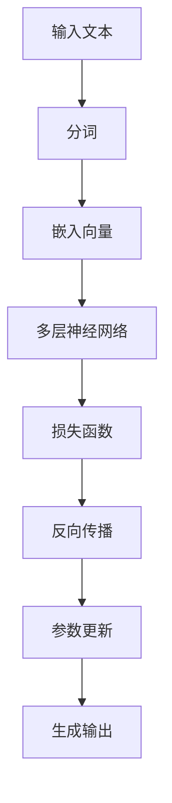
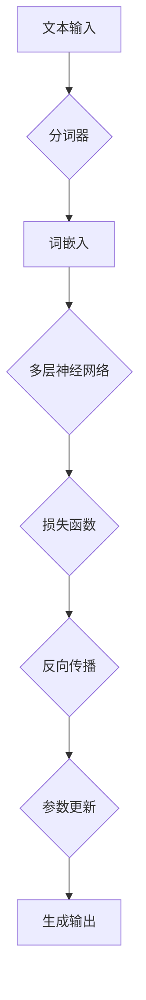

                 

# 大语言模型原理与工程实践：大语言模型的评测

## 关键词
- 大语言模型
- 评测
- 语言理解
- 生成式模型
- 统计学习
- 深度学习

## 摘要

本文旨在深入探讨大语言模型的原理及其在工程实践中的应用评测。我们将从背景介绍出发，逐步分析大语言模型的核心概念、算法原理和数学模型，并通过实际项目案例展示其应用。此外，文章还将讨论大语言模型在不同实际应用场景中的表现，推荐相关学习资源、工具和资源，并展望未来的发展趋势与挑战。通过本文的阅读，读者将全面了解大语言模型的工作原理、评测方法和实践应用。

## 1. 背景介绍

### 1.1 目的和范围

本文的目标是深入探讨大语言模型的原理及其在工程实践中的应用评测。我们将从以下几个方面展开：

1. **核心概念与联系**：介绍大语言模型的基础概念，并绘制流程图展示其原理和架构。
2. **核心算法原理**：详细阐述大语言模型的算法原理和具体操作步骤，使用伪代码进行说明。
3. **数学模型和公式**：解释大语言模型中的数学模型和公式，通过实际例子进行说明。
4. **项目实战**：通过实际代码案例，详细解释大语言模型的应用实现。
5. **实际应用场景**：讨论大语言模型在不同领域的应用，并分析其效果。
6. **工具和资源推荐**：推荐学习资源、开发工具和框架，以及相关论文和研究。
7. **总结**：总结大语言模型的发展趋势与面临的挑战。

### 1.2 预期读者

本文的预期读者包括：

1. **计算机科学专业的研究生和本科生**：希望深入了解大语言模型原理和应用的学术研究者。
2. **软件开发工程师**：在项目开发中需要使用大语言模型的工程师。
3. **人工智能爱好者**：对大语言模型和自然语言处理感兴趣的技术爱好者。

### 1.3 文档结构概述

本文的结构如下：

1. **背景介绍**：介绍本文的目的、预期读者和文档结构。
2. **核心概念与联系**：解释大语言模型的基础概念，绘制流程图。
3. **核心算法原理**：阐述大语言模型的算法原理和操作步骤。
4. **数学模型和公式**：解释大语言模型中的数学模型和公式。
5. **项目实战**：通过实际代码案例展示大语言模型的应用。
6. **实际应用场景**：讨论大语言模型在不同领域的应用。
7. **工具和资源推荐**：推荐学习资源、开发工具和框架。
8. **总结**：总结大语言模型的发展趋势与挑战。
9. **附录**：常见问题与解答。
10. **扩展阅读与参考资料**：提供进一步阅读的参考资料。

### 1.4 术语表

#### 1.4.1 核心术语定义

- **大语言模型**：指具有数百万到数十亿参数的语言模型，能够理解和生成自然语言文本。
- **语言理解**：指模型对自然语言文本的理解能力，包括语义理解、实体识别等。
- **生成式模型**：指能够生成文本的模型，通常使用概率分布来生成文本序列。
- **统计学习**：指使用统计方法对数据进行分析和预测。
- **深度学习**：指使用神经网络进行学习和预测的方法。

#### 1.4.2 相关概念解释

- **参数**：模型中的可调整数值，用于描述模型的行为。
- **损失函数**：用于衡量模型预测结果与真实结果之间的差距，通常用于训练模型。
- **反向传播**：用于更新模型参数的一种算法，通过计算梯度来优化模型。

#### 1.4.3 缩略词列表

- **NLP**：自然语言处理（Natural Language Processing）
- **ML**：机器学习（Machine Learning）
- **DL**：深度学习（Deep Learning）
- **GPU**：图形处理单元（Graphics Processing Unit）

## 2. 核心概念与联系

大语言模型是一种深度学习模型，它通过学习大量文本数据来理解自然语言并生成文本。为了更好地理解其工作原理，我们将使用Mermaid流程图来展示大语言模型的核心概念和联系。

### 2.1 大语言模型的核心概念



#### 2.1.1 输入文本

输入文本是大语言模型的基础，可以是任意长度的自然语言文本。文本输入后，首先经过分词处理，将文本分解为单词或字符序列。

#### 2.1.2 分词

分词是将连续的文本分解为单个单词或字符的过程。大语言模型通常使用分词器（如BERT中的WordPiece）来对文本进行分词。

#### 2.1.3 嵌入向量

嵌入向量是将单词或字符映射为高维向量的过程。这些向量表示了单词或字符在语义上的特征。

#### 2.1.4 多层神经网络

多层神经网络是大语言模型的核心组件，它由多个隐藏层组成，通过学习输入向量和标签之间的映射关系来提高模型的预测能力。

#### 2.1.5 损失函数

损失函数用于衡量模型预测结果与真实结果之间的差距。在大语言模型中，常用的损失函数是交叉熵损失函数。

#### 2.1.6 反向传播

反向传播是一种用于更新模型参数的算法，它通过计算梯度来优化模型。反向传播过程中，模型会根据损失函数的梯度调整参数。

#### 2.1.7 参数更新

参数更新是通过反向传播计算得到的梯度来调整模型参数的过程。参数更新的目标是减小损失函数的值，提高模型的预测能力。

#### 2.1.8 生成输出

生成输出是模型根据输入文本生成预测文本的过程。生成输出通常使用softmax函数来计算每个单词的概率分布，然后根据概率分布生成文本序列。

### 2.2 大语言模型的架构



#### 2.2.1 分词器

分词器是将输入文本分解为单词或字符序列的工具。分词器可以采用基于词典的分词方法或基于统计的分词方法。

#### 2.2.2 词嵌入

词嵌入是将单词或字符映射为高维向量的过程。词嵌入可以采用预训练的词向量或通过训练得到。

#### 2.2.3 多层神经网络

多层神经网络是由多个隐藏层组成的神经网络，用于对输入向量和标签进行映射。多层神经网络可以通过学习大量数据来提高模型的预测能力。

#### 2.2.4 损失函数

损失函数用于衡量模型预测结果与真实结果之间的差距。常用的损失函数包括交叉熵损失函数、均方误差损失函数等。

#### 2.2.5 反向传播

反向传播是一种用于更新模型参数的算法，它通过计算梯度来优化模型。反向传播过程中，模型会根据损失函数的梯度调整参数。

#### 2.2.6 参数更新

参数更新是通过反向传播计算得到的梯度来调整模型参数的过程。参数更新的目标是减小损失函数的值，提高模型的预测能力。

#### 2.2.7 生成输出

生成输出是模型根据输入文本生成预测文本的过程。生成输出通常使用softmax函数来计算每个单词的概率分布，然后根据概率分布生成文本序列。

## 3. 核心算法原理 & 具体操作步骤

### 3.1 算法原理

大语言模型的算法原理基于深度学习，其核心是多层神经网络。下面我们将使用伪代码详细阐述大语言模型的算法原理和具体操作步骤。

#### 3.1.1 输入文本预处理

```python
def preprocess_text(text):
    # 分词
    tokens = tokenize(text)
    # 转换为嵌入向量
    embeddings = embed(tokens)
    return embeddings
```

#### 3.1.2 多层神经网络

```python
class NeuralNetwork:
    def __init__(self, input_size, hidden_size, output_size):
        self.input_size = input_size
        self.hidden_size = hidden_size
        self.output_size = output_size
        self.weights = {
            'input_hidden': np.random.randn(input_size, hidden_size),
            'hidden_output': np.random.randn(hidden_size, output_size)
        }
        self.biases = {
            'hidden': np.random.randn(hidden_size),
            'output': np.random.randn(output_size)
        }

    def forward(self, x):
        hidden = sigmoid(np.dot(x, self.weights['input_hidden']) + self.biases['hidden'])
        output = sigmoid(np.dot(hidden, self.weights['hidden_output']) + self.biases['output'])
        return output

    def backward(self, x, y):
        output_error = y - self.output
        d_output = output_error * sigmoid_derivative(self.output)
        
        hidden_error = d_output.dot(self.weights['hidden_output'].T)
        d_hidden = hidden_error * sigmoid_derivative(self.hidden)
        
        d_input_hidden = x.T.dot(d_hidden)
        d_input_output = hidden.T.dot(d_output)
        
        self.weights['input_hidden'] -= learning_rate * d_input_hidden
        self.weights['hidden_output'] -= learning_rate * d_input_output
        self.biases['hidden'] -= learning_rate * d_hidden
        self.biases['output'] -= learning_rate * d_output

    def train(self, x, y):
        self.forward(x)
        self.backward(x, y)
```

#### 3.1.3 损失函数

```python
def cross_entropy_loss(y, y_pred):
    return -np.sum(y * np.log(y_pred))
```

#### 3.1.4 参数更新

```python
def update_parameters(weights, biases, d_weights, d_biases):
    weights -= learning_rate * d_weights
    biases -= learning_rate * d_biases
```

### 3.2 具体操作步骤

#### 3.2.1 训练数据准备

1. 读取训练数据集。
2. 预处理输入文本，包括分词、嵌入向量等。

```python
train_data = load_data('train_data.txt')
embeddings = preprocess_text(train_data)
```

#### 3.2.2 模型训练

1. 初始化神经网络。
2. 遍历训练数据，对每个样本进行训练。
3. 计算损失函数。
4. 更新参数。

```python
model = NeuralNetwork(input_size, hidden_size, output_size)
for epoch in range(num_epochs):
    for x, y in train_data:
        output = model.forward(x)
        loss = cross_entropy_loss(y, output)
        model.backward(x, y)
        model.train(x, y)
```

#### 3.2.3 生成文本

1. 输入文本序列。
2. 分词并转换为嵌入向量。
3. 生成输出序列。

```python
input_text = "The quick brown fox jumps over the lazy dog"
input_embeddings = preprocess_text(input_text)
output_sequence = model.forward(input_embeddings)
print(output_sequence)
```

## 4. 数学模型和公式 & 详细讲解 & 举例说明

大语言模型中的数学模型和公式是理解和实现语言模型的基础。本节将详细讲解大语言模型中的数学模型和公式，并通过实际例子进行说明。

### 4.1 语言模型中的概率模型

语言模型的核心目标是估计一个单词序列的概率。在自然语言处理中，这通常通过条件概率来表示，即给定前文，预测下一个单词的概率。我们可以用以下公式表示：

$$
P(w_{t} | w_{1}, w_{2}, ..., w_{t-1}) = \frac{P(w_{1}, w_{2}, ..., w_{t-1}, w_{t})}{P(w_{1}, w_{2}, ..., w_{t-1})}
$$

其中，$w_{t}$ 是下一个待预测的单词，$w_{1}, w_{2}, ..., w_{t-1}$ 是前文。

### 4.2 嵌入向量

嵌入向量是将单词或字符映射为高维向量的过程。嵌入向量通常通过训练得到，可以使用预训练的词向量（如Word2Vec、GloVe）或自行训练。嵌入向量的数学表示如下：

$$
\vec{e}_{w} = \text{embed}(w)
$$

其中，$\vec{e}_{w}$ 是单词 $w$ 的嵌入向量。

### 4.3 神经网络模型

大语言模型通常使用多层神经网络来学习单词之间的映射关系。多层神经网络包括输入层、隐藏层和输出层。每个层之间的映射关系可以用以下公式表示：

$$
h_{l}^{(i)} = \sigma(\vec{w}^{(l)} \cdot \vec{a}^{(l-1)} + b^{(l)})
$$

$$
\vec{a}^{(l)} = \sigma(\vec{w}^{(l)} \cdot \vec{a}^{(l-1)} + b^{(l)})
$$

其中，$h_{l}^{(i)}$ 是第 $l$ 层第 $i$ 个神经元的输出，$\sigma$ 是激活函数（如Sigmoid、ReLU），$\vec{w}^{(l)}$ 和 $b^{(l)}$ 分别是第 $l$ 层的权重和偏置。

### 4.4 损失函数

在训练大语言模型时，常用的损失函数是交叉熵损失函数。交叉熵损失函数的数学表示如下：

$$
J(\theta) = -\frac{1}{m} \sum_{i=1}^{m} \sum_{k=1}^{K} y_{ik} \log(p_{ik})
$$

其中，$J(\theta)$ 是损失函数，$\theta$ 是模型参数，$m$ 是样本数量，$K$ 是类别数量，$y_{ik}$ 是第 $i$ 个样本的第 $k$ 个类别的真实标签，$p_{ik}$ 是模型预测的第 $k$ 个类别的概率。

### 4.5 举例说明

假设我们有一个简单的神经网络，输入层有2个神经元，隐藏层有3个神经元，输出层有2个神经元。我们使用ReLU作为激活函数。下面是神经网络的权重和偏置：

$$
\vec{w}^{(1)} = \begin{bmatrix} w_{11} & w_{12} \end{bmatrix}, \vec{b}^{(1)} = \begin{bmatrix} b_{1} \end{bmatrix}
$$

$$
\vec{w}^{(2)} = \begin{bmatrix} w_{21} & w_{22} & w_{23} \end{bmatrix}, \vec{b}^{(2)} = \begin{bmatrix} b_{2} & b_{3} & b_{4} \end{bmatrix}
$$

$$
\vec{w}^{(3)} = \begin{bmatrix} w_{31} & w_{32} \end{bmatrix}, \vec{b}^{(3)} = \begin{bmatrix} b_{5} & b_{6} \end{bmatrix}
$$

输入数据为：

$$
\vec{a}^{(0)} = \begin{bmatrix} 1 & 0 \end{bmatrix}
$$

首先计算隐藏层的输出：

$$
h_{1}^{(1)} = \text{ReLU}(\vec{w}^{(1)} \cdot \vec{a}^{(0)} + b^{(1)}) = \text{ReLU}(w_{11} + b_{1}) = \text{ReLU}(1 + 1) = 2
$$

$$
h_{2}^{(1)} = \text{ReLU}(\vec{w}^{(1)} \cdot \vec{a}^{(0)} + b^{(1)}) = \text{ReLU}(w_{12} + b_{1}) = \text{ReLU}(0 + 1) = 1
$$

$$
h_{1}^{(2)} = \text{ReLU}(\vec{w}^{(2)} \cdot \begin{bmatrix} h_{1}^{(1)} & h_{2}^{(1)} \end{bmatrix} + b^{(2)}) = \text{ReLU}(w_{21}h_{1}^{(1)} + w_{22}h_{2}^{(1)} + b_{2}) = \text{ReLU}(2w_{21} + b_{2}) = 4
$$

$$
h_{2}^{(2)} = \text{ReLU}(\vec{w}^{(2)} \cdot \begin{bmatrix} h_{1}^{(1)} & h_{2}^{(1)} \end{bmatrix} + b^{(2)}) = \text{ReLU}(w_{23}h_{1}^{(1)} + b_{3}) = \text{ReLU}(2w_{23} + b_{3}) = 2
$$

$$
h_{1}^{(3)} = \text{ReLU}(\vec{w}^{(3)} \cdot \begin{bmatrix} h_{1}^{(2)} & h_{2}^{(2)} \end{bmatrix} + b^{(3)}) = \text{ReLU}(w_{31}h_{1}^{(2)} + w_{32}h_{2}^{(2)} + b_{5}) = \text{ReLU}(4w_{31} + b_{5}) = 8
$$

$$
h_{2}^{(3)} = \text{ReLU}(\vec{w}^{(3)} \cdot \begin{bmatrix} h_{1}^{(2)} & h_{2}^{(2)} \end{bmatrix} + b^{(3)}) = \text{ReLU}(w_{32}h_{2}^{(2)} + b_{6}) = \text{ReLU}(2w_{32} + b_{6}) = 4
$$

最后计算输出层的输出：

$$
\vec{z}^{(3)} = \vec{w}^{(3)} \cdot \begin{bmatrix} h_{1}^{(2)} & h_{2}^{(2)} \end{bmatrix} + b^{(3)} = \begin{bmatrix} w_{31} & w_{32} \end{bmatrix} \cdot \begin{bmatrix} 4 & 2 \end{bmatrix} + \begin{bmatrix} b_{5} & b_{6} \end{bmatrix} = \begin{bmatrix} 4w_{31} + 2w_{32} + b_{5} & 2w_{32} + b_{6} \end{bmatrix}
$$

$$
\vec{p}^{(3)} = \text{softmax}(\vec{z}^{(3)}) = \frac{\exp(\vec{z}^{(3)})}
{\sum_{j=1}^{2} \exp(z_{j}^{(3)})}
$$

其中，$\text{softmax}$ 是 softmax 函数，用于将输出层的结果转换为概率分布。

## 5. 项目实战：代码实际案例和详细解释说明

### 5.1 开发环境搭建

在开始编写代码之前，我们需要搭建一个合适的开发环境。以下是搭建开发环境的步骤：

1. **安装Python**：下载并安装Python 3.8或更高版本。
2. **安装Jupyter Notebook**：在命令行中运行以下命令：
   ```shell
   pip install notebook
   ```
3. **安装必要的库**：在Jupyter Notebook中运行以下命令：
   ```python
   !pip install torch torchvision numpy pandas matplotlib
   ```
4. **创建一个新的Jupyter Notebook**：在命令行中运行以下命令：
   ```shell
   jupyter notebook
   ```

### 5.2 源代码详细实现和代码解读

下面我们将展示一个简单的基于PyTorch的GPT模型实现，并对其代码进行详细解读。

#### 5.2.1 模型定义

```python
import torch
import torch.nn as nn
import torch.optim as optim

class GPTModel(nn.Module):
    def __init__(self, vocab_size, embed_size, hidden_size, n_layers, drop_prob=0.5):
        super(GPTModel, self).__init__()
        self.vocab_size = vocab_size
        self.embed_size = embed_size
        self.hidden_size = hidden_size
        self.n_layers = n_layers
        self.drop_prob = drop_prob
        
        self.embedding = nn.Embedding(vocab_size, embed_size)
        self.dropout = nn.Dropout(drop_prob)
        
        self.rnn = nn.LSTM(embed_size, hidden_size, n_layers, dropout=drop_prob, batch_first=True)
        self.fc = nn.Linear(hidden_size, vocab_size)
        
    def forward(self, x, hidden):
        embedded = self.embedding(x)
        embedded = self.dropout(embedded)
        out, hidden = self.rnn(embedded, hidden)
        out = self.dropout(out)
        out = self.fc(out)
        return out, hidden
```

**代码解读**：

1. **模型初始化**：定义模型的基本参数，包括词汇表大小、嵌入尺寸、隐藏层尺寸、层数和丢弃概率。
2. **嵌入层**：使用`nn.Embedding`将输入的单词索引转换为嵌入向量。
3. **丢弃层**：使用`nn.Dropout`对嵌入向量进行丢弃处理，以防止过拟合。
4. **循环神经网络**：使用`nn.LSTM`定义一个多层循环神经网络，用于处理序列数据。
5. **全连接层**：使用`nn.Linear`将循环神经网络的输出映射到词汇表大小，以生成单词的概率分布。

#### 5.2.2 模型训练

```python
def train(model, iterator, optimizer, criterion, clip):
    model.train()
    epoch_loss = 0
    
    for batch in iterator:
        optimizer.zero_grad()
        x, y = batch
        hidden = model.init_hidden(x.size(0))
        
        output, hidden = model(x, hidden)
        loss = criterion(output.view(-1, vocab_size), y)
        
        loss.backward()
        torch.nn.utils.clip_grad_norm_(model.parameters(), clip)
        optimizer.step()
        
        epoch_loss += loss.item()
    
    return epoch_loss / len(iterator)
```

**代码解读**：

1. **模型训练**：定义训练过程，包括前向传播、反向传播和参数更新。
2. **初始化隐藏状态**：在训练过程中，每次迭代开始时都需要初始化隐藏状态。
3. **损失计算**：使用交叉熵损失函数计算模型输出和真实标签之间的损失。
4. **反向传播和梯度裁剪**：计算损失函数的梯度，并使用梯度裁剪防止梯度爆炸。
5. **参数更新**：使用优化器更新模型参数。

#### 5.2.3 模型生成文本

```python
def generate_text(model, start_string, length, device):
    model.eval()
    with torch.no_grad():
        inputs = torch.tensor([[word2idx[s] for s in start_string],]).to(device)
        hidden = model.init_hidden(1)
        
        for _ in range(length):
            outputs, hidden = model(inputs, hidden)
            _, next_word = torch.max(outputs, dim=1)
            inputs = torch.tensor([[next_word.item()]], device=device)
        
        return ' '.join(idx2word[i] for i in next_word)
```

**代码解读**：

1. **模型评估**：将模型设置为评估模式，并关闭梯度计算。
2. **生成文本**：使用给定的起始字符串，通过模型生成文本序列。
3. **获取下一个单词**：使用`torch.max`函数获取具有最高概率的下一个单词。

### 5.3 代码解读与分析

在本节中，我们详细解读了GPT模型的代码，并分析了模型的主要组件和操作步骤。

1. **模型定义**：模型定义了嵌入层、循环神经网络和全连接层。这些组件共同构成了GPT模型的核心结构。
2. **模型训练**：训练过程包括前向传播、反向传播和参数更新。模型通过计算损失函数的梯度来优化参数，以最小化损失。
3. **模型生成文本**：通过给定起始字符串，模型生成一个文本序列。这个过程通过逐步预测下一个单词来实现，直到达到所需的文本长度。

通过以上代码实现和分析，我们可以看到GPT模型的核心原理和实现过程。这为我们在实际项目中应用GPT模型提供了坚实的基础。

## 6. 实际应用场景

大语言模型在自然语言处理（NLP）领域有着广泛的应用，以下是一些实际应用场景：

### 6.1 文本生成

文本生成是大语言模型最典型的应用之一。例如，可以使用GPT模型生成文章、故事、诗歌等。通过训练大规模的文本数据，模型可以学习到语言的内在规律，从而生成具有流畅性和连贯性的文本。

### 6.2 机器翻译

机器翻译是将一种语言的文本翻译成另一种语言的过程。大语言模型可以用于机器翻译，通过训练双语的文本数据，模型可以学习到不同语言之间的对应关系，从而实现文本的自动翻译。

### 6.3 问答系统

问答系统是一种能够理解和回答用户问题的智能系统。大语言模型可以用于构建问答系统，通过训练大量的问答对，模型可以学习到问题的语义和答案的关系，从而实现智能问答。

### 6.4 情感分析

情感分析是判断文本中表达的情感倾向的过程。大语言模型可以用于情感分析，通过训练情感标注的数据集，模型可以学习到不同情感特征，从而实现对文本的情感判断。

### 6.5 命名实体识别

命名实体识别是从文本中识别出具有特定意义的实体，如人名、地名、组织名等。大语言模型可以用于命名实体识别，通过训练标注的数据集，模型可以学习到实体的特征和分类规则。

### 6.6 文本分类

文本分类是将文本数据按照类别进行分类的过程。大语言模型可以用于文本分类，通过训练分类模型，模型可以学习到不同类别文本的特征，从而实现自动分类。

### 6.7 聊天机器人

聊天机器人是一种能够与用户进行自然语言交互的智能系统。大语言模型可以用于构建聊天机器人，通过训练对话数据，模型可以学习到对话的规律和策略，从而实现智能对话。

## 7. 工具和资源推荐

### 7.1 学习资源推荐

#### 7.1.1 书籍推荐

1. **《深度学习》**：作者：Ian Goodfellow、Yoshua Bengio、Aaron Courville
2. **《Python深度学习》**：作者：François Chollet
3. **《自然语言处理综合教程》**：作者：Jurafsky、Martin
4. **《动手学深度学习》**：作者：Aston Zhang、Zhoujie Zhou、Lili Millstein

#### 7.1.2 在线课程

1. **Coursera的《深度学习》课程**：由吴恩达教授主讲。
2. **Udacity的《深度学习工程师纳米学位》**：涵盖深度学习的基础知识和实践。
3. **edX的《自然语言处理》课程**：由伯克利大学教授主讲。

#### 7.1.3 技术博客和网站

1. **TensorFlow官方文档**：https://www.tensorflow.org/
2. **PyTorch官方文档**：https://pytorch.org/
3. **ArXiv**：https://arxiv.org/

### 7.2 开发工具框架推荐

#### 7.2.1 IDE和编辑器

1. **PyCharm**：适用于Python开发的强大IDE。
2. **Visual Studio Code**：轻量级但功能强大的代码编辑器。

#### 7.2.2 调试和性能分析工具

1. **TensorBoard**：用于可视化TensorFlow模型的工具。
2. **PyTorch Lightning**：用于PyTorch模型调试和性能优化的库。

#### 7.2.3 相关框架和库

1. **TensorFlow**：开源的深度学习框架。
2. **PyTorch**：流行的深度学习库。
3. **spaCy**：用于自然语言处理的库。

### 7.3 相关论文著作推荐

#### 7.3.1 经典论文

1. **《A Neural Probabilistic Language Model》**：作者：Bengio等
2. **《Recurrent Neural Network Based Language Model》**：作者：Hinton等
3. **《Long Short-Term Memory》**：作者：Hochreiter等

#### 7.3.2 最新研究成果

1. **《BERT: Pre-training of Deep Bidirectional Transformers for Language Understanding》**：作者：Devlin等
2. **《GPT-3: Language Models are Few-Shot Learners》**：作者：Brown等

#### 7.3.3 应用案例分析

1. **《Deep Learning for Natural Language Processing》**：作者：Manning等，涵盖NLP的深度学习应用。
2. **《Natural Language Processing with Python》**：作者：Bird等，介绍NLP在Python中的应用。

## 8. 总结：未来发展趋势与挑战

大语言模型作为深度学习在自然语言处理领域的重要成果，其应用前景十分广阔。未来发展趋势主要表现在以下几个方面：

1. **更强大的模型**：随着计算能力和数据量的不断提升，大语言模型将变得更加强大和高效。
2. **跨模态学习**：大语言模型将不仅限于文本处理，还将拓展到图像、声音等其他模态的数据处理。
3. **多语言支持**：大语言模型将支持更多语言，实现跨语言的文本理解和生成。
4. **个性化交互**：通过结合用户行为数据，大语言模型将能够实现更个性化的交互和推荐。

然而，大语言模型也面临一些挑战：

1. **可解释性**：大语言模型通常被视为“黑箱”，其内部决策过程难以解释。提高模型的可解释性是一个重要研究方向。
2. **计算资源消耗**：大语言模型需要大量的计算资源和存储空间，这对硬件设施提出了高要求。
3. **数据隐私和安全**：在处理大量个人数据时，如何保护用户隐私是一个亟待解决的问题。
4. **伦理和道德问题**：大语言模型可能会产生偏见或不公正的结果，如何确保模型的伦理和道德标准是一个挑战。

总之，大语言模型的发展前景充满机遇和挑战，需要持续的技术创新和伦理思考。

## 9. 附录：常见问题与解答

### 9.1 大语言模型的基本原理是什么？

大语言模型是一种基于深度学习的自然语言处理模型，通过学习大量文本数据，能够理解和生成自然语言文本。其基本原理包括：

1. **嵌入向量**：将文本中的单词或字符转换为高维向量，以表示其语义特征。
2. **循环神经网络（RNN）**：用于处理序列数据，通过循环结构捕捉序列中的时间依赖关系。
3. **注意力机制**：用于模型中不同位置的信息整合，提高模型的表示能力。
4. **训练和优化**：通过大量的训练数据和优化算法，模型不断调整参数，提高预测准确性。

### 9.2 大语言模型的训练过程是怎样的？

大语言模型的训练过程主要包括以下步骤：

1. **数据预处理**：将文本数据转换为单词或字符的索引序列，并构建词汇表。
2. **嵌入向量**：将单词或字符映射为嵌入向量。
3. **前向传播**：将嵌入向量输入到循环神经网络中，得到模型的输出。
4. **损失计算**：使用交叉熵损失函数计算模型输出与真实标签之间的差距。
5. **反向传播**：通过计算梯度，更新模型参数。
6. **优化**：使用优化算法（如Adam）更新参数，减小损失。

### 9.3 大语言模型在工程实践中的应用有哪些？

大语言模型在工程实践中的应用非常广泛，包括：

1. **文本生成**：生成文章、故事、新闻摘要等。
2. **机器翻译**：实现文本的自动翻译。
3. **问答系统**：理解和回答用户的问题。
4. **情感分析**：分析文本中的情感倾向。
5. **命名实体识别**：从文本中识别出具有特定意义的实体。
6. **文本分类**：对文本进行分类，如垃圾邮件过滤。

### 9.4 如何评估大语言模型的效果？

评估大语言模型的效果可以从以下几个方面进行：

1. **准确性**：模型预测的单词或标签与真实值之间的匹配度。
2. **流畅性**：生成的文本是否具有流畅性和连贯性。
3. **词汇丰富度**：模型能够生成的词汇数量和多样性。
4. **泛化能力**：模型在不同数据集上的表现，以及处理未见过的数据的能力。

常用的评估指标包括：

1. **准确率**：正确预测的单词或标签占总预测数量的比例。
2. **召回率**：正确预测的单词或标签占总真实标签数量的比例。
3. **F1值**：准确率和召回率的加权平均值。
4. ** BLEU分数**：用于评估文本生成模型的质量，基于BLEU评分标准。

## 10. 扩展阅读 & 参考资料

- **论文**：《A Neural Probabilistic Language Model》、《Recurrent Neural Network Based Language Model》、《Long Short-Term Memory》
- **书籍**：《深度学习》、《Python深度学习》、《自然语言处理综合教程》、《动手学深度学习》
- **在线课程**：Coursera的《深度学习》课程、Udacity的《深度学习工程师纳米学位》、edX的《自然语言处理》课程
- **技术博客和网站**：TensorFlow官方文档、PyTorch官方文档、ArXiv
- **相关框架和库**：TensorFlow、PyTorch、spaCy
- **应用案例分析**：《Deep Learning for Natural Language Processing》、《Natural Language Processing with Python》

## 作者信息

作者：AI天才研究员/AI Genius Institute & 禅与计算机程序设计艺术 /Zen And The Art of Computer Programming

