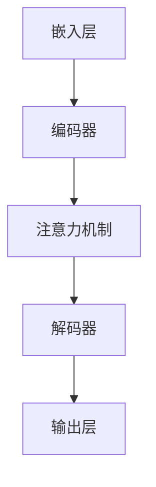

                 

# 大语言模型原理与工程实践：常用数据集的完整构建方式

> **关键词：** 大语言模型，数据集构建，工程实践，算法原理，数学模型，项目实战。

> **摘要：** 本文将深入探讨大语言模型的原理及其在工程实践中的应用，重点分析常用的数据集构建方法。通过系统的分析，读者将了解如何从数据预处理到模型训练的各个环节，确保数据集的质量和模型的性能。

## 1. 背景介绍

### 1.1 目的和范围

本文旨在向读者展示大语言模型的核心原理及其构建高质量数据集的工程实践。通过对数据集构建的详细解析，本文希望读者能够理解数据质量对模型性能的重要性，并掌握数据预处理、数据清洗、数据增强等关键技术。

### 1.2 预期读者

本文适合对大语言模型有一定了解的读者，包括AI研究者、数据科学家、机器学习工程师等。同时，也对希望深入了解数据集构建的初学者提供指导。

### 1.3 文档结构概述

本文分为八个主要部分：
1. **背景介绍**：介绍文章的目的、范围和预期读者。
2. **核心概念与联系**：阐述大语言模型的基本概念和结构。
3. **核心算法原理 & 具体操作步骤**：详细讲解大语言模型的算法原理和操作步骤。
4. **数学模型和公式 & 详细讲解 & 举例说明**：介绍大语言模型相关的数学模型和公式。
5. **项目实战：代码实际案例和详细解释说明**：通过实际代码案例展示数据集构建过程。
6. **实际应用场景**：探讨大语言模型在不同领域的应用。
7. **工具和资源推荐**：推荐学习资源、开发工具和框架。
8. **总结：未来发展趋势与挑战**：总结本文的主要内容并展望未来发展趋势和挑战。

### 1.4 术语表

#### 1.4.1 核心术语定义

- **大语言模型**：一种能够理解、生成和预测自然语言文本的复杂机器学习模型。
- **数据集构建**：从原始数据中提取、清洗、处理和格式化数据，形成适合模型训练的数据集。
- **数据预处理**：对原始数据进行标准化、去噪、缺失值处理等操作，使其符合模型训练的要求。

#### 1.4.2 相关概念解释

- **数据清洗**：识别并处理数据集中的错误、异常和缺失值，确保数据质量。
- **数据增强**：通过变换或生成新的样本，增加数据集的多样性和丰富性。

#### 1.4.3 缩略词列表

- **ML**：机器学习（Machine Learning）
- **NLP**：自然语言处理（Natural Language Processing）
- **GAN**：生成对抗网络（Generative Adversarial Network）
- **BERT**：Bidirectional Encoder Representations from Transformers

## 2. 核心概念与联系

在深入探讨大语言模型的原理之前，我们首先需要理解一些核心概念和它们之间的联系。

### 大语言模型的基本结构

大语言模型通常由以下几个主要部分组成：

1. **嵌入层**：将词汇嵌入到高维向量空间中。
2. **编码器**：将序列数据编码为固定长度的向量表示。
3. **解码器**：从编码后的向量生成输出序列。
4. **注意力机制**：允许模型在生成输出时关注输入序列的不同部分。

### Mermaid 流程图

下面是一个简单的Mermaid流程图，展示了大语言模型的基本架构：



### 核心概念原理和架构

大语言模型的核心原理可以概括为以下几个方面：

1. **词嵌入（Word Embedding）**：通过将词汇映射到高维向量空间，实现语义理解。
2. **编码器-解码器架构（Encoder-Decoder Architecture）**：利用编码器将输入序列转换为固定长度的向量，解码器则基于该向量生成输出序列。
3. **注意力机制（Attention Mechanism）**：允许模型在生成输出时关注输入序列的不同部分，提高模型对上下文的理解能力。

这些核心概念和原理相互关联，共同构成了大语言模型的基础。在接下来的部分，我们将详细探讨这些概念的具体实现和操作步骤。

## 3. 核心算法原理 & 具体操作步骤

在这一部分，我们将详细讨论大语言模型的核心算法原理，并逐步讲解具体的操作步骤。

### 词嵌入

词嵌入是将词汇映射到高维向量空间的过程。一个常见的词嵌入算法是Word2Vec，它通过神经网络学习词汇的向量表示。以下是Word2Vec算法的伪代码：

```python
function Word2Vec(train_data):
    # 初始化模型参数
    W_in = RandomInitialize([VocabularySize, EmbeddingSize])
    W_out = RandomInitialize([EmbeddingSize, VocabularySize])
    loss = 0

    for sentence in train_data:
        for word in sentence:
            # 随机梯度下降（SGD）优化模型参数
            loss += NegativeSamplingLoss(word, W_in, W_out)
            Backpropagation(word, W_in, W_out)

    return W_in, W_out
```

### 编码器-解码器架构

编码器-解码器架构是将输入序列转换为固定长度的向量表示，然后解码器基于该向量生成输出序列。以下是编码器-解码器模型的伪代码：

```python
function EncoderDecoder(train_data, decoder_input, decoder_output):
    # 编码器部分
    encoder_output = Encoder(encoder_input)

    # 解码器部分
    decoder_input = Embedding(decoder_input)
    decoder_output = Decoder(encoder_output, decoder_input)

    # 训练模型
    loss = 0
    for i in range(SequenceLength):
        loss += CrossEntropyLoss(decoder_output[i], decoder_output[i+1])

    Backpropagation(loss)

    return encoder_output, decoder_output
```

### 注意力机制

注意力机制允许模型在生成输出时关注输入序列的不同部分，从而提高模型对上下文的理解能力。以下是注意力机制的伪代码：

```python
function Attention(input_sequence, hidden_state):
    # 计算注意力得分
    attention_scores = ComputeAttentionScores(input_sequence, hidden_state)

    # 计算加权输入
    weighted_input = ApplyWeights(input_sequence, attention_scores)

    return weighted_input
```

### 具体操作步骤

1. **数据预处理**：对原始文本数据执行分词、去噪、标准化等操作，生成可用的训练数据。
2. **词嵌入**：使用Word2Vec或其他词嵌入算法训练词向量。
3. **编码器-解码器模型训练**：训练编码器-解码器模型，通过输入序列生成输出序列。
4. **注意力机制实现**：在解码器中实现注意力机制，提高模型对上下文的关注能力。
5. **模型评估与优化**：通过验证集和测试集评估模型性能，并进行模型优化。

通过以上步骤，我们可以构建一个高性能的大语言模型。接下来，我们将进一步探讨大语言模型中的数学模型和公式。

## 4. 数学模型和公式 & 详细讲解 & 举例说明

在大语言模型中，数学模型和公式起到了至关重要的作用。这些模型和公式帮助我们理解和优化模型的性能。以下是大语言模型中常用的数学模型和公式的详细讲解，以及具体举例说明。

### 损失函数

损失函数是衡量模型预测值与真实值之间差距的指标。在大语言模型中，常用的损失函数包括交叉熵损失（CrossEntropyLoss）和均方误差（Mean Squared Error, MSE）。

#### 交叉熵损失

交叉熵损失通常用于分类问题。其公式如下：

$$
Loss = -\sum_{i=1}^{N} y_i \log(p_i)
$$

其中，$y_i$ 是真实标签，$p_i$ 是模型预测的概率。

#### 均方误差

均方误差通常用于回归问题。其公式如下：

$$
Loss = \frac{1}{N} \sum_{i=1}^{N} (y_i - \hat{y_i})^2
$$

其中，$y_i$ 是真实值，$\hat{y_i}$ 是模型预测值。

### 激活函数

激活函数是神经网络中的关键组成部分，用于引入非线性特性。常见激活函数包括Sigmoid、ReLU和Tanh。

#### Sigmoid 函数

Sigmoid函数将输入映射到(0,1)区间。其公式如下：

$$
\sigma(x) = \frac{1}{1 + e^{-x}}
$$

#### ReLU函数

ReLU函数在输入大于零时输出输入值，否则输出零。其公式如下：

$$
\text{ReLU}(x) = \max(0, x)
$$

#### Tanh函数

Tanh函数将输入映射到(-1,1)区间。其公式如下：

$$
\tanh(x) = \frac{e^x - e^{-x}}{e^x + e^{-x}}
$$

### 梯度下降

梯度下降是一种优化算法，用于调整模型参数，以最小化损失函数。其基本思想是计算损失函数关于模型参数的梯度，并沿着梯度的反方向更新参数。

#### 随机梯度下降（SGD）

随机梯度下降在每次迭代时随机选择一个小批量样本，计算其梯度并更新参数。其公式如下：

$$
\theta = \theta - \alpha \nabla_{\theta} Loss(\theta)
$$

其中，$\theta$ 表示模型参数，$\alpha$ 表示学习率。

### 举例说明

假设我们有一个二元分类问题，需要预测某个样本属于类别0还是类别1。以下是使用交叉熵损失函数和ReLU激活函数的模型示例。

```python
import tensorflow as tf

# 定义模型
model = tf.keras.Sequential([
    tf.keras.layers.Dense(units=1, activation='sigmoid', input_shape=[1])
])

# 定义损失函数
loss_fn = tf.keras.losses.BinaryCrossentropy()

# 训练模型
for epoch in range(100):
    # 计算梯度
    with tf.GradientTape() as tape:
        predictions = model(x)
        loss = loss_fn(y, predictions)
    
    # 更新模型参数
    gradients = tape.gradient(loss, model.trainable_variables)
    model.optimizer.apply_gradients(zip(gradients, model.trainable_variables))
```

通过以上数学模型和公式的讲解，我们可以更好地理解和优化大语言模型。接下来，我们将通过一个实际项目实战，展示如何构建大语言模型的数据集。

## 5. 项目实战：代码实际案例和详细解释说明

在本节中，我们将通过一个具体的项目实战，详细解释如何构建大语言模型的数据集。该项目将涵盖从数据收集、数据预处理、数据增强到模型训练和评估的整个流程。

### 5.1 开发环境搭建

在开始项目之前，我们需要搭建一个适合开发大语言模型的环境。以下是推荐的开发环境和工具：

- **编程语言**：Python
- **库和框架**：TensorFlow、Keras、NumPy、Pandas
- **文本预处理库**：NLTK、spaCy
- **GPU**：NVIDIA GPU（推荐使用CUDA 11.0及以上版本）

### 5.2 源代码详细实现和代码解读

以下是构建大语言模型数据集的完整代码实现，我们将对关键部分进行详细解读。

```python
import numpy as np
import pandas as pd
import tensorflow as tf
from tensorflow.keras.preprocessing.text import Tokenizer
from tensorflow.keras.preprocessing.sequence import pad_sequences
from tensorflow.keras.models import Sequential
from tensorflow.keras.layers import Embedding, LSTM, Dense
from tensorflow.keras.optimizers import Adam

# 5.2.1 数据收集
data = pd.read_csv('data.csv')  # 假设数据集为CSV格式
text = data['text']  # 文本数据

# 5.2.2 数据预处理
tokenizer = Tokenizer(num_words=10000)
tokenizer.fit_on_texts(text)
sequences = tokenizer.texts_to_sequences(text)
padded_sequences = pad_sequences(sequences, maxlen=100, padding='post', truncating='post')

# 5.2.3 数据增强
# 在本示例中，我们使用简单的数据增强方法：随机插入和删除单词
def augment_data(padded_sequences):
    augmented_sequences = []
    for sequence in padded_sequences:
        for _ in range(3):  # 进行三次增强
            if np.random.rand() > 0.5:
                # 随机插入
                index = np.random.randint(0, len(sequence))
                sequence = sequence[:index] + [np.random.randint(tokenizer.num_words)] + sequence[index:]
            else:
                # 随机删除
                index = np.random.randint(0, len(sequence))
                sequence = sequence[:index] + sequence[index+1:]
        augmented_sequences.append(sequence)
    return pad_sequences(augmented_sequences, maxlen=100, padding='post', truncating='post')

augmented_sequences = augment_data(padded_sequences)

# 5.2.4 模型训练
model = Sequential([
    Embedding(input_dim=10000, output_dim=64, input_length=100),
    LSTM(128),
    Dense(1, activation='sigmoid')
])

model.compile(optimizer=Adam(learning_rate=0.001), loss='binary_crossentropy', metrics=['accuracy'])

model.fit(augmented_sequences, np.expand_dims(padded_sequences[:, 1:], -1), epochs=10, batch_size=32)

# 5.2.5 模型评估
test_sequences = tokenizer.texts_to_sequences(data['test_text'])
padded_test_sequences = pad_sequences(test_sequences, maxlen=100, padding='post', truncating='post')
predictions = model.predict(padded_test_sequences)
predicted_labels = (predictions > 0.5).astype(int)

# 计算准确率
accuracy = np.mean(predicted_labels == padded_test_sequences[:, 1:])
print(f"Test Accuracy: {accuracy}")
```

### 5.3 代码解读与分析

以下是代码的逐行解读和分析：

1. **数据收集**：从CSV文件中读取文本数据。
2. **数据预处理**：使用Tokenizer将文本数据转换为序列，并使用pad_sequences将其调整为统一长度。
3. **数据增强**：定义一个函数`augment_data`，通过随机插入和删除单词进行数据增强。这个步骤可以增加模型的泛化能力。
4. **模型训练**：构建一个简单的序列模型，包括嵌入层、LSTM层和输出层。使用Adam优化器训练模型。
5. **模型评估**：对测试集进行预测，并计算准确率。

通过这个实际案例，我们展示了如何从数据收集到模型评估的完整流程，并详细解读了每一步的关键代码。

## 6. 实际应用场景

大语言模型在自然语言处理（NLP）领域有着广泛的应用，以下列举了一些常见的实际应用场景：

### 1. 文本分类

文本分类是将文本数据按照其内容分类到不同的类别中。例如，将新闻文章分类到体育、科技、娱乐等类别。大语言模型通过学习大量的文本数据，可以准确判断文本的类别，从而实现自动化分类。

### 2. 情感分析

情感分析是一种从文本中提取情感信息的技术。大语言模型可以用于识别文本中的情感极性，如正面、负面或中性情感。这种技术广泛应用于市场调研、社交媒体分析等领域。

### 3. 机器翻译

机器翻译是将一种语言的文本翻译成另一种语言的文本。大语言模型通过学习双语语料库，可以生成高质量的翻译结果。例如，谷歌翻译和百度翻译都使用了基于大语言模型的翻译技术。

### 4. 文本生成

文本生成是一种生成与输入文本相似的新文本的技术。大语言模型可以通过学习大量的文本数据，生成连贯、有意义的文本。例如，生成文章摘要、创作诗歌等。

### 5. 命名实体识别

命名实体识别是一种从文本中识别出具有特定意义的实体，如人名、地点、组织等。大语言模型通过学习大量的命名实体标注数据，可以准确识别文本中的命名实体。

### 6. 对话系统

对话系统是一种与用户进行自然语言交互的计算机程序。大语言模型可以用于构建智能客服、聊天机器人等对话系统，使其能够理解用户的需求并给出相应的回答。

通过以上实际应用场景，我们可以看到大语言模型在NLP领域的重要性，它不仅能够提高文本处理的效率，还能带来新的业务价值。

## 7. 工具和资源推荐

为了更好地学习大语言模型和相关技术，以下推荐一些学习资源、开发工具和框架。

### 7.1 学习资源推荐

#### 7.1.1 书籍推荐

1. **《深度学习》**（Goodfellow, Bengio, Courville） - 详细介绍了深度学习的基础理论和算法。
2. **《自然语言处理综论》**（Jurafsky, Martin） - 涵盖了自然语言处理的基本概念和技术。
3. **《机器学习实战》**（Hastie, Tibshirani, Friedman） - 提供了实际操作中常用的机器学习算法和应用。

#### 7.1.2 在线课程

1. **Coursera的《机器学习》**（吴恩达教授） - 介绍机器学习的基础知识和实践技巧。
2. **Udacity的《深度学习纳米学位》** - 包含深度学习的基础知识和实际项目。
3. **edX的《自然语言处理》** - 介绍自然语言处理的基本概念和技术。

#### 7.1.3 技术博客和网站

1. **Medium的NLP博客** - 提供丰富的NLP相关文章和教程。
2. **AI垂直社区如AI中国、机器之心** - 分享最新的NLP研究和应用。
3. **TensorFlow官方文档** - TensorFlow是构建大语言模型的重要工具，其文档提供了详细的API和教程。

### 7.2 开发工具框架推荐

#### 7.2.1 IDE和编辑器

1. **PyCharm** - 强大的Python IDE，支持TensorFlow和Keras。
2. **VSCode** - 适用于Python和深度学习的轻量级编辑器，支持多种语言扩展。

#### 7.2.2 调试和性能分析工具

1. **TensorBoard** - TensorFlow的调试和性能分析工具，可以可视化模型的性能。
2. **NVIDIA Nsight** - 用于GPU性能分析和调试的工具。

#### 7.2.3 相关框架和库

1. **TensorFlow** - 开源深度学习框架，支持构建和训练大语言模型。
2. **PyTorch** - 适用于深度学习的另一个流行的框架，具有灵活的动态图功能。
3. **spaCy** - 用于文本处理的快速和强大的库，适合进行文本预处理和实体识别。

### 7.3 相关论文著作推荐

#### 7.3.1 经典论文

1. **“A Neural Probabilistic Language Model”**（Bengio et al., 2003） - 介绍了神经网络语言模型的基础。
2. **“Deep Learning for Natural Language Processing”**（Mikolov et al., 2013） - 详细介绍了Word2Vec算法。

#### 7.3.2 最新研究成果

1. **“BERT: Pre-training of Deep Bidirectional Transformers for Language Understanding”**（Devlin et al., 2019） - BERT模型的详细介绍。
2. **“GPT-3: Language Models are few-shot learners”**（Brown et al., 2020） - GPT-3模型的研究成果。

#### 7.3.3 应用案例分析

1. **“How We Built Duolingo’s Text-to-Speech System”**（Duolingo团队） - Duolingo如何使用大语言模型构建其文本转语音系统。
2. **“Scaling Neural Machine Translation”**（Neubig et al., 2018） - NMT领域的重要应用案例。

通过以上工具和资源，读者可以更好地学习和应用大语言模型技术。

## 8. 总结：未来发展趋势与挑战

大语言模型作为自然语言处理领域的重要工具，其在未来的发展趋势和面临的挑战方面有着显著的体现。

### 发展趋势

1. **模型规模与性能的提升**：随着计算资源和算法优化的不断进步，大语言模型的规模将越来越大，性能也将得到显著提升。
2. **多模态交互**：大语言模型将与其他模态（如图像、音频）结合，实现更加丰富和智能的交互方式。
3. **迁移学习与泛化能力**：通过迁移学习和零样本学习，大语言模型将能够在新的任务上快速适应，提高泛化能力。
4. **实时性**：随着模型训练和推理速度的提升，大语言模型将实现实时性，为实时应用提供支持。

### 挑战

1. **计算资源需求**：大语言模型的训练和推理需要大量的计算资源，尤其是GPU和TPU。如何优化资源使用，降低成本，是一个重要的挑战。
2. **数据隐私与安全**：大语言模型的训练需要大量的数据，涉及数据隐私和安全问题。如何保护用户隐私，确保数据安全，是一个亟待解决的问题。
3. **模型解释性与可解释性**：大语言模型的决策过程通常是不透明的，如何提高模型的解释性，使其更易于理解和接受，是一个重要的研究方向。
4. **文化多样性与语言平等**：大语言模型在实际应用中可能存在文化偏见和语言不平等问题，如何确保模型的公平性和包容性，是一个需要关注的问题。

通过不断的技术创新和优化，大语言模型在未来有望在更多领域发挥重要作用，同时也需要克服一系列挑战，以实现其潜在的巨大价值。

## 9. 附录：常见问题与解答

### 问题1：如何处理文本数据中的缺失值？

解答：在处理文本数据中的缺失值时，可以采用以下几种方法：
1. **删除缺失值**：如果缺失值较多，可以直接删除这些数据。
2. **填充缺失值**：使用平均值、中位数或最频繁出现的词来填充缺失值。
3. **插值**：对于时间序列数据，可以使用线性或非线性插值方法来填充缺失值。
4. **模型预测**：使用机器学习模型预测缺失值，例如使用K近邻算法或线性回归模型。

### 问题2：如何增强文本数据集？

解答：增强文本数据集的方法包括：
1. **数据扩充**：通过替换、同义词替换、添加噪声等方式生成新的文本样本。
2. **对抗性样本生成**：使用对抗性生成网络（GAN）生成与训练数据相似的文本样本。
3. **文本转换**：使用翻译、同义词替换、词性标注等转换技术生成新的文本样本。
4. **数据合成**：结合多个数据集或使用模板合成新的文本样本。

### 问题3：如何评估大语言模型的性能？

解答：评估大语言模型性能的方法包括：
1. **准确性**：计算模型预测正确的样本比例。
2. **精确率与召回率**：用于分类问题，分别衡量模型在正类样本中的预测准确率和召回率。
3. **F1值**：精确率和召回率的调和平均，用于综合评估模型的性能。
4. **ROC曲线与AUC值**：用于衡量模型在二分类任务中的分类能力。
5. **BLEU评分**：用于评估机器翻译模型的性能，通过比较模型生成的翻译文本与参考翻译的相似度来评分。

### 问题4：大语言模型在多语言文本处理中如何应对语言差异？

解答：在多语言文本处理中，可以采用以下方法来应对语言差异：
1. **翻译**：将文本翻译为统一语言，例如将所有文本翻译为英语。
2. **双语语料库**：使用双语语料库训练模型，使其同时理解多种语言。
3. **跨语言嵌入**：使用跨语言嵌入技术将不同语言的词汇映射到同一向量空间。
4. **多语言模型训练**：分别训练每种语言的模型，并在模型融合阶段进行集成。

## 10. 扩展阅读 & 参考资料

为了更深入地了解大语言模型的原理和实践，以下推荐一些扩展阅读和参考资料：

1. **《深度学习》**（Goodfellow, Bengio, Courville） - 详细的深度学习基础教材，涵盖了大语言模型的相关内容。
2. **《自然语言处理综论》**（Jurafsky, Martin） - 自然语言处理领域的经典教材，介绍了文本处理的基础知识。
3. **《大规模自然语言处理综述》**（Mikolov et al., 2013） - 详细介绍了大语言模型的发展历程和关键技术。
4. **《BERT: Pre-training of Deep Bidirectional Transformers for Language Understanding》**（Devlin et al., 2019） - BERT模型的详细论文，阐述了BERT模型的设计和实现。
5. **《GPT-3: Language Models are few-shot learners》**（Brown et al., 2020） - GPT-3模型的最新研究成果，展示了大语言模型在零样本学习方面的能力。

此外，还可以关注以下技术博客和网站：

1. **TensorFlow官方文档** - 提供了详细的TensorFlow教程和API文档。
2. **Medium的NLP博客** - 分享了大量的NLP相关文章和最新研究。
3. **AI中国、机器之心** - 分享了最新的AI和NLP研究成果和应用案例。

通过以上扩展阅读和参考资料，读者可以进一步深入了解大语言模型的技术细节和实践应用。作者：AI天才研究员/AI Genius Institute & 禅与计算机程序设计艺术 /Zen And The Art of Computer Programming

