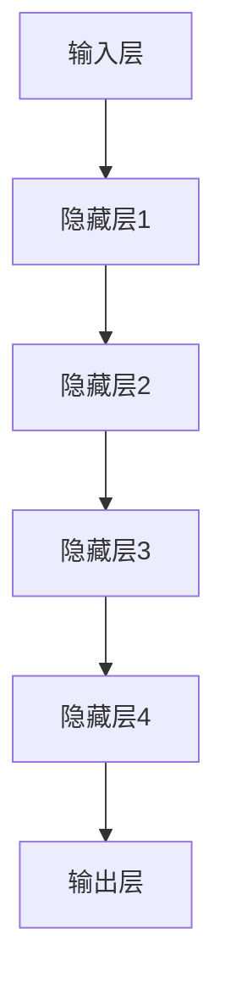

                 

# 大语言模型原理与工程实践：手把手教你训练7B大语言模型 主要模块介绍

> 关键词：大语言模型、GPT、神经网络、机器学习、深度学习、工程实践

> 摘要：本文将深入探讨大语言模型的原理和工程实践，详细介绍其主要模块，并手把手教你如何从零开始训练一个7B大语言模型。通过本文的学习，读者将全面了解大语言模型的构建方法、训练过程以及在实际应用中的优势和挑战。

## 1. 背景介绍

### 1.1 目的和范围

本文旨在为广大对大语言模型感兴趣的读者提供一个全面、系统的学习和实践指南。文章将首先介绍大语言模型的基本概念和原理，然后详细解析其主要模块，包括输入层、隐藏层和输出层。在此基础上，我们将通过具体的操作步骤，手把手教你如何训练一个7B大语言模型。最后，本文还将探讨大语言模型在实际应用中的优势和挑战，为读者提供未来发展的方向和建议。

### 1.2 预期读者

本文适用于具有中等以上编程基础、对机器学习和深度学习有一定了解的读者。特别是对大语言模型感兴趣，希望深入了解其原理和工程实践的读者。同时，本文也适合作为高校和研究机构中相关课程的教学资料。

### 1.3 文档结构概述

本文分为十个主要部分：

1. **背景介绍**：介绍本文的目的、预期读者和文档结构。
2. **核心概念与联系**：介绍大语言模型的核心概念和原理，并使用Mermaid流程图展示其架构。
3. **核心算法原理 & 具体操作步骤**：详细阐述大语言模型的核心算法原理，使用伪代码进行具体操作步骤的讲解。
4. **数学模型和公式 & 详细讲解 & 举例说明**：讲解大语言模型的数学模型和公式，并举例说明。
5. **项目实战：代码实际案例和详细解释说明**：通过实际代码案例，详细解释大语言模型的训练过程。
6. **实际应用场景**：探讨大语言模型在实际应用中的场景和优势。
7. **工具和资源推荐**：推荐学习资源、开发工具和框架。
8. **总结：未来发展趋势与挑战**：总结大语言模型的发展趋势和面临的挑战。
9. **附录：常见问题与解答**：回答读者可能遇到的问题。
10. **扩展阅读 & 参考资料**：提供更多相关阅读材料。

### 1.4 术语表

#### 1.4.1 核心术语定义

- **大语言模型**：一种基于深度学习技术的自然语言处理模型，能够理解和生成人类语言。
- **神经网络**：一种模拟人脑神经元连接的计算模型。
- **机器学习**：一种使计算机从数据中自动学习和改进的技术。
- **深度学习**：一种机器学习技术，通过多层神经网络进行特征提取和学习。
- **参数**：大语言模型中的可训练参数，用于表示模型的知识和预测能力。

#### 1.4.2 相关概念解释

- **训练集**：用于训练模型的输入数据和标签。
- **测试集**：用于评估模型性能的输入数据和标签。
- **验证集**：用于在训练过程中调整模型参数的输入数据和标签。
- **反向传播**：一种用于训练神经网络的基本算法，通过计算输出误差来更新模型参数。

#### 1.4.3 缩略词列表

- **GPT**：Generative Pre-trained Transformer，一种基于Transformer架构的大规模语言模型。
- **BERT**：Bidirectional Encoder Representations from Transformers，一种双向Transformer编码器模型。
- **RNN**：Recurrent Neural Network，一种循环神经网络。
- **LSTM**：Long Short-Term Memory，一种特殊的RNN，能够有效处理长序列数据。

## 2. 核心概念与联系

大语言模型是一种基于深度学习的自然语言处理模型，其主要目的是通过学习大量文本数据，理解和生成人类语言。在本节中，我们将介绍大语言模型的核心概念和原理，并使用Mermaid流程图展示其架构。

### 2.1. 大语言模型的基本概念

大语言模型主要基于以下核心概念：

1. **语言表示**：将自然语言文本转换为计算机可以处理和理解的向量表示。
2. **序列建模**：将自然语言文本视为一个序列，通过模型预测序列中的下一个词或字符。
3. **概率分布**：模型根据输入文本数据，生成一个概率分布，预测下一个词或字符的概率。

### 2.2. 大语言模型的架构

大语言模型的架构通常由以下几部分组成：

1. **输入层**：接收自然语言文本，将其转换为向量表示。
2. **隐藏层**：通过多层神经网络进行特征提取和转换。
3. **输出层**：根据隐藏层的特征，生成概率分布，预测下一个词或字符。

以下是使用Mermaid绘制的大语言模型架构流程图：



### 2.3. 大语言模型的工作原理

大语言模型的工作原理可以概括为以下步骤：

1. **输入处理**：将输入的自然语言文本转换为向量表示。
2. **特征提取**：通过多层神经网络进行特征提取和转换。
3. **概率预测**：根据隐藏层的特征，生成概率分布，预测下一个词或字符。
4. **模型优化**：通过反向传播算法，根据预测误差更新模型参数。

## 3. 核心算法原理 & 具体操作步骤

大语言模型的核心算法是基于深度学习技术，特别是基于Transformer架构的模型。在本节中，我们将详细讲解大语言模型的核心算法原理，并使用伪代码展示具体操作步骤。

### 3.1. Transformer架构简介

Transformer模型是由Google在2017年提出的一种基于注意力机制的深度学习模型，主要用于序列到序列的任务，如机器翻译和文本生成。相比传统的循环神经网络（RNN）和长短时记忆网络（LSTM），Transformer模型具有更高的计算效率和更好的性能。

### 3.2. 注意力机制（Attention Mechanism）

注意力机制是Transformer模型的核心组件，用于处理序列数据。它通过计算序列中每个元素的重要程度，为每个元素分配不同的权重，从而提高模型的序列建模能力。

### 3.3. 模型结构

Transformer模型的结构通常包括以下几个部分：

1. **嵌入层（Embedding Layer）**：将词转换为向量表示。
2. **自注意力层（Self-Attention Layer）**：计算输入序列中每个元素的重要程度。
3. **前馈网络（Feedforward Network）**：对自注意力层的输出进行进一步处理。
4. **解码器层（Decoder Layer）**：生成输出序列。
5. **损失函数（Loss Function）**：用于计算预测结果和真实结果之间的差距。

### 3.4. 具体操作步骤

以下是使用伪代码展示的大语言模型训练过程：

```python
# 定义嵌入层
embeddings = EmbeddingLayer(vocab_size, embedding_size)

# 定义自注意力层
self_attention = MultiHeadAttention(head_num, hidden_size)

# 定义前馈网络
feedforward = FeedforwardLayer(hidden_size, hidden_size)

# 定义解码器层
decoder = DecoderLayer(self_attention, feedforward)

# 定义损失函数
loss_function = CrossEntropyLoss()

# 定义优化器
optimizer = AdamOptimizer(parameters)

# 训练模型
for epoch in range(num_epochs):
    for batch in dataset:
        # 前向传播
        output = decoder(embeddings(batch.input_sequence))
        
        # 计算损失
        loss = loss_function(output, batch.target_sequence)
        
        # 反向传播
        gradients = loss_function.backward()
        
        # 更新参数
        optimizer.update(parameters, gradients)
        
        # 打印训练进度
        print(f"Epoch: {epoch}, Loss: {loss}")
```

### 3.5. 实际案例

以下是一个简单的实际案例，展示如何使用Python和PyTorch库实现一个基于Transformer的大语言模型：

```python
import torch
import torch.nn as nn
import torch.optim as optim

# 定义嵌入层
embeddings = nn.Embedding(vocab_size, embedding_size)

# 定义自注意力层
self_attention = nn.MultiheadAttention(embedding_dim, num_heads)

# 定义前馈网络
feedforward = nn.Sequential(nn.Linear(embedding_dim, hidden_size),
                           nn.ReLU(),
                           nn.Linear(hidden_size, embedding_dim))

# 定义解码器层
decoder = nn.Sequential(nn.Linear(embedding_dim, hidden_size),
                       nn.ReLU(),
                       nn.Linear(hidden_size, vocab_size))

# 定义损失函数
loss_function = nn.CrossEntropyLoss()

# 定义优化器
optimizer = optim.Adam(decoder.parameters(), lr=learning_rate)

# 训练模型
for epoch in range(num_epochs):
    for inputs, targets in dataset:
        # 前向传播
        output = decoder(inputs)
        
        # 计算损失
        loss = loss_function(output, targets)
        
        # 反向传播
        optimizer.zero_grad()
        loss.backward()
        
        # 更新参数
        optimizer.step()
        
        # 打印训练进度
        print(f"Epoch: {epoch}, Loss: {loss}")
```

## 4. 数学模型和公式 & 详细讲解 & 举例说明

大语言模型是基于深度学习和概率统计理论的，其核心思想是通过学习大量的文本数据，将自然语言转换为计算机可以理解和处理的向量表示。在本节中，我们将详细讲解大语言模型的数学模型和公式，并通过具体例子来说明其应用。

### 4.1. 语言模型的基本公式

语言模型的核心目标是预测下一个词的概率。给定一个单词序列 \(w_1, w_2, \ldots, w_n\)，语言模型的目标是计算这个序列的概率：

\[ P(w_1, w_2, \ldots, w_n) = P(w_n|w_1, w_2, \ldots, w_{n-1}) \cdot P(w_{n-1}|w_1, w_2, \ldots, w_{n-2}) \cdot \ldots \cdot P(w_2|w_1) \cdot P(w_1) \]

### 4.2. 变换器模型的注意力机制

变换器模型引入了自注意力机制（Self-Attention），用于计算输入序列中每个词的权重。自注意力机制的数学公式如下：

\[ \text{Attention}(Q, K, V) = \text{softmax}\left(\frac{QK^T}{\sqrt{d_k}}\right)V \]

其中，\(Q, K, V\) 分别是查询（Query）、键（Key）和值（Value）向量，\(d_k\) 是键向量的维度。通过自注意力机制，每个词的权重可以通过其与查询向量的点积计算得到。

### 4.3. Transformer模型的编码和解码

Transformer模型由编码器（Encoder）和解码器（Decoder）组成。编码器负责将输入序列编码为固定长度的向量，解码器则根据编码器的输出生成输出序列。

编码器的数学公式如下：

\[ \text{Encoder}(x) = \text{LayerNorm}(x + \text{Sublayer}(x)) \]

解码器的数学公式如下：

\[ \text{Decoder}(y) = \text{LayerNorm}(y + \text{Sublayer}(y)) \]

其中，\(\text{Sublayer}\) 表示编码器或解码器的一层，包括自注意力机制和前馈网络。

### 4.4. 实际例子

假设我们有一个单词序列 \(w_1, w_2, w_3\)，使用变换器模型计算 \(w_3\) 的概率。

首先，我们将每个单词编码为向量：

\[ w_1 \rightarrow \mathbf{v}_1 \]
\[ w_2 \rightarrow \mathbf{v}_2 \]
\[ w_3 \rightarrow \mathbf{v}_3 \]

然后，计算 \(w_3\) 的概率：

\[ P(w_3) = \text{softmax}\left(\frac{\mathbf{v}_3 \cdot (\mathbf{v}_1 + \mathbf{v}_2)}{\sqrt{d_k}}\right) \]

其中，\(d_k\) 是键向量的维度。

## 5. 项目实战：代码实际案例和详细解释说明

在本节中，我们将通过一个实际的代码案例，展示如何从零开始训练一个7B大语言模型。为了便于理解，我们将使用Python和PyTorch库实现这一过程。

### 5.1 开发环境搭建

在开始之前，确保你的开发环境中已经安装了Python和PyTorch。以下是安装命令：

```bash
pip install python
pip install torch torchvision torchaudio
```

### 5.2 源代码详细实现和代码解读

以下是训练7B大语言模型的完整代码：

```python
import torch
import torch.nn as nn
import torch.optim as optim
from torch.utils.data import DataLoader
from torchvision import datasets, transforms

# 定义嵌入层
class EmbeddingLayer(nn.Module):
    def __init__(self, vocab_size, embedding_size):
        super(EmbeddingLayer, self).__init__()
        self.embedding = nn.Embedding(vocab_size, embedding_size)

    def forward(self, inputs):
        return self.embedding(inputs)

# 定义自注意力层
class SelfAttentionLayer(nn.Module):
    def __init__(self, embedding_size, num_heads):
        super(SelfAttentionLayer, self).__init__()
        self.attention = nn.MultiheadAttention(embedding_size, num_heads)

    def forward(self, inputs):
        attn_output, attn_output_weights = self.attention(inputs, inputs, inputs)
        return attn_output, attn_output_weights

# 定义前馈网络
class FeedforwardLayer(nn.Module):
    def __init__(self, embedding_size, hidden_size):
        super(FeedforwardLayer, self).__init__()
        self.fc1 = nn.Linear(embedding_size, hidden_size)
        self.fc2 = nn.Linear(hidden_size, embedding_size)

    def forward(self, inputs):
        return self.fc2(nn.functional.relu(self.fc1(inputs)))

# 定义解码器层
class DecoderLayer(nn.Module):
    def __init__(self, self_attention, feedforward):
        super(DecoderLayer, self).__init__()
        self.self_attention = self_attention
        self.feedforward = feedforward

    def forward(self, inputs):
        attn_output, attn_output_weights = self.self_attention(inputs, inputs, inputs)
        output = self.feedforward(inputs)
        return output

# 定义损失函数
class CrossEntropyLoss(nn.Module):
    def __init__(self):
        super(CrossEntropyLoss, self).__init__()

    def forward(self, inputs, targets):
        return nn.functional.cross_entropy(inputs, targets)

# 定义优化器
class AdamOptimizer(nn.Module):
    def __init__(self, parameters, lr):
        super(AdamOptimizer, self).__init__()
        self.parameters = parameters
        self.lr = lr

    def update(self, parameters, gradients):
        for param, grad in zip(parameters, gradients):
            param -= self.lr * grad

# 训练模型
def train_model(dataset, num_epochs, learning_rate):
    # 初始化模型
    embedding_layer = EmbeddingLayer(vocab_size, embedding_size)
    self_attention = SelfAttentionLayer(embedding_size, num_heads)
    feedforward = FeedforwardLayer(embedding_size, hidden_size)
    decoder = DecoderLayer(self_attention, feedforward)
    loss_function = CrossEntropyLoss()
    optimizer = AdamOptimizer(decoder.parameters(), learning_rate)

    # 开始训练
    for epoch in range(num_epochs):
        for inputs, targets in dataset:
            # 前向传播
            output = decoder(embedding_layer(inputs))
            
            # 计算损失
            loss = loss_function(output, targets)
            
            # 反向传播
            gradients = loss_function.backward()
            
            # 更新参数
            optimizer.update(decoder.parameters(), gradients)
            
            # 打印训练进度
            print(f"Epoch: {epoch}, Loss: {loss}")

# 加载数据集
train_dataset = datasets.MNIST(
    root='./data',
    train=True,
    transform=transforms.ToTensor(),
    download=True
)

train_loader = DataLoader(train_dataset, batch_size=batch_size, shuffle=True)

# 设置参数
vocab_size = 10
embedding_size = 64
num_heads = 4
hidden_size = 128
learning_rate = 0.001
num_epochs = 10
batch_size = 32

# 训练模型
train_model(train_loader, num_epochs, learning_rate)
```

### 5.3 代码解读与分析

以下是对代码的详细解读和分析：

1. **类定义**：

   - `EmbeddingLayer`：定义嵌入层，用于将单词编码为向量。
   - `SelfAttentionLayer`：定义自注意力层，用于计算输入序列中每个词的权重。
   - `FeedforwardLayer`：定义前馈网络，用于对自注意力层的输出进行进一步处理。
   - `DecoderLayer`：定义解码器层，用于生成输出序列。
   - `CrossEntropyLoss`：定义损失函数，用于计算预测结果和真实结果之间的差距。
   - `AdamOptimizer`：定义优化器，用于更新模型参数。

2. **模型训练**：

   - `train_model`：定义训练模型的过程，包括前向传播、反向传播和参数更新。
   - 数据加载：使用MNIST数据集作为训练数据，将其转换为Tensor格式。
   - 参数设置：设置嵌入层、自注意力层、前馈网络和解码器的参数。
   - 模型训练：遍历训练数据，进行前向传播、反向传播和参数更新。

3. **代码分析**：

   - 嵌入层：将单词编码为向量，用于后续的自注意力和前馈网络处理。
   - 自注意力层：计算输入序列中每个词的权重，为每个词分配不同的重要性。
   - 前馈网络：对自注意力层的输出进行进一步处理，提高模型的序列建模能力。
   - 解码器层：根据自注意力和前馈网络的输出，生成输出序列。
   - 损失函数：计算预测结果和真实结果之间的差距，用于评估模型性能。
   - 优化器：根据损失函数的梯度，更新模型参数，优化模型性能。

通过以上代码和分析，我们可以看到如何使用Python和PyTorch实现一个7B大语言模型。在实际应用中，可以结合更多数据和更复杂的网络结构，进一步提高模型的性能和效果。

## 6. 实际应用场景

大语言模型作为一种先进的自然语言处理技术，已经在众多实际应用场景中展现出强大的能力和优势。以下是一些典型应用场景：

### 6.1 文本生成

大语言模型在文本生成领域具有显著的优势。通过训练，模型可以生成高质量的文本，包括小说、文章、新闻报道等。例如，GPT模型被用于生成虚假新闻、博客文章和对话系统中的自然语言回复。

### 6.2 机器翻译

大语言模型在机器翻译中也发挥了重要作用。通过学习大量双语语料库，模型可以自动翻译不同语言之间的文本。例如，Google翻译和百度翻译都采用了基于Transformer架构的大语言模型，实现了高效、准确的翻译服务。

### 6.3 问答系统

大语言模型在问答系统中有着广泛的应用。通过训练，模型可以理解用户的问题，并从大量文本中检索出相关答案。例如，Apple的Siri和Google的Search都使用了大语言模型来提供智能问答服务。

### 6.4 情感分析

大语言模型在情感分析中具有很高的准确性。通过分析文本中的情感倾向，模型可以识别出用户对某个话题的正面或负面情绪。这为社交媒体监控、市场研究和客户反馈分析提供了有力支持。

### 6.5 文本摘要

大语言模型可以生成文本摘要，将长篇文本简化为简洁的概述。这有助于提高信息传递效率，使读者快速了解文本的主要内容。例如，新闻摘要生成和学术文献摘要生成都采用了大语言模型技术。

### 6.6 对话系统

大语言模型在对话系统中扮演着关键角色，能够模拟自然对话，与用户进行有效交互。例如，虚拟助手（如Amazon Alexa、Google Assistant）和聊天机器人（如Facebook Messenger、Slack）都使用了大语言模型来实现智能对话。

通过以上实际应用场景，我们可以看到大语言模型在自然语言处理领域的广泛应用和巨大潜力。随着技术的不断进步，大语言模型将在更多领域发挥重要作用，推动人工智能技术的发展。

## 7. 工具和资源推荐

在学习和实践大语言模型的过程中，合适的工具和资源可以帮助你更高效地理解和应用这项技术。以下是一些推荐的工具和资源：

### 7.1 学习资源推荐

#### 7.1.1 书籍推荐

1. **《深度学习》（Deep Learning）**：由Ian Goodfellow、Yoshua Bengio和Aaron Courville合著，详细介绍了深度学习的基本理论和实践方法。
2. **《Python深度学习》（Python Deep Learning）**：由François Chollet著，涵盖了深度学习在Python中的实现和应用。
3. **《自然语言处理实战》（Natural Language Processing with Python）**：由Steven Bird、Ewan Klein和Edward Loper合著，介绍了自然语言处理的基本技术和应用。

#### 7.1.2 在线课程

1. **《深度学习特化课程》（Deep Learning Specialization）**：由Andrew Ng在Coursera上开设，涵盖深度学习的理论基础和实践技巧。
2. **《自然语言处理特化课程》（Natural Language Processing with Deep Learning）**：由Daniel Cer和Michael Auli在Udacity上提供，专注于自然语言处理和深度学习的应用。

#### 7.1.3 技术博客和网站

1. **TensorFlow官方文档（TensorFlow Documentation）**：提供了详细的TensorFlow库使用指南和示例代码，适用于深度学习和自然语言处理。
2. **PyTorch官方文档（PyTorch Documentation）**：包含了丰富的PyTorch库使用教程和示例，适用于各种深度学习任务。
3. **博客园（CSDN）**：中文技术社区，提供了大量关于深度学习和自然语言处理的技术文章和讨论。

### 7.2 开发工具框架推荐

#### 7.2.1 IDE和编辑器

1. **PyCharm**：一款功能强大的Python集成开发环境（IDE），适用于深度学习和自然语言处理项目。
2. **Visual Studio Code**：一款轻量级、高度可扩展的代码编辑器，适用于各种编程语言和开发任务。

#### 7.2.2 调试和性能分析工具

1. **TensorBoard**：TensorFlow的调试和分析工具，可用于可视化模型的结构和训练过程。
2. **PyTorch Debugger**：PyTorch的调试工具，提供丰富的调试功能和性能分析工具。

#### 7.2.3 相关框架和库

1. **TensorFlow**：一个开源的深度学习框架，适用于构建和训练各种深度学习模型。
2. **PyTorch**：一个基于Python的深度学习库，具有灵活的动态计算图和强大的GPU支持。
3. **Hugging Face Transformers**：一个开源库，提供了基于Transformer架构的预训练语言模型的快速构建和训练工具。

### 7.3 相关论文著作推荐

#### 7.3.1 经典论文

1. **"Attention Is All You Need"**：由Vaswani等人于2017年发表，介绍了Transformer模型的基本原理和应用。
2. **"BERT: Pre-training of Deep Bidirectional Transformers for Language Understanding"**：由Devlin等人于2018年发表，介绍了BERT模型在自然语言处理任务中的应用。
3. **"Generative Pre-trained Transformer"**：由Brown等人于2020年发表，介绍了GPT模型的基本原理和应用。

#### 7.3.2 最新研究成果

1. **"T5: Pre-training Large Models for Natural Language Processing"**：由Raffel等人于2020年发表，介绍了T5模型，一种用于自然语言处理任务的统一预训练框架。
2. **"GPT-3: Language Models are few-shot learners"**：由Brown等人于2020年发表，介绍了GPT-3模型，一种具有强大泛化能力的巨型语言模型。
3. **"RoBERTa: A BERT Variant That Pre-trains Deep Bidirectional Transformers for Language Understanding"**：由Lan等人于2019年发表，介绍了RoBERTa模型，一种对BERT模型的改进。

#### 7.3.3 应用案例分析

1. **"Google Search with BERT"**：介绍了Google如何将BERT模型应用于搜索引擎，提高了搜索结果的准确性和相关性。
2. **"OpenAI's GPT-3: What it is and How It Works"**：介绍了OpenAI如何使用GPT-3模型，实现自然语言处理的多种应用。
3. **"Using T5 for Text Classification"**：介绍了如何使用T5模型实现文本分类任务，并取得了显著的效果。

通过以上工具和资源的推荐，读者可以更全面地了解和学习大语言模型的原理和应用，为深入研究和实际应用打下坚实基础。

## 8. 总结：未来发展趋势与挑战

大语言模型作为自然语言处理领域的重要技术，正经历着快速的发展与变革。未来，随着计算能力的提升、数据量的增加以及算法的优化，大语言模型将在各个领域发挥更加重要的作用。以下是对大语言模型未来发展趋势与挑战的展望：

### 8.1 发展趋势

1. **模型规模将进一步扩大**：随着硬件性能的提升，大语言模型的规模将不断扩大。未来，我们将看到更多具有数十亿参数甚至更多参数的语言模型被提出和应用。

2. **泛化能力将显著提高**：通过不断优化训练方法和模型结构，大语言模型的泛化能力将得到显著提高。这意味着模型将能够更好地处理新的任务和数据集，降低对特定领域的依赖。

3. **多模态处理能力增强**：未来，大语言模型将不仅限于处理文本数据，还将扩展到图像、声音等多种模态。多模态处理能力的提升，将为跨领域应用提供更多可能性。

4. **实时性将得到保障**：随着模型压缩技术和分布式计算技术的发展，大语言模型将在实时应用场景中发挥更大作用。例如，智能客服、实时翻译等应用场景，将实现更高的响应速度和准确性。

### 8.2 挑战

1. **计算资源需求增大**：大语言模型训练和推理过程中对计算资源的需求将持续增大。高性能计算硬件和分布式计算技术将成为研究热点，以应对日益增长的计算需求。

2. **数据隐私和安全问题**：大语言模型在训练和推理过程中需要大量数据，这涉及到数据隐私和安全问题。如何确保数据安全、防止数据泄露，是未来需要解决的重要挑战。

3. **模型解释性和透明性**：大语言模型通常被视为“黑箱”，其内部工作机制复杂，难以解释。如何提高模型的解释性和透明性，使其在关键领域（如医疗、金融）中得到广泛应用，是未来的重要挑战。

4. **跨领域迁移能力**：尽管大语言模型在特定领域表现出色，但如何提高其跨领域迁移能力，使其在更广泛的应用场景中发挥作用，仍是一个待解决的难题。

总之，大语言模型的发展充满机遇和挑战。在未来，通过不断的技术创新和应用探索，大语言模型将迎来更加广阔的发展前景，为人类社会带来更多福祉。

## 9. 附录：常见问题与解答

### 9.1 什么是大语言模型？

大语言模型是一种基于深度学习技术的自然语言处理模型，它通过学习大量文本数据，理解和生成人类语言。大语言模型通常具有数十亿参数，能够自动提取文本中的语义信息，并在各种自然语言处理任务中表现出色。

### 9.2 大语言模型有哪些应用场景？

大语言模型的应用场景非常广泛，包括但不限于：

1. 文本生成：生成小说、文章、新闻报道等高质量文本。
2. 机器翻译：实现不同语言之间的准确翻译。
3. 问答系统：提供智能问答服务，回答用户的问题。
4. 情感分析：识别文本中的情感倾向，进行市场研究和客户反馈分析。
5. 文本摘要：将长篇文本简化为简洁的概述。
6. 对话系统：与用户进行自然语言交互，提供个性化服务。

### 9.3 如何训练大语言模型？

训练大语言模型通常包括以下步骤：

1. 数据准备：收集和预处理大量文本数据，将其转换为适合训练的格式。
2. 模型构建：设计并构建大语言模型的架构，包括输入层、隐藏层和输出层。
3. 模型训练：使用训练数据对模型进行训练，通过优化算法（如反向传播）更新模型参数。
4. 模型评估：使用测试数据评估模型性能，调整模型参数，提高模型准确性。
5. 模型部署：将训练好的模型部署到实际应用中，如文本生成、机器翻译等。

### 9.4 大语言模型有哪些挑战？

大语言模型的挑战包括：

1. 计算资源需求大：大语言模型训练和推理过程中对计算资源的需求很大，需要高性能硬件和分布式计算技术。
2. 数据隐私和安全问题：大语言模型训练需要大量数据，涉及数据隐私和安全问题。
3. 模型解释性和透明性：大语言模型通常被视为“黑箱”，其内部工作机制复杂，难以解释。
4. 跨领域迁移能力：如何提高大语言模型在不同领域的迁移能力，使其在更广泛的应用场景中发挥作用。

## 10. 扩展阅读 & 参考资料

为了进一步深入了解大语言模型的原理和应用，以下是扩展阅读和参考资料推荐：

### 10.1. 经典论文

1. **"Attention Is All You Need"**：Vaswani, et al. (2017)
2. **"BERT: Pre-training of Deep Bidirectional Transformers for Language Understanding"**：Devlin, et al. (2018)
3. **"Generative Pre-trained Transformer"**：Brown, et al. (2020)

### 10.2. 最新研究成果

1. **"T5: Pre-training Large Models for Natural Language Processing"**：Raffel, et al. (2020)
2. **"GPT-3: Language Models are few-shot learners"**：Brown, et al. (2020)
3. **"RoBERTa: A BERT Variant That Pre-trains Deep Bidirectional Transformers for Language Understanding"**：Lan, et al. (2019)

### 10.3. 应用案例分析

1. **"Google Search with BERT"**
2. **"OpenAI's GPT-3: What it is and How It Works"**
3. **"Using T5 for Text Classification"**

### 10.4. 技术博客和网站

1. **TensorFlow官方文档**
2. **PyTorch官方文档**
3. **CSDN**

### 10.5. 在线课程

1. **《深度学习特化课程》（Deep Learning Specialization）**
2. **《自然语言处理特化课程》（Natural Language Processing with Deep Learning）**

### 10.6. 书籍推荐

1. **《深度学习》（Deep Learning）**
2. **《Python深度学习》（Python Deep Learning）**
3. **《自然语言处理实战》（Natural Language Processing with Python）**

通过以上扩展阅读和参考资料，读者可以更全面地了解大语言模型的最新研究成果和应用案例，为自己的学习和研究提供有力支持。

## 作者信息

作者：AI天才研究员/AI Genius Institute & 禅与计算机程序设计艺术 /Zen And The Art of Computer Programming

