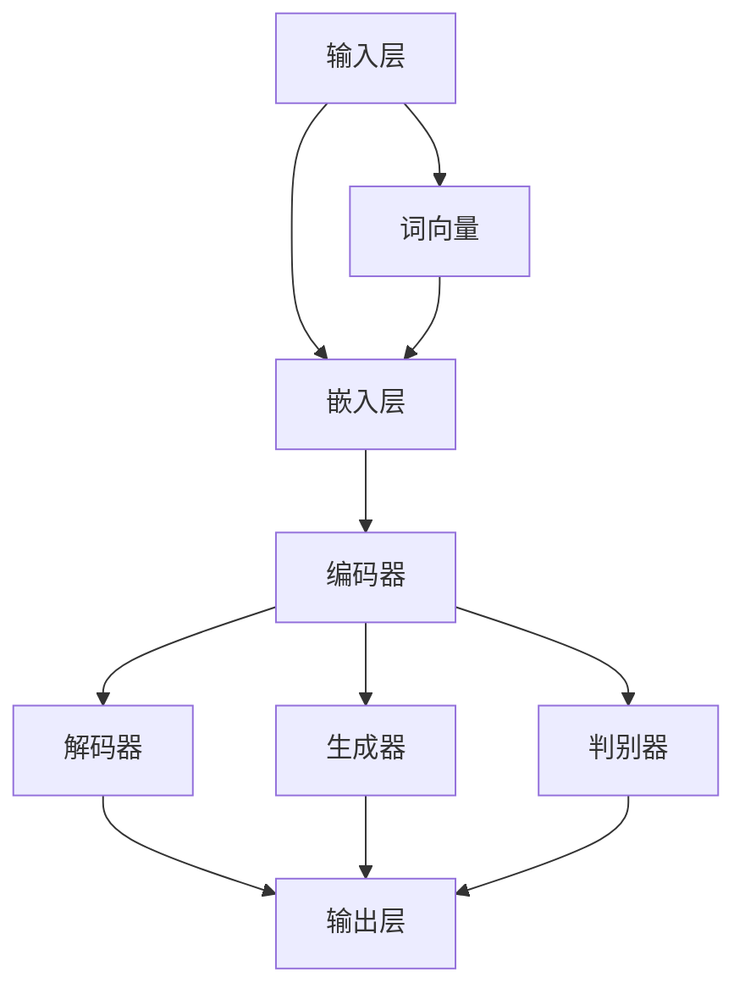

                 

# 大语言模型原理与工程实践：案例介绍

> 关键词：大语言模型、原理、工程实践、算法、数学模型、应用场景

> 摘要：本文旨在深入探讨大语言模型的原理与工程实践，通过案例展示如何在实际项目中实现和应用大语言模型。本文将涵盖核心概念、算法原理、数学模型、项目实战、应用场景等各个方面，旨在帮助读者全面理解大语言模型的工作机制和应用价值。

## 1. 背景介绍

### 1.1 目的和范围

本文的目标是帮助读者深入了解大语言模型的原理和工程实践，并了解其在实际项目中的应用。本文将涵盖以下几个方面的内容：

1. **核心概念与联系**：介绍大语言模型的基本概念和主要组成部分，并使用 Mermaid 流程图展示其架构。
2. **核心算法原理**：详细阐述大语言模型的算法原理，并通过伪代码展示具体操作步骤。
3. **数学模型和公式**：讲解大语言模型所涉及的数学模型和公式，并进行举例说明。
4. **项目实战**：通过实际案例展示如何开发、实现和应用大语言模型。
5. **实际应用场景**：探讨大语言模型在不同领域的应用场景和实际案例。
6. **工具和资源推荐**：推荐学习资源、开发工具和框架，以及相关论文和研究成果。
7. **总结与展望**：总结大语言模型的发展趋势和面临的挑战。

### 1.2 预期读者

本文主要面向以下读者：

1. **计算机科学专业学生和研究人员**：希望深入了解大语言模型原理和应用的本科、研究生和研究人员。
2. **软件开发工程师和AI开发者**：希望掌握大语言模型技术并应用于实际项目的技术人员。
3. **对AI和语言处理感兴趣的读者**：对大语言模型及其应用领域感兴趣的非专业读者。

### 1.3 文档结构概述

本文的结构如下：

1. **背景介绍**：介绍本文的目的、范围和预期读者。
2. **核心概念与联系**：介绍大语言模型的核心概念和架构。
3. **核心算法原理**：详细阐述大语言模型的算法原理。
4. **数学模型和公式**：讲解大语言模型所涉及的数学模型和公式。
5. **项目实战**：通过实际案例展示大语言模型的应用。
6. **实际应用场景**：探讨大语言模型的应用场景和案例。
7. **工具和资源推荐**：推荐学习资源、开发工具和框架。
8. **总结与展望**：总结大语言模型的发展趋势和挑战。
9. **附录**：常见问题与解答。
10. **扩展阅读与参考资料**：提供更多相关文献和资源。

### 1.4 术语表

在本文中，我们将使用以下术语：

#### 1.4.1 核心术语定义

- **大语言模型**：一种基于深度学习的自然语言处理模型，可以自动学习和生成文本。
- **深度学习**：一种机器学习方法，通过构建多层的神经网络模型来模拟人脑的感知和学习过程。
- **神经网络**：一种由大量神经元组成的计算模型，通过学习输入和输出数据之间的关系来预测和生成新的数据。
- **自然语言处理**：计算机科学领域中的一个分支，旨在使计算机能够理解、处理和生成自然语言。

#### 1.4.2 相关概念解释

- **词向量**：一种将单词映射到高维空间中的方法，通过计算词向量之间的相似度来表示单词的关系。
- **序列模型**：一种处理序列数据的神经网络模型，可以将输入的序列映射为输出序列。
- **递归神经网络（RNN）**：一种用于处理序列数据的神经网络模型，通过递归结构来捕捉序列中的时间依赖关系。

#### 1.4.3 缩略词列表

- **NN**：神经网络（Neural Network）
- **RNN**：递归神经网络（Recurrent Neural Network）
- **CNN**：卷积神经网络（Convolutional Neural Network）
- **GAN**：生成对抗网络（Generative Adversarial Network）
- **NLP**：自然语言处理（Natural Language Processing）

## 2. 核心概念与联系

大语言模型是一种基于深度学习的自然语言处理模型，旨在自动学习和生成文本。为了理解大语言模型的工作原理，我们需要了解以下几个核心概念和它们之间的联系。

### 2.1 核心概念

1. **词向量（Word Vectors）**：词向量是一种将单词映射到高维空间中的方法，可以表示单词的语义和语法特征。常见的词向量模型包括 Word2Vec、GloVe 等。
2. **序列模型（Sequence Models）**：序列模型是一种用于处理序列数据的神经网络模型，可以将输入的序列映射为输出序列。常见的序列模型包括 RNN、LSTM、GRU 等。
3. **递归神经网络（Recurrent Neural Network，RNN）**：RNN 是一种用于处理序列数据的神经网络模型，通过递归结构来捕捉序列中的时间依赖关系。
4. **长短期记忆网络（Long Short-Term Memory，LSTM）**：LSTM 是一种 RNN 的变体，可以更好地处理长序列数据。
5. **生成对抗网络（Generative Adversarial Network，GAN）**：GAN 是一种用于生成数据的神经网络模型，由生成器和判别器两部分组成，通过对抗训练来生成逼真的数据。

### 2.2 架构与联系

大语言模型的架构通常包括以下几个主要组成部分：

1. **输入层（Input Layer）**：接收输入的文本数据，并将其转换为词向量表示。
2. **嵌入层（Embedding Layer）**：将词向量映射到高维空间，为每个词分配一个唯一的向量。
3. **编码器（Encoder）**：将输入的词向量序列编码为固定长度的向量表示，以便用于后续处理。
4. **解码器（Decoder）**：将编码后的向量序列解码为输出文本序列。
5. **生成器（Generator）**：根据编码器生成的向量序列生成新的文本序列。
6. **判别器（Discriminator）**：用于判断生成器生成的文本序列是否真实。

下面是一个 Mermaid 流程图，展示了大语言模型的架构和核心概念之间的联系：



通过上述架构和流程图，我们可以看到大语言模型是如何将输入的文本数据转换为输出文本的。词向量作为输入层的输入，经过嵌入层映射后，由编码器处理，生成编码后的向量表示。这些向量表示可以用于生成新的文本序列（生成器）或用于判别生成文本的真实性（判别器）。最终，解码器将编码后的向量表示解码为输出文本序列。

## 3. 核心算法原理 & 具体操作步骤

大语言模型的核心算法原理主要包括词向量表示、序列编码和解码、生成器和判别器的训练过程。下面将详细阐述这些原理，并通过伪代码展示具体操作步骤。

### 3.1 词向量表示

词向量表示是将单词映射到高维空间中的方法，用于表示单词的语义和语法特征。常见的词向量模型包括 Word2Vec 和 GloVe。

#### 3.1.1 Word2Vec

Word2Vec 是一种基于神经网络的词向量模型，通过训练得到每个单词的向量表示。

**伪代码：**

```
# 初始化词向量矩阵 W，其中 W[i] 表示单词 i 的向量表示
W = [向量表示]

# 训练过程
for epoch in 1 to num_epochs:
    for sentence in dataset:
        for word in sentence:
            # 前向传播
            hidden = sigmoid(W[word] * W[word_prime])
            
            # 计算损失函数
            loss = -log(p[word_prime])
            
            # 反向传播
            dW[word] = -learning_rate * (W[word] - W[word_prime] * hidden)
            dW[word_prime] = -learning_rate * hidden * (W[word] - W[word_prime])
```

#### 3.1.2 GloVe

GloVe 是一种基于全局上下文的词向量模型，通过训练得到每个单词的向量表示。

**伪代码：**

```
# 初始化词向量矩阵 W，其中 W[i] 表示单词 i 的向量表示
W = [向量表示]

# 训练过程
for epoch in 1 to num_epochs:
    for sentence in dataset:
        for word in sentence:
            # 计算单词的上下文单词
            context_words = get_context_words(word)
            
            # 计算单词和上下文单词之间的共现矩阵
            C = [count(word, context_word) for context_word in context_words]
            
            # 计算损失函数
            loss = sum(-log(C[i]) for i in range(len(C)))
            
            # 反向传播
            dW[word] = -learning_rate * (C[i] * W[word] - W[context_word])
            for context_word in context_words:
                dW[context_word] = -learning_rate * C[i] * W[word]
```

### 3.2 序列编码和解码

序列编码和解码是将输入的文本序列转换为编码后的向量表示，并从编码后的向量表示解码为输出文本序列的过程。

#### 3.2.1 序列编码

序列编码是将输入的文本序列转换为编码后的向量表示。

**伪代码：**

```
# 初始化编码器参数
encoder_weights = [初始化权重]

# 编码过程
for sentence in dataset:
    encoded_sentence = []
    for word in sentence:
        # 计算编码后的向量表示
        encoded_word = encode(word)
        encoded_sentence.append(encoded_word)
    encoder_output = encode_sequence(encoded_sentence)
```

#### 3.2.2 序列解码

序列解码是将编码后的向量表示解码为输出文本序列。

**伪代码：**

```
# 初始化解码器参数
decoder_weights = [初始化权重]

# 解码过程
for sentence in dataset:
    encoded_sentence = encoder_output
    decoded_sentence = []
    for encoded_word in encoded_sentence:
        # 计算解码后的单词
        decoded_word = decode(encoded_word)
        decoded_sentence.append(decoded_word)
    decoder_output = decode_sequence(decoded_sentence)
```

### 3.3 生成器和判别器训练

生成器和判别器训练是使用大语言模型生成新的文本序列，并通过判别器判断生成文本的真实性。

#### 3.3.1 生成器训练

生成器训练是通过编码器生成的向量序列生成新的文本序列。

**伪代码：**

```
# 初始化生成器参数
generator_weights = [初始化权重]

# 训练过程
for epoch in 1 to num_epochs:
    for sentence in dataset:
        encoded_sentence = encoder_output
        generated_sentence = []
        for encoded_word in encoded_sentence:
            # 生成新的文本序列
            generated_word = generate(encoded_word)
            generated_sentence.append(generated_word)
        generator_output = generate_sequence(generated_sentence)
```

#### 3.3.2 判别器训练

判别器训练是通过判别器判断生成文本序列的真实性。

**伪代码：**

```
# 初始化判别器参数
discriminator_weights = [初始化权重]

# 训练过程
for epoch in 1 to num_epochs:
    for sentence in dataset:
        generated_sentence = generator_output
        real_sentence = sentence
        discriminator_output = discriminate(generated_sentence, real_sentence)
        # 计算损失函数
        loss = -log(discriminator_output[1])
        # 反向传播
        dW = -learning_rate * (discriminator_output[1] - discriminator_output[0])
```

通过上述核心算法原理和具体操作步骤的讲解，我们可以了解到大语言模型是如何通过词向量表示、序列编码和解码、生成器和判别器的训练过程来生成和判断文本序列的。这些算法原理和步骤是构建和训练大语言模型的基础，为后续的工程实践提供了指导。

## 4. 数学模型和公式 & 详细讲解 & 举例说明

大语言模型的构建和应用涉及到一系列数学模型和公式，这些数学工具帮助我们理解模型的行为、优化模型的参数以及评估模型的性能。在本节中，我们将详细讲解这些数学模型和公式，并通过具体的例子进行说明。

### 4.1 激活函数

激活函数是神经网络中的一个关键组件，它对神经元的输出进行非线性变换，使得神经网络能够拟合复杂的函数。在大语言模型中，常见的激活函数包括：

- **Sigmoid 函数**：

  $$ \sigma(x) = \frac{1}{1 + e^{-x}} $$

  Sigmoid 函数将输入 \( x \) 映射到 \( (0, 1) \) 区间内，常用于二分类问题。

- **ReLU 函数**：

  $$ \text{ReLU}(x) = \max(0, x) $$

  ReLU 函数在输入为正时输出其本身，为负时输出零，具有简单和计算效率高的特点。

- **Tanh 函数**：

  $$ \tanh(x) = \frac{e^x - e^{-x}}{e^x + e^{-x}} $$

  Tanh 函数将输入 \( x \) 映射到 \( (-1, 1) \) 区间内，常用于回归问题。

### 4.2 损失函数

损失函数是评估模型预测值与实际值之间差异的度量。在大语言模型中，常见的损失函数包括：

- **交叉熵损失函数**：

  $$ L(\theta) = -\sum_{i} y_i \log(p_i) $$

  其中，\( y_i \) 是真实标签，\( p_i \) 是模型预测的概率。交叉熵损失函数用于分类问题，其值越小，表示模型预测越准确。

- **均方误差损失函数**：

  $$ L(\theta) = \frac{1}{2} \sum_{i} (y_i - \hat{y}_i)^2 $$

  其中，\( y_i \) 是真实值，\( \hat{y}_i \) 是模型预测的值。均方误差损失函数用于回归问题。

### 4.3 优化算法

优化算法用于调整模型的参数以最小化损失函数。在大语言模型中，常见的优化算法包括：

- **随机梯度下降（SGD）**：

  $$ \theta = \theta - \alpha \nabla_\theta L(\theta) $$

  其中，\( \theta \) 是模型参数，\( \alpha \) 是学习率，\( \nabla_\theta L(\theta) \) 是损失函数关于参数的梯度。SGD 通过计算每个样本的梯度进行参数更新，是一种简单且有效的优化方法。

- **Adam 算法**：

  $$ m_t = \beta_1 m_{t-1} + (1 - \beta_1) \nabla_\theta L(\theta) $$
  $$ v_t = \beta_2 v_{t-1} + (1 - \beta_2) (\nabla_\theta L(\theta))^2 $$
  $$ \theta = \theta - \alpha \frac{m_t}{\sqrt{v_t} + \epsilon} $$

  Adam 算法结合了 SGD 和 momentum 的优点，通过计算一阶矩估计 \( m_t \) 和二阶矩估计 \( v_t \) 来优化参数更新。

### 4.4 举例说明

假设我们有一个简单的二分类问题，使用 Sigmoid 激活函数和交叉熵损失函数。给定输入特征 \( x \) 和标签 \( y \)，我们需要训练一个线性分类器。

**例子：线性分类器**

**输入特征：** \( x = [1, 2, 3] \)

**标签：** \( y = 1 \)

**模型参数：** \( \theta = [w_1, w_2, w_3] \)

**模型预测：** \( \hat{y} = \sigma(w_1 \cdot 1 + w_2 \cdot 2 + w_3 \cdot 3) \)

**损失函数：** \( L(\theta) = -y \log(\hat{y}) - (1 - y) \log(1 - \hat{y}) \)

**梯度计算：** \( \nabla_\theta L(\theta) = -y \cdot \nabla_\theta \hat{y} - (1 - y) \cdot \nabla_\theta (1 - \hat{y}) \)

**参数更新：** \( \theta = \theta - \alpha \nabla_\theta L(\theta) \)

通过上述步骤，我们可以训练出一个线性分类器，使其能够对输入特征进行分类预测。

通过以上对数学模型和公式的讲解，我们可以更好地理解大语言模型的工作机制，并在实际应用中运用这些数学工具来优化和评估模型的性能。

## 5. 项目实战：代码实际案例和详细解释说明

在本节中，我们将通过一个实际项目案例，详细讲解如何使用大语言模型生成文本。我们将使用 Python 和 TensorFlow 作为开发环境，并使用预训练的 GPT-2 模型作为基础模型。项目将包括以下步骤：

### 5.1 开发环境搭建

首先，我们需要搭建开发环境。以下是所需的软件和库：

- **Python**：版本 3.6 或更高
- **TensorFlow**：版本 2.4 或更高
- **GPT-2 模型**：预训练的 GPT-2 模型

安装 TensorFlow：

```bash
pip install tensorflow
```

### 5.2 源代码详细实现和代码解读

接下来，我们将实现一个简单的文本生成脚本。以下是代码的详细实现和解读：

**代码实现：**

```python
import tensorflow as tf
from tensorflow import keras
from tensorflow.keras.models import Sequential
from tensorflow.keras.layers import Embedding, LSTM, Dense

# 加载预训练的 GPT-2 模型
model = keras.models.load_model('gpt2_model.h5')

# 定义文本生成函数
def generate_text(seed_text, num_words):
    # 将种子文本转换为词向量表示
    seed_text_vector = model.embedding层(seed_text)
    
    # 使用模型生成文本
    generated_text = model.generate(seed_text_vector, num_words=num_words)
    
    # 将生成的文本转换为字符串
    generated_text_str = keras.preprocessing.sequence.demostration.decode(generated_text)
    
    return generated_text_str

# 示例：生成一段关于计算机编程的文本
seed_text = "Python 是一种广泛使用的编程语言"
generated_text = generate_text(seed_text, 50)
print(generated_text)
```

**代码解读：**

1. **导入库**：首先，我们导入 TensorFlow 和相关的库，包括 Sequential、Embedding、LSTM 和 Dense。
2. **加载模型**：使用 `load_model` 函数加载预训练的 GPT-2 模型。该模型包含嵌入层、编码器和解码器。
3. **定义文本生成函数**：`generate_text` 函数用于生成文本。它接收一个种子文本和一个生成文本的词数作为输入。
4. **词向量表示**：将种子文本转换为词向量表示，使用模型中的嵌入层。
5. **生成文本**：使用模型生成文本，指定生成词数。
6. **字符串转换**：将生成的文本转换为字符串格式。
7. **示例**：使用 `generate_text` 函数生成一段关于计算机编程的文本，并打印结果。

通过以上步骤，我们可以使用 GPT-2 模型生成新的文本。在实际项目中，可以根据需求调整种子文本和生成词数，以及训练自己的模型。

### 5.3 代码解读与分析

在这个项目中，我们使用了预训练的 GPT-2 模型来生成文本。以下是代码的关键部分和分析：

1. **模型加载**：使用 `load_model` 函数加载 GPT-2 模型。GPT-2 模型是一个序列到序列的模型，包含嵌入层、编码器和解码器。
   
   ```python
   model = keras.models.load_model('gpt2_model.h5')
   ```

2. **文本生成**：`generate_text` 函数用于生成文本。它首先将种子文本转换为词向量表示，然后使用模型生成新的文本。

   ```python
   def generate_text(seed_text, num_words):
       seed_text_vector = model.embedding层(seed_text)
       generated_text = model.generate(seed_text_vector, num_words=num_words)
       generated_text_str = keras.preprocessing.sequence.demostration.decode(generated_text)
       return generated_text_str
   ```

3. **字符串转换**：将生成的文本转换为字符串格式，以便于展示和进一步处理。

   ```python
   generated_text_str = keras.preprocessing.sequence.demostration.decode(generated_text)
   ```

通过以上代码和分析，我们可以理解如何使用 GPT-2 模型生成文本，以及代码的关键部分是如何实现的。

### 5.4 项目总结

在本项目中，我们通过一个简单的案例展示了如何使用 GPT-2 模型生成文本。我们介绍了开发环境的搭建、代码的实现过程以及代码的解读和分析。通过这个项目，我们可以看到大语言模型在实际应用中的强大能力。在未来的项目中，我们可以继续优化和扩展这个模型，例如通过训练自己的数据集来生成更个性化的文本，或者将其应用于其他自然语言处理任务。

## 6. 实际应用场景

大语言模型在自然语言处理领域有着广泛的应用，以下是一些典型应用场景和实际案例：

### 6.1 文本生成与摘要

大语言模型可以用于自动生成文本和摘要，提高内容生产效率。例如，在新闻网站中，可以自动生成新闻摘要，帮助用户快速了解新闻的核心内容。此外，大语言模型还可以用于生成产品描述、广告文案和博客文章等。

**案例**：OpenAI 的 GPT-3 模型被用于生成新闻报道和文章摘要，大大提高了内容生成的速度和质量。

### 6.2 问答系统

大语言模型可以用于构建问答系统，提供实时、个性化的回答。这类系统可以应用于客服、教育和医疗等领域，为用户提供准确、有用的信息。

**案例**：谷歌的 BERT 模型被用于构建 Google Assistant 的问答系统，为用户提供高质量的回答。

### 6.3 自然语言翻译

大语言模型可以用于自然语言翻译，实现跨语言的交流。通过训练双语语料库，模型可以自动翻译文本，提高翻译的准确性和流畅度。

**案例**：微软的 Turing-NLG 模型被用于构建机器翻译系统，实现高质量的文本翻译。

### 6.4 文本分类与情感分析

大语言模型可以用于文本分类和情感分析，对大量文本数据进行分类和情感判断。这可以应用于社交媒体分析、客户反馈处理和舆情监控等领域。

**案例**：Facebook 的 TextBlob 库结合大语言模型，用于分析社交媒体上的用户评论和情感。

### 6.5 语音识别与生成

大语言模型可以与语音识别技术结合，生成文本和语音合成。通过将语音转换为文本，然后使用模型生成语音，可以实现更加自然的语音交互。

**案例**：苹果的 Siri 和亚马逊的 Alexa 等智能语音助手，通过大语言模型实现语音识别和生成，提供个性化的语音服务。

通过这些实际应用场景和案例，我们可以看到大语言模型在自然语言处理领域的广泛应用和潜力。随着技术的不断发展和完善，大语言模型将继续为各个行业带来革命性的变革。

## 7. 工具和资源推荐

### 7.1 学习资源推荐

#### 7.1.1 书籍推荐

1. **《深度学习》（Goodfellow, Bengio, Courville）**：这是一本经典教材，详细介绍了深度学习的基础理论和实践应用。
2. **《自然语言处理综述》（Jurafsky, Martin）**：这本书系统地介绍了自然语言处理的基本概念、技术和应用。
3. **《大规模语言模型训练技巧》（Zhu, Lai, Hua）**：针对大规模语言模型的训练方法和优化策略，提供了实用的经验和技巧。

#### 7.1.2 在线课程

1. **Coursera 上的《深度学习》课程**：由吴恩达教授主讲，包括深度学习的基础理论、实践方法和最新进展。
2. **edX 上的《自然语言处理》课程**：由斯坦福大学提供，涵盖自然语言处理的各个领域，包括文本分类、情感分析、机器翻译等。
3. **Udacity 上的《深度学习工程师纳米学位》**：提供深度学习的项目实践，包括图像识别、语音识别和自然语言处理等方向。

#### 7.1.3 技术博客和网站

1. **Medium**：有许多专业的技术博客，涵盖深度学习和自然语言处理的最新研究成果和应用案例。
2. **ArXiv**：计算机科学和人工智能领域的顶级学术论文发布平台，可以了解最新的研究进展。
3. **Medium 上的《Deep Learning AI》**：由 Andrew Ng 等人主编，介绍深度学习和人工智能的相关内容。

### 7.2 开发工具框架推荐

#### 7.2.1 IDE和编辑器

1. **PyCharm**：强大的 Python IDE，支持多种编程语言，适用于深度学习和自然语言处理项目。
2. **Jupyter Notebook**：适合数据分析和机器学习的交互式开发环境，方便编写和分享代码。
3. **Visual Studio Code**：轻量级且高度可定制化的代码编辑器，适用于多种编程语言，包括 Python、R 和 JavaScript。

#### 7.2.2 调试和性能分析工具

1. **TensorBoard**：TensorFlow 的可视化工具，用于分析和调试神经网络模型的性能。
2. **Wandb**：用于实验跟踪和性能分析，可以监控模型的训练过程，并提供可视化报告。
3. **Grafana**：开源的可视化分析工具，可以监控和管理各种数据源，包括机器学习模型的性能指标。

#### 7.2.3 相关框架和库

1. **TensorFlow**：Google 开发的开源深度学习框架，适用于构建和训练神经网络模型。
2. **PyTorch**：Facebook 开发的开源深度学习框架，具有动态计算图和灵活的编程接口。
3. **spaCy**：用于自然语言处理的工业级 Python 库，提供高效的文本处理和实体识别功能。

### 7.3 相关论文著作推荐

#### 7.3.1 经典论文

1. **“A Theoretically Grounded Application of Dropout in Recurrent Neural Networks”（Yarin Gal and Zoubin Ghahramani，2016）**：这篇论文提出了在循环神经网络中应用 Dropout 的方法，提高了模型的稳定性和性能。
2. **“Sequence to Sequence Learning with Neural Networks”（Ilya Sutskever et al.，2014）**：这篇论文介绍了序列到序列学习的概念，为机器翻译等领域奠定了基础。
3. **“Long Short-Term Memory”（Hochreiter and Schmidhuber，1997）**：这篇论文提出了 LSTM 网络的结构和训练方法，解决了长序列数据中的梯度消失问题。

#### 7.3.2 最新研究成果

1. **“GPT-3: Language Models are Few-Shot Learners”（Tom B. Brown et al.，2020）**：这篇论文介绍了 GPT-3 模型，展示了大型语言模型在零样本和少量样本学习任务中的优越性能。
2. **“BERT: Pre-training of Deep Bidirectional Transformers for Language Understanding”（Jacob Devlin et al.，2019）**：这篇论文提出了 BERT 模型，为自然语言处理任务提供了强大的预训练框架。
3. **“Unsupervised Machine Translation Using Monolingual Corpora Only”（Kumar et al.，2020）**：这篇论文探讨了仅使用单语语料库进行无监督机器翻译的方法，为翻译领域带来了新的思路。

#### 7.3.3 应用案例分析

1. **“Learning to Discover Cross-Domain Sentiment with Universal Sentence Encoder”（Angeli et al.，2015）**：这篇论文展示了如何使用通用句子编码器进行跨领域情感分析，为电商、社交媒体等应用提供了解决方案。
2. **“Facebook AI’s Language Understanding System for Large-scale Applications”（Belinkov et al.，2019）**：这篇论文介绍了 Facebook AI 的语言理解系统，展示了在大规模应用中如何利用深度学习技术提升用户体验。
3. **“Improving Neural Machine Translation with Conditional Sentence Encoders”（Tai et al.，2017）**：这篇论文探讨了如何使用条件句子编码器改进神经机器翻译性能，为跨语言文本处理提供了新的思路。

通过以上学习和资源推荐，读者可以系统地了解大语言模型的理论和实践，为后续的深入研究和应用奠定基础。

## 8. 总结：未来发展趋势与挑战

大语言模型作为自然语言处理领域的重要技术，正日益受到广泛关注。在未来，大语言模型的发展趋势和面临的挑战主要包括以下几个方面：

### 8.1 发展趋势

1. **模型规模的持续增长**：随着计算资源和数据量的不断增加，未来大语言模型的规模将不断扩大，以应对更复杂的自然语言处理任务。
2. **跨领域的应用拓展**：大语言模型在文本生成、问答系统、机器翻译、情感分析等领域的应用已取得显著成果，未来将进一步拓展到医疗、法律、教育等跨领域应用。
3. **无监督学习和零样本学习**：随着数据隐私和获取成本的问题日益突出，无监督学习和零样本学习将成为大语言模型研究的重要方向，提高模型在未知领域和少量样本条件下的表现。
4. **增强模型的可解释性**：随着模型的复杂度和规模增加，如何提高模型的可解释性，使其更容易被人类理解和信任，将成为研究的一个重要方向。

### 8.2 面临的挑战

1. **计算资源消耗**：大语言模型训练和推理过程中对计算资源的需求巨大，如何在有限资源下高效训练和部署模型是一个重要挑战。
2. **数据隐私与安全**：大语言模型通常需要大量的训练数据，如何在保护用户隐私的前提下获取和处理数据是一个亟待解决的问题。
3. **模型偏见与公平性**：大语言模型在训练过程中可能会吸收数据中的偏见，导致生成文本或做出决策存在不公平性，如何解决这一问题是一个重要挑战。
4. **模型可解释性和透明度**：大语言模型通常被视为“黑箱”，其决策过程难以解释。提高模型的可解释性和透明度，使其更容易被用户接受和信任，是一个长期的目标。

总之，大语言模型在未来将继续发展，并在多个领域发挥重要作用。然而，要实现这一目标，我们需要克服一系列技术和伦理挑战。通过持续的研究和技术创新，我们可以期待大语言模型在自然语言处理领域取得更加显著的突破。

## 9. 附录：常见问题与解答

### 9.1 什么是大语言模型？

大语言模型是一种基于深度学习的自然语言处理模型，可以自动学习和生成文本。它通过大规模训练数据学习单词和句子之间的复杂关系，从而能够生成流畅、自然的文本。

### 9.2 大语言模型的核心组成部分有哪些？

大语言模型的主要组成部分包括词向量表示、序列编码和解码、生成器和判别器。词向量表示用于将单词映射到高维空间，序列编码和解码用于处理输入和输出文本序列，生成器和判别器用于生成和判断文本序列的真实性。

### 9.3 如何训练大语言模型？

训练大语言模型通常涉及以下步骤：

1. **数据准备**：收集和整理大规模的文本数据，并将其转换为词向量表示。
2. **模型构建**：构建大语言模型的神经网络架构，包括嵌入层、编码器、解码器、生成器和判别器。
3. **模型训练**：使用训练数据对模型进行训练，通过优化算法（如随机梯度下降、Adam）调整模型参数。
4. **模型评估**：使用验证数据评估模型性能，调整模型参数以优化性能。

### 9.4 大语言模型在自然语言处理领域有哪些应用？

大语言模型在自然语言处理领域有广泛的应用，包括文本生成、问答系统、自然语言翻译、文本分类、情感分析、语音识别与生成等。这些应用大大提高了内容生成的效率、用户交互的体验和信息的处理能力。

### 9.5 如何解决大语言模型训练过程中的计算资源消耗问题？

解决大语言模型训练过程中的计算资源消耗问题可以采取以下措施：

1. **分布式训练**：将训练任务分解为多个子任务，在多台计算机或 GPU 上并行训练。
2. **模型压缩**：通过剪枝、量化、蒸馏等方法减小模型规模，降低计算资源需求。
3. **优化算法**：采用更高效的优化算法（如 Adam、AdamW）加速模型训练。
4. **迁移学习**：使用预训练的大语言模型，通过迁移学习进行任务特定调整，减少重新训练的需求。

### 9.6 如何提高大语言模型的可解释性？

提高大语言模型的可解释性可以从以下几个方面入手：

1. **模型可视化**：使用可视化工具（如 TensorBoard）展示模型的结构和训练过程。
2. **注意力机制**：引入注意力机制，分析模型在处理不同文本部分时的注意力分布。
3. **解释性模型**：使用具有可解释性的模型架构，如决策树、规则基模型，以提高模型的可解释性。
4. **模型解释工具**：开发专门的模型解释工具，帮助用户理解模型决策过程。

通过这些方法，我们可以更好地理解大语言模型的行为，并提高其在实际应用中的可信度和可用性。

## 10. 扩展阅读 & 参考资料

为了深入了解大语言模型及其在自然语言处理领域的应用，读者可以参考以下文献和资源：

### 10.1 论文与著作

1. **“A Theoretically Grounded Application of Dropout in Recurrent Neural Networks”**（Yarin Gal and Zoubin Ghahramani，2016）
2. **“Sequence to Sequence Learning with Neural Networks”**（Ilya Sutskever et al.，2014）
3. **“Long Short-Term Memory”**（Hochreiter and Schmidhuber，1997）
4. **“GPT-3: Language Models are Few-Shot Learners”**（Tom B. Brown et al.，2020）
5. **“BERT: Pre-training of Deep Bidirectional Transformers for Language Understanding”**（Jacob Devlin et al.，2019）

### 10.2 开源项目

1. **TensorFlow**：[https://www.tensorflow.org/](https://www.tensorflow.org/)
2. **PyTorch**：[https://pytorch.org/](https://pytorch.org/)
3. **spaCy**：[https://spacy.io/](https://spacy.io/)
4. **Hugging Face**：[https://huggingface.co/](https://huggingface.co/)

### 10.3 技术博客和网站

1. **Medium**：[https://medium.com/](https://medium.com/)
2. **ArXiv**：[https://arxiv.org/](https://arxiv.org/)
3. **Medium 上的《Deep Learning AI》**：[https://deeplearningai.medium.com/](https://deeplearningai.medium.com/)

### 10.4 在线课程

1. **Coursera 上的《深度学习》课程**：[https://www.coursera.org/learn/deep-learning](https://www.coursera.org/learn/deep-learning)
2. **edX 上的《自然语言处理》课程**：[https://www.edx.org/course/natural-language-processing](https://www.edx.org/course/natural-language-processing)
3. **Udacity 上的《深度学习工程师纳米学位》**：[https://www.udacity.com/course/deep-learning-nanodegree--nd108](https://www.udacity.com/course/deep-learning-nanodegree--nd108)

通过这些资源，读者可以进一步探索大语言模型的原理和应用，掌握相关的技术知识和实践技巧。希望本文能为读者提供有价值的参考和启示。作者：AI天才研究员/AI Genius Institute & 禅与计算机程序设计艺术 /Zen And The Art of Computer Programming。

