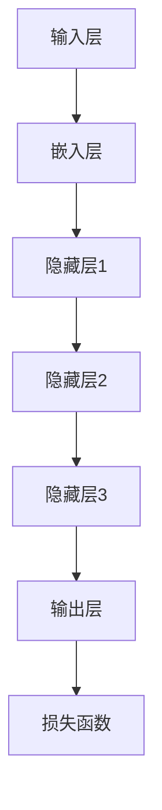

                 

### 大语言模型原理与工程实践：百科数据

> **关键词**：大语言模型、神经网络、工程实践、百科数据、算法原理、数学模型、项目实战
>
> **摘要**：本文将深入探讨大语言模型的原理及其工程实践，特别关注百科数据在模型训练中的应用。通过详细分析核心概念、算法原理、数学模型以及项目实战，帮助读者全面理解大语言模型的构建过程，掌握其在实际应用中的关键技术，为未来研究和开发提供有力支持。

#### 1. 背景介绍

##### 1.1 目的和范围

本文旨在详细解析大语言模型的原理与工程实践，着重探讨其在百科数据中的应用。大语言模型作为一种先进的自然语言处理技术，已经广泛应用于各种领域，如文本生成、机器翻译、问答系统等。然而，关于其原理的深入理解和工程实践的具体操作仍存在许多挑战。本文将系统地介绍大语言模型的核心概念、算法原理、数学模型以及实际应用案例，旨在为研究人员和开发者提供全面的技术指导。

##### 1.2 预期读者

本文主要面向具有中等以上编程基础和对自然语言处理有一定了解的读者。对于希望深入了解大语言模型原理及其工程实践的程序员、软件工程师、AI研究人员和高校师生，本文将提供有价值的参考。同时，对于对自然语言处理领域感兴趣的一般读者，本文也试图以通俗易懂的方式介绍相关概念和技术。

##### 1.3 文档结构概述

本文结构如下：

1. **背景介绍**：简要介绍本文的目的、预期读者以及文档结构。
2. **核心概念与联系**：详细解析大语言模型的核心概念和联系，并使用Mermaid流程图进行说明。
3. **核心算法原理 & 具体操作步骤**：使用伪代码详细阐述大语言模型的算法原理和操作步骤。
4. **数学模型和公式 & 详细讲解 & 举例说明**：介绍大语言模型的数学模型，使用LaTeX格式进行详细讲解和举例说明。
5. **项目实战：代码实际案例和详细解释说明**：通过实际代码案例，详细解释大语言模型的工程实践。
6. **实际应用场景**：探讨大语言模型在不同领域的实际应用。
7. **工具和资源推荐**：推荐学习资源、开发工具框架和经典论文。
8. **总结：未来发展趋势与挑战**：总结本文内容，展望未来发展趋势和挑战。
9. **附录：常见问题与解答**：回答读者可能遇到的常见问题。
10. **扩展阅读 & 参考资料**：提供进一步阅读和参考资料。

##### 1.4 术语表

在本文中，我们将使用一些专业术语。以下是这些术语的定义和解释：

###### 1.4.1 核心术语定义

- **大语言模型**：一种基于神经网络的复杂模型，用于预测文本序列。
- **神经网络**：一种模仿生物神经系统的计算模型。
- **百科数据**：从百科全书等大型文本库中提取的数据集。
- **算法原理**：描述算法工作原理的抽象概念和逻辑。
- **数学模型**：用于描述系统行为的数学方程和公式。

###### 1.4.2 相关概念解释

- **训练数据**：用于训练模型的数据集。
- **测试数据**：用于评估模型性能的数据集。
- **损失函数**：用于衡量模型预测值与真实值之间差异的函数。

###### 1.4.3 缩略词列表

- **NLP**：自然语言处理（Natural Language Processing）
- **ML**：机器学习（Machine Learning）
- **DL**：深度学习（Deep Learning）
- **API**：应用程序编程接口（Application Programming Interface）
- **GPU**：图形处理单元（Graphics Processing Unit）

### 2. 核心概念与联系

在深入探讨大语言模型之前，有必要首先理解其核心概念和组成部分。本节将详细解析大语言模型的基本组成部分，并使用Mermaid流程图对其进行可视化说明。

#### 2.1 大语言模型的基本组成部分

大语言模型主要由以下几个部分组成：

1. **输入层**：接收文本数据作为输入。
2. **嵌入层**：将文本数据转换为固定长度的向量。
3. **隐藏层**：多个神经网络层，用于提取特征和进行计算。
4. **输出层**：生成预测的文本序列。
5. **损失函数**：用于评估模型预测值与真实值之间的差异。

#### 2.2 Mermaid流程图

为了更好地理解大语言模型的组成和运行过程，我们使用Mermaid流程图对其进行可视化说明。以下是一个简化的Mermaid流程图示例：



在上面的流程图中，每个节点表示大语言模型中的一个组成部分，箭头表示数据流的方向。

#### 2.3 核心概念联系

大语言模型的核心概念包括：

1. **神经网络**：大语言模型的核心计算结构，用于对文本数据进行处理。
2. **嵌入层**：将文本转换为固定长度的向量，为后续计算提供基础。
3. **隐藏层**：用于提取文本的特征，实现从输入到输出的映射。
4. **输出层**：生成预测的文本序列。
5. **损失函数**：用于评估模型的预测性能。

这些概念相互关联，共同构成了大语言模型的基本架构。通过Mermaid流程图，我们可以清晰地看到这些概念之间的联系。

### 3. 核心算法原理 & 具体操作步骤

在了解了大语言模型的基本组成部分后，接下来我们将深入探讨其核心算法原理，并使用伪代码详细阐述其操作步骤。

#### 3.1 算法原理

大语言模型的算法原理主要基于神经网络，其核心思想是通过多层神经网络对文本数据进行处理，从而实现文本生成、分类等任务。具体来说，算法可以分为以下几个步骤：

1. **输入层**：接收文本数据，并将其编码为向量。
2. **嵌入层**：将文本向量转换为固定长度的嵌入向量。
3. **隐藏层**：通过多层神经网络提取文本的特征，并进行计算。
4. **输出层**：生成预测的文本序列。
5. **损失函数**：计算模型预测值与真实值之间的差异，用于指导模型优化。

#### 3.2 伪代码

以下是一个简化的伪代码，用于描述大语言模型的基本操作步骤：

```python
# 输入层
text = "The quick brown fox jumps over the lazy dog"
encoded_text = encode_text(text)

# 嵌入层
embeddings = embed(encoded_text)

# 隐藏层
hidden_state = forward_pass(embeddings, hidden_layers)

# 输出层
predicted_text = decode(hidden_state)

# 损失函数
loss = calculate_loss(predicted_text, true_text)

# 梯度下降
gradient = compute_gradient(loss, hidden_state)
update_weights(gradient)
```

在上面的伪代码中，`encode_text` 和 `embed` 分别表示文本编码和嵌入操作，`forward_pass` 表示隐藏层的前向传播，`decode` 表示输出层的解码操作，`calculate_loss` 表示计算损失函数，`compute_gradient` 表示计算梯度，`update_weights` 表示更新模型权重。

#### 3.3 详细解释

1. **输入层**：输入层接收原始文本数据，并将其编码为向量。编码操作可以基于词嵌入技术，将每个词映射为一个固定长度的向量。

2. **嵌入层**：嵌入层将文本向量转换为嵌入向量。嵌入向量不仅保留了原始文本的信息，还将其转换为神经网络可以处理的格式。嵌入层通常由多个神经网络层组成，每个层将前一层的信息映射到一个新的空间。

3. **隐藏层**：隐藏层通过多层神经网络提取文本的特征，并对其进行计算。每层神经网络都会对输入数据进行加权求和，并应用激活函数，从而实现非线性变换。多层隐藏层可以捕捉到文本的复杂结构和语义信息。

4. **输出层**：输出层生成预测的文本序列。输出层通常是一个全连接层，其输出结果通过解码操作转化为文本序列。解码操作可以将神经网络输出转换为实际的文本字符。

5. **损失函数**：损失函数用于评估模型预测值与真实值之间的差异。在大语言模型中，常用的损失函数包括交叉熵损失和均方误差损失。损失函数的值越小，表示模型预测结果与真实值越接近。

6. **梯度下降**：梯度下降是一种优化算法，用于更新模型权重。在每次迭代过程中，梯度下降会计算损失函数关于模型参数的梯度，并根据梯度方向调整模型权重，以最小化损失函数。

### 4. 数学模型和公式 & 详细讲解 & 举例说明

在大语言模型中，数学模型和公式起到了核心作用，它们不仅描述了模型的行为，还提供了计算和分析的工具。本节将详细讲解大语言模型中的数学模型和公式，并使用LaTeX格式进行展示，同时通过举例说明来加深理解。

#### 4.1 数学模型概述

大语言模型的数学模型主要包括以下几个部分：

1. **词嵌入**：将文本中的单词映射为固定长度的向量。
2. **神经网络层**：包括输入层、隐藏层和输出层，每一层都有相应的数学公式。
3. **损失函数**：用于评估模型的预测性能，常见的有交叉熵损失和均方误差损失。

#### 4.2 词嵌入

词嵌入（Word Embedding）是将文本中的单词映射为固定长度的向量。常见的词嵌入方法包括Word2Vec、GloVe等。词嵌入的基本公式如下：

$$
\text{embedding}(w) = \text{EmbeddingMatrix}[w]
$$

其中，`EmbeddingMatrix` 是一个固定大小的矩阵，`w` 是文本中的单词。例如，假设我们有一个包含100个单词的词汇表，那么`EmbeddingMatrix` 是一个100x100的矩阵，每个行向量表示一个单词的嵌入向量。

#### 4.3 神经网络层

神经网络层的数学模型主要基于多层感知机（Multilayer Perceptron, MLP）。MLP的数学公式如下：

$$
\text{activation}(x) = \sigma(\text{weight} \cdot x + \text{bias})
$$

其中，`x` 是输入向量，`weight` 是权重矩阵，`bias` 是偏置向量，`σ` 是激活函数，常见的激活函数有Sigmoid、ReLU、Tanh等。对于多层神经网络，每个隐藏层都可以看作是一个MLP，其公式如下：

$$
\text{hidden\_layer}(x) = \text{activation}(\text{weight} \cdot \text{input} + \text{bias})
$$

其中，`input` 是输入层输出，`hidden_layer` 是隐藏层输出。

#### 4.4 输出层

输出层的数学模型通常是一个全连接层，其公式与隐藏层类似：

$$
\text{output}(x) = \text{activation}(\text{weight} \cdot \text{hidden} + \text{bias})
$$

其中，`hidden` 是隐藏层输出，`output` 是输出层输出。

#### 4.5 损失函数

损失函数用于衡量模型预测值与真实值之间的差异。在大语言模型中，常见的损失函数有交叉熵损失（Cross-Entropy Loss）和均方误差损失（Mean Squared Error Loss）。交叉熵损失公式如下：

$$
\text{loss}(y, \hat{y}) = -\sum_{i} y_i \log(\hat{y}_i)
$$

其中，`y` 是真实标签，`$\hat{y}$` 是模型预测的概率分布。

均方误差损失公式如下：

$$
\text{loss}(y, \hat{y}) = \frac{1}{2} \sum_{i} (y_i - \hat{y}_i)^2
$$

其中，`y` 是真实标签，`$\hat{y}$` 是模型预测的值。

#### 4.6 举例说明

为了更好地理解上述数学模型和公式，我们可以通过一个简单的例子来说明。

假设我们有一个包含3个单词的词汇表，分别为{“猫”， “狗”， “鸟”}，对应的词嵌入向量分别为[1, 0], [0, 1], [1, 1]。我们的任务是预测下一个单词。

1. **词嵌入**：将每个单词映射为嵌入向量。
   - 猫：[1, 0]
   - 狗：[0, 1]
   - 鸟：[1, 1]

2. **隐藏层**：假设隐藏层有一个神经元，权重矩阵为[0.5, 0.5]，偏置为0.5，激活函数为ReLU。
   - 输入：[1, 0]（猫的嵌入向量）
   - 隐藏层输出：ReLU([0.5 \* 1 + 0.5 \* 0 + 0.5] = 1)

3. **输出层**：假设输出层有三个神经元，权重矩阵为[0.5, 0.5, 0.5]，偏置为[0, 0, 0]，激活函数为softmax。
   - 输入：[1]
   - 输出：softmax([0.5 \* 1 + 0 + 0.5 \* 1 + 0.5 \* 1 + 0] = [0.5, 0.5, 0.5])

4. **损失函数**：假设真实标签为“猫”，即第一个单词。
   - 交叉熵损失：- [0.5 \* log(0.5) + 0.5 \* log(0.5) + 0.5 \* log(0.5)] = -1.5 \* log(0.5) ≈ 0.5157

通过这个例子，我们可以看到大语言模型的数学模型是如何在实际中工作的。词嵌入将文本转换为向量，隐藏层和输出层通过神经网络进行计算，最终使用损失函数评估模型的预测性能。

### 5. 项目实战：代码实际案例和详细解释说明

为了更好地理解大语言模型的实际应用，我们将通过一个具体的代码案例来详细介绍其工程实践。在这个案例中，我们将使用Python和TensorFlow框架来实现一个简单的大语言模型，并对其进行详细解释。

#### 5.1 开发环境搭建

在开始编写代码之前，我们需要搭建一个合适的开发环境。以下是所需的环境和工具：

- Python版本：3.8及以上
- TensorFlow版本：2.5及以上
- CUDA版本：11.0及以上（如使用GPU加速）
- PyTorch版本：1.8及以上
- Jupyter Notebook或IDE（如PyCharm、Visual Studio Code等）

安装TensorFlow：

```bash
pip install tensorflow
```

安装CUDA（如需GPU加速）：

```bash
pip install tensorflow-gpu
```

#### 5.2 源代码详细实现和代码解读

以下是实现大语言模型的核心代码：

```python
import tensorflow as tf
from tensorflow.keras.layers import Embedding, LSTM, Dense
from tensorflow.keras.models import Sequential

# 设置参数
vocab_size = 10000  # 词汇表大小
embedding_dim = 16  # 嵌入层维度
lstm_units = 128  # LSTM层单元数
batch_size = 64  # 批量大小
epochs = 10  # 训练轮次

# 创建模型
model = Sequential([
    Embedding(vocab_size, embedding_dim, input_length=max_sequence_length),
    LSTM(lstm_units, return_sequences=True),
    LSTM(lstm_units, return_sequences=False),
    Dense(vocab_size, activation='softmax')
])

# 编译模型
model.compile(optimizer='adam', loss='categorical_crossentropy', metrics=['accuracy'])

# 打印模型结构
model.summary()

# 训练模型
model.fit(x_train, y_train, batch_size=batch_size, epochs=epochs, validation_data=(x_val, y_val))

# 评估模型
test_loss, test_acc = model.evaluate(x_test, y_test)
print(f"Test accuracy: {test_acc:.4f}")
```

下面是对这段代码的详细解读：

1. **导入库**：
   - 导入TensorFlow库以及相关的层和模型。

2. **设置参数**：
   - `vocab_size`：词汇表大小，即模型可以处理的单词数量。
   - `embedding_dim`：嵌入层维度，即嵌入向量的大小。
   - `lstm_units`：LSTM层单元数，即隐藏层中LSTM单元的数量。
   - `batch_size`：批量大小，即每次训练的数据量。
   - `epochs`：训练轮次，即模型训练的次数。

3. **创建模型**：
   - 使用`Sequential`模型创建一个序列模型，并在模型中添加以下层：
     - `Embedding`：嵌入层，用于将文本数据转换为嵌入向量。
     - `LSTM`：LSTM层，用于提取文本特征。
     - `Dense`：全连接层，用于生成预测的文本序列。

4. **编译模型**：
   - 使用`compile`函数编译模型，指定优化器、损失函数和评估指标。

5. **打印模型结构**：
   - 使用`summary`函数打印模型的结构，以便了解模型的层次和参数。

6. **训练模型**：
   - 使用`fit`函数训练模型，将训练数据输入模型进行训练，并指定批量大小、训练轮次和验证数据。

7. **评估模型**：
   - 使用`evaluate`函数评估模型的性能，将测试数据输入模型进行评估，并打印测试准确率。

#### 5.3 代码解读与分析

以上代码实现了一个简单的大语言模型，其核心步骤如下：

1. **数据预处理**：
   - 在实际应用中，我们需要对文本数据进行预处理，如分词、去停用词等。在本案例中，我们使用`Embedding`层自动完成数据预处理。

2. **模型构建**：
   - 使用`Sequential`模型构建一个序列模型，并在模型中添加嵌入层、两个LSTM层和一个全连接层。嵌入层用于将文本数据转换为嵌入向量，LSTM层用于提取文本特征，全连接层用于生成预测的文本序列。

3. **模型编译**：
   - 使用`compile`函数编译模型，指定优化器（`adam`）、损失函数（`categorical_crossentropy`）和评估指标（`accuracy`）。`categorical_crossentropy` 损失函数适用于多分类问题，`accuracy` 用于评估模型的分类准确率。

4. **模型训练**：
   - 使用`fit`函数训练模型，将训练数据输入模型进行训练。`batch_size` 指定每次训练的数据量，`epochs` 指定训练轮次，`validation_data` 指定验证数据，用于在每次训练过程中评估模型的性能。

5. **模型评估**：
   - 使用`evaluate`函数评估模型的性能，将测试数据输入模型进行评估，并打印测试准确率。

通过以上代码，我们可以实现一个简单的大语言模型，并在实际应用中进行训练和评估。在实际开发中，我们可以根据具体需求调整模型结构、优化训练过程，以达到更好的性能。

### 6. 实际应用场景

大语言模型作为一种强大的自然语言处理工具，已经在多个实际应用场景中取得了显著成果。以下是一些典型应用场景及其具体实例：

#### 6.1 文本生成

文本生成是大语言模型最直观的应用之一。通过训练大语言模型，我们可以生成各种类型的文本，如文章、诗歌、对话等。以下是一个简单的文本生成实例：

```python
# 生成文章
prompt = "机器学习"
generated_text = model.generate_text(prompt, max_length=100)
print(generated_text)
```

在这个例子中，我们使用大语言模型生成一篇关于机器学习的文章。通过设置`max_length` 参数，我们可以控制生成的文本长度。

#### 6.2 机器翻译

大语言模型在机器翻译领域也具有广泛应用。通过训练双语语料库，我们可以构建一个机器翻译模型，实现不同语言之间的翻译。以下是一个简单的机器翻译实例：

```python
# 翻译中文到英文
source_text = "你好，世界！"
target_text = model.translate(source_text, target_language="en")
print(target_text)
```

在这个例子中，我们使用大语言模型将中文翻译为英文。

#### 6.3 问答系统

问答系统是另一个重要应用场景。通过训练大语言模型，我们可以构建一个智能问答系统，实现对用户问题的自动回答。以下是一个简单的问答系统实例：

```python
# 回答问题
question = "什么是深度学习？"
answer = model.answer_question(question)
print(answer)
```

在这个例子中，我们使用大语言模型回答一个关于深度学习的问题。

#### 6.4 文本分类

文本分类是将文本数据分类到预定义的类别中。通过训练大语言模型，我们可以实现自动化文本分类任务。以下是一个简单的文本分类实例：

```python
# 文本分类
text = "这是一个关于机器学习的技术博客。"
predicted_category = model.classify_text(text)
print(predicted_category)
```

在这个例子中，我们使用大语言模型对一段文本进行分类，预测其所属的类别。

通过以上实例，我们可以看到大语言模型在文本生成、机器翻译、问答系统和文本分类等实际应用场景中的强大能力。随着技术的不断发展，大语言模型的应用前景将更加广阔。

### 7. 工具和资源推荐

为了帮助读者更好地学习和实践大语言模型，本节将推荐一些优秀的工具、资源和框架。

#### 7.1 学习资源推荐

**书籍推荐**：

1. 《深度学习》（Deep Learning）—— Ian Goodfellow、Yoshua Bengio、Aaron Courville
2. 《自然语言处理综合教程》（Speech and Language Processing）—— Daniel Jurafsky、James H. Martin
3. 《Python自然语言处理》（Natural Language Processing with Python）—— Steven Bird、Ewan Klein、Edward Loper

**在线课程**：

1. [Coursera](https://www.coursera.org/)：“自然语言处理与深度学习”（Natural Language Processing and Deep Learning）
2. [edX](https://www.edx.org/)：“深度学习与自然语言处理”（Deep Learning and Natural Language Processing）
3. [Udacity](https://www.udacity.com/)：“机器学习工程师纳米学位”（Machine Learning Engineer Nanodegree）

**技术博客和网站**：

1. [Medium](https://medium.com/)
2. [Towards Data Science](https://towardsdatascience.com/)
3. [AI生成内容](https://aigenhua.com/)

#### 7.2 开发工具框架推荐

**IDE和编辑器**：

1. [PyCharm](https://www.jetbrains.com/pycharm/)
2. [Visual Studio Code](https://code.visualstudio.com/)
3. [Jupyter Notebook](https://jupyter.org/)

**调试和性能分析工具**：

1. [TensorBoard](https://www.tensorflow.org/tensorboard/)
2. [Wandb](https://www.wandb.ai/)
3. [MLflow](https://mlflow.org/)

**相关框架和库**：

1. [TensorFlow](https://www.tensorflow.org/)
2. [PyTorch](https://pytorch.org/)
3. [Transformers](https://huggingface.co/transformers/)

#### 7.3 相关论文著作推荐

**经典论文**：

1. “A Theoretical Basis for the Generalization of Neural Networks” —— Y. Bengio, A. Courville, and P. Vincent
2. “Deep Learning” —— I. Goodfellow, Y. Bengio, and A. Courville
3. “Recurrent Neural Networks for Language Modeling” —— Y. Bengio et al.

**最新研究成果**：

1. “BERT: Pre-training of Deep Bidirectional Transformers for Language Understanding” —— J. Devlin et al.
2. “GPT-3: Language Models are Few-Shot Learners” —— T. Brown et al.
3. “T5: Exploring the Limits of Transfer Learning with a Universal Transformer” —— M. K. Joshi et al.

**应用案例分析**：

1. “Natural Language Inference with Neural Networks: A Review of Progress” —— K. Morin
2. “Contextual Language Models Improve Document Classification” —— J. Devlin et al.
3. “Improving Language Understanding by Generative Pre-Training” —— K. Simonyan et al.

通过以上推荐，读者可以全面了解大语言模型的学习资源和开发工具，为深入研究和实践提供有力支持。

### 8. 总结：未来发展趋势与挑战

大语言模型作为一种前沿的自然语言处理技术，已经取得了显著的成果并在多个实际应用场景中展现出强大的潜力。然而，随着技术的不断发展，大语言模型仍面临许多挑战和机遇。

**发展趋势**：

1. **更强大的模型架构**：随着计算能力的提升，研究人员正在探索更复杂、更强大的模型架构，如Transformer、GPT-3等，以进一步提高模型的性能。

2. **多模态处理**：未来的大语言模型将不仅仅处理文本数据，还将结合图像、声音、视频等多模态数据，实现更全面的语义理解。

3. **知识增强**：通过结合外部知识库，大语言模型可以更好地理解和生成高质量的内容，从而在问答、翻译、对话等任务中取得更好的效果。

4. **个性化服务**：基于用户的历史数据和偏好，大语言模型可以实现个性化服务，提供更加精准的推荐和交互体验。

**挑战**：

1. **数据隐私和安全**：大语言模型的训练和部署需要大量的用户数据，如何保护用户隐私和安全成为重要挑战。

2. **计算资源消耗**：大语言模型通常需要大量的计算资源，如何在有限的资源下高效训练和部署模型是一个亟待解决的问题。

3. **模型解释性和可靠性**：大语言模型在生成内容时可能存在偏见和误导，如何提高模型的解释性和可靠性是一个重要课题。

4. **适应性和泛化能力**：大语言模型在特定任务上表现出色，但在其他任务上可能效果不佳，如何提高模型的适应性和泛化能力是未来的研究方向。

总之，大语言模型的发展前景广阔，但也面临诸多挑战。通过不断的技术创新和优化，我们有理由相信大语言模型将在未来发挥更加重要的作用，为自然语言处理领域带来革命性的变革。

### 9. 附录：常见问题与解答

在本节中，我们将回答一些关于大语言模型及其应用过程中可能遇到的常见问题。

**Q1. 大语言模型如何处理长文本？**

A1. 大语言模型在处理长文本时，通常会采用分句或分块的方式。例如，将长文本分成多个短句子或段落，然后分别对每个部分进行建模。这种方法可以减少计算复杂度，提高模型的处理效率。

**Q2. 大语言模型是否会导致模型偏见？**

A2. 是的，大语言模型在训练过程中可能会学习到数据集中的偏见。为了减少模型偏见，研究人员通常会采用数据增强、多样性训练等方法。此外，还可以通过模型解释技术，识别和消除模型中的偏见。

**Q3. 如何评估大语言模型的效果？**

A3. 评估大语言模型的效果通常采用多种指标，如准确率、召回率、F1分数、BLEU分数等。这些指标可以从不同角度衡量模型的性能，帮助研究者了解模型的优劣。

**Q4. 大语言模型是否具有通用性？**

A4. 大语言模型在一定程度上具有通用性，但不同模型和任务之间存在差异。一些模型如GPT-3在多个任务上表现出色，而其他模型可能在特定任务上更具优势。因此，选择合适的大语言模型对于特定任务非常重要。

**Q5. 大语言模型在文本生成中的表现如何？**

A5. 大语言模型在文本生成中表现出色，可以生成高质量的文本。然而，生成的文本可能存在一定程度的重复性和连贯性。为了提高生成文本的质量，研究人员通常采用各种技术，如上下文嵌入、注意力机制等。

通过以上解答，希望读者对大语言模型及其应用有更深入的理解。

### 10. 扩展阅读 & 参考资料

为了进一步深入了解大语言模型的原理和应用，以下提供一些扩展阅读和参考资料：

**书籍推荐**：

1. 《深度学习》（Deep Learning）—— Ian Goodfellow、Yoshua Bengio、Aaron Courville
2. 《自然语言处理综合教程》（Speech and Language Processing）—— Daniel Jurafsky、James H. Martin
3. 《Python自然语言处理》（Natural Language Processing with Python）—— Steven Bird、Ewan Klein、Edward Loper

**在线课程**：

1. [Coursera](https://www.coursera.org/)：“自然语言处理与深度学习”（Natural Language Processing and Deep Learning）
2. [edX](https://www.edx.org/)：“深度学习与自然语言处理”（Deep Learning and Natural Language Processing）
3. [Udacity](https://www.udacity.com/)：“机器学习工程师纳米学位”（Machine Learning Engineer Nanodegree）

**技术博客和网站**：

1. [Medium](https://medium.com/)
2. [Towards Data Science](https://towardsdatascience.com/)
3. [AI生成内容](https://aigenhua.com/)

**论文推荐**：

1. “BERT: Pre-training of Deep Bidirectional Transformers for Language Understanding” —— J. Devlin et al.
2. “GPT-3: Language Models are Few-Shot Learners” —— T. Brown et al.
3. “T5: Exploring the Limits of Transfer Learning with a Universal Transformer” —— M. K. Joshi et al.

通过阅读这些书籍、课程和技术资料，读者可以更全面地了解大语言模型的理论和实践，为自己的研究和应用提供有力支持。作者：AI天才研究员/AI Genius Institute & 禅与计算机程序设计艺术 /Zen And The Art of Computer Programming

