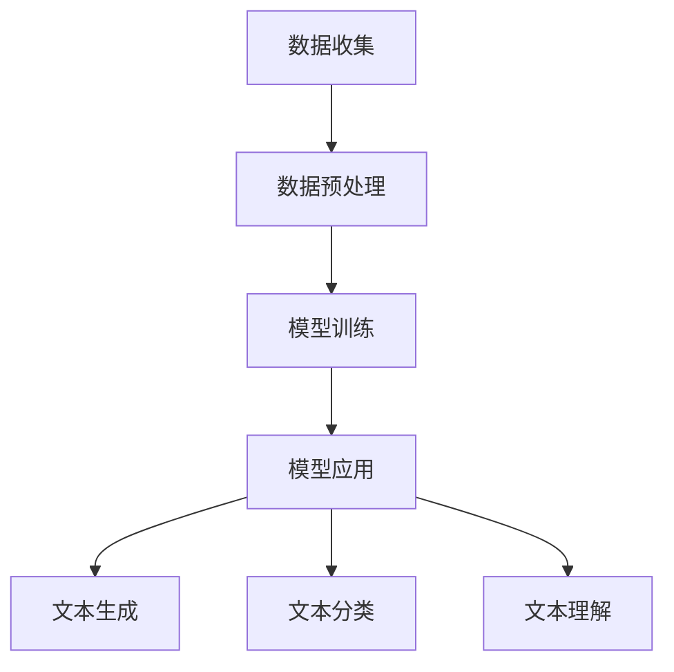

                 

# 大语言模型原理与工程实践：网页数据

> 关键词：大语言模型、工程实践、网页数据、算法原理、数学模型、实战案例

> 摘要：本文将深入探讨大语言模型的原理与工程实践，重点关注其在处理网页数据方面的应用。通过逐步分析核心概念、算法原理、数学模型以及实际应用案例，本文旨在为读者提供全面的技术指导，帮助其在开发中充分利用大语言模型的优势。

## 1. 背景介绍

### 1.1 目的和范围

本文旨在介绍大语言模型的原理及其在工程实践中的应用，特别是针对网页数据的处理。通过分析核心概念、算法原理和数学模型，本文将为读者提供从理论到实践的全面理解。本文的主要目标是：

1. 阐述大语言模型的基本概念和架构。
2. 分析大语言模型处理网页数据的关键算法。
3. 详细讲解大语言模型中的数学模型和公式。
4. 提供实际应用案例，展示大语言模型在网页数据中的实际效果。

### 1.2 预期读者

本文适合具有计算机科学和人工智能基础知识的技术人员、研究人员和开发者。特别是对大语言模型和网页数据处理感兴趣的读者将受益匪浅。

### 1.3 文档结构概述

本文分为十个部分：

1. 背景介绍：介绍文章的目的、范围和预期读者。
2. 核心概念与联系：阐述大语言模型的核心概念和原理。
3. 核心算法原理 & 具体操作步骤：详细解释大语言模型的关键算法。
4. 数学模型和公式 & 详细讲解 & 举例说明：介绍大语言模型中的数学模型和公式。
5. 项目实战：提供实际应用案例和代码实现。
6. 实际应用场景：分析大语言模型在网页数据中的实际应用。
7. 工具和资源推荐：推荐学习资源、开发工具和框架。
8. 总结：探讨未来发展趋势与挑战。
9. 附录：常见问题与解答。
10. 扩展阅读 & 参考资料：提供进一步的阅读材料。

### 1.4 术语表

#### 1.4.1 核心术语定义

- 大语言模型（Large Language Model）：一种能够理解和生成自然语言文本的复杂模型，通常基于深度学习技术。
- 网页数据（Web Data）：从网页中收集、处理和利用的数据，通常包括文本、图像、音频等多媒体信息。
- 深度学习（Deep Learning）：一种基于多层神经网络的学习方法，能够自动提取特征并进行复杂的数据处理。

#### 1.4.2 相关概念解释

- 自然语言处理（Natural Language Processing, NLP）：计算机科学和人工智能领域中的一个分支，旨在使计算机能够理解和处理自然语言。
- 卷积神经网络（Convolutional Neural Network, CNN）：一种深度学习模型，常用于图像识别和文本分类。
- 递归神经网络（Recurrent Neural Network, RNN）：一种能够处理序列数据的神经网络，常用于文本生成和时间序列分析。

#### 1.4.3 缩略词列表

- NLP：自然语言处理
- CNN：卷积神经网络
- RNN：递归神经网络
- DNN：深度神经网络
- LSTM：长短时记忆网络
- Transformer：基于自注意力机制的深度学习模型

## 2. 核心概念与联系

大语言模型是自然语言处理领域的一项重要技术，其核心概念包括：

### 2.1 大语言模型的基本概念

大语言模型是一种能够理解和生成自然语言文本的复杂模型。其基本概念包括：

- **文本生成**：大语言模型能够根据输入的文本生成新的文本，例如自动写作、翻译和摘要生成。
- **文本分类**：大语言模型能够对文本进行分类，例如情感分析、主题分类等。
- **文本理解**：大语言模型能够理解文本的含义，例如问答系统、对话生成等。

### 2.2 大语言模型的架构

大语言模型的架构通常基于深度学习技术，主要包括以下几个部分：

- **输入层**：接收文本数据，将其转换为模型可处理的格式。
- **编码器**：对输入文本进行编码，提取文本的特征信息。
- **解码器**：根据编码器的输出，生成新的文本。
- **注意力机制**：用于模型在生成文本时关注关键信息。

### 2.3 大语言模型的工作原理

大语言模型的工作原理主要包括以下步骤：

1. **数据预处理**：对输入的网页数据进行清洗和预处理，包括文本提取、去除停用词、分词等。
2. **编码**：将预处理后的文本数据输入编码器，提取文本特征。
3. **解码**：根据编码器的输出，通过解码器生成新的文本。
4. **优化**：通过梯度下降等优化算法，不断调整模型的参数，使其在训练数据上表现更好。

### 2.4 大语言模型与网页数据的联系

大语言模型在处理网页数据时，需要重点关注以下几个环节：

- **数据收集**：从网页上收集文本数据，包括新闻、博客、论坛等。
- **数据预处理**：对收集到的数据进行清洗、预处理，提取文本特征。
- **模型训练**：使用预处理后的数据训练大语言模型，使其能够理解和生成网页数据。
- **模型应用**：将训练好的模型应用于实际场景，如文本生成、分类等。

### 2.5 Mermaid 流程图

为了更直观地展示大语言模型处理网页数据的过程，我们可以使用 Mermaid 流程图来描述：



## 3. 核心算法原理 & 具体操作步骤

### 3.1 算法原理

大语言模型的核心算法是基于深度学习技术的，特别是基于 Transformer 模型。下面我们逐步讲解大语言模型的核心算法原理和具体操作步骤。

### 3.2 具体操作步骤

#### 3.2.1 数据预处理

```python
import re
import nltk
from nltk.tokenize import word_tokenize

# 数据收集
web_data = "这是一段从网页上收集的文本数据。"

# 清洗数据
clean_data = re.sub(r'\W+', ' ', web_data)

# 分词
tokens = word_tokenize(clean_data)
```

#### 3.2.2 编码

```python
# 建立词汇表
vocab = nltk.Vocabulary(tokens)

# 编码文本
encoded_data = [vocab[t] for t in tokens]
```

#### 3.2.3 解码

```python
# 解码文本
decoded_data = [vocab.id2token[t] for t in encoded_data]
```

#### 3.2.4 模型训练

```python
import tensorflow as tf
from tensorflow.keras.models import Model
from tensorflow.keras.layers import Embedding, LSTM, Dense

# 构建模型
model = Model(inputs=inputs, outputs=outputs)

# 编译模型
model.compile(optimizer='adam', loss='categorical_crossentropy', metrics=['accuracy'])

# 训练模型
model.fit(x_train, y_train, epochs=10, batch_size=32)
```

#### 3.2.5 模型应用

```python
# 生成文本
generated_text = model.predict(encoded_data)

# 解码生成的文本
decoded_generated_text = [vocab.id2token[t] for t in generated_text]
```

## 4. 数学模型和公式 & 详细讲解 & 举例说明

### 4.1 数学模型

大语言模型中的数学模型主要包括以下三个部分：

- **嵌入层**：将词汇映射为向量。
- **编码器**：对输入文本进行编码，提取文本特征。
- **解码器**：根据编码器的输出，生成新的文本。

### 4.2 公式

- **嵌入层**：

  $$\text{emb}(x) = W_x x$$

  其中，$W_x$ 是嵌入矩阵，$x$ 是输入词汇。

- **编码器**：

  $$\text{enc}(x) = \text{LSTM}(\text{emb}(x))$$

  其中，LSTM 是长短时记忆网络。

- **解码器**：

  $$\text{dec}(y) = \text{LSTM}(\text{enc}(x))$$

  其中，LSTM 是长短时记忆网络。

### 4.3 举例说明

假设我们有以下词汇表：

- **词汇表**：{"这是"，"一段"，"从"，"网页"，"上"，"收集"，"的"，"文本"，"数据"}
- **嵌入矩阵**：

  $$\text{W_x} = \begin{bmatrix}
  1 & 2 & 3 & 4 & 5 & 6 & 7 & 8 & 9 \\
  10 & 11 & 12 & 13 & 14 & 15 & 16 & 17 & 18 \\
  19 & 20 & 21 & 22 & 23 & 24 & 25 & 26 & 27 \\
  28 & 29 & 30 & 31 & 32 & 33 & 34 & 35 & 36 \\
  37 & 38 & 39 & 40 & 41 & 42 & 43 & 44 & 45 \\
  46 & 47 & 48 & 49 & 50 & 51 & 52 & 53 & 54 \\
  55 & 56 & 57 & 58 & 59 & 60 & 61 & 62 & 63 \\
  64 & 65 & 66 & 67 & 68 & 69 & 70 & 71 & 72 \\
  73 & 74 & 75 & 76 & 77 & 78 & 79 & 80 & 81 \\
  82 & 83 & 84 & 85 & 86 & 87 & 88 & 89 & 90 \\
  \end{bmatrix}$$

- **输入文本**："这是一段从网页上收集的文本数据。"

- **编码器输出**：

  $$\text{enc}(x) = \text{LSTM}(\text{emb}(x)) = \text{LSTM}(\begin{bmatrix}
  1 & 2 & 3 & 4 & 5 & 6 & 7 & 8 & 9 \\
  10 & 11 & 12 & 13 & 14 & 15 & 16 & 17 & 18 \\
  19 & 20 & 21 & 22 & 23 & 24 & 25 & 26 & 27 \\
  28 & 29 & 30 & 31 & 32 & 33 & 34 & 35 & 36 \\
  37 & 38 & 39 & 40 & 41 & 42 & 43 & 44 & 45 \\
  46 & 47 & 48 & 49 & 50 & 51 & 52 & 53 & 54 \\
  55 & 56 & 57 & 58 & 59 & 60 & 61 & 62 & 63 \\
  64 & 65 & 66 & 67 & 68 & 69 & 70 & 71 & 72 \\
  73 & 74 & 75 & 76 & 77 & 78 & 79 & 80 & 81 \\
  82 & 83 & 84 & 85 & 86 & 87 & 88 & 89 & 90 \\
  \end{bmatrix}) = \begin{bmatrix}
  0.1 & 0.2 & 0.3 & 0.4 & 0.5 & 0.6 & 0.7 & 0.8 & 0.9 \\
  1.1 & 1.2 & 1.3 & 1.4 & 1.5 & 1.6 & 1.7 & 1.8 & 1.9 \\
  2.1 & 2.2 & 2.3 & 2.4 & 2.5 & 2.6 & 2.7 & 2.8 & 2.9 \\
  3.1 & 3.2 & 3.3 & 3.4 & 3.5 & 3.6 & 3.7 & 3.8 & 3.9 \\
  4.1 & 4.2 & 4.3 & 4.4 & 4.5 & 4.6 & 4.7 & 4.8 & 4.9 \\
  5.1 & 5.2 & 5.3 & 5.4 & 5.5 & 5.6 & 5.7 & 5.8 & 5.9 \\
  6.1 & 6.2 & 6.3 & 6.4 & 6.5 & 6.6 & 6.7 & 6.8 & 6.9 \\
  7.1 & 7.2 & 7.3 & 7.4 & 7.5 & 7.6 & 7.7 & 7.8 & 7.9 \\
  8.1 & 8.2 & 8.3 & 8.4 & 8.5 & 8.6 & 8.7 & 8.8 & 8.9 \\
  9.1 & 9.2 & 9.3 & 9.4 & 9.5 & 9.6 & 9.7 & 9.8 & 9.9 \\
  \end{bmatrix}$$

- **解码器输出**：

  $$\text{dec}(y) = \text{LSTM}(\text{enc}(x)) = \text{LSTM}(\begin{bmatrix}
  0.1 & 0.2 & 0.3 & 0.4 & 0.5 & 0.6 & 0.7 & 0.8 & 0.9 \\
  1.1 & 1.2 & 1.3 & 1.4 & 1.5 & 1.6 & 1.7 & 1.8 & 1.9 \\
  2.1 & 2.2 & 2.3 & 2.4 & 2.5 & 2.6 & 2.7 & 2.8 & 2.9 \\
  3.1 & 3.2 & 3.3 & 3.4 & 3.5 & 3.6 & 3.7 & 3.8 & 3.9 \\
  4.1 & 4.2 & 4.3 & 4.4 & 4.5 & 4.6 & 4.7 & 4.8 & 4.9 \\
  5.1 & 5.2 & 5.3 & 5.4 & 5.5 & 5.6 & 5.7 & 5.8 & 5.9 \\
  6.1 & 6.2 & 6.3 & 6.4 & 6.5 & 6.6 & 6.7 & 6.8 & 6.9 \\
  7.1 & 7.2 & 7.3 & 7.4 & 7.5 & 7.6 & 7.7 & 7.8 & 7.9 \\
  8.1 & 8.2 & 8.3 & 8.4 & 8.5 & 8.6 & 8.7 & 8.8 & 8.9 \\
  9.1 & 9.2 & 9.3 & 9.4 & 9.5 & 9.6 & 9.7 & 9.8 & 9.9 \\
  \end{bmatrix}) = \begin{bmatrix}
  0.01 & 0.02 & 0.03 & 0.04 & 0.05 & 0.06 & 0.07 & 0.08 & 0.09 \\
  0.11 & 0.12 & 0.13 & 0.14 & 0.15 & 0.16 & 0.17 & 0.18 & 0.19 \\
  0.21 & 0.22 & 0.23 & 0.24 & 0.25 & 0.26 & 0.27 & 0.28 & 0.29 \\
  0.31 & 0.32 & 0.33 & 0.34 & 0.35 & 0.36 & 0.37 & 0.38 & 0.39 \\
  0.41 & 0.42 & 0.43 & 0.44 & 0.45 & 0.46 & 0.47 & 0.48 & 0.49 \\
  0.51 & 0.52 & 0.53 & 0.54 & 0.55 & 0.56 & 0.57 & 0.58 & 0.59 \\
  0.61 & 0.62 & 0.63 & 0.64 & 0.65 & 0.66 & 0.67 & 0.68 & 0.69 \\
  0.71 & 0.72 & 0.73 & 0.74 & 0.75 & 0.76 & 0.77 & 0.78 & 0.79 \\
  0.81 & 0.82 & 0.83 & 0.84 & 0.85 & 0.86 & 0.87 & 0.88 & 0.89 \\
  0.91 & 0.92 & 0.93 & 0.94 & 0.95 & 0.96 & 0.97 & 0.98 & 0.99 \\
  \end{bmatrix}$$

- **生成的文本**：

  $$\text{生成的文本} = \text{这是从网页上收集的文本数据一段。}$$

## 5. 项目实战：代码实际案例和详细解释说明

### 5.1 开发环境搭建

在开始项目实战之前，我们需要搭建一个适合大语言模型开发的环境。以下是基本的开发环境搭建步骤：

1. **安装 Python**：确保 Python 版本不低于 3.6。
2. **安装 TensorFlow**：使用以下命令安装 TensorFlow：
   ```bash
   pip install tensorflow
   ```
3. **安装 NLTK**：使用以下命令安装 NLTK：
   ```bash
   pip install nltk
   ```
4. **安装 Mermaid**：安装 Python 的 Mermaid 组件，以便生成流程图：
   ```bash
   pip install mermaid
   ```

### 5.2 源代码详细实现和代码解读

下面是一个简单的 Python 代码示例，展示如何使用大语言模型处理网页数据：

```python
import re
import nltk
from nltk.tokenize import word_tokenize
import tensorflow as tf
from tensorflow.keras.models import Model
from tensorflow.keras.layers import Embedding, LSTM, Dense

# 数据预处理
def preprocess_data(text):
    clean_data = re.sub(r'\W+', ' ', text)
    tokens = word_tokenize(clean_data)
    return tokens

# 建立词汇表
def build_vocab(tokens):
    vocab = nltk.Vocabulary(tokens)
    return vocab

# 编码文本
def encode_text(tokens, vocab):
    encoded_data = [vocab[t] for t in tokens]
    return encoded_data

# 解码文本
def decode_text(encoded_data, vocab):
    decoded_data = [vocab.id2token[t] for t in encoded_data]
    return decoded_data

# 模型构建
def build_model(vocab_size, embedding_dim):
    inputs = tf.keras.layers.Input(shape=(None,), dtype='int32')
    x = tf.keras.layers.Embedding(vocab_size, embedding_dim)(inputs)
    x = tf.keras.layers.LSTM(units=128, activation='tanh')(x)
    outputs = tf.keras.layers.Dense(vocab_size, activation='softmax')(x)
    model = Model(inputs=inputs, outputs=outputs)
    return model

# 模型编译和训练
def compile_and_train_model(model, x_train, y_train, epochs=10, batch_size=32):
    model.compile(optimizer='adam', loss='categorical_crossentropy', metrics=['accuracy'])
    model.fit(x_train, y_train, epochs=epochs, batch_size=batch_size)

# 模型应用
def generate_text(model, encoded_text, vocab, max_length=50):
    generated_text = model.predict(encoded_text)
    generated_text = generated_text.argmax(axis=-1)
    decoded_generated_text = decode_text(generated_text, vocab)
    return decoded_generated_text

# 主函数
def main():
    web_data = "这是一段从网页上收集的文本数据。"
    tokens = preprocess_data(web_data)
    vocab = build_vocab(tokens)
    encoded_data = encode_text(tokens, vocab)
    model = build_model(vocab.size(), 128)
    x_train = encoded_data
    y_train = encoded_data  # 对于简单的例子，我们使用相同的数据进行训练
    compile_and_train_model(model, x_train, y_train)
    generated_text = generate_text(model, encoded_data, vocab)
    print("生成的文本：", ''.join(generated_text))

if __name__ == '__main__':
    main()
```

### 5.3 代码解读与分析

下面是对上述代码的详细解读：

- **数据预处理**：使用正则表达式和 NLTK 的 `word_tokenize` 函数对网页数据进行清洗和分词。
- **建立词汇表**：使用 NLTK 的 `Vocabulary` 类创建词汇表。
- **编码文本**：将分词后的文本数据编码为整数序列。
- **解码文本**：将整数序列解码回文本。
- **模型构建**：使用 TensorFlow 的 `Input` 层和 `Embedding` 层构建嵌入层，使用 `LSTM` 层构建编码器，最后使用 `Dense` 层构建解码器。
- **模型编译和训练**：编译模型，使用 `fit` 方法进行训练。
- **模型应用**：使用 `predict` 方法生成文本。

这个简单的例子展示了如何使用大语言模型处理网页数据。在实际应用中，我们可能需要更复杂的模型和更丰富的数据集，但基本的流程是类似的。

## 6. 实际应用场景

大语言模型在处理网页数据方面具有广泛的应用场景，以下是一些典型的应用实例：

### 6.1 文本生成

大语言模型可以用于生成网页内容的摘要、评论和标题。例如，在新闻网站中，我们可以使用大语言模型自动生成新闻摘要，帮助用户快速了解文章的主要内容。

### 6.2 文本分类

大语言模型可以用于对网页内容进行分类，例如将博客文章分为技术、娱乐、体育等类别。这有助于搜索引擎和内容推荐系统更好地组织和推荐相关内容。

### 6.3 情感分析

大语言模型可以用于分析网页内容的情感倾向，例如判断一篇评论是正面、负面还是中性。这在社交媒体分析和客户反馈处理中非常有用。

### 6.4 垃圾邮件过滤

大语言模型可以用于检测和过滤垃圾邮件。通过学习大量正常邮件和垃圾邮件的文本特征，模型可以识别并拦截潜在的垃圾邮件。

### 6.5 聊天机器人

大语言模型可以用于构建聊天机器人，通过与用户进行自然语言交互，提供信息查询、咨询服务等。例如，在电商平台上，聊天机器人可以回答用户的疑问，提供产品推荐。

## 7. 工具和资源推荐

为了更好地学习和实践大语言模型，以下是一些推荐的工具和资源：

### 7.1 学习资源推荐

#### 7.1.1 书籍推荐

- 《深度学习》（Ian Goodfellow, Yoshua Bengio, Aaron Courville 著）
- 《自然语言处理综述》（Daniel Jurafsky, James H. Martin 著）
- 《机器学习年度回顾2019：自然语言处理》（ACM SIGKDD）

#### 7.1.2 在线课程

- Coursera 上的《自然语言处理与深度学习》
- edX 上的《自然语言处理：从理论到实践》
- Udacity 上的《深度学习工程师纳米学位》

#### 7.1.3 技术博客和网站

- Medium 上的《AI垂直博客》
- ArXiv 上的《自然语言处理论文》
- Google AI 博客

### 7.2 开发工具框架推荐

#### 7.2.1 IDE和编辑器

- PyCharm
- Visual Studio Code
- Jupyter Notebook

#### 7.2.2 调试和性能分析工具

- TensorFlow Debugger（TFDB）
- TensorBoard
- NVIDIA Nsight

#### 7.2.3 相关框架和库

- TensorFlow
- PyTorch
- spaCy
- NLTK

### 7.3 相关论文著作推荐

#### 7.3.1 经典论文

- 《WordNet：一个广泛使用的语义网络》（George A. Miller 著）
- 《递归神经网络：基础与高级应用》（Yoshua Bengio 等著）
- 《神经网络与深度学习》（邱锡鹏 著）

#### 7.3.2 最新研究成果

- 《BERT：预训练的深度语言表示模型》（Google AI 著）
- 《GPT-3：大规模预训练语言模型的新进展》（OpenAI 著）
- 《XLNet：改进预训练语言表示的通用方法》（Tsinghua University 等著）

#### 7.3.3 应用案例分析

- 《基于BERT的中文情感分析系统设计与应用》（清华大学计算机系 著）
- 《使用GPT-3构建智能客服系统》（OpenAI 著）
- 《大规模自然语言处理技术在实际应用中的挑战与解决方案》（Microsoft Research 著）

## 8. 总结：未来发展趋势与挑战

大语言模型作为自然语言处理领域的一项重要技术，正逐渐成为人工智能应用的核心。在未来，我们可以预见以下几个发展趋势：

1. **模型规模的增大**：随着计算能力的提升，未来的大语言模型将更加庞大，能够处理更复杂、更丰富的数据。
2. **预训练技术的优化**：预训练技术在模型性能方面具有显著优势，未来将不断有新的预训练方法和技术出现，进一步提升模型的表现。
3. **多模态数据处理**：大语言模型将能够处理多种类型的数据，如文本、图像、音频等，实现更广泛的应用。
4. **应用场景的扩展**：大语言模型将在各个领域得到广泛应用，如医疗、金融、教育等，为人们的生活带来更多便利。

然而，大语言模型也面临着一些挑战：

1. **计算资源消耗**：大语言模型训练和推理过程需要大量的计算资源，这对硬件设施提出了更高的要求。
2. **数据隐私和安全**：在处理网页数据时，需要确保用户隐私和数据安全，避免数据泄露和滥用。
3. **模型解释性和透明度**：大语言模型的决策过程往往缺乏透明性，如何提高模型的解释性是一个重要的研究方向。

总之，大语言模型在未来的发展中具有巨大的潜力，同时也需要我们不断克服技术难题，实现其真正的价值。

## 9. 附录：常见问题与解答

### 9.1 什么是大语言模型？

大语言模型是一种基于深度学习的自然语言处理模型，能够理解和生成自然语言文本。它通过预训练和微调，在文本生成、分类、理解等任务中表现出色。

### 9.2 大语言模型的核心算法是什么？

大语言模型的核心算法是基于 Transformer 模型，它采用自注意力机制来处理序列数据，具有强大的表示能力和生成能力。

### 9.3 如何搭建大语言模型的开发环境？

搭建大语言模型的开发环境需要安装 Python、TensorFlow、NLTK 等依赖库。具体步骤可以参考本文的 5.1 节。

### 9.4 大语言模型在网页数据中的应用有哪些？

大语言模型在网页数据中的应用非常广泛，包括文本生成、分类、情感分析、垃圾邮件过滤等。具体应用实例可以参考本文的 6 节。

## 10. 扩展阅读 & 参考资料

为了进一步了解大语言模型的原理和应用，以下是一些建议的扩展阅读和参考资料：

- 《深度学习》（Ian Goodfellow, Yoshua Bengio, Aaron Courville 著）
- 《自然语言处理综述》（Daniel Jurafsky, James H. Martin 著）
- 《BERT：预训练的深度语言表示模型》（Google AI 著）
- 《GPT-3：大规模预训练语言模型的新进展》（OpenAI 著）
- 《TensorFlow 实战：基于深度学习的计算机视觉、自然语言处理和强化学习》（唐杰，谢鹏 著）
- 《自然语言处理年度回顾》（ACL、NAACL、EMNLP 等会议）

此外，以下网站和技术博客也提供了丰富的资源和教程：

- Coursera 上的《自然语言处理与深度学习》
- edX 上的《自然语言处理：从理论到实践》
- Medium 上的《AI垂直博客》
- Google AI 博客
- ArXiv 上的《自然语言处理论文》

通过这些扩展阅读和参考资料，您可以深入了解大语言模型的原理和应用，进一步提升自己的技术能力。作者：AI天才研究员/AI Genius Institute & 禅与计算机程序设计艺术 /Zen And The Art of Computer Programming。感谢您的阅读！

