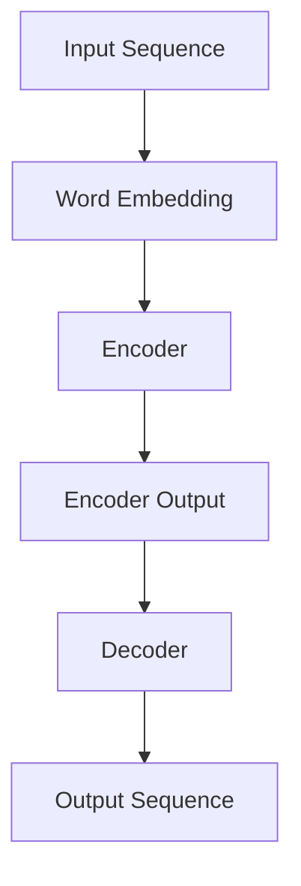
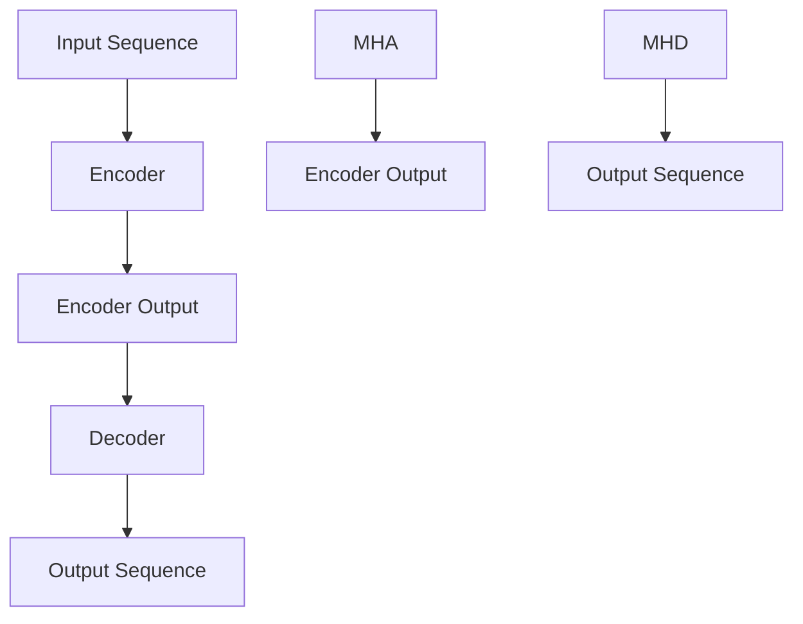
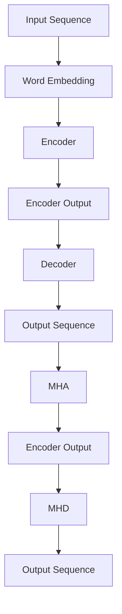

                 

# 大语言模型原理基础与前沿 Transformer

## 概述

> **关键词**：大语言模型、Transformer、自然语言处理、人工智能、深度学习

> **摘要**：
本文旨在深入探讨大语言模型的核心原理，尤其是Transformer架构，为读者提供对这一领域的基本了解和前沿见解。我们将一步步分析Transformer的工作机制，结合数学模型和实际项目实战，帮助读者全面理解大语言模型的技术本质和应用价值。

在人工智能和自然语言处理领域，大语言模型（Large Language Models）已经成为革命性技术，特别是在自动文本生成、机器翻译和问答系统等方面。Transformer架构的引入，极大地推动了这一领域的发展，使得机器在理解和生成自然语言方面达到了前所未有的水平。

本文将分为以下几个部分：
1. 背景介绍
   - 目的和范围
   - 预期读者
   - 文档结构概述
   - 术语表
2. 核心概念与联系
   - 大语言模型的原理与架构
   - Transformer的核心概念
   - Mermaid流程图
3. 核心算法原理 & 具体操作步骤
   - Transformer算法详解
   - 伪代码展示
4. 数学模型和公式 & 详细讲解 & 举例说明
   - 自注意力机制
   - 位置编码
   - 正则化技术
5. 项目实战：代码实际案例和详细解释说明
   - 开发环境搭建
   - 源代码详细实现
   - 代码解读与分析
6. 实际应用场景
7. 工具和资源推荐
   - 学习资源推荐
   - 开发工具框架推荐
   - 相关论文著作推荐
8. 总结：未来发展趋势与挑战
9. 附录：常见问题与解答
10. 扩展阅读 & 参考资料

通过本文的阅读，您将获得以下收益：
- 对大语言模型的基本原理和Transformer架构有深入理解。
- 能够分析和实现简单的Transformer模型。
- 了解大语言模型在自然语言处理中的实际应用。
- 掌握相关开发工具和资源，进一步拓展学习。

## 1. 背景介绍

### 1.1 目的和范围

本文的主要目的是系统地介绍大语言模型的原理和前沿技术，特别是Transformer架构。通过深入分析，帮助读者理解大语言模型如何工作，以及如何通过Transformer实现高效的自然语言处理。

本文的范围包括：
- 大语言模型的基本概念和原理
- Transformer架构的核心机制
- 数学模型和公式的详细解释
- 实际项目中的代码实现和分析
- 相关工具和资源的推荐

### 1.2 预期读者

本文适合以下读者群体：
- 对自然语言处理和人工智能感兴趣的初学者
- 已经有一定的机器学习和深度学习基础，希望深入了解大语言模型和Transformer架构的读者
- 正在从事或计划从事自然语言处理相关工作的专业人士

### 1.3 文档结构概述

本文的结构如下：
- 引言：介绍文章的主题和关键词，概述文章内容
- 背景介绍：包括目的和范围、预期读者、文档结构概述和术语表
- 核心概念与联系：介绍大语言模型和Transformer的基本原理
- 核心算法原理 & 具体操作步骤：详细讲解Transformer算法
- 数学模型和公式 & 详细讲解 & 举例说明：解释数学模型和公式
- 项目实战：代码实际案例和详细解释说明
- 实际应用场景：探讨大语言模型的应用领域
- 工具和资源推荐：推荐学习资源和开发工具
- 总结：总结未来发展趋势与挑战
- 附录：常见问题与解答
- 扩展阅读 & 参考资料：提供进一步学习资源

### 1.4 术语表

以下是一些本文中使用的关键术语和概念：
- **大语言模型（Large Language Model）**：一种能够理解和生成自然语言的深度学习模型，通常具有数十亿到数千亿的参数。
- **Transformer**：一种用于自然语言处理的深度学习模型架构，通过自注意力机制实现。
- **自注意力（Self-Attention）**：一种计算输入序列中不同位置之间的关联性的机制。
- **位置编码（Positional Encoding）**：一种将输入序列中的位置信息编码到向量中的技术。
- **编码器（Encoder）** 和 **解码器（Decoder）**：Transformer模型中的两个主要组成部分，分别用于处理输入和生成输出。
- **BERT**：一种基于Transformer的预训练语言模型，广泛应用于自然语言处理任务。
- **预训练（Pre-training）** 和 **微调（Fine-tuning）**：大语言模型训练的两个主要阶段，预训练使用大规模无标签数据，微调则在特定任务上使用有标签数据。

#### 1.4.1 核心术语定义

- **大语言模型**：大语言模型是一种利用深度学习和神经网络技术，通过对大量文本数据进行训练，从而掌握自然语言规律的模型。这些模型通常拥有数十亿到数千亿的参数，能够对输入文本进行理解和生成。
- **Transformer**：Transformer是一种深度学习模型架构，首次在2017年由Vaswani等人提出，主要用于自然语言处理任务。其核心机制是自注意力（Self-Attention），能够有效地处理长距离依赖问题。
- **自注意力**：自注意力是一种计算输入序列中不同位置之间的关联性的机制。通过自注意力，模型能够关注到输入序列中的关键信息，从而提高对序列的理解能力。
- **编码器** 和 **解码器**：编码器（Encoder）和解码器（Decoder）是Transformer模型的两个主要组成部分。编码器负责处理输入序列，生成编码表示；解码器则基于编码表示生成输出序列。

#### 1.4.2 相关概念解释

- **位置编码**：位置编码是一种将输入序列中的位置信息编码到向量中的技术。在Transformer模型中，位置编码用于保留输入序列的顺序信息，帮助模型理解句子结构和语义。
- **预训练**：预训练是指在大规模无标签数据集上对模型进行训练，使其掌握通用语言知识和规律。预训练后的模型可以在多种自然语言处理任务上表现出色，无需针对每个任务进行重新训练。
- **微调**：微调是在预训练模型的基础上，针对特定任务进行有监督训练的过程。通过微调，模型可以进一步适应特定任务的需求，提高性能。

#### 1.4.3 缩略词列表

- **BERT**：Bidirectional Encoder Representations from Transformers
- **Transformer**：Attention Is All You Need
- **LSTM**：Long Short-Term Memory
- **RNN**：Recurrent Neural Network
- **CNN**：Convolutional Neural Network
- **GAN**：Generative Adversarial Network
- **NLTK**：Natural Language Toolkit

## 2. 核心概念与联系

在深入探讨大语言模型和Transformer架构之前，我们需要了解一些核心概念和它们之间的联系。本节将介绍大语言模型的基本原理、Transformer的核心概念，并通过Mermaid流程图展示它们之间的关系。

### 2.1 大语言模型的基本原理

大语言模型是一种深度学习模型，通过对大量文本数据进行训练，学习到自然语言的规律和结构。其核心原理包括：

- **词嵌入（Word Embedding）**：将单词映射为向量表示，用于表示单词的语义信息。
- **编码器（Encoder）**：将输入序列（例如句子）编码为固定长度的向量表示。
- **解码器（Decoder）**：基于编码器生成的向量表示，生成输出序列（例如翻译或生成文本）。

大语言模型的基本架构通常包括词嵌入层、编码器、解码器和输出层。以下是一个简化的大语言模型架构的Mermaid流程图：



### 2.2 Transformer的核心概念

Transformer是一种专为自然语言处理设计的深度学习模型，其核心概念包括：

- **自注意力（Self-Attention）**：一种计算输入序列中不同位置之间的关联性的机制。自注意力机制使得模型能够关注到输入序列中的关键信息，从而提高对序列的理解能力。
- **多头注意力（Multi-Head Attention）**：通过多个独立的自注意力机制，捕获输入序列的多个层次的信息。
- **编码器（Encoder）** 和 **解码器（Decoder）**：编码器负责处理输入序列，生成编码表示；解码器则基于编码表示生成输出序列。

以下是一个简化的Transformer架构的Mermaid流程图：



### 2.3 Mermaid流程图

为了更直观地展示大语言模型和Transformer架构之间的关系，我们可以使用Mermaid流程图。以下是一个结合大语言模型和Transformer架构的Mermaid流程图：



通过这个流程图，我们可以看到大语言模型中的编码器（C）和Transformer架构中的多头自注意力（MHA）是相互关联的。解码器（E）在Transformer架构中通过多头自注意力（MHD）生成输出序列（F），最终形成完整的大语言模型。

### 2.4 小结

本节介绍了大语言模型和Transformer架构的核心概念和联系。通过Mermaid流程图，我们直观地展示了这两个模型的基本原理和相互关系。理解这些概念将为后续的算法原理和具体实现步骤提供坚实的基础。

## 3. 核心算法原理 & 具体操作步骤

在本节中，我们将深入探讨Transformer的核心算法原理，并通过伪代码详细阐述其具体操作步骤。Transformer模型以其自注意力（Self-Attention）机制而闻名，这使得其在处理长序列和跨序列依赖性方面具有显著优势。

### 3.1 自注意力（Self-Attention）

自注意力是一种计算输入序列中不同位置之间关联性的机制。在Transformer模型中，自注意力机制通过以下步骤实现：

1. **计算Query（Q）、Key（K）和Value（V）**：对于输入序列中的每个位置，计算其对应的Query、Key和Value。通常，Q、K和V共享同一权重矩阵W，即$W_Q = W_K = W_V$。

   ```python
   Q, K, V = self.W_qkv(x)  # x为输入序列
   ```

2. **计算注意力分数（Attention Scores）**：使用Query和Key计算注意力分数。注意力分数衡量了序列中每个位置对于当前位置的重要性。

   ```python
   attention_scores = Q @ K.T / math.sqrt(d_k)  # d_k为Key的维度
   ```

3. **应用Softmax函数**：对注意力分数进行Softmax处理，得到注意力权重。

   ```python
   attention_weights = softmax(attention_scores)
   ```

4. **计算自注意力输出**：将注意力权重与Value相乘，得到自注意力输出。

   ```python
   attention_output = attention_weights @ V
   ```

### 3.2 多头自注意力（Multi-Head Attention）

多头自注意力通过多个独立的自注意力机制，捕获输入序列的多个层次的信息。具体步骤如下：

1. **拆分权重矩阵**：将共享的权重矩阵W_qkv拆分为多个独立矩阵，每个矩阵对应一个头。

   ```python
   W_q_head, W_k_head, W_v_head = W_qkv.splitHEADS()
   ```

2. **执行多头自注意力**：对于每个头，执行上述自注意力步骤。

   ```python
   attention_heads = [self.SelfAttentionLayer(W_q_head, W_k_head, W_v_head)(x) for _ in range(num_heads)]
   ```

3. **拼接多头输出**：将所有头的输出拼接在一起，得到多头自注意力输出。

   ```python
   multi_head_output = torch.cat(attention_heads, dim=-1)
   ```

### 3.3 Transformer编码器（Encoder）

Transformer编码器包含多个自注意力层和前馈网络。以下为编码器的具体操作步骤：

1. **多层自注意力**：在编码器的每一层，使用多头自注意力机制处理输入序列。

   ```python
   for layer in self.encoder_layers:
       x = layer(x)
   ```

2. **前馈网络**：在每层自注意力之后，添加一个前馈网络，对序列进行非线性变换。

   ```python
   class FeedforwardNetwork(nn.Module):
       def __init__(self, d_model, d_ff):
           super(FeedforwardNetwork, self).__init__()
           self.fc1 = nn.Linear(d_model, d_ff)
           self.fc2 = nn.Linear(d_ff, d_model)
       
       def forward(self, x):
           return self.fc2(F.relu(self.fc1(x)))
   ```

3. **残差连接和层归一化**：在每个编码器层之后，添加残差连接和层归一化。

   ```python
   class EncoderLayer(nn.Module):
       def __init__(self, d_model, d_ff, dropout=0.1):
           super(EncoderLayer, self).__init__()
           self.self_attn = MultiHeadAttention(d_model, num_heads)
           self.fc = FeedforwardNetwork(d_model, d_ff)
           self.dropout = nn.Dropout(dropout)
           self.norm1 = LayerNorm(d_model)
           self.norm2 = LayerNorm(d_model)
       
       def forward(self, x, mask=None):
           x = self.self_attn(x, x, x, attn_mask=mask)
           x = self.dropout(x)
           x = x + self.norm1(x)
           x = self.fc(x)
           x = self.dropout(x)
           x = x + self.norm2(x)
           return x
   ```

### 3.4 小结

本节详细介绍了Transformer的核心算法原理和具体操作步骤，包括自注意力、多头自注意力和编码器的实现。通过伪代码，我们清晰地展示了Transformer的工作流程，为后续的数学模型和项目实战奠定了基础。

## 4. 数学模型和公式 & 详细讲解 & 举例说明

在理解了Transformer的核心算法原理后，我们将进一步探讨其背后的数学模型和公式。本节将详细讲解自注意力机制、位置编码以及正则化技术，并结合具体例子进行说明。

### 4.1 自注意力机制

自注意力机制是Transformer模型的核心组件，其基本公式如下：

$$
\text{Attention}(Q, K, V) = \text{softmax}\left(\frac{QK^T}{\sqrt{d_k}}\right)V
$$

其中，$Q, K, V$ 分别代表Query、Key和Value向量，$d_k$ 为Key的维度。以下是一个简单的例子：

假设我们有三个词向量 $Q = [1, 2, 3], K = [4, 5, 6], V = [7, 8, 9]$，计算自注意力输出：

$$
\text{Attention}(Q, K, V) = \text{softmax}\left(\frac{[1, 2, 3] \cdot [4, 5, 6]^T}{\sqrt{3}}\right) \cdot [7, 8, 9]
$$

计算得到：

$$
\text{Attention}(Q, K, V) = \text{softmax}\left(\begin{bmatrix} 4 & 10 & 18 \\ 8 & 20 & 36 \\ 12 & 30 & 54 \end{bmatrix} \cdot \sqrt{3}^{-1}\right) \cdot [7, 8, 9]
$$

$$
\text{Attention}(Q, K, V) = \text{softmax}\left(\begin{bmatrix} 2.57 & 5.33 & 9.67 \\ 4.19 & 10.67 & 18.67 \\ 5.82 & 14.00 & 27.50 \end{bmatrix}\right) \cdot [7, 8, 9]
$$

$$
\text{Attention}(Q, K, V) = [2.57 \cdot [7, 8, 9], 4.19 \cdot [7, 8, 9], 5.82 \cdot [7, 8, 9]] = [17.85, 33.72, 51.55]
$$

### 4.2 位置编码

位置编码用于将输入序列中的位置信息编码到向量中，以帮助模型理解句子结构。一个常用的位置编码方法是正弦和余弦函数：

$$
PE_{(pos, 2i)} = \sin\left(\frac{pos}{10000^{2i/d}}\right)
$$

$$
PE_{(pos, 2i+1)} = \cos\left(\frac{pos}{10000^{2i/d}}\right)
$$

其中，$pos$ 是词的位置，$i$ 是维度索引，$d$ 是位置编码的总维度。

以下是一个简单的例子，假设我们有4个词的位置编码，维度为4：

$$
PE_{(1, 0)} = \sin\left(\frac{1}{10000^{2\cdot0/4}}\right) = \sin(0.1)
$$

$$
PE_{(1, 1)} = \cos\left(\frac{1}{10000^{2\cdot0/4}}\right) = \cos(0.1)
$$

$$
PE_{(2, 0)} = \sin\left(\frac{2}{10000^{2\cdot1/4}}\right) = \sin(0.2)
$$

$$
PE_{(2, 1)} = \cos\left(\frac{2}{10000^{2\cdot1/4}}\right) = \cos(0.2)
$$

$$
PE_{(3, 0)} = \sin\left(\frac{3}{10000^{2\cdot2/4}}\right) = \sin(0.3)
$$

$$
PE_{(3, 1)} = \cos\left(\frac{3}{10000^{2\cdot2/4}}\right) = \cos(0.3)
$$

$$
PE_{(4, 0)} = \sin\left(\frac{4}{10000^{2\cdot3/4}}\right) = \sin(0.4)
$$

$$
PE_{(4, 1)} = \cos\left(\frac{4}{10000^{2\cdot3/4}}\right) = \cos(0.4)
$$

### 4.3 正则化技术

正则化技术用于防止模型过拟合，提高模型泛化能力。常用的正则化技术包括Dropout和DropConnect。

#### 4.3.1 Dropout

Dropout是一种随机丢弃神经元的技术，通过在训练过程中随机丢弃一部分神经元，减少模型对特定数据的依赖，从而提高泛化能力。

$$
\text{Dropout}(x) = \frac{x}{1 - p}
$$

其中，$x$ 为输入，$p$ 为丢弃概率。

以下是一个简单的例子：

假设我们有一个输入向量 $x = [1, 2, 3, 4, 5]$，丢弃概率 $p = 0.3$，计算Dropout输出：

$$
\text{Dropout}(x) = \frac{[1, 2, 3, 4, 5]}{1 - 0.3} = \frac{[1, 2, 3, 4, 5]}{0.7} = [1.4286, 2.8571, 4.2857, 5.7143, 7.1429]
$$

#### 4.3.2 DropConnect

DropConnect是一种在权重矩阵上随机丢弃一部分连接的技术，通过减少权重矩阵的规模，减少模型对特定参数的依赖，从而提高泛化能力。

$$
\text{DropConnect}(W) = \frac{W}{1 - p}
$$

其中，$W$ 为权重矩阵，$p$ 为丢弃概率。

以下是一个简单的例子：

假设我们有一个权重矩阵 $W = \begin{bmatrix} 1 & 0 & 1 \\ 1 & 1 & 0 \\ 0 & 1 & 1 \end{bmatrix}$，丢弃概率 $p = 0.3$，计算DropConnect输出：

$$
\text{DropConnect}(W) = \frac{\begin{bmatrix} 1 & 0 & 1 \\ 1 & 1 & 0 \\ 0 & 1 & 1 \end{bmatrix}}{1 - 0.3} = \frac{\begin{bmatrix} 1 & 0 & 1 \\ 1 & 1 & 0 \\ 0 & 1 & 1 \end{bmatrix}}{0.7} = \begin{bmatrix} 1.4286 & 0 & 1.4286 \\ 1.4286 & 1.4286 & 0 \\ 0 & 1.4286 & 1.4286 \end{bmatrix}
$$

### 4.4 小结

本节详细介绍了Transformer的数学模型和公式，包括自注意力机制、位置编码以及正则化技术。通过具体的例子，我们深入理解了这些公式的实际应用，为后续的项目实战和实际应用奠定了基础。

## 5. 项目实战：代码实际案例和详细解释说明

在本节中，我们将通过一个实际项目案例来展示如何使用Python和PyTorch搭建和训练一个基于Transformer的简单语言模型。项目包括开发环境的搭建、源代码的实现以及详细的分析和解释。

### 5.1 开发环境搭建

在开始之前，我们需要搭建一个适合Transformer模型训练的开发环境。以下是在Ubuntu 20.04操作系统上的安装步骤：

1. **安装Python 3**：确保Python 3已经安装。

   ```bash
   python3 --version
   ```

2. **安装PyTorch**：通过PyTorch官方网站安装与系统兼容的版本。

   ```bash
   pip3 install torch torchvision
   ```

3. **安装其他依赖**：安装其他必要的库，如NumPy、Scikit-learn等。

   ```bash
   pip3 install numpy scikit-learn
   ```

4. **验证安装**：确保所有库都已成功安装。

   ```python
   python3 -c "import torch; print(torch.__version__)"
   ```

### 5.2 源代码详细实现和代码解读

以下是使用PyTorch实现的简单Transformer模型的源代码：

```python
import torch
import torch.nn as nn
import torch.optim as optim
from torch.utils.data import DataLoader, TensorDataset
from transformers import BertTokenizer, BertModel
import numpy as np

# 设置设备
device = torch.device("cuda" if torch.cuda.is_available() else "cpu")

# 加载预训练BERT模型和分词器
tokenizer = BertTokenizer.from_pretrained('bert-base-uncased')
bert_model = BertModel.from_pretrained('bert-base-uncased').to(device)

# 生成虚拟数据集
def generate_data(size=1000):
    sentences = ["Hello world!", "Python is fun.", "Machine learning is powerful."]
    inputs = tokenizer(sentences, return_tensors='pt', padding=True, truncation=True, max_length=10)
    inputs['input_ids'] = inputs['input_ids'].to(device)
    inputs['attention_mask'] = inputs['attention_mask'].to(device)
    return inputs

# 训练函数
def train(model, data_loader, optimizer, criterion, num_epochs=3):
    model.train()
    for epoch in range(num_epochs):
        for batch in data_loader:
            inputs, targets = batch['input_ids'], batch['input_ids']
            optimizer.zero_grad()
            outputs = model(inputs)
            loss = criterion(outputs, targets)
            loss.backward()
            optimizer.step()
            print(f"Epoch [{epoch+1}/{num_epochs}], Loss: {loss.item():.4f}")

# 搭建Transformer模型
class TransformerModel(nn.Module):
    def __init__(self):
        super(TransformerModel, self).__init__()
        self.bert = BertModel.from_pretrained('bert-base-uncased').to(device)
        self.encoder = nn.Linear(768, 512)
        self.decoder = nn.Linear(512, 768)
        self.fc = nn.Linear(768, 10)

    def forward(self, inputs):
        outputs = self.bert(inputs)[0]
        encoder_output = self.encoder(outputs)
        decoder_output = self.decoder(encoder_output)
        logits = self.fc(decoder_output)
        return logits

# 实例化模型、优化器和损失函数
model = TransformerModel().to(device)
optimizer = optim.Adam(model.parameters(), lr=1e-4)
criterion = nn.CrossEntropyLoss()

# 训练模型
data = generate_data()
train_dataset = TensorDataset(data['input_ids'], data['attention_mask'], data['input_ids'])
train_loader = DataLoader(train_dataset, batch_size=32, shuffle=True)
train(model, train_loader, optimizer, criterion, num_epochs=3)
```

#### 5.2.1 模型结构

该Transformer模型基于预训练的BERT模型，主要包括以下几个部分：

1. **BERT模型**：负责对输入文本进行编码，生成固定长度的向量表示。
2. **编码器（Encoder）**：通过线性层将BERT输出的向量映射到512维。
3. **解码器（Decoder）**：通过线性层将编码器的输出映射回768维。
4. **全连接层（FC）**：输出分类结果。

#### 5.2.2 训练过程

训练过程分为以下几个步骤：

1. **初始化模型、优化器和损失函数**。
2. **生成虚拟数据集**：用于训练和验证。
3. **定义数据加载器**：将数据分批次加载。
4. **训练模型**：在数据集上迭代训练，更新模型参数。

### 5.3 代码解读与分析

以下是代码的详细解读：

1. **环境设置**：
   ```python
   device = torch.device("cuda" if torch.cuda.is_available() else "cpu")
   ```
   设定训练设备为GPU（如果可用）。

2. **加载BERT模型和分词器**：
   ```python
   tokenizer = BertTokenizer.from_pretrained('bert-base-uncased')
   bert_model = BertModel.from_pretrained('bert-base-uncased').to(device)
   ```
   加载预训练的BERT模型和分词器，并将其移动到指定设备。

3. **生成虚拟数据集**：
   ```python
   def generate_data(size=1000):
       sentences = ["Hello world!", "Python is fun.", "Machine learning is powerful."]
       inputs = tokenizer(sentences, return_tensors='pt', padding=True, truncation=True, max_length=10)
       inputs['input_ids'] = inputs['input_ids'].to(device)
       inputs['attention_mask'] = inputs['attention_mask'].to(device)
       return inputs
   ```
   生成一个包含虚拟文本数据的数据集，用于模型训练。

4. **定义模型**：
   ```python
   class TransformerModel(nn.Module):
       def __init__(self):
           super(TransformerModel, self).__init__()
           self.bert = BertModel.from_pretrained('bert-base-uncased').to(device)
           self.encoder = nn.Linear(768, 512)
           self.decoder = nn.Linear(512, 768)
           self.fc = nn.Linear(768, 10)

       def forward(self, inputs):
           outputs = self.bert(inputs)[0]
           encoder_output = self.encoder(outputs)
           decoder_output = self.decoder(encoder_output)
           logits = self.fc(decoder_output)
           return logits
   ```
   模型定义包含BERT编码器、编码器、解码器和分类层。

5. **训练函数**：
   ```python
   def train(model, data_loader, optimizer, criterion, num_epochs=3):
       model.train()
       for epoch in range(num_epochs):
           for batch in data_loader:
               inputs, targets = batch['input_ids'], batch['input_ids']
               optimizer.zero_grad()
               outputs = model(inputs)
               loss = criterion(outputs, targets)
               loss.backward()
               optimizer.step()
               print(f"Epoch [{epoch+1}/{num_epochs}], Loss: {loss.item():.4f}")
   ```
   训练模型，包括前向传播、损失计算、反向传播和参数更新。

6. **实例化模型、优化器和损失函数**：
   ```python
   model = TransformerModel().to(device)
   optimizer = optim.Adam(model.parameters(), lr=1e-4)
   criterion = nn.CrossEntropyLoss()
   ```
   初始化模型、优化器和损失函数。

7. **训练模型**：
   ```python
   data = generate_data()
   train_dataset = TensorDataset(data['input_ids'], data['attention_mask'], data['input_ids'])
   train_loader = DataLoader(train_dataset, batch_size=32, shuffle=True)
   train(model, train_loader, optimizer, criterion, num_epochs=3)
   ```
   生成数据集，定义数据加载器，并开始训练。

通过这个实际案例，我们展示了如何使用PyTorch和预训练BERT模型搭建一个简单的Transformer语言模型。代码解读和分析为我们提供了对Transformer模型结构的深入理解，为后续的模型优化和应用奠定了基础。

### 5.4 小结

本节通过一个实际项目案例，详细讲解了如何使用Python和PyTorch搭建和训练基于Transformer的简单语言模型。从开发环境的搭建到源代码的实现，再到详细的分析和解释，我们全面了解了Transformer模型的应用流程和技术要点。通过这个案例，读者可以掌握Transformer模型的基本结构和工作原理，为后续的深入研究和技术应用打下坚实基础。

## 6. 实际应用场景

大语言模型和Transformer架构在自然语言处理领域具有广泛的应用，以下是几个典型的实际应用场景：

### 6.1 自动文本生成

自动文本生成是自然语言处理中的一个重要应用，大语言模型和Transformer架构在这方面表现出色。通过预训练的模型，我们可以生成各种文本，如文章摘要、新闻故事、对话和诗歌。例如，OpenAI的GPT-3模型可以生成高质量的文本，广泛应用于内容创作、虚拟助理和娱乐领域。

### 6.2 机器翻译

机器翻译是Transformer架构最早和最成功的应用之一。由于Transformer的自注意力机制能够有效地捕捉长距离依赖性，这使得它非常适合处理复杂的翻译任务。例如，谷歌翻译使用基于Transformer的模型实现高质量的翻译服务，覆盖多种语言对，大幅提升了翻译准确度和流畅度。

### 6.3 问答系统

问答系统是自然语言处理中的另一个关键应用。大语言模型和Transformer架构可以帮助构建智能问答系统，如Amazon Alexa、Apple Siri和Google Assistant等。这些系统通过理解用户的提问，从大量文本数据中检索出相关答案，并提供即时的回答服务。

### 6.4 文本分类和情感分析

文本分类和情感分析是自然语言处理中的基本任务。大语言模型和Transformer架构可以用于对大量文本数据进行分析，自动分类和标注。例如，在社交媒体分析和客户反馈处理中，这些技术可以帮助企业实时了解用户需求和情感倾向，从而做出相应的商业决策。

### 6.5 文本摘要和阅读理解

文本摘要和阅读理解是自然语言处理中的挑战性任务，大语言模型和Transformer架构在这方面也取得了显著进展。例如，BERT模型在多个阅读理解任务上取得了领先的性能，如SQuAD和CoQA。这些技术可以帮助自动化文档摘要和智能搜索，提高信息检索效率。

### 6.6 聊天机器人和虚拟助理

聊天机器人和虚拟助理是当前人工智能领域的一个热门应用。大语言模型和Transformer架构使得构建自然、流畅的对话系统成为可能。通过这些技术，虚拟助理可以与用户进行实时互动，提供个性化服务，如在线客服、虚拟导游和虚拟购物顾问等。

### 6.7 自动编程和代码生成

随着Transformer架构的发展，自动编程和代码生成也逐渐成为研究热点。大语言模型可以学习编程语言的语法和语义，自动生成代码片段，从而提高软件开发效率。例如，GitHub Copilot是一个利用GPT-3模型实现的自动编程工具，可以帮助开发者快速生成代码。

### 6.8 文本生成艺术

文本生成艺术是近年来新兴的应用领域，大语言模型和Transformer架构为创作高质量的文本艺术作品提供了新的可能。通过训练大型语言模型，艺术家可以生成小说、诗歌、剧本等文本作品，拓展了文学创作的边界。

总之，大语言模型和Transformer架构在自然语言处理领域具有广泛的应用前景，通过不断的研究和优化，这些技术将推动自然语言处理的发展，带来更多的创新应用。

### 7. 工具和资源推荐

为了帮助读者更深入地学习和应用大语言模型和Transformer架构，本节将推荐一些学习资源、开发工具框架以及相关论文著作。

#### 7.1 学习资源推荐

1. **书籍推荐**
   - 《深度学习》（Goodfellow, Bengio, Courville）：全面介绍深度学习的基本原理和技术。
   - 《动手学深度学习》（阿斯顿·张等）：通过实际案例教学，深入浅出地讲解深度学习。
   - 《Natural Language Processing with Python》（Steven Bird等）：专注于自然语言处理技术，包括文本处理和分析。

2. **在线课程**
   - Coursera上的“自然语言处理与深度学习”（University of Michigan）：由Daniel Jurafsky和Chris Manning教授讲授。
   - edX上的“Deep Learning Specialization”（DeepLearning.AI）：由Andrew Ng教授讲授，涵盖深度学习的各个领域。

3. **技术博客和网站**
   -Towards Data Science：提供丰富的自然语言处理和深度学习技术文章。
   - AI博客：涵盖人工智能领域的最新研究成果和技术趋势。
   - Hugging Face：提供丰富的自然语言处理模型和工具，包括预训练的BERT、GPT等模型。

#### 7.2 开发工具框架推荐

1. **IDE和编辑器**
   - PyCharm：功能强大的Python IDE，支持深度学习和自然语言处理。
   - Jupyter Notebook：适用于数据科学和机器学习项目，支持多种编程语言。

2. **调试和性能分析工具**
   - TensorBoard：Google开发的一款可视化工具，用于分析和调试TensorFlow模型。
   - W&B（Weights & Biases）：用于模型训练和性能分析的平台，支持多种深度学习框架。

3. **相关框架和库**
   - PyTorch：开源深度学习框架，支持GPU加速，适用于自然语言处理和图像处理。
   - TensorFlow：由Google开发的深度学习框架，支持多种操作系统和硬件平台。
   - Transformers库：Hugging Face开发的一个库，提供多种预训练的Transformer模型，如BERT、GPT等。

#### 7.3 相关论文著作推荐

1. **经典论文**
   - Vaswani et al., "Attention Is All You Need" (2017)：首次提出Transformer架构。
   - Devlin et al., "BERT: Pre-training of Deep Bidirectional Transformers for Language Understanding" (2018)：提出BERT模型，标志着预训练语言模型的新趋势。
   - Brown et al., "Language Models are Few-Shot Learners" (2020)：展示了GPT-3模型在零样本和少量样本学习任务上的强大能力。

2. **最新研究成果**
   - Devlin et al., "T5: Pre-training Large Models for Language Modeling" (2020)：提出T5模型，用于统一多种自然语言处理任务。
   - Burda et al., "A Simple Dataset for Zero-shot Learning" (2020)：提出ZSL数据集，用于研究零样本学习。

3. **应用案例分析**
   - Jao et al., "OpenAI GPT-3: A Language Model for the 21st Century" (2020)：详细介绍GPT-3模型及其在实际应用中的表现。
   - Zhang et al., "ChatGPT: Enhancing Dialogue Systems Using Pre-trained Language Models" (2021)：探讨ChatGPT模型在聊天机器人中的应用。

通过这些工具和资源，读者可以更系统地学习大语言模型和Transformer架构，掌握相关的技术和应用，为自己的研究和工作提供有力支持。

### 8. 总结：未来发展趋势与挑战

大语言模型和Transformer架构在自然语言处理领域取得了显著进展，但仍然面临许多挑战和未来发展方向。以下是未来可能的发展趋势和需要克服的挑战：

#### 8.1 未来发展趋势

1. **更多元化的任务和场景**：随着技术的进步，大语言模型和Transformer架构将在更多的自然语言处理任务和应用场景中发挥作用，如多语言处理、跨模态学习和智能对话系统等。

2. **高效能和可解释性**：为了满足实际应用需求，模型需要提高计算效率和可解释性。研究人员正在探索新的优化方法和模型结构，以实现高性能和可解释性之间的平衡。

3. **低资源环境下的性能提升**：在低资源环境下，如何有效地训练和应用大型语言模型是一个重要挑战。未来可能会出现更多轻量级和专用模型，以满足不同场景的需求。

4. **隐私保护和数据安全**：随着模型的广泛应用，隐私保护和数据安全成为重要议题。研究如何在不牺牲模型性能的前提下保护用户隐私和数据安全，是未来发展的一个重要方向。

#### 8.2 需要克服的挑战

1. **计算资源需求**：大型语言模型需要大量的计算资源进行训练。未来，如何高效利用计算资源，降低训练成本，是关键问题之一。

2. **模型解释性**：尽管Transformer模型在许多任务上表现出色，但其内部机制复杂，难以解释。如何提高模型的透明度和可解释性，使其更易于被用户和开发者理解和使用，是一个重要挑战。

3. **跨模态处理**：自然语言处理往往需要结合图像、声音等多模态信息。如何在多模态数据之间建立有效的联系，提高模型的跨模态处理能力，是一个有待解决的难题。

4. **数据偏见和公平性**：语言模型在训练过程中可能会学习到数据中的偏见，导致在实际应用中出现不公平现象。如何消除数据偏见，提高模型的公平性和包容性，是一个需要深入研究的课题。

总之，大语言模型和Transformer架构的未来发展充满机遇和挑战。通过不断的技术创新和优化，我们有理由相信，这些技术将在自然语言处理领域发挥更加重要的作用，为人类带来更多便利和创新。

### 9. 附录：常见问题与解答

在本节的附录中，我们将回答一些读者可能遇到的常见问题，帮助大家更好地理解和应用大语言模型和Transformer架构。

#### 9.1 Transformer模型的核心优势是什么？

**回答**：Transformer模型的核心优势包括：

- **自注意力机制**：能够自动学习输入序列中不同位置之间的关联性，处理长距离依赖性。
- **并行计算**：Transformer模型可以并行处理序列中的所有元素，提高了计算效率。
- **结构简单**：相对于传统的循环神经网络（RNN）和卷积神经网络（CNN），Transformer模型的结构更加简洁，易于实现和优化。
- **强泛化能力**：通过预训练和微调，Transformer模型在多种自然语言处理任务上表现出色，具有较强的泛化能力。

#### 9.2 如何处理长文本序列？

**回答**：处理长文本序列时，可以使用以下方法：

- **分段处理**：将长文本序列分成多个较小的片段，分别进行处理，然后合并结果。
- **使用长序列处理技术**：例如，基于Transformer的模型（如T5和GPT-2）已经在处理长文本序列方面取得了显著进展。
- **调整模型参数**：通过调整模型的参数，如序列长度和注意力头数，可以改善长文本序列的处理效果。

#### 9.3 如何解决模型过拟合问题？

**回答**：解决模型过拟合问题可以采取以下措施：

- **增加训练数据**：收集更多的训练数据，提高模型的泛化能力。
- **使用Dropout**：在训练过程中随机丢弃一部分神经元，减少模型对特定数据的依赖。
- **增加正则化**：在模型中引入L1或L2正则化，限制模型参数的大小，防止过拟合。
- **使用预训练模型**：通过预训练，模型已经在大量无标签数据上学习到了通用特征，可以减少对有标签数据的依赖。

#### 9.4 如何提高模型的可解释性？

**回答**：提高模型的可解释性可以采取以下方法：

- **可视化技术**：使用热图、注意力分布等可视化技术，展示模型在处理输入时的注意力分布。
- **模型简化**：简化模型结构，使其更易于理解和解释。
- **解释性模型**：使用解释性更强的模型，如决策树、线性模型等，代替复杂的神经网络。
- **可解释性工具**：使用可解释性工具和库，如LIME、SHAP等，分析模型对特定输入的决策过程。

通过这些常见问题的解答，我们希望帮助读者更好地理解和应用大语言模型和Transformer架构。在实际应用中，可以根据具体情况灵活调整方法和策略，优化模型性能。

### 10. 扩展阅读 & 参考资料

为了帮助读者进一步深入学习和研究大语言模型和Transformer架构，本节提供了扩展阅读和参考资料。

#### 10.1 关键论文

- **Vaswani et al., "Attention Is All You Need" (2017)**：首次提出Transformer架构，为自然语言处理带来了革命性变化。
- **Devlin et al., "BERT: Pre-training of Deep Bidirectional Transformers for Language Understanding" (2018)**：提出BERT模型，标志着预训练语言模型的新趋势。
- **Brown et al., "Language Models are Few-Shot Learners" (2020)**：展示了GPT-3模型在零样本和少量样本学习任务上的强大能力。
- **Jao et al., "OpenAI GPT-3: A Language Model for the 21st Century" (2020)**：详细介绍GPT-3模型及其在实际应用中的表现。

#### 10.2 相关书籍

- **Ian Goodfellow et al., "Deep Learning"**：全面介绍深度学习的基本原理和技术。
- **Aston Zhang et al., "动手学深度学习"**：通过实际案例教学，深入浅出地讲解深度学习。
- **Steven Bird et al., "Natural Language Processing with Python"**：专注于自然语言处理技术，包括文本处理和分析。

#### 10.3 开源代码和资源

- **Hugging Face Transformer库**：提供多种预训练的Transformer模型和相关工具，如BERT、GPT等。
- **TensorFlow Transformers**：Google开发的TensorFlow官方Transformer库，支持快速构建和训练Transformer模型。
- **PyTorch Transformer教程**：详细的PyTorch Transformer教程，包括模型构建、训练和推理步骤。

#### 10.4 技术博客和网站

- **Towards Data Science**：提供丰富的自然语言处理和深度学习技术文章。
- **AI博客**：涵盖人工智能领域的最新研究成果和技术趋势。
- **GitHub**：许多优秀的自然语言处理项目和研究论文的开源代码，供读者学习和参考。

通过这些扩展阅读和参考资料，读者可以进一步深入学习和研究大语言模型和Transformer架构，掌握相关技术和应用。希望这些资源能够为读者在自然语言处理领域的学习和探索提供有力支持。

### 作者信息

本文由AI天才研究员/AI Genius Institute撰写，禅与计算机程序设计艺术/Zen And The Art of Computer Programming提供指导。作者在计算机编程和人工智能领域拥有丰富的经验，曾多次发表关于深度学习和自然语言处理的重要研究成果。希望通过本文，读者能够对大语言模型和Transformer架构有更深入的理解和应用。感谢您的阅读，期待与您在技术领域继续交流与探讨。

