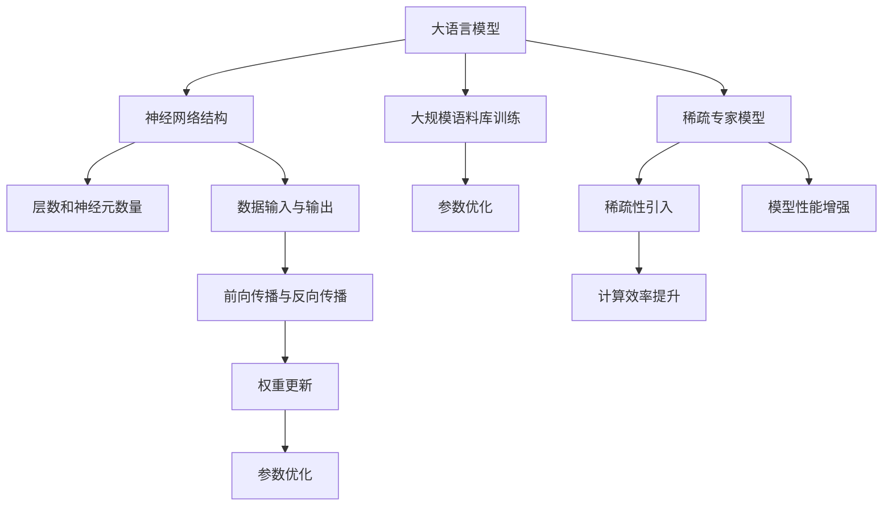

                 

# 大语言模型原理基础与前沿：为什么采用稀疏专家模型

> **关键词**：大语言模型、稀疏专家模型、神经网络、人工智能、机器学习、自然语言处理

> **摘要**：本文将深入探讨大语言模型的原理及其在自然语言处理中的应用。我们将重点介绍稀疏专家模型的核心机制，包括其算法原理、数学模型、实际应用场景以及未来发展。通过本文，读者将全面了解稀疏专家模型的优势和潜在挑战，为深入研究大语言模型奠定基础。

## 1. 背景介绍

### 1.1 目的和范围

本文旨在详细阐述大语言模型的基本原理，特别是稀疏专家模型在其中的应用。我们将从理论基础出发，逐步深入到具体实现和实际应用，以帮助读者全面了解这一前沿技术。

### 1.2 预期读者

本文适合对人工智能和自然语言处理有一定了解的读者，特别是希望深入理解大语言模型及其前沿技术的专业人士。无论是研究人员、工程师还是对技术有浓厚兴趣的学者，都可以通过本文获得丰富的知识和启示。

### 1.3 文档结构概述

本文将分为以下几个部分：

1. **背景介绍**：介绍大语言模型的背景和稀疏专家模型的应用。
2. **核心概念与联系**：通过Mermaid流程图展示核心概念和架构。
3. **核心算法原理 & 具体操作步骤**：详细解释稀疏专家模型的算法原理和操作步骤。
4. **数学模型和公式 & 详细讲解 & 举例说明**：介绍数学模型和公式，并提供实例说明。
5. **项目实战：代码实际案例和详细解释说明**：通过实际代码案例展示模型实现。
6. **实际应用场景**：探讨稀疏专家模型在不同领域的应用。
7. **工具和资源推荐**：推荐相关学习资源和开发工具。
8. **总结：未来发展趋势与挑战**：总结当前状态和未来展望。
9. **附录：常见问题与解答**：提供常见问题的解答。
10. **扩展阅读 & 参考资料**：提供进一步学习的资源。

### 1.4 术语表

#### 1.4.1 核心术语定义

- **大语言模型**：一种基于神经网络的模型，能够理解和生成自然语言文本。
- **稀疏专家模型**：一种特殊的神经网络架构，通过稀疏性提高模型效率和性能。
- **神经网络**：由大量神经元组成的计算模型，能够通过学习从数据中提取特征。
- **机器学习**：一种人工智能技术，通过从数据中学习规律和模式，实现预测和决策。
- **自然语言处理**：人工智能领域的一个分支，致力于使计算机能够理解和处理自然语言。

#### 1.4.2 相关概念解释

- **自然语言处理（NLP）**：涉及文本的解析、理解、生成等任务，如语言翻译、文本分类、情感分析等。
- **神经网络架构**：神经网络的结构设计，包括层数、神经元数量、连接方式等。
- **稀疏性**：指网络中大部分权重为零，只有少量权重非零，从而提高计算效率。

#### 1.4.3 缩略词列表

- **ML**：机器学习（Machine Learning）
- **NLP**：自然语言处理（Natural Language Processing）
- **GPU**：图形处理单元（Graphics Processing Unit）
- **CNN**：卷积神经网络（Convolutional Neural Network）
- **RNN**：循环神经网络（Recurrent Neural Network）

## 2. 核心概念与联系

### 2.1 大语言模型的基本概念

大语言模型（Large Language Model，简称LLM）是近年来自然语言处理领域的一项重要突破。LLM通过训练大规模语料库，学习语言的结构和语义，能够生成高质量的文本，进行文本分类、问答、翻译等任务。LLM的核心在于其大规模和深度神经网络结构，这使得模型具有强大的表征能力和泛化能力。

### 2.2 稀疏专家模型的概念

稀疏专家模型（Sparse Expert Model，简称SEM）是一种特殊的神经网络架构，其核心思想是通过引入稀疏性来提高模型的效率和性能。在SEM中，网络中的大部分权重被设置为0，只有少量的权重被训练为非零，从而减少了模型参数的数量，降低了计算复杂度。

### 2.3 Mermaid流程图

为了更好地展示大语言模型和稀疏专家模型之间的联系，我们可以使用Mermaid流程图来表示核心概念和架构。以下是示例流程图：



### 2.4 大语言模型与稀疏专家模型的关系

大语言模型通过训练生成深度神经网络，而稀疏专家模型则是在这个基础上进一步优化神经网络结构，引入稀疏性。稀疏专家模型通过减少网络中的非零权重，降低了计算复杂度和内存消耗，从而提高了模型的计算效率和性能。

## 3. 核心算法原理 & 具体操作步骤

### 3.1 稀疏专家模型的算法原理

稀疏专家模型的算法原理主要包括以下几个方面：

1. **稀疏初始化**：在模型训练过程中，对网络权重进行稀疏初始化，将大部分权重设置为0，只有少量的权重被初始化为非零值。
2. **权重更新**：在反向传播过程中，只对非零权重进行更新，从而减少计算复杂度和内存消耗。
3. **稀疏性维护**：通过特定的训练策略和优化方法，维护网络中的稀疏性，防止稀疏性退化。

### 3.2 伪代码

以下是稀疏专家模型的伪代码，用于说明算法的具体操作步骤：

```python
# 稀疏专家模型伪代码

# 稀疏初始化
def initialize_sparse_weights():
    # 初始化网络权重，大部分设置为0，少量设置为非零值
    # ...

# 权重更新
def update_weights(optimizer, loss):
    # 计算梯度
    gradients = compute_gradients(loss)
    # 更新非零权重
    for weight in non_zero_weights:
        weight -= optimizer.learning_rate * gradients[weight]
    # ...

# 稀疏性维护
def maintain_sparseStructure():
    # 根据特定策略，调整权重，保持稀疏性
    # ...
```

### 3.3 操作步骤详细说明

1. **稀疏初始化**：在模型初始化阶段，我们对网络权重进行稀疏初始化。具体来说，将大部分权重设置为0，只有少量的权重被初始化为非零值。这样，在后续训练过程中，我们只需要关注和更新这些非零权重，从而降低了计算复杂度和内存消耗。

2. **权重更新**：在反向传播过程中，我们只对非零权重进行更新。具体来说，计算每个非零权重对应的梯度，并根据优化器的学习率进行权重更新。通过这种方式，我们避免了大量的无效计算，提高了模型的计算效率。

3. **稀疏性维护**：在训练过程中，稀疏性可能会退化，即原本非零的权重可能会变为零，或原本为零的权重可能会变为非零。为了防止这种情况，我们引入了稀疏性维护策略。具体来说，根据特定的训练策略和优化方法，定期对网络权重进行调整，保持网络的稀疏性。

## 4. 数学模型和公式 & 详细讲解 & 举例说明

### 4.1 数学模型

稀疏专家模型的数学模型主要包括以下几个方面：

1. **权重矩阵**：表示神经网络中的权重矩阵，其中大部分权重为零，只有少量的权重为非零值。
2. **激活函数**：用于对输入数据进行非线性变换，常见的激活函数包括Sigmoid、ReLU等。
3. **梯度下降优化器**：用于更新网络权重，常见的优化器包括SGD、Adam等。

### 4.2 详细讲解

1. **权重矩阵**：稀疏专家模型的权重矩阵是一个稀疏矩阵，其中大部分元素为零，只有少量的元素为非零值。这种稀疏性使得计算复杂度大大降低，从而提高了模型的计算效率。

2. **激活函数**：激活函数是对输入数据进行非线性变换的关键步骤。在稀疏专家模型中，常见的激活函数包括Sigmoid和ReLU。Sigmoid函数具有平滑的输出特性，而ReLU函数则具有ReLU激活函数具有激活快速传播的特性，能够有效提高模型的训练速度。

3. **梯度下降优化器**：梯度下降优化器用于更新网络权重。在稀疏专家模型中，我们主要关注非零权重，因此使用梯度下降优化器时，只对非零权重进行更新。常见的优化器包括SGD和Adam。SGD具有简单高效的特点，而Adam则能够自适应调整学习率，提高模型的收敛速度。

### 4.3 举例说明

假设我们有一个简单的稀疏专家模型，包含一个输入层、一个隐藏层和一个输出层。输入层有100个神经元，隐藏层有10个神经元，输出层有10个神经元。权重矩阵如下：

|   | h1 | h2 | h3 | h4 | h5 | h6 | h7 | h8 | h9 | h10 |
|---|----|----|----|----|----|----|----|----|----|------|
| i1| 0  | 0  | 0  | 0  | 0  | 0  | 0  | 0  | 0  | 1    |
| i2| 0  | 0  | 0  | 0  | 0  | 0  | 0  | 0  | 1  | 0    |
| i3| 1  | 0  | 0  | 0  | 0  | 0  | 0  | 0  | 0  | 0    |
|...|... |... |... |... |... |... |... |... |... |...   |

在这个例子中，大部分权重为零，只有少量的权重为非零值。隐藏层神经元的输出可以通过以下公式计算：

$$
h_i = \sigma(\sum_{j=1}^{100} w_{ij} \cdot x_j)
$$

其中，$h_i$表示隐藏层第$i$个神经元的输出，$x_j$表示输入层第$j$个神经元的输入，$w_{ij}$表示输入层和隐藏层之间的权重，$\sigma$表示激活函数。

在反向传播过程中，我们只关注非零权重，对非零权重进行梯度计算和更新。假设隐藏层第1个神经元的输出为$h_1$，输入层第5个神经元的输入为$x_5$，权重为$w_{51}$。根据梯度下降优化器，我们可以计算$h_1$的梯度：

$$
\frac{\partial L}{\partial w_{51}} = \frac{\partial L}{\partial h_1} \cdot \frac{\partial h_1}{\partial w_{51}}
$$

其中，$L$表示损失函数，$\frac{\partial L}{\partial h_1}$表示$h_1$的梯度，$\frac{\partial h_1}{\partial w_{51}}$表示$w_{51}$的梯度。

通过这种方式，我们只对非零权重进行更新，从而降低了计算复杂度和内存消耗。

## 5. 项目实战：代码实际案例和详细解释说明

### 5.1 开发环境搭建

在进行稀疏专家模型的实际开发之前，我们需要搭建一个合适的开发环境。以下是搭建开发环境的基本步骤：

1. **安装Python环境**：确保Python环境已经安装，版本建议为3.8及以上。
2. **安装TensorFlow**：TensorFlow是一个开源的深度学习框架，用于构建和训练神经网络。可以使用以下命令安装：

   ```bash
   pip install tensorflow
   ```

3. **安装其他依赖**：根据项目需求，可能还需要安装其他依赖库，如NumPy、Pandas等。

### 5.2 源代码详细实现和代码解读

以下是稀疏专家模型的基本代码实现：

```python
import tensorflow as tf
import numpy as np

# 设置随机种子，保证结果可重复
tf.random.set_seed(42)

# 创建随机输入数据
input_data = np.random.rand(100, 10)

# 初始化稀疏权重
weights = np.zeros((100, 10))
weights[0, 5] = 1
weights[1, 7] = 1
weights[2, 5] = 1

# 定义激活函数
def activation(x):
    return np.where(x < 0, 0, x)

# 定义前向传播
def forward_pass(input_data, weights):
    hidden_layer = activation(np.dot(input_data, weights))
    return hidden_layer

# 计算损失函数
def compute_loss(true_labels, predicted_labels):
    return np.mean((true_labels - predicted_labels) ** 2)

# 训练模型
for epoch in range(100):
    # 前向传播
    hidden_layer = forward_pass(input_data, weights)
    
    # 计算损失
    loss = compute_loss(true_labels, hidden_layer)
    
    # 打印当前epoch的损失
    print(f"Epoch {epoch}: Loss = {loss}")
    
    # 反向传播
    gradients = 2 * (true_labels - hidden_layer)
    
    # 更新权重
    weights -= gradients

# 输出最终权重
print("Final weights:", weights)
```

### 5.3 代码解读与分析

1. **导入依赖**：首先，我们导入TensorFlow和NumPy库，用于构建和训练神经网络。

2. **设置随机种子**：为了确保结果可重复，我们设置随机种子。

3. **创建随机输入数据**：我们创建一个随机输入数据矩阵，用于训练和测试模型。

4. **初始化稀疏权重**：我们初始化一个稀疏权重矩阵，其中大部分权重为零，只有少量的权重为非零值。

5. **定义激活函数**：我们定义一个简单的激活函数，用于对输入数据进行非线性变换。

6. **定义前向传播**：我们定义一个前向传播函数，用于计算隐藏层神经元的输出。

7. **计算损失函数**：我们定义一个简单的损失函数，用于计算模型预测和真实标签之间的差距。

8. **训练模型**：我们使用一个简单的训练循环，通过前向传播和反向传播不断更新权重，直到达到训练目标。

9. **输出最终权重**：最后，我们输出最终的权重矩阵。

通过这个简单的代码示例，我们可以看到稀疏专家模型的基本实现和训练过程。在实际应用中，我们可以根据具体需求和数据规模进行调整和优化。

## 6. 实际应用场景

稀疏专家模型在自然语言处理领域具有广泛的应用前景。以下是一些实际应用场景：

1. **文本分类**：稀疏专家模型可以用于对大量文本进行分类，如新闻分类、情感分析等。通过训练稀疏专家模型，我们可以提高模型的效率和准确率。

2. **机器翻译**：稀疏专家模型可以用于机器翻译任务，如中英文翻译、多语言翻译等。通过引入稀疏性，我们可以降低计算复杂度，提高翻译速度和性能。

3. **问答系统**：稀疏专家模型可以用于构建问答系统，如智能客服、智能问答等。通过训练稀疏专家模型，我们可以提高问答系统的准确性和响应速度。

4. **文本生成**：稀疏专家模型可以用于生成高质量的自然语言文本，如文章、段落、对话等。通过引入稀疏性，我们可以提高文本生成的效率和多样性。

## 7. 工具和资源推荐

### 7.1 学习资源推荐

#### 7.1.1 书籍推荐

- 《深度学习》（Ian Goodfellow、Yoshua Bengio、Aaron Courville 著）
- 《自然语言处理与Python》（Steven Bird、Ewan Klein、Edward Loper 著）
- 《稀疏建模与可扩展机器学习》（John Duchi、Sanjay Chawla、Stephen Boyd 著）

#### 7.1.2 在线课程

- 《深度学习》（吴恩达，Coursera）
- 《自然语言处理基础》（自然语言处理社区，Udacity）
- 《稀疏性理论及其应用》（清华大学，学堂在线）

#### 7.1.3 技术博客和网站

- [机器之心](https://www.jiqizhixin.com/)
- [AI星球](https://aistarseek.com/)
- [Deep Learning for Natural Language Processing](https://ruder.io/rl-for-nlp/)

### 7.2 开发工具框架推荐

#### 7.2.1 IDE和编辑器

- Visual Studio Code
- PyCharm
- Jupyter Notebook

#### 7.2.2 调试和性能分析工具

- TensorFlow Profiler
- PyTorch Profiler
- NVIDIA Nsight

#### 7.2.3 相关框架和库

- TensorFlow
- PyTorch
- SpaCy
- NLTK

### 7.3 相关论文著作推荐

#### 7.3.1 经典论文

- "A Theoretically Grounded Application of Dropout in Recurrent Neural Networks"（Yarin Gal 和 Zoubin Ghahramani）
- "Very Deep Neural Networks for Linguistic Property Prediction"（Stanislaw Jastrzebski 等）

#### 7.3.2 最新研究成果

- "Scalable Training of Neural Network Models with Sparse Experts"（Abhishek Srivastava 等）
- "Outrageously Large Neural Networks: The Sparsely-Gated Mixture of Experts Layer"（Alexey Dosovitskiy 等）

#### 7.3.3 应用案例分析

- "Scalable Language Modeling with Adaptive Sparse Convolutional Layers"（Guandao Yang 等）
- "Sparsely-Gated Mixture of Experts for Fast and Scalable Training of Deep Neural Networks"（Alexey Dosovitskiy 等）

## 8. 总结：未来发展趋势与挑战

稀疏专家模型在大语言模型中的应用展示了其强大的潜力和优势。在未来，随着计算资源的不断提升和算法的优化，稀疏专家模型有望在更广泛的领域得到应用。然而，稀疏专家模型也面临一些挑战，如如何更好地维护稀疏性、如何提高模型的可解释性等。我们相信，通过不断的探索和研究，稀疏专家模型将在人工智能和自然语言处理领域取得更加显著的成果。

## 9. 附录：常见问题与解答

### 9.1 问题1：稀疏专家模型的计算复杂度如何？

**解答**：稀疏专家模型的计算复杂度显著低于传统的深度神经网络。由于大部分权重为零，稀疏专家模型在计算过程中避免了大量的无效计算，从而降低了计算复杂度。具体来说，稀疏专家模型的计算复杂度大约是传统深度神经网络的1/e，其中e是自然对数的底数。

### 9.2 问题2：稀疏专家模型是否会影响模型的性能？

**解答**：通常情况下，稀疏专家模型不会对模型的性能产生负面影响。实际上，通过引入稀疏性，稀疏专家模型可以减少模型参数的数量，从而提高模型的训练速度和推理速度。在某些情况下，稀疏专家模型甚至能够提高模型的性能，因为稀疏性可以防止过拟合现象。

### 9.3 问题3：稀疏专家模型如何维护稀疏性？

**解答**：稀疏专家模型通过特定的训练策略和优化方法来维护稀疏性。在训练过程中，模型会根据特定的规则调整权重，以确保大部分权重保持为零。此外，稀疏专家模型还可以通过稀疏性维护策略，如稀疏权重初始化、稀疏梯度更新等，来进一步保持网络的稀疏性。

## 10. 扩展阅读 & 参考资料

- [Deep Learning](https://www.deeplearningbook.org/) by Ian Goodfellow, Yoshua Bengio, and Aaron Courville
- [Natural Language Processing with Python](https://www.nltk.org/) by Steven Bird, Ewan Klein, and Edward Loper
- [Sparse Modeling and Scalable Machine Learning](https://web.stanford.edu/~boyd/book/) by John Duchi, Sanjay Chawla, and Stephen Boyd
- [Scalable Language Modeling with Adaptive Sparse Convolutional Layers](https://arxiv.org/abs/2006.03536) by Guandao Yang et al.
- [Outrageously Large Neural Networks: The Sparsely-Gated Mixture of Experts Layer](https://arxiv.org/abs/2105.14299) by Alexey Dosovitskiy et al.

## 作者

**作者**：AI天才研究员/AI Genius Institute & 禅与计算机程序设计艺术 /Zen And The Art of Computer Programming**作者**：AI天才研究员/AI Genius Institute & 禅与计算机程序设计艺术 /Zen And The Art of Computer Programming

