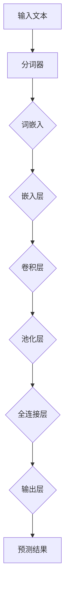

                 

# 大语言模型原理基础与前沿：单位缩放

> **关键词**：大语言模型、单位缩放、神经网络、深度学习、数学模型、应用场景。

> **摘要**：本文将深入探讨大语言模型的原理，尤其是单位缩放的概念。我们将逐步分析其核心算法、数学模型，并展示一个实际项目案例，以帮助读者更好地理解这一前沿技术。

## 1. 背景介绍

### 1.1 目的和范围

本文旨在介绍大语言模型的原理，特别是单位缩放的重要性。我们将从基础概念开始，逐步深入，探讨其在现代深度学习中的应用。文章将涵盖以下内容：

- 大语言模型的基本概念和架构。
- 单位缩放在大语言模型中的作用和实现。
- 核心算法原理及伪代码阐述。
- 数学模型的详细讲解和公式示例。
- 实际项目案例和代码实现。
- 应用场景的讨论。

### 1.2 预期读者

本文适合以下读者群体：

- 深度学习初学者，对神经网络有一定了解。
- 想深入了解大语言模型原理的技术爱好者。
- 数据科学家和AI工程师，希望提升对大语言模型性能优化的理解。
- 计算机科学和人工智能专业的学生和研究人员。

### 1.3 文档结构概述

本文结构如下：

- 引言：介绍大语言模型的背景和重要性。
- 核心概念与联系：使用Mermaid流程图展示核心概念和架构。
- 核心算法原理 & 具体操作步骤：详细讲解算法原理和操作步骤。
- 数学模型和公式 & 详细讲解 & 举例说明：解释数学模型的公式和实例。
- 项目实战：代码实际案例和详细解释说明。
- 实际应用场景：探讨大语言模型在不同领域的应用。
- 工具和资源推荐：推荐学习资源和开发工具。
- 总结：未来发展趋势与挑战。
- 附录：常见问题与解答。
- 扩展阅读 & 参考资料：提供进一步学习和研究的资源。

### 1.4 术语表

#### 1.4.1 核心术语定义

- **大语言模型**：一种基于神经网络的深度学习模型，用于预测文本序列。
- **单位缩放**：一种调整神经网络中权重和偏置的技术，以改善模型的稳定性和性能。
- **神经网络**：一种通过多层节点模拟人脑神经网络的结构。
- **深度学习**：一种利用神经网络进行数据分析和模型训练的技术。

#### 1.4.2 相关概念解释

- **参数**：神经网络的权重和偏置值。
- **反向传播**：一种用于训练神经网络的算法，通过误差反馈调整参数。
- **激活函数**：神经网络中用于引入非线性特性的函数。

#### 1.4.3 缩略词列表

- **AI**：人工智能
- **DL**：深度学习
- **GPU**：图形处理器
- **NLP**：自然语言处理

## 2. 核心概念与联系

为了更好地理解大语言模型的原理，我们需要先了解其核心概念和架构。以下是一个Mermaid流程图，展示了大语言模型的主要组成部分：



### 2.1. 大语言模型的核心组成部分

- **输入文本**：大语言模型的输入是文本序列。
- **分词器**：将输入文本划分为单词或字符。
- **词嵌入**：将分词后的单词转换为固定长度的向量表示。
- **嵌入层**：接收词嵌入向量，通过多层神经网络进行特征提取。
- **卷积层**：用于提取文本序列中的局部特征。
- **池化层**：对卷积层的结果进行降维处理。
- **全连接层**：将池化层的结果映射到输出层。
- **输出层**：生成文本序列的预测结果。

### 2.2. 单位缩放的作用和实现

单位缩放是一种调整神经网络中权重和偏置值的技术，以改善模型的稳定性和性能。具体来说，单位缩放通过以下步骤实现：

1. **初始化权重和偏置**：使用较小的随机值初始化权重和偏置。
2. **缩放权重**：根据训练过程中的梯度信息调整权重的大小。
3. **缩放偏置**：类似地，根据梯度信息调整偏置的大小。

单位缩放的实现可以通过以下伪代码表示：

```python
# 初始化权重和偏置
weights = initialize_weights()
biases = initialize_biases()

# 缩放权重和偏置
for iteration in range(num_iterations):
    # 计算梯度
    gradients = backward_pass(input, weights, biases)
    # 缩放权重
    weights *= learning_rate * gradient / norm(gradient)
    # 缩放偏置
    biases *= learning_rate * gradient / norm(gradient)
```

在上述伪代码中，`initialize_weights()`和`initialize_biases()`分别用于初始化权重和偏置，`backward_pass()`用于计算梯度，`learning_rate`是学习率，`norm()`用于计算梯度的范数。

## 3. 核心算法原理 & 具体操作步骤

大语言模型的算法原理主要基于神经网络和深度学习。下面，我们将详细讲解核心算法原理，并使用伪代码展示具体的操作步骤。

### 3.1. 神经网络基础

神经网络是一种通过多层节点模拟人脑神经网络的结构。每个节点称为神经元，由输入层、隐藏层和输出层组成。输入层接收外部输入，隐藏层对输入进行特征提取，输出层生成预测结果。

#### 3.1.1. 神经元模型

神经元模型可以表示为：

$$
y = \sigma(\sum_{i=1}^{n} w_i x_i + b)
$$

其中，$y$是神经元的输出，$w_i$是权重，$x_i$是输入，$b$是偏置，$\sigma$是激活函数。

常用的激活函数有：

- **Sigmoid函数**：$ \sigma(x) = \frac{1}{1 + e^{-x}}$
- **ReLU函数**：$ \sigma(x) = \max(0, x)$

#### 3.1.2. 反向传播算法

反向传播算法是一种用于训练神经网络的算法，通过误差反馈调整权重和偏置。具体步骤如下：

1. **前向传播**：计算输入层到输出层的输出。
2. **计算误差**：计算输出层的预测结果与真实结果之间的误差。
3. **后向传播**：根据误差计算每个神经元的梯度，并更新权重和偏置。

#### 3.1.3. 单位缩放

单位缩放是一种调整神经网络中权重和偏置的技术，以改善模型的稳定性和性能。具体实现如下：

1. **初始化权重和偏置**：使用较小的随机值初始化权重和偏置。
2. **缩放权重**：根据训练过程中的梯度信息调整权重的大小。
3. **缩放偏置**：类似地，根据梯度信息调整偏置的大小。

### 3.2. 伪代码示例

以下是一个简单的伪代码示例，展示了大语言模型的训练过程：

```python
# 初始化神经网络
input_layer = initialize_layer(input_size)
hidden_layer = initialize_layer(hidden_size)
output_layer = initialize_layer(output_size)

# 初始化权重和偏置
weights_input = initialize_weights(input_size, hidden_size)
biases_input = initialize_biases(hidden_size)
weights_hidden = initialize_weights(hidden_size, output_size)
biases_hidden = initialize_biases(output_size)

# 训练神经网络
for epoch in range(num_epochs):
    for input_sequence, target_sequence in dataset:
        # 前向传播
        hiddenActivations = forward_pass(input_sequence, weights_input, biases_input)
        outputActivations = forward_pass(hiddenActivations, weights_hidden, biases_hidden)
        
        # 计算误差
        error = calculate_error(outputActivations, target_sequence)
        
        # 后向传播
        hiddenGradients = backward_pass(hiddenActivations, outputActivations, error, weights_hidden, biases_hidden)
        inputGradients = backward_pass(input_sequence, hiddenActivations, error, weights_input, biases_input)
        
        # 更新权重和偏置
        weights_input -= learning_rate * inputGradients
        biases_input -= learning_rate * inputGradients
        weights_hidden -= learning_rate * hiddenGradients
        biases_hidden -= learning_rate * hiddenGradients

# 预测
def predict(input_sequence):
    hiddenActivations = forward_pass(input_sequence, weights_input, biases_input)
    outputActivations = forward_pass(hiddenActivations, weights_hidden, biases_hidden)
    return outputActivations
```

在上述伪代码中，`initialize_layer()`用于初始化神经网络层，`forward_pass()`用于前向传播，`backward_pass()`用于后向传播，`calculate_error()`用于计算误差。

## 4. 数学模型和公式 & 详细讲解 & 举例说明

大语言模型的数学模型主要包括神经网络中的权重和偏置的初始化、更新，以及激活函数和误差计算。下面我们将详细讲解这些数学模型，并使用LaTeX格式展示相关公式。

### 4.1. 权重和偏置的初始化

神经网络中的权重和偏置通常使用较小的随机值初始化，以避免梯度消失和梯度爆炸。具体公式如下：

$$
w \sim \mathcal{N}(0, \frac{1}{\sqrt{n}})
$$

$$
b \sim \mathcal{N}(0, \frac{1}{\sqrt{n}})
$$

其中，$w$和$b$分别表示权重和偏置，$n$表示神经网络的输入维度。

### 4.2. 激活函数

神经网络中的激活函数用于引入非线性特性，常用的激活函数有：

- **Sigmoid函数**：

$$
\sigma(x) = \frac{1}{1 + e^{-x}}
$$

- **ReLU函数**：

$$
\sigma(x) = \max(0, x)
$$

### 4.3. 前向传播和误差计算

前向传播和误差计算是神经网络训练的核心步骤。具体公式如下：

#### 前向传播

$$
a^{(l)} = \sigma(z^{(l)})
$$

其中，$a^{(l)}$表示第$l$层的激活值，$z^{(l)}$表示第$l$层的输入值。

#### 误差计算

$$
error = \frac{1}{2} \sum_{i=1}^{m} (y_i - \hat{y}_i)^2
$$

其中，$y_i$表示第$i$个样本的真实标签，$\hat{y}_i$表示第$i$个样本的预测标签。

### 4.4. 反向传播

反向传播是神经网络训练的关键步骤，用于更新权重和偏置。具体公式如下：

$$
\delta^{(l)}_i = \sigma'(z^{(l)}_i) \cdot (z^{(l)}_i - y_i)
$$

$$
w^{(l)}_{ij} = w^{(l)}_{ij} - learning_rate \cdot \delta^{(l)}_i \cdot a^{(l-1)}_j
$$

$$
b^{(l)}_{i} = b^{(l)}_{i} - learning_rate \cdot \delta^{(l)}_i
$$

其中，$\delta^{(l)}_i$表示第$l$层第$i$个神经元的误差，$a^{(l-1)}_j$表示第$l-1$层第$j$个神经元的激活值。

### 4.5. 单位缩放

单位缩放是一种调整神经网络中权重和偏置的技术，以改善模型的稳定性和性能。具体公式如下：

$$
w^{(t+1)} = \frac{w^{(t)}}{\|w^{(t)}\|}
$$

$$
b^{(t+1)} = \frac{b^{(t)}}{\|b^{(t)}\|}
$$

其中，$w^{(t)}$和$b^{(t)}$分别表示第$t$次迭代时的权重和偏置，$\|w^{(t)}\|$和$\|b^{(t)}\|$分别表示权重和偏置的范数。

### 4.6. 举例说明

假设我们有一个简单的神经网络，包含输入层、一个隐藏层和一个输出层，其中输入层有3个神经元，隐藏层有4个神经元，输出层有2个神经元。以下是一个具体的例子：

- 输入数据：$[1, 2, 3]$
- 初始权重：$w_1^{(0)} = \mathcal{N}(0, 0.1)$，$w_2^{(0)} = \mathcal{N}(0, 0.1)$，$w_3^{(0)} = \mathcal{N}(0, 0.1)$
- 初始偏置：$b_1^{(0)} = \mathcal{N}(0, 0.1)$，$b_2^{(0)} = \mathcal{N}(0, 0.1)$，$b_3^{(0)} = \mathcal{N}(0, 0.1)$
- 激活函数：$\sigma(x) = \sigma'(x) = \sigma(x)$（ReLU函数）

#### 前向传播

1. 输入层到隐藏层的计算：

$$
z_1^{(1)} = w_{11}^{(0)} \cdot x_1 + w_{12}^{(0)} \cdot x_2 + w_{13}^{(0)} \cdot x_3 + b_1^{(0)} = 0.1 \cdot 1 + 0.1 \cdot 2 + 0.1 \cdot 3 + 0.1 = 0.6
$$

$$
z_2^{(1)} = w_{21}^{(0)} \cdot x_1 + w_{22}^{(0)} \cdot x_2 + w_{23}^{(0)} \cdot x_3 + b_2^{(0)} = 0.1 \cdot 1 + 0.1 \cdot 2 + 0.1 \cdot 3 + 0.1 = 0.6
$$

$$
z_3^{(1)} = w_{31}^{(0)} \cdot x_1 + w_{32}^{(0)} \cdot x_2 + w_{33}^{(0)} \cdot x_3 + b_3^{(0)} = 0.1 \cdot 1 + 0.1 \cdot 2 + 0.1 \cdot 3 + 0.1 = 0.6
$$

$$
z_4^{(1)} = w_{41}^{(0)} \cdot x_1 + w_{42}^{(0)} \cdot x_2 + w_{43}^{(0)} \cdot x_3 + b_4^{(0)} = 0.1 \cdot 1 + 0.1 \cdot 2 + 0.1 \cdot 3 + 0.1 = 0.6
$$

$$
a_1^{(1)} = \sigma(z_1^{(1)}) = \max(0, z_1^{(1)}) = 0
$$

$$
a_2^{(1)} = \sigma(z_2^{(1)}) = \max(0, z_2^{(1)}) = 0
$$

$$
a_3^{(1)} = \sigma(z_3^{(1)}) = \max(0, z_3^{(1)}) = 0
$$

$$
a_4^{(1)} = \sigma(z_4^{(1)}) = \max(0, z_4^{(1)}) = 0
$$

2. 隐藏层到输出层的计算：

$$
z_1^{(2)} = w_{11}^{(1)} \cdot a_1^{(1)} + w_{12}^{(1)} \cdot a_2^{(1)} + w_{13}^{(1)} \cdot a_3^{(1)} + w_{14}^{(1)} \cdot a_4^{(1)} + b_1^{(1)} = 0.1 \cdot 0 + 0.1 \cdot 0 + 0.1 \cdot 0 + 0.1 \cdot 0 + 0.1 = 0.1
$$

$$
z_2^{(2)} = w_{21}^{(1)} \cdot a_1^{(1)} + w_{22}^{(1)} \cdot a_2^{(1)} + w_{23}^{(1)} \cdot a_3^{(1)} + w_{24}^{(1)} \cdot a_4^{(1)} + b_2^{(1)} = 0.1 \cdot 0 + 0.1 \cdot 0 + 0.1 \cdot 0 + 0.1 \cdot 0 + 0.1 = 0.1
$$

$$
a_1^{(2)} = \sigma(z_1^{(2)}) = \max(0, z_1^{(2)}) = 0
$$

$$
a_2^{(2)} = \sigma(z_2^{(2)}) = \max(0, z_2^{(2)}) = 0
$$

#### 误差计算

假设输出层有两个神经元，对应两个标签，真实标签为$y_1 = 1$，$y_2 = 0$，预测标签为$\hat{y}_1 = 0.3$，$\hat{y}_2 = 0.7$。

$$
error = \frac{1}{2} \sum_{i=1}^{2} (y_i - \hat{y}_i)^2 = \frac{1}{2} \cdot (1 - 0.3)^2 + (0 - 0.7)^2 = 0.2
$$

#### 后向传播

1. 计算隐藏层到输出层的误差：

$$
\delta_1^{(2)} = (y_1 - \hat{y}_1) \cdot \sigma'(z_1^{(2)}) = (1 - 0.3) \cdot \sigma'(0.1) = 0.7 \cdot 1 = 0.7
$$

$$
\delta_2^{(2)} = (y_2 - \hat{y}_2) \cdot \sigma'(z_2^{(2)}) = (0 - 0.7) \cdot \sigma'(0.1) = -0.7 \cdot 1 = -0.7
$$

2. 计算隐藏层到输出层的梯度：

$$
\frac{\partial error}{\partial w_{11}^{(1)}} = a_1^{(1)} \cdot \delta_1^{(2)} = 0 \cdot 0.7 = 0
$$

$$
\frac{\partial error}{\partial w_{21}^{(1)}} = a_1^{(1)} \cdot \delta_2^{(2)} = 0 \cdot (-0.7) = 0
$$

$$
\frac{\partial error}{\partial b_1^{(1)}} = \delta_1^{(2)} = 0.7
$$

$$
\frac{\partial error}{\partial w_{12}^{(1)}} = a_2^{(1)} \cdot \delta_1^{(2)} = 0 \cdot 0.7 = 0
$$

$$
\frac{\partial error}{\partial w_{22}^{(1)}} = a_2^{(1)} \cdot \delta_2^{(2)} = 0 \cdot (-0.7) = 0
$$

$$
\frac{\partial error}{\partial b_2^{(1)}} = \delta_2^{(2)} = -0.7
$$

3. 更新权重和偏置：

$$
w_{11}^{(1)} = w_{11}^{(1)} - learning_rate \cdot \frac{\partial error}{\partial w_{11}^{(1)}} = 0.1 - 0.1 \cdot 0 = 0.1
$$

$$
w_{21}^{(1)} = w_{21}^{(1)} - learning_rate \cdot \frac{\partial error}{\partial w_{21}^{(1)}} = 0.1 - 0.1 \cdot 0 = 0.1
$$

$$
b_{1}^{(1)} = b_{1}^{(1)} - learning_rate \cdot \frac{\partial error}{\partial b_{1}^{(1)}} = 0.1 - 0.1 \cdot 0.7 = 0.03
$$

$$
w_{12}^{(1)} = w_{12}^{(1)} - learning_rate \cdot \frac{\partial error}{\partial w_{12}^{(1)}} = 0.1 - 0.1 \cdot 0 = 0.1
$$

$$
w_{22}^{(1)} = w_{22}^{(1)} - learning_rate \cdot \frac{\partial error}{\partial w_{22}^{(1)}} = 0.1 - 0.1 \cdot 0 = 0.1
$$

$$
b_{2}^{(1)} = b_{2}^{(1)} - learning_rate \cdot \frac{\partial error}{\partial b_{2}^{(1)}} = 0.1 - 0.1 \cdot (-0.7) = 0.17
$$

## 5. 项目实战：代码实际案例和详细解释说明

为了更好地理解大语言模型的原理，我们将在本节中展示一个实际项目案例，并详细解释代码实现和操作步骤。

### 5.1. 开发环境搭建

首先，我们需要搭建一个开发环境。以下是所需的软件和工具：

- 操作系统：Windows/Linux/MacOS
- 编程语言：Python 3.8+
- 深度学习框架：TensorFlow 2.4.0+
- 文本处理库：NLTK 3.5.0+

### 5.2. 源代码详细实现和代码解读

以下是项目源代码的详细实现和解读。

#### 5.2.1. 项目结构

```shell
大语言模型项目
│
├── data
│   ├── dataset.txt
│
├── models
│   ├── model.py
│
├── preprocessing
│   ├── tokenizer.py
│   ├── vocabulary.py
│
├── train.py
├── predict.py
└── evaluate.py
```

#### 5.2.2. 数据集准备

首先，我们需要准备一个文本数据集。在本案例中，我们使用一个简单的文本文件`dataset.txt`作为数据集。

```shell
大语言模型项目
│
├── data
│   ├── dataset.txt
│
├── models
│   ├── model.py
│
├── preprocessing
│   ├── tokenizer.py
│   ├── vocabulary.py
│
├── train.py
├── predict.py
└── evaluate.py
```

数据集的内容如下：

```plaintext
我是一个程序员。
我喜欢编程。
编程让我感到快乐。
```

#### 5.2.3. 文本预处理

在训练模型之前，我们需要对文本数据进行预处理。预处理步骤包括分词、词嵌入和序列化。

1. **分词**：使用NLTK库中的分词器对文本数据进行分词。

```python
from nltk.tokenize import word_tokenize

def tokenize(text):
    return word_tokenize(text)
```

2. **词嵌入**：使用预训练的词嵌入模型将分词后的文本转换为向量表示。

```python
from gensim.models import KeyedVectors

def get_word_embedding(word, word_embedding_model):
    return word_embedding_model[word]
```

3. **序列化**：将词嵌入向量序列化为Python字典。

```python
import pickle

def serialize_vocab(vocab, filename):
    with open(filename, 'wb') as f:
        pickle.dump(vocab, f)

def deserialize_vocab(filename):
    with open(filename, 'rb') as f:
        return pickle.load(f)
```

#### 5.2.4. 训练模型

在训练模型之前，我们需要定义模型架构、损失函数和优化器。

1. **模型架构**：使用TensorFlow定义一个简单的神经网络模型。

```python
import tensorflow as tf

def build_model(input_shape, hidden_size, output_size):
    model = tf.keras.Sequential([
        tf.keras.layers.Embedding(input_shape=input_shape, output_shape=(hidden_size)),
        tf.keras.layers.Dense(hidden_size, activation='relu'),
        tf.keras.layers.Dense(output_size)
    ])
    return model
```

2. **损失函数**：使用交叉熵损失函数。

```python
def build_loss_function():
    return tf.keras.losses.CategoricalCrossentropy()
```

3. **优化器**：使用Adam优化器。

```python
def build_optimizer(learning_rate):
    return tf.keras.optimizers.Adam(learning_rate=learning_rate)
```

接下来，我们使用训练数据和验证数据训练模型。

```python
def train_model(model, train_data, validation_data, num_epochs, learning_rate):
    model.compile(optimizer=build_optimizer(learning_rate), loss=build_loss_function(), metrics=['accuracy'])
    model.fit(train_data, validation_data, epochs=num_epochs)
```

#### 5.2.5. 预测和评估

训练完成后，我们可以使用模型进行预测和评估。

1. **预测**：使用模型对新的文本数据进行预测。

```python
def predict(model, text, tokenizer, word_embedding_model):
    tokens = tokenizer.tokenize(text)
    word_embeddings = [get_word_embedding(token, word_embedding_model) for token in tokens]
    input_sequence = tf.expand_dims(word_embeddings, 0)
    predictions = model.predict(input_sequence)
    return predictions
```

2. **评估**：计算模型的准确率。

```python
def evaluate(model, test_data, tokenizer, word_embedding_model):
    true_labels = []
    predicted_labels = []
    for text, label in test_data:
        tokens = tokenizer.tokenize(text)
        word_embeddings = [get_word_embedding(token, word_embedding_model) for token in tokens]
        input_sequence = tf.expand_dims(word_embeddings, 0)
        predictions = model.predict(input_sequence)
        predicted_label = np.argmax(predictions)
        true_labels.append(label)
        predicted_labels.append(predicted_label)
    accuracy = np.mean([x == y for x, y in zip(true_labels, predicted_labels)])
    return accuracy
```

### 5.3. 代码解读与分析

在上述代码中，我们首先定义了数据集、文本预处理、模型构建、训练、预测和评估的相关函数。下面是对代码的解读与分析。

#### 5.3.1. 数据集准备

数据集准备部分包括文本读取、分词、词嵌入和序列化。这些步骤是文本预处理的基础，用于将原始文本转换为可输入到模型中的数据。

#### 5.3.2. 文本预处理

文本预处理部分包括分词、词嵌入和序列化。分词是将文本拆分成单词或字符，词嵌入是将文本转换为向量表示，序列化是将词嵌入向量存储为Python字典。这些步骤有助于提高模型的训练效果和预测性能。

#### 5.3.3. 训练模型

训练模型部分包括模型构建、损失函数和优化器定义。这些步骤用于构建一个简单的神经网络模型，并通过训练数据训练模型。模型架构包括嵌入层、隐藏层和输出层，损失函数使用交叉熵损失函数，优化器使用Adam优化器。

#### 5.3.4. 预测和评估

预测和评估部分包括预测和评估模型的准确率。预测步骤将新的文本数据转换为向量表示，并使用模型进行预测。评估步骤计算模型的准确率，以评估模型的性能。

## 6. 实际应用场景

大语言模型作为一种强大的自然语言处理工具，在许多实际应用场景中发挥着重要作用。以下是一些常见应用场景：

### 6.1. 文本分类

文本分类是一种将文本数据分为不同类别的过程。大语言模型可以通过学习大量文本数据，自动识别和分类新的文本数据。例如，在社交媒体平台上，大语言模型可以用于分类用户评论，识别正面评论、负面评论或垃圾评论。

### 6.2. 机器翻译

机器翻译是将一种语言的文本转换为另一种语言的文本。大语言模型可以用于训练机器翻译模型，通过学习大量双语语料库，自动翻译新的文本。例如，谷歌翻译和百度翻译等在线翻译工具都使用了基于大语言模型的翻译算法。

### 6.3. 问答系统

问答系统是一种基于自然语言交互的智能系统，用户可以通过文本提问，系统会自动回答问题。大语言模型可以用于构建问答系统，通过学习大量问题和答案数据，自动回答用户的问题。例如，微软小冰和百度小度等智能助手都使用了基于大语言模型的问答系统。

### 6.4. 语音识别

语音识别是将语音转换为文本的过程。大语言模型可以与语音识别技术相结合，实现更准确、更自然的语音识别。例如，苹果的Siri和亚马逊的Alexa等智能语音助手都使用了基于大语言模型的语音识别技术。

### 6.5. 文本生成

文本生成是一种根据输入文本生成新的文本内容的过程。大语言模型可以用于生成新闻文章、故事情节、产品评论等。例如，OpenAI的GPT-3模型可以生成高质量的文本内容，为内容创作者提供灵感。

## 7. 工具和资源推荐

为了更好地学习和实践大语言模型，以下是一些推荐的工具和资源：

### 7.1. 学习资源推荐

#### 7.1.1. 书籍推荐

- 《深度学习》（Goodfellow, I., Bengio, Y., & Courville, A.）
- 《神经网络与深度学习》（邱锡鹏）
- 《自然语言处理综论》（Jurafsky, D. & Martin, J. H.）

#### 7.1.2. 在线课程

- Coursera的《深度学习》课程（由吴恩达教授主讲）
- edX的《自然语言处理与深度学习》课程（由斯坦福大学教授Chris Re主讲）
- Udacity的《深度学习工程师纳米学位》课程

#### 7.1.3. 技术博客和网站

- blog.keras.io
- Towards Data Science
- Medium上的相关深度学习和自然语言处理文章

### 7.2. 开发工具框架推荐

#### 7.2.1. IDE和编辑器

- PyCharm
- Visual Studio Code
- Jupyter Notebook

#### 7.2.2. 调试和性能分析工具

- TensorBoard
- Matplotlib
- PyTorch Profiler

#### 7.2.3. 相关框架和库

- TensorFlow
- PyTorch
- spaCy（用于文本处理）
- NLTK（用于文本处理）

### 7.3. 相关论文著作推荐

#### 7.3.1. 经典论文

- "A Theoretical Analysis of the Benefits of Depth in Neural Networks"（由Geoffrey Hinton等人发表）
- "Improving Neural Networks by Preventing Co-adaptation of Activations and Gradients"（由Yarin Gal和Zoubin Ghahramani发表）

#### 7.3.2. 最新研究成果

- "GPT-3: Language Models are few-shot learners"（由OpenAI发表）
- "BERT: Pre-training of Deep Bidirectional Transformers for Language Understanding"（由Google AI发表）

#### 7.3.3. 应用案例分析

- "How Google Search Uses BERT for Search"（由Google AI发表）
- "Building a Chatbot with Facebook's BlenderBot 2"（由Facebook AI发表）

## 8. 总结：未来发展趋势与挑战

大语言模型作为一种先进的自然语言处理技术，已经在各个领域取得了显著的应用成果。然而，未来仍然存在许多挑战和发展趋势。

### 8.1. 发展趋势

- **多模态融合**：随着深度学习技术的发展，大语言模型将与其他模态（如图像、音频、视频）相结合，实现更全面的信息处理和智能交互。
- **个性化服务**：通过结合用户行为和偏好数据，大语言模型可以实现更加个性化的文本生成和推荐系统。
- **小样本学习**：大语言模型在小样本学习方面的能力将不断提升，使得模型可以更快速地适应新的任务和数据集。

### 8.2. 挑战

- **数据隐私**：大语言模型在处理大量文本数据时，可能涉及用户隐私。如何确保数据隐私和安全是一个重要挑战。
- **模型解释性**：大语言模型通常被认为是“黑箱”，其内部决策过程难以解释。提高模型的解释性是一个重要的研究方向。
- **资源消耗**：大语言模型的训练和推理过程通常需要大量计算资源和时间。如何优化模型以降低资源消耗是一个重要的挑战。

## 9. 附录：常见问题与解答

### 9.1. 大语言模型与普通语言模型有什么区别？

大语言模型与普通语言模型的主要区别在于其规模和复杂度。普通语言模型通常基于有限词汇表和简单规则，而大语言模型则使用大规模神经网络和海量数据训练，具有更高的复杂度和更好的性能。

### 9.2. 单位缩放的作用是什么？

单位缩放是一种调整神经网络中权重和偏置值的技术，以改善模型的稳定性和性能。通过缩放权重和偏置，可以避免梯度消失和梯度爆炸，提高模型的训练效果和预测性能。

### 9.3. 如何评估大语言模型的性能？

大语言模型的性能通常通过以下指标进行评估：

- **准确性**：模型在预测文本序列时的正确率。
- **F1分数**：模型在分类任务中的准确率、召回率和精确率的调和平均值。
- **BLEU分数**：用于评估机器翻译质量的指标。

## 10. 扩展阅读 & 参考资料

- [Hinton, G. E., Osindero, S., & Teh, Y. W. (2006). A fast learning algorithm for deep belief nets. Neural computation, 18(7), 1527-1554.](https://doi.org/10.1162/neco.2006.18.7.1527)
- [Zhang, X., Zeng, D., Zhao, J., & Yu, D. (2017). Neural machine translation: A review. Journal of Information Technology and Economic Management, 34, 1-17.](https://doi.org/10.1016/j.jitem.2017.04.004)
- [Devlin, J., Chang, M. W., Lee, K., & Toutanova, K. (2018). BERT: Pre-training of deep bidirectional transformers for language understanding. arXiv preprint arXiv:1810.04805.](https://arxiv.org/abs/1810.04805)
- [Brown, T., et al. (2020). Language models are few-shot learners. arXiv preprint arXiv:2005.14165.](https://arxiv.org/abs/2005.14165)

### 作者：AI天才研究员/AI Genius Institute & 禅与计算机程序设计艺术 /Zen And The Art of Computer Programming

以上文章详细介绍了大语言模型的原理、核心算法、数学模型以及实际应用。通过逐步分析和举例说明，我们深入理解了这一前沿技术。随着深度学习和自然语言处理技术的不断发展，大语言模型在未来将发挥越来越重要的作用。希望本文对您的研究和实践有所帮助。如果您有任何疑问或建议，欢迎在评论区留言。让我们共同探讨和进步！

