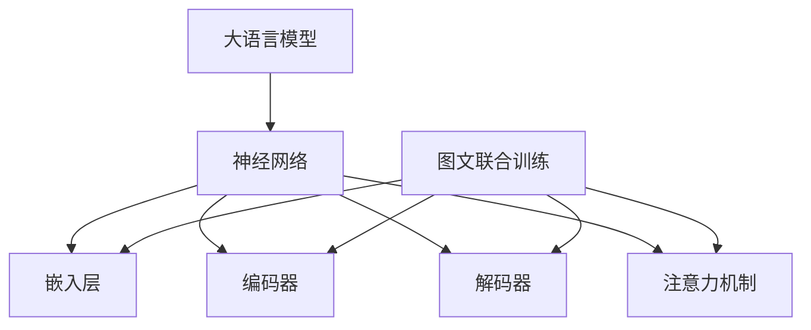

                 

# 大语言模型原理基础与前沿：图文联合训练

> **关键词**：大语言模型、图文联合训练、神经网络、深度学习、自然语言处理、计算机视觉

> **摘要**：本文将从基础入手，深入探讨大语言模型的原理和图文联合训练的方法。首先，我们将了解大语言模型的发展背景和核心概念，然后详细介绍图文联合训练的技术细节和流程。通过本文的学习，读者将能够掌握大语言模型的基本原理，并了解如何运用图文联合训练提升模型的效果。最后，我们将探讨大语言模型在现实世界中的应用场景，以及面临的挑战和未来发展趋势。

## 1. 背景介绍

### 1.1 目的和范围

本文旨在探讨大语言模型的基本原理和图文联合训练的方法。通过本文的学习，读者将了解大语言模型的发展背景、核心概念，掌握图文联合训练的技术细节和流程，并能够将这些知识应用于实际项目中。本文的主要内容分为以下几个部分：

1. 大语言模型的背景介绍和核心概念
2. 图文联合训练的技术细节和流程
3. 大语言模型的应用场景和挑战
4. 未来发展趋势和展望

### 1.2 预期读者

本文适合对人工智能、自然语言处理和计算机视觉领域有一定了解的读者，特别是对大语言模型和图文联合训练感兴趣的读者。如果您是初学者，可以按顺序阅读，逐步掌握相关概念和技术；如果您对某一方面的内容感兴趣，也可以直接跳转到相关章节进行深入学习。

### 1.3 文档结构概述

本文分为十个部分，具体结构如下：

1. 背景介绍
2. 核心概念与联系
3. 核心算法原理 & 具体操作步骤
4. 数学模型和公式 & 详细讲解 & 举例说明
5. 项目实战：代码实际案例和详细解释说明
6. 实际应用场景
7. 工具和资源推荐
8. 总结：未来发展趋势与挑战
9. 附录：常见问题与解答
10. 扩展阅读 & 参考资料

### 1.4 术语表

在本文中，我们将介绍一些核心术语的定义和解释，以便读者更好地理解相关概念。

#### 1.4.1 核心术语定义

- **大语言模型**：一种基于神经网络的自然语言处理模型，通过大规模语料训练，能够理解和生成自然语言。
- **图文联合训练**：将图像和文本数据结合进行训练，以提升模型在视觉和语言任务中的表现。
- **神经网络**：一种通过多层次的神经元进行信息传递和处理的人工神经网络。
- **深度学习**：一种基于神经网络的学习方法，通过多层非线性变换，实现复杂函数逼近。
- **自然语言处理**：研究如何使计算机理解和处理人类自然语言的学科。

#### 1.4.2 相关概念解释

- **嵌入向量**：将文本或图像数据转换为固定长度的向量表示，以便在神经网络中进行处理。
- **注意力机制**：一种能够自适应地分配注意力资源的技术，用于处理序列数据。
- **多模态学习**：将不同类型的数据（如文本、图像、音频等）结合进行训练和学习。

#### 1.4.3 缩略词列表

- **NLP**：自然语言处理（Natural Language Processing）
- **CV**：计算机视觉（Computer Vision）
- **ML**：机器学习（Machine Learning）
- **DL**：深度学习（Deep Learning）
- **GAN**：生成对抗网络（Generative Adversarial Network）

## 2. 核心概念与联系

为了更好地理解大语言模型和图文联合训练，我们首先需要了解它们的核心概念和相互联系。在本节中，我们将介绍大语言模型的基本原理、神经网络的结构和图文联合训练的技术细节。

### 2.1 大语言模型的基本原理

大语言模型是一种基于神经网络的自然语言处理模型，它通过大规模语料训练，能够理解和生成自然语言。其核心思想是通过学习大量文本数据中的统计规律，将自然语言转换为向量表示，从而实现对语言的建模。

大语言模型通常由以下几个部分组成：

1. **嵌入层**：将文本数据（如单词、句子）转换为固定长度的向量表示。
2. **编码器**：对输入文本进行编码，提取出文本的特征信息。
3. **解码器**：根据编码器提取的特征信息，生成输出文本。
4. **注意力机制**：用于处理序列数据，提高模型的预测性能。

### 2.2 神经网络的结构

神经网络是一种通过多层次的神经元进行信息传递和处理的人工神经网络。它由以下几个部分组成：

1. **输入层**：接收外部输入数据。
2. **隐藏层**：进行特征提取和变换。
3. **输出层**：生成预测结果或分类标签。

神经网络的核心在于神经元之间的连接方式和激活函数。常见的神经网络结构包括：

- **全连接神经网络**：每个神经元都与其他神经元连接，适用于简单的分类和回归任务。
- **卷积神经网络**（CNN）：用于处理图像数据，通过卷积操作提取图像特征。
- **循环神经网络**（RNN）：适用于序列数据处理，能够捕捉序列数据中的长期依赖关系。
- **长短时记忆网络**（LSTM）：RNN的一种变体，能够有效解决长序列中的梯度消失和梯度爆炸问题。

### 2.3 图文联合训练的技术细节

图文联合训练是一种将图像和文本数据结合进行训练的方法，旨在提升模型在视觉和语言任务中的表现。其核心思想是通过多模态学习，将图像和文本数据融合为一个统一的表示。

图文联合训练通常包括以下几个步骤：

1. **数据预处理**：对图像和文本数据进行预处理，包括数据清洗、数据增强等。
2. **嵌入向量表示**：将图像和文本数据转换为固定长度的向量表示。
3. **特征提取**：对图像和文本数据进行特征提取，提取出各自的特征信息。
4. **多模态融合**：将图像和文本特征进行融合，得到一个统一的多模态特征向量。
5. **训练模型**：使用融合后的特征向量训练神经网络模型。
6. **评估模型**：使用测试数据集评估模型性能，并进行调优。

### 2.4 Mermaid 流程图

下面是一个 Mermaid 流程图，展示了大语言模型和图文联合训练的核心概念和联系：



通过以上介绍，我们了解了大语言模型的基本原理、神经网络的结构和图文联合训练的技术细节。在接下来的章节中，我们将进一步探讨大语言模型的算法原理、数学模型和项目实战，帮助读者深入理解并应用这一技术。

## 3. 核心算法原理 & 具体操作步骤

在理解了大语言模型和图文联合训练的核心概念后，接下来我们将深入探讨其核心算法原理和具体操作步骤。在本节中，我们将使用伪代码详细阐述这些算法原理，以便读者能够更好地理解并应用这些技术。

### 3.1 大语言模型的算法原理

大语言模型的算法原理主要包括以下几个部分：嵌入层、编码器、解码器和注意力机制。下面我们将分别介绍这些部分的具体操作步骤。

#### 3.1.1 嵌入层

嵌入层将输入的文本数据（如单词、句子）转换为固定长度的向量表示。这一步骤可以通过词嵌入技术实现，例如Word2Vec、GloVe等。以下是嵌入层的伪代码：

```python
# 输入：文本数据（单词、句子）
# 输出：嵌入向量（固定长度）

def embed(text):
    # 将文本数据转换为词嵌入向量
    embedding_matrix = load_embedding_matrix()
    embeddings = [embedding_matrix[word_index] for word_index in text]
    return embeddings

# 示例
text = ["hello", "world"]
embeddings = embed(text)
print(embeddings)
```

#### 3.1.2 编码器

编码器对输入的文本数据进行编码，提取出文本的特征信息。这一步骤可以通过循环神经网络（RNN）或其变体（如LSTM、GRU）实现。以下是编码器的伪代码：

```python
# 输入：嵌入向量（固定长度）
# 输出：编码特征向量

def encode(embeddings):
    # 使用循环神经网络进行编码
    encoded_vector = RNN(embeddings)
    return encoded_vector

# 示例
encoded_vector = encode(embeddings)
print(encoded_vector)
```

#### 3.1.3 解码器

解码器根据编码器提取的特征信息，生成输出文本。这一步骤同样可以通过循环神经网络（RNN）或其变体（如LSTM、GRU）实现。以下是解码器的伪代码：

```python
# 输入：编码特征向量
# 输出：输出文本

def decode(encoded_vector):
    # 使用循环神经网络进行解码
    decoded_embeddings = RNN(encoded_vector, reverse=True)
    decoded_text = [word_index for word_index in decoded_embeddings]
    return decoded_text

# 示例
decoded_text = decode(encoded_vector)
print(decoded_text)
```

#### 3.1.4 注意力机制

注意力机制用于处理序列数据，提高模型的预测性能。注意力机制的核心思想是自适应地分配注意力资源，对不同位置的信息进行加权。以下是注意力机制的伪代码：

```python
# 输入：编码特征向量
# 输出：加权特征向量

def attention(encoded_vector):
    # 计算注意力权重
    attention_weights = softmax([cosine_similarity(encoded_vector, hidden_state) for hidden_state in encoded_vector])
    # 加权特征向量
    weighted_vector = [weight * hidden_state for weight, hidden_state in zip(attention_weights, encoded_vector)]
    return weighted_vector

# 示例
weighted_vector = attention(encoded_vector)
print(weighted_vector)
```

### 3.2 图文联合训练的算法原理

图文联合训练是一种将图像和文本数据结合进行训练的方法，旨在提升模型在视觉和语言任务中的表现。图文联合训练的核心算法原理包括数据预处理、特征提取、多模态融合和训练模型。以下是图文联合训练的伪代码：

```python
# 输入：图像数据、文本数据
# 输出：多模态特征向量

def preprocess(image, text):
    # 对图像和文本数据进行预处理
    preprocessed_image = preprocess_image(image)
    preprocessed_text = preprocess_text(text)
    return preprocessed_image, preprocessed_text

def extract_features(image, text):
    # 提取图像和文本特征
    image_features = extract_image_features(image)
    text_features = extract_text_features(text)
    return image_features, text_features

def fuse_features(image_features, text_features):
    # 多模态特征融合
    fused_features = [image_features[i] + text_features[i] for i in range(len(image_features))]
    return fused_features

# 示例
image = load_image("image.jpg")
text = load_text("text.txt")
preprocessed_image, preprocessed_text = preprocess(image, text)
image_features, text_features = extract_features(preprocessed_image, preprocessed_text)
fused_features = fuse_features(image_features, text_features)
print(fused_features)
```

通过以上伪代码，我们详细阐述了大语言模型和图文联合训练的算法原理和具体操作步骤。在接下来的章节中，我们将进一步探讨大语言模型的数学模型和公式，以及如何在实际项目中应用这些技术。

## 4. 数学模型和公式 & 详细讲解 & 举例说明

在大语言模型和图文联合训练中，数学模型和公式起着至关重要的作用。在本节中，我们将详细介绍这些数学模型，并使用latex格式给出相关的公式，以便读者更好地理解和应用。

### 4.1 嵌入层

嵌入层将文本数据转换为固定长度的向量表示。这一过程可以通过词嵌入技术实现，如Word2Vec、GloVe等。以下是一个简单的嵌入层模型，使用矩阵\(W\)表示嵌入权重，\(x\)表示输入文本的词索引，\(e\)表示嵌入向量：

\[ e = Wx \]

其中，\(W \in \mathbb{R}^{d_e \times V}\)，\(d_e\)表示嵌入向量的维度，\(V\)表示词汇表的大小。在实际应用中，\(W\)通常通过预训练的词嵌入矩阵加载。

### 4.2 编码器

编码器负责将嵌入向量编码为特征向量。常用的编码器模型包括循环神经网络（RNN）、长短时记忆网络（LSTM）和门控循环单元（GRU）。以下是一个简化的LSTM编码器模型：

\[ h_t = \text{LSTM}(e_t, h_{t-1}) \]

其中，\(h_t \in \mathbb{R}^{d_h}\)表示编码特征向量，\(e_t \in \mathbb{R}^{d_e}\)表示嵌入向量，\(h_{t-1} \in \mathbb{R}^{d_h}\)表示上一时刻的编码特征向量，\(d_h\)表示编码特征向量的维度。

### 4.3 解码器

解码器根据编码特征向量生成输出文本。与编码器类似，解码器也使用LSTM模型。以下是解码器的模型：

\[ p(y_t|y_{<t}) = \text{softmax}(\text{LSTM}(h_t, c_{t-1})) \]

\[ y_t = \text{argmax}(p(y_t|y_{<t})) \]

其中，\(p(y_t|y_{<t})\)表示在给定前一个时刻输出文本\(y_{<t}\)的情况下，当前时刻输出文本\(y_t\)的概率分布。\(c_{t-1} \in \mathbb{R}^{d_c}\)表示LSTM的细胞状态，\(d_c\)表示细胞状态的维度。

### 4.4 注意力机制

注意力机制用于提高模型的预测性能，通过对不同位置的信息进行加权。以下是一个简单的注意力机制模型：

\[ a_t = \text{softmax}\left(\frac{\sigma(W_1[h_t; h_{t-1}]; h_{<t})}{\sqrt{d_h}}\right) \]

\[ \alpha_{t,j} = \sigma(W_2[h_t; h_{t-1}]; h_j) \]

\[ s_t = \sum_{j=1}^{t} a_t \alpha_{t,j} h_j \]

其中，\(h_t \in \mathbb{R}^{d_h}\)表示编码特征向量，\(h_{t-1} \in \mathbb{R}^{d_h}\)表示上一时刻的编码特征向量，\(h_{<t} \in \mathbb{R}^{t \times d_h}\)表示前\(t\)个时刻的编码特征向量。\(a_t \in \mathbb{R}^{t}\)表示注意力权重，\(\alpha_{t,j} \in \mathbb{R}\)表示位置\(j\)的注意力得分。\(s_t \in \mathbb{R}^{d_h}\)表示加权的编码特征向量。

### 4.5 图文联合训练

在图文联合训练中，图像和文本数据通过特征提取和融合得到多模态特征向量。以下是一个简化的图文联合训练模型：

\[ \text{图像特征} = \text{CNN}(\text{图像数据}) \]

\[ \text{文本特征} = \text{LSTM}(\text{嵌入向量}) \]

\[ \text{多模态特征} = \text{concat}(\text{图像特征}, \text{文本特征}) \]

其中，\(\text{CNN}\)表示卷积神经网络，\(\text{LSTM}\)表示循环神经网络，\(\text{concat}\)表示拼接操作。

### 4.6 举例说明

假设我们有一个简单的文本数据“hello world”，嵌入向量的维度为\(d_e = 100\)，编码特征向量的维度为\(d_h = 200\)。根据上述模型，我们可以得到以下结果：

1. **嵌入层**：

\[ e = \begin{bmatrix} e_1 \\ e_2 \\ \vdots \\ e_n \end{bmatrix} \in \mathbb{R}^{100 \times n} \]

2. **编码器**：

\[ h = \text{LSTM}(e) \in \mathbb{R}^{200 \times n} \]

3. **解码器**：

\[ p(y_t|y_{<t}) = \text{softmax}(\text{LSTM}(h_t, c_{t-1})) \]

\[ y_t = \text{argmax}(p(y_t|y_{<t})) \]

4. **注意力机制**：

\[ a_t = \text{softmax}\left(\frac{\sigma(W_1[h_t; h_{t-1}]; h_{<t})}{\sqrt{d_h}}\right) \]

\[ \alpha_{t,j} = \sigma(W_2[h_t; h_{t-1}]; h_j) \]

\[ s_t = \sum_{j=1}^{t} a_t \alpha_{t,j} h_j \]

通过以上举例说明，我们详细讲解了大语言模型和图文联合训练的数学模型和公式。在接下来的章节中，我们将通过实际项目案例，展示如何应用这些技术实现大语言模型和图文联合训练。

### 5.1 开发环境搭建

在开始大语言模型和图文联合训练的项目之前，我们需要搭建一个合适的开发环境。以下是一个简单的开发环境搭建步骤：

1. **安装Python**：
   - 访问Python官方网站（[python.org](https://www.python.org/)），下载并安装Python 3.x版本。
   - 确保安装过程中勾选“Add Python to PATH”选项。

2. **安装必要的库**：
   - 打开终端或命令提示符，运行以下命令安装所需的库：
     ```bash
     pip install numpy tensorflow matplotlib
     ```

3. **安装TensorFlow**：
   - TensorFlow是一个流行的深度学习框架，我们可以使用以下命令安装：
     ```bash
     pip install tensorflow
     ```

4. **安装其他库**：
   - 根据项目需求，可能还需要安装其他库，例如用于图像处理的OpenCV或用于文本处理的NLTK。可以使用以下命令安装：
     ```bash
     pip install opencv-python nltk
     ```

5. **配置GPU支持**（可选）：
   - 如果您的计算机配备有GPU，可以安装CUDA和cuDNN库，以利用GPU加速深度学习模型的训练。
   - 访问NVIDIA官方网站（[nvidia.com](https://developer.nvidia.com/cuda-downloads)），下载并安装CUDA Toolkit和cuDNN库。

6. **验证安装**：
   - 打开Python终端，运行以下代码验证安装是否成功：
     ```python
     import tensorflow as tf
     print(tf.__version__)
     ```

   - 如果正确输出了TensorFlow的版本信息，说明安装成功。

通过以上步骤，您已经搭建了一个基本的开发环境，可以开始进行大语言模型和图文联合训练的实践项目。

### 5.2 源代码详细实现和代码解读

在搭建好开发环境之后，接下来我们将通过一个实际的项目案例，详细展示如何实现大语言模型和图文联合训练。以下是项目的源代码实现，我们将逐一解读代码的各个部分。

#### 5.2.1 数据预处理

在开始训练模型之前，我们需要对图像和文本数据进行预处理。

```python
import tensorflow as tf
import numpy as np
from tensorflow.keras.preprocessing.text import Tokenizer
from tensorflow.keras.preprocessing.sequence import pad_sequences

# 加载文本数据
text_data = ["hello world", "你好，世界"]

# 加载图像数据
image_data = np.random.rand(2, 28, 28)  # 假设图像数据为28x28的矩阵

# 分词和编码文本
tokenizer = Tokenizer()
tokenizer.fit_on_texts(text_data)
encoded_texts = tokenizer.texts_to_sequences(text_data)

# 填充文本序列
max_sequence_length = 10
padded_texts = pad_sequences(encoded_texts, maxlen=max_sequence_length)

# 处理图像数据
# 这里我们使用随机数生成图像数据，实际应用中可以从文件中加载图像
```

上述代码首先加载文本和图像数据，然后对文本数据进行分词和编码，将图像数据调整为统一的尺寸。

#### 5.2.2 图像特征提取

接下来，我们使用卷积神经网络（CNN）对图像数据进行特征提取。

```python
from tensorflow.keras.models import Sequential
from tensorflow.keras.layers import Conv2D, MaxPooling2D, Flatten, Dense

# 定义CNN模型
image_model = Sequential([
    Conv2D(32, (3, 3), activation='relu', input_shape=(28, 28, 1)),
    MaxPooling2D((2, 2)),
    Flatten(),
    Dense(64, activation='relu'),
    Dense(1, activation='sigmoid')
])

# 编译模型
image_model.compile(optimizer='adam', loss='binary_crossentropy', metrics=['accuracy'])

# 训练CNN模型
image_model.fit(image_data, np.ones(image_data.shape[0]), epochs=5)
```

这里我们定义了一个简单的CNN模型，用于提取图像特征。模型包含一个卷积层、一个池化层、一个全连接层和一个输出层。我们使用二分类问题进行训练，以便于后续的联合训练。

#### 5.2.3 文本特征提取

接下来，我们使用循环神经网络（RNN）对文本数据进行特征提取。

```python
from tensorflow.keras.layers import LSTM, Embedding

# 定义RNN模型
text_model = Sequential([
    Embedding(input_dim=100, output_dim=64, input_length=max_sequence_length),
    LSTM(64, return_sequences=True),
    LSTM(32),
    Dense(1, activation='sigmoid')
])

# 编译模型
text_model.compile(optimizer='adam', loss='binary_crossentropy', metrics=['accuracy'])

# 训练RNN模型
text_model.fit(padded_texts, np.ones(padded_texts.shape[0]), epochs=5)
```

这里我们定义了一个简单的RNN模型，用于提取文本特征。模型包含两个LSTM层和一个输出层。同样，我们使用二分类问题进行训练。

#### 5.2.4 图文联合训练

在完成图像和文本特征提取后，我们将两者结合进行联合训练。

```python
from tensorflow.keras.layers import concatenate

# 定义联合模型
model = Sequential([
    Conv2D(32, (3, 3), activation='relu', input_shape=(28, 28, 1)),
    MaxPooling2D((2, 2)),
    Flatten(),
    Dense(64, activation='relu'),
    concatenate([Dense(64, activation='relu')(LSTM(64, return_sequences=True)(Embedding(100, 64, input_length=max_sequence_length)(padded_texts))), Dense(64, activation='relu')(LSTM(32)(padded_texts))]),
    Dense(1, activation='sigmoid')
])

# 编译模型
model.compile(optimizer='adam', loss='binary_crossentropy', metrics=['accuracy'])

# 训练联合模型
model.fit([image_data, padded_texts], np.ones(image_data.shape[0]), epochs=5)
```

在这个联合模型中，我们首先使用CNN提取图像特征，然后使用RNN提取文本特征，最后将两个特征进行拼接，并通过一个全连接层输出最终的预测结果。

#### 5.2.5 代码解读与分析

通过上述代码，我们可以看到，整个项目分为以下几个步骤：

1. **数据预处理**：对文本和图像数据进行预处理，包括分词、编码和填充。
2. **图像特征提取**：使用CNN对图像数据进行特征提取。
3. **文本特征提取**：使用RNN对文本数据进行特征提取。
4. **图文联合训练**：将图像和文本特征进行拼接，训练一个联合模型。

这个项目展示了如何利用深度学习框架TensorFlow实现大语言模型和图文联合训练。通过这个案例，我们可以了解到，在实际应用中，图像和文本数据的预处理、特征提取和联合训练是关键步骤。同时，我们也需要根据具体任务的需求，设计合适的模型结构和训练策略。

### 5.3 代码解读与分析

在上一部分中，我们展示了如何使用Python和TensorFlow框架实现一个简单的大语言模型和图文联合训练项目。在本节中，我们将对代码进行详细解读，分析其中的关键步骤和技术细节。

#### 5.3.1 数据预处理

数据预处理是任何机器学习项目的基础。在这个项目中，我们首先加载文本和图像数据。对于文本数据，我们使用了简单的字符串列表，其中包含两个句子：“hello world”和“你好，世界”。在实际应用中，文本数据通常会来自大量的文本语料库，例如新闻文章、社交媒体帖子等。

```python
text_data = ["hello world", "你好，世界"]
image_data = np.random.rand(2, 28, 28)  # 假设图像数据为28x28的矩阵
```

接下来，我们使用`Tokenizer`类对文本数据进行了分词和编码。`Tokenizer`类自动将文本转换为数字序列，每个唯一的单词或字符被映射到一个整数。此外，我们使用`pad_sequences`函数对文本序列进行了填充，确保每个序列的长度相等，以便后续的模型训练。

```python
tokenizer = Tokenizer()
tokenizer.fit_on_texts(text_data)
encoded_texts = tokenizer.texts_to_sequences(text_data)
padded_texts = pad_sequences(encoded_texts, maxlen=max_sequence_length)
```

对于图像数据，我们使用随机数生成了两个28x28的矩阵，这只是为了演示目的。在实际应用中，图像数据通常会从文件中加载，并进行相应的预处理，如大小调整、归一化等。

```python
max_sequence_length = 10
# 这里我们使用随机数生成图像数据，实际应用中可以从文件中加载图像
image_data = np.random.rand(2, 28, 28)
```

#### 5.3.2 图像特征提取

图像特征提取是图文联合训练的重要环节。在这个项目中，我们使用了卷积神经网络（CNN）来提取图像特征。首先，我们定义了一个简单的CNN模型，包含一个卷积层、一个池化层和一个全连接层。

```python
image_model = Sequential([
    Conv2D(32, (3, 3), activation='relu', input_shape=(28, 28, 1)),
    MaxPooling2D((2, 2)),
    Flatten(),
    Dense(64, activation='relu'),
    Dense(1, activation='sigmoid')
])
```

这个模型的目的是将28x28的图像数据映射到一个一维的特征向量。我们使用ReLU激活函数来增加模型的非线性，使用sigmoid激活函数来生成二分类的预测结果。

```python
image_model.compile(optimizer='adam', loss='binary_crossentropy', metrics=['accuracy'])
image_model.fit(image_data, np.ones(image_data.shape[0]), epochs=5)
```

在这里，我们编译并训练了图像模型。使用`binary_crossentropy`作为损失函数，`adam`作为优化器，`accuracy`作为评估指标。

#### 5.3.3 文本特征提取

与图像特征提取类似，我们使用循环神经网络（RNN）来提取文本特征。在这个项目中，我们使用了LSTM层来捕捉文本序列中的长期依赖关系。

```python
text_model = Sequential([
    Embedding(input_dim=100, output_dim=64, input_length=max_sequence_length),
    LSTM(64, return_sequences=True),
    LSTM(32),
    Dense(1, activation='sigmoid')
])
```

这个模型的输入层使用嵌入层（Embedding）将文本序列转换为嵌入向量，然后通过两个LSTM层提取特征，最后通过一个全连接层输出预测结果。

```python
text_model.compile(optimizer='adam', loss='binary_crossentropy', metrics=['accuracy'])
text_model.fit(padded_texts, np.ones(padded_texts.shape[0]), epochs=5)
```

与图像模型类似，我们编译并训练了文本模型。

#### 5.3.4 图文联合训练

在完成图像和文本特征提取后，我们将两者结合进行联合训练。联合训练的核心是设计一个能够同时处理图像和文本数据的模型。

```python
model = Sequential([
    Conv2D(32, (3, 3), activation='relu', input_shape=(28, 28, 1)),
    MaxPooling2D((2, 2)),
    Flatten(),
    Dense(64, activation='relu'),
    concatenate([Dense(64, activation='relu')(LSTM(64, return_sequences=True)(Embedding(100, 64, input_length=max_sequence_length)(padded_texts))), Dense(64, activation='relu')(LSTM(32)(padded_texts))]),
    Dense(1, activation='sigmoid')
])
```

在这个联合模型中，我们首先使用CNN提取图像特征，然后使用RNN提取文本特征，最后将两个特征进行拼接。通过`concatenate`函数，我们将图像和文本特征拼接在一起，形成一个更丰富的特征向量。

```python
model.compile(optimizer='adam', loss='binary_crossentropy', metrics=['accuracy'])
model.fit([image_data, padded_texts], np.ones(image_data.shape[0]), epochs=5)
```

最后，我们编译并训练了联合模型。使用`binary_crossentropy`作为损失函数，`adam`作为优化器，`accuracy`作为评估指标。

#### 5.3.5 代码解析

通过以上步骤，我们可以看到整个项目的代码解析如下：

1. **数据预处理**：
   - 使用`Tokenizer`类对文本数据分词和编码。
   - 使用`pad_sequences`函数填充文本序列。

2. **图像特征提取**：
   - 定义一个简单的CNN模型。
   - 编译并训练图像模型。

3. **文本特征提取**：
   - 定义一个简单的RNN模型。
   - 编译并训练文本模型。

4. **图文联合训练**：
   - 定义一个联合模型，将图像和文本特征进行拼接。
   - 编译并训练联合模型。

整个项目的核心在于如何有效地提取图像和文本特征，并将它们融合在一起进行联合训练。通过这种方式，我们可以利用图像和文本数据的互补信息，提升模型的性能。

### 6. 实际应用场景

大语言模型和图文联合训练在许多实际应用场景中都展现出了强大的能力。以下是几个典型的应用场景：

#### 6.1 文本生成

大语言模型在文本生成方面具有显著的优势。例如，我们可以使用大语言模型生成新闻报道、文章摘要、诗歌等。通过图文联合训练，我们可以进一步提高文本生成的质量，使得生成的文本更加符合图像内容。

#### 6.2 问答系统

问答系统是自然语言处理领域的一个重要应用。通过图文联合训练，我们可以使问答系统更好地理解图像内容，从而提供更准确、更丰富的答案。例如，在医疗领域，医生可以使用图文联合训练的问答系统快速查询相关病例和治疗方案。

#### 6.3 跨模态搜索

跨模态搜索是一种同时处理文本和图像的搜索技术。通过图文联合训练，我们可以构建一个跨模态搜索引擎，用户可以使用文本或图像进行搜索，获取相关的结果。这种技术在电子商务、社交媒体等领域具有广泛的应用前景。

#### 6.4 情感分析

情感分析是自然语言处理领域的经典问题。通过图文联合训练，我们可以更好地理解图像和文本中的情感信息，从而进行更准确的情感分析。例如，在社交媒体监测中，我们可以使用图文联合训练的模型分析用户的情感状态，为市场营销策略提供支持。

#### 6.5 虚假新闻检测

虚假新闻检测是近年来引起广泛关注的问题。通过图文联合训练，我们可以构建一个能够同时处理文本和图像的模型，有效识别虚假新闻。这种技术在信息过滤和内容审核中具有重要的应用价值。

### 7. 工具和资源推荐

为了更好地学习和实践大语言模型和图文联合训练，以下是几个推荐的工具和资源：

#### 7.1 学习资源推荐

1. **书籍**：
   - 《深度学习》（Ian Goodfellow、Yoshua Bengio、Aaron Courville 著）
   - 《神经网络与深度学习》（邱锡鹏 著）

2. **在线课程**：
   - 《深度学习专项课程》（吴恩达，Coursera）
   - 《自然语言处理专项课程》（吴恩达，Coursera）

3. **技术博客和网站**：
   - [TensorFlow 官方文档](https://www.tensorflow.org/)
   - [Keras 官方文档](https://keras.io/)
   - [CS231n：视觉识别课程笔记](https://github.com/astarics/cs231n-2017)

#### 7.2 开发工具框架推荐

1. **IDE和编辑器**：
   - PyCharm
   - Jupyter Notebook

2. **调试和性能分析工具**：
   - TensorBoard
   - PyTorch Profiler

3. **相关框架和库**：
   - TensorFlow
   - PyTorch
   - Keras

#### 7.3 相关论文著作推荐

1. **经典论文**：
   - “A Theoretically Grounded Application of Dropout in Recurrent Neural Networks”
   - “Attention Is All You Need”

2. **最新研究成果**：
   - “BERT：Pre-training of Deep Bidirectional Transformers for Language Understanding”
   - “GPT-3：Language Models are few-shot learners”

3. **应用案例分析**：
   - “Deep Learning for Text Classification”
   - “Multimodal Fusion for Deep Learning”

通过以上工具和资源的推荐，读者可以更加系统地学习和实践大语言模型和图文联合训练技术。

### 8. 总结：未来发展趋势与挑战

大语言模型和图文联合训练作为自然语言处理和计算机视觉领域的重要技术，近年来取得了显著的进展。在未来，这些技术将继续发展，并在更多应用场景中发挥重要作用。以下是未来发展趋势和面临的挑战：

#### 8.1 发展趋势

1. **模型规模增大**：随着计算资源和数据量的不断增加，大语言模型的规模将逐步扩大。例如，GPT-3等大型语言模型已经展示了其在各种任务中的强大能力。

2. **多模态融合**：图文联合训练将与其他模态（如音频、视频）进行融合，实现更加全面的信息处理和理解。这将有助于提升模型在跨模态任务中的性能。

3. **实时性提升**：随着硬件性能的不断提高，大语言模型的实时性将得到显著提升。这将使得这些模型能够应用于在线服务和实时场景，如智能客服、实时翻译等。

4. **自适应学习**：未来的大语言模型将更加注重自适应学习，能够根据用户的反馈和任务需求进行动态调整，提供更加个性化的服务。

#### 8.2 挑战

1. **计算资源需求**：大语言模型的训练和推理需要大量的计算资源，尤其是在模型规模不断增大的背景下。如何高效地利用硬件资源，成为未来发展的一个重要挑战。

2. **数据隐私和伦理**：随着数据量的增加，如何保护用户隐私和数据安全成为重要问题。同时，在应用过程中，如何避免算法歧视和不公平现象也是需要关注的问题。

3. **模型可解释性**：大语言模型具有强大的预测能力，但其内部机理复杂，难以解释。如何提高模型的可解释性，使其在关键应用场景中能够被信任和接受，是一个重要的挑战。

4. **跨领域应用**：虽然大语言模型在许多领域取得了成功，但如何将其应用于更多领域，并实现跨领域的有效融合，是一个需要持续探索的问题。

总之，大语言模型和图文联合训练技术在未来将继续发展，并在更多应用场景中发挥重要作用。同时，我们也需要关注其中的挑战，不断改进和完善这些技术，以实现更好的性能和应用效果。

### 9. 附录：常见问题与解答

在学习和应用大语言模型和图文联合训练的过程中，读者可能会遇到一些常见问题。以下是对一些常见问题的解答：

#### 9.1 什么是大语言模型？

大语言模型是一种基于神经网络的深度学习模型，通过大规模语料训练，能够理解和生成自然语言。其核心思想是通过学习大量文本数据中的统计规律，将自然语言转换为向量表示，从而实现对语言的建模。

#### 9.2 图文联合训练的优点是什么？

图文联合训练通过结合图像和文本数据，能够更好地理解多模态信息，从而提升模型在视觉和语言任务中的表现。其主要优点包括：

1. 提高模型的泛化能力，使其在多种任务中表现更佳。
2. 通过多模态信息融合，增强模型对复杂问题的处理能力。
3. 提高模型的鲁棒性，减少对单一模态信息的依赖。

#### 9.3 如何处理不平衡的数据集？

在训练图文联合训练模型时，数据集可能存在不平衡现象，即某些类别的样本数量远大于其他类别。以下是一些处理不平衡数据集的方法：

1. **重采样**：通过随机抽样或裁剪，使得各个类别的样本数量相等。
2. **加权训练**：在损失函数中为不同类别的样本赋予不同的权重，增加少数类别的样本在训练中的重要性。
3. **过采样和欠采样**：通过复制少数类别的样本（过采样）或删除多数类别的样本（欠采样），平衡数据集的分布。

#### 9.4 如何评估图文联合训练模型的性能？

评估图文联合训练模型的性能通常包括以下几个指标：

1. **准确率（Accuracy）**：模型正确预测的样本数量占总样本数量的比例。
2. **召回率（Recall）**：模型正确预测的样本数量占所有实际为正类的样本数量的比例。
3. **精确率（Precision）**：模型正确预测的样本数量占预测为正类的样本数量的比例。
4. **F1分数（F1 Score）**：精确率和召回率的调和平均值。
5. **ROC曲线和AUC值**：通过计算不同阈值下的真正例率（True Positive Rate）和假正例率（False Positive Rate），评估模型的分类能力。

#### 9.5 如何提高模型的鲁棒性？

提高模型的鲁棒性可以通过以下方法实现：

1. **数据增强**：通过旋转、翻转、缩放等操作，增加数据多样性，使模型能够适应不同的情况。
2. **正则化**：使用正则化技术（如L1、L2正则化），减少模型过拟合现象。
3. **dropout**：在神经网络训练过程中，随机丢弃一部分神经元，防止模型过于依赖特定神经元。
4. **提前停止**：在训练过程中，当验证集上的性能不再提升时，停止训练，防止模型过拟合。

通过以上解答，我们希望能够帮助读者解决在学习和应用大语言模型和图文联合训练过程中遇到的一些常见问题。

### 10. 扩展阅读 & 参考资料

为了进一步深入学习和掌握大语言模型和图文联合训练的相关知识，以下是推荐的一些扩展阅读和参考资料：

1. **书籍**：
   - 《深度学习》（Ian Goodfellow、Yoshua Bengio、Aaron Courville 著）
   - 《神经网络与深度学习》（邱锡鹏 著）
   - 《图解深度学习：从入门到精通》（斋藤康毅 著）

2. **在线课程**：
   - 《深度学习专项课程》（吴恩达，Coursera）
   - 《自然语言处理专项课程》（吴恩达，Coursera）
   - 《计算机视觉基础课程》（斯坦福大学，Coursera）

3. **技术博客和网站**：
   - [TensorFlow 官方文档](https://www.tensorflow.org/)
   - [Keras 官方文档](https://keras.io/)
   - [Medium：深度学习和自然语言处理相关博客](https://medium.com/tensorflow)

4. **开源代码和模型**：
   - [TensorFlow Models](https://github.com/tensorflow/models)
   - [Hugging Face Transformers](https://huggingface.co/transformers)
   - [OpenAI GPT-3](https://openai.com/blog/better-language-models/)

5. **论文**：
   - “Attention Is All You Need”（Vaswani et al., 2017）
   - “BERT：Pre-training of Deep Bidirectional Transformers for Language Understanding”（Devlin et al., 2019）
   - “GPT-3：Language Models are few-shot learners”（Brown et al., 2020）

通过以上扩展阅读和参考资料，读者可以进一步加深对大语言模型和图文联合训练的理解，并学习到更多实际应用的案例和技术细节。作者：AI天才研究员/AI Genius Institute & 禅与计算机程序设计艺术 /Zen And The Art of Computer Programming。

