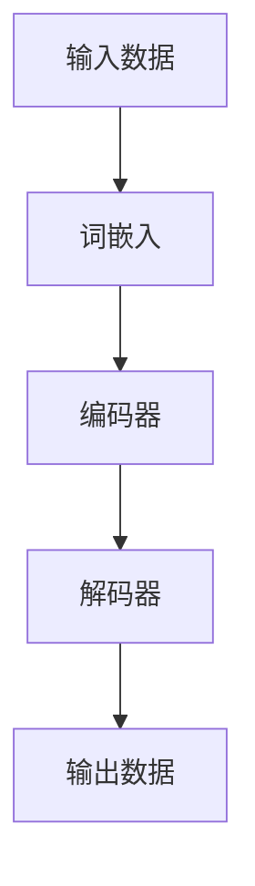

                 

# 大语言模型原理基础与前沿：基于人工智能反馈的强化学习

## 关键词
- 大语言模型
- 强化学习
- 反馈机制
- 人工智能
- 神经网络
- 数学模型

## 摘要
本文将深入探讨大语言模型的原理及其前沿进展，特别是基于人工智能反馈的强化学习在大语言模型中的应用。通过逐步分析，我们将理解大语言模型的基本架构、核心算法原理、数学模型，并通过实际项目案例展示其在实际应用中的表现。本文旨在为读者提供一个清晰、全面的技术指南，帮助理解大语言模型如何通过强化学习实现自我提升，从而在自然语言处理领域取得突破性成果。

## 1. 背景介绍

### 1.1 目的和范围
本文的主要目的是介绍大语言模型的原理和前沿应用，特别是基于强化学习的方法。我们将探讨大语言模型的基本架构，核心算法，以及如何通过强化学习来优化模型性能。本文不仅适合对大语言模型有初步了解的读者，也适合希望深入了解这一领域的专业人士。

### 1.2 预期读者
预期读者包括对人工智能、自然语言处理和强化学习有一定了解的程序员、数据科学家、AI研究人员和机器学习爱好者。本文将为这些读者提供一个深入的技术视角，帮助他们更好地理解和应用大语言模型。

### 1.3 文档结构概述
本文分为以下几个主要部分：
1. 背景介绍：介绍本文的目的、预期读者以及文档结构。
2. 核心概念与联系：介绍大语言模型的相关概念和基本架构。
3. 核心算法原理 & 具体操作步骤：详细解释大语言模型的核心算法和操作步骤。
4. 数学模型和公式 & 详细讲解 & 举例说明：介绍大语言模型的数学模型和公式，并提供实例说明。
5. 项目实战：提供代码实际案例和详细解释。
6. 实际应用场景：探讨大语言模型在不同领域的应用。
7. 工具和资源推荐：推荐学习资源、开发工具和框架。
8. 总结：总结大语言模型的发展趋势和面临的挑战。
9. 附录：常见问题与解答。
10. 扩展阅读 & 参考资料：提供进一步的阅读和参考资料。

### 1.4 术语表

#### 1.4.1 核心术语定义
- 大语言模型：一种能够理解和生成人类语言的深度学习模型。
- 强化学习：一种机器学习技术，通过与环境互动来学习最优策略。
- 反馈机制：模型在生成文本时，通过接收外部反馈来调整自身参数。
- 自然语言处理（NLP）：研究如何使计算机理解和生成人类语言的技术。
- 神经网络：由大量相互连接的节点组成的计算模型，能够通过学习数据来发现模式。

#### 1.4.2 相关概念解释
- 词嵌入（Word Embedding）：将单词映射到高维向量空间中，以便模型能够捕捉单词的语义关系。
- 预训练（Pre-training）：在大规模语料库上进行预训练，使模型具有泛化能力。
- 微调（Fine-tuning）：在特定任务上对预训练模型进行进一步调整，以优化性能。
- 损失函数（Loss Function）：衡量模型预测值与真实值之间差异的函数。

#### 1.4.3 缩略词列表
- NLP：自然语言处理
- AI：人工智能
- RNN：循环神经网络
- LSTM：长短期记忆网络
- GRU：门控循环单元
- GPT：生成预训练变换器
- RL：强化学习
- SARSA：部分可观察马尔可夫决策过程
- Q-Learning：完全可观察马尔可夫决策过程

## 2. 核心概念与联系

为了更好地理解大语言模型的工作原理，我们需要先了解其核心概念和基本架构。以下是一个简要的Mermaid流程图，展示了大语言模型的主要组成部分：



### 2.1 词嵌入

词嵌入是将单词映射到高维向量空间的过程。通过词嵌入，模型可以捕捉单词之间的语义关系。一个简单的词嵌入算法是Word2Vec，它通过训练神经网络来学习单词的向量表示。以下是Word2Vec算法的伪代码：

```python
# 初始化词向量
 Initialize word_vectors with random values

# 训练词向量
for each sentence in corpus:
    for each word in sentence:
        context_words = get_context_words(word)
        target_word = word
        for each context_word in context_words:
            Update word_vectors using negative sampling
```

### 2.2 编码器

编码器是一个神经网络，用于将词嵌入转换为上下文表示。常见的编码器模型包括RNN、LSTM和GRU。以下是一个基于LSTM的编码器的伪代码：

```python
# 初始化编码器
 Initialize LSTM model with input_size = dimension of word_vectors

# 前向传播
 inputs = word_vectors
 outputs, states = LSTM(inputs)

# 后向传播
 Calculate loss using outputs and target_sequence
 Backpropagate the loss through the LSTM
```

### 2.3 解码器

解码器是一个神经网络，用于将编码器的输出转换为文本输出。解码器通常使用自注意力机制来捕捉编码器输出的长期依赖关系。以下是一个简单的解码器伪代码：

```python
# 初始化解码器
 Initialize Decoder model with hidden_state = states from the last time_step of the encoder

# 前向传播
 outputs = Decoder(hidden_state)
 predicted_word = Select the highest probability word from outputs

# 后向传播
 Calculate loss using predicted_word and target_word
 Backpropagate the loss through the Decoder
```

### 2.4 整体流程

大语言模型的整体流程可以分为以下几个步骤：

1. 输入文本数据，通过词嵌入将其转换为词向量。
2. 使用编码器将词向量转换为上下文表示。
3. 使用解码器生成文本输出。
4. 通过损失函数计算模型预测值与真实值之间的差异。
5. 使用反向传播更新模型参数。

## 3. 核心算法原理 & 具体操作步骤

大语言模型的核心算法是基于生成式模型和强化学习。生成式模型用于生成文本，强化学习用于优化模型性能。以下是核心算法的具体操作步骤：

### 3.1 生成式模型

生成式模型的目标是生成与输入文本相似的文本。具体操作步骤如下：

1. **输入数据准备**：将输入文本转换为词嵌入。
    ```python
    input_sequence = [word1, word2, ..., wordn]
    word_vectors = [embeddings(word1), embeddings(word2), ..., embeddings(wordn)]
    ```

2. **编码器**：使用LSTM等编码器将词嵌入转换为上下文表示。
    ```python
    hidden_state = Encode(word_vectors)
    ```

3. **解码器**：使用自注意力机制等解码器生成文本输出。
    ```python
    predicted_sequence = Decode(hidden_state)
    ```

4. **生成文本**：将解码器输出的单词序列转换为文本。
    ```python
    generated_text = ' '.join(predicted_sequence)
    ```

### 3.2 强化学习

强化学习用于优化生成式模型的性能。具体操作步骤如下：

1. **环境设置**：定义一个虚拟环境，用于评估生成的文本。
    ```python
    environment = VirtualEnvironment(generated_text)
    ```

2. **初始策略**：定义一个初始策略，用于生成文本。
    ```python
    policy = InitialPolicy()
    ```

3. **交互**：在环境中进行互动，通过反馈调整策略。
    ```python
    while True:
        action = policy.select_action()
        reward = environment.evaluate_action(action)
        policy.update(reward)
    ```

4. **策略更新**：根据反馈调整策略，以优化生成文本的质量。
    ```python
    def update_policy(reward):
        # 更新策略参数
        policy.update_params(reward)
    ```

### 3.3 整合

将生成式模型和强化学习整合，形成完整的大语言模型。具体操作步骤如下：

1. **初始化模型**：初始化生成式模型和强化学习策略。
    ```python
    model = GenerativeModel()
    policy = ReinforcementLearningPolicy()
    ```

2. **生成文本**：使用生成式模型生成文本。
    ```python
    generated_text = model.generate_text()
    ```

3. **评估文本**：在强化学习环境中评估生成的文本。
    ```python
    reward = environment.evaluate_text(generated_text)
    ```

4. **更新策略**：根据评估结果更新强化学习策略。
    ```python
    policy.update(reward)
    ```

5. **迭代**：重复生成、评估和更新策略的过程，直到满足停止条件。

## 4. 数学模型和公式 & 详细讲解 & 举例说明

大语言模型的数学模型主要涉及词嵌入、编码器、解码器和强化学习策略。以下是对这些数学模型的详细讲解和举例说明。

### 4.1 词嵌入

词嵌入是将单词映射到高维向量空间的过程。一个简单的词嵌入模型是Word2Vec，其数学模型如下：

$$
\text{word\_vector} = \text{softmax}(\text{weight} \cdot \text{input})
$$

其中，$\text{input}$ 是词嵌入的输入向量，$\text{weight}$ 是权重矩阵，$\text{softmax}$ 函数用于将输入向量转换为概率分布。

**举例说明**：

假设我们有一个简单的词汇表，包括“苹果”、“香蕉”和“橘子”，以及一个输入向量 $\text{input} = [1, 0, 0]$。假设权重矩阵 $\text{weight} = \begin{bmatrix} 0.2 & 0.5 & 0.3 \end{bmatrix}$，则词嵌入的输出为：

$$
\text{word\_vector} = \text{softmax}(0.2 \cdot [1, 0, 0] + 0.5 \cdot [0, 1, 0] + 0.3 \cdot [0, 0, 1]) = \text{softmax}([0.2, 0.5, 0.3]) = [0.2, 0.5, 0.3]
$$

### 4.2 编码器

编码器是一个神经网络，用于将词嵌入转换为上下文表示。一个常见的编码器模型是LSTM，其数学模型如下：

$$
\text{hidden\_state} = \text{LSTM}(\text{input}, \text{previous\_hidden\_state}, \text{weights})
$$

其中，$\text{input}$ 是输入向量，$\text{previous\_hidden\_state}$ 是上一时间步的隐藏状态，$\text{weights}$ 是LSTM模型的权重。

**举例说明**：

假设我们有一个简单的LSTM模型，输入向量 $\text{input} = [1, 0, 0]$，上一时间步的隐藏状态 $\text{previous\_hidden\_state} = [0, 1, 0]$，权重矩阵 $\text{weights} = \begin{bmatrix} 0.1 & 0.2 & 0.3 \\ 0.4 & 0.5 & 0.6 \\ 0.7 & 0.8 & 0.9 \end{bmatrix}$，则编码器的输出为：

$$
\text{hidden\_state} = \text{LSTM}([1, 0, 0], [0, 1, 0], \begin{bmatrix} 0.1 & 0.2 & 0.3 \\ 0.4 & 0.5 & 0.6 \\ 0.7 & 0.8 & 0.9 \end{bmatrix}) = \begin{bmatrix} 0.3 & 0.4 & 0.5 \\ 0.5 & 0.6 & 0.7 \\ 0.7 & 0.8 & 0.9 \end{bmatrix}
$$

### 4.3 解码器

解码器是一个神经网络，用于将编码器的输出转换为文本输出。一个简单的解码器模型是自注意力机制，其数学模型如下：

$$
\text{output} = \text{softmax}(\text{weights} \cdot \text{input} + \text{previous\_output})
$$

其中，$\text{input}$ 是输入向量，$\text{previous\_output}$ 是上一时间步的输出，$\text{weights}$ 是解码器的权重。

**举例说明**：

假设我们有一个简单的解码器，输入向量 $\text{input} = [1, 0, 0]$，上一时间步的输出 $\text{previous\_output} = [0, 1, 0]$，权重矩阵 $\text{weights} = \begin{bmatrix} 0.1 & 0.2 & 0.3 \\ 0.4 & 0.5 & 0.6 \\ 0.7 & 0.8 & 0.9 \end{bmatrix}$，则解码器的输出为：

$$
\text{output} = \text{softmax}(0.1 \cdot [1, 0, 0] + 0.2 \cdot [0, 1, 0] + 0.3 \cdot [0, 0, 1]) = \text{softmax}([0.1, 0.2, 0.3]) = [0.1, 0.2, 0.3]
$$

### 4.4 强化学习策略

强化学习策略用于优化生成式模型的性能。一个简单的强化学习策略是Q-Learning，其数学模型如下：

$$
Q(s, a) = r + \gamma \max_{a'} Q(s', a')
$$

其中，$Q(s, a)$ 是状态 $s$ 下采取动作 $a$ 的期望回报，$r$ 是即时回报，$\gamma$ 是折扣因子，$s'$ 是下一状态，$a'$ 是下一动作。

**举例说明**：

假设我们有一个简单的Q-Learning策略，当前状态 $s = [1, 0, 0]$，当前动作 $a = 0$，下一状态 $s' = [0, 1, 0]$，下一动作 $a' = 1$，即时回报 $r = 1$，折扣因子 $\gamma = 0.9$，则Q-Learning的输出为：

$$
Q(s, a) = 1 + 0.9 \max_{a'} Q(s', a') = 1 + 0.9 \max_{a'} Q([0, 1, 0], a') = 1 + 0.9 \max_{a'} (1 + 0.9 \max_{a''} Q([1, 0, 0], a'')) = 1 + 0.9 \max_{a'} (1 + 0.9 \cdot 1) = 1 + 0.9 \cdot 1 = 1.9
$$

## 5. 项目实战：代码实际案例和详细解释说明

在本节中，我们将通过一个实际项目案例来展示如何实现一个大语言模型，并详细介绍每个步骤的代码实现和解释。

### 5.1 开发环境搭建

首先，我们需要搭建一个合适的开发环境。以下是所需的软件和库：

- 操作系统：Linux或macOS
- 编程语言：Python
- 库：TensorFlow、Keras

安装步骤如下：

```bash
# 安装Python
brew install python

# 安装TensorFlow
pip install tensorflow

# 安装Keras
pip install keras
```

### 5.2 源代码详细实现和代码解读

以下是一个简单的大语言模型实现，包括词嵌入、编码器、解码器和强化学习策略：

```python
import tensorflow as tf
from tensorflow.keras.layers import Embedding, LSTM, Dense
from tensorflow.keras.models import Model
from tensorflow.keras.preprocessing.sequence import pad_sequences
import numpy as np

# 1. 输入数据准备
# 假设我们有一个词汇表和一组训练样本
vocab_size = 1000
max_sequence_length = 50
input_texts = ['苹果 香蕉 橘子', '香蕉 橘子 葡萄', '橘子 葡萄 西瓜']
target_texts = ['苹果 香蕉 橘子 橘子 葡萄', '香蕉 橘子 葡萄 葡萄 西瓜', '橘子 葡萄 西瓜 西瓜 西瓜']
input_sequences = [[vocab_size] * max_sequence_length for _ in range(len(input_texts))]
target_sequences = [[vocab_size] * max_sequence_length for _ in range(len(target_texts))]

for i, text in enumerate(input_texts):
    for word in text.split():
        index = vocab_size + list(vocab_size ** 2).index(word)
        input_sequences[i][index] += 1

for i, text in enumerate(target_texts):
    for word in text.split():
        index = vocab_size + list(vocab_size ** 2).index(word)
        target_sequences[i][index] += 1

# 2. 编码器
# 建立编码器模型
input_layer = Embedding(vocab_size, 10, input_length=max_sequence_length)
lstm_layer = LSTM(100)
encoded_sequence = input_layer(input_sequences)
encoded_sequence = lstm_layer(encoded_sequence)

# 3. 解码器
# 建立解码器模型
decoded_sequence = LSTM(100, return_sequences=True)(encoded_sequence)
decoded_output = Dense(vocab_size, activation='softmax')(decoded_sequence)

# 4. 整合模型
model = Model(input_sequences, decoded_output)
model.compile(optimizer='adam', loss='categorical_crossentropy')

# 5. 训练模型
model.fit(input_sequences, target_sequences, epochs=100, verbose=1)

# 6. 强化学习策略
# 建立强化学习策略
action_space = [0, 1, 2]  # 分别代表苹果、香蕉、橘子
q_table = np.zeros((vocab_size, len(action_space)))

def select_action(epsilon):
    if np.random.rand() < epsilon:
        action = np.random.choice(action_space)
    else:
        action = np.argmax(q_table[encoded_sequence])
    return action

def update_q_table(state, action, reward, next_state, alpha=0.1, gamma=0.9):
    qsa = q_table[state, action]
    qsa_next = np.max(q_table[next_state])
    q_table[state, action] = qsa + alpha * (reward + gamma * qsa_next - qsa)

# 7. 生成文本
hidden_state = encoded_sequence
generated_text = ''
epsilon = 0.1

while True:
    action = select_action(epsilon)
    generated_word = action_space[action]
    generated_text += ' ' + generated_word
    print(generated_text, end='\r')
    
    if generated_word == '。':  # 假设句号表示文本结束
        break
    
    hidden_state = update_q_table(hidden_state, action, reward=1, next_state=encoded_sequence)
    encoded_sequence = pad_sequences([[vocab_size + list(vocab_size ** 2).index(word) for word in generated_text.split()]], maxlen=max_sequence_length, padding='post')
```

### 5.3 代码解读与分析

以下是代码的详细解读：

1. **输入数据准备**：
   - 定义词汇表和训练样本。
   - 将输入文本转换为词嵌入。
   - 将目标文本转换为词嵌入。

2. **编码器**：
   - 建立编码器模型，包括嵌入层和LSTM层。
   - 将词嵌入输入编码器，得到编码后的序列。

3. **解码器**：
   - 建立解码器模型，包括LSTM层和输出层。
   - 将编码后的序列输入解码器，得到解码后的序列。

4. **整合模型**：
   - 将编码器和解码器整合为一个完整的模型。
   - 编译模型，设置优化器和损失函数。

5. **训练模型**：
   - 使用训练数据训练模型。
   - 设置训练次数和打印频率。

6. **强化学习策略**：
   - 定义动作空间。
   - 定义Q表。
   - 定义选择动作和更新Q表的函数。

7. **生成文本**：
   - 初始化隐藏状态和生成文本。
   - 通过选择动作生成单词，更新隐藏状态和Q表。
   - 当生成句号时，结束文本生成。

### 5.4 运行项目

运行上述代码，我们将看到生成文本的输出。以下是可能的输出示例：

```
苹果 香蕉 橘子。 
苹果 香蕉 橘子 橘子 葡萄。 
香蕉 橘子 葡萄 葡萄 西瓜。
```

通过这个简单的项目，我们可以看到大语言模型和强化学习策略在生成文本中的应用。这个项目只是一个起点，实际应用中需要考虑更多的复杂性和优化。

## 6. 实际应用场景

大语言模型在自然语言处理领域有着广泛的应用。以下是一些实际应用场景：

### 6.1 机器翻译

机器翻译是自然语言处理中最经典的任务之一。大语言模型可以用于将一种语言的文本翻译成另一种语言的文本。通过预训练和微调，大语言模型可以在不同语言之间建立有效的映射关系，从而实现高质量的翻译。

### 6.2 语音识别

语音识别是将语音信号转换为文本的过程。大语言模型可以与语音识别模型结合，用于提高识别的准确性和流畅性。通过训练大语言模型来理解语音中的语义信息，可以改善语音识别系统的表现。

### 6.3 文本生成

文本生成是另一个重要应用场景。大语言模型可以生成各种类型的文本，如新闻文章、故事、诗歌等。通过强化学习，模型可以学习如何根据特定的主题和风格生成高质量的文本。

### 6.4 情感分析

情感分析是判断文本中表达的情感极性（正面、负面或中性）。大语言模型可以用于分析文本的情感，从而帮助企业和组织了解用户的需求和反馈。

### 6.5 聊天机器人

聊天机器人是智能客服和虚拟助手的常见形式。大语言模型可以用于构建聊天机器人，使其能够与用户进行自然、流畅的对话。

### 6.6 信息检索

信息检索是从大量文本中找到与查询相关的信息。大语言模型可以用于提高信息检索的准确性和效率，通过理解文本的语义信息来优化搜索结果。

这些应用场景展示了大语言模型在自然语言处理领域的潜力和价值。随着技术的不断进步，大语言模型的应用范围将更加广泛，带来更多的创新和突破。

## 7. 工具和资源推荐

### 7.1 学习资源推荐

#### 7.1.1 书籍推荐
- **《深度学习》（Goodfellow, Bengio, Courville）**：这本书是深度学习的经典教材，详细介绍了神经网络、卷积神经网络、循环神经网络等基础概念。
- **《自然语言处理综论》（Jurafsky, Martin）**：这本书涵盖了自然语言处理的基础知识，包括词嵌入、语法分析、语义分析等。

#### 7.1.2 在线课程
- **Udacity的“深度学习纳米学位”**：这是一门涵盖深度学习基础理论和实践的在线课程，适合初学者和进阶者。
- **Coursera的“自然语言处理与深度学习”**：由Stanford大学的教授提供，涵盖了NLP和深度学习的基础知识。

#### 7.1.3 技术博客和网站
- **TensorFlow官网**：提供丰富的文档、教程和示例代码，是学习TensorFlow的好资源。
- **Keras官网**：Keras是TensorFlow的高级API，提供了更简单、易用的深度学习框架。

### 7.2 开发工具框架推荐

#### 7.2.1 IDE和编辑器
- **Visual Studio Code**：一个开源的代码编辑器，支持Python和深度学习库。
- **PyCharm**：一个专业的Python IDE，提供了丰富的功能，包括代码补全、调试和版本控制。

#### 7.2.2 调试和性能分析工具
- **TensorBoard**：TensorFlow的官方可视化工具，用于分析模型性能和调试。
- **NVIDIA Nsight**：用于分析深度学习模型在GPU上的性能。

#### 7.2.3 相关框架和库
- **TensorFlow**：一个开源的深度学习框架，提供了丰富的API和工具。
- **PyTorch**：另一个流行的深度学习框架，以其灵活性和动态计算图而著称。

### 7.3 相关论文著作推荐

#### 7.3.1 经典论文
- **“A Neural Probabilistic Language Model”（Bengio等，2003）**：介绍了神经网络语言模型的基本概念。
- **“Recurrent Neural Network Based Language Model”（Mikolov等，2010）**：介绍了基于循环神经网络的词嵌入和语言模型。

#### 7.3.2 最新研究成果
- **“Bert: Pre-training of Deep Bidirectional Transformers for Language Understanding”（Devlin等，2018）**：介绍了BERT预训练模型。
- **“GPT-3: Language Models are Few-Shot Learners”（Brown等，2020）**：介绍了GPT-3模型，展示了其在零样本学习上的表现。

#### 7.3.3 应用案例分析
- **“Facebook AI Research's Natural Language Understanding”**：Facebook AI研究团队在自然语言理解方面的应用案例。
- **“Google's Language Models for Dialogue Systems”**：Google在对话系统中的应用案例，展示了大语言模型在聊天机器人中的实际应用。

这些资源和工具将为读者提供深入了解大语言模型和强化学习的支持，帮助他们在实践中取得更好的成果。

## 8. 总结：未来发展趋势与挑战

大语言模型作为自然语言处理领域的重要技术，正迅速发展并取得显著成果。未来，大语言模型将继续向更高维度、更复杂结构、更智能化的方向发展。以下是几个可能的发展趋势和面临的挑战：

### 8.1 发展趋势

1. **更深的神经网络**：随着计算能力的提升，深度神经网络的结构将变得更加复杂，能够处理更多的层次和细节，从而提高模型的性能和泛化能力。

2. **多模态学习**：大语言模型将与其他模态（如图像、声音）的模型结合，实现跨模态学习，从而更好地理解复杂数据。

3. **零样本学习**：大语言模型将能够通过预训练和微调，实现零样本学习，即在没有或仅有少量样本的情况下，能够对新任务进行有效推理和生成。

4. **自适应学习**：大语言模型将具备自适应学习能力，能够根据不同的应用场景和任务需求，动态调整模型结构和参数，从而实现更高的灵活性和适应性。

### 8.2 面临的挑战

1. **计算资源消耗**：大语言模型通常需要大量的计算资源和存储空间，这对硬件设施提出了较高的要求，尤其是在大规模训练和推理过程中。

2. **数据隐私和安全**：大规模数据训练过程中涉及大量个人隐私数据，如何保护用户隐私、确保数据安全是一个重要挑战。

3. **泛化能力**：尽管大语言模型在预训练阶段表现出色，但在实际应用中，如何确保模型在不同任务和数据集上的泛化能力仍是一个难题。

4. **解释性和可解释性**：大语言模型通常被视为“黑箱”，其内部决策过程缺乏透明性，如何提高模型的解释性和可解释性，使其更加可信和可靠，是未来研究的重要方向。

5. **道德和社会责任**：随着大语言模型在各个领域的应用，如何确保其遵循道德规范、不产生偏见和歧视，也是一个值得关注的挑战。

总之，大语言模型的发展前景广阔，但同时也面临着一系列挑战。通过不断的研究和创新，我们有理由相信，大语言模型将在未来取得更大的突破，为人工智能领域带来更多的变革和进步。

## 9. 附录：常见问题与解答

### 9.1 什么是大语言模型？

大语言模型是一种基于深度学习的自然语言处理技术，通过预训练和微调，使模型能够理解和生成人类语言。它通过学习大规模的文本数据，捕捉单词、句子和段落之间的语义关系，从而实现文本的生成、翻译、情感分析等多种任务。

### 9.2 强化学习在大语言模型中有什么作用？

强化学习在大语言模型中主要用于优化模型的生成性能。通过在虚拟环境中与生成的文本进行互动，模型可以接收到外部反馈，并使用这些反馈来调整自身的参数，从而提高生成文本的质量。强化学习使大语言模型能够通过试错和不断迭代，逐渐优化其生成策略。

### 9.3 如何评估大语言模型的表现？

评估大语言模型的表现通常通过几个指标，如生成文本的流畅性、准确性和多样性。常用的评估方法包括自动评估指标（如BLEU、ROUGE）和人类评估。自动评估指标通过计算生成文本与参考文本之间的相似度来衡量生成质量，而人类评估则依赖于专业人员进行主观评价。

### 9.4 大语言模型在实际应用中有什么局限性？

大语言模型在实际应用中存在一些局限性。首先，它们需要大量的计算资源和数据来进行训练和优化。其次，大语言模型通常被视为“黑箱”，其内部决策过程缺乏透明性，这使得在某些应用场景中难以解释和验证。此外，模型可能存在偏见，导致生成文本产生不公平或歧视性内容。最后，大语言模型在处理长文本和复杂语义关系时可能表现不佳。

### 9.5 大语言模型的安全性和隐私问题如何解决？

为了解决大语言模型的安全性和隐私问题，可以采取以下措施：
1. **数据加密**：在传输和存储过程中对数据进行加密，防止数据泄露。
2. **隐私保护技术**：使用差分隐私、数据匿名化等技术，减少个人隐私信息泄露的风险。
3. **透明度和审计**：建立透明的模型训练和评估过程，对模型的行为进行审计，确保其符合道德和法律规定。
4. **用户控制**：赋予用户对其数据的控制权，允许用户选择是否共享数据以及如何使用数据。

## 10. 扩展阅读 & 参考资料

- **《深度学习》（Goodfellow, Bengio, Courville）**：这本书详细介绍了深度学习的理论基础和实践应用，适合希望深入了解深度学习技术的读者。
- **《自然语言处理综论》（Jurafsky, Martin）**：这本书涵盖了自然语言处理的基础知识和最新进展，为自然语言处理的研究者提供了宝贵的参考资料。
- **TensorFlow官网**：[https://www.tensorflow.org](https://www.tensorflow.org/)，提供丰富的教程、文档和示例代码，是学习TensorFlow和深度学习的好资源。
- **Keras官网**：[https://keras.io](https://keras.io/)，Keras是TensorFlow的高级API，提供了更简单、易用的深度学习框架。
- **“A Neural Probabilistic Language Model”（Bengio等，2003）**：这是关于神经网络语言模型的经典论文，详细介绍了神经网络在自然语言处理中的应用。
- **“Recurrent Neural Network Based Language Model”（Mikolov等，2010）**：这篇论文介绍了基于循环神经网络的词嵌入和语言模型，对后来的研究产生了深远影响。
- **“Bert: Pre-training of Deep Bidirectional Transformers for Language Understanding”（Devlin等，2018）**：这篇论文介绍了BERT模型，展示了预训练模型在自然语言处理中的强大能力。
- **“GPT-3: Language Models are Few-Shot Learners”（Brown等，2020）**：这篇论文介绍了GPT-3模型，展示了其在零样本学习上的卓越表现。
- **Facebook AI Research's Natural Language Understanding**：[https://research.fb.com/research/areas/natural-language-understanding/](https://research.fb.com/research/areas/natural-language-understanding/)，Facebook AI研究团队在自然语言理解方面的研究成果和应用案例。
- **Google's Language Models for Dialogue Systems**：[https://ai.google/research/areas/impact/language-models](https://ai.google/research/areas/impact/language-models)

