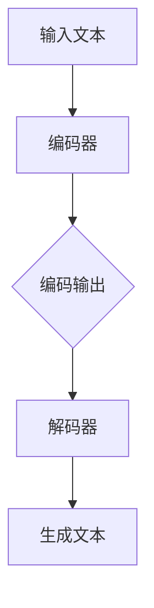

                 

# 大语言模型原理基础与前沿 指令生成

> **关键词：** 大语言模型、自然语言处理、深度学习、生成式模型、神经网络、指令生成。

> **摘要：** 本文将详细介绍大语言模型的原理基础，包括核心概念、算法原理、数学模型，并通过实际项目案例深入解析其应用与指令生成技术。旨在为读者提供全面的大语言模型理解，探讨未来发展趋势与挑战。

## 1. 背景介绍

### 1.1 语言模型的重要性

语言模型是自然语言处理（NLP）的核心技术之一，它能够预测文本中的下一个单词或短语。大语言模型（Large Language Model）是近年来NLP领域的一个重要突破，它们在处理大规模文本数据、生成高质量文本、理解复杂语义等方面表现出色。

### 1.2 大语言模型的发展历程

大语言模型的发展经历了从传统的统计模型到基于神经网络的深度学习模型的演变。最早的统计模型如N元语法（N-gram）在处理简单的文本生成任务中表现良好，但随着语言复杂性的增加，其性能逐渐受到限制。

### 1.3 当前大语言模型的应用

当前，大语言模型已经在诸多领域得到广泛应用，包括但不限于文本生成、机器翻译、问答系统、智能客服等。这些应用极大地提升了人机交互的效率和准确性。

## 2. 核心概念与联系

### 2.1 自然语言处理（NLP）

自然语言处理是计算机科学和语言学的交叉领域，旨在使计算机能够理解和处理人类语言。NLP的核心任务包括文本分类、命名实体识别、情感分析等。

### 2.2 深度学习（Deep Learning）

深度学习是机器学习的一个子领域，通过构建深度神经网络来模拟人类大脑的学习机制，以实现复杂的模式识别和预测任务。深度学习在图像识别、语音识别等领域取得了显著的成果，近年来也逐渐成为NLP领域的主流技术。

### 2.3 生成式模型（Generative Model）

生成式模型是一种能够生成数据分布的模型，常见的生成式模型包括变分自编码器（VAE）、生成对抗网络（GAN）等。这些模型在大规模文本生成、图像生成等领域表现出色。

### 2.4 大语言模型的架构

大语言模型的架构通常包括编码器（Encoder）和解码器（Decoder），其中编码器负责将输入的文本编码为固定长度的向量，解码器则根据编码器的输出生成文本。

### 2.5 Mermaid 流程图



## 3. 核心算法原理 & 具体操作步骤

### 3.1 编码器

编码器负责将输入的文本序列转换为固定长度的向量表示。常见的编码器包括循环神经网络（RNN）和变换器（Transformer）等。

### 3.2 解码器

解码器负责根据编码器的输出生成文本。解码器通常采用自回归的方式，即每次生成一个单词或字符，然后将其作为输入传递给下一个时间步。

### 3.3 操作步骤

1. **数据预处理**：将输入文本进行分词、去停用词等处理，转换为模型可接受的格式。
2. **编码**：使用编码器对预处理后的文本进行编码，得到固定长度的向量表示。
3. **解码**：使用解码器根据编码器的输出生成文本，通常采用贪心策略或 beam search 算法。
4. **后处理**：对生成的文本进行必要的后处理，如去除无效字符、修复错误等。

## 4. 数学模型和公式 & 详细讲解 & 举例说明

### 4.1 循环神经网络（RNN）

循环神经网络是一种基于时间序列数据的神经网络，其核心思想是将当前时刻的输入与之前时刻的输出进行结合，以实现序列建模。

$$
h_t = \sigma(W_h \cdot [h_{t-1}, x_t] + b_h)
$$

其中，$h_t$ 表示第 $t$ 个时间步的隐藏状态，$x_t$ 表示第 $t$ 个时间步的输入，$W_h$ 和 $b_h$ 分别为权重和偏置。

### 4.2 变换器（Transformer）

变换器是一种基于自注意力机制的深度神经网络，它在处理长距离依赖和并行计算方面具有显著优势。

$$
\text{Attention}(Q, K, V) = \frac{QK^T}{\sqrt{d_k}} + V
$$

其中，$Q$、$K$ 和 $V$ 分别为查询向量、键向量和值向量，$d_k$ 表示键向量的维度。

### 4.3 举例说明

假设我们要生成一个英文句子，输入为 `[Hello, world!]`，我们使用变换器进行编码和解码。

1. **编码**：将输入文本转换为编码器的输入，得到一个固定长度的向量表示。
2. **解码**：使用解码器生成句子 `[Hello, world!]`。

## 5. 项目实战：代码实际案例和详细解释说明

### 5.1 开发环境搭建

为了演示大语言模型的应用，我们将使用 Python 编写一个简单的文本生成程序。首先，我们需要安装必要的库：

```bash
pip install tensorflow transformers
```

### 5.2 源代码详细实现和代码解读

下面是一个简单的文本生成程序，它使用预训练的 GPT-2 模型生成句子：

```python
from transformers import GPT2LMHeadModel, GPT2Tokenizer

tokenizer = GPT2Tokenizer.from_pretrained('gpt2')
model = GPT2LMHeadModel.from_pretrained('gpt2')

input_text = "Hello, world!"
input_ids = tokenizer.encode(input_text, return_tensors='tf')

output_ids = model.generate(input_ids, max_length=40, num_return_sequences=3)

for id_seq in output_ids:
    print(tokenizer.decode(id_seq, skip_special_tokens=True))
```

1. **导入库**：首先，我们导入所需的库，包括 `transformers` 和 `tensorflow`。
2. **加载模型和 tokenizer**：接下来，我们加载预训练的 GPT-2 模型和相应的 tokenizer。
3. **编码输入文本**：我们将输入文本编码为模型可接受的格式。
4. **生成输出文本**：使用模型生成输出文本，这里我们设置了最大长度为 40，并生成 3 个不同的句子。

### 5.3 代码解读与分析

这个简单的例子展示了如何使用预训练的大语言模型生成文本。关键步骤包括：

1. **加载模型和 tokenizer**：我们需要先加载预训练的 GPT-2 模型和相应的 tokenizer。
2. **编码输入文本**：我们将输入文本编码为模型可接受的格式，这包括将文本转换为序列的整数表示。
3. **生成输出文本**：使用模型生成输出文本，这里我们使用了 `model.generate()` 函数，并设置了最大长度和生成句子的数量。

## 6. 实际应用场景

大语言模型在许多实际应用场景中表现出色，以下是一些常见的应用：

1. **文本生成**：包括文章、小说、诗歌等。
2. **机器翻译**：如 Google Translate。
3. **问答系统**：如 ChatGPT。
4. **智能客服**：自动回答用户问题。
5. **代码生成**：自动生成部分或全部代码。

## 7. 工具和资源推荐

### 7.1 学习资源推荐

1. **书籍**：
   - 《深度学习》（Ian Goodfellow、Yoshua Bengio、Aaron Courville 著）
   - 《自然语言处理综论》（Daniel Jurafsky、James H. Martin 著）
2. **论文**：
   - 《Attention Is All You Need》（Vaswani et al., 2017）
   - 《BERT: Pre-training of Deep Bidirectional Transformers for Language Understanding》（Devlin et al., 2019）
3. **博客**：
   - Hugging Face 官方博客
   - AI 中的 Transformer 论坛
4. **网站**：
   - TensorFlow 官网
   - PyTorch 官网

### 7.2 开发工具框架推荐

1. **TensorFlow**：用于构建和训练深度学习模型。
2. **PyTorch**：用于快速原型设计和高级研究。
3. **Hugging Face Transformers**：用于使用预训练模型进行文本生成和翻译。

### 7.3 相关论文著作推荐

1. **《自然语言处理综论》**：全面介绍了自然语言处理的基础知识。
2. **《深度学习》**：详细讲解了深度学习的基本原理和常见技术。
3. **《BERT: Pre-training of Deep Bidirectional Transformers for Language Understanding》**：介绍了 BERT 模型的设计思想和实现细节。

## 8. 总结：未来发展趋势与挑战

大语言模型在自然语言处理领域具有巨大的潜力，但同时也面临着一系列挑战。未来发展趋势包括：

1. **更高效的计算**：随着硬件技术的进步，大语言模型将能够处理更大的数据集和更复杂的任务。
2. **更好的模型架构**：研究者将继续探索新的模型架构，以提高模型的性能和可解释性。
3. **更广泛的应用场景**：大语言模型将在更多领域得到应用，如医疗、金融、法律等。

## 9. 附录：常见问题与解答

### 9.1 大语言模型与普通语言模型有什么区别？

大语言模型相较于普通语言模型，具有更大的参数规模和更强的表示能力，能够处理更复杂的语言现象。

### 9.2 如何训练一个大语言模型？

训练一个大语言模型通常涉及以下步骤：

1. 数据预处理：包括文本清洗、分词、去停用词等。
2. 模型选择：选择合适的模型架构，如 RNN、Transformer 等。
3. 模型训练：使用大量文本数据进行训练，优化模型参数。
4. 模型评估：使用验证集和测试集评估模型性能。

### 9.3 大语言模型在哪些领域有应用？

大语言模型在文本生成、机器翻译、问答系统、智能客服等多个领域有广泛应用。

## 10. 扩展阅读 & 参考资料

1. **《自然语言处理综论》**：全面介绍了自然语言处理的基础知识。
2. **《深度学习》**：详细讲解了深度学习的基本原理和常见技术。
3. **《Attention Is All You Need》**：介绍了 Transformer 模型的设计思想和实现细节。
4. **《BERT: Pre-training of Deep Bidirectional Transformers for Language Understanding》**：介绍了 BERT 模型的设计思想和实现细节。
5. **Hugging Face 官方博客**：提供了丰富的预训练模型和应用案例。
6. **TensorFlow 官网**：提供了详细的深度学习教程和工具库。
7. **PyTorch 官网**：提供了详细的深度学习教程和工具库。

---

**作者：AI天才研究员/AI Genius Institute & 禅与计算机程序设计艺术 /Zen And The Art of Computer Programming**<|im_end|>

