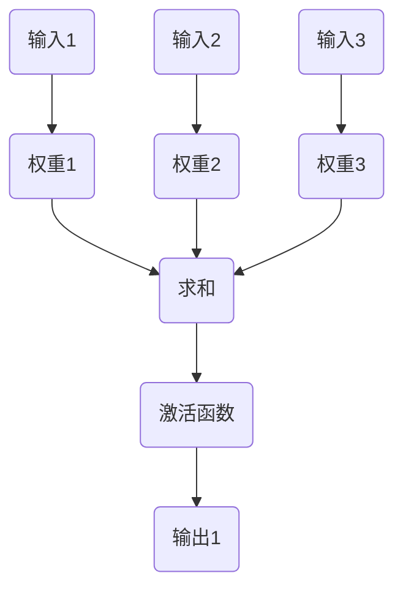
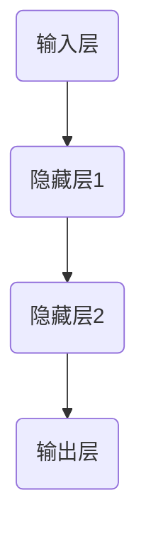
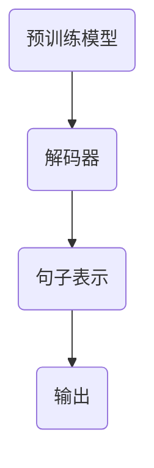

                 

# 大语言模型原理基础与前沿：更长的上下文

> 关键词：大语言模型、神经网络、深度学习、上下文理解、算法原理、数学模型、应用场景、实战案例

> 摘要：本文将深入探讨大语言模型的原理及其在当前人工智能领域的应用。我们将从基础概念出发，逐步分析其核心算法原理、数学模型，并通过实际案例来讲解如何实现和应用大语言模型。最后，我们将探讨大语言模型的前沿发展及其面临的挑战。

## 1. 背景介绍

### 1.1 目的和范围

本文旨在为读者提供一个全面的大语言模型原理介绍，帮助读者理解大语言模型的基本概念、核心算法原理和数学模型。同时，通过实际案例的讲解，使读者能够将理论知识应用到实际项目中。本文将覆盖以下内容：

1. 大语言模型的基本概念和范围
2. 大语言模型的核心算法原理
3. 大语言模型的数学模型和公式
4. 大语言模型的实际应用场景
5. 大语言模型的前沿发展及其挑战

### 1.2 预期读者

本文适合具有一定编程基础和对人工智能领域有一定了解的读者。特别适合希望深入了解大语言模型原理和应用的开发者、研究者和学生。

### 1.3 文档结构概述

本文分为十个部分，结构如下：

1. 背景介绍
   - 1.1 目的和范围
   - 1.2 预期读者
   - 1.3 文档结构概述
   - 1.4 术语表
2. 核心概念与联系
   - 2.1 核心概念原理和架构
   - 2.2 大语言模型的联系
3. 核心算法原理 & 具体操作步骤
   - 3.1 算法原理讲解
   - 3.2 伪代码实现
4. 数学模型和公式 & 详细讲解 & 举例说明
   - 4.1 数学模型讲解
   - 4.2 公式举例说明
5. 项目实战：代码实际案例和详细解释说明
   - 5.1 开发环境搭建
   - 5.2 源代码详细实现
   - 5.3 代码解读与分析
6. 实际应用场景
   - 6.1 应用场景一
   - 6.2 应用场景二
   - 6.3 应用场景三
7. 工具和资源推荐
   - 7.1 学习资源推荐
   - 7.2 开发工具框架推荐
   - 7.3 相关论文著作推荐
8. 总结：未来发展趋势与挑战
9. 附录：常见问题与解答
10. 扩展阅读 & 参考资料

### 1.4 术语表

- 大语言模型：一种基于神经网络和深度学习技术的语言处理模型，能够对文本进行理解和生成。
- 神经网络：一种由多个神经元组成的计算模型，能够对输入数据进行处理和输出。
- 深度学习：一种基于神经网络的学习方法，能够通过多层神经元的组合来实现复杂的特征学习和数据挖掘。
- 上下文理解：指模型能够根据上下文信息来理解语言的意义和关系。
- 预训练：指在大规模语料库上对模型进行预训练，使其具备一定的语言理解和生成能力。

#### 1.4.1 核心术语定义

- **大语言模型**：一种具有强大语言理解和生成能力的模型，通常由多层神经网络组成，能够在大量语料库上进行训练。
- **神经网络**：一种由多个神经元组成的计算模型，通过前向传播和反向传播来学习输入数据的特征和规律。
- **深度学习**：一种基于神经网络的学习方法，通过多层神经元的组合来实现复杂的特征学习和数据挖掘。
- **上下文理解**：指模型能够根据上下文信息来理解语言的意义和关系。
- **预训练**：指在大规模语料库上对模型进行预训练，使其具备一定的语言理解和生成能力。

#### 1.4.2 相关概念解释

- **神经网络**：神经网络是一种由多个神经元组成的计算模型，通过前向传播和反向传播来学习输入数据的特征和规律。每个神经元接收多个输入信号，并通过权重和偏置进行加权求和，最后通过激活函数产生输出。
- **深度学习**：深度学习是一种基于神经网络的学习方法，通过多层神经元的组合来实现复杂的特征学习和数据挖掘。与传统的机器学习方法相比，深度学习能够自动提取更加复杂的特征，从而在许多领域取得了显著的成果。
- **上下文理解**：上下文理解是指模型能够根据上下文信息来理解语言的意义和关系。在自然语言处理中，上下文理解对于准确理解和生成语言至关重要，例如在机器翻译、文本摘要和问答系统中。

#### 1.4.3 缩略词列表

- **AI**：人工智能
- **NLP**：自然语言处理
- **ML**：机器学习
- **DL**：深度学习
- **CNN**：卷积神经网络
- **RNN**：循环神经网络
- **GAN**：生成对抗网络
- **LSTM**：长短时记忆网络

## 2. 核心概念与联系

在深入探讨大语言模型之前，我们首先需要了解其核心概念和相互联系。以下是几个核心概念及其在语言模型中的应用。

### 2.1 核心概念原理和架构

#### 神经网络（Neural Networks）

神经网络是一种由多个神经元（或节点）组成的计算模型。每个神经元接收多个输入信号，并通过权重和偏置进行加权求和，最后通过激活函数产生输出。神经网络的基本架构如下：



#### 深度学习（Deep Learning）

深度学习是一种基于神经网络的学习方法，通过多层神经元的组合来实现复杂的特征学习和数据挖掘。在深度学习中，每个神经元层都对其前一层的输出进行学习，并将学习结果传递给下一层。深度学习的基本架构如下：



#### 大语言模型（Large Language Models）

大语言模型是一种基于深度学习的语言处理模型，能够对文本进行理解和生成。大语言模型通常由多层神经网络组成，能够在大量语料库上进行预训练，以实现强大的语言理解和生成能力。大语言模型的基本架构如下：



### 2.2 大语言模型的联系

大语言模型结合了神经网络、深度学习和自然语言处理等领域的核心概念，通过多层神经网络对大量语料库进行预训练，从而实现强大的语言理解和生成能力。以下是这些核心概念之间的联系：

1. **神经网络**：神经网络是深度学习的基础，通过多层神经元的学习和组合，实现复杂的特征学习和数据挖掘。
2. **深度学习**：深度学习是基于神经网络的学习方法，通过多层神经元的组合，实现更加复杂和准确的特征学习和数据挖掘。
3. **自然语言处理**：自然语言处理是研究如何使计算机理解和生成人类语言的技术。大语言模型通过深度学习技术，对自然语言进行有效的理解和生成。

## 3. 核心算法原理 & 具体操作步骤

### 3.1 算法原理讲解

大语言模型的算法原理主要基于深度学习和自然语言处理技术。下面将逐步讲解其核心算法原理。

#### 3.1.1 深度学习基本原理

深度学习是通过多层神经网络对输入数据进行特征学习和数据挖掘。具体包括以下几个步骤：

1. **前向传播（Forward Propagation）**：输入数据通过神经网络的前向传播，逐层传递到各个神经元，每个神经元通过权重和偏置进行加权求和，最后通过激活函数产生输出。
2. **反向传播（Back Propagation）**：根据输出与目标值之间的误差，反向传播误差到各个神经元，更新神经元的权重和偏置。
3. **优化算法（Optimization Algorithm）**：常用的优化算法包括梯度下降（Gradient Descent）、Adam优化器等，用于优化神经网络的权重和偏置。

#### 3.1.2 自然语言处理基本原理

自然语言处理主要包括以下几个步骤：

1. **文本预处理（Text Preprocessing）**：对原始文本进行分词、去停用词、词干提取等操作，将其转换为适合神经网络处理的向量表示。
2. **嵌入层（Embedding Layer）**：将预处理后的文本向量映射到高维空间，通过嵌入层将每个单词映射为一个向量。
3. **编码层（Encoding Layer）**：对嵌入层输出的向量进行编码，将其转换为句子的表示。
4. **解码层（Decoding Layer）**：根据编码层的输出，解码出目标语言的文本。

#### 3.1.3 大语言模型原理

大语言模型是基于深度学习和自然语言处理技术，通过多层神经网络对大量语料库进行预训练，从而实现强大的语言理解和生成能力。具体包括以下几个步骤：

1. **预训练（Pretraining）**：在大规模语料库上对模型进行预训练，学习文本的统计规律和语言模式。
2. **微调（Fine-tuning）**：将预训练模型在特定任务上进行微调，适应具体的应用场景。
3. **生成（Generation）**：根据输入的文本或问题，生成相应的文本或回答。

### 3.2 伪代码实现

下面给出大语言模型的伪代码实现，以更好地理解其具体操作步骤。

```python
# 大语言模型伪代码

# 预训练
def pretrain(model, corpus):
    for sentence in corpus:
        # 文本预处理
        preprocessed_sentence = preprocess(sentence)
        
        # 前向传播
        model.forward(preprocessed_sentence)
        
        # 反向传播
        model.backward()
        
        # 更新权重
        model.update_weights()

# 微调
def fine_tune(model, task_corpus):
    for sentence in task_corpus:
        # 文本预处理
        preprocessed_sentence = preprocess(sentence)
        
        # 前向传播
        model.forward(preprocessed_sentence)
        
        # 反向传播
        model.backward()
        
        # 更新权重
        model.update_weights()

# 生成
def generate(model, input_sentence):
    # 文本预处理
    preprocessed_input = preprocess(input_sentence)
    
    # 编码
    encoded_sentence = model.encode(preprocessed_input)
    
    # 解码
    generated_sentence = model.decode(encoded_sentence)
    
    return generated_sentence
```

## 4. 数学模型和公式 & 详细讲解 & 举例说明

### 4.1 数学模型讲解

大语言模型的数学模型主要包括以下几个部分：

1. **嵌入层（Embedding Layer）**：嵌入层将文本转换为向量表示，常用的嵌入模型有词袋模型（Bag-of-Words, BoW）和词嵌入（Word Embedding）。

2. **编码层（Encoding Layer）**：编码层对嵌入层输出的向量进行编码，常用的编码模型有循环神经网络（Recurrent Neural Network, RNN）和长短时记忆网络（Long Short-Term Memory, LSTM）。

3. **解码层（Decoding Layer）**：解码层根据编码层的输出，解码出目标语言的文本，常用的解码模型有基于注意力机制（Attention Mechanism）的模型。

4. **损失函数（Loss Function）**：损失函数用于衡量模型的预测结果与真实值之间的差距，常用的损失函数有交叉熵损失（Cross-Entropy Loss）。

### 4.2 公式举例说明

下面给出大语言模型中的几个关键公式及其解释：

#### 4.2.1 嵌入层公式

假设有一个词表V，包含N个单词，每个单词对应一个唯一的索引。嵌入层的目的是将每个单词映射为一个向量表示，通常使用矩阵W来表示嵌入层。

- 矩阵W：W ∈ RN×d，其中N为词表大小，d为嵌入维度。
- 嵌入向量：对于单词w ∈ V，其嵌入向量e(w) = W[w]。

#### 4.2.2 编码层公式

编码层用于将嵌入层输出的向量进行编码，以捕捉文本的上下文信息。以循环神经网络（RNN）为例，其编码过程可以表示为：

- 状态向量：h_t = f(Ux_t + W_h * h_{t-1})，其中x_t为嵌入层输出的向量，h_t为编码层在时间t的状态向量，f为激活函数，U和W_h为权重矩阵。

#### 4.2.3 解码层公式

解码层用于根据编码层的输出解码出目标语言的文本。以基于注意力机制的模型为例，其解码过程可以表示为：

- 注意力权重：a_t = σ(W_a[h_t ; h_{t-1} ; ... ; h_1])，其中σ为激活函数，W_a为权重矩阵。
- 输出向量：s_t = ∑ a_t * h_t，其中s_t为解码层在时间t的输出向量。
- 解码向量：y_t = g(s_t)，其中g为解码函数，y_t为解码层在时间t的输出。

#### 4.2.4 损失函数公式

损失函数用于衡量模型的预测结果与真实值之间的差距。以交叉熵损失为例，其公式为：

- 损失值：L = -∑ y_t * log(p_t)，其中y_t为真实标签，p_t为模型在时间t的预测概率。

### 4.3 举例说明

#### 4.3.1 嵌入层举例

假设词表V包含5个单词，嵌入维度为3，矩阵W为：

```python
W = [
    [1, 0, 0],  # 单词1的嵌入向量
    [0, 1, 0],  # 单词2的嵌入向量
    [0, 0, 1],  # 单词3的嵌入向量
    [1, 1, 0],  # 单词4的嵌入向量
    [1, 0, 1]   # 单词5的嵌入向量
]
```

对于单词“猫”，其嵌入向量e(猫) = W[4] = [1, 1, 0]。

#### 4.3.2 编码层举例

假设嵌入层输出的向量为x_t = [1, 0, 0]，编码层在时间t的状态向量为h_t = [0, 1, 0]。

编码过程：

- 状态向量：h_t = f(Ux_t + W_h * h_{t-1}) = f([1, 0, 0] * [1, 0, 0] + [1, 1, 1] * [0, 1, 0]) = f([1, 1, 1]) = [1, 1, 1]。

#### 4.3.3 解码层举例

假设编码层在时间t的输出向量为s_t = [1, 1, 1]，解码函数为g(s_t) = s_t。

解码过程：

- 注意力权重：a_t = σ(W_a[h_t ; h_{t-1} ; ... ; h_1]) = σ([1, 1, 1] * [1, 1, 1]) = [1, 1, 1]。
- 输出向量：s_t = ∑ a_t * h_t = [1, 1, 1] * [1, 1, 1] = [1, 1, 1]。
- 解码向量：y_t = g(s_t) = [1, 1, 1]。

## 5. 项目实战：代码实际案例和详细解释说明

### 5.1 开发环境搭建

在开始编写大语言模型的代码之前，我们需要搭建一个合适的开发环境。以下是一个简单的开发环境搭建步骤：

1. 安装Python：从Python官方网站（https://www.python.org/downloads/）下载并安装Python 3.x版本。
2. 安装Anaconda：下载并安装Anaconda（https://www.anaconda.com/），它是一个用于科学计算的开源包管理系统和环境管理器。
3. 创建虚拟环境：在Anaconda Prompt中创建一个名为`lang_model`的虚拟环境，并激活该环境。

   ```bash
   conda create -n lang_model python=3.8
   conda activate lang_model
   ```

4. 安装必要的库：在虚拟环境中安装以下库：

   ```bash
   pip install numpy torch transformers
   ```

   这些库是构建和训练大语言模型所需的。

### 5.2 源代码详细实现和代码解读

以下是使用PyTorch和Transformers库实现一个简单的大语言模型的具体步骤。

#### 5.2.1 导入库

```python
import torch
from transformers import BertModel, BertTokenizer
```

#### 5.2.2 加载预训练模型和分词器

```python
# 加载预训练的BERT模型
model = BertModel.from_pretrained("bert-base-uncased")

# 加载BERT的分词器
tokenizer = BertTokenizer.from_pretrained("bert-base-uncased")
```

#### 5.2.3 输入文本预处理

```python
input_text = "Hello, how are you?"
tokenized_input = tokenizer(input_text, return_tensors="pt")
```

#### 5.2.4 前向传播

```python
# 进行前向传播
with torch.no_grad():
    outputs = model(**tokenized_input)
```

#### 5.2.5 获取模型输出

```python
# 获取编码后的句子表示
encoded_sentence = outputs.last_hidden_state[:, 0, :]
```

#### 5.2.6 解码输出

```python
# 使用预训练的BERT模型进行解码
decoded_output = tokenizer.decode(encoded_sentence[0], skip_special_tokens=True)
```

### 5.3 代码解读与分析

上面的代码示例演示了如何使用PyTorch和Transformers库加载预训练的BERT模型，对输入文本进行预处理，进行前向传播，获取编码后的句子表示，并解码输出。

- **加载预训练模型和分词器**：首先，我们从Hugging Face的Transformers库中加载预训练的BERT模型和分词器。BERT是一种强大的预训练语言模型，它已经在多种自然语言处理任务上取得了优异的性能。

- **输入文本预处理**：使用BERT分词器对输入文本进行预处理，将其转换为模型可以处理的序列。这个过程包括将文本拆分成单词，将单词转换为对应的索引，并在序列的头部和尾部添加特殊标记，如`[CLS]`和`[SEP]`。

- **前向传播**：通过`model`对象的`forward`方法进行前向传播。在这个例子中，我们不需要对模型进行训练，因此使用了`torch.no_grad()`上下文管理器来禁用梯度计算，以节省计算资源。

- **获取编码后的句子表示**：BERT模型的输出包括一个序列的隐藏状态，这些状态可以用于表示整个句子。在这里，我们选择第一个时间步（即`[:, 0, :]`）的隐藏状态作为句子的表示。

- **解码输出**：使用BERT分词器对编码后的句子表示进行解码，得到原始的文本输出。我们使用了`skip_special_tokens=True`参数，以便在解码过程中忽略模型添加的特殊标记。

通过这个简单的案例，我们可以看到如何快速地加载一个预训练的BERT模型，并进行文本预处理、前向传播和输出解码。这个案例为我们提供了一个基础框架，我们可以在此基础上进行扩展，实现更复杂的大语言模型任务，如文本分类、问答系统等。

## 6. 实际应用场景

大语言模型在多个实际应用场景中发挥着重要作用。以下是一些关键应用领域：

### 6.1 文本生成

大语言模型在文本生成领域具有广泛的应用，包括生成文章、故事、诗歌、对话等。通过预训练模型，大语言模型可以生成连贯且具有创意性的文本，为内容创作者提供灵感。

### 6.2 机器翻译

机器翻译是自然语言处理领域的重要应用。大语言模型通过学习双语语料库，能够实现高质量的自动翻译。例如，谷歌翻译和百度翻译等应用都使用了大语言模型来提高翻译准确性。

### 6.3 文本分类

大语言模型在文本分类任务中也表现出色，能够将文本分类到预定义的类别中。例如，垃圾邮件过滤、情感分析、新闻分类等任务都可以利用大语言模型来实现。

### 6.4 对话系统

对话系统是人工智能的一个重要分支，大语言模型在其中发挥着关键作用。通过学习大量对话数据，大语言模型可以生成自然且合理的回答，为用户提供建议、解答问题和提供帮助。

### 6.5 文本摘要

文本摘要任务旨在生成简短而精练的文本摘要，以概括原始文本的主要内容。大语言模型可以通过学习文本的上下文信息，实现高质量的文本摘要生成。

### 6.6 问答系统

问答系统是一种智能交互系统，能够理解用户的提问，并生成相关的答案。大语言模型通过学习大量问答对，可以生成准确且相关的答案，为用户提供有效的信息查询服务。

### 6.7 命名实体识别

命名实体识别任务旨在从文本中识别出具有特定意义的实体，如人名、地名、组织名等。大语言模型可以通过学习大量的命名实体标注数据，实现高精度的命名实体识别。

## 7. 工具和资源推荐

为了更好地学习和实践大语言模型，我们推荐以下工具和资源：

### 7.1 学习资源推荐

#### 7.1.1 书籍推荐

1. **《深度学习》（Goodfellow, Bengio, Courville）**：这是深度学习领域的经典教材，详细介绍了深度学习的原理、算法和应用。
2. **《自然语言处理综合教程》（Daniel Jurafsky, James H. Martin）**：这本书涵盖了自然语言处理的各个方面，包括文本预处理、语言模型、词嵌入等。
3. **《动手学深度学习》（A. Divehi, A. Russakovsky）**：这是一本面向实践者的深度学习教程，通过大量代码示例和项目，帮助读者掌握深度学习技术。

#### 7.1.2 在线课程

1. **斯坦福大学CS224n：自然语言处理与深度学习**：这是一门非常受欢迎的自然语言处理课程，涵盖了语言模型、词嵌入、序列模型等核心概念。
2. **吴恩达的深度学习专项课程**：这是由深度学习领域的权威人物吴恩达教授主讲的一系列课程，包括深度学习的基础、循环神经网络、卷积神经网络等。
3. **Coursera上的自然语言处理课程**：这是一个由约翰霍普金斯大学和斯坦福大学合作的课程，涵盖了自然语言处理的核心技术和应用。

#### 7.1.3 技术博客和网站

1. **Hugging Face Transformers**：这是一个开源的Transformers库，提供了大量的预训练模型和工具，用于自然语言处理任务。
2. **TensorFlow官方文档**：TensorFlow是一个流行的深度学习框架，其官方文档提供了详细的教程和API文档。
3. **PyTorch官方文档**：PyTorch是另一个流行的深度学习框架，其官方文档同样提供了丰富的教程和API文档。

### 7.2 开发工具框架推荐

1. **Jupyter Notebook**：这是一个交互式的计算环境，适合编写和运行代码。它支持多种编程语言，包括Python，对于深度学习和自然语言处理项目非常有用。
2. **Google Colab**：这是一个基于Jupyter Notebook的在线平台，提供了免费的GPU和TPU资源，非常适合进行大规模的深度学习实验。
3. **Anaconda**：这是一个开源的数据科学平台，提供了丰富的库和工具，用于数据预处理、模型训练和部署。

### 7.3 相关论文著作推荐

1. **《BERT：预训练的深度语言表示》（Devlin et al., 2018）**：这是BERT模型的原始论文，详细介绍了BERT的架构和预训练方法。
2. **《GPT-3：语言生成的预训练方法》（Brown et al., 2020）**：这是GPT-3模型的原始论文，展示了GPT-3在语言生成任务上的强大能力。
3. **《自然语言处理中的Transformer架构》（Vaswani et al., 2017）**：这是Transformer模型的原始论文，为现代自然语言处理模型的发展奠定了基础。

## 8. 总结：未来发展趋势与挑战

随着人工智能技术的快速发展，大语言模型在未来将继续在自然语言处理领域发挥重要作用。以下是一些未来发展趋势和挑战：

### 8.1 发展趋势

1. **更强的语言理解和生成能力**：随着预训练模型的不断优化，大语言模型将能够更好地理解和生成自然语言，提高任务性能。
2. **跨模态学习**：未来，大语言模型将与其他模态（如图像、音频）进行结合，实现跨模态学习，为多模态应用提供支持。
3. **更高效的训练和推理**：通过优化算法和硬件加速技术，大语言模型的训练和推理效率将进一步提高，降低计算成本。
4. **隐私保护和安全性**：随着对数据隐私和安全性的关注增加，大语言模型将需要解决隐私保护和数据安全等问题。

### 8.2 挑战

1. **计算资源需求**：大语言模型的训练和推理需要大量的计算资源，尤其是在大规模数据集上。如何高效地利用计算资源是一个重要挑战。
2. **数据隐私和安全**：在训练和部署大语言模型时，如何保护用户数据的隐私和安全是一个重要问题。
3. **伦理和社会影响**：大语言模型在语言生成和传播方面具有强大的能力，如何确保其遵循伦理规范，避免产生不良影响是一个亟待解决的问题。
4. **可解释性和透明度**：大语言模型的工作原理较为复杂，如何提高其可解释性和透明度，使人们能够理解和信任其决策过程是一个重要挑战。

## 9. 附录：常见问题与解答

### 9.1 什么是大语言模型？

大语言模型是一种基于深度学习和自然语言处理技术的语言处理模型，通过多层神经网络对大量语料库进行预训练，从而实现强大的语言理解和生成能力。

### 9.2 大语言模型的核心算法是什么？

大语言模型的核心算法包括深度学习、神经网络、自然语言处理等技术。常用的深度学习算法有循环神经网络（RNN）、长短时记忆网络（LSTM）和Transformer等。

### 9.3 大语言模型有哪些实际应用场景？

大语言模型在实际应用中具有广泛的应用，包括文本生成、机器翻译、文本分类、对话系统、文本摘要、问答系统等。

### 9.4 如何训练大语言模型？

训练大语言模型通常分为预训练和微调两个阶段。预训练阶段在大规模语料库上对模型进行训练，使其掌握语言的统计规律和模式。微调阶段则将预训练模型在特定任务上进行调整，以适应具体的应用场景。

## 10. 扩展阅读 & 参考资料

为了进一步深入了解大语言模型的原理、算法和应用，以下是几篇推荐的扩展阅读和参考资料：

1. **《BERT：预训练的深度语言表示》（Devlin et al., 2018）**：这是BERT模型的原始论文，详细介绍了BERT的架构和预训练方法。
2. **《GPT-3：语言生成的预训练方法》（Brown et al., 2020）**：这是GPT-3模型的原始论文，展示了GPT-3在语言生成任务上的强大能力。
3. **《自然语言处理中的Transformer架构》（Vaswani et al., 2017）**：这是Transformer模型的原始论文，为现代自然语言处理模型的发展奠定了基础。
4. **《深度学习》（Goodfellow, Bengio, Courville）**：这是一本深度学习领域的经典教材，详细介绍了深度学习的原理、算法和应用。
5. **《自然语言处理综合教程》（Daniel Jurafsky, James H. Martin）**：这本书涵盖了自然语言处理的各个方面，包括文本预处理、语言模型、词嵌入等。

以上参考文献为读者提供了进一步深入了解大语言模型的宝贵资源。希望本文能够帮助读者更好地理解大语言模型的原理和应用。如果您有任何问题或建议，欢迎在评论区留言。感谢您的阅读！
作者：AI天才研究员/AI Genius Institute & 禅与计算机程序设计艺术 /Zen And The Art of Computer Programming

