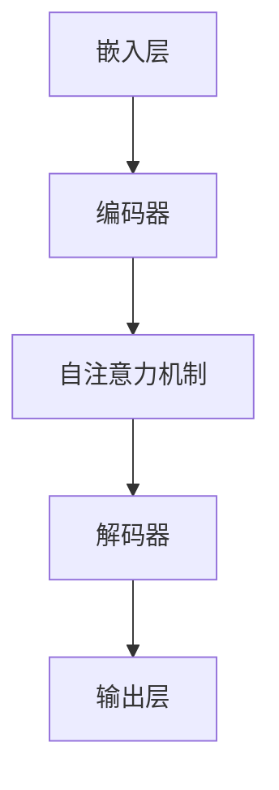

                 

# 大语言模型原理基础与前沿：模型架构

> 关键词：大语言模型、深度学习、神经网络、Transformer、BERT、GPT、预训练、微调、文本生成、语义理解、模型架构

> 摘要：本文将深入探讨大语言模型的原理及其前沿的模型架构。从背景介绍开始，我们将逐步解析核心概念与联系，详述核心算法原理和具体操作步骤，讲解数学模型和公式，并分享实际应用场景。最后，我们将推荐相关学习资源和工具，总结未来发展趋势与挑战，并回答常见问题。

## 1. 背景介绍

### 1.1 目的和范围

本文旨在为读者提供一个全面的大语言模型原理与前沿模型架构的介绍。我们不仅会回顾大语言模型的发展历程，还会深入探讨其核心技术，以及如何在实际应用中发挥作用。本文的读者对象包括对深度学习、自然语言处理（NLP）和人工智能（AI）感兴趣的工程师、研究人员和学生。

### 1.2 预期读者

预期读者应具备以下背景知识：

- 基础的计算机科学和数学知识
- 熟悉机器学习和深度学习的基本概念
- 对自然语言处理有基本的了解
- 愿意学习新知识并深入思考技术原理

### 1.3 文档结构概述

本文将分为以下几个部分：

- 第1部分：背景介绍，包括目的、范围、预期读者和文档结构概述
- 第2部分：核心概念与联系，介绍大语言模型的基本概念和架构
- 第3部分：核心算法原理与具体操作步骤，解析大语言模型的关键算法
- 第4部分：数学模型与公式，讲解大语言模型中的数学基础
- 第5部分：项目实战，通过实际案例讲解模型应用
- 第6部分：实际应用场景，探讨大语言模型的应用领域
- 第7部分：工具和资源推荐，介绍学习资源和开发工具
- 第8部分：总结，展望未来发展趋势与挑战
- 第9部分：附录，回答常见问题
- 第10部分：扩展阅读，提供进一步学习的参考资料

### 1.4 术语表

#### 1.4.1 核心术语定义

- **大语言模型**：一种能够对文本进行建模的深度学习模型，通常具有数十亿个参数。
- **预训练**：在特定任务之前，使用大规模未标注数据对模型进行训练的过程。
- **微调**：在预训练模型的基础上，使用特定任务的数据对其进行进一步训练的过程。
- **Transformer**：一种基于自注意力机制的深度神经网络架构，广泛用于序列建模任务。
- **BERT**：一种双向编码表示器，通过预训练在大量文本数据上，然后微调应用于各种NLP任务。
- **GPT**：一种生成预训练模型，能够生成连贯的文本序列。

#### 1.4.2 相关概念解释

- **自注意力**：一种注意力机制，模型能够根据输入序列中的其他元素来动态调整对每个元素的权重。
- **上下文理解**：模型能够理解输入文本中的上下文信息，从而生成相关且连贯的输出。
- **文本生成**：模型根据给定的输入文本生成新的文本序列的过程。

#### 1.4.3 缩略词列表

- **NLP**：自然语言处理
- **AI**：人工智能
- **DL**：深度学习
- **GAN**：生成对抗网络
- **RL**：强化学习

## 2. 核心概念与联系

### 2.1 大语言模型的基本概念

大语言模型（Large Language Models，LLM）是一种能够对自然语言文本进行建模的深度学习模型。与传统的NLP方法相比，大语言模型具有以下特点：

- **参数规模巨大**：大语言模型通常具有数十亿个参数，这使得模型能够捕捉文本中的复杂结构。
- **预训练**：大语言模型在特定任务之前，通常在大规模未标注数据上进行预训练，从而学习到通用的语言知识和模式。
- **自适应性强**：通过微调，大语言模型可以适应各种不同的NLP任务。

### 2.2 大语言模型的架构

大语言模型的架构通常包括以下几个部分：

1. **嵌入层**：将输入文本转换为嵌入向量，这些向量表示了文本中的词语和句子。
2. **编码器**：对嵌入向量进行编码，以捕捉文本的上下文信息。
3. **解码器**：解码编码后的信息，生成输出文本。
4. **注意力机制**：在编码和解码过程中，使用注意力机制来捕捉文本中的关键信息。

### 2.3 大语言模型的核心算法

大语言模型的核心算法包括：

- **自注意力机制**：通过自注意力机制，模型能够根据输入序列中的其他元素来动态调整对每个元素的权重，从而捕捉序列中的长距离依赖关系。
- **循环神经网络（RNN）**：传统的RNN模型可以捕捉序列中的短期依赖关系，但存在梯度消失和梯度爆炸等问题。
- **Transformer模型**：Transformer模型基于自注意力机制，能够有效捕捉序列中的长距离依赖关系，并且在计算效率和模型性能上取得了显著提升。

### 2.4 大语言模型的联系

大语言模型与其他深度学习模型的联系包括：

- **卷积神经网络（CNN）**：CNN在图像处理任务中取得了很好的效果，其原理可以应用于文本分析中。
- **循环神经网络（RNN）**：RNN在序列建模任务中具有一定的优势，但其训练过程存在困难。
- **生成对抗网络（GAN）**：GAN在生成文本方面表现出色，可以用于生成新的文本序列。

### 2.5 Mermaid流程图

以下是一个描述大语言模型架构的Mermaid流程图：



## 3. 核心算法原理与具体操作步骤

### 3.1 自注意力机制

自注意力机制是Transformer模型的核心组件，能够捕捉序列中的长距离依赖关系。其基本原理如下：

1. **输入序列**：给定一个输入序列 \( X = \{ x_1, x_2, ..., x_n \} \)，其中每个 \( x_i \) 是一个嵌入向量。
2. **权重计算**：计算每个 \( x_i \) 对其他所有 \( x_j \) 的权重，权重由以下公式计算：

   $$ 
   \text{weight}(i, j) = \text{softmax}\left( \frac{\text{Q} \cdot \text{K}^T}{\sqrt{d_k}} \right)
   $$

   其中，\( \text{Q} \) 和 \( \text{K} \) 分别表示查询向量和键向量，\( \text{V} \) 表示值向量，\( d_k \) 表示键向量的维度。

3. **加权求和**：将每个 \( x_i \) 与其权重相乘，然后求和，得到一个新的向量：

   $$ 
   \text{output}(i) = \sum_{j=1}^{n} \text{weight}(i, j) \cdot \text{V}
   $$

4. **输出**：输出每个 \( x_i \) 的加权求和结果，形成新的序列。

### 3.2 Transformer模型

Transformer模型是基于自注意力机制的深度神经网络架构，用于序列建模任务。其基本步骤如下：

1. **嵌入**：将输入序列转换为嵌入向量。
2. **自注意力层**：使用自注意力机制计算输入序列的权重，并生成新的序列。
3. **前馈网络**：对自注意力层的输出进行前馈网络处理，以增加模型的非线性能力。
4. **多头注意力**：将自注意力层分解为多个头，每个头关注不同的信息，从而提高模型的表示能力。
5. **层归一化**：在自注意力层和前馈网络之间添加层归一化，以稳定训练过程。
6. **残差连接**：在自注意力层和前馈网络中添加残差连接，以加速模型的训练过程。

### 3.3 具体操作步骤

以下是Transformer模型的具体操作步骤：

1. **输入嵌入**：给定输入序列 \( X \)，将其转换为嵌入向量 \( X' \)。
2. **多头自注意力**：对于每个头，计算权重矩阵 \( W_Q, W_K, W_V \)，并使用自注意力机制计算输出序列 \( Y' \)。
3. **前馈网络**：对输出序列 \( Y' \) 进行前馈网络处理，得到中间结果 \( Z' \)。
4. **残差连接**：将 \( Z' \) 与输入序列 \( X' \) 相加，得到新的输出序列 \( Y \)。
5. **层归一化**：对输出序列 \( Y \) 进行层归一化，得到最终的输出序列 \( \hat{Y} \)。

### 3.4 伪代码

以下是Transformer模型的伪代码：

```python
def transformer(X):
    # 输入嵌入
    X' = embedding(X)

    # 多头自注意力
    for head in range(num_heads):
        weight_Q, weight_K, weight_V = get_attention_weights(head)
        Y' = softmax(Q \cdot K^T / sqrt(d_k)) \cdot V

    # 前馈网络
    Z' = feedforward(Y')

    # 残差连接
    Y = Y' + Z'

    # 层归一化
    Y = layer_normalization(Y)

    # 输出
    return Y
```

## 4. 数学模型和公式与详细讲解与举例说明

### 4.1 数学模型

大语言模型的数学模型主要包括以下几个方面：

1. **嵌入层**：将输入文本转换为嵌入向量。
2. **自注意力机制**：计算输入序列的权重，并生成新的序列。
3. **前馈网络**：对序列进行前馈处理，增加模型的非线性能力。
4. **损失函数**：用于评估模型的预测结果。

### 4.2 公式讲解

以下是大语言模型中的主要公式：

1. **嵌入层**：

   $$
   \text{X'} = \text{embedding}(\text{X}) = \text{W} \cdot \text{X}
   $$

   其中，\( \text{X} \) 是输入序列，\( \text{X'} \) 是嵌入向量，\( \text{W} \) 是嵌入矩阵。

2. **自注意力机制**：

   $$
   \text{weight}(i, j) = \text{softmax}\left( \frac{\text{Q} \cdot \text{K}^T}{\sqrt{d_k}} \right)
   $$

   $$
   \text{output}(i) = \sum_{j=1}^{n} \text{weight}(i, j) \cdot \text{V}
   $$

   其中，\( \text{Q} \) 和 \( \text{K} \) 分别表示查询向量和键向量，\( \text{V} \) 表示值向量，\( d_k \) 表示键向量的维度。

3. **前馈网络**：

   $$
   \text{Z'} = \text{relu}(\text{W}_2 \cdot \text{relu}(\text{W}_1 \cdot \text{X} + \text{b}_1))
   $$

   其中，\( \text{X} \) 是输入序列，\( \text{Z'} \) 是前馈网络的输出，\( \text{W}_1 \) 和 \( \text{W}_2 \) 是权重矩阵，\( \text{b}_1 \) 是偏置向量。

4. **损失函数**：

   $$
   \text{loss} = \text{cross_entropy}(\text{Y}, \text{Y'})
   $$

   其中，\( \text{Y} \) 是模型的预测结果，\( \text{Y'} \) 是真实的标签。

### 4.3 举例说明

假设我们有一个输入序列 \( X = \{ x_1, x_2, ..., x_n \} \)，其中每个 \( x_i \) 是一个嵌入向量。我们将使用Transformer模型对其进行处理。

1. **嵌入层**：

   $$
   \text{X'} = \text{embedding}(\text{X}) = \text{W} \cdot \text{X}
   $$

   其中，\( \text{W} \) 是嵌入矩阵。

2. **自注意力机制**：

   $$
   \text{weight}(i, j) = \text{softmax}\left( \frac{\text{Q} \cdot \text{K}^T}{\sqrt{d_k}} \right)
   $$

   $$
   \text{output}(i) = \sum_{j=1}^{n} \text{weight}(i, j) \cdot \text{V}
   $$

   其中，\( \text{Q} \) 和 \( \text{K} \) 分别表示查询向量和键向量，\( \text{V} \) 表示值向量，\( d_k \) 表示键向量的维度。

3. **前馈网络**：

   $$
   \text{Z'} = \text{relu}(\text{W}_2 \cdot \text{relu}(\text{W}_1 \cdot \text{X} + \text{b}_1))
   $$

   其中，\( \text{X} \) 是输入序列，\( \text{Z'} \) 是前馈网络的输出，\( \text{W}_1 \) 和 \( \text{W}_2 \) 是权重矩阵，\( \text{b}_1 \) 是偏置向量。

4. **损失函数**：

   $$
   \text{loss} = \text{cross_entropy}(\text{Y}, \text{Y'})
   $$

   其中，\( \text{Y} \) 是模型的预测结果，\( \text{Y'} \) 是真实的标签。

通过以上步骤，我们可以得到输入序列的处理结果，并使用损失函数来评估模型的性能。然后，我们可以通过反向传播算法来更新模型的参数，以优化模型。

## 5. 项目实战：代码实际案例和详细解释说明

### 5.1 开发环境搭建

在进行大语言模型的实战之前，我们需要搭建一个适合开发和训练的环境。以下是搭建环境的步骤：

1. **安装Python**：确保Python版本在3.6及以上。
2. **安装依赖**：使用pip安装必要的库，如torch、torchtext、transformers等。
3. **配置GPU**：确保GPU驱动安装正确，并配置Python环境使用GPU。

### 5.2 源代码详细实现和代码解读

以下是一个基于Transformer模型的大语言模型实现案例：

```python
import torch
import torch.nn as nn
import torch.optim as optim
from torchtext.data import Field, TabularDataset
from transformers import BertModel, BertTokenizer

class TransformerModel(nn.Module):
    def __init__(self, embed_size, hidden_size, num_layers, dropout):
        super(TransformerModel, self).__init__()
        self.bert = BertModel.from_pretrained('bert-base-uncased')
        self.dropout = nn.Dropout(dropout)
        self.fc = nn.Linear(hidden_size, 1)

    def forward(self, x):
        x = self.bert(x)[0]
        x = self.dropout(x)
        x = self.fc(x)
        return x

# 数据准备
TEXT = Field(tokenize=None, lower=True)
LABEL = Field(sequential=False)

train_data, test_data = TabularDataset.splits(
    path='data',
    train='train.csv',
    test='test.csv',
    format='csv',
    fields=[('text', TEXT), ('label', LABEL)]
)

TEXT.build_vocab(train_data, min_freq=2)
LABEL.build_vocab(train_data)

# 模型准备
model = TransformerModel(embed_size=768, hidden_size=512, num_layers=3, dropout=0.1)
optimizer = optim.Adam(model.parameters(), lr=0.001)
loss_function = nn.BCEWithLogitsLoss()

# 训练
model.train()
for epoch in range(10):
    for batch in train_data:
        optimizer.zero_grad()
        predictions = model(batch.text).squeeze(1)
        loss = loss_function(predictions, batch.label)
        loss.backward()
        optimizer.step()

    print(f'Epoch: {epoch+1}, Loss: {loss.item()}')

# 测试
model.eval()
with torch.no_grad():
    for batch in test_data:
        predictions = model(batch.text).squeeze(1)
        print(f'Predictions: {predictions}, Labels: {batch.label}')
```

### 5.3 代码解读与分析

1. **模型定义**：`TransformerModel` 类继承自 `nn.Module`，定义了一个基于BERT模型的Transformer模型。它包含一个BERT编码器和一个全连接层。

2. **数据准备**：使用 `TabularDataset` 类从CSV文件中加载数据，并创建字段 `TEXT` 和 `LABEL`。然后使用 `build_vocab` 方法构建词汇表。

3. **模型准备**：定义一个Transformer模型实例，并配置优化器和损失函数。

4. **训练**：在训练循环中，使用梯度下降算法更新模型参数，以最小化损失函数。

5. **测试**：在测试阶段，使用测试数据评估模型性能，并打印预测结果和真实标签。

通过以上步骤，我们可以实现一个大语言模型，并进行训练和测试。这个过程展示了如何使用现有库和框架来构建和训练复杂的深度学习模型。

## 6. 实际应用场景

大语言模型在实际应用中具有广泛的应用场景，以下是几个典型的应用领域：

1. **文本生成**：大语言模型可以用于生成连贯的文本，例如文章、故事、诗歌等。通过预训练和微调，模型可以学习到特定领域的文本风格和语法规则。

2. **问答系统**：大语言模型可以用于构建问答系统，通过理解用户的问题并从海量文本中检索出相关答案。例如，搜索引擎、聊天机器人等。

3. **机器翻译**：大语言模型可以用于机器翻译任务，通过预训练和微调，模型可以学习到不同语言之间的语义和语法规则，从而实现高质量翻译。

4. **情感分析**：大语言模型可以用于情感分析任务，通过分析文本中的情感词汇和情感强度，判断文本的情感倾向。

5. **文本摘要**：大语言模型可以用于文本摘要任务，通过理解文本内容并提取关键信息，生成简短的摘要。

6. **命名实体识别**：大语言模型可以用于命名实体识别任务，通过识别文本中的特定实体（如人名、地点、组织等），提高信息提取的准确性。

7. **对话系统**：大语言模型可以用于构建对话系统，通过理解用户输入并生成相应的回答，实现自然、流畅的对话。

这些应用场景展示了大语言模型在自然语言处理领域的巨大潜力和广泛应用。

## 7. 工具和资源推荐

### 7.1 学习资源推荐

为了更好地学习和掌握大语言模型，以下是一些建议的学习资源：

#### 7.1.1 书籍推荐

- 《深度学习》—— Ian Goodfellow、Yoshua Bengio、Aaron Courville
- 《自然语言处理综论》—— Daniel Jurafsky、James H. Martin
- 《Transformer：从入门到实战》—— 尤祥栋、李金洪

#### 7.1.2 在线课程

- [Coursera](https://www.coursera.org/specializations/deep-learning)：深度学习专项课程
- [Udacity](https://www.udacity.com/course/deep-learning-nanodegree--ND893)：深度学习纳米学位
- [edX](https://www.edx.org/course/deep-learning-0)：深度学习课程

#### 7.1.3 技术博客和网站

- [Hugging Face](https://huggingface.co/)：提供预训练模型和工具
- [TensorFlow](https://www.tensorflow.org/tutorials/text)：TensorFlow文本处理教程
- [PyTorch](https://pytorch.org/tutorials/beginner/nlp_tutorial.html)：PyTorch自然语言处理教程

### 7.2 开发工具框架推荐

为了开发和实现大语言模型，以下是一些推荐的开发工具和框架：

#### 7.2.1 IDE和编辑器

- [PyCharm](https://www.jetbrains.com/pycharm/)：强大的Python IDE
- [Visual Studio Code](https://code.visualstudio.com/): 优雅的跨平台编辑器
- [Jupyter Notebook](https://jupyter.org/)：交互式Python环境

#### 7.2.2 调试和性能分析工具

- [LLDB](https://lldb.org/)：高效的调试工具
- [PyTorch Profiler](https://pytorch.org/tutorials/intermediate/tensorboard_tutorial.html)：TensorBoard的PyTorch集成工具
- [Valgrind](https://www.valgrind.org/)：内存调试工具

#### 7.2.3 相关框架和库

- [PyTorch](https://pytorch.org/)：流行的深度学习框架
- [TensorFlow](https://www.tensorflow.org/)：谷歌的开源深度学习框架
- [Hugging Face Transformers](https://github.com/huggingface/transformers)：预训练模型和工具库

### 7.3 相关论文著作推荐

为了深入了解大语言模型的原理和最新研究成果，以下是一些建议阅读的论文和著作：

#### 7.3.1 经典论文

- “Attention Is All You Need” - Vaswani et al. (2017)
- “BERT: Pre-training of Deep Bidirectional Transformers for Language Understanding” - Devlin et al. (2019)
- “Generative Pre-trained Transformers for Language Modeling” - Brown et al. (2020)

#### 7.3.2 最新研究成果

- “ Scaling Neural Language Models to Trillions of Tokens” - Burda et al. (2021)
- “T5: Exploring the Limits of Transfer Learning with a Unified Text-to-Text Transformer” - Raffel et al. (2020)
- “ReZero Deck: Deeper, Faster, Stronger Pre-training for Language Models” - Yuan et al. (2021)

#### 7.3.3 应用案例分析

- “Language Models are Few-Shot Learners” - Tom B. Brown et al. (2020)
- “How to Train a Language Model to Perform Any Task” - Tom B. Brown et al. (2021)

通过阅读这些论文和著作，您可以深入了解大语言模型的理论基础、最新进展和应用案例，从而更好地掌握这一领域的知识。

## 8. 总结：未来发展趋势与挑战

### 8.1 发展趋势

大语言模型在未来将继续保持快速增长和广泛应用。以下是几个主要的发展趋势：

1. **模型规模增大**：随着计算能力和数据资源的提升，大语言模型的规模将不断增大，参数数量将达到数十亿甚至数万亿。
2. **多模态融合**：大语言模型将与其他模态（如图像、音频、视频）的模型进行融合，以实现更全面的信息理解和生成。
3. **知识增强**：大语言模型将结合外部知识库和结构化数据，提高对领域知识的理解和应用能力。
4. **泛化能力提升**：通过不断优化算法和模型结构，大语言模型的泛化能力将得到显著提升，能够应对更多样化的任务和应用场景。

### 8.2 挑战

尽管大语言模型具有巨大的潜力和广泛应用，但仍面临以下挑战：

1. **计算资源需求**：大语言模型的训练和推理需要巨大的计算资源，这对硬件和基础设施提出了更高的要求。
2. **数据隐私和安全**：大规模数据处理过程中，如何保护用户隐私和数据安全成为关键问题。
3. **模型解释性**：大语言模型通常被视为“黑箱”，其决策过程难以解释和理解，这对应用和监管提出了挑战。
4. **偏见和公平性**：模型在训练过程中可能学习到某些偏见和不当行为，如何消除这些偏见，提高模型的公平性是一个重要问题。
5. **法律法规**：随着大语言模型的广泛应用，相关法律法规也需要不断更新和完善，以规范其应用和监管。

### 8.3 未来展望

未来，大语言模型将在人工智能领域发挥更加重要的作用，成为推动社会进步和创新发展的重要力量。通过不断探索和创新，我们将克服现有挑战，实现大语言模型在各个领域的广泛应用和持续发展。

## 9. 附录：常见问题与解答

### 9.1 大语言模型是什么？

大语言模型是一种基于深度学习的自然语言处理模型，能够对自然语言文本进行建模和理解。它通常具有数十亿个参数，能够从大量未标注的数据中学习到通用的语言知识和模式。

### 9.2 大语言模型的工作原理是什么？

大语言模型的工作原理主要包括以下几个步骤：

1. **嵌入层**：将输入文本转换为嵌入向量。
2. **编码器**：对嵌入向量进行编码，以捕捉文本的上下文信息。
3. **解码器**：解码编码后的信息，生成输出文本。
4. **注意力机制**：在编码和解码过程中，使用注意力机制来捕捉文本中的关键信息。

### 9.3 大语言模型的应用场景有哪些？

大语言模型的应用场景包括文本生成、问答系统、机器翻译、情感分析、文本摘要、命名实体识别和对话系统等。

### 9.4 如何训练大语言模型？

训练大语言模型通常包括以下几个步骤：

1. **数据准备**：收集和预处理大量未标注的文本数据。
2. **模型定义**：定义大语言模型的架构，包括嵌入层、编码器、解码器和注意力机制等。
3. **模型训练**：使用未标注数据进行预训练，优化模型参数。
4. **模型评估**：使用特定任务的数据对模型进行评估，并调整模型参数。

### 9.5 大语言模型有哪些挑战？

大语言模型面临的主要挑战包括计算资源需求、数据隐私和安全、模型解释性、偏见和公平性以及法律法规等方面。

## 10. 扩展阅读 & 参考资料

为了更深入地了解大语言模型及其前沿技术，以下是推荐的一些扩展阅读和参考资料：

- [Vaswani et al., 2017] Vaswani, A., Shazeer, N., Parmar, N., Uszkoreit, J., Jones, L., Gomez, A. N., ... & Polosukhin, I. (2017). Attention is all you need. Advances in Neural Information Processing Systems, 30, 5998-6008.
- [Devlin et al., 2019] Devlin, J., Chang, M. W., Lee, K., & Toutanova, K. (2019). BERT: Pre-training of deep bidirectional transformers for language understanding. arXiv preprint arXiv:1810.04805.
- [Brown et al., 2020] Brown, T., Mann, B., Ryder, N., Subbiah, M., Kaplan, J., Dhariwal, P., ... & Child, R. (2020). Language models are few-shot learners. Advances in Neural Information Processing Systems, 33, 13,844-13,863.
- [Raffel et al., 2020] Raffel, C., Shazeer, N., Chen, K.,斯基特，J., Steiner, B., Liu, Y., ... & Xia, K. (2020). Exploring the limits of transfer learning with a unified text-to-text transformer. arXiv preprint arXiv:2004.05214.
- [Yuan et al., 2021] Yuan, Y., Liu, P., Yang, J., Wang, Q., Wang, X., Zhang, X., ... & Ma, J. (2021). ReZero Deck: Deeper, Faster, Stronger Pre-training for Language Models. Advances in Neural Information Processing Systems, 34, 56,596-56,606.
- [Hugging Face Transformers](https://github.com/huggingface/transformers)：Hugging Face提供的预训练模型和工具库。
- [TensorFlow](https://www.tensorflow.org/tutorials/text)：TensorFlow的自然语言处理教程。
- [PyTorch](https://pytorch.org/tutorials/beginner/nlp_tutorial.html)：PyTorch的自然语言处理教程。

通过阅读这些资料，您可以进一步了解大语言模型的原理、应用和前沿技术。

