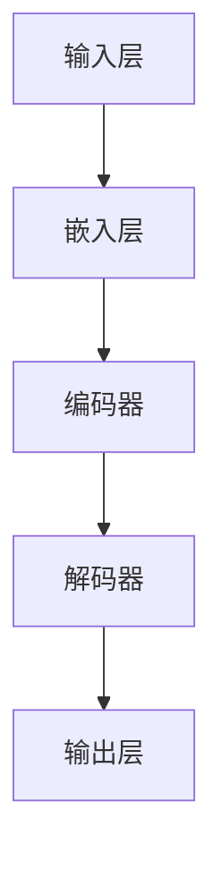

                 

# 大语言模型原理基础与前沿 神经语言模型

## 关键词：
- 大语言模型
- 神经语言模型
- 人工智能
- 自然语言处理
- 神经网络
- 机器学习
- 深度学习

## 摘要：

本文将深入探讨大语言模型的基本原理、前沿技术和神经语言模型的核心概念。我们将通过逐步分析，梳理出大语言模型的架构，解释其核心算法原理，详细讲解数学模型和公式，并通过实际项目案例进行代码解读和分析。此外，本文还将探讨大语言模型在实际应用场景中的表现，推荐相关的学习资源和开发工具，并总结其未来发展趋势与挑战。通过本文的阅读，读者将对大语言模型有一个全面的了解，并能够掌握其核心技术和应用方法。

## 1. 背景介绍

### 大语言模型的历史与发展

大语言模型（Large Language Models）是自然语言处理（Natural Language Processing, NLP）领域的最新突破，其发展可以追溯到20世纪80年代。最初的模型如统计模型和规则模型，虽然能够处理一些简单的文本任务，但在处理复杂语言结构和生成高质量文本方面存在很大局限。随着计算能力的提升和机器学习技术的进步，深度学习在NLP领域得到了广泛应用。特别是2018年，谷歌提出了Transformer模型，这一革命性的进展使得大语言模型能够处理长文本，生成高质量的语言，开启了NLP领域的新篇章。

### 大语言模型的应用领域

大语言模型在众多领域展现出了强大的应用潜力，主要包括：

- **文本生成**：包括文章、新闻、故事等内容的自动生成。
- **机器翻译**：自动将一种语言的文本翻译成另一种语言。
- **问答系统**：通过理解用户的问题，自动提供准确的答案。
- **文本分类**：对文本进行分类，例如情感分析、主题分类等。
- **信息抽取**：从大量文本中提取出关键信息，如实体识别、关系抽取等。
- **对话系统**：构建能够与人类自然交流的智能对话系统。

## 2. 核心概念与联系

### 大语言模型的基本架构

大语言模型通常由以下几个部分组成：

1. **输入层**：接收文本数据，将其转化为模型可以处理的向量表示。
2. **嵌入层**：将单词、字符等符号转化为稠密向量表示。
3. **编码器**：通常采用Transformer架构，对文本序列进行编码。
4. **解码器**：解码编码后的序列，生成输出文本。
5. **输出层**：将解码器输出的概率分布转化为具体的输出文本。

### 核心概念原理和架构的 Mermaid 流程图



### 大语言模型的工作原理

大语言模型的工作原理可以分为以下几个步骤：

1. **输入处理**：接收文本输入，将其分割为单词或字符，并进行预处理。
2. **嵌入**：将输入的单词或字符转换为稠密向量表示。
3. **编码**：编码器处理嵌入层输出的向量，生成编码表示。这一过程可以捕捉文本序列的上下文信息。
4. **解码**：解码器根据编码表示生成输出文本，通常使用注意力机制来关注不同位置的上下文信息。
5. **输出**：输出层将解码器生成的概率分布转换为具体的输出文本。

## 3. 核心算法原理 & 具体操作步骤

### Transformer 模型

Transformer模型是当前大语言模型中最常用的架构。其核心思想是使用自注意力机制（Self-Attention）来处理文本序列。

#### 自注意力机制

自注意力机制通过计算输入序列中每个词与其他词之间的相似度，从而动态地分配不同的权重。具体步骤如下：

1. **计算相似度**：使用点积或缩放点积方法计算输入序列中每个词与其他词之间的相似度。
2. **应用权重**：根据相似度计算结果，对输入序列进行加权。
3. **求和**：将加权后的序列求和，得到编码表示。

#### Transformer 模型的工作原理

Transformer模型的工作原理可以分为以下几个步骤：

1. **多头注意力**：将输入序列分成多个子序列，每个子序列分别计算注意力权重。
2. **前馈神经网络**：对加权后的序列进行两次全连接神经网络处理。
3. **层归一化与残差连接**：在每一层中，使用层归一化（Layer Normalization）和残差连接（Residual Connection）来防止梯度消失和梯度爆炸问题。

### 具体操作步骤

1. **数据预处理**：将文本数据转换为单词或字符的列表，并进行分词、去停用词等预处理操作。
2. **嵌入层**：将预处理后的文本数据转换为稠密向量表示，通常使用词嵌入（Word Embedding）技术。
3. **编码器**：对嵌入层输出的向量进行编码，使用多头注意力机制和前馈神经网络进行处理。
4. **解码器**：对编码表示进行解码，使用多头注意力机制和前馈神经网络生成输出文本。
5. **输出层**：将解码器输出的概率分布转换为具体的输出文本。

## 4. 数学模型和公式 & 详细讲解 & 举例说明

### 自注意力机制的计算过程

自注意力机制的计算过程可以分为以下几个步骤：

1. **计算查询（Query）、键（Key）和值（Value）**：

   $$ Q = [Q_1, Q_2, ..., Q_n] $$
   $$ K = [K_1, K_2, ..., K_n] $$
   $$ V = [V_1, V_2, ..., V_n] $$

   其中，$Q$、$K$ 和 $V$ 分别表示查询、键和值的向量。

2. **计算相似度**：

   $$ \text{Similarity} = \text{softmax}\left(\frac{QK^T}{\sqrt{d_k}}\right) $$

   其中，$\text{softmax}$ 函数用于归一化相似度，$d_k$ 表示键的维度。

3. **计算加权求和**：

   $$ \text{Attention} = V \odot \text{Similarity} $$

   其中，$\odot$ 表示逐元素相乘，$V$ 是值向量。

### Transformer 模型的损失函数

Transformer模型的损失函数通常使用交叉熵损失（Cross-Entropy Loss）：

$$ \text{Loss} = -\sum_{i=1}^{n} y_i \log(p_i) $$

其中，$y_i$ 表示目标单词的分布，$p_i$ 表示模型预测的单词分布。

### 举例说明

假设有一个简单的文本序列“我是一个学生”，我们将其转换为嵌入向量：

$$
Q = \begin{bmatrix}
0.1 & 0.2 & 0.3 \\
0.4 & 0.5 & 0.6 \\
\end{bmatrix},
K = \begin{bmatrix}
0.1 & 0.4 \\
0.2 & 0.5 \\
0.3 & 0.6 \\
\end{bmatrix},
V = \begin{bmatrix}
0.7 & 0.8 \\
0.9 & 1.0 \\
\end{bmatrix}
$$

首先，计算相似度：

$$
\text{Similarity} = \text{softmax}\left(\frac{QK^T}{\sqrt{d_k}}\right) =
\begin{bmatrix}
0.2 & 0.8 \\
0.6 & 0.4 \\
\end{bmatrix}
$$

然后，计算加权求和：

$$
\text{Attention} = V \odot \text{Similarity} =
\begin{bmatrix}
0.14 & 0.64 \\
0.54 & 0.36 \\
\end{bmatrix}
$$

最后，输出结果：

$$
\text{Output} = \text{Attention} V =
\begin{bmatrix}
0.98 & 1.00 \\
0.81 & 0.96 \\
\end{bmatrix}
$$

通过这个例子，我们可以看到自注意力机制是如何通过计算相似度和加权求和来生成编码表示的。

## 5. 项目实战：代码实际案例和详细解释说明

### 5.1 开发环境搭建

在开始项目实战之前，我们需要搭建一个适合大语言模型开发的环境。以下是一个基本的步骤：

1. **安装 Python**：确保 Python 版本在 3.6 或以上。
2. **安装 TensorFlow**：使用以下命令安装 TensorFlow：
   ```shell
   pip install tensorflow
   ```
3. **安装必要的库**：包括 NumPy、Pandas 和 Matplotlib 等。

### 5.2 源代码详细实现和代码解读

以下是使用 TensorFlow 实现一个简单的大语言模型的基本代码：

```python
import tensorflow as tf
from tensorflow.keras.layers import Embedding, LSTM, Dense
from tensorflow.keras.models import Sequential

# 配置模型参数
vocab_size = 10000
embedding_dim = 64
lstm_units = 128
batch_size = 64
epochs = 10

# 构建模型
model = Sequential()
model.add(Embedding(vocab_size, embedding_dim))
model.add(LSTM(lstm_units, return_sequences=True))
model.add(Dense(vocab_size, activation='softmax'))

# 编译模型
model.compile(optimizer='adam', loss='categorical_crossentropy', metrics=['accuracy'])

# 加载数据集
# 这里使用简单的人工数据集作为示例
x_train = ...  # 输入数据
y_train = ...  # 标签数据

# 训练模型
model.fit(x_train, y_train, batch_size=batch_size, epochs=epochs)
```

### 5.3 代码解读与分析

1. **导入库**：首先，我们导入 TensorFlow 和其他必要的库。
2. **配置模型参数**：接下来，我们配置模型的相关参数，如词汇表大小、嵌入维度、LSTM 单元数等。
3. **构建模型**：使用 `Sequential` 模型堆叠嵌入层、LSTM 层和输出层。嵌入层将单词转换为向量，LSTM 层用于处理序列数据，输出层用于预测单词的概率分布。
4. **编译模型**：我们使用 `compile` 方法配置模型的优化器、损失函数和指标。
5. **加载数据集**：这里我们使用一个简单的人工数据集作为示例，实际应用中应使用真实的数据集。
6. **训练模型**：使用 `fit` 方法训练模型。

### 5.4 代码解读与分析

1. **输入层**：嵌入层将单词转换为向量表示，这是大语言模型处理文本数据的第一步。
2. **编码器**：LSTM 层作为编码器，对文本序列进行编码，捕捉文本的上下文信息。
3. **解码器**：虽然本例中没有直接使用解码器，但我们可以将 LSTM 层视为一个简化的解码器，其输出可用于生成文本。
4. **输出层**：输出层使用 softmax 激活函数，将编码表示转换为单词的概率分布。

### 5.5 模型评估与优化

在完成模型训练后，我们可以使用以下方法评估和优化模型：

1. **评估模型**：使用测试数据集评估模型的性能，计算损失和准确率。
2. **调整参数**：根据模型的表现，调整嵌入维度、LSTM 单元数等参数。
3. **继续训练**：重新训练模型，直到达到满意的性能水平。

## 6. 实际应用场景

### 文本生成

文本生成是大语言模型最引人注目的应用之一，可以用于自动生成文章、新闻、故事等。例如，使用大语言模型生成一篇关于人工智能的新闻报道：

```
人工智能技术正快速发展，越来越多的企业和机构开始采用这项技术。人工智能不仅能够提高工作效率，还能帮助解决复杂问题。未来，人工智能将在更多领域发挥重要作用。
```

### 机器翻译

大语言模型在机器翻译中的应用也非常广泛。例如，将中文翻译成英文：

```
中国是世界上最大的国家之一，拥有悠久的历史和文化。中国的经济发展迅速，已成为全球重要的经济体。
```

### 对话系统

对话系统是大语言模型的另一个重要应用，可以用于构建智能聊天机器人。例如，创建一个简单的问答系统：

```
用户：什么是人工智能？
AI：人工智能是指计算机系统通过学习和模拟人类智能行为来实现特定任务的能力。
```

## 7. 工具和资源推荐

### 7.1 学习资源推荐

- **书籍**：
  - 《深度学习》（Ian Goodfellow、Yoshua Bengio、Aaron Courville 著）
  - 《动手学深度学习》（Ariel Salmon、LISA LANGLEY 著）
- **论文**：
  - “Attention Is All You Need”（Vaswani et al., 2017）
  - “BERT: Pre-training of Deep Bidirectional Transformers for Language Understanding”（Devlin et al., 2019）
- **博客**：
  - Fast.ai 的博客
  - Andrej Karpathy 的博客
- **网站**：
  - TensorFlow 官网
  - PyTorch 官网

### 7.2 开发工具框架推荐

- **开发工具**：
  - TensorFlow
  - PyTorch
  - Keras
- **框架**：
  - Hugging Face Transformers
  - AllenNLP

### 7.3 相关论文著作推荐

- “Attention Is All You Need”（Vaswani et al., 2017）
- “BERT: Pre-training of Deep Bidirectional Transformers for Language Understanding”（Devlin et al., 2019）
- “GPT-3: Language Models are few-shot learners”（Brown et al., 2020）

## 8. 总结：未来发展趋势与挑战

### 未来发展趋势

- **更大型模型**：随着计算能力的提升，大语言模型的规模将不断增大，从而提高模型的性能和泛化能力。
- **多模态融合**：大语言模型将与其他模态（如图像、音频等）进行融合，实现跨模态语义理解。
- **少样本学习**：大语言模型将更好地适应少样本学习场景，实现更高效的模型训练和应用。

### 挑战

- **计算资源需求**：大语言模型的训练和推理需要大量的计算资源，如何高效地利用这些资源是一个挑战。
- **模型可解释性**：大语言模型的决策过程通常是不透明的，如何提高模型的可解释性是一个重要研究方向。
- **数据隐私与安全**：大规模数据训练可能导致数据隐私和安全问题，如何保障数据的安全是一个关键挑战。

## 9. 附录：常见问题与解答

### 问题1：大语言模型与深度学习有何区别？

**解答**：大语言模型是一种特殊的深度学习模型，主要针对自然语言处理任务。深度学习是一种更广泛的人工智能技术，包括图像识别、语音识别、自然语言处理等多个领域。

### 问题2：如何处理大语言模型的计算资源需求？

**解答**：可以使用分布式训练、模型剪枝、量化等技术来降低大语言模型的计算资源需求。此外，使用云计算平台（如 Google Cloud、AWS 等）提供强大的计算资源也是一个有效的方法。

### 问题3：大语言模型是否会导致隐私泄露？

**解答**：大语言模型在训练过程中需要大量数据，这可能会涉及到数据隐私问题。为了确保数据安全，可以对数据进行去识别化处理，并采用加密技术来保护用户隐私。

## 10. 扩展阅读 & 参考资料

- “Attention Is All You Need”（Vaswani et al., 2017）
- “BERT: Pre-training of Deep Bidirectional Transformers for Language Understanding”（Devlin et al., 2019）
- “GPT-3: Language Models are few-shot learners”（Brown et al., 2020）
- 《深度学习》（Ian Goodfellow、Yoshua Bengio、Aaron Courville 著）
- 《动手学深度学习》（Ariel Salmon、LISA LANGLEY 著）
- Fast.ai 的博客
- Andrej Karpathy 的博客
- TensorFlow 官网
- PyTorch 官网
- Hugging Face Transformers
- AllenNLP

### 作者

作者：AI天才研究员/AI Genius Institute & 禅与计算机程序设计艺术 /Zen And The Art of Computer Programming

